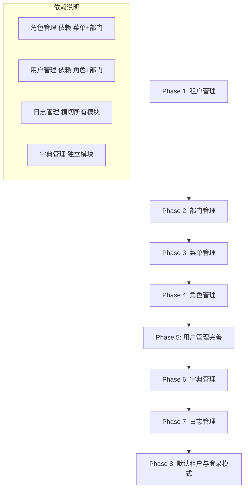
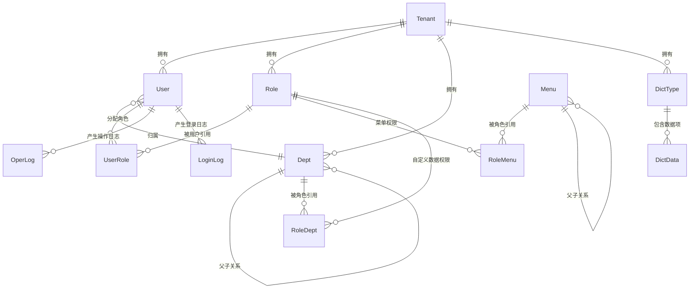

> **⚠️ 部分内容已过期（2026-09-01）**：本仓库已拿掉多租户机制，本文中所有 `tenant_id`
> 自动追加、租户表分类、`sys_tenant` 表相关描述均已不适用。8 个子模块中「租户管理」
> 已整体删除，其余均已完成实现（去掉 tenant_id 维度）。
> 原因见 `doc/design/modules/core/去多租户化-概要设计.md`。

# RBAC 完整实现 — 高层设计文档

## 概述

本设计文档是 RBAC 模块剩余功能的高层概览，覆盖 8 个子模块的整体架构、模块依赖、集成点和正确性属性。每个子模块的详细设计（数据库、接口、时序图、测试用例等）已在独立文档中完成，本文档仅做概览和引用，不重复详细设计内容。

技术栈：
- 后端：Spring Boot 3 + MyBatis-Flex 1.11.6 + Sa-Token 1.38.0 + PostgreSQL
- 前端：React 18 + Ant Design 5 + Zustand + TanStack Query + React Router 6

开发指南：`doc/guide/RBAC模块开发指南.md`

## 架构

### 模块依赖关系与开发顺序

8 个模块按依赖关系分为 8 个 Phase，严格按顺序开发：



### 模块总览

| Phase | 模块 | 表类型 | 核心表 | 接口数 | 后端详细设计 | 前端详细设计 |
|-------|------|--------|--------|--------|-------------|-------------|
| 1 | 租户管理 | 全局表 | sys_tenant | 7+1 | `doc/design/modules/rbac/modules/租户管理/后端详细设计.md` | `doc/design/modules/rbac/modules/租户管理/前端详细设计.md` |
| 2 | 部门管理 | 租户表 | sys_dept | 5 | `doc/design/modules/rbac/modules/部门管理/后端详细设计.md` | `doc/design/modules/rbac/modules/部门管理/前端详细设计.md` |
| 3 | 菜单管理 | 全局表 | sys_menu, sys_role_menu | 5 | `doc/design/modules/rbac/modules/菜单管理/后端详细设计.md` | `doc/design/modules/rbac/modules/菜单管理/前端详细设计.md` |
| 4 | 角色管理 | 租户表+全局关联表 | sys_role, sys_role_menu, sys_role_dept | 9 | `doc/design/modules/rbac/modules/角色管理/后端详细设计.md` | `doc/design/modules/rbac/modules/角色管理/前端详细设计.md` |
| 5 | 用户管理完善 | 租户表 | sys_user, sys_user_role | 8+4 | `doc/design/modules/rbac/modules/用户管理/后端详细设计.md` | `doc/design/modules/rbac/modules/用户管理/前端详细设计.md` |
| 6 | 字典管理 | 租户表 | sys_dict_type, sys_dict_data | 9 | `doc/design/modules/rbac/modules/字典管理/后端详细设计.md` | `doc/design/modules/rbac/modules/字典管理/前端详细设计.md` |
| 7 | 日志管理 | 租户表 | sys_oper_log, sys_login_log | 10 | `doc/design/modules/rbac/modules/日志管理/后端详细设计.md` | `doc/design/modules/rbac/modules/日志管理/前端详细设计.md` |
| 8 | 默认租户与登录模式 | — | — | 1修改+1新增 | `doc/design/modules/rbac/modules/租户管理/默认租户与登录模式-详细设计.md` | `doc/design/modules/rbac/modules/租户管理/默认租户与登录模式-前端详细设计.md` |

## 组件和接口

### 各模块关键接口清单

#### Phase 1: 租户管理（7+1 个接口）

| 接口编号 | 方法 | 路径 | 权限标识 |
|---------|------|------|---------|
| TENANT-001 | GET | /api/v1/tenants | system:tenant:list |
| TENANT-002 | GET | /api/v1/tenants/{id} | system:tenant:list |
| TENANT-003 | POST | /api/v1/tenants | system:tenant:add |
| TENANT-004 | PUT | /api/v1/tenants/{id} | system:tenant:edit |
| TENANT-005 | DELETE | /api/v1/tenants/{id} | system:tenant:remove |
| TENANT-006 | PUT | /api/v1/tenants/{id}/config | system:tenant:config |
| TENANT-007 | PUT | /api/v1/tenants/{id}/status | system:tenant:edit |
| TENANT-009 | GET | /api/v1/tenants/options | 公开 |

> 详见：`doc/design/modules/rbac/modules/租户管理/后端详细设计.md` §七

#### Phase 2: 部门管理（5 个接口）

| 接口编号 | 方法 | 路径 | 权限标识 |
|---------|------|------|---------|
| API-001 | GET | /api/v1/depts | system:dept:list |
| API-002 | GET | /api/v1/depts/{id} | system:dept:list |
| API-003 | POST | /api/v1/depts | system:dept:add |
| API-004 | PUT | /api/v1/depts/{id} | system:dept:edit |
| API-005 | DELETE | /api/v1/depts/{id} | system:dept:remove |

> 详见：`doc/design/modules/rbac/modules/部门管理/后端详细设计.md` §七

#### Phase 3: 菜单管理（5 个接口）

| 接口编号 | 方法 | 路径 | 权限标识 |
|---------|------|------|---------|
| API-001 | GET | /api/v1/menus | system:menu:list |
| API-002 | GET | /api/v1/menus/{id} | system:menu:list |
| API-003 | POST | /api/v1/menus | system:menu:add |
| API-004 | PUT | /api/v1/menus/{id} | system:menu:edit |
| API-005 | DELETE | /api/v1/menus/{id} | system:menu:remove |

> 详见：`doc/design/modules/rbac/modules/菜单管理/后端详细设计.md` §七

#### Phase 4: 角色管理（9 个接口）

| 接口编号 | 方法 | 路径 | 权限标识 |
|---------|------|------|---------|
| API-001 | GET | /api/v1/roles | system:role:list |
| API-002 | GET | /api/v1/roles/{id} | system:role:list |
| API-003 | POST | /api/v1/roles | system:role:add |
| API-004 | PUT | /api/v1/roles/{id} | system:role:edit |
| API-005 | DELETE | /api/v1/roles/{id} | system:role:remove |
| API-006 | PUT | /api/v1/roles/{id}/menus | system:role:assignMenu |
| API-007 | PUT | /api/v1/roles/{id}/data-scope | system:role:assignDataScope |
| API-008 | GET | /api/v1/roles/{id}/users | system:role:list |
| API-009 | PUT | /api/v1/roles/{id}/status | system:role:edit |

> 详见：`doc/design/modules/rbac/modules/角色管理/后端详细设计.md` §七

#### Phase 5: 用户管理（8 + 4 个接口）

| 接口编号 | 方法 | 路径 | 权限标识 |
|---------|------|------|---------|
| AUTH-001 | POST | /api/v1/auth/login | 公开 |
| AUTH-002 | POST | /api/v1/auth/logout | 仅需认证 |
| AUTH-003 | GET | /api/v1/auth/user-info | 仅需认证 |
| AUTH-004 | PUT | /api/v1/auth/password | 仅需认证 |
| USER-001~008 | — | /api/v1/users/* | system:user:* |

> 详见：`doc/design/modules/rbac/modules/用户管理/后端详细设计.md` §七

#### Phase 6: 字典管理（9 个接口）

| 接口编号 | 方法 | 路径 | 权限标识 |
|---------|------|------|---------|
| DICT-001~004 | — | /api/v1/dict/types/* | system:dict:* |
| DICT-005~008 | — | /api/v1/dict/types/{dictType}/data, /api/v1/dict/data/{id} | system:dict:* |
| DICT-009 | DELETE | /api/v1/dict/cache | system:dict:edit |

> 详见：`doc/design/modules/rbac/modules/字典管理/后端详细设计.md` §七

#### Phase 7: 日志管理（10 个接口）

| 接口编号 | 方法 | 路径 | 权限标识 |
|---------|------|------|---------|
| LOG-001~004 | — | /api/v1/logs/operation/* | monitor:operlog:* |
| LOG-005~008 | — | /api/v1/logs/login/* | monitor:loginlog:* |
| LOG-009 | GET | /api/v1/online-users | monitor:online:list |
| LOG-010 | DELETE | /api/v1/online-users/{tokenId} | monitor:online:forceLogout |

> 详见：`doc/design/modules/rbac/modules/日志管理/后端详细设计.md` §七

### 模块间依赖关系

```mermaid
flowchart TD
    subgraph 编排模块
        Tenant[租户管理]
    end

    subgraph 核心模块
        User[用户管理]
        Role[角色管理]
        Menu[菜单管理]
        Dept[部门管理]
    end

    subgraph 辅助模块
        Dict[字典管理]
        Log[日志管理]
    end

    subgraph 公共基础设施
        SaToken[Sa-Token]
        TenantInterceptor[多租户拦截器]
        DataScope[数据权限拦截器]
        LogAspect[@Log AOP 切面]
        AutoFill[自动填充处理器]
    end

    Tenant -->|编排创建默认部门| Dept
    Tenant -->|编排创建管理员角色| Role
    Tenant -->|编排创建admin用户| User
    Tenant -->|编排分配所有菜单| Menu

    User -->|验证角色存在性| Role
    User -->|验证部门存在性| Dept
    User -->|登录时加载菜单权限| Menu

    Role -->|分配菜单权限| Menu
    Role -->|自定义数据权限| Dept
    Role -->|统计关联用户数| User

    Dept -->|查询部门下用户数| User

    Log -->|AOP采集操作日志| LogAspect
    Log -->|登录日志记录| User

    User -->|字典引用 sys_user_post| Dict

```

### 公共组件复用

| 组件 | 提供模块 | 消费模块 | 说明 |
|------|---------|---------|------|
| DeptTreeSelect | 部门管理 | 用户管理（所属部门选择）、角色管理（自定义数据权限部门选择） | TanStack Query 缓存 10min |
| DictSelect | 字典管理 | 用户管理（职务选择 sys_user_post）、其他业务模块 | TanStack Query 缓存 30min |
| DictTag | 字典管理 | 各业务模块表格中的字典标签渲染 | 纯渲染组件，无接口调用 |
| IconPicker | 菜单管理 | 菜单管理（菜单新增/编辑弹窗） | 本地 Ant Design 图标列表 |

### 前后端技术规范

#### 后端规范

| 规范项 | 要求 |
|--------|------|
| ORM | MyBatis-Flex（非 MyBatis-Plus），注解使用 `@Table`/`@Id`/`@Column` |
| Entity 基类 | 租户表继承 `TenantEntity`，全局表继承 `BaseEntity` |
| 统一响应 | 所有 API 使用 `R.ok()` / `R.fail()` 包装 |
| 异常处理 | Service 层抛 `BizException(ErrorCode.XXX)`，GlobalExceptionHandler 统一处理 |
| 租户隔离 | 租户表 SQL 自动追加 `tenant_id` 条件，全局表通过 `ignoreTables()` 配置 |
| 权限缓存 | `StpInterfaceImpl` 已实现，角色/权限变更时需调用 `clearUserCache()` |
| 操作日志 | 所有写接口添加 `@Log` 注解 |
| 密码安全 | BCrypt 加密，永不返回密码字段 |

#### 前端规范

| 规范项 | 要求 |
|--------|------|
| 状态管理 | 全局状态用 Zustand（UserStore），页面级状态用 useState/TanStack Query |
| 接口缓存 | TanStack Query 管理，写操作后 `invalidateQueries` 刷新 |
| 权限控制 | `hasPermission(perm)` 函数控制按钮显隐 |
| Token 管理 | localStorage 存储，Axios 拦截器自动携带，401 自动跳转登录页 |
| 弹窗 | `destroyOnClose: true`，关闭时销毁表单状态 |
| 表单校验 | Ant Design Form + `@Valid` JSR 303 双重校验 |

## 数据模型

### 数据库表总览



### 表分类

| 分类 | 表名 | 是否含 tenant_id | 删除策略 | SQL 脚本 |
|------|------|-----------------|---------|---------|
| 全局表 | sys_tenant | 否 | 逻辑删除 | `sql/rbac/V1.0.1__create_tenant.sql` |
| 全局表 | sys_menu | 否 | 逻辑删除 | `sql/rbac/V1.0.4__create_menu.sql` |
| 全局关联表 | sys_role_menu | 否 | 物理删除 | `sql/rbac/V1.0.3__create_role.sql` |
| 全局关联表 | sys_role_dept | 否 | 物理删除 | `sql/rbac/V1.0.3__create_role.sql` |
| 租户表 | sys_user | 是 | 逻辑删除 | `sql/rbac/V1.0.2__create_user.sql` |
| 租户表 | sys_user_role | 是 | 物理删除 | `sql/rbac/V1.0.2__create_user.sql` |
| 租户表 | sys_role | 是 | 逻辑删除 | `sql/rbac/V1.0.3__create_role.sql` |
| 租户表 | sys_dept | 是 | 逻辑删除 | `sql/rbac/V1.0.5__create_dept.sql` |
| 租户表 | sys_dict_type | 是 | 逻辑删除 | `sql/rbac/V1.0.6__create_dict.sql` |
| 租户表 | sys_dict_data | 是 | 逻辑删除 | `sql/rbac/V1.0.6__create_dict.sql` |
| 租户表 | sys_oper_log | 是 | 物理删除 | `sql/rbac/V1.0.7__create_log.sql` |
| 租户表 | sys_login_log | 是 | 物理删除 | `sql/rbac/V1.0.7__create_log.sql` |

初始化数据：`sql/rbac/V1.0.8__init_data.sql`、`sql/rbac/V1.1.0__init_admin_user.sql`

> 各表的字段级设计详见对应子模块的后端详细设计文档 §一

## 正确性属性

*正确性属性是一种在系统所有合法执行中都应成立的特征或行为——本质上是对系统应做什么的形式化陈述。属性是人类可读规格说明与机器可验证正确性保证之间的桥梁。*

### Property 1: 租户编排事务完整性

*对于任意*合法的租户创建请求，创建成功后数据库中应同时存在：该租户记录、一个默认部门（parentId=0）、一个 ADMIN 角色（dataScope=ALL，关联所有菜单）、一个 admin 用户（关联该角色）。如果编排中任一步骤失败，所有数据应全部回滚，数据库中不存在该租户的任何记录。

**Validates: Requirements 1.2**

### Property 2: 实体唯一性约束

*对于任意*租户和任意两次创建请求，如果它们的唯一标识字段相同（租户编码全局唯一、角色编码租户内唯一、用户名租户内唯一、部门名称租户内唯一、字典类型编码租户内唯一、字典键值在同类型内唯一），则第二次请求应被拒绝并返回对应的"已存在"错误。

**Validates: Requirements 1.9, 4.2, 6.3, 6.4**

### Property 3: 不可变字段保护

*对于任意*实体的更新操作，以下字段应保持不变，无论请求中传入什么值：租户编码（sys_tenant.code）、角色编码（sys_role.role_code）、用户名（sys_user.username）、菜单类型（sys_menu.type）、字典类型编码（sys_dict_type.dict_type）。更新前后查询该字段，值应完全相同。

**Validates: Requirements 1.4, 3.3, 4.3, 5.4**

### Property 4: 部门树 ancestors 一致性

*对于任意*部门创建或移动操作，该部门的 ancestors 字段应等于其父部门的 ancestors + "," + 父部门 ID（顶级部门 ancestors="0"）。且该部门的所有子孙节点的 ancestors 也应同步更新，保持路径一致。部门层级不超过 5 级（ancestors 中逗号数量 ≤ 4）。

**Validates: Requirements 2.2, 2.3**

### Property 5: 级联删除完整性

*对于任意*菜单删除操作，该菜单及其所有子孙菜单应全部被逻辑删除，且 sys_role_menu 中引用这些菜单 ID 的所有记录应被物理删除。*对于任意*字典类型删除操作，该类型下所有字典数据项应在同一事务内被逻辑删除。

**Validates: Requirements 3.4, 6.5**

### Property 6: 删除前置约束

*对于任意*实体删除操作：(a) 部门下存在用户或子部门时，删除应被拒绝；(b) 角色为内置角色（ADMIN/USER）或下存在关联用户时，删除应被拒绝；(c) 用户为当前登录用户或 admin 用户时，删除应被拒绝；(d) 租户下存在非 admin 用户时，删除应被拒绝。

**Validates: Requirements 2.4, 4.7, 5.7, 1.8**

### Property 7: 权限分配先删后插一致性

*对于任意*角色的菜单权限分配（menuIds）或用户的角色分配（roleIds），分配完成后查询该角色/用户的关联 ID 列表，应与提交的 ID 列表完全一致（集合相等）。空列表表示清除所有关联，操作后关联表应为空。

**Validates: Requirements 4.4, 5.5**

### Property 8: 租户配置读写一致性

*对于任意*租户配置更新（TenantConfigDTO），更新成功后查询该租户详情，config 字段中的各配置项应与提交的值完全一致。

**Validates: Requirements 1.6**

### Property 9: 登录租户解析

*对于任意*登录请求：(a) 如果 tenantCode 为空或 null，解析出的 tenantId 应为 DEFAULT_TENANT_ID（1L），且不查询 sys_tenant 表；(b) 如果 tenantCode 不为空，应查询 sys_tenant 获取对应租户，校验其 status=1 且未过期，解析出的 tenantId 应为该租户的 id。

**Validates: Requirements 8.2, 8.3**

### Property 10: 禁用租户踢出会话

*对于任意*租户禁用操作，该租户下所有在线用户的 Sa-Token 会话应被踢出（Token 失效）。禁用后该租户的用户尝试登录应被拒绝。

**Validates: Requirements 1.7**

### Property 11: 密码强度校验

*对于任意*用户创建或密码修改/重置请求，如果密码不满足强度要求（8-20 位，必须包含大写字母、小写字母和数字），操作应被拒绝。满足要求的密码应以 BCrypt 加密存储，且永不出现在任何 API 响应中。

**Validates: Requirements 5.3**

### Property 12: 操作日志自动采集与脱敏

*对于任意*标注了 @Log 注解的 Controller 方法调用（无论成功或失败），sys_oper_log 中应生成一条对应记录，包含正确的 module、type、operator、status 和 costTime。如果请求参数中包含 password/oldPassword/newPassword 字段，存储的 requestParams 中这些字段应为空。

**Validates: Requirements 7.7**

### Property 13: 登录日志完整记录

*对于任意*登录尝试（成功或失败），sys_login_log 中应生成一条对应记录，包含 username、loginIp、status（1=成功/0=失败）和 message。登录成功时 tenantId 应为用户所属租户 ID，登录失败时 tenantId 应为 0。

**Validates: Requirements 7.8**

### Property 14: 日志清理最小保留期

*对于任意*日志清理请求，如果 beforeDays < 30，操作应被拒绝。如果 beforeDays ≥ 30，仅指定天数之前的日志应被物理删除，指定天数之内的日志应保留不变。

**Validates: Requirements 7.6**

### Property 15: 部门筛选用户包含子部门

*对于任意*带 deptId 参数的用户列表查询，返回结果应包含该部门及其所有子孙部门下的用户，不应遗漏任何子部门用户，也不应包含其他部门的用户。

**Validates: Requirements 5.2**

## 错误处理

### 统一错误处理机制

所有模块共享以下错误处理基础设施（已在 `gentry-core` 中实现）：

| 组件 | 职责 |
|------|------|
| `GlobalExceptionHandler` | 捕获所有异常，统一包装为 `R<Void>` 响应 |
| `BizException` | 业务异常，携带 `ErrorCode` 枚举 |
| `ErrorCode` | 错误码枚举，定义所有业务错误 |

### 各模块关键错误码

| 模块 | 错误场景 | 错误码 | 提示信息 |
|------|---------|--------|---------|
| 租户 | 编码已存在 | 20004 | 租户编码已存在 |
| 租户 | 租户不存在 | 20001 | 租户不存在 |
| 租户 | 租户已禁用 | 20003 | 租户已禁用 |
| 租户 | 租户已过期 | 20002 | 租户已过期 |
| 用户 | 用户名已存在 | 20005 | 用户名已存在 |
| 用户 | 登录失败 | 20006 | 用户名或密码错误 |
| 用户 | 用户已禁用 | 20007 | 用户已禁用 |
| 角色 | 编码已存在 | 20008 | 角色编码已存在 |
| 角色 | 存在关联用户 | 20009 | 角色下存在用户，禁止删除 |
| 部门 | 存在用户 | 20010 | 部门下存在用户，禁止删除 |
| 部门 | 存在子部门 | 20011 | 部门下存在子部门，禁止删除 |
| 通用 | 参数校验失败 | 10002 | 具体字段错误 |

> 完整错误码列表详见各子模块后端详细设计文档 §八

## 测试策略

### 双重测试方法

- **单元测试**：验证具体示例、边界条件和错误场景
- **属性测试**：验证跨所有输入的通用属性

### 属性测试配置

- 属性测试库：后端使用 jqwik（Java Property-Based Testing）
- 每个属性测试最少运行 100 次迭代
- 每个属性测试必须以注释引用设计文档中的属性编号
- 标签格式：**Feature: rbac-full-implementation, Property {number}: {property_text}**

### 单元测试重点

- 各模块的 CRUD 正常流程和异常流程
- 事务一致性（租户编排、先删后插）
- 权限校验（接口级权限、按钮级权限）
- 租户隔离（跨租户数据不可见）
- 边界条件（字段长度、格式校验、层级限制）

> 各模块的详细测试用例详见对应子模块后端详细设计文档 §十一
