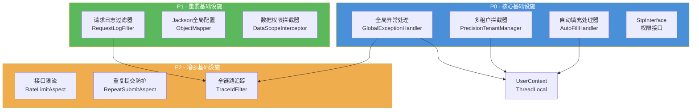

# 全局基础设施架构设计

## 文档信息

| 项目 | 内容 |
|------|------|
| 文档类型 | 架构设计 + 开发规范 |
| 版本 | v1.1.0 |
| 所属系统 | 车联网平台 precision-core 模块 |
| 日期 | 2026-05-05 |
| 设计负责人 | 后端开发（AI辅助） |
| 参考标准 | CCF微服务开发白皮书 v2.1 |

> **实现状态（2026-05-05）：** P0/P1/P2 共 10 个组件全部落地，外加 SSO JWT + Redis 黑名单。详见 `CLAUDE.md §4.1` 与 `doc/guide/Core组件开发指南.md`。

适用对象：
- 后端开发（必读）
- 前端开发（了解错误响应格式、TraceId 透传）
- 测试人员（了解全局行为）
- AI 编程（本规范为基础设施实现的最高指导文档）

---

# 一、概述

## 1.1 文档定位

本文档是车联网平台 **precision-core 模块全局基础设施** 的架构设计与开发规范。它既是架构设计文档（描述系统结构、组件关系、数据流向），也是开发规范（定义编码约束、命名规则、使用方式），所有业务模块开发必须遵守本文档定义的规范。

## 1.2 背景

在 RBAC 用户管理模块的测试中（参见 `doc/test/rbac/用户管理/用户管理-测试执行报告.md`），发现以下核心缺陷：

| 缺陷 | 根因 | 严重程度 |
|------|------|----------|
| 分配角色 API 返回系统异常 | 缺少完善的异常处理 | 严重 |
| 前端全局缺少错误提示 | 后端无全局异常处理，前端无统一错误拦截 | 严重 |
| 弹窗提交失败不关闭 | 前端无法识别业务错误 | 一般 |

这些缺陷的根因是 **precision-core 模块缺少全局基础设施组件**。本文档定义的 10 个组件将系统性解决这些问题，并为所有业务模块提供统一的技术基座。

## 1.3 组件全景

| 优先级 | 组件 | 职责 | 关键技术 |
|--------|------|------|----------|
| **P0** | 全局异常处理 | 统一异常捕获与响应格式 | @RestControllerAdvice |
| **P0** | 多租户拦截器 | SQL 自动注入 tenant_id | MyBatis-Flex TenantManager |
| **P0** | 自动填充处理器 | INSERT/UPDATE 自动填充公共字段 | MyBatis-Flex IEntityInterceptor |
| **P0** | StpInterface 权限接口 | 提供用户权限/角色列表 | Sa-Token SPI |
| **P1** | 请求日志过滤器 | 结构化请求日志 | Servlet Filter |
| **P1** | Jackson 全局配置 | 统一 JSON 序列化 | ObjectMapper 定制 |
| **P1** | 数据权限拦截器 | 按部门过滤查询数据 | MyBatis-Flex 数据范围 |
| **P2** | 接口限流 | 防止接口被恶意调用 | Caffeine + AOP |
| **P2** | 重复提交防护 | 防止表单重复提交 | Caffeine + AOP |
| **P2** | 全链路追踪 | 请求级 traceId 贯穿 | SkyWalking + MDC |

---

# 二、架构设计

## 2.1 整体架构图

> 架构图详见：`doc/design/architecture/全局基础设施架构图.drawio`（可用 DrawIO 打开）

## 2.2 请求处理流水线

每个 HTTP 请求依次经过以下全局组件处理：

```
客户端请求
    │
    ▼
┌─────────────────────────────────────────────────────┐
│ 1. TraceIdFilter（P2-全链路追踪）                     │
│    - 生成/获取 traceId → MDC 注入                     │
│    - 最高优先级，确保后续组件可获取 traceId            │
└──────────────────────┬──────────────────────────────┘
                       │
                       ▼
┌─────────────────────────────────────────────────────┐
│ 2. RequestLogFilter（P1-请求日志过滤器）               │
│    - 记录 method/path/参数/clientIP                   │
│    - 缓存请求体（ContentCachingRequestWrapper）       │
└──────────────────────┬──────────────────────────────┘
                       │
                       ▼
┌─────────────────────────────────────────────────────┐
│ 3. Sa-Token 认证鉴权                                   │
│    - 登录校验（NotLoginException → 异常处理器）       │
│    - 权限校验（StpInterface → 数据库查询）            │
│    - 角色校验                                         │
└──────────────────────┬──────────────────────────────┘
                       │
                       ▼
┌─────────────────────────────────────────────────────┐
│ 4. RateLimitAspect（P2-接口限流）                     │
│    - 检查 @RateLimit 注解                              │
│    - 固定窗口计数器限流                                │
└──────────────────────┬──────────────────────────────┘
                       │
                       ▼
┌─────────────────────────────────────────────────────┐
│ 5. RepeatSubmitAspect（P2-重复提交防护）               │
│    - 检查 @RepeatSubmit 注解                           │
│    - MD5 指纹去重                                     │
└──────────────────────┬──────────────────────────────┘
                       │
                       ▼
┌─────────────────────────────────────────────────────┐
│ 6. Controller（业务入口）                              │
│    - 参数校验（@Valid → MethodArgumentNotValidException）│
│    - 业务逻辑调用                                     │
└──────────────────────┬──────────────────────────────┘
                       │
                       ▼
┌─────────────────────────────────────────────────────┐
│ 7. Service → MyBatis-Flex                             │
│    ┌─────────────────────────────────────────────┐   │
│    │ 7a. TenantManager（P0-多租户拦截器）          │   │
│    │     - SQL 自动追加 tenant_id 条件            │   │
│    ├─────────────────────────────────────────────┤   │
│    │ 7b. AutoFillHandler（P0-自动填充处理器）      │   │
│    │     - INSERT/UPDATE 自动填充公共字段         │   │
│    ├─────────────────────────────────────────────┤   │
│    │ 7c. DataScopeInterceptor（P1-数据权限）       │   │
│    │     - 按 @DataScope 注解追加部门过滤条件      │   │
│    └─────────────────────────────────────────────┘   │
└──────────────────────┬──────────────────────────────┘
                       │
                       ▼
┌─────────────────────────────────────────────────────┐
│ 8. GlobalExceptionHandler（P0-全局异常处理）           │
│    - 捕获所有异常 → 统一 R<T> 响应                     │
│    - 自动填充 traceId、timestamp                      │
│    - 异常日志记录                                     │
└──────────────────────┬──────────────────────────────┘
                       │
                       ▼
┌─────────────────────────────────────────────────────┐
│ 9. Jackson 序列化（P1-Jackson全局配置）                │
│    - Long → String（防止前端精度丢失）                 │
│    - 日期格式 yyyy-MM-dd HH:mm:ss                    │
│    - NULL 值不序列化                                  │
└──────────────────────┬──────────────────────────────┘
                       │
                       ▼
┌─────────────────────────────────────────────────────┐
│ 10. RequestLogFilter（响应日志）                       │
│     - 记录 status/耗时                                │
│     - 慢请求 WARN 告警                               │
│     - 清除 MDC traceId                               │
└──────────────────────┬──────────────────────────────┘
                       │
                       ▼
                   客户端响应
```

## 2.3 组件依赖关系



**依赖说明：**

- `UserContext` 是所有 P0 组件的基础依赖，提供当前用户 ID 和租户 ID
- 全局异常处理器依赖 TraceId（在异常响应中填充 traceId）
- 请求日志过滤器依赖 TraceId（在日志中记录 traceId）
- 数据权限拦截器依赖 StpInterface（获取用户的 dataScope）

## 2.4 包结构

所有全局基础设施代码位于 `precision-core` 模块，按功能领域组织：

```
com.precision.core/
├── common/                          # 通用基础
│   ├── R.java                       # 统一响应（自动填充 traceId）
│   ├── ErrorCode.java               # 分段错误码枚举
│   └── PageResult.java              # 分页结果
│
├── config/                          # Spring 配置
│   ├── JacksonConfig.java           # Jackson 全局配置（Long→String / LocalDateTime / NON_NULL / 时区）
│   ├── MybatisFlexConfig.java       # AutoFillHandler + TenantManager 注册
│   ├── SaTokenConfig.java           # Sa-Token 拦截器 + 黑名单校验 + CORS
│   ├── SecurityConfig.java          # Spring Security 禁默认页
│   └── TokenModeConfig.java         # UUID / JWT-Simple 开关
│
├── constant/                        # 常量
│   └── TenantConstants.java         # DEFAULT_TENANT_ID = 1L
│
├── data/                            # 数据权限
│   ├── DataScope.java               # @DataScope 注解
│   ├── DataScopeAspect.java         # AOP 切面
│   ├── DataScopeContext.java        # ThreadLocal 下发 Condition
│   ├── UserDataScopeResolver.java   # SPI（查用户 data_scope）
│   └── DeptChildrenProvider.java    # SPI（查部门子树）
│
├── entity/                          # 实体基类
│   ├── BaseEntity.java              # createBy/createTime/updateBy/updateTime/deleted
│   └── TenantEntity.java            # extends BaseEntity + tenantId
│
├── exception/                       # 异常处理
│   ├── BizException.java            # 业务异常
│   └── GlobalExceptionHandler.java  # 全局异常处理器
│
├── i18n/                            # 国际化
│   └── I18nUtil.java
│
├── interceptor/                     # MyBatis-Flex 拦截器
│   └── AutoFillHandler.java         # INSERT/UPDATE 自动填充公共字段
│
├── security/                        # 安全上下文
│   ├── UserContext.java             # ThreadLocal（userId, tenantId, deptId）
│   └── TokenBlacklistService.java   # JWT 黑名单（登出/改密/强制下线）
│   # StpInterfaceImpl 位于 precision-business 模块：
│   # com.precision.rbac.security.StpInterfaceImpl
│
├── tenant/                          # 多租户
│   ├── PrecisionTenantManager.java  # TenantFactory 实现
│   ├── IgnoreTenant.java            # 忽略租户注解
│   └── IgnoreTenantAspect.java      # @IgnoreTenant AOP 切面
│
├── trace/                           # 全链路追踪
│   ├── TraceContext.java            # MDC 封装
│   ├── TraceIdFilter.java           # Filter 生成/透传 traceId
│   ├── TraceIdFilterConfig.java     # Filter 注册配置
│   └── TraceUtils.java              # Runnable/Callable 异步传递 traceId
│
├── util/                            # 工具类
│   ├── IdGenerator.java             # 雪花 ID
│   └── IpUtil.java                  # IP 地址解析
│
└── web/                             # Web 通用组件
    ├── RateLimit.java               # @RateLimit 注解
    ├── RateLimitAspect.java         # 限流 AOP 切面
    ├── RateLimitKeyType.java        # IP / USER_ID / GLOBAL
    ├── RepeatSubmit.java            # @RepeatSubmit 注解
    ├── RepeatSubmitAspect.java      # 重复提交 AOP 切面
    ├── RequestLogFilter.java        # 请求日志过滤器
    ├── RequestLogFilterConfig.java  # Filter 注册配置
    └── RequestLogProperties.java    # precision.request-log.* 配置属性
```

**包结构规则：**

| 规则 | 说明 |
|------|------|
| 按功能领域分包 | 不按技术层分包 |
| 注解独立包 | 所有自定义注解集中在 `annotation` 包 |
| 切面独立包 | 所有 AOP 切面集中在 `aspect` 包 |
| 过滤器独立包 | 所有 Servlet Filter 集中在 `filter` 包 |
| 配置独立包 | 所有 @Configuration 集中在 `config` 包 |

---

# 三、开发规范

## 3.1 统一响应格式

所有 API 响应必须使用 `R<T>` 包装：

```java
public class R<T> {
    private int code;           // 错误码：0=成功，非0=失败
    private String message;     // 错误信息
    private T data;             // 业务数据
    private long timestamp;     // 时间戳（毫秒）
    private String traceId;     // 链路追踪ID
}
```

**Controller 返回规范：**

```java
// 正确 ✅
@GetMapping("/users/{id}")
public R<UserVO> getUser(@PathVariable Long id) {
    return R.ok(userService.getById(id));
}

// 错误 ❌ - 禁止直接返回裸对象
@GetMapping("/users/{id}")
public UserVO getUser(@PathVariable Long id) {
    return userService.getById(id);
}
```

## 3.2 错误码规范

错误码按模块分段，每段预留 100 个编码空间：

| 范围 | 模块 | 示例 |
|------|------|------|
| 0 | 成功 | 0 = 操作成功 |
| 10001-10099 | 系统错误 | 10001 = 系统异常, 10002 = 参数校验失败 |
| 20001-20099 | RBAC 业务错误 | 20013 = 用户不存在, 20006 = 用户名或密码错误 |
| 30001-30099 | 认证/数据错误 | 30001 = TOKEN_INVALID, 30003 = PERMISSION_DENIED |
| 40001-40099 | 安全控制 | 40001 = TOO_MANY_REQUESTS, 40002 = DUPLICATE_SUBMIT |
| 50001-50099 | 设备错误（预留） | 50001 = 设备通信异常, 51001 = 设备离线 |

**ErrorCode 枚举扩展规范：**

```java
// 新增错误码时必须：
// 1. 在对应模块范围内追加
// 2. 添加清晰的中文描述
// 3. 通知前端团队同步错误码含义
SYSTEM_ERROR(10001, "系统异常"),
PARAM_ERROR(10002, "参数校验失败"),
```

## 3.3 异常使用规范

| 场景 | 使用方式 | 示例 |
|------|---------|------|
| 业务校验失败 | `throw new BizException(ErrorCode.xxx)` | 用户名已存在 |
| 需要自定义消息 | `throw new BizException(10005, "自定义消息")` | 特殊场景 |
| 参数校验失败 | 使用 `@Valid` + `@NotBlank` 等注解 | Bean Validation |
| 系统级异常 | 不处理，由全局处理器兜底 | NPE、数据库异常 |

**禁止事项：**

- 禁止在 Controller 中 try-catch 吞掉异常
- 禁止直接返回 `R.fail()` 而不抛异常（Service 层应抛异常，Controller 不处理）
- 禁止在全局异常处理器中包含业务逻辑

## 3.4 实体基类使用规范

所有数据库实体必须继承基类：

```java
// 租户业务表 → 继承 TenantEntity
@Data
@TableName("biz_vehicle")
public class Vehicle extends TenantEntity {
    private String plateNumber;
    private Integer status;
    // tenant_id / create_time / update_time / create_by / update_by / deleted
    // 均由基类提供，自动填充
}

// 全局表（无 tenant_id）→ 继承 BaseEntity
@Data
@TableName("sys_menu")
public class Menu extends BaseEntity {
    private String name;
    private String path;
    // create_time / update_time / create_by / update_by / deleted
    // 由基类提供，自动填充
}
```

## 3.5 多租户开发规范

| 规则 | 说明 |
|------|------|
| 租户表必须含 `tenant_id` 字段 | 自动注入，开发者无需手动处理 |
| 全局表在 `ignoreTables()` 中配置 | `sys_menu`、`sys_tenant`、`sys_dict_type` 等 |
| 跨租户查询使用 `@IgnoreTenant` | 租户管理、平台级统计等场景 |
| 禁止在 SQL 中硬编码 tenant_id | 由拦截器自动处理 |

## 3.6 数据权限使用规范

```java
// Service 方法上加注解，自动追加部门过滤
@DataScope(DataScopeType.DEPT_AND_CHILDREN)
public List<User> listUsers(UserQuery query) {
    // 查询自动追加 WHERE dept_id IN (当前部门及子部门ID)
    return userMapper.selectList(query);
}
```

## 3.7 限流与防重复提交规范

```java
// 接口限流 - 每用户每分钟最多 10 次
@RateLimit(key = "query", count = 10, period = 60, keyType = KeyType.USER)
@GetMapping("/vehicles")
public R<Page<VehicleVO>> listVehicles(VehicleQuery query) { ... }

// 重复提交防护 - 3 秒内相同请求视为重复
@RepeatSubmit(interval = 3000)
@PostMapping("/vehicles")
public R<VehicleVO> createVehicle(@RequestBody @Valid VehicleCreateDTO dto) { ... }
```

## 3.8 日志规范

所有业务日志必须通过 SLF4J 输出，日志格式自动携带 traceId：

```xml
<!-- logback-spring.xml pattern -->
%d{yyyy-MM-dd HH:mm:ss.SSS} [%X{traceId}] [%thread] %-5level %logger{36} - %msg%n
```

**日志级别使用规范：**

| 级别 | 场景 | 示例 |
|------|------|------|
| ERROR | 系统异常、需要人工介入 | 数据库连接失败、第三方服务不可用 |
| WARN | 业务异常、需要关注 | 登录失败、限流触发、慢请求 |
| INFO | 关键业务操作 | 用户登录/退出、数据变更 |
| DEBUG | 调试信息（生产环境关闭） | SQL 参数、请求详情 |

---

# 四、组件详细设计索引

每个组件的详细设计文档独立存放，按优先级组织：

## 4.1 P0 组件（核心 — 所有模块依赖）

| 组件 | 概要设计 | 详细设计 | 核心类 |
|------|---------|---------|--------|
| 全局异常处理 | [P0-全局异常处理-概要设计.md](../modules/core/P0-全局异常处理-概要设计.md) | [P0-全局异常处理-详细设计.md](../modules/core/P0-全局异常处理-详细设计.md) | `GlobalExceptionHandler`、`ErrorCode`、`BizException` |
| 多租户拦截器 | [P0-多租户拦截器-概要设计.md](../modules/core/P0-多租户拦截器-概要设计.md) | [P0-多租户拦截器-详细设计.md](../modules/core/P0-多租户拦截器-详细设计.md) | `PrecisionTenantManager`、`@IgnoreTenant` |
| 自动填充处理器 | [P0-自动填充处理器-概要设计.md](../modules/core/P0-自动填充处理器-概要设计.md) | [P0-自动填充处理器-详细设计.md](../modules/core/P0-自动填充处理器-详细设计.md) | `AutoFillHandler`、`BaseEntity`、`TenantEntity` |
| StpInterface 权限接口 | [P0-StpInterface权限接口-概要设计.md](../modules/core/P0-StpInterface权限接口-概要设计.md) | [P0-StpInterface权限接口-详细设计.md](../modules/core/P0-StpInterface权限接口-详细设计.md) | `StpInterfaceImpl`（位于 precision-business） |

## 4.2 P1 组件（重要 — 生产必备）

| 组件 | 概要设计 | 详细设计 | 核心类 |
|------|---------|---------|--------|
| 请求日志过滤器 | [P1-请求日志过滤器-概要设计.md](../modules/core/P1-请求日志过滤器-概要设计.md) | [P1-请求日志过滤器-详细设计.md](../modules/core/P1-请求日志过滤器-详细设计.md) | `RequestLogFilter` |
| Jackson 全局配置 | [P1-Jackson全局配置-概要设计.md](../modules/core/P1-Jackson全局配置-概要设计.md) | [P1-Jackson全局配置-详细设计.md](../modules/core/P1-Jackson全局配置-详细设计.md) | `JacksonConfig` |
| 数据权限拦截器 | [P1-数据权限拦截器-概要设计.md](../modules/core/P1-数据权限拦截器-概要设计.md) | [P1-数据权限拦截器-详细设计.md](../modules/core/P1-数据权限拦截器-详细设计.md) | `DataScopeInterceptor`、`@DataScope` |

## 4.3 P2 组件（增强 — 运维友好）

| 组件 | 概要设计 | 详细设计 | 核心类 |
|------|---------|---------|--------|
| 接口限流 | [P2-接口限流-概要设计.md](../modules/core/P2-接口限流-概要设计.md) | [P2-接口限流-详细设计.md](../modules/core/P2-接口限流-详细设计.md) | `RateLimitAspect`、`@RateLimit` |
| 重复提交防护 | [P2-重复提交防护-概要设计.md](../modules/core/P2-重复提交防护-概要设计.md) | [P2-重复提交防护-详细设计.md](../modules/core/P2-重复提交防护-详细设计.md) | `RepeatSubmitAspect`、`@RepeatSubmit` |
| 全链路追踪 | [P2-全链路追踪-概要设计.md](../modules/core/P2-全链路追踪-概要设计.md) | [P2-全链路追踪-详细设计.md](../modules/core/P2-全链路追踪-详细设计.md) | `TraceIdFilter`、`TraceContext` |

---

# 五、公共约束

## 5.1 UserContext — 全局上下文

`UserContext` 是所有组件的基础依赖，基于 ThreadLocal 存储：

```java
public class UserContext {
    private static final ThreadLocal<Long> USER_ID = new ThreadLocal<>();
    private static final ThreadLocal<Long> TENANT_ID = new ThreadLocal<>();

    // 在 Sa-Token 登录成功后设置
    public static void setUserId(Long userId) { ... }
    public static void setTenantId(Long tenantId) { ... }

    // 各组件读取
    public static Long getUserId() { ... }
    public static Long getTenantId() { ... }

    // 请求结束时清除（Filter 中调用）
    public static void clear() { ... }
}
```

**设置时机：** 在 Sa-Token 登录校验通过后，通过 `SaTokenConfig` 中注册的 Spring `HandlerInterceptor` 从 Sa-Session 恢复用户信息到 UserContext。

**实现方案（实际代码）：**
```java
// 在 precision-core 模块的 SaTokenConfig 中配置
@Configuration
public class SaTokenConfig implements WebMvcConfigurer {

    @Override
    public void addInterceptors(InterceptorRegistry registry) {
        // 1. Sa-Token 登录校验 + JWT 黑名单校验
        registry.addInterceptor(new SaInterceptor(handle -> {
            StpUtil.checkLogin();
            // JWT 黑名单检查...
        })).addPathPatterns("/api/**");

        // 2. 从 Sa-Token Session 恢复 UserContext（登录校验通过后执行）
        registry.addInterceptor(new HandlerInterceptor() {
            @Override
            public boolean preHandle(HttpServletRequest request, HttpServletResponse response, Object handler) {
                if (StpUtil.isLogin()) {
                    SaSession session = StpUtil.getSession();
                    Object userId = session.get("userId");
                    Object tenantId = session.get("tenantId");
                    Object deptId = session.get("deptId");
                    if (userId instanceof Number) UserContext.setUserId(((Number) userId).longValue());
                    if (tenantId instanceof Number) UserContext.setTenantId(((Number) tenantId).longValue());
                    if (deptId instanceof Number) UserContext.setDeptId(((Number) deptId).longValue());
                }
                return true;
            }

            @Override
            public void afterCompletion(HttpServletRequest request, HttpServletResponse response, 
                                        Object handler, Exception ex) {
                UserContext.clear();  // 请求结束时清理
            }
        }).addPathPatterns("/api/**");
    }
}
```

> **说明：** 用户信息在登录时由 `AuthServiceImpl` 写入 Sa-Session（`session.set("userId", userId)` 等），请求进入时由上述 Interceptor 从 Session 恢复到 `UserContext`。请求结束后在 `afterCompletion()` 中清理，避免线程池复用导致数据泄漏。

**异步线程：** 使用 `TraceRunnable` / `TraceCallable` 包装，自动传递 UserContext。

## 5.2 统一异常处理矩阵

| 异常类型 | 错误码 | HTTP 状态码 | 日志级别 | 说明 |
|---------|--------|------------|---------|------|
| `BizException` | 自定义 | 200 | WARN | 业务异常，前端需展示 |
| `MethodArgumentNotValidException` | 10002 | 200 | WARN | Bean Validation 校验失败 |
| `NotLoginException` | 30001 | 200 | WARN | TOKEN_INVALID — 未登录 / Token 失效 |
| `NotRoleException` | 30003 | 200 | WARN | PERMISSION_DENIED — 角色不足 |
| `NotPermissionException` | 30003 | 200 | WARN | PERMISSION_DENIED — 权限不足 |
| `DuplicateKeyException` | 30010 | 200 | WARN | DATA_EXISTS — 唯一约束冲突 |
| `HttpMessageNotReadableException` | 10005 | 200 | WARN | 请求体解析失败 |
| `MethodArgumentTypeMismatchException` | 10004 | 200 | WARN | 参数类型不匹配 |
| `HttpRequestMethodNotSupportedException` | 10003 | 200 | WARN | HTTP 方法不支持 |
| `Exception`（兜底） | 10001 | 200 | ERROR | 未知系统异常 |

> **注意：** 所有业务异常 HTTP 状态码均返回 200，通过响应体中的 `code` 字段区分成功/失败。这是前后端分离项目的常见做法，前端通过 `code !== 0` 判断请求失败。

## 5.3 Filter 执行顺序

Filter 注册顺序决定执行顺序，必须严格按以下顺序配置：

| 顺序 | Filter | Order | 说明 |
|------|--------|-------|------|
| 1 | TraceIdFilter | Ordered.HIGHEST_PRECEDENCE | 最高优先级 |
| 2 | RequestLogFilter | Ordered.HIGHEST_PRECEDENCE + 20 | 紧随 TraceId |
| 3 | Sa-Token Filter | 由 Sa-Token 自动注册 | 框架内置 |

## 5.4 MyBatis-Flex 拦截器执行顺序

| 顺序 | 拦截器 | 触发时机 | 说明 |
|------|--------|---------|------|
| 1 | TenantManager | SQL 执行前 | 追加 tenant_id 条件 |
| 2 | AutoFillHandler | SQL 执行前 | 填充公共字段 |
| 3 | DataScopeInterceptor | SQL 执行前 | 追加部门过滤条件 |

## 5.5 缓存策略

| 组件 | 缓存技术 | Key 格式 | TTL | 说明 |
|------|---------|---------|-----|------|
| StpInterface | Sa-Token Session | `permissions:{userId}` | 随 Session | 权限列表缓存 |
| 数据权限 | Caffeine | `dept_tree:{tenantId}` | 30 分钟 | 部门树缓存 |
| 接口限流 | Caffeine | `rate_limit:{key}:{id}` | 动态过期 | 固定窗口计数器 |
| 重复提交 | Caffeine | `repeat_submit:{fingerprint}` | 请求指定 | 提交指纹 |

---

# 六、开发顺序

按优先级和依赖关系，推荐以下开发顺序：

```
Phase 0: UserContext（基础依赖）
    ↓
Phase 1: 全局异常处理 + ErrorCode 扩展
    ↓
Phase 2: 自动填充处理器 + BaseEntity/TenantEntity
    ↓
Phase 3: 多租户拦截器
    ↓
Phase 4: StpInterface 权限接口（依赖 Mapper，在 precision-business）
    ↓
Phase 5: Jackson 全局配置
    ↓
Phase 6: 全链路追踪（TraceIdFilter）
    ↓
Phase 7: 请求日志过滤器（依赖 TraceId）
    ↓
Phase 8: 数据权限拦截器（依赖 StpInterface + 部门树）
    ↓
Phase 9: 接口限流 + 重复提交防护
```

**每个 Phase 包含：**

1. 编写单元测试（TDD 红灯）
2. 实现功能代码（TDD 绿灯）
3. 补充测试至覆盖率 ≥ 90%
4. 提交代码

---

# 七、技术选型约束

| 约束项 | 选型 | 说明 |
|--------|------|------|
| 缓存 | Caffeine（本地） | 不引入 Redis，保持单机优先 |
| 认证 | Sa-Token 1.38.0 | 多租户友好，轻量级 |
| ORM | MyBatis-Flex 1.11.6 | 原生多租户、类型安全 |
| JSON | Jackson（Spring Boot 内置） | 不引入 Gson/Fastjson |
| AOP | Spring AOP | 不引入 AspectJ 编译时织入 |
| 限流算法 | 固定窗口计数器 | Caffeine 计数器，简单高效 |
| TraceId | SkyWalking Agent + UUID 降级 | 无外部依赖 |

---

## 7.1 Maven 依赖清单

precision-core 模块需要添加以下依赖：

```xml
<!-- backend/precision-core/pom.xml -->
<dependencies>
    <!-- MyBatis-Flex（多租户、自动填充、数据权限） -->
    <dependency>
        <groupId>com.mybatis-flex</groupId>
        <artifactId>mybatis-flex-spring-boot3-starter</artifactId>
        <version>1.11.6</version>
    </dependency>
    
    <!-- Sa-Token（认证鉴权） -->
    <dependency>
        <groupId>cn.dev33</groupId>
        <artifactId>sa-token-spring-boot3-starter</artifactId>
        <version>1.38.0</version>
    </dependency>
    
    <!-- Spring AOP（限流、防重复提交切面） -->
    <dependency>
        <groupId>org.springframework.boot</groupId>
        <artifactId>spring-boot-starter-aop</artifactId>
    </dependency>
    
    <!-- Spring TX（DuplicateKeyException） -->
    <dependency>
        <groupId>org.springframework</groupId>
        <artifactId>spring-tx</artifactId>
    </dependency>
</dependencies>
```

**依赖说明：**

| 依赖 | 用途 | 使用场景 |
|------|------|---------|
| mybatis-flex | ORM框架、多租户、自动填充 | TenantManager、IEntityInterceptor、QueryChain |
| sa-token | 认证鉴权框架 | StpInterface、NotLoginException等 |
| spring-boot-starter-aop | AOP支持 | RateLimitAspect、RepeatSubmitAspect、IgnoreTenantAspect |
| spring-tx | 事务支持 | DuplicateKeyException异常处理 |

**注意事项：**
1. MyBatis-Flex 是核心依赖，多租户、自动填充、数据权限都依赖它
2. Sa-Token 提供认证鉴权能力和异常类
3. spring-boot-starter-aop 用于实现限流、防重复提交、忽略租户等切面
4. spring-tx 提供 DuplicateKeyException 用于数据库唯一约束冲突处理

---

# 八、测试策略

## 8.1 单元测试要求

| 组件 | 最低覆盖率 | 测试重点 |
|------|-----------|---------|
| GlobalExceptionHandler | 90% | 每种异常类型的处理 |
| PrecisionTenantManager | 90% | tenant_id 注入、忽略表、@IgnoreTenant |
| AutoFillHandler | 90% | INSERT/UPDATE 填充、非请求线程默认值 |
| StpInterfaceImpl | 90% | 权限/角色加载、缓存、清除 |
| DataScopeInterceptor | 85% | 5 种数据范围 |
| RateLimitAspect | 85% | 三种 KeyType、超限处理 |
| RepeatSubmitAspect | 85% | 指纹计算、窗口期判断 |
| TraceIdFilter | 90% | traceId 生成/透传、MDC 清除 |
| RequestLogFilter | 85% | 日志记录、脱敏、慢请求 |
| JacksonConfig | 85% | 序列化/反序列化规则 |

## 8.2 集成测试要求

- 验证 Filter 链的执行顺序
- 验证 MyBatis-Flex 拦截器的协同工作（多租户 + 自动填充 + 数据权限）
- 验证异常处理器与 Sa-Token 的集成
- 验证 TraceId 在完整请求链路中的透传

---

# 九、配置项汇总

所有全局组件的配置项集中在 `application.yml`：

```yaml
# 全局基础设施配置
precision:
  # 多租户
  tenant:
    default-id: 1                          # 默认租户ID
    ignore-tables:                         # 忽略租户隔离的表
      - sys_tenant
      - sys_menu
      - sys_dict_type
      - sys_dict_data

  # 请求日志
  request-log:
    enabled: true                          # 是否启用
    exclude-paths:                         # 排除路径
      - /actuator/**
      - /swagger-ui/**
    slow-request-threshold: 3000           # 慢请求阈值（ms）
    max-body-length: 2048                  # 最大记录请求体长度

  # 接口限流
  rate-limit:
    enabled: true                          # 是否启用
    default-count: 100                     # 默认次数
    default-period: 60                     # 默认周期（秒）

  # 重复提交
  repeat-submit:
    enabled: true                          # 是否启用
    default-interval: 3000                 # 默认间隔（ms）

  # 数据权限
  data-scope:
    enabled: true                          # 是否启用
    dept-cache-ttl: 1800                   # 部门树缓存TTL（秒）
```

---

# 十、风险与缓解

| 风险 | 影响 | 缓解措施 |
|------|------|---------|
| TenantManager 性能开销 | 每条 SQL 都需改写 | 单租户阶段 tenant_id 为常量，优化器可简化 |
| AutoFill 反射性能 | 反射赋值字段 | 仅对标注了 @TableField(fill) 的字段处理 |
| 数据权限 SQL 注入 | 拼接 SQL 条件 | 使用参数化查询，不允许原始字符串拼接 |
| 限流 Caffeine 内存 | 高并发时内存增长 | 设置最大容量，LRU 淘汰 |
| TraceId 异步丢失 | 子线程无 traceId | TraceRunnable/TraceCallable 包装 |

---

## 变更记录

| 版本 | 日期 | 修改人 | 变更内容 |
|------|------|--------|---------|
| v1.0.0 | 2026-04-12 | Claude AI | 初始版本 |
| v1.1.0 | 2026-05-05 | Claude AI | 全部 10 组件 + SSO JWT 黑名单实现完成，各 P1/P2 详设标记为已实现；新增 `doc/guide/Core组件开发指南.md` 作为业务模块接入 Cookbook |
