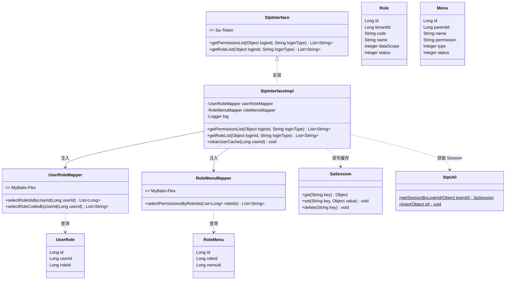
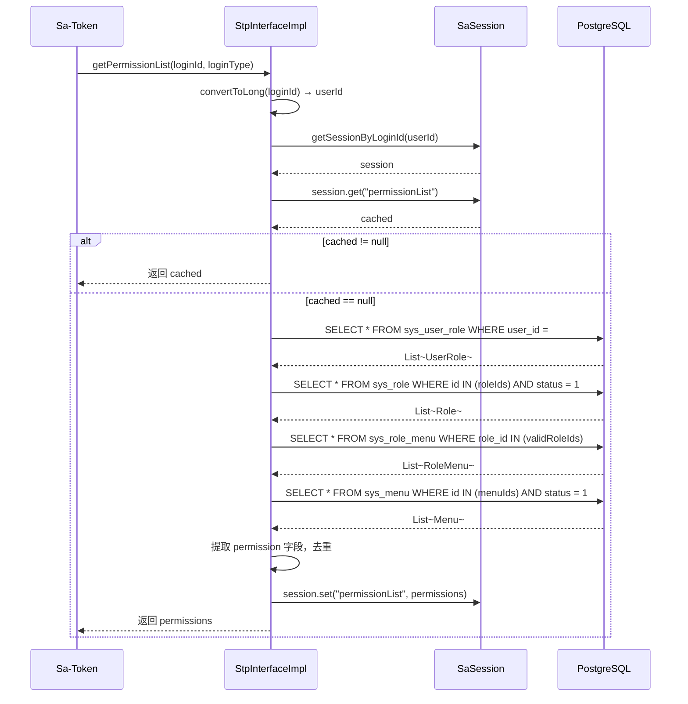
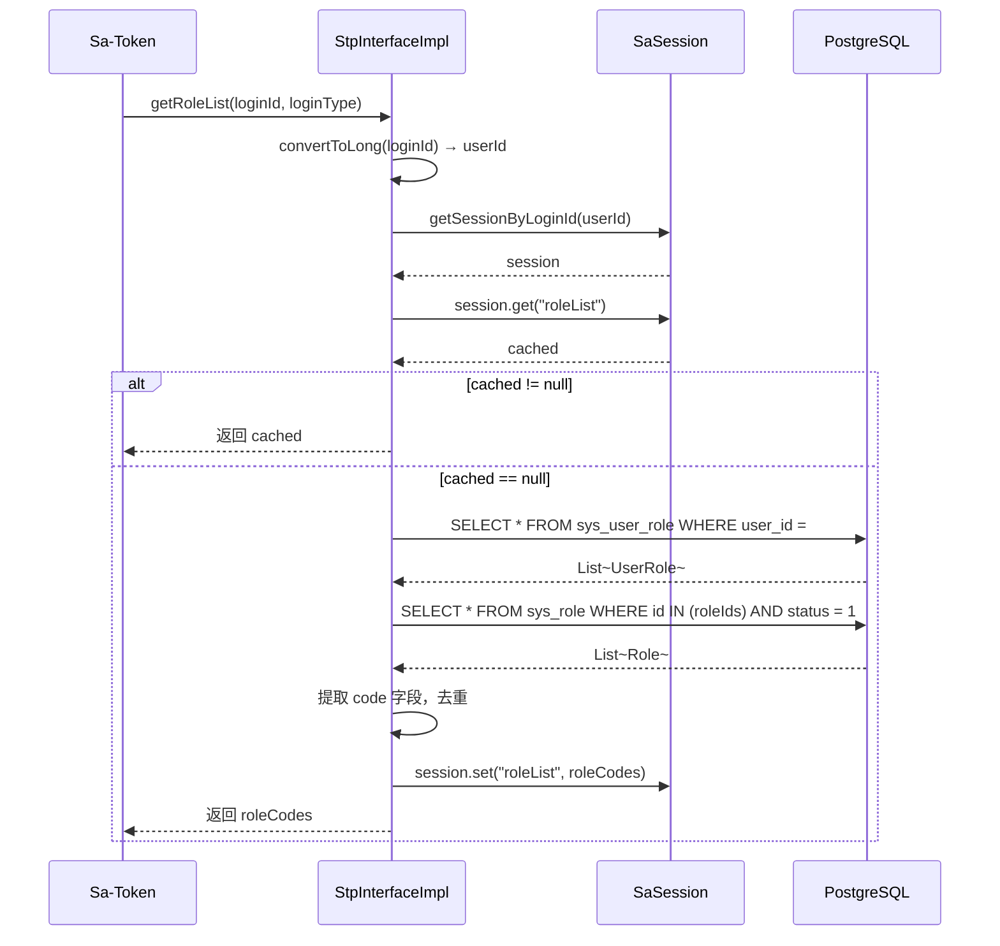
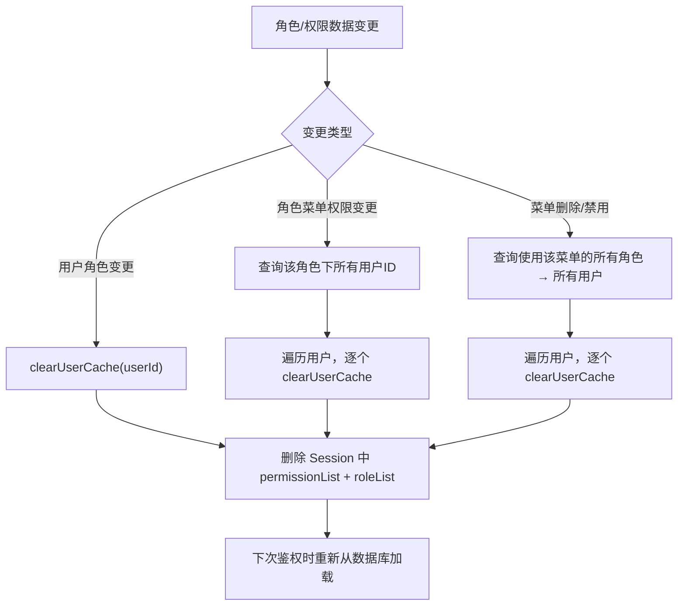
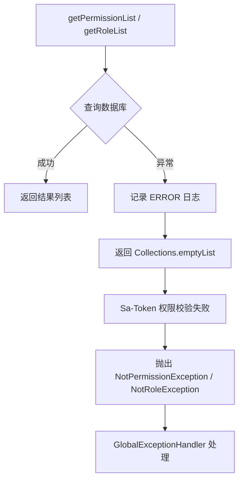

# StpInterface 权限接口 详细设计

## 文档信息

| 项目 | 内容 |
|------|------|
| 组件名称 | StpInterface 权限接口实现 |
| 版本 | v1.0.0 |
| 日期 | 2026-04-12 |
| 所属模块 | gentry-business |
| 优先级 | P0（全局基础设施，认证鉴权核心） |
| 设计负责人 | 后端开发（AI辅助） |

适用对象：
- 后端开发
- 测试人员
- AI 编程

------

# 一、设计概述

`StpInterface` 是 Sa-Token 框架的核心 SPI 接口，用于向框架提供当前登录用户的**权限列表**和**角色列表**。Sa-Token 在执行 `StpUtil.checkPermission()` 和 `StpUtil.checkRole()` 时，会自动调用此接口的实现类获取用户的权限/角色数据，然后与目标权限/角色进行匹配。

本组件实现 `StpInterface` 接口，通过 MyBatis-Flex 的 `QueryChain` 查询数据库中 `sys_user_role` → `sys_role` → `sys_role_menu` → `sys_menu` 的关联链路，获取用户的完整权限标识列表和角色编码列表。查询结果缓存在 Sa-Token Session 中，避免每次鉴权都访问数据库。

**核心设计目标：**
- 实现 `getPermissionList()` 和 `getRoleList()` 两个方法
- 通过多表关联查询获取用户的权限和角色
- 使用 Sa-Token Session 缓存查询结果，减少数据库访问
- 提供缓存清除接口，在用户角色/权限变更时主动失效
- 支持数据权限范围（`data_scope`）的获取（为后续数据权限拦截器预留）

------

# 二、类设计

## 2.1 类图



## 2.2 核心类详细设计

### 2.2.1 StpInterfaceImpl

**包路径：** `com.gentry.rbac.security.StpInterfaceImpl`

**职责：** 实现 Sa-Token 的 `StpInterface` 接口，提供用户的权限和角色数据。包含缓存逻辑和数据库查询逻辑。

**注解：** `@Component`

**依赖注入：**

| 字段 | 类型 | 注入方式 | 说明 |
|------|------|---------|------|
| userRoleMapper | UserRoleMapper | @Autowired | 用户-角色关联查询 |
| roleMenuMapper | RoleMenuMapper | @Autowired | 角色-菜单权限查询 |
| log | Logger | SLF4J | 日志记录 |

**方法详细设计：**

#### getPermissionList(Object loginId, String loginType)

```java
@Override
public List<String> getPermissionList(Object loginId, String loginType)
```

| 项目 | 说明 |
|------|------|
| 输入 | loginId — 用户 ID（由 Sa-Token 传入）；loginType — 登录类型（默认 "login"） |
| 逻辑 | 1. 将 loginId 转为 Long 类型 userId |
|      | 2. 尝试从 SaSession 获取缓存的权限列表 |
|      | 3. 缓存命中 → 直接返回 |
|      | 4. 缓存未命中 → 查询数据库（userRoleMapper 查角色ID → roleMenuMapper 查权限） |
|      | 5. 将结果写入 SaSession 缓存 |
|      | 6. 返回权限列表 |
| 返回 | `List<String>` 权限标识列表，如 `["user:create", "user:update", "role:query"]` |
| 缓存 Key | `"permissionList"` |
| 异常 | 查询失败时返回空列表，记录 ERROR 日志 |

```java
@Override
public List<String> getPermissionList(Object loginId, String loginType) {
    Long userId = convertToLong(loginId);
    try {
        SaSession session = StpUtil.getSessionByLoginId(userId, false);
        if (session != null) {
            @SuppressWarnings("unchecked")
            List<String> cached = (List<String>) session.get("permissionList");
            if (cached != null) {
                return cached;
            }
        }

        // 缓存未命中，查询数据库
        List<String> permissions = loadPermissions(userId);

        // 写入缓存
        if (session != null) {
            session.set("permissionList", permissions);
        }

        return permissions;
    } catch (Exception e) {
        log.error("获取用户权限列表失败, userId={}", userId, e);
        return Collections.emptyList();
    }
}
```

#### getRoleList(Object loginId, String loginType)

```java
@Override
public List<String> getRoleList(Object loginId, String loginType)
```

| 项目 | 说明 |
|------|------|
| 输入 | loginId — 用户 ID（由 Sa-Token 传入）；loginType — 登录类型 |
| 逻辑 | 1. 将 loginId 转为 Long 类型 userId |
|      | 2. 尝试从 SaSession 获取缓存的角色列表 |
|      | 3. 缓存命中 → 直接返回 |
|      | 4. 缓存未命中 → 查询数据库（userRoleMapper 直接查角色编码） |
|      | 5. 将结果写入 SaSession 缓存 |
|      | 6. 返回角色编码列表 |
| 返回 | `List<String>` 角色编码列表，如 `["admin", "operator"]` |
| 缓存 Key | `"roleList"` |
| 异常 | 查询失败时返回空列表，记录 ERROR 日志 |

```java
@Override
public List<String> getRoleList(Object loginId, String loginType) {
    Long userId = convertToLong(loginId);
    try {
        SaSession session = StpUtil.getSessionByLoginId(userId, false);
        if (session != null) {
            @SuppressWarnings("unchecked")
            List<String> cached = (List<String>) session.get("roleList");
            if (cached != null) {
                return cached;
            }
        }

        // 缓存未命中，查询数据库
        List<String> roles = userRoleMapper.selectRoleCodesByUserId(userId);

        // 写入缓存
        if (session != null) {
            session.set("roleList", roles);
        }

        return roles;
    } catch (Exception e) {
        log.error("获取用户角色列表失败, userId={}", userId, e);
        return Collections.emptyList();
    }
}
```

#### clearUserCache(Long userId) — 公共方法

```java
public void clearUserCache(Long userId)
```

| 项目 | 说明 |
|------|------|
| 职责 | 清除指定用户的权限和角色缓存 |
| 场景 | 用户角色变更、角色权限变更后主动调用 |
| 逻辑 | 删除 SaSession 中的 permissionList 和 roleList |
| 异常 | Session 不存在时静默忽略 |

```java
public void clearUserCache(Long userId) {
    try {
        SaSession session = StpUtil.getSessionByLoginId(userId, false);
        if (session != null) {
            session.delete("permissionList");
            session.delete("roleList");
            log.info("已清除用户权限缓存, userId={}", userId);
        }
    } catch (Exception e) {
        log.warn("清除用户权限缓存失败, userId={}", userId, e);
    }
}
```

#### convertToLong(Object loginId) — 私有工具方法

```java
private Long convertToLong(Object loginId)
```

| 项目 | 说明 |
|------|------|
| 逻辑 | 将 loginId 转为 Long 类型 |
| 支持 | Number 子类、String 类型 |

```java
private Long convertToLong(Object loginId) {
    if (loginId instanceof Number number) {
        return number.longValue();
    }
    return Long.parseLong(loginId.toString());
}
```

### 2.2.2 涉及的 Entity 类

#### UserRole

**包路径：** `com.gentry.rbac.user.entity.UserRole`（或 `com.gentry.core.entity.UserRole`）

```java
@Data
@TableName("sys_user_role")
public class UserRole {
    @TableId(type = IdType.Generator, value = KeyGenerators.FlexID.class)
    private Long id;
    private Long userId;
    private Long roleId;
}
```

#### Role

**包路径：** `com.gentry.business.entity.Role`

```java
@Data
@EqualsAndHashCode(callSuper = true)
@TableName("sys_role")
public class Role extends TenantEntity {
    @TableId(type = IdType.Generator, value = KeyGenerators.FlexID.class)
    private Long id;
    private String code;
    private String name;
    private Integer dataScope;
    private Integer status;
}
```

#### RoleMenu

**包路径：** `com.gentry.business.entity.RoleMenu`

```java
@Data
@TableName("sys_role_menu")
public class RoleMenu {
    @TableId(type = IdType.Generator, value = KeyGenerators.FlexID.class)
    private Long id;
    private Long roleId;
    private Long menuId;
}
```

#### Menu

**包路径：** `com.gentry.business.entity.Menu`

```java
@Data
@EqualsAndHashCode(callSuper = true)
@TableName("sys_menu")
public class Menu extends BaseEntity {
    @TableId(type = IdType.Generator, value = KeyGenerators.FlexID.class)
    private Long id;
    private Long parentId;
    private String name;
    private String path;
    private String permission;
    private String component;
    private Integer type;    // 1=目录 2=菜单 3=按钮
    private Integer sort;
    private Integer status;
}
```

------

# 三、接口设计

## 3.1 对外接口

### Sa-Token 自动调用接口

以下方法由 Sa-Token 框架自动调用，开发者无需手动调用：

```java
// Sa-Token 执行权限校验时自动调用
StpUtil.checkPermission("user:create");
// → 内部调用 StpInterfaceImpl.getPermissionList(loginId, "login")
// → 匹配 "user:create" 是否在列表中

// Sa-Token 执行角色校验时自动调用
StpUtil.checkRole("admin");
// → 内部调用 StpInterfaceImpl.getRoleList(loginId, "login")
// → 匹配 "admin" 是否在列表中
```

### 缓存清除接口

在用户角色/权限变更时，需要主动调用：

```java
@Autowired
private StpInterfaceImpl stpInterface;

// 用户分配了新角色
stpInterface.clearUserCache(userId);

// 角色的菜单权限变更（需遍历该角色下的所有用户）
List<Long> affectedUserIds = getUserIdsByRoleId(roleId);
affectedUserIds.forEach(stpInterface::clearUserCache);
```

### Controller 注解鉴权

```java
@RestController
@RequestMapping("/api/v1/users")
public class UserController {

    // 权限校验 —— Sa-Token 自动调用 getPermissionList()
    @SaCheckPermission("user:create")
    @PostMapping
    public R<UserVO> create(@RequestBody @Valid UserCreateDTO dto) {
        // ...
    }

    // 角色校验 —— Sa-Token 自动调用 getRoleList()
    @SaCheckRole("admin")
    @DeleteMapping("/{id}")
    public R<Void> delete(@PathVariable Long id) {
        // ...
    }
}
```

## 3.2 内部接口

### 数据库查询接口（QueryChain）

本组件通过 MyBatis-Flex 的 `QueryChain` 直接查询，不使用自定义 Mapper 方法。

| 查询 | SQL 语义 | 返回类型 |
|------|---------|---------|
| 权限查询 | 多表关联查询 | `List<String>` 权限标识 |
| 角色查询 | 两表关联查询 | `List<String>` 角色编码 |

------

# 四、流程设计

## 4.1 核心流程图

### getPermissionList 完整流程



### getRoleList 完整流程



## 4.2 缓存失效流程



## 4.3 异常处理流程



> **设计决策：** 查询失败时返回空列表而非抛异常。原因：Sa-Token 在权限校验失败时会抛出 `NotPermissionException`，由 `GlobalExceptionHandler` 统一处理。避免在 `StpInterface` 层面抛出异常导致 500 错误。

------

# 五、数据设计

## 5.1 配置项

本组件使用 Sa-Token 默认 Session 配置，无需额外 application.yml 配置。

Sa-Token Session 相关配置（在 `SaTokenConfig` 或 `application.yml` 中）：

```yaml
sa-token:
  # Token 有效期（秒），Session 跟随 Token 生命周期
  timeout: 7200
  # Token 活跃超时（秒），超过此时间未操作则 Session 失效
  active-timeout: 1800
  # 是否允许同一账号多地同时登录
  is-concurrent: true
  # 是否每次登录生成新 Token
  is-share: false
```

## 5.2 缓存设计

### Sa-Token Session 缓存

| 缓存 Key | 值类型 | 说明 | TTL | 失效策略 |
|----------|-------|------|-----|---------|
| `permissionList` | `List<String>` | 用户权限标识列表 | 跟随 Session（2h，活跃续期30min） | Session 过期自动清除；角色/权限变更主动删除 |
| `roleList` | `List<String>` | 用户角色编码列表 | 跟随 Session（2h，活跃续期30min） | Session 过期自动清除；角色变更主动删除 |

**缓存特点：**
- **存储位置：** Sa-Token Session（默认内存存储，后续可切换为 Redis）
- **生命周期：** 与用户登录 Session 绑定，Token 过期则缓存自动清除
- **容量评估：** 单用户权限列表约 50-200 个字符串，内存占用极小
- **一致性保证：** 通过 `clearUserCache()` 主动失效保证最终一致性

### 缓存清除时机

| 场景 | 触发位置 | 清除范围 |
|------|---------|---------|
| 给用户分配角色 | RoleService.assignRoles() | 单个用户 |
| 移除用户角色 | RoleService.removeRoles() | 单个用户 |
| 修改角色菜单权限 | RoleService.updateMenus() | 该角色下所有用户 |
| 删除角色 | RoleService.delete() | 该角色下所有用户 |
| 禁用角色 | RoleService.updateStatus() | 该角色下所有用户 |
| 禁用菜单 | MenuService.updateStatus() | 使用该菜单的所有角色 → 所有用户 |
| 删除菜单 | MenuService.delete() | 使用该菜单的所有角色 → 所有用户 |

## 5.3 数据库查询

### 权限查询 SQL 链路

```sql
-- Step 1: 获取用户角色关联
SELECT id, user_id, role_id
FROM sys_user_role
WHERE user_id = #{userId};

-- Step 2: 获取有效角色
SELECT id, tenant_id, code, name, data_scope, status
FROM sys_role
WHERE id IN (#{roleIds})
  AND status = 1;

-- Step 3: 获取角色菜单关联
SELECT id, role_id, menu_id
FROM sys_role_menu
WHERE role_id IN (#{validRoleIds});

-- Step 4: 获取菜单权限标识
SELECT id, permission
FROM sys_menu
WHERE id IN (#{menuIds})
  AND status = 1;
```

### 角色查询 SQL 链路

```sql
-- Step 1: 获取用户角色关联（同上）
SELECT id, user_id, role_id
FROM sys_user_role
WHERE user_id = #{userId};

-- Step 2: 获取有效角色编码
SELECT id, code
FROM sys_role
WHERE id IN (#{roleIds})
  AND status = 1;
```

### 查询性能评估

| 查询 | 预计行数 | 执行频率 | 优化建议 |
|------|---------|---------|---------|
| sys_user_role by user_id | 1-5 行 | 首次鉴权/缓存失效后 | 已有主键索引，无需优化 |
| sys_role by ids | 1-5 行 | 同上 | IN 查询少量 ID，性能良好 |
| sys_role_menu by role_ids | 10-100 行 | 同上 | 可考虑在 role_id 上建索引 |
| sys_menu by ids | 10-100 行 | 同上 | IN 查询少量 ID，性能良好 |

**建议索引：**

```sql
-- sys_user_role 表（如果不存在）
CREATE INDEX idx_user_role_user_id ON sys_user_role(user_id);

-- sys_role_menu 表（如果不存在）
CREATE INDEX idx_role_menu_role_id ON sys_role_menu(role_id);
```

------

# 六、依赖关系

| 依赖 | 版本 | 用途 |
|------|------|------|
| sa-token-spring-boot3-starter | 1.38.0 | StpInterface 接口、SaSession、StpUtil |
| mybatis-flex-spring-boot3-starter | 1.11.6 | QueryChain 查询、Entity 定义 |
| spring-boot-starter-web | 3.2.5 | @Component 注解 |

**内部依赖：**

| 内部类 | 用途 | 所在模块 |
|--------|------|---------|
| UserRole Entity | 查询用户-角色关联 | gentry-business |
| Role Entity | 查询角色信息 | gentry-business |
| RoleMenu Entity | 查询角色-菜单关联 | gentry-business |
| Menu Entity | 查询菜单权限标识 | gentry-business |
| TenantEntity | Role 的基类 | gentry-core |
| BaseEntity | Menu 的基类 | gentry-core |

**模块归属说明：**

`StpInterfaceImpl` 实现类位于 `gentry-business` 模块，原因：
1. 需要访问 UserRole、Role、RoleMenu、Menu 等 Entity，这些 Entity 在 business 模块
2. 依赖方向正确：business 依赖 core，而非反向依赖
3. Sa-Token 通过 Spring 自动扫描发现 `@Component`，不影响功能
4. 权限查询属于业务逻辑，放在 business 模块更符合分层架构

------

# 七、测试设计

## 7.1 单元测试用例

**测试类：** `com.gentry.rbac.security.StpInterfaceImplTest`

| 测试方法名 | 场景 | 前置条件 | 预期结果 |
|-----------|------|---------|---------|
| getPermissionList_缓存命中_直接返回 | Session 中已有 permissionList | Mock SaSession.get 返回 `["user:create"]` | 返回 `["user:create"]`，不调用数据库 |
| getPermissionList_缓存未命中_查询数据库 | Session 中无缓存 | Mock 4 次 QueryChain 查询 | 返回正确的权限列表，缓存被写入 |
| getPermissionList_用户无角色_返回空列表 | userRole 查询为空 | Mock QueryChain 返回空列表 | 返回 `[]` |
| getPermissionList_角色被禁用_不返回其权限 | 角色中有一个 status=0 | Mock 返回混合状态角色 | 只包含有效角色的权限 |
| getPermissionList_菜单无permission_过滤空值 | 菜单 permission 为 null 或空串 | Mock 返回含空 permission 的菜单 | 空值被过滤 |
| getPermissionList_权限去重 | 多个角色共享同一权限 | Mock 返回重复权限 | 去重后返回 |
| getRoleList_缓存命中_直接返回 | Session 中已有 roleList | Mock SaSession.get 返回 `["admin"]` | 返回 `["admin"]` |
| getRoleList_缓存未命中_查询数据库 | Session 中无缓存 | Mock 2 次 QueryChain 查询 | 返回 `["admin", "operator"]` |
| getRoleList_用户无角色_返回空列表 | userRole 查询为空 | Mock QueryChain 返回空列表 | 返回 `[]` |
| getRoleList_角色被禁用_不返回 | 角色中有一个 status=0 | Mock 返回混合状态角色 | 只包含有效角色编码 |
| clearUserCache_正常清除 | Session 存在 | Mock SaSession | permissionList 和 roleList 被删除 |
| clearUserCache_Session不存在_静默忽略 | 用户未登录 | Mock StpUtil 返回 null session | 无异常，日志记录 WARN |
| convertToLong_传入Long_直接返回 | loginId 为 Long 类型 | loginId=100L | 返回 100L |
| convertToLong_传入String_解析为Long | loginId 为 String 类型 | loginId="100" | 返回 100L |
| convertToLong_传入Integer_转为Long | loginId 为 Integer 类型 | loginId=100 | 返回 100L |
| getPermissionList_数据库异常_返回空列表 | 查询抛 RuntimeException | Mock 抛异常 | 返回 `[]`，记录 ERROR 日志 |
| getRoleList_数据库异常_返回空列表 | 查询抛 RuntimeException | Mock 抛异常 | 返回 `[]`，记录 ERROR 日志 |

### 单元测试代码示例

```java
@ExtendWith(MockitoExtension.class)
class StpInterfaceImplTest {

    @InjectMocks
    private StpInterfaceImpl stpInterface;

    @Mock
    private UserRoleMapper userRoleMapper;

    @Mock
    private RoleMapper roleMapper;

    @Mock
    private RoleMenuMapper roleMenuMapper;

    @Mock
    private MenuMapper menuMapper;

    @Test
    void getPermissionList_缓存未命中_查询数据库() {
        // Given — 使用 MockedStatic 模拟 Sa-Token 静态方法
        Long userId = 100L;
        SaSession session = Mockito.mock(SaSession.class);
        when(session.get("permissionList")).thenReturn(null); // 缓存未命中

        // Mock 数据库查询
        // Step 1: user_role
        UserRole ur = new UserRole();
        ur.setUserId(userId);
        ur.setRoleId(1L);

        // Step 2: role
        Role role = new Role();
        role.setId(1L);
        role.setCode("admin");
        role.setStatus(1);

        // Step 3: role_menu
        RoleMenu rm = new RoleMenu();
        rm.setRoleId(1L);
        rm.setMenuId(10L);

        // Step 4: menu
        Menu menu = new Menu();
        menu.setId(10L);
        menu.setPermission("user:create");
        menu.setStatus(1);

        // 使用 MockedStatic 模拟 QueryChain（或使用集成测试）

        // When
        List<String> permissions = stpInterface.getPermissionList(userId, "login");

        // Then
        assertFalse(permissions.isEmpty());
        assertTrue(permissions.contains("user:create"));
    }

    @Test
    void clearUserCache_正常清除() {
        // Given
        Long userId = 100L;
        SaSession session = Mockito.mock(SaSession.class);

        // When
        stpInterface.clearUserCache(userId);

        // Then
        verify(session).delete("permissionList");
        verify(session).delete("roleList");
    }
}
```

## 7.2 集成测试场景

**测试类：** `com.gentry.rbac.security.StpInterfaceIntegrationTest`

| 场景 | 测试方法 | 说明 |
|------|---------|------|
| 完整权限链路验证 | 创建用户→分配角色→分配菜单权限→登录→鉴权 | `getPermissionList` 返回正确的权限列表 |
| 完整角色链路验证 | 创建用户→分配角色→登录→鉴权 | `getRoleList` 返回正确的角色列表 |
| 缓存生效验证 | 连续两次调用 getPermissionList | 第二次不查数据库（验证 SQL 日志只出现一次） |
| 缓存失效验证 | 调用 clearUserCache 后再调用 getPermissionList | 重新查询数据库 |
| 角色禁用验证 | 禁用角色后调用 getRoleList | 不包含被禁用的角色 |
| 菜单禁用验证 | 禁用菜单后清除缓存再调用 getPermissionList | 不包含被禁用菜单的权限 |
| 无角色用户验证 | 不分配角色的用户调用 getPermissionList | 返回空列表 |
| 多角色权限合并验证 | 用户有两个角色，各有不同权限 | 返回合并去重后的权限列表 |

**集成测试 SQL 准备：**

```sql
-- 准备测试数据
INSERT INTO sys_user (id, tenant_id, username, password, nickname, status, deleted)
VALUES (9001, 1, 'perm_test_user', 'xxx', '权限测试用户', 1, 0);

INSERT INTO sys_role (id, tenant_id, code, name, data_scope, status, deleted)
VALUES (8001, 1, 'test_role', '测试角色', 1, 1, 0);

INSERT INTO sys_user_role (id, user_id, role_id)
VALUES (7001, 9001, 8001);

INSERT INTO sys_menu (id, parent_id, name, permission, type, sort, status)
VALUES (6001, 0, '测试菜单', 'test:view', 2, 1, 1);

INSERT INTO sys_menu (id, parent_id, name, permission, type, sort, status)
VALUES (6002, 6001, '测试按钮', 'test:create', 3, 1, 1);

INSERT INTO sys_role_menu (id, role_id, menu_id)
VALUES (5001, 8001, 6001),
       (5002, 8001, 6002);

-- 预期结果：
-- getPermissionList(9001) → ["test:view", "test:create"]
-- getRoleList(9001) → ["test_role"]
```

**集成测试示例：**

```java
@SpringBootTest
class StpInterfaceIntegrationTest {

    @Autowired
    private StpInterfaceImpl stpInterface;

    @Test
    void 完整权限链路验证() {
        // Given — 测试数据已通过 Flyway 迁移插入
        Long userId = 9001L;

        // When
        List<String> permissions = stpInterface.getPermissionList(userId, "login");
        List<String> roles = stpInterface.getRoleList(userId, "login");

        // Then
        assertThat(permissions).containsExactlyInAnyOrder("test:view", "test:create");
        assertThat(roles).containsExactly("test_role");
    }
}
```

------

# 八、变更记录

| 版本 | 日期 | 修改人 | 变更内容 | 变更原因 | 评审人 |
|------|------|--------|---------|---------|--------|
| v1.0.0 | 2026-04-12 | 后端开发（AI） | 初始版本 | StpInterface 权限接口详细设计 | 待评审 |
