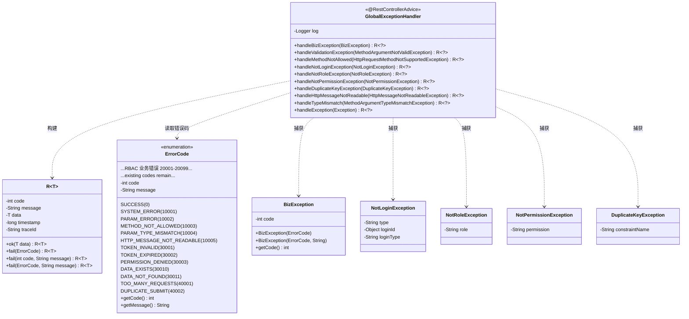
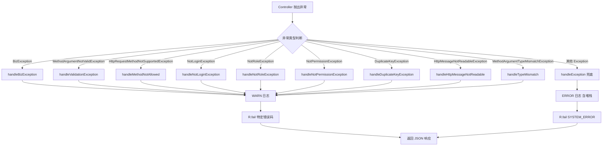
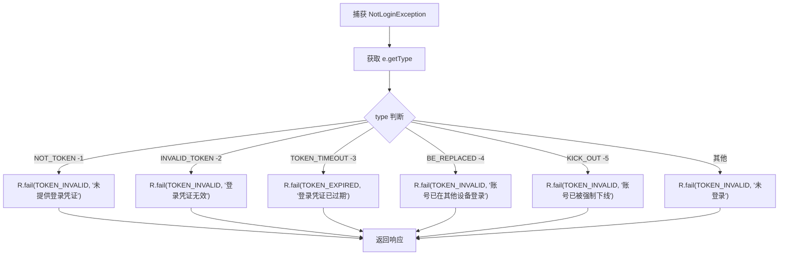

# 全局异常处理 详细设计

## 文档信息

| 项目 | 内容 |
|------|------|
| 组件名称 | 全局异常处理（GlobalExceptionHandler） |
| 版本 | v1.0.0 |
| 日期 | 2026-04-12 |
| 所属模块 | precision-core |
| 优先级 | P0（全局基础设施，所有模块依赖） |
| 设计负责人 | 后端开发（AI辅助） |

适用对象：
- 后端开发
- 前端开发（了解错误响应格式）
- 测试人员
- AI 编程

------

# 一、设计概述

全局异常处理组件是整个平台的"安全网"，负责捕获所有 Controller 层抛出的异常，统一转换为标准 `R<T>` 响应格式返回给前端。当前 `GlobalExceptionHandler` 已具备 `BizException`、`MethodArgumentNotValidException`、`HttpRequestMethodNotSupportedException` 和兜底 `Exception` 四种处理能力。

本次设计的目标是**补全缺失的异常处理器**，涵盖 Sa-Token 认证/鉴权异常、数据库唯一约束冲突、请求体解析异常、参数类型不匹配等场景，同时扩展 `ErrorCode` 枚举以支持更精细的错误码分类，确保前端能根据错误码做出准确的交互响应（如跳转登录页、提示权限不足、自动重试等）。

**设计原则：**
- 异常处理仅做日志记录和响应转换，不包含任何业务逻辑
- 每种异常类型有明确的错误码，前端可据此做差异化处理
- 系统级异常（如 NPE、数据库异常）只记录日志，不暴露内部细节给前端
- 所有异常响应均遵循统一的 `R<T>` 格式

------

# 二、类设计

## 2.1 类图



## 2.2 核心类详细设计

### 2.2.1 GlobalExceptionHandler（修改现有类）

**包路径：** `com.precision.core.exception.GlobalExceptionHandler`

**职责：** 全局异常拦截和统一响应转换。作为 `@RestControllerAdvice`，自动拦截所有 Controller 层抛出的异常。

**注解：** `@RestControllerAdvice`

**字段：**

| 字段 | 类型 | 说明 |
|------|------|------|
| log | Logger | SLF4J 日志记录器 |

**方法详细设计：**

#### (1) handleBizException — 业务异常

```java
@ExceptionHandler(BizException.class)
public R<?> handleBizException(BizException e)
```

| 项目 | 说明 |
|------|------|
| 输入 | BizException，携带 code 和 message |
| 逻辑 | 记录 WARN 日志（code + message），构建 R.fail |
| 输出 | `R.fail(e.getCode(), e.getMessage())` |
| 日志级别 | WARN |

#### (2) handleValidationException — 参数校验异常（@Valid）

```java
@ExceptionHandler(MethodArgumentNotValidException.class)
public R<?> handleValidationException(MethodArgumentNotValidException e)
```

| 项目 | 说明 |
|------|------|
| 输入 | MethodArgumentNotValidException |
| 逻辑 | 遍历 `e.getBindingResult().getFieldErrors()`，收集 field → defaultMessage 映射到 Map |
| 输出 | `R.fail(ErrorCode.PARAM_ERROR)`，data 字段设置为错误字段 Map |
| 日志级别 | WARN |

#### (3) handleBindException — 简单参数校验异常（@RequestParam / @PathVariable）

```java
@ExceptionHandler(BindException.class)
public R<?> handleBindException(BindException e)
```

| 项目 | 说明 |
|------|------|
| 输入 | BindException（如 `@RequestParam` 类型不匹配、`@PathVariable` 缺失等） |
| 逻辑 | 获取第一个 FieldError 的默认错误消息 |
| 输出 | `R.fail(ErrorCode.PARAM_ERROR, 错误消息)` |
| 日志级别 | WARN |

#### (4) handleMethodNotAllowed — 请求方法不支持

```java
@ExceptionHandler(HttpRequestMethodNotSupportedException.class)
public R<?> handleMethodNotAllowed(HttpRequestMethodNotSupportedException e)
```

| 项目 | 说明 |
|------|------|
| 输入 | HttpRequestMethodNotSupportedException |
| 逻辑 | 直接返回错误码 |
| 输出 | `R.fail(ErrorCode.METHOD_NOT_ALLOWED)` |
| 日志级别 | WARN |

#### (5) handleNotLoginException — Sa-Token 未登录异常（新增）

```java
@ExceptionHandler(NotLoginException.class)
public R<?> handleNotLoginException(NotLoginException e)
```

| 项目 | 说明 |
|------|------|
| 输入 | NotLoginException |
| 逻辑 | 根据 `e.getType()` 判断具体子类型，返回不同错误码和消息 |
| 输出 | 见下方子类型映射表 |
| 日志级别 | WARN |

**NotLoginException 子类型映射：**

| e.getType() 值 | 含义 | 返回错误码 | 自定义消息 |
|-----------------|------|-----------|-----------|
| `-1` | 未提供 Token | TOKEN_INVALID(30001) | "未提供登录凭证" |
| `-2` | Token 无效 | TOKEN_INVALID(30001) | "登录凭证无效" |
| `-3` | Token 已过期 | TOKEN_EXPIRED(30002) | "登录凭证已过期" |
| `-4` | Token 已被顶下线 | TOKEN_INVALID(30001) | "账号已在其他设备登录" |
| `-5` | Token 已被踢下线 | TOKEN_INVALID(30001) | "账号已被强制下线" |
| 其他 | 未知类型 | TOKEN_INVALID(30001) | "未登录" |

```java
// 实现逻辑伪代码
String type = e.getType();
if (NotLoginException.TOKEN_TIMEOUT.equals(type)) {
    return R.fail(ErrorCode.TOKEN_EXPIRED, "登录凭证已过期");
} else if (NotLoginException.BE_REPLACED.equals(type)) {
    return R.fail(ErrorCode.TOKEN_INVALID, "账号已在其他设备登录");
} else if (NotLoginException.KICK_OUT.equals(type)) {
    return R.fail(ErrorCode.TOKEN_INVALID, "账号已被强制下线");
} else if (NotLoginException.NOT_TOKEN.equals(type)) {
    return R.fail(ErrorCode.TOKEN_INVALID, "未提供登录凭证");
} else if (NotLoginException.INVALID_TOKEN.equals(type)) {
    return R.fail(ErrorCode.TOKEN_INVALID, "登录凭证无效");
} else {
    return R.fail(ErrorCode.TOKEN_INVALID, "未登录");
}
```

#### (6) handleNotRoleException — Sa-Token 角色不足异常（新增）

```java
@ExceptionHandler(NotRoleException.class)
public R<?> handleNotRoleException(NotRoleException e)
```

| 项目 | 说明 |
|------|------|
| 输入 | NotRoleException，包含 `e.getRole()` |
| 逻辑 | 记录 WARN 日志（缺失角色名） |
| 输出 | `R.fail(ErrorCode.PERMISSION_DENIED, "缺少角色: " + e.getRole())` |
| 日志级别 | WARN |

#### (7) handleNotPermissionException — Sa-Token 权限不足异常（新增）

```java
@ExceptionHandler(NotPermissionException.class)
public R<?> handleNotPermissionException(NotPermissionException e)
```

| 项目 | 说明 |
|------|------|
| 输入 | NotPermissionException，包含 `e.getPermission()` |
| 逻辑 | 记录 WARN 日志（缺失权限标识） |
| 输出 | `R.fail(ErrorCode.PERMISSION_DENIED, "缺少权限: " + e.getPermission())` |
| 日志级别 | WARN |

#### (8) handleDuplicateKeyException — 数据库唯一约束冲突（新增）

```java
@ExceptionHandler(DuplicateKeyException.class)
public R<?> handleDuplicateKeyException(DuplicateKeyException e)
```

| 项目 | 说明 |
|------|------|
| 输入 | DuplicateKeyException（Spring DAO 层） |
| 逻辑 | 从异常 message 中提取约束名（正则提取 `key "(.+?)"`），根据约束名映射为可读消息 |
| 输出 | `R.fail(ErrorCode.DATA_EXISTS, 友好消息)` |
| 日志级别 | WARN |

**约束名解析映射：**

| 约束名模式 | 友好消息 |
|-----------|---------|
| `uk_user_username` | "用户名已存在" |
| `uk_vehicle_plate` | "车牌号已存在" |
| `uk_device_sn` | "设备序列号已存在" |
| `uk_tenant_code` | "租户编码已存在" |
| `uk_role_code` | "角色编码已存在" |
| `uk_dept_name` | "部门名称已存在" |
| 其他 / 无法解析 | "数据已存在，请检查唯一性字段" |

```java
// 约束名解析实现（支持 PostgreSQL 和 MySQL）
String message = e.getMessage();
String constraintName = extractConstraintName(message);
String friendlyMsg = CONSTRAINT_MAP.getOrDefault(constraintName, "数据已存在，请检查唯一性字段");
return R.fail(ErrorCode.DATA_EXISTS, friendlyMsg);

// 提取方法实现
private String extractConstraintName(String message) {
    if (message == null) return null;
    
    // PostgreSQL: duplicate key value violates unique constraint "uk_user_username"
    Pattern pgPattern = Pattern.compile("constraint \"([^\"]+)\"");
    Matcher pgMatcher = pgPattern.matcher(message);
    if (pgMatcher.find()) return pgMatcher.group(1);
    
    // MySQL: Duplicate entry 'admin' for key 'uk_user_username'
    Pattern mysqlPattern = Pattern.compile("for key '([^']+)'");
    Matcher mysqlMatcher = mysqlPattern.matcher(message);
    if (mysqlMatcher.find()) return mysqlMatcher.group(1);
    
    return null;
}
```

> **注意：** 约束名提取需兼容 PostgreSQL 和 MySQL 两种数据库格式。PostgreSQL 使用 `constraint "xxx"` 格式，MySQL 使用 `for key 'xxx'` 格式。

#### (9) handleHttpMessageNotReadable — 请求体不可读（新增）

```java
@ExceptionHandler(HttpMessageNotReadableException.class)
public R<?> handleHttpMessageNotReadable(HttpMessageNotReadableException e)
```

| 项目 | 说明 |
|------|------|
| 输入 | HttpMessageNotReadableException |
| 逻辑 | 判断具体原因（JSON 解析错误 vs 缺少请求体） |
| 输出 | `R.fail(ErrorCode.HTTP_MESSAGE_NOT_READABLE, "请求体格式错误")` |
| 日志级别 | WARN |

**子类型处理：**

| 原因 | 消息 |
|------|------|
| JsonParseException | "请求体 JSON 格式错误" |
| HttpMessageNotReadableException（无请求体） | "请求体不能为空" |
| 其他 | "请求体格式错误" |

#### (10) handleTypeMismatch — 参数类型不匹配（新增）

```java
@ExceptionHandler(MethodArgumentTypeMismatchException.class)
public R<?> handleTypeMismatch(MethodArgumentTypeMismatchException e)
```

| 项目 | 说明 |
|------|------|
| 输入 | MethodArgumentTypeMismatchException |
| 逻辑 | 提取参数名 `e.getName()` 和期望类型 `e.getRequiredType()` |
| 输出 | `R.fail(ErrorCode.PARAM_TYPE_MISMATCH, "参数 '{name}' 类型错误，期望: {type}")` |
| 日志级别 | WARN |

```java
// 实现逻辑
String name = e.getName();
Class<?> requiredType = e.getRequiredType();
String typeName = requiredType != null ? requiredType.getSimpleName() : "未知类型";
return R.fail(ErrorCode.PARAM_TYPE_MISMATCH,
    String.format("参数 '%s' 类型错误，期望: %s", name, typeName));
```

#### (11) handleException — 兜底异常

```java
@ExceptionHandler(Exception.class)
public R<?> handleException(Exception e)
```

| 项目 | 说明 |
|------|------|
| 输入 | Exception（兜底） |
| 逻辑 | 记录 ERROR 日志（含完整堆栈），不暴露内部信息 |
| 输出 | `R.fail(ErrorCode.SYSTEM_ERROR)` |
| 日志级别 | ERROR（含堆栈） |

### 2.2.2 ErrorCode（修改现有枚举）

**包路径：** `com.precision.core.common.ErrorCode`

**职责：** 定义系统全局错误码枚举。每个错误码由整数 code 和默认 message 组成。

**新增枚举值：**

| 枚举值 | code | message | 说明 |
|--------|------|---------|------|
| METHOD_NOT_ALLOWED | 10003 | "请求方法不允许" | 保留原编号 |
| PARAM_TYPE_MISMATCH | 10004 | "请求参数类型不匹配" | 新增 |
| HTTP_MESSAGE_NOT_READABLE | 10005 | "HTTP消息不可读" | 新增 |
| TOKEN_INVALID | 30001 | "Token无效" | 新增（认证相关） |
| TOKEN_EXPIRED | 30002 | "Token已过期" | 新增 |
| PERMISSION_DENIED | 30003 | "权限不足" | 新增 |
| DATA_EXISTS | 30010 | "数据已存在" | 新增（唯一约束冲突） |
| DATA_NOT_FOUND | 30011 | "数据不存在" | 新增 |
| TOO_MANY_REQUESTS | 40001 | "请求过于频繁" | 新增（限流预留） |
| DUPLICATE_SUBMIT | 40002 | "重复提交" | 新增（幂等预留） |

**注意：** 现有枚举值（RBAC 业务错误 20001-20099）**保持不变**，新增错误码按分段追加，避免破坏现有功能。

**ErrorCode 扩展原则：**
- 保持现有错误码编号不变（20001-20018 已用于 RBAC 业务）
- 新增错误码按功能分段追加，确保向前兼容
- 前端已硬编码的错误码判断逻辑不受影响

**新增错误码清单：**

| 枚举值 | code | message | 分类 | 说明 |
|--------|------|---------|------|------|
| TOKEN_INVALID | 30001 | Token无效 | 认证 | 新增 |
| TOKEN_EXPIRED | 30002 | Token已过期 | 认证 | 新增 |
| PERMISSION_DENIED | 30003 | 权限不足 | 认证 | 新增 |
| DATA_EXISTS | 30010 | 数据已存在 | 数据 | 新增 |
| DATA_NOT_FOUND | 30011 | 数据不存在 | 数据 | 新增 |
| DEVICE_NOT_FOUND | 30012 | 设备不存在 | 设备 | 新增 |
| TOO_MANY_REQUESTS | 40001 | 请求过于频繁 | 限流 | 从 10006 迁移 |
| DUPLICATE_SUBMIT | 40002 | 重复提交 | 限流 | 新增 |
| CANNOT_DELETE_SELF | 40003 | 不能删除当前登录用户 | 安全 | 新增 |

> **重要：** ErrorCode 采用**分段追加**策略，现有 RBAC 业务错误码（20001-20099）保持不变。前端通过 `code !== 0` 判断失败，通过具体 code 值做差异化处理（如 30001-30002 跳转登录页）。

**ErrorCode 错误码分段规范：**

| 范围 | 分类 | 说明 |
|------|------|------|
| 0 | 成功 | SUCCESS |
| 10001-10099 | 系统错误 | 框架级异常 |
| 20001-20099 | 业务错误 | RBAC 相关业务异常 |
| 30001-30099 | 数据错误 | 数据冲突/不存在 |
| 40001-40099 | 安全控制 | 限流/幂等/安全策略 |
| 50001-50099 | 设备错误 | IoT 设备相关（预留） |

------

# 三、接口设计

## 3.1 对外接口

本组件不暴露 REST API，而是通过 Spring AOP 机制自动生效。对外表现为统一的 HTTP 响应格式。

### 异常响应格式

所有异常响应均遵循以下格式：

```json
{
  "code": 20002,
  "message": "Token已过期",
  "data": null,
  "timestamp": 1711708800000,
  "traceId": "abc123"
}
```

参数校验失败时，data 字段携带具体错误：

```json
{
  "code": 10002,
  "message": "参数校验失败",
  "data": {
    "username": "用户名不能为空",
    "email": "邮箱格式不正确"
  },
  "timestamp": 1711708800000,
  "traceId": "abc123"
}
```

### 前端处理建议

| 错误码范围 | 前端处理策略 |
|-----------|-------------|
| 0 | 成功，正常处理 data |
| 10001-10099 | 系统异常，显示通用错误页 |
| 20001-20099 | 业务异常，Toast 提示 message |
| 30001-30099 | 认证/数据冲突，30001-30002 跳转登录页，30010-30011 Toast 提示并刷新数据 |
| 30001-30099 | 数据冲突，Toast 提示并刷新数据 |
| 40001-40099 | 安全控制，Toast 提示并限制操作 |

## 3.2 内部接口

### BizException 构造接口

Service 层抛出业务异常的标准方式：

```java
// 方式一：使用 ErrorCode 枚举
throw new BizException(ErrorCode.USER_NOT_FOUND);

// 方式二：使用 ErrorCode + 自定义消息
throw new BizException(ErrorCode.PARAM_ERROR, "角色名称长度不能超过20个字符");
```

### R 构建接口

```java
// 成功响应
R.ok();
R.ok(data);

// 失败响应
R.fail(ErrorCode.TENANT_NOT_FOUND);
R.fail(ErrorCode.PARAM_ERROR, "自定义消息");
R.fail(40001, "自定义错误码和消息");
```

------

# 四、流程设计

## 4.1 核心流程图



## 4.2 异常处理优先级

Spring `@RestControllerAdvice` 中 `@ExceptionHandler` 的匹配规则：**最精确的类型匹配优先**。当前设计不存在继承冲突，所有异常类型互不包含。但需要注意：

| 优先级 | 异常类型 | 说明 |
|--------|---------|------|
| 1 | BizException | 业务异常（RuntimeException 子类） |
| 2 | MethodArgumentNotValidException | @Valid 校验失败 |
| 3 | NotLoginException | Sa-Token 未登录 |
| 4 | NotRoleException | Sa-Token 角色不足 |
| 5 | NotPermissionException | Sa-Token 权限不足 |
| 6 | DuplicateKeyException | 数据库唯一约束冲突 |
| 7 | HttpMessageNotReadableException | 请求体不可读 |
| 8 | MethodArgumentTypeMismatchException | 参数类型不匹配 |
| 9 | HttpRequestMethodNotSupportedException | 请求方法不支持 |
| 10 | Exception | 兜底（所有未匹配的异常） |

## 4.3 NotLoginException 详细处理流程



## 4.4 DuplicateKeyException 解析流程

```mermaid
flowchart TD
    A[捕获 DuplicateKeyException] --> B[获取 e.getMessage]
    B --> C[正则提取约束名: key &quot;(.+?)&quot;]
    C --> D{约束名是否存在映射?}
    D -->|是| E[返回映射的友好消息]
    D -->|否| F["返回默认消息: '数据已存在'"]
    E --> G[R.fail DATA_EXISTS 友好消息]
    F --> G
    G --> H[返回响应]
```

------

# 五、数据设计

## 5.1 配置项

本组件无需额外 application.yml 配置项。`@RestControllerAdvice` 由 Spring Boot 自动扫描注册。

如果需要控制日志级别，可在 `application.yml` 中配置：

```yaml
logging:
  level:
    com.precision.core.exception.GlobalExceptionHandler: WARN
```

## 5.2 缓存设计

本组件不使用缓存。

## 5.3 数据库查询

本组件不直接查询数据库。

### 唯一约束名映射表（内存常量）

在 `GlobalExceptionHandler` 中维护一个静态 Map：

```java
private static final Map<String, String> CONSTRAINT_MESSAGE_MAP = Map.ofEntries(
    Map.entry("uk_user_username", "用户名已存在"),
    Map.entry("uk_vehicle_plate", "车牌号已存在"),
    Map.entry("uk_device_sn", "设备序列号已存在"),
    Map.entry("uk_tenant_code", "租户编码已存在"),
    Map.entry("uk_role_code", "角色编码已存在"),
    Map.entry("uk_dept_name", "部门名称已存在"),
    Map.entry("uk_dict_type", "字典类型已存在"),
    Map.entry("uk_driver_phone", "司机手机号已存在")
);
```

**约束名提取正则：**

```java
private static final Pattern CONSTRAINT_PATTERN = Pattern.compile("key \"([^\"]+)\"");
```

------

# 六、依赖关系

| 依赖 | 版本 | 用途 |
|------|------|------|
| spring-boot-starter-web | 3.2.5 | @RestControllerAdvice、@ExceptionHandler |
| spring-boot-starter-validation | 3.2.5 | MethodArgumentNotValidException |
| sa-token-spring-boot3-starter | 1.38.0 | NotLoginException、NotRoleException、NotPermissionException |
| spring-boot-starter-security | 3.2.5 | Spring Security（已禁用默认行为） |
| slf4j | 随 Spring Boot | 日志记录 |

**内部依赖：**

| 内部类 | 用途 |
|--------|------|
| R | 统一响应构建 |
| ErrorCode | 错误码枚举 |
| BizException | 业务异常 |

**无外部新增依赖。** 所有依赖均为现有 pom.xml 中已声明的库。

------

# 七、测试设计

## 7.1 单元测试用例

**测试类：** `com.precision.core.exception.GlobalExceptionHandlerTest`

| 测试方法名 | 场景 | 前置条件 | 预期结果 |
|-----------|------|---------|---------|
| handleBizException_业务异常_返回对应错误码 | Service 抛出 BizException | new BizException(ErrorCode.TENANT_NOT_FOUND) | R.code=20009, R.message="租户不存在" |
| handleBizException_自定义消息_返回自定义消息 | BizException 携带自定义消息 | new BizException(ErrorCode.PARAM_ERROR, "名称过长") | R.code=10002, R.message="名称过长" |
| handleValidationException_多个字段校验失败_返回所有错误 | @Valid 校验两个字段失败 | 模拟 MethodArgumentNotValidException | R.code=10002, R.data 包含两个字段的错误信息 |
| handleValidationException_单字段校验失败_返回单个错误 | @Valid 校验一个字段失败 | 模拟 BindingResult 一个 FieldError | R.data 只有一个 key |
| handleMethodNotAllowed_GET请求POST接口_返回405 | 请求方法不匹配 | 模拟 HttpRequestMethodNotSupportedException | R.code=10003 |
| handleNotLoginException_Token过期_返回TOKEN_EXPIRED | Token 已超时 | new NotLoginException(NotLoginException.TOKEN_TIMEOUT, ...) | R.code=30002, R.message="登录凭证已过期" |
| handleNotLoginException_Token无效_返回TOKEN_INVALID | Token 格式错误 | new NotLoginException(NotLoginException.INVALID_TOKEN, ...) | R.code=30001, R.message="登录凭证无效" |
| handleNotLoginException_未提供Token_返回TOKEN_INVALID | Header 无 Token | new NotLoginException(NotLoginException.NOT_TOKEN, ...) | R.code=30001, R.message="未提供登录凭证" |
| handleNotLoginException_被顶下线_返回TOKEN_INVALID | 同账号其他设备登录 | new NotLoginException(NotLoginException.BE_REPLACED, ...) | R.code=30001, R.message="账号已在其他设备登录" |
| handleNotLoginException_被踢下线_返回TOKEN_INVALID | 管理员强制踢出 | new NotLoginException(NotLoginException.KICK_OUT, ...) | R.code=30001, R.message="账号已被强制下线" |
| handleNotRoleException_缺少角色_返回PERMISSION_DENIED | 用户无对应角色 | new NotRoleException("admin") | R.code=30003, R.message 包含 "admin" |
| handleNotPermissionException_缺少权限_返回PERMISSION_DENIED | 用户无对应权限 | new NotPermissionException("user:create") | R.code=30003, R.message 包含 "user:create" |
| handleDuplicateKeyException_用户名冲突_返回DATA_EXISTS | 插入重复用户名 | 模拟 DuplicateKeyException，message 含 "uk_user_username" | R.code=30001, R.message="用户名已存在" |
| handleDuplicateKeyException_未知约束_返回默认消息 | 插入未知约束冲突 | 模拟 DuplicateKeyException，message 含未知约束名 | R.code=30001, R.message="数据已存在，请检查唯一性字段" |
| handleDuplicateKeyException_无法解析约束名_返回默认消息 | message 格式不标准 | 模拟 DuplicateKeyException，message 不含 key 模式 | R.code=30001, R.message="数据已存在，请检查唯一性字段" |
| handleHttpMessageNotReadable_JSON格式错误_返回错误 | 请求体非法 JSON | 模拟 HttpMessageNotReadableException | R.code=10005, R.message="请求体格式错误" |
| handleHttpMessageNotReadable_缺少请求体_返回错误 | POST 请求无 body | 模拟 HttpMessageNotReadableException（无体） | R.code=10005, R.message="请求体不能为空" |
| handleTypeMismatch_参数类型错误_返回具体信息 | id 传入非数字 | 模拟 MethodArgumentTypeMismatchException（name="id", requiredType=Long） | R.code=10004, R.message 包含 "id" 和 "Long" |
| handleException_未知异常_返回SYSTEM_ERROR | 抛出 NullPointerException | new NullPointerException("test") | R.code=10001, R.message="系统异常" |
| handleException_未知异常_记录ERROR日志 | 抛出 RuntimeException | mock Logger，验证 error 方法被调用 | log.error 被调用，含异常对象 |

## 7.2 集成测试场景

**测试类：** `com.precision.core.exception.GlobalExceptionHandlerIntegrationTest`

| 场景 | 测试方法 | 说明 |
|------|---------|------|
| 真实 HTTP 请求触发异常 | 发送不带 Token 的请求到受保护接口 | 验证实际返回 30001 错误码 |
| 参数校验异常集成 | POST 请求 body 缺少必填字段 | 验证返回 10002 + 字段错误详情 |
| 请求方法错误集成 | GET 请求本应为 POST 的接口 | 验证返回 10003 |
| 请求体格式错误集成 | POST 请求 body 为非法 JSON | 验证返回 10005 |
| 参数类型不匹配集成 | GET 请求 id 参数传入字符串 | 验证返回 10004 |
| 权限不足集成 | 无权限用户请求受权限保护接口 | 验证返回 30003 |
| 唯一约束冲突集成 | 插入重复用户名 | 验证返回 30001 + 友好消息 |

---

**测试框架：** JUnit 5 + Mockito + Spring MockMvc

**Mockito 关键 Mock 对象：**

```java
@ExtendWith(MockitoExtension.class)
class GlobalExceptionHandlerTest {
    // 无需 Mock，直接实例化 GlobalExceptionHandler
    // 异常对象通过 new 构造（Sa-Token 异常有公开构造函数）
}
```

**集成测试 MockMvc 示例：**

```java
@SpringBootTest
@AutoConfigureMockMvc
class GlobalExceptionHandlerIntegrationTest {
    @Autowired
    private MockMvc mockMvc;

    @Test
    void 无Token请求受保护接口_返回TOKEN_INVALID() throws Exception {
        mockMvc.perform(get("/api/v1/users"))
            .andExpect(status().isOk())
            .andExpect(jsonPath("$.code").value(30001));
    }
}
```

------

# 八、变更记录

| 版本 | 日期 | 修改人 | 变更内容 | 变更原因 | 评审人 |
|------|------|--------|---------|---------|--------|
| v1.0.0 | 2026-04-12 | 后端开发（AI） | 初始版本 | 全局异常处理详细设计 | 待评审 |
