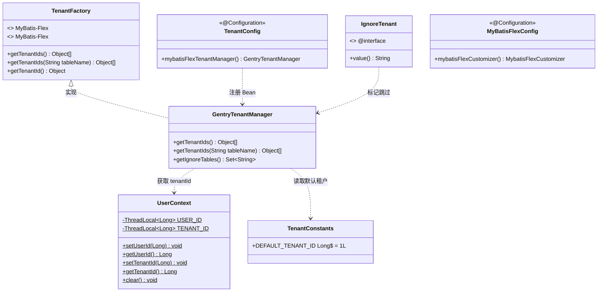
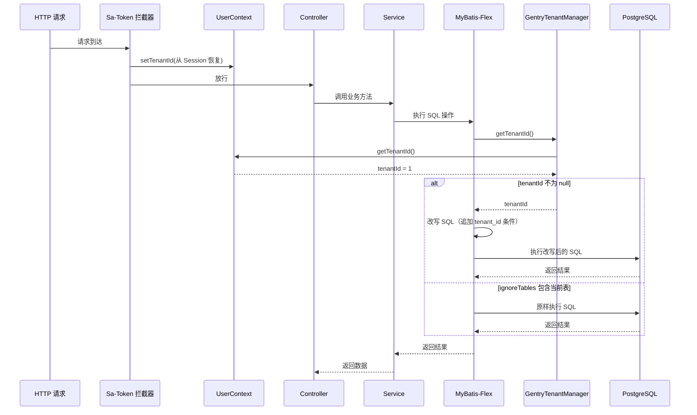
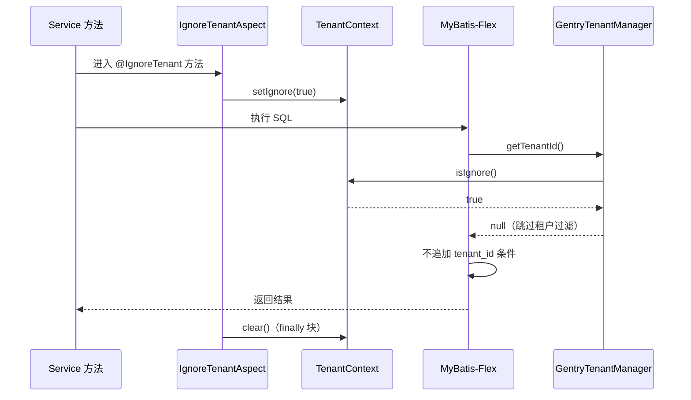
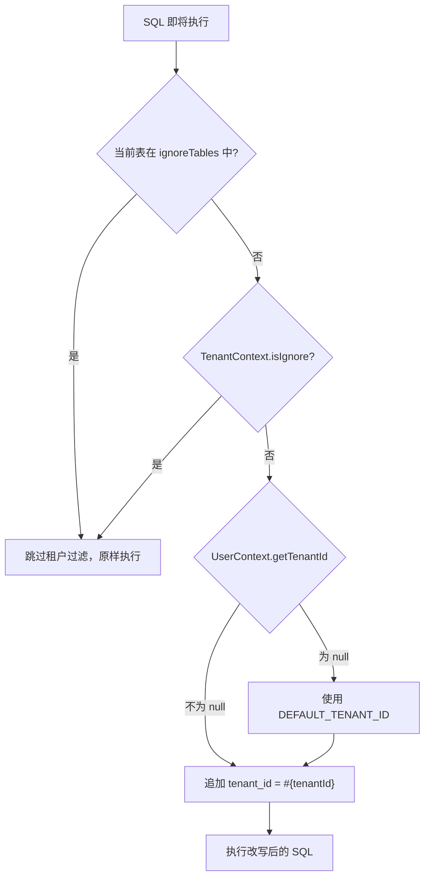
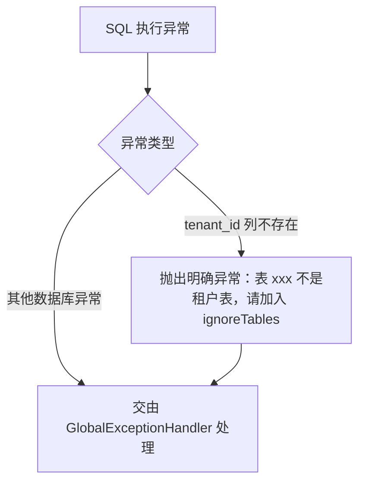

# 多租户拦截器 详细设计

## 文档信息

| 项目 | 内容 |
|------|------|
| 组件名称 | 多租户拦截器（GentryTenantManager） |
| 版本 | v1.0.0 |
| 日期 | 2026-04-12 |
| 所属模块 | gentry-core |
| 优先级 | P0（全局基础设施，所有业务模块依赖） |
| 设计负责人 | 后端开发（AI辅助） |

适用对象：
- 后端开发
- 测试人员
- AI 编程

------

# 一、设计概述

多租户拦截器是平台数据隔离的核心机制。通过 MyBatis-Flex 的 `TenantManager` 扩展点，在 SQL 执行前自动追加 `tenant_id` 条件，确保不同租户的数据完全隔离。当前项目阶段为**单租户**（`TenantConstants.DEFAULT_TENANT_ID = 1L`），但拦截器设计已预留多租户扩展能力。

**核心设计目标：**
- 所有租户表的 SQL（SELECT/INSERT/UPDATE/DELETE）自动追加 `tenant_id` 条件
- 全局表（如 `sys_menu`、`sys_tenant`）不受租户拦截影响
- 提供注解级别的跳过机制（`@IgnoreTenant`），用于跨租户管理场景
- 与 `UserContext` 无缝集成，从 ThreadLocal 获取当前租户 ID
- 当 `tenant_id` 无法获取时，拒绝执行 SQL 并抛出明确异常

**技术方案：** 基于 MyBatis-Flex 1.11.6 的 `TenantManager` 接口实现。`TenantManager` 是 MyBatis-Flex 内置的多租户解决方案，通过 SQL 改写机制自动在 WHERE 子句和 INSERT 字段中注入租户条件。

------

# 二、类设计

## 2.1 类图



## 2.2 核心类详细设计

### 2.2.1 GentryTenantManager

**包路径：** `com.gentry.core.tenant.GentryTenantManager`

**职责：** 实现 MyBatis-Flex `TenantFactory` 接口，为所有租户表的 SQL 自动注入 `tenant_id` 条件。

**实现方式：** MyBatis-Flex 1.11.6 中，`TenantFactory` 是标准 SPI 接口，提供 `getTenantIds()` 方法返回当前租户 ID 数组。`GentryTenantManager` 需注册为 Spring Bean 并在 `MybatisFlexCustomizer` 中通过 `TenantManager.setTenantFactory()` 配置。

**方法详细设计：**

#### getTenantIds()

```java
@Override
public Object[] getTenantIds()
```

| 项目 | 说明 |
|------|------|
| 逻辑 | 1. 从 `UserContext.getTenantId()` 获取当前租户 ID |
|      | 2. 如果不为 null，直接返回 |
|      | 3. 如果为 null，返回 `TenantConstants.DEFAULT_TENANT_ID`（单租户降级） |
| 返回 | `Object[]` 类型的租户 ID 数组（MyBatis-Flex 支持多租户 ID） |
| 异常 | 无（降级为默认租户而非抛异常，避免定时任务等非请求线程场景报错） |

```java
@Override
public Object[] getTenantIds() {
    Long tenantId = UserContext.getTenantId();
    if (tenantId != null) {
        return new Object[]{tenantId};
    }
    // 非请求线程（如定时任务、系统初始化）使用默认租户
    return new Object[]{TenantConstants.DEFAULT_TENANT_ID};
}
```

#### getIgnoreTables()

```java
public Set<String> getIgnoreTables()
```

| 项目 | 说明 |
|------|------|
| 逻辑 | 返回不需要租户隔离的全局表名集合 |
| 返回 | 不可变 Set，包含所有全局表的表名 |

**忽略表清单：**

| 表名 | 说明 |
|------|------|
| `sys_tenant` | 租户表本身，无 tenant_id |
| `sys_menu` | 菜单表，全局共享 |
| `sys_role_menu` | 角色-菜单关联表，通过角色间接隔离 |
| `sys_dict_type` | 字典类型表，全局共享 |
| `sys_dict_data` | 字典数据表，全局共享 |

```java
private static final Set<String> IGNORE_TABLES = Set.of(
    "sys_tenant",
    "sys_menu",
    "sys_role_menu",
    "sys_dict_type",
    "sys_dict_data"
);

public Set<String> getIgnoreTables() {
    return IGNORE_TABLES;
}
```

> **扩展说明：** 后续如新增全局表，只需在此 Set 中添加表名。设备表 `biz_device`、车辆表 `biz_vehicle` 等业务表均包含 `tenant_id`，不在忽略列表中。

```java
@Override
public Object[] getTenantIds(String tableName) {
    return getTenantIds();
}
```

> **说明：** MyBatis-Flex 1.11.6 的 `TenantFactory` 接口要求实现两个重载方法。当前实现对所有表统一处理，未来可按表名差异化返回租户 ID。

### 2.2.2 租户跳过机制

本项目提供**三层租户跳过机制**，适用不同场景：

#### 机制1: ignoreTables() - 全局表配置

**适用场景：** 系统级全局表，所有操作都不需要租户过滤

**实现位置：** `GentryTenantManager.getIgnoreTables()`

```java
public Set<String> getIgnoreTables() {
    return Set.of(
        "sys_tenant",      // 租户表本身
        "sys_menu",        // 菜单表（全局共享）
        "sys_role_menu",   // 角色-菜单关联（通过角色间接隔离）
        "sys_dict_type",   // 字典类型
        "sys_dict_data"    // 字典数据
    );
}
```

**特点：**
- 配置一次，全局生效
- 适用于无 `tenant_id` 字段的全局表
- 所有SQL操作自动跳过租户过滤

---

#### 机制2: @TenantIgnore - 单表级别（MyBatis-Flex内置）

**适用场景：** 某张表大部分操作需要租户过滤，但特定Entity的查询不需要

**使用方式：**
```java
import com.mybatisflex.annotation.TenantIgnore;

@TenantIgnore  // 该Entity的所有查询都跳过租户过滤
@TableName("sys_config")
public class SystemConfig extends BaseEntity {
    private String configKey;
    private String configValue;
}
```

**特点：**
- 标注在Entity类上
- 该Entity的**所有操作**都跳过租户过滤
- 适用于系统配置表等特殊表

---

#### 机制3: @IgnoreTenant - 单接口级别（自定义注解+AOP）

**适用场景：** 某个特定接口需要跨租户查询，但表本身是需要租户过滤的

**实现方案：**

**1. 定义注解：**
```java
@Target({ElementType.METHOD, ElementType.TYPE})
@Retention(RetentionPolicy.RUNTIME)
@Documented
public @interface IgnoreTenant {
    /**
     * 忽略租户过滤的原因说明（仅用于文档目的）
     */
    String value() default "";
}
```

**2. AOP切面实现：**
```java
@Aspect
@Component
public class IgnoreTenantAspect {
    
    @Around("@annotation(ignoreTenant)")
    public Object around(ProceedingJoinPoint joinPoint, IgnoreTenant ignoreTenant) throws Throwable {
        try {
            // 使用 MyBatis-Flex 内置方法暂停租户条件追加
            com.mybatisflex.core.tenant.TenantManager.ignoreTenantCondition();
            return joinPoint.proceed();
        } finally {
            // 必须在 finally 中恢复，防止影响后续 SQL
            com.mybatisflex.core.tenant.TenantManager.restoreTenantCondition();
        }
    }
    
    // 支持类级别注解
    @Around("@within(ignoreTenant)")
    public Object aroundClass(ProceedingJoinPoint joinPoint, IgnoreTenant ignoreTenant) throws Throwable {
        try {
            com.mybatisflex.core.tenant.TenantManager.ignoreTenantCondition();
            return joinPoint.proceed();
        } finally {
            com.mybatisflex.core.tenant.TenantManager.restoreTenantCondition();
        }
    }
}
```

**3. 使用示例：**

```java
// 场景1：平台管理员查看所有租户数据
@IgnoreTenant("平台管理员查看所有租户")
@GetMapping("/admin/all")
public R<List<User>> listAllUsers() {
    // 此接口查询所有租户的用户
    return R.ok(userService.list());
}

// 场景2：登录接口（登录前无租户上下文）
@IgnoreTenant("登录时无租户上下文")
public User findByUsername(String username) {
    return QueryChain.of(User.class)
        .where(User::getUsername).eq(username)
        .one();
}

// 场景3：系统级定时任务
@Scheduled(cron = "0 0 2 * * ?")
@IgnoreTenant("定时任务需跨租户处理")
public void processDailyReport() {
    // 处理所有租户的日报
}
```

**特点：**
- 标注在方法或类上
- 仅该接口/方法跳过租户过滤
- 适用于跨租户查询、登录接口、定时任务等场景
- **必须**在 finally 中清除标记，防止 ThreadLocal 泄漏

---

#### 三层机制对比

| 机制 | 作用范围 | 配置位置 | 适用场景 | 优先级 |
|------|---------|---------|---------|--------|
| ignoreTables() | 全局 | GentryTenantManager | 无tenant_id的全局表 | 最高 |
| @TenantIgnore | 单Entity | Entity类 | 特定表的所有操作 | 中 |
| @IgnoreTenant | 单接口 | Controller/Service方法 | 特定接口的跨租户查询 | 低 |

**执行优先级：** ignoreTables() > @TenantIgnore > @IgnoreTenant

**注意事项：**
1. 三层机制互不冲突，可以组合使用
2. @IgnoreTenant 必须在 finally 中清除标记
3. 优先使用 ignoreTables() 配置全局表，避免重复标注
4. @TenantIgnore 谨慎使用，确保表确实不需要租户隔离

### 2.2.3 TenantConfig

**包路径：** `com.gentry.core.config.TenantConfig`

**职责：** Spring 配置类，注册 `GentryTenantManager` 和 `IgnoreTenantAspect` 为 Spring Bean。

```java
@Configuration
public class TenantConfig {

    @Bean
    public GentryTenantManager gentryTenantManager() {
        return new GentryTenantManager();
    }

    @Bean
    public IgnoreTenantAspect ignoreTenantAspect() {
        return new IgnoreTenantAspect();
    }
}
```

**MyBatis-Flex 集成配置：**

```java
@Configuration
public class MyBatisFlexConfig {

    @Autowired
    private GentryTenantManager tenantManager;

    @Bean
    public MybatisFlexCustomizer mybatisFlexCustomizer() {
        return options -> {
            // 配置多租户管理器
            options.setTenantManager(tenantManager);
        };
    }
}
```

> **注意：** MyBatis-Flex 的配置方式为通过 `MybatisFlexAutoConfiguration` 自动配置，在 `MybatisFlexCustomizer` 中设置 `TenantManager`。如果项目中已有 `MyBatisFlexConfig`，在此类中追加配置即可。

------

# 三、接口设计

## 3.1 对外接口

### @IgnoreTenant 注解

```java
// 在 Service 方法上标注，跳过租户隔离
@IgnoreTenant("登录时无租户上下文")
public User findByUsername(String username) {
    // 此查询不会追加 WHERE tenant_id = ?
    return QueryChain.of(User.class)
        .where(User::getUsername).eq(username)
        .and(User::getDeleted).eq(0)
        .one();
}
```

```java
// 在 Controller 上标注，整个接口跳过租户隔离
@IgnoreTenant("平台管理员接口")
@GetMapping("/admin/all")
public R<List<Vehicle>> listAll() {
    // 此接口查询所有租户数据
}
```

### TenantContext 工具类

```java
// 手动控制（通常不需要，优先使用注解）
TenantContext.setIgnore(true);
try {
    // 跨租户操作
} finally {
    TenantContext.clear();
}
```

## 3.2 内部接口

### GentryTenantManager 与 MyBatis-Flex 的交互

MyBatis-Flex 在执行 SQL 前会调用 `TenantManager` 的方法：

| SQL 类型 | 调用方法 | 行为 |
|----------|---------|------|
| SELECT | `getTenantId()` | 追加 `WHERE tenant_id = ?` |
| INSERT | `getTenantId()` | 自动设置 `tenant_id` 字段值 |
| UPDATE | `getTenantId()` | 追加 `WHERE tenant_id = ?` |
| DELETE | `getTenantId()` | 追加 `WHERE tenant_id = ?`（含逻辑删除） |

**`ignoreTables()` 返回的表名集合中的表不执行任何上述操作。**

------

# 四、流程设计

## 4.1 核心流程图



## 4.2 @IgnoreTenant 处理流程



## 4.3 租户表判断流程



## 4.4 异常处理流程



------

# 五、数据设计

## 5.1 配置项

无需额外 application.yml 配置。租户管理通过代码配置实现。

如果需要通过配置文件管理忽略表列表（可选增强）：

```yaml
# 可选：通过配置文件管理忽略表（代码中已硬编码，此为扩展预留）
gentry:
  tenant:
    ignore-tables:
      - sys_tenant
      - sys_menu
      - sys_role_menu
      - sys_dict_type
      - sys_dict_data
```

## 5.2 缓存设计

本组件不使用缓存。忽略表集合 `IGNORE_TABLES` 为不可变常量，无需缓存。

## 5.3 数据库查询

本组件不直接查询数据库。租户 ID 的来源为 `UserContext`（ThreadLocal），由 `SaTokenConfig` 中的拦截器从 Sa-Token Session 恢复。

### SQL 改写示例

**原始 SQL：**
```sql
SELECT * FROM sys_user WHERE username = 'admin' AND deleted = 0
```

**改写后 SQL：**
```sql
SELECT * FROM sys_user WHERE username = 'admin' AND deleted = 0 AND tenant_id = 1
```

**INSERT 改写：**
```sql
-- 原始
INSERT INTO sys_role (id, code, name, status) VALUES (1001, 'admin', '管理员', 1)

-- 改写后
INSERT INTO sys_role (id, tenant_id, code, name, status) VALUES (1001, 1, 'admin', '管理员', 1)
```

**UPDATE 改写：**
```sql
-- 原始
UPDATE sys_user SET nickname = '测试' WHERE id = 1

-- 改写后
UPDATE sys_user SET nickname = '测试' WHERE id = 1 AND tenant_id = 1
```

**逻辑 DELETE 改写：**
```sql
-- 原始
UPDATE sys_user SET deleted = 1 WHERE id = 1

-- 改写后
UPDATE sys_user SET deleted = 1 WHERE id = 1 AND tenant_id = 1
```

### 全局表不追加条件示例

```sql
-- sys_menu 查询，不追加 tenant_id
SELECT * FROM sys_menu WHERE status = 1 ORDER BY sort

-- sys_tenant 查询，不追加 tenant_id
SELECT * FROM sys_tenant WHERE code = 'default'
```

------

# 六、依赖关系

| 依赖 | 版本 | 用途 |
|------|------|------|
| mybatis-flex-spring-boot3-starter | 1.11.6 | TenantManager 接口、MybatisFlexCustomizer |
| spring-boot-starter-web | 3.2.5 | @Configuration、@Aspect |
| spring-boot-starter-aop | 3.2.5 | @Around 切面处理 @IgnoreTenant |

**内部依赖：**

| 内部类 | 用途 |
|--------|------|
| UserContext | 获取当前线程的 tenantId |
| TenantConstants | 读取默认租户 ID |

**需要新增的 Maven 依赖：**

```xml
<!-- gentry-core/pom.xml -->
<!-- spring-boot-starter-aop 用于 @IgnoreTenant 切面 -->
<dependency>
    <groupId>org.springframework.boot</groupId>
    <artifactId>spring-boot-starter-aop</artifactId>
</dependency>

<!-- mybatis-flex（需在 gentry-core 或 precision-infrastructure 中引入） -->
<dependency>
    <groupId>com.mybatis-flex</groupId>
    <artifactId>mybatis-flex-spring-boot3-starter</artifactId>
    <version>${mybatis-flex.version}</version>
</dependency>
```

------

# 七、测试设计

## 7.1 单元测试用例

**测试类：** `com.gentry.core.interceptor.GentryTenantManagerTest`

| 测试方法名 | 场景 | 前置条件 | 预期结果 |
|-----------|------|---------|---------|
| getTenantId_有租户上下文_返回上下文租户ID | UserContext 已设置 tenantId=5 | UserContext.setTenantId(5L) | 返回 5L |
| getTenantId_无租户上下文_返回默认租户ID | UserContext tenantId 为 null | UserContext.clear() | 返回 TenantConstants.DEFAULT_TENANT_ID (1L) |
| getTenantId_IgnoreTenant标记_返回null | TenantContext.isIgnore()=true | TenantContext.setIgnore(true) | 返回 null |
| ignoreTables_包含系统表_返回正确的忽略集合 | 查询忽略表集合 | - | 包含 sys_tenant, sys_menu, sys_role_menu, sys_dict_type, sys_dict_data |
| ignoreTables_集合不可变_修改抛异常 | 尝试向集合添加元素 | - | 抛出 UnsupportedOperationException |

**测试类：** `com.gentry.core.interceptor.IgnoreTenantAspectTest`

| 测试方法名 | 场景 | 前置条件 | 预期结果 |
|-----------|------|---------|---------|
| around_正常执行_设置并清除Ignore标记 | 调用 @IgnoreTenant 方法 | - | 方法执行期间 TenantContext.isIgnore()=true，执行后为 false |
| around_方法抛异常_仍然清除Ignore标记 | @IgnoreTenant 方法抛 RuntimeException | - | TenantContext.isIgnore()=false（finally 保证清除） |

## 7.2 集成测试场景

**测试类：** `com.gentry.core.interceptor.TenantInterceptorIntegrationTest`

| 场景 | 测试方法 | 说明 |
|------|---------|------|
| SELECT 自动追加租户条件 | 以租户 A 身份查询 sys_user | SQL 日志中包含 `AND tenant_id = 1` |
| INSERT 自动填充租户ID | 插入 sys_role 记录 | SQL 日志中 INSERT 语句包含 `tenant_id = 1` |
| UPDATE 自动追加租户条件 | 更新 sys_user | SQL 日志中包含 `AND tenant_id = 1` |
| DELETE 自动追加租户条件 | 逻辑删除 sys_dept | SQL 日志中包含 `AND tenant_id = 1` |
| 全局表不追加条件 | 查询 sys_menu | SQL 日志中不包含 `tenant_id` |
| 全局表 sys_tenant 不追加条件 | 查询 sys_tenant | SQL 日志中不包含 `tenant_id` |
| @IgnoreTenant 跳过租户过滤 | 调用 @IgnoreTenant 标注的方法查询 sys_user | SQL 日志中不包含 `tenant_id` |
| 租户数据隔离验证 | 租户 A 和租户 B 各插入数据，租户 A 查询 | 只返回租户 A 的数据 |
| 多租户上下文切换 | 模拟不同租户请求 | 各请求获取正确的租户数据 |

**集成测试 SQL 日志验证配置：**

```yaml
# application-test.yml
mybatis-flex:
  configuration:
    log-impl: org.apache.ibatis.logging.stdout.StdOutImpl  # 输出 SQL 日志
```

**集成测试示例：**

```java
@DataJpaTest  // 或 @MybatisFlexTest（如果有对应 starter）
class TenantInterceptorIntegrationTest {

    @Autowired
    private UserMapper userMapper;

    @Test
    void 查询用户_自动追加租户条件() {
        // 设置租户上下文
        UserContext.setTenantId(1L);

        // 执行查询
        List<User> users = userMapper.selectAll();

        // 验证所有返回数据的 tenant_id 都是 1
        assertThat(users).allMatch(u -> u.getTenantId().equals(1L));

        // 清理
        UserContext.clear();
    }
}
```

### 租户隔离完整性验证（手动测试脚本）

```sql
-- 准备测试数据
INSERT INTO sys_user (id, tenant_id, username, password, nickname, status, deleted)
VALUES (9001, 1, 'tenant_a_user', 'xxx', '租户A用户', 1, 0);

INSERT INTO sys_user (id, tenant_id, username, password, nickname, status, deleted)
VALUES (9002, 2, 'tenant_b_user', 'xxx', '租户B用户', 1, 0);

-- 以租户 A 登录后查询，应只看到 tenant_id=1 的数据
-- 预期：返回 1 条（tenant_a_user），不包含 tenant_b_user
```

------

# 八、变更记录

| 版本 | 日期 | 修改人 | 变更内容 | 变更原因 | 评审人 |
|------|------|--------|---------|---------|--------|
| v1.0.0 | 2026-04-12 | 后端开发（AI） | 初始版本 | 多租户拦截器详细设计 | 待评审 |
