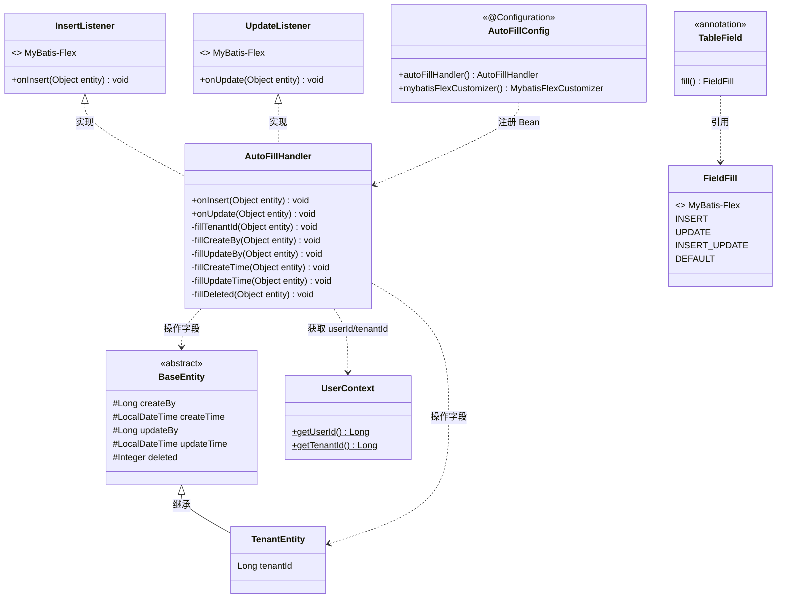
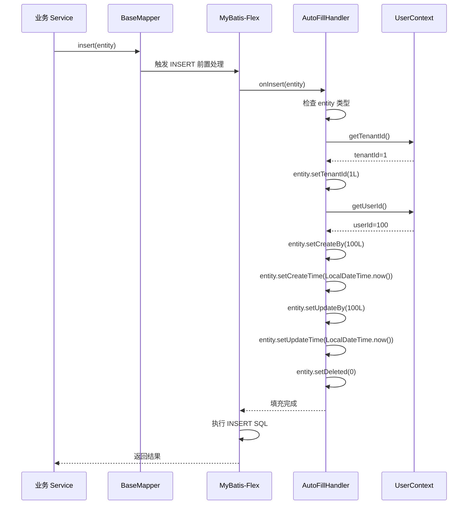
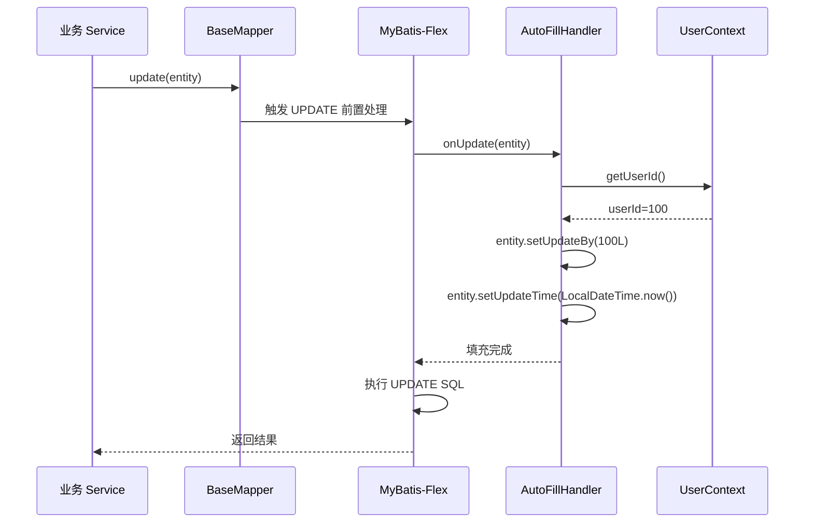
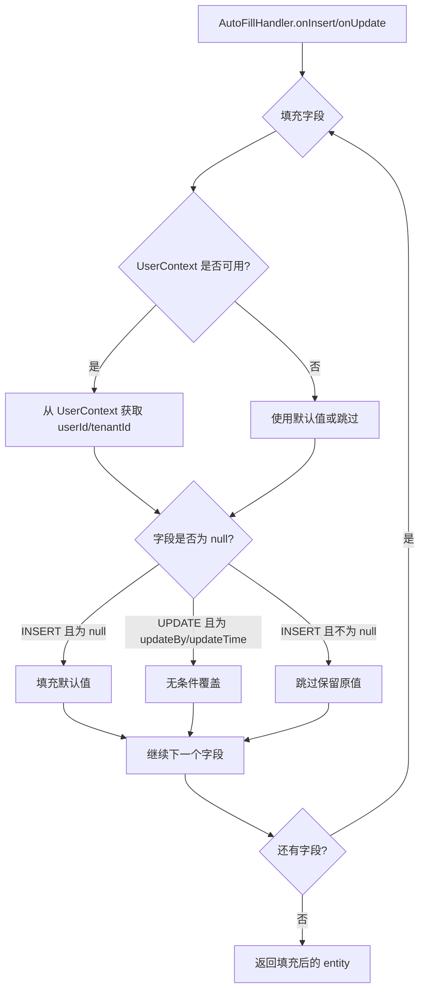

# 自动填充处理器 详细设计

## 文档信息

| 项目 | 内容 |
|------|------|
| 组件名称 | 自动填充处理器（AutoFillHandler） |
| 版本 | v1.0.0 |
| 日期 | 2026-04-12 |
| 所属模块 | precision-core |
| 优先级 | P0（全局基础设施，所有业务模块依赖） |
| 设计负责人 | 后端开发（AI辅助） |

适用对象：
- 后端开发
- 测试人员
- AI 编程

------

# 一、设计概述

自动填充处理器负责在数据库 INSERT 和 UPDATE 操作执行前，自动为实体对象的公共字段赋值。这些字段包括 `tenant_id`、`create_time`、`create_by`、`update_time`、`update_by` 和 `deleted`。开发者无需在业务代码中手动设置这些字段，减少重复代码并保证数据一致性。

**技术方案：** 基于 MyBatis-Flex 1.11.6 的 `InsertListener` + `UpdateListener` 接口（实体拦截器）实现。MyBatis-Flex 提供了 `@TableField(fill = FieldFill.INSERT)` 和 `@TableField(fill = FieldFill.INSERT_UPDATE)` 注解标记需要自动填充的字段，框架在 SQL 执行前回调 `InsertListener.onInsert` / `UpdateListener.onUpdate` 方法完成字段赋值。

**实现方式说明：**
本处理器通过 Java 类型转换（instanceof）直接调用实体的 setter 方法，**不使用反射**。
因为 BaseEntity 和 TenantEntity 是已知的抽象类，所有继承它们的实体都可以安全类型转换。

**优点：**
- 类型安全，编译期检查
- 性能优于反射
- IDE 支持自动补全和重构

**核心设计目标：**
- INSERT 时自动填充：`tenant_id`、`create_time`、`create_by`、`update_time`、`update_by`、`deleted`
- UPDATE 时自动填充：`update_time`、`update_by`
- 从 `UserContext` 获取当前用户 ID 和租户 ID
- 非请求线程（定时任务等）使用合理的默认值
- 与 `BaseEntity` / `TenantEntity` 基类配合使用

------

# 二、类设计

## 2.1 类图



## 2.2 核心类详细设计

### 2.2.1 AutoFillHandler

**包路径：** `com.precision.core.interceptor.AutoFillHandler`

**职责：** 实现 MyBatis-Flex `InsertListener` + `UpdateListener` 接口，在实体持久化前自动填充公共字段。

**实现接口：** `com.mybatisflex.core.event.InsertListener`、`com.mybatisflex.core.event.UpdateListener`

**方法详细设计：**

#### onInsert(Object entity)

```java
@Override
public void onInsert(Object entity)
```

| 项目 | 说明 |
|------|------|
| 调用时机 | MyBatis-Flex 执行 INSERT 前，对标记了 `FieldFill.INSERT` 或 `FieldFill.INSERT_UPDATE` 的字段 |
| 逻辑 | 按顺序填充以下字段（仅当字段为 null 时填充） |
| 异常 | 字段填充失败时仅记录 WARN 日志，不中断业务流程 |

**填充字段顺序：**

| 序号 | 字段 | 来源 | 条件 |
|------|------|------|------|
| 1 | tenant_id | UserContext.getTenantId() | entity 为 TenantEntity 子类，且 tenantId 为 null |
| 2 | create_by | UserContext.getUserId() | createBy 为 null |
| 3 | create_time | LocalDateTime.now() | createTime 为 null |
| 4 | update_by | UserContext.getUserId() | updateBy 为 null |
| 5 | update_time | LocalDateTime.now() | updateTime 为 null |
| 6 | deleted | 0 | deleted 为 null |

```java
@Override
public void onInsert(Object entity) {
    // 1. 填充租户ID（仅租户实体）
    fillTenantId(entity);
    // 2. 填充创建人
    fillCreateBy(entity);
    // 3. 填充创建时间
    fillCreateTime(entity);
    // 4. 填充更新人
    fillUpdateBy(entity);
    // 5. 填充更新时间
    fillUpdateTime(entity);
    // 6. 填充逻辑删除标记
    fillDeleted(entity);
}
```

#### onUpdate(Object entity)

```java
@Override
public void onUpdate(Object entity)
```

| 项目 | 说明 |
|------|------|
| 调用时机 | MyBatis-Flex 执行 UPDATE 前，对标记了 `FieldFill.UPDATE` 或 `FieldFill.INSERT_UPDATE` 的字段 |
| 逻辑 | 仅填充更新相关字段 |
| 异常 | 字段填充失败时仅记录 WARN 日志，不中断业务流程 |

**填充字段顺序：**

| 序号 | 字段 | 来源 | 条件 |
|------|------|------|------|
| 1 | update_by | UserContext.getUserId() | 无条件填充（覆盖） |
| 2 | update_time | LocalDateTime.now() | 无条件填充（覆盖） |

```java
@Override
public void onUpdate(Object entity) {
    // 1. 填充更新人（UPDATE 时无条件覆盖）
    fillUpdateBy(entity);
    // 2. 填充更新时间（UPDATE 时无条件覆盖）
    fillUpdateTime(entity);
}
```

#### 私有方法设计

**fillTenantId(Object entity)**

```java
private void fillTenantId(Object entity)
```

| 项目 | 说明 |
|------|------|
| 逻辑 | 1. 检查 entity 是否为 TenantEntity 实例 |
|      | 2. 获取 tenantId 字段值 |
|      | 3. 如果为 null，从 UserContext 获取 |
|      | 4. 如果 UserContext 也为 null，使用默认租户 |
| 安全 | 直接类型转换调用setter方法，类型安全 |

```java
private void fillTenantId(Object entity) {
    if (entity instanceof TenantEntity tenantEntity) {
        if (tenantEntity.getTenantId() == null) {
            Long tenantId = UserContext.getTenantId();
            if (tenantId == null) {
                tenantId = TenantConstants.DEFAULT_TENANT_ID;
            }
            tenantEntity.setTenantId(tenantId);
        }
    }
}
```

**fillCreateBy(Object entity)**

```java
private void fillCreateBy(Object entity)
```

| 项目 | 说明 |
|------|------|
| 逻辑 | 1. 检查 entity 是否为 BaseEntity 实例 |
|      | 2. 如果 createBy 为 null，从 UserContext.getUserId() 获取 |
|      | 3. UserContext 为 null 时跳过（系统级操作无用户上下文） |

**fillUpdateBy(Object entity)**

```java
private void fillUpdateBy(Object entity)
```

| 项目 | 说明 |
|------|------|
| 逻辑 | 1. 检查 entity 是否为 BaseEntity 实例 |
|      | 2. UPDATE 时无条件覆盖 updateBy |
|      | 3. UserContext 为 null 时设为 null（系统级操作） |

**fillCreateTime(Object entity)**

```java
private void fillCreateTime(Object entity)
```

| 项目 | 说明 |
|------|------|
| 逻辑 | 1. 检查 entity 是否为 BaseEntity 实例 |
|      | 2. 如果 createTime 为 null，设为 `LocalDateTime.now()` |

**fillUpdateTime(Object entity)**

```java
private void fillUpdateTime(Object entity)
```

| 项目 | 说明 |
|------|------|
| 逻辑 | 1. 检查 entity 是否为 BaseEntity 实例 |
|      | 2. INSERT 时如果为 null 则填充 |
|      | 3. UPDATE 时无条件覆盖 |

**fillDeleted(Object entity)**

```java
private void fillDeleted(Object entity)
```

| 项目 | 说明 |
|------|------|
| 逻辑 | 1. 检查 entity 是否为 BaseEntity 实例 |
|      | 2. 如果 deleted 为 null，设为 0 |

### 2.2.2 BaseEntity（公共基类）

**包路径：** `com.precision.core.entity.BaseEntity`

**职责：** 所有实体的公共基类，定义公共字段和 MyBatis-Flex 自动填充注解。

```java
@Data
public abstract class BaseEntity {

    @TableField(fill = FieldFill.INSERT)
    private Long createBy;

    @TableField(fill = FieldFill.INSERT)
    private LocalDateTime createTime;

    @TableField(fill = FieldFill.INSERT_UPDATE)
    private Long updateBy;

    @TableField(fill = FieldFill.INSERT_UPDATE)
    private LocalDateTime updateTime;

    @TableLogic
    private Integer deleted;
}
```

### 2.2.3 TenantEntity（租户实体基类）

**包路径：** `com.precision.core.entity.TenantEntity`

**职责：** 租户表实体的公共基类，继承 BaseEntity 并增加 `tenant_id` 字段。

```java
@Data
@EqualsAndHashCode(callSuper = true)
public abstract class TenantEntity extends BaseEntity {

    @Column(tenantId = true)
    @TableField(fill = FieldFill.INSERT)
    private Long tenantId;
}
```

**实体继承规则：**

| 表类型 | 基类 | 示例 |
|--------|------|------|
| 租户表（含 tenant_id） | TenantEntity | User, Role, Dept, Device, Vehicle |
| 全局表（不含 tenant_id） | BaseEntity | Menu |

### 2.2.4 AutoFillConfig

**包路径：** `com.precision.core.config.AutoFillConfig`

**职责：** Spring 配置类，注册 `AutoFillHandler` 并将其集成到 MyBatis-Flex。

```java
@Configuration
public class AutoFillConfig {

    @Bean
    public AutoFillHandler autoFillHandler() {
        return new AutoFillHandler();
    }

    @Bean
    public MybatisFlexCustomizer mybatisFlexAutoFillCustomizer(
            AutoFillHandler autoFillHandler) {
        return options -> {
            // 注册实体拦截器
            options.registerInsertListener(autoFillHandler);
            options.registerUpdateListener(autoFillHandler);
        };
    }
}
```

> **注意：** 如果项目中已有 `MyBatisFlexConfig`，应将此配置合并到同一个 `MybatisFlexCustomizer` Bean 中，避免多个 Customizer 冲突。

------

# 三、接口设计

## 3.1 对外接口

本组件不暴露 REST API。对外通过 Entity 基类和注解机制自动生效。

### Entity 定义规范

所有业务实体必须继承 `BaseEntity` 或 `TenantEntity`：

```java
// 租户表实体 —— 继承 TenantEntity
@Data
@EqualsAndHashCode(callSuper = true)
@TableName("sys_user")
public class User extends TenantEntity {

    @TableId(type = IdType.Generator, value = KeyGenerators.FlexID.class)
    private Long id;

    private Long deptId;
    private String username;
    private String password;
    private String nickname;
    // ... 其他业务字段
    // createBy, createTime, updateBy, updateTime, deleted, tenantId
    // 由基类提供，无需重复定义
}
```

```java
// 全局表实体 —— 继承 BaseEntity
@Data
@EqualsAndHashCode(callSuper = true)
@TableName("sys_menu")
public class Menu extends BaseEntity {

    @TableId(type = IdType.Generator, value = KeyGenerators.FlexID.class)
    private Long id;

    private Long parentId;
    private String name;
    // ... 其他业务字段
    // createBy, createTime, updateBy, updateTime, deleted
    // 由基类提供，无需重复定义
    // 注意：不含 tenantId
}
```

### 业务代码使用方式

开发者无需手动设置公共字段，直接使用即可：

```java
// INSERT —— 无需设置 tenantId, createBy, createTime 等
User user = new User();
user.setUsername("admin");
user.setPassword("xxx");
userMapper.insert(user);
// 自动填充：tenantId=1, createBy=当前用户ID, createTime=now(), deleted=0

// UPDATE —— 无需设置 updateBy, updateTime
user.setNickname("新昵称");
userMapper.update(user);
// 自动填充：updateBy=当前用户ID, updateTime=now()
```

## 3.2 内部接口

### InsertListener / UpdateListener 回调接口

MyBatis-Flex 框架在以下时机调用 `InsertListener` / `UpdateListener`：

| 回调方法 | 触发条件 | 拦截范围 |
|---------|---------|---------|
| `onInsert(Object entity)` | `BaseMapper.insert()` 系列方法 | 所有继承 BaseEntity 的实体 |
| `onUpdate(Object entity)` | `BaseMapper.update()` 系列方法 | 所有继承 BaseEntity 的实体 |

**不触发的场景：**
- `BaseMapper.deleteById()` 等删除操作（逻辑删除通过 UPDATE 实现，会触发 onUpdate）
- `BaseMapper.selectById()` 等查询操作
- 原生 SQL 操作（`@Select` 注解的 mapper 方法）
- `QueryChain` 的批量操作（如果底层走 insert/update，仍会触发）

------

# 四、流程设计

## 4.1 核心流程图

### INSERT 自动填充流程



### UPDATE 自动填充流程



## 4.2 异常处理流程



### 异常降级策略

| 场景 | 处理方式 | 说明 |
|------|---------|------|
| UserContext 为空（定时任务） | tenantId 使用 DEFAULT_TENANT_ID，createBy/updateBy 设为 null | 系统级操作 |
| entity 非 BaseEntity 子类 | 跳过所有字段填充 | 兼容不支持基类的实体 |
| 字段反射设置失败 | 记录 WARN 日志，继续填充其他字段 | 不中断业务 |

------

# 五、数据设计

## 5.1 配置项

本组件无需额外 application.yml 配置。

## 5.2 缓存设计

本组件不使用缓存。

## 5.3 数据库查询

本组件不直接查询数据库。

### 自动填充字段与 Entity 注解对应关系

| 数据库字段 | Java 字段 | Entity 注解 | 填充时机 | 填充值来源 |
|-----------|----------|------------|---------|-----------|
| tenant_id | TenantEntity.tenantId | `@Column(tenantId=true)` + `@TableField(fill=INSERT)` | INSERT | UserContext.getTenantId() |
| create_by | BaseEntity.createBy | `@TableField(fill=INSERT)` | INSERT | UserContext.getUserId() |
| create_time | BaseEntity.createTime | `@TableField(fill=INSERT)` | INSERT | LocalDateTime.now() |
| update_by | BaseEntity.updateBy | `@TableField(fill=INSERT_UPDATE)` | INSERT + UPDATE | UserContext.getUserId() |
| update_time | BaseEntity.updateTime | `@TableField(fill=INSERT_UPDATE)` | INSERT + UPDATE | LocalDateTime.now() |
| deleted | BaseEntity.deleted | `@TableLogic` | INSERT（仅初始化） | 0 |

### 自动填充后的 SQL 示例

**INSERT User：**

```sql
-- Java 代码只设置了 username 和 password
User user = new User();
user.setUsername("testuser");
user.setPassword("encrypted");

-- AutoFillHandler 自动填充后执行的 SQL：
INSERT INTO sys_user (id, tenant_id, dept_id, username, password, create_by,
                      create_time, update_by, update_time, deleted)
VALUES (1001, 1, NULL, 'testuser', 'encrypted', 100,
        '2026-04-12 10:30:00', 100, '2026-04-12 10:30:00', 0)
```

**UPDATE User：**

```sql
-- Java 代码只修改了 nickname
user.setNickname("新昵称");
userMapper.update(user);

-- AutoFillHandler 自动填充后执行的 SQL：
UPDATE sys_user
SET nickname = '新昵称',
    update_by = 100,
    update_time = '2026-04-12 10:35:00'
WHERE id = 1001 AND tenant_id = 1 AND deleted = 0
```

------

# 六、依赖关系

| 依赖 | 版本 | 用途 |
|------|------|------|
| mybatis-flex-spring-boot3-starter | 1.11.6 | InsertListener / UpdateListener 接口、@TableField 注解、FieldFill 枚举 |
| spring-boot-starter-web | 3.2.5 | @Configuration |

**内部依赖：**

| 内部类 | 用途 |
|--------|------|
| UserContext | 获取当前线程的 userId 和 tenantId |
| TenantConstants | 读取默认租户 ID |
| BaseEntity | 定义公共字段和填充注解 |
| TenantEntity | 定义租户字段和填充注解 |

------

# 七、测试设计

## 7.1 单元测试用例

**测试类：** `com.precision.core.interceptor.AutoFillHandlerTest`

| 测试方法名 | 场景 | 前置条件 | 预期结果 |
|-----------|------|---------|---------|
| onInsert_租户实体_全部字段自动填充 | TenantEntity 子类，所有字段为 null | UserContext.setTenantId(1L), setUserId(100L) | tenantId=1, createBy=100, createTime 非null, updateBy=100, updateTime 非null, deleted=0 |
| onInsert_全局表实体_不填充tenantId | BaseEntity 子类（非 TenantEntity） | UserContext.setUserId(100L) | createBy=100, createTime 非null, tenantId 字段不存在 |
| onInsert_已有tenantId_不覆盖 | entity.tenantId 已设为 5 | UserContext.setTenantId(1L) | tenantId 保持 5 |
| onInsert_已有createTime_不覆盖 | entity.createTime 已设为特定时间 | - | createTime 保持原值 |
| onInsert_无UserContext_createBy为null | UserContext 未设置 | UserContext.clear() | createBy=null, createTime 非null, deleted=0 |
| onInsert_deleted为null_填充为0 | entity.deleted 为 null | - | deleted=0 |
| onInsert_deleted已有值_不覆盖 | entity.deleted=1 | - | deleted 保持 1 |
| onUpdate_填充updateBy和UpdateTime | BaseEntity 子类 | UserContext.setUserId(200L) | updateBy=200, updateTime 非null |
| onUpdate_无UserContext_updateBy为null | UserContext 未设置 | UserContext.clear() | updateBy=null, updateTime 非null |
| onUpdate_不修改createBy和CreateTime | entity.createBy=100, createTime 已有值 | UserContext.setUserId(200L) | createBy 保持 100, createTime 保持原值 |
| onInsert_非BaseEntity_跳过填充 | 传入普通 Object | - | 无异常，无字段修改 |

### 单元测试代码示例

```java
@ExtendWith(MockitoExtension.class)
class AutoFillHandlerTest {

    private AutoFillHandler handler;

    @BeforeEach
    void setUp() {
        handler = new AutoFillHandler();
        UserContext.clear();
    }

    @AfterEach
    void tearDown() {
        UserContext.clear();
    }

    @Test
    void onInsert_租户实体_全部字段自动填充() {
        // Given
        UserContext.setTenantId(1L);
        UserContext.setUserId(100L);

        User user = new User();
        user.setUsername("test");

        // When
        handler.onInsert(user);

        // Then
        assertEquals(1L, user.getTenantId());
        assertEquals(100L, user.getCreateBy());
        assertNotNull(user.getCreateTime());
        assertEquals(100L, user.getUpdateBy());
        assertNotNull(user.getUpdateTime());
        assertEquals(0, user.getDeleted());
    }

    @Test
    void onInsert_已有tenantId_不覆盖() {
        // Given
        UserContext.setTenantId(1L);
        User user = new User();
        user.setTenantId(5L);

        // When
        handler.onInsert(user);

        // Then
        assertEquals(5L, user.getTenantId()); // 保持原值 5
    }

    @Test
    void onUpdate_填充updateBy和UpdateTime() {
        // Given
        UserContext.setUserId(200L);
        User user = new User();
        user.setCreateBy(100L); // 不应被修改
        LocalDateTime createTime = LocalDateTime.of(2026, 1, 1, 0, 0);
        user.setCreateTime(createTime); // 不应被修改

        // When
        handler.onUpdate(user);

        // Then
        assertEquals(200L, user.getUpdateBy());
        assertNotNull(user.getUpdateTime());
        assertEquals(100L, user.getCreateBy()); // 未被修改
        assertEquals(createTime, user.getCreateTime()); // 未被修改
    }
}
```

## 7.2 集成测试场景

**测试类：** `com.precision.core.interceptor.AutoFillIntegrationTest`

| 场景 | 测试方法 | 说明 |
|------|---------|------|
| INSERT 自动填充验证 | 插入一条 User，查询数据库 | tenant_id、create_by、create_time、update_by、update_time、deleted 均有值 |
| UPDATE 自动填充验证 | 更新 User 的 nickname，查询数据库 | update_by 和 update_time 被更新，create_by 和 create_time 不变 |
| 全局表 INSERT 不含 tenantId | 插入一条 Menu | SQL 日志中 INSERT 不含 tenant_id 字段 |
| 非请求线程插入数据 | 在 @Scheduled 方法中插入 User | tenantId 使用默认值 1，createBy 为 null |
| 并发插入数据互不干扰 | 两个线程模拟不同用户同时插入 | 各自 createBy 正确，互不干扰 |

**集成测试示例：**

```java
@SpringBootTest
@AutoConfigureMockMvc
class AutoFillIntegrationTest {

    @Autowired
    private UserMapper userMapper;

    @Test
    void INSERT自动填充_验证数据库字段() {
        // Given
        UserContext.setTenantId(1L);
        UserContext.setUserId(100L);

        User user = new User();
        user.setUsername("fill_test");
        user.setPassword("xxx");
        user.setNickname("填充测试");

        // When
        userMapper.insert(user);

        // Then
        User dbUser = userMapper.selectOneById(user.getId());
        assertEquals(1L, dbUser.getTenantId());
        assertEquals(100L, dbUser.getCreateBy());
        assertNotNull(dbUser.getCreateTime());
        assertEquals(0, dbUser.getDeleted());

        // Clean
        UserContext.clear();
    }
}
```

------

# 八、变更记录

| 版本 | 日期 | 修改人 | 变更内容 | 变更原因 | 评审人 |
|------|------|--------|---------|---------|--------|
| v1.0.0 | 2026-04-12 | 后端开发（AI） | 初始版本 | 自动填充处理器详细设计 | 待评审 |
