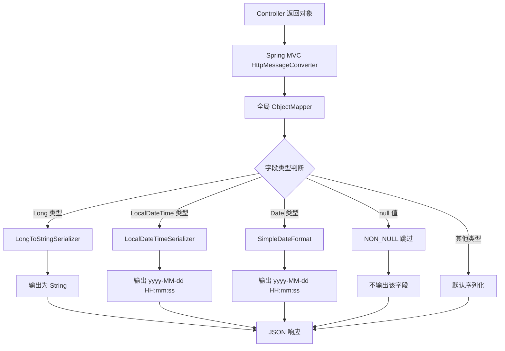
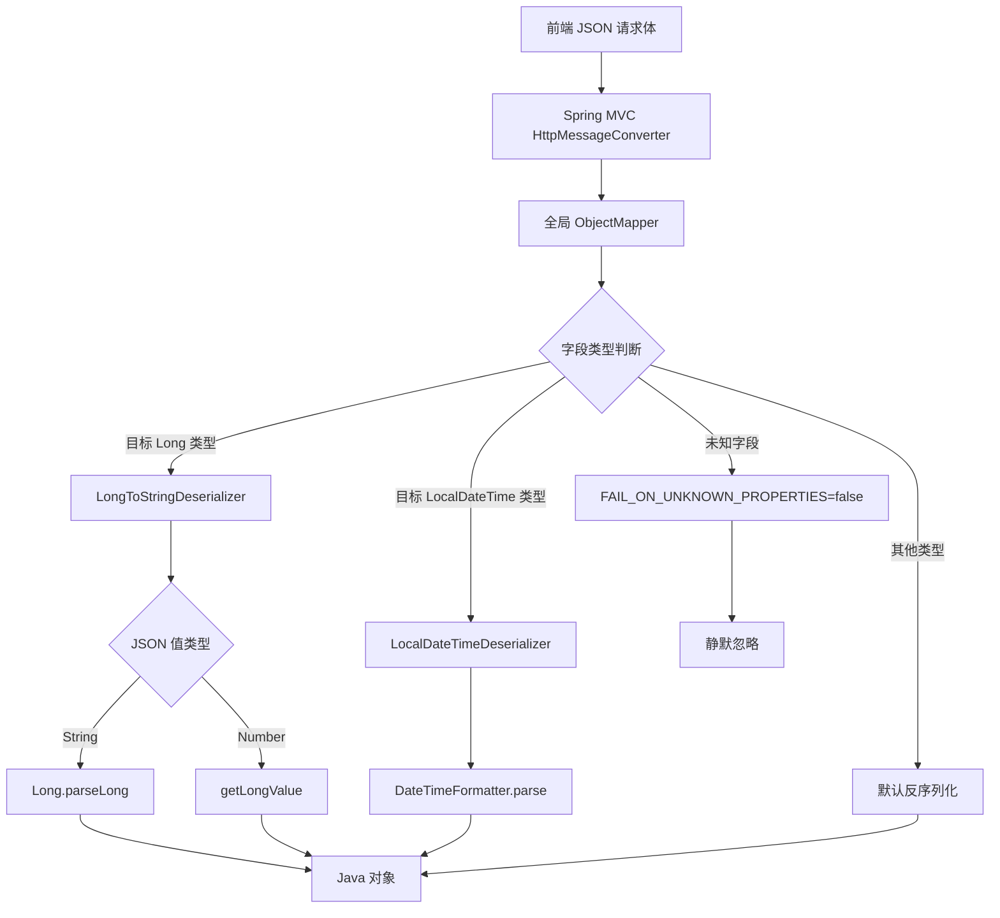
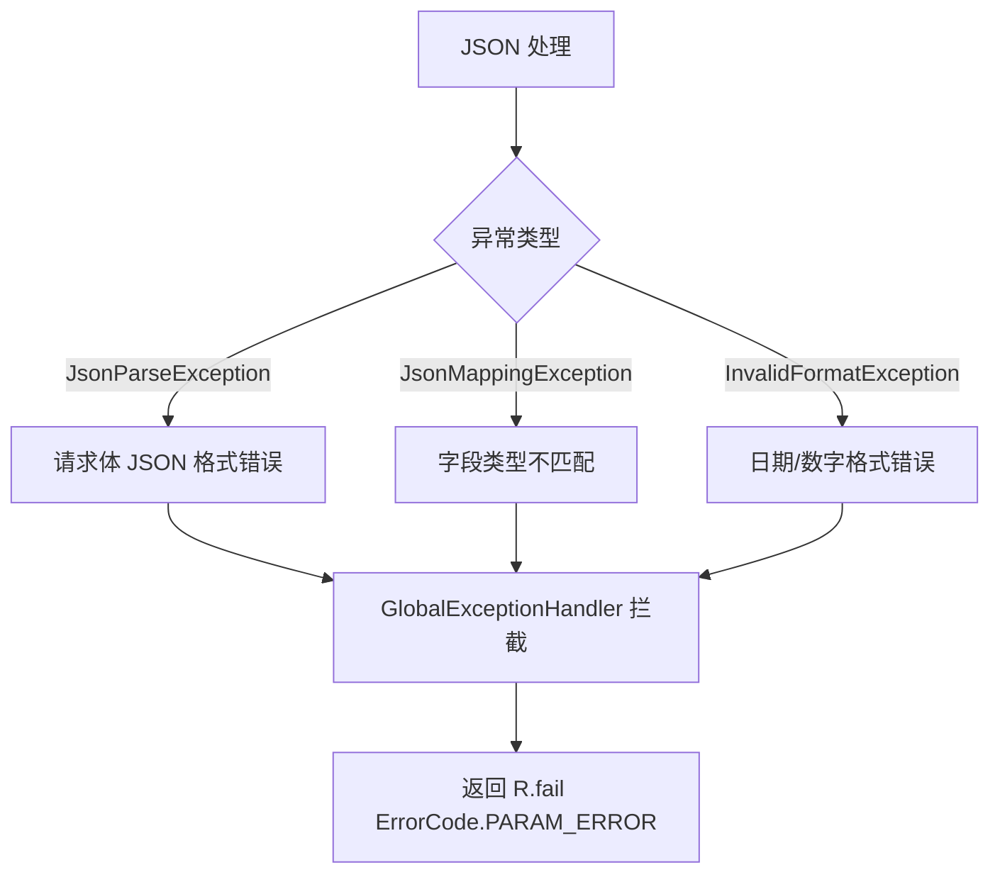
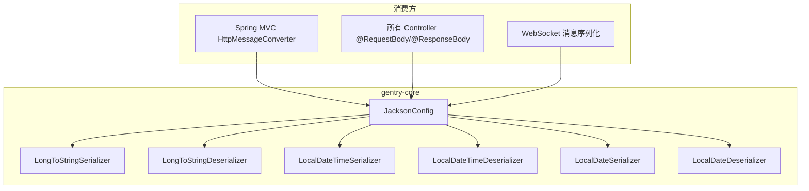

# Jackson 全局配置 详细设计

> **实现状态：✅ 已实现** — 代码位于 `gentry-core/src/main/java/com/gentry/core/config/JacksonConfig.java`，覆盖 8 个单元测试 + 后端实跑验证。

## 文档信息

| 项目 | 内容 |
|------|------|
| 模块名称 | Jackson 全局配置 |
| 模块标识 | jackson-config |
| 所属系统 | gentry-core 公共基础设施 |
| 文档版本 | v1.0.0 |
| 设计负责人 | 后端开发（AI辅助） |
| 最后更新时间 | 2026-04-12 |
| 优先级 | P1（核心） |

适用对象：
- 后端开发
- 前端开发
- 测试人员
- AI 编程

---

# 一、设计概述

## 1.1 功能定位

Jackson 全局配置统一管理平台 JSON 序列化与反序列化行为，解决以下核心问题：

1. **Long 精度丢失**：JavaScript/TypeScript 的 `Number` 类型最大安全整数为 `9007199254740991`（即 `2^53 - 1`），而 Java 的 `Long` 类型最大值为 `2^63 - 1`。雪花算法生成的 ID 远超 JS 安全范围，直接传给前端会导致精度丢失
2. **日期格式统一**：统一 `LocalDateTime`、`java.util.Date` 的序列化格式为 `yyyy-MM-dd HH:mm:ss`，避免不同接口返回不同的日期格式
3. **空值处理**：序列化时跳过 `null` 字段，减小网络传输体积，避免前端处理 `undefined` 困扰
4. **时区统一**：强制使用 `Asia/Shanghai` 时区，避免服务器时区不一致导致时间偏移
5. **容错性**：反序列化时忽略未知属性，保证前端新增字段不导致后端报错

## 1.2 设计约束

- 全局 `ObjectMapper` Bean 覆盖 Spring Boot 自动配置的默认实例
- 保持 JSON 字段名为 camelCase（与 Java 属性名一致），不使用 snake_case
- 所有自定义序列化器注册到全局 ObjectMapper，业务代码无需显式调用
- 不影响 MyBatis-Flex 的 JSON 字段处理（MyBatis-Flex 有独立配置）

---

# 二、类设计

## 2.1 类图

```mermaid
classDiagram
    direction TB

    class JacksonConfig {
        +jacksonCustomizer() Jackson2ObjectMapperBuilderCustomizer
        +dateTimeFormat() SimpleDateFormat$
    }

    class LongToStringSerializer {
        -long MAX_SAFE_INTEGER : long
        +serialize(Long value, JsonGenerator gen, SerializerProvider serializers) void
    }

    class LongToStringDeserializer {
        +deserialize(JsonParser p, DeserializationContext ctxt) Long
    }

    class LocalDateTimeSerializer {
        -DateTimeFormatter FORMATTER : DateTimeFormatter
        +serialize(LocalDateTime value, JsonGenerator gen, SerializerProvider serializers) void
    }

    class LocalDateTimeDeserializer {
        -DateTimeFormatter FORMATTER : DateTimeFormatter
        +deserialize(JsonParser p, DeserializationContext ctxt) LocalDateTime
    }

    class LocalDateSerializer {
        -DateTimeFormatter FORMATTER : DateTimeFormatter
        +serialize(LocalDate value, JsonGenerator gen, SerializerProvider serializers) void
    }

    class LocalDateDeserializer {
        -DateTimeFormatter FORMATTER : DateTimeFormatter
        +deserialize(JsonParser p, DeserializationContext ctxt) LocalDate
    }

    class SimpleModule {
        +addSerializer(type, serializer) SimpleModule
        +addDeserializer(type, deserializer) SimpleModule
    }

    JacksonConfig --> LongToStringSerializer : 注册
    JacksonConfig --> LongToStringDeserializer : 注册
    JacksonConfig --> LocalDateTimeSerializer : 注册
    JacksonConfig --> LocalDateTimeDeserializer : 注册
    JacksonConfig --> LocalDateSerializer : 注册
    JacksonConfig --> LocalDateDeserializer : 注册
    JacksonConfig --> SimpleModule : 创建并注册

    class JsonSerializer~Long~ {
        <<abstract>>
    }
    class JsonDeserializer~Long~ {
        <<abstract>>
    }

    LongToStringSerializer --|> JsonSerializer~Long~
    LongToStringDeserializer --|> JsonDeserializer~Long~
```



## 2.2 核心类详细设计

### 2.2.1 JacksonConfig

**包路径**：`com.gentry.core.config.JacksonConfig`

**注解**：`@Configuration`

**Bean 方法设计**：

#### `objectMapper()`

```
1. 创建 ObjectMapper 实例
2. 设置时区：objectMapper.setTimeZone(TimeZone.getTimeZone("Asia/Shanghai"))
3. 设置日期格式（java.util.Date）：objectMapper.setDateFormat(new SimpleDateFormat("yyyy-MM-dd HH:mm:ss"))
4. 全局配置：
   - objectMapper.setSerializationInclusion(JsonInclude.Include.NON_NULL)
   - objectMapper.configure(DeserializationFeature.FAIL_ON_UNKNOWN_PROPERTIES, false)
   - objectMapper.configure(SerializationFeature.WRITE_DATES_AS_TIMESTAMPS, false)
   - objectMapper.configure(DeserializationFeature.FAIL_ON_NULL_FOR_PRIMITIVES, false)
   - objectMapper.configure(SerializationFeature.FAIL_ON_EMPTY_BEANS, false)
5. 注册 JavaTimeModule（处理 Java 8 时间类型）
6. 创建自定义 SimpleModule，注册自定义序列化器/反序列化器
7. 注册自定义 Module
8. 返回 ObjectMapper
```

**完整配置清单**：

| 配置项 | 值 | 说明 |
|--------|-----|------|
| `setTimeZone` | `Asia/Shanghai` | 统一时区 |
| `setDateFormat` | `yyyy-MM-dd HH:mm:ss` | java.util.Date 格式 |
| `setSerializationInclusion` | `NON_NULL` | 跳过 null 字段 |
| `FAIL_ON_UNKNOWN_PROPERTIES` | `false` | 忽略未知 JSON 字段 |
| `WRITE_DATES_AS_TIMESTAMPS` | `false` | 不使用时间戳格式输出日期 |
| `FAIL_ON_NULL_FOR_PRIMITIVES` | `false` | 原始类型允许 null |
| `FAIL_ON_EMPTY_BEANS` | `false` | 空 Bean 不报错 |

### 2.2.2 LongToStringSerializer

**包路径**：`com.gentry.core.config.serializer.LongToStringSerializer`

**继承**：`JsonSerializer<Long>`

**设计决策**：将所有 Long 类型值序列化为 String。

**理由**：虽然可以只对超过 `MAX_SAFE_INTEGER` 的值做转换，但这样做会导致前端处理逻辑不一致（有时是数字有时是字符串），统一转为 String 更简单、更安全。前端 TypeScript 统一用 `string` 类型接收 ID。

**字段**：

| 字段 | 类型 | 值 | 说明 |
|------|------|-----|------|
| `MAX_SAFE_INTEGER` | `long` | `9007199254740991L` | JS Number 最大安全整数 |

**方法**：

```
serialize(Long value, JsonGenerator gen, SerializerProvider serializers):
1. if value == null → gen.writeNull()
2. else → gen.writeString(String.valueOf(value))
```

**注解方式**：通过 `SimpleModule.addSerializer(Long.class, new LongToStringSerializer())` 注册到全局 ObjectMapper。

### 2.2.3 LongToStringDeserializer

**包路径**：`com.gentry.core.config.serializer.LongToStringDeserializer`

**继承**：`JsonDeserializer<Long>`

**用途**：前端传入的 ID 为 String 类型（因为序列化时已转为 String），反序列化时需要兼容 String 和 Number 两种格式。

**方法**：

```
deserialize(JsonParser p, DeserializationContext ctxt):
1. if p.currentToken() == JsonToken.VALUE_STRING → Long.parseLong(p.getText())
2. if p.currentToken() == JsonToken.VALUE_NUMBER_INT → p.getLongValue()
3. else → throw ctxt.wrongTokenException(p, Long.class, p.currentToken(), "Expected STRING or NUMBER_INT")
```

### 2.2.4 LocalDateTimeSerializer

**包路径**：`com.gentry.core.config.serializer.LocalDateTimeSerializer`

**继承**：`JsonSerializer<LocalDateTime>`

**字段**：

| 字段 | 类型 | 值 |
|------|------|-----|
| `FORMATTER` | `DateTimeFormatter` | `DateTimeFormatter.ofPattern("yyyy-MM-dd HH:mm:ss")` |

**方法**：

```
serialize(LocalDateTime value, JsonGenerator gen, SerializerProvider serializers):
1. if value == null → return
2. gen.writeString(value.format(FORMATTER))
```

### 2.2.5 LocalDateTimeDeserializer

**包路径**：`com.gentry.core.config.serializer.LocalDateTimeDeserializer`

**继承**：`JsonDeserializer<LocalDateTime>`

**字段**：

| 字段 | 类型 | 值 |
|------|------|-----|
| `FORMATTER` | `DateTimeFormatter` | `DateTimeFormatter.ofPattern("yyyy-MM-dd HH:mm:ss")` |

**方法**：

```
deserialize(JsonParser p, DeserializationContext ctxt):
1. String text = p.getText()
2. if text == null || text.isEmpty() → return null
3. return LocalDateTime.parse(text, FORMATTER)
```

**兼容处理**：还需支持前端传入 `"2026-04-12T10:30:00"`（ISO 格式）的情况：

```
3. try → LocalDateTime.parse(text, FORMATTER)
4. catch DateTimeParseException → LocalDateTime.parse(text, DateTimeFormatter.ISO_LOCAL_DATE_TIME)
```

### 2.2.6 LocalDateSerializer / LocalDateDeserializer

**包路径**：`com.gentry.core.config.serializer.LocalDateSerializer` / `LocalDateDeserializer`

**格式**：`yyyy-MM-dd`

**设计同上**，仅格式不同。

---

# 三、接口设计

## 3.1 对外接口

### 3.1.1 ObjectMapper Bean

所有 Spring 管理的组件（Controller、Service 等）注入的 `ObjectMapper` 自动使用全局配置，无需额外操作。

```java
@RestController
public class VehicleController {
    // Spring 自动注入全局 ObjectMapper
    @Autowired
    private ObjectMapper objectMapper;

    // 或者直接通过 @RequestBody / @ResponseBody 隐式使用
    @PostMapping("/vehicles")
    public R<VehicleVO> create(@RequestBody VehicleCreateDTO dto) {
        // dto 的反序列化已使用全局 ObjectMapper
        // 返回值的序列化也已使用全局 ObjectMapper
    }
}
```

### 3.1.2 自定义注解覆盖

业务代码中如需局部覆盖全局配置，使用 Jackson 原生注解：

```java
public class SomeDTO {
    // 某些场景需要返回 null 值
    @JsonInclude(JsonInclude.Include.ALWAYS)
    private String nullableField;

    // 某些 Long 字段不需要转 String（如序号）
    @JsonSerialize(using = NumberSerializer.class)
    private Long sequenceNo;
}
```

## 3.2 内部接口

| 组件 | 接口 | 说明 |
|------|------|------|
| Spring MVC | `ObjectMapper` Bean | 自动注入到 HttpMessageConverter |
| Controller | `@RequestBody` / `@ResponseBody` | 隐式使用 ObjectMapper |
| Service | 手动注入 `ObjectMapper` | 需要手动序列化/反序列化时使用 |
| MyBatis-Flex | `@Column(typeHandler = JacksonTypeHandler.class)` | 使用独立的 ObjectMapper 实例 |

---

# 四、流程设计

## 4.1 核心流程图

### 4.1.1 序列化流程（响应）



### 4.1.2 反序列化流程（请求）



## 4.2 异常处理流程



**关键点**：Jackson 反序列化异常由 `GlobalExceptionHandler.handleHttpMessageNotReadable()` 统一处理，不在此组件中额外捕获。

---

# 五、数据设计

## 5.1 配置项

| 配置项 | 键 | 默认值 | 说明 |
|--------|-----|--------|------|
| 时区 | `precision.jackson.time-zone` | `Asia/Shanghai` | 全局时区 |
| 日期时间格式 | `precision.jackson.date-format` | `yyyy-MM-dd HH:mm:ss` | LocalDateTime 和 Date 格式 |
| 日期格式 | `precision.jackson.local-date-format` | `yyyy-MM-dd` | LocalDate 格式 |
| 是否跳过 null | `precision.jackson.skip-null` | `true` | 序列化是否跳过 null 字段 |

**注意**：上述配置为可选项，JacksonConfig 使用硬编码默认值，仅在需要灵活调整时暴露配置。

## 5.2 缓存设计

本组件不使用缓存。

`ObjectMapper` 本身是线程安全的，创建后可全局复用。Spring 容器中只有一个单例 `ObjectMapper` Bean。

**性能注意**：

- `DateTimeFormatter` 是线程安全的，使用 `static final` 常量
- `SimpleDateFormat` 不是线程安全的，但 `ObjectMapper.setDateFormat()` 内部会做 clone 处理

## 5.3 数据库查询

本组件不涉及数据库查询。

---

# 六、依赖关系

## 6.1 Maven 依赖

```xml
<!-- Spring Boot Starter Web 已包含 Jackson -->
<dependency>
    <groupId>org.springframework.boot</groupId>
    <artifactId>spring-boot-starter-web</artifactId>
</dependency>

<!-- Java 8 时间模块（Spring Boot 自动引入） -->
<dependency>
    <groupId>com.fasterxml.jackson.datatype</groupId>
    <artifactId>jackson-datatype-jsr310</artifactId>
</dependency>
```

## 6.2 内部依赖



| 依赖组件 | 版本 | 说明 |
|----------|------|------|
| `jackson-databind` | Spring Boot 3.2.5 管理 | Jackson 核心 |
| `jackson-datatype-jsr310` | Spring Boot 3.2.5 管理 | Java 8 时间类型支持 |
| Spring MVC | Spring Boot 3.2.5 管理 | HttpMessageConverter 注入 |

## 6.3 被依赖关系

| 消费方 | 使用方式 |
|--------|---------|
| 所有 Controller | `@RequestBody` 反序列化、`@ResponseBody` 序列化 |
| WebSocket Handler | 消息序列化 |
| GlobalExceptionHandler | 异常响应序列化 |
| 业务 Service | 手动 JSON 转换（如需） |

---

# 七、测试设计

## 7.1 单元测试用例

### 7.1.1 LongToStringSerializer / LongToStringDeserializer 测试

**测试类**：`com.gentry.core.config.serializer.LongToStringSerializerTest`

| 编号 | 测试方法 | 场景 | 预期结果 |
|------|---------|------|----------|
| UT-001 | `serialize_雪花ID_输出String` | 序列化 `1893746528364738576L` | 输出 `"1893746528364738576"` |
| UT-002 | `serialize_小Long_输出String` | 序列化 `100L` | 输出 `"100"` |
| UT-003 | `serialize_null值_输出Null` | 序列化 `null` | 输出 `null` |
| UT-004 | `serialize_zero_输出String` | 序列化 `0L` | 输出 `"0"` |

**测试类**：`com.gentry.core.config.serializer.LongToStringDeserializerTest`

| 编号 | 测试方法 | 场景 | 预期结果 |
|------|---------|------|----------|
| UT-005 | `deserialize_String输入_解析为Long` | 输入 `"1893746528364738576"` | 返回 `1893746528364738576L` |
| UT-006 | `deserialize_Number输入_解析为Long` | 输入数字 `12345` | 返回 `12345L` |
| UT-007 | `deserialize_空String_抛异常` | 输入 `""` | 抛出异常 |

### 7.1.2 LocalDateTimeSerializer / LocalDateTimeDeserializer 测试

**测试类**：`com.gentry.core.config.serializer.LocalDateTimeSerializerTest`

| 编号 | 测试方法 | 场景 | 预期结果 |
|------|---------|------|----------|
| UT-008 | `serialize_正常日期` | `LocalDateTime.of(2026, 4, 12, 10, 30, 0)` | `"2026-04-12 10:30:00"` |
| UT-009 | `serialize_null值` | `null` | 不输出 |

**测试类**：`com.gentry.core.config.serializer.LocalDateTimeDeserializerTest`

| 编号 | 测试方法 | 场景 | 预期结果 |
|------|---------|------|----------|
| UT-010 | `deserialize_标准格式` | `"2026-04-12 10:30:00"` | `LocalDateTime.of(2026, 4, 12, 10, 30, 0)` |
| UT-011 | `deserialize_ISO格式` | `"2026-04-12T10:30:00"` | `LocalDateTime.of(2026, 4, 12, 10, 30, 0)` |
| UT-012 | `deserialize_空字符串` | `""` | 返回 `null` |
| UT-013 | `deserialize_null值` | `null` | 返回 `null` |

### 7.1.3 JacksonConfig 集成测试

**测试类**：`com.gentry.core.config.JacksonConfigTest`

| 编号 | 测试方法 | 场景 | 预期结果 |
|------|---------|------|----------|
| UT-014 | `objectMapper_Long字段_输出String` | 序列化含 Long 字段的对象 | JSON 中 Long 值为 String |
| UT-015 | `objectMapper_LocalDateTime_格式化输出` | 序列化含 LocalDateTime 的对象 | `"2026-04-12 10:30:00"` |
| UT-016 | `objectMapper_null字段_跳过` | 序列化含 null 字段的对象 | JSON 不含该字段 |
| UT-017 | `objectMapper_未知字段_忽略` | 反序列化含额外字段的 JSON | 不抛异常，忽略未知字段 |
| UT-018 | `objectMapper_Date_格式化输出` | 序列化含 java.util.Date 的对象 | `"2026-04-12 10:30:00"` |
| UT-019 | `objectMapper_反序列化StringID` | 前端传入 `"id": "1893746528364738576"` | 正确解析为 Long |
| UT-020 | `objectMapper_时区验证` | 序列化 Date 对象 | 使用 Asia/Shanghai 时区 |

## 7.2 集成测试场景

**测试类**：`com.gentry.core.config.JacksonConfigIntegrationTest`

| 编号 | 测试场景 | 操作步骤 | 验证点 |
|------|---------|---------|--------|
| IT-001 | Controller 响应 Long 为 String | GET /api/v1/vehicles/{id} | 响应 JSON 中 id 为 String 类型 |
| IT-002 | Controller 请求体 Long 反序列化 | POST /api/v1/vehicles，body 含 String 类型 id | 正确解析 |
| IT-003 | Controller 日期格式 | GET /api/v1/vehicles/{id} | createTime 格式为 `yyyy-MM-dd HH:mm:ss` |
| IT-004 | null 字段不输出 | GET 返回含 null 字段的对象 | 响应 JSON 无 null 字段 |
| IT-005 | 前端多传字段不报错 | POST 传入未知字段 | 正常处理，不抛异常 |
| IT-006 | 雪花 ID 精度完整性 | 前端传入雪花 ID，后端返回相同 ID | ID 值一致，无精度丢失 |

---

# 八、变更记录

| 版本 | 日期 | 修改人 | 变更描述 |
|------|------|--------|---------|
| v1.0.0 | 2026-04-12 | 后端开发（AI辅助） | 初始版本 |
