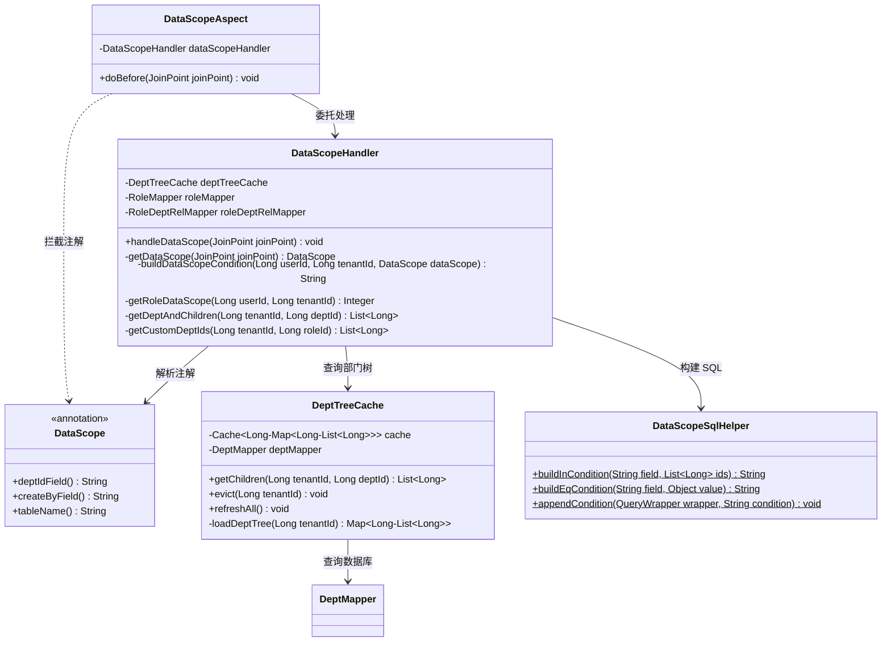
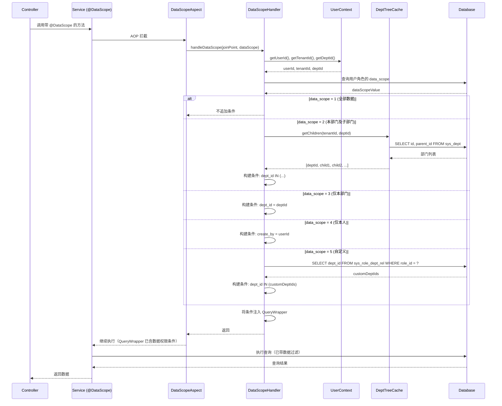
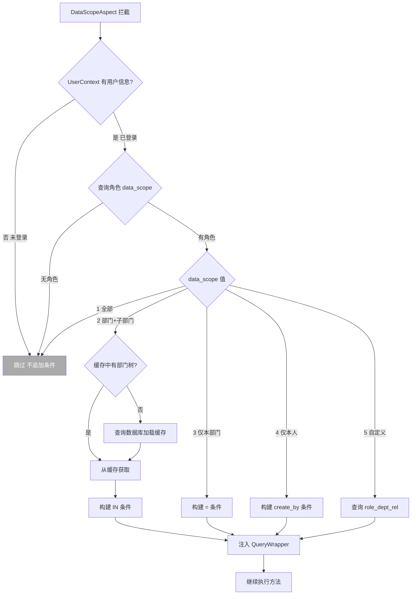
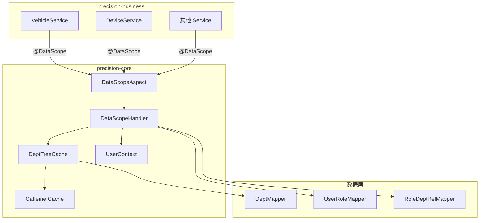

# 数据权限拦截器 详细设计

> **实现状态：✅ 已实现** — 代码位于 `precision-core/src/main/java/com/precision/core/data/`（切面 + SPI + 上下文），precision-business 提供 RbacUserDataScopeResolver / RbacDeptChildrenProvider 实现；覆盖 7 个单元测试。

## 文档信息

| 项目 | 内容 |
|------|------|
| 模块名称 | 数据权限拦截器 |
| 模块标识 | data-scope |
| 所属系统 | precision-core 公共基础设施 |
| 文档版本 | v1.0.0 |
| 设计负责人 | 后端开发（AI辅助） |
| 最后更新时间 | 2026-04-12 |
| 优先级 | P1（核心） |

适用对象：
- 后端开发
- 测试人员
- AI 编程

---

# 一、设计概述

## 1.1 功能定位

数据权限拦截器基于角色数据权限范围（`data_scope`），自动在 MyBatis-Flex 查询中追加数据过滤条件，实现按部门/个人的数据隔离。

核心职责：

1. **注解驱动**：在 Service 方法上标注 `@DataScope`，自动注入数据权限条件
2. **五种权限范围**：全部数据、本部门及子部门、仅本部门、仅本人、自定义部门
3. **部门树缓存**：使用 Caffeine 缓存部门层级关系，避免每次查询递归查询数据库
4. **透明集成**：对业务代码透明，开发者只需添加注解，无需手动拼接 SQL 条件

## 1.2 数据权限范围说明

| data_scope | 名称 | SQL 条件 | 说明 |
|------------|------|----------|------|
| 1 | 全部数据 | 无附加条件 | 平台管理员可看所有数据 |
| 2 | 本部门及子部门 | `dept_id IN (部门ID列表)` | 部门经理可看本部门和下属部门 |
| 3 | 仅本部门 | `dept_id = ?` | 普通员工仅看本部门 |
| 4 | 仅本人 | `create_by = ?` | 司机等仅看自己创建的数据 |
| 5 | 自定义 | `dept_id IN (自定义部门ID列表)` | 按角色配置可见部门 |

---

# 二、类设计

## 2.1 类图



## 2.2 核心类详细设计

### 2.2.1 @DataScope 注解

**包路径**：`com.precision.core.data.DataScope`

**注解定义**：

```java
@Target(ElementType.METHOD)
@Retention(RetentionPolicy.RUNTIME)
@Documented
public @interface DataScope {
    /**
     * 部门ID字段名（对应查询表中的字段）
     */
    String deptIdField() default "dept_id";

    /**
     * 创建人字段名（用于"仅本人"权限范围）
     */
    String createByField() default "create_by";

    /**
     * 表别名（多表关联查询时使用）
     */
    String tableAlias() default "";
}
```

**使用示例**：

```java
// 简单查询：使用默认字段名
@DataScope
public List<Vehicle> selectVehicleList(VehicleQuery query) { ... }

// 多表关联：指定表别名
@DataScope(tableAlias = "v")
public List<Vehicle> selectVehicleWithDevice(VehicleQuery query) { ... }

// 自定义字段名
@DataScope(deptIdField = "owner_dept_id", createByField = "creator")
public List<Device> selectDeviceList(DeviceQuery query) { ... }
```

### 2.2.2 DataScopeAspect

**包路径**：`com.precision.core.data.DataScopeAspect`

**注解**：`@Aspect` `@Component`

**切点设计**：

```java
@Before("@annotation(dataScope)")
public void doBefore(JoinPoint joinPoint, DataScope dataScope) {
    dataScopeHandler.handleDataScope(joinPoint, dataScope);
}
```

**职责**：仅负责 AOP 切面拦截，将实际处理逻辑委托给 `DataScopeHandler`。

### 2.2.3 DataScopeHandler

**包路径**：`com.precision.core.data.DataScopeHandler`

**注解**：`@Component`

**字段设计**：

| 字段 | 类型 | 说明 |
|------|------|------|
| `deptTreeCache` | `DeptTreeCache` | 部门树缓存 |
| `userRoleMapper` | `UserRoleMapper` | 查询用户角色关联 |

**核心方法**：

#### `handleDataScope(JoinPoint joinPoint, DataScope dataScope)`

```
1. 获取当前用户信息：
   - userId = UserContext.getUserId()
   - tenantId = UserContext.getTenantId()
   - deptId = UserContext.getDeptId()
2. if userId == null → 未登录，跳过（不追加条件）
3. 获取用户角色的 data_scope 值：
   - dataScopeValue = getRoleDataScope(userId, tenantId)
4. if dataScopeValue == null → 无角色，跳过
5. 根据权限值构建 SQL 条件：
   - condition = buildDataScopeCondition(userId, tenantId, deptId, dataScopeValue, dataScope)
6. 将条件注入到方法参数中的 QueryWrapper：
   - 遍历 joinPoint.getArgs()，找到 QueryWrapper 类型的参数
   - 如果有 tableAlias → condition = "tableAlias." + condition
   - wrapper.and(condition)
```

#### `getRoleDataScope(Long userId, Long tenantId)`

```
1. 查询用户关联的角色列表（可能有多个角色）
2. 如果用户有多个角色，取最宽松的权限：
   - 优先级：1(全部) > 2(部门+子部门) > 5(自定义) > 3(仅部门) > 4(仅本人)
3. 返回最终 data_scope 值
```

**多角色权限合并规则**：

```
角色列表: [data_scope=2, data_scope=4]
→ 取最宽松 → data_scope=2（本部门及子部门）

角色列表: [data_scope=1, data_scope=3]
→ 取最宽松 → data_scope=1（全部数据）
```

合并优先级（值越小越宽松）：`1 > 2 > 5 > 3 > 4`

#### `buildDataScopeCondition(Long userId, Long tenantId, Long deptId, Integer scopeValue, DataScope dataScope)`

```
switch (scopeValue):
  case 1: // 全部数据
    return null  // 无附加条件

  case 2: // 本部门及子部门
    deptIds = getDeptAndChildren(tenantId, deptId)
    field = buildFieldName(dataScope.deptIdField(), dataScope.tableAlias())
    return field + " IN (" + join(deptIds, ",") + ")"

  case 3: // 仅本部门
    field = buildFieldName(dataScope.deptIdField(), dataScope.tableAlias())
    return field + " = " + deptId

  case 4: // 仅本人
    field = buildFieldName(dataScope.createByField(), dataScope.tableAlias())
    return field + " = " + userId

  case 5: // 自定义
    roleId = getPrimaryRoleId(userId, tenantId)
    customDeptIds = getCustomDeptIds(tenantId, roleId)
    field = buildFieldName(dataScope.deptIdField(), dataScope.tableAlias())
    return field + " IN (" + join(customDeptIds, ",") + ")"
```

#### `buildFieldName(String field, String alias)`

```
if alias is empty → return field
else → return alias + "." + field
```

### 2.2.4 DeptTreeCache

**包路径**：`com.precision.core.data.DeptTreeCache`

**注解**：`@Component`

**缓存设计**：

| 缓存项 | 类型 | Key | Value | TTL |
|--------|------|-----|-------|-----|
| 部门子树映射 | Caffeine Cache | `tenantId` | `Map<Long, List<Long>>` (deptId → 子部门ID列表) | 30 分钟 |

**字段设计**：

| 字段 | 类型 | 说明 |
|------|------|------|
| `cache` | `Cache<Long, Map<Long, List<Long>>>` | Caffeine 缓存实例 |
| `deptMapper` | `DeptMapper` | 部门数据查询 |

**缓存初始化**：

```java
this.cache = Caffeine.newBuilder()
    .maximumSize(100)                    // 最多缓存 100 个租户
    .expireAfterWrite(30, TimeUnit.MINUTES)
    .build();
```

**核心方法**：

#### `getChildren(Long tenantId, Long deptId)`

```
1. deptTree = cache.get(tenantId, key -> loadDeptTree(key))
2. 递归收集 deptId 及其所有子部门 ID：
   result = new ArrayList<>()
   result.add(deptId)
   collectChildren(deptTree, deptId, result)
3. return result
```

#### `collectChildren(Map<Long, List<Long>> tree, Long parentId, List<Long> result)`

```
children = tree.get(parentId)
if children != null:
    for child in children:
        result.add(child)
        collectChildren(tree, child, result)  // 递归
```

#### `loadDeptTree(Long tenantId)`

```
1. 查询该租户下所有部门：SELECT id, parent_id FROM sys_dept WHERE tenant_id = ? AND deleted = 0
2. 构建 Map<Long, List<Long>>：
   - 遍历部门列表
   - 以 parent_id 为 key，收集所有子部门 ID
3. return deptTree
```

**SQL 查询**：

```sql
SELECT id, parent_id FROM sys_dept WHERE tenant_id = #{tenantId} AND deleted = 0 ORDER BY sort ASC
```

#### `evict(Long tenantId)`

```
cache.invalidate(tenantId)
```

**触发时机**：部门 CRUD 操作时，调用 `evict(tenantId)` 清除缓存。

### 2.2.5 UserContext 扩展

现有 `UserContext` 需要增加 `deptId` 字段支持：

```java
// 新增字段
private static final ThreadLocal<Long> DEPT_ID = new ThreadLocal<>();

public static void setDeptId(Long deptId) { DEPT_ID.set(deptId); }
public static Long getDeptId() { return DEPT_ID.get(); }

// clear() 方法中新增
public static void clear() {
    USER_ID.remove();
    TENANT_ID.remove();
    DEPT_ID.remove();  // 新增
}
```

**SaTokenConfig 扩展**：在恢复 UserContext 时同时设置 deptId：

```java
Object deptId = session.get("deptId");
if (deptId instanceof Number) UserContext.setDeptId(((Number) deptId).longValue());
```

---

# 三、接口设计

## 3.1 对外接口

### 3.1.1 @DataScope 注解

```java
@DataScope                                          // 使用默认字段名
@DataScope(tableAlias = "v")                        // 多表关联查询
@DataScope(deptIdField = "owner_dept_id")           // 自定义字段名
@DataScope(deptIdField = "dept_id", createByField = "creator")  // 全部自定义
```

### 3.1.2 DeptTreeCache 缓存管理接口

```java
// 部门增删改后清除缓存
deptTreeCache.evict(tenantId);
```

## 3.2 内部接口

| 接口 | 提供方 | 消费方 | 说明 |
|------|--------|--------|------|
| `UserContext.getUserId()` | UserContext | DataScopeHandler | 获取当前用户 ID |
| `UserContext.getTenantId()` | UserContext | DataScopeHandler | 获取当前租户 ID |
| `UserContext.getDeptId()` | UserContext（扩展） | DataScopeHandler | 获取当前用户部门 ID |
| `DeptMapper.selectAll()` | DeptMapper | DeptTreeCache | 查询租户下所有部门 |
| `UserRoleMapper.selectByUserId()` | UserRoleMapper | DataScopeHandler | 查询用户角色关联 |
| `RoleDeptRelMapper.selectByRoleId()` | RoleDeptRelMapper | DataScopeHandler | 查询角色自定义部门 |

---

# 四、流程设计

## 4.1 核心流程图



## 4.2 异常处理流程



**异常保护**：

1. 未登录用户 → 不追加条件（由 Sa-Token 的 `checkLogin()` 负责拦截）
2. 用户无角色 → 不追加条件（返回空数据由业务层控制）
3. 缓存查询失败 → 降级到直接查询数据库
4. QueryWrapper 参数未找到 → 记录 WARN 日志，不追加条件

---

# 五、数据设计

## 5.1 配置项

| 配置项 | 键 | 默认值 | 说明 |
|--------|-----|--------|------|
| 缓存过期时间 | `precision.data-scope.cache-ttl` | `30` | 部门树缓存 TTL（分钟） |
| 缓存最大容量 | `precision.data-scope.cache-max-size` | `100` | 最多缓存租户数 |

## 5.2 缓存设计

### 5.2.1 部门树缓存

**缓存结构**：

```
Key:   tenantId (Long)
Value: Map<Long, List<Long>>
       └── deptId → [childDeptId1, childDeptId2, ...]
```

**示例**：

```json
{
  "1": {
    "1": [2, 3],
    "2": [4, 5],
    "3": [6],
    "4": [],
    "5": [],
    "6": []
  }
}
```

含义：租户 1 的部门树中，部门 1 有子部门 [2, 3]，部门 2 有子部门 [4, 5]，以此类推。

**缓存策略**：

| 策略 | 值 | 说明 |
|------|-----|------|
| 过期策略 | Write | 写入后 30 分钟过期 |
| 驱逐策略 | Size | 最大 100 个租户 |
| 加载方式 | Lazy | 首次查询时加载 |
| 失效触发 | 手动 | 部门 CRUD 时调用 evict |

### 5.2.2 缓存失效场景

| 触发事件 | 操作 | 调用方式 |
|----------|------|---------|
| 创建部门 | 清除该租户缓存 | `deptTreeCache.evict(tenantId)` |
| 修改部门 | 清除该租户缓存 | `deptTreeCache.evict(tenantId)` |
| 删除部门 | 清除该租户缓存 | `deptTreeCache.evict(tenantId)` |
| 移动部门（改 parent_id） | 清除该租户缓存 | `deptTreeCache.evict(tenantId)` |

## 5.3 数据库查询

### 5.3.1 查询用户角色及 data_scope

```sql
SELECT r.data_scope
FROM sys_role r
INNER JOIN sys_user_role ur ON ur.role_id = r.id
WHERE ur.user_id = #{userId}
  AND r.tenant_id = #{tenantId}
  AND r.deleted = 0
ORDER BY r.data_scope ASC
LIMIT 1
```

说明：按 data_scope 升序排列取第一条，获取最宽松的权限。

### 5.3.2 查询租户下所有部门

```sql
SELECT id, parent_id
FROM sys_dept
WHERE tenant_id = #{tenantId}
  AND deleted = 0
ORDER BY sort ASC
```

### 5.3.3 查询角色自定义部门

```sql
SELECT dept_id
FROM sys_role_dept_rel
WHERE role_id = #{roleId}
  AND tenant_id = #{tenantId}
```

---

# 六、依赖关系

## 6.1 Maven 依赖

```xml
<!-- Spring AOP -->
<dependency>
    <groupId>org.springframework.boot</groupId>
    <artifactId>spring-boot-starter-aop</artifactId>
</dependency>

<!-- Caffeine 缓存 -->
<dependency>
    <groupId>com.github.ben-manes.caffeine</groupId>
    <artifactId>caffeine</artifactId>
</dependency>
```

## 6.2 内部依赖



| 依赖组件 | 版本 | 说明 |
|----------|------|------|
| `UserContext` | 已实现 | 需扩展 deptId 字段 |
| `DeptMapper` | RBAC 模块 | 查询部门数据 |
| `UserRoleMapper` | RBAC 模块 | 查询用户角色关联 |
| `RoleDeptRelMapper` | RBAC 模块 | 查询角色自定义部门 |
| `SaTokenConfig` | 已实现 | 需扩展 UserContext 填充 deptId |
| Caffeine | 3.1+ | 部门树缓存 |

## 6.3 被依赖关系

| 消费方 | 使用方式 |
|--------|---------|
| VehicleService | `@DataScope` 标注列表查询方法 |
| DeviceService | `@DataScope` 标注列表查询方法 |
| AlarmService | `@DataScope` 标注列表查询方法 |
| 其他需数据隔离的 Service | `@DataScope` 标注 |

---

# 七、测试设计

## 7.1 单元测试用例

### 7.1.1 DataScopeHandler 测试

**测试类**：`com.precision.core.data.DataScopeHandlerTest`

| 编号 | 测试方法 | 场景 | 预期结果 |
|------|---------|------|----------|
| UT-001 | `handleDataScope_dataScope1_不追加条件` | 角色 data_scope=1（全部数据） | QueryWrapper 无附加条件 |
| UT-002 | `handleDataScope_dataScope2_追加部门子部门条件` | 角色 data_scope=2，deptId=1，子部门=[2,3,4] | QueryWrapper 含 `dept_id IN (1,2,3,4)` |
| UT-003 | `handleDataScope_dataScope3_追加本部门条件` | 角色 data_scope=3，deptId=5 | QueryWrapper 含 `dept_id = 5` |
| UT-004 | `handleDataScope_dataScope4_追加本人条件` | 角色 data_scope=4，userId=100 | QueryWrapper 含 `create_by = 100` |
| UT-005 | `handleDataScope_dataScope5_追加自定义部门条件` | 角色 data_scope=5，自定义部门=[10,20] | QueryWrapper 含 `dept_id IN (10,20)` |
| UT-006 | `handleDataScope_未登录_不追加条件` | UserContext.getUserId()=null | 不追加条件 |
| UT-007 | `handleDataScope_无角色_不追加条件` | 用户无角色关联 | 不追加条件 |
| UT-008 | `handleDataScope_多角色_取最宽松` | 角色 data_scope=[2, 4] | 使用 data_scope=2 |
| UT-009 | `handleDataScope_自定义字段名` | @DataScope(deptIdField="owner_dept_id") | 条件字段为 `owner_dept_id` |
| UT-010 | `handleDataScope_表别名` | @DataScope(tableAlias="v") | 条件字段为 `v.dept_id` |

### 7.1.2 DeptTreeCache 测试

**测试类**：`com.precision.core.data.DeptTreeCacheTest`

| 编号 | 测试方法 | 场景 | 预期结果 |
|------|---------|------|----------|
| UT-011 | `getChildren_单层部门` | 部门 1 → [2, 3] | 返回 [1, 2, 3] |
| UT-012 | `getChildren_多层递归` | 部门 1→2→4, 1→3→5→6 | 返回 [1, 2, 3, 4, 5, 6] |
| UT-013 | `getChildren_叶子部门` | 部门 4 无子部门 | 返回 [4] |
| UT-014 | `getChildren_缓存命中` | 第二次调用 | 不查数据库 |
| UT-015 | `evict_清除缓存` | evict 后再调用 | 重新查询数据库 |
| UT-016 | `getChildren_空部门列表` | 租户无部门 | 返回 [deptId]（仅自身） |

### 7.1.3 多角色合并测试

**测试类**：`com.precision.core.data.DataScopeHandlerTest`（续）

| 编号 | 测试方法 | 场景 | 预期结果 |
|------|---------|------|----------|
| UT-017 | `getRoleDataScope_角色1和4_取1` | data_scope=[1, 4] | 返回 1 |
| UT-018 | `getRoleDataScope_角色2和3_取2` | data_scope=[2, 3] | 返回 2 |
| UT-019 | `getRoleDataScope_角色5和4_取5` | data_scope=[5, 4] | 返回 5 |
| UT-020 | `getRoleDataScope_相同角色` | data_scope=[3, 3] | 返回 3 |

## 7.2 集成测试场景

**测试类**：`com.precision.core.data.DataScopeIntegrationTest`

| 编号 | 测试场景 | 操作步骤 | 验证点 |
|------|---------|---------|--------|
| IT-001 | 全部数据权限用户查询 | 管理员查询车辆列表 | 返回所有车辆（不区分部门） |
| IT-002 | 部门+子部门权限查询 | 部门经理查询车辆列表 | 仅返回本部门及子部门的车辆 |
| IT-003 | 仅本部门权限查询 | 普通员工查询车辆列表 | 仅返回本部门的车辆 |
| IT-004 | 仅本人权限查询 | 司机查询车辆列表 | 仅返回自己创建的数据 |
| IT-005 | 自定义部门权限查询 | 自定义角色查询车辆列表 | 仅返回配置的部门数据 |
| IT-006 | 部门增删改后缓存刷新 | 修改部门后查询 | 数据权限立即生效 |
| IT-007 | 多角色用户查询 | 拥有多个角色的用户查询 | 使用最宽松权限 |

---

# 八、变更记录

| 版本 | 日期 | 修改人 | 变更描述 |
|------|------|--------|---------|
| v1.0.0 | 2026-04-12 | 后端开发（AI辅助） | 初始版本 |
