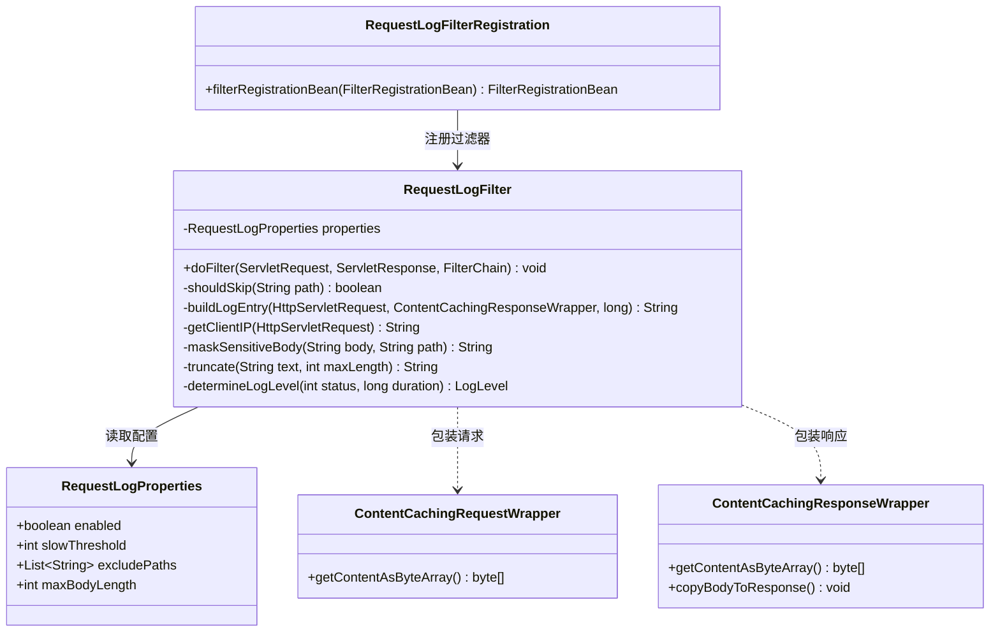
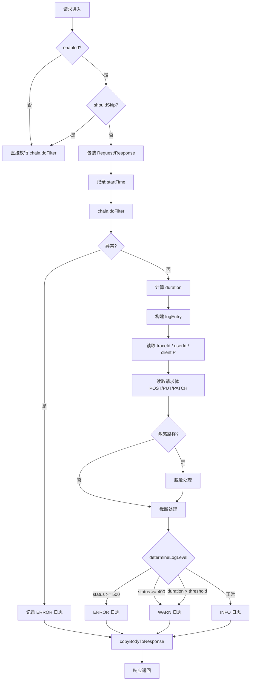
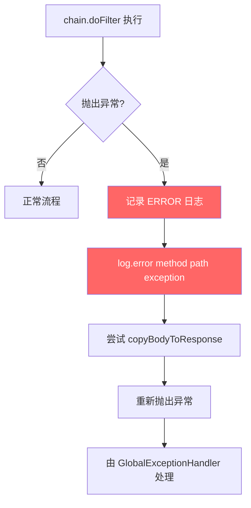
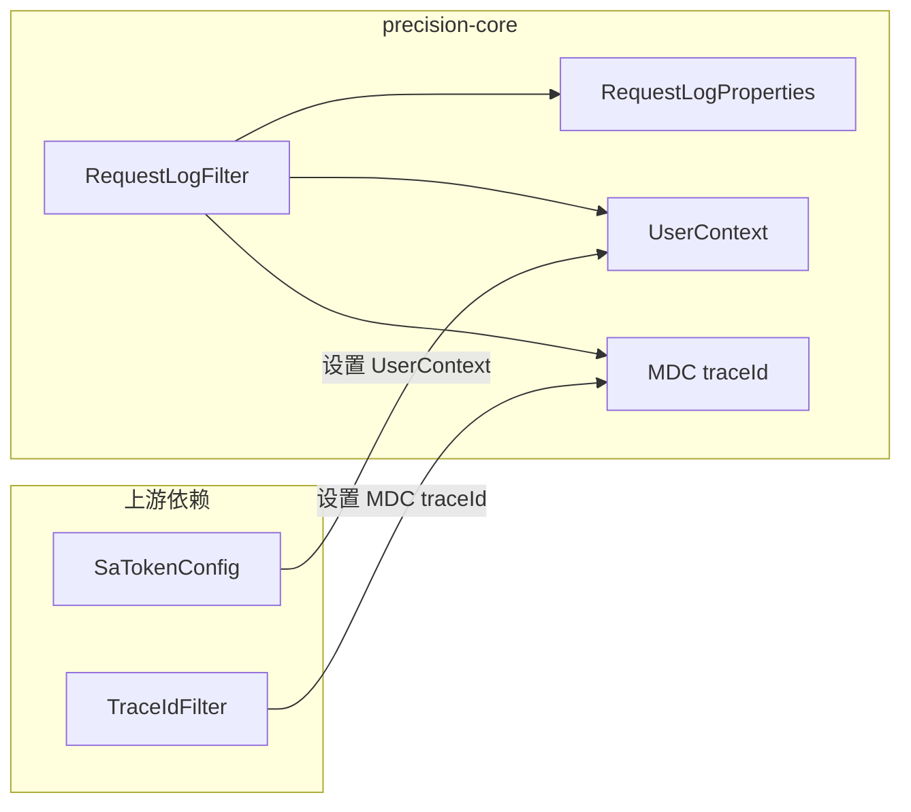

# 请求日志过滤器 详细设计

> **实现状态：✅ 已实现** — 代码位于 `precision-core/src/main/java/com/precision/core/web/RequestLogFilter.java`，覆盖 8 个单元测试 + 端到端验证。

## 文档信息

| 项目 | 内容 |
|------|------|
| 模块名称 | 请求日志过滤器 |
| 模块标识 | request-log-filter |
| 所属系统 | precision-core 公共基础设施 |
| 文档版本 | v1.0.0 |
| 设计负责人 | 后端开发（AI辅助） |
| 最后更新时间 | 2026-04-12 |
| 优先级 | P1（核心） |

适用对象：
- 后端开发
- 测试人员
- AI 编程

---

# 一、设计概述

## 1.1 功能定位

请求日志过滤器是一个 Servlet Filter，在请求进入 DispatcherServlet 之前拦截，记录每个 HTTP 请求的方法、路径、参数、响应状态码和耗时。它是线上问题排查的核心基础设施。

核心职责：

1. **请求追踪**：为每个请求输出结构化日志，包含 traceId、userId、clientIP、method、path
2. **耗时监控**：记录请求处理耗时，超过阈值输出 WARN 日志
3. **响应状态感知**：根据 HTTP 状态码自动选择日志级别（INFO / WARN / ERROR）
4. **敏感信息脱敏**：对登录等接口的请求体中密码字段进行掩码处理
5. **灵活配置**：支持排除路径、慢请求阈值、日志开关等配置

## 1.2 设计约束

- 使用 Servlet Filter（非 Spring Interceptor），确保所有请求均被拦截（包括静态资源、错误页面）
- 使用 `ContentCachingRequestWrapper` / `ContentCachingResponseWrapper` 缓存请求体和响应体，仅在日志输出时读取，不影响业务逻辑
- 过滤器顺序：在 TraceIdFilter 之后、Sa-Token 过滤器之前，确保 traceId 可用
- 仅记录日志，不修改请求和响应内容

---

# 二、类设计

## 2.1 类图



## 2.2 核心类详细设计

### 2.2.1 RequestLogFilter

**包路径**：`com.precision.core.web.RequestLogFilter`

**实现接口**：`jakarta.servlet.Filter`

**字段设计**：

| 字段 | 类型 | 说明 |
|------|------|------|
| `properties` | `RequestLogProperties` | 日志配置，通过构造器注入 |
| `log` | `Logger` | SLF4J 日志器 |
| `SENSITIVE_PATHS` | `Map<String, List<String>>` | 敏感路径与需脱敏字段名的映射，静态初始化 |

**敏感路径配置**：

```java
private static final Map<String, List<String>> SENSITIVE_PATHS = Map.of(
    "/api/v1/auth/login", List.of("password", "confirmPassword"),
    "/api/v1/users/password", List.of("oldPassword", "newPassword"),
    "/api/v1/tenants", List.of("adminPassword")
);
```

**方法设计**：

#### `doFilter(ServletRequest, ServletResponse, FilterChain)`

```
1. 检查 enabled 配置，未启用则直接 chain.doFilter() 跳过
2. 判断当前请求路径是否在 excludePaths 中（AntPathMatcher 匹配），匹配则跳过
3. 包装请求和响应：
   - request = new ContentCachingRequestWrapper(originalRequest)
   - response = new ContentCachingResponseWrapper(originalResponse)
4. 记录开始时间 startTime = System.currentTimeMillis()
5. 执行 chain.doFilter(request, response)
6. 计算耗时 duration = System.currentTimeMillis() - startTime
7. 构建 logEntry：
   a. 获取 traceId = MDC.get("traceId")
   b. 获取 userId = UserContext.getUserId()
   c. 获取 clientIP = getClientIP(request)
   d. 获取 method = request.getMethod()
   e. 获取 path = request.getRequestURI()
   f. 获取 status = response.getStatus()
   g. 读取请求体（仅 POST/PUT/PATCH）：
      - byte[] body = request.getContentAsByteArray()
      - String bodyStr = new String(body, StandardCharsets.UTF_8)
      - bodyStr = maskSensitiveBody(bodyStr, path)
      - bodyStr = truncate(bodyStr, maxBodyLength)
   h. 格式化：[traceId][userId][clientIP] method path → status (duration_ms)
      如果有 body，附加 body=xxx
8. 根据 determineLogLevel(status, duration) 获取日志级别并输出
9. 调用 response.copyBodyToResponse()（必须调用，否则响应体为空）
```

#### `shouldSkip(String path)`

```
1. 遍历 properties.getExcludePaths()
2. 使用 AntPathMatcher.match(pattern, path) 匹配
3. 任一模式匹配返回 true
4. 默认排除路径：/actuator/**, /swagger-ui/**, /v3/api-docs/**
```

#### `getClientIP(HttpServletRequest)`

```
按优先级获取真实客户端 IP：
1. X-Forwarded-For（取第一个）
2. X-Real-IP
3. Proxy-Client-IP
4. WL-Proxy-Client-IP
5. request.getRemoteAddr()
如果获取到的是 "0:0:0:0:0:0:0:1"，转换为 "127.0.0.1"
```

#### `maskSensitiveBody(String body, String path)`

```
1. 检查 path 是否在 SENSITIVE_PATHS 中
2. 如果不在，直接返回原始 body
3. 如果在，对 body（JSON 格式）中的敏感字段进行掩码：
   - 使用简单的正则替换："(password)"\\s*:\\s*"[^"]*" → "$1":"***"
   - 或使用 Jackson ObjectMapper 解析后替换
4. 返回脱敏后的 body
```

#### `truncate(String text, int maxLength)`

```
1. 如果 text == null，返回空字符串
2. 如果 text.length() <= maxLength，返回原值
3. 否则返回 text.substring(0, maxLength) + "...(truncated)"
```

#### `determineLogLevel(int status, long duration)`

```
1. 如果 status >= 500 → ERROR
2. 如果 status >= 400 → WARN
3. 如果 duration > properties.getSlowThreshold() → WARN
4. 否则 → INFO
```

### 2.2.2 RequestLogProperties

**包路径**：`com.precision.core.web.RequestLogProperties`

**注解**：`@ConfigurationProperties(prefix = "precision.request-log")`

**字段设计**：

| 字段 | 类型 | 默认值 | 说明 |
|------|------|--------|------|
| `enabled` | `boolean` | `true` | 是否启用请求日志 |
| `slowThreshold` | `int` | `500` | 慢请求阈值（毫秒），超过此值输出 WARN |
| `excludePaths` | `List<String>` | `[/actuator/**, /swagger-ui/**, /v3/api-docs/**]` | 排除路径列表（支持 Ant 风格） |
| `maxBodyLength` | `int` | `2048` | 记录的最大请求体长度（字符数） |

### 2.2.3 RequestLogFilterRegistration（内部配置类）

**包路径**：`com.precision.core.web.RequestLogFilterConfig`

**注解**：`@Configuration`

**Bean 设计**：

```java
@Bean
public FilterRegistrationBean<RequestLogFilter> requestLogFilterRegistration(
        RequestLogProperties properties) {
    FilterRegistrationBean<RequestLogFilter> registration = new FilterRegistrationBean<>();
    registration.setFilter(new RequestLogFilter(properties));
    registration.addUrlPatterns("/*");
    registration.setName("requestLogFilter");
    // 在 TraceIdFilter 之后，Sa-Token 之前
    registration.setOrder(Ordered.HIGHEST_PRECEDENCE + 20);
    return registration;
}

@Bean
@ConfigurationProperties(prefix = "precision.request-log")
public RequestLogProperties requestLogProperties() {
    return new RequestLogProperties();
}
```

---

# 三、接口设计

## 3.1 对外接口

本组件为基础设施组件，不暴露 HTTP 接口，通过以下方式对外服务：

### 3.1.1 配置接口

通过 `application.yml` 配置：

```yaml
precision:
  request-log:
    enabled: true
    slow-threshold: 500
    exclude-paths:
      - /actuator/**
      - /swagger-ui/**
      - /v3/api-docs/**
      - /favicon.ico
      - /static/**
    max-body-length: 2048
```

### 3.1.2 日志输出格式

**标准格式**：

```
[traceId][userId][clientIP] method path → status (duration_ms)
```

**带请求体格式（POST/PUT/PATCH）**：

```
[traceId][userId][clientIP] POST /api/v1/users → 200 (45ms) body={"username":"admin","phone":"138****1234"}
```

**脱敏格式（登录接口）**：

```
[a1b2c3d4][null][192.168.1.100] POST /api/v1/auth/login → 200 (120ms) body={"username":"admin","password":"***"}
```

## 3.2 内部接口

| 接口 | 类型 | 说明 |
|------|------|------|
| `RequestLogProperties` | 配置类 | 外部化配置读取 |
| `MDC.get("traceId")` | 日志上下文 | 从 TraceIdFilter 设置的 MDC 获取 traceId |
| `UserContext.getUserId()` | 上下文 | 获取当前登录用户 ID |
| `SLF4J Logger` | 日志输出 | 结构化日志输出 |

---

# 四、流程设计

## 4.1 核心流程图



## 4.2 异常处理流程



**异常处理要点**：

1. Filter 层抛出的异常不会进入 `@RestControllerAdvice`，而是由 Servlet 容器处理
2. 因此在 `doFilter` 中使用 try-catch-finally 模式，确保 `copyBodyToResponse` 一定被调用
3. finally 块中执行 `copyBodyToResponse`，保证响应体不丢失

```java
// 伪代码
try {
    chain.doFilter(wrappedRequest, wrappedResponse);
} catch (Exception e) {
    log.error("[{}]{} {} → 异常", traceId, method, path, e);
    throw e;
} finally {
    // 构建日志...
    wrappedResponse.copyBodyToResponse();
}
```

---

# 五、数据设计

## 5.1 配置项

| 配置项 | 键 | 默认值 | 说明 |
|--------|-----|--------|------|
| 启用开关 | `precision.request-log.enabled` | `true` | 生产环境可按需关闭 |
| 慢请求阈值 | `precision.request-log.slow-threshold` | `500` | 单位毫秒 |
| 排除路径 | `precision.request-log.exclude-paths` | `[/actuator/**, ...]` | Ant 风格路径模式 |
| 最大请求体长度 | `precision.request-log.max-body-length` | `2048` | 超过截断 |

## 5.2 缓存设计

本组件不使用缓存。请求体和响应体通过 `ContentCachingRequestWrapper` / `ContentCachingResponseWrapper` 在内存中临时缓存，请求结束后由 GC 回收。

**内存注意点**：

- `ContentCachingRequestWrapper` 会将整个请求体缓存在 `ByteArrayOutputStream` 中
- 对于大文件上传请求，应将其路径加入 `excludePaths`，避免内存溢出
- `maxBodyLength` 限制日志输出的长度，不限制缓存大小（缓存由 Wrapper 内部管理）

## 5.3 数据库查询

本组件不涉及数据库查询。

---

# 六、依赖关系

## 6.1 Maven 依赖

无额外依赖，使用 Spring Boot Starter Web 自带的 Servlet API 和 Spring Core。

```xml
<!-- 已包含在 spring-boot-starter-web 中 -->
<dependency>
    <groupId>org.springframework.boot</groupId>
    <artifactId>spring-boot-starter-web</artifactId>
</dependency>
```

## 6.2 内部依赖



| 依赖组件 | 版本 | 说明 |
|----------|------|------|
| `UserContext` | 已实现 | 获取当前登录用户 ID |
| `TraceIdFilter` | 已实现（P2） | 设置 MDC 中的 traceId |
| `SLF4J` | Spring Boot 内置 | 日志输出 |
| `AntPathMatcher` | Spring Core 内置 | 路径匹配 |

## 6.3 被依赖关系

本组件不被其他组件直接依赖，仅通过日志文件间接服务于运维和问题排查。

---

# 七、测试设计

## 7.1 单元测试用例

**测试类**：`com.precision.core.web.RequestLogFilterTest`

| 编号 | 测试方法 | 场景 | 预期结果 |
|------|---------|------|----------|
| UT-001 | `doFilter_正常请求_输出INFO日志` | GET /api/v1/vehicles，返回 200 | 日志包含 method=GET, path=/api/v1/vehicles, status=200 |
| UT-002 | `doFilter_慢请求_输出WARN日志` | 请求耗时 600ms（超过 500ms 阈值） | 日志级别 WARN，包含耗时信息 |
| UT-003 | `doFilter_4xx响应_输出WARN日志` | GET /api/v1/not-found，返回 404 | 日志级别 WARN |
| UT-004 | `doFilter_5xx响应_输出ERROR日志` | 模拟 500 错误 | 日志级别 ERROR |
| UT-005 | `doFilter_排除路径_不记录日志` | GET /actuator/health | 无日志输出 |
| UT-006 | `doFilter_登录请求_密码脱敏` | POST /api/v1/auth/login，body 含 password | 日志中 password 为 `***` |
| UT-007 | `doFilter_大请求体_截断显示` | POST body 超过 2048 字符 | 日志 body 截断，末尾有 `(truncated)` |
| UT-008 | `doFilter_未启用_直接放行` | enabled=false | 不包装 request/response，直接放行 |
| UT-009 | `shouldSkip_AntPath匹配` | excludePaths 含 `/actuator/**`，请求 `/actuator/health` | 返回 true |
| UT-010 | `shouldSkip_精确匹配` | excludePaths 含 `/favicon.ico`，请求 `/favicon.ico` | 返回 true |
| UT-011 | `shouldSkip_不匹配` | 请求 `/api/v1/users` | 返回 false |
| UT-012 | `getClientIP_代理头解析` | X-Forwarded-For: 10.0.0.1, 192.168.1.1 | 返回 10.0.0.1 |
| UT-013 | `getClientIP_直连` | 无代理头，remoteAddr=192.168.1.100 | 返回 192.168.1.100 |
| UT-014 | `maskSensitiveBody_非敏感路径` | path=/api/v1/users | 返回原始 body |
| UT-015 | `maskSensitiveBody_登录路径` | path=/api/v1/auth/login，body 含 password | password 值替换为 `***` |
| UT-016 | `truncate_超长截断` | 3000 字符文本，maxLength=2048 | 返回前 2048 字符 + "...(truncated)" |
| UT-017 | `truncate_未超长` | 1000 字符文本，maxLength=2048 | 返回原始文本 |
| UT-018 | `doFilter_异常场景_记录ERROR并重抛` | chain.doFilter 抛出 RuntimeException | 日志 ERROR，异常重抛 |

## 7.2 集成测试场景

**测试类**：`com.precision.core.web.RequestLogFilterIntegrationTest`

| 编号 | 测试场景 | 操作步骤 | 验证点 |
|------|---------|---------|--------|
| IT-001 | 完整请求链路日志 | 发起 GET /api/v1/vehicles，验证日志输出 | 日志包含 traceId、userId、IP、method、path、status、duration |
| IT-002 | 过滤器顺序验证 | 发起请求，验证 TraceIdFilter → RequestLogFilter → Sa-Token 顺序 | traceId 在 RequestLogFilter 中可用 |
| IT-003 | POST 请求体记录 | 发起 POST /api/v1/vehicles 携带 JSON body | 日志包含请求体内容 |
| IT-004 | 登录接口脱敏 | 发起 POST /api/v1/auth/login 携带密码 | 日志中密码被掩码 |
| IT-005 | 响应体完整性 | 发起请求，验证客户端收到的响应体 | 响应体未被截断或修改 |
| IT-006 | 大文件上传排除 | 配置排除路径，发送大文件上传请求 | 不记录日志，内存无异常 |

---

# 八、变更记录

| 版本 | 日期 | 修改人 | 变更描述 |
|------|------|--------|---------|
| v1.0.0 | 2026-04-12 | 后端开发（AI辅助） | 初始版本 |
