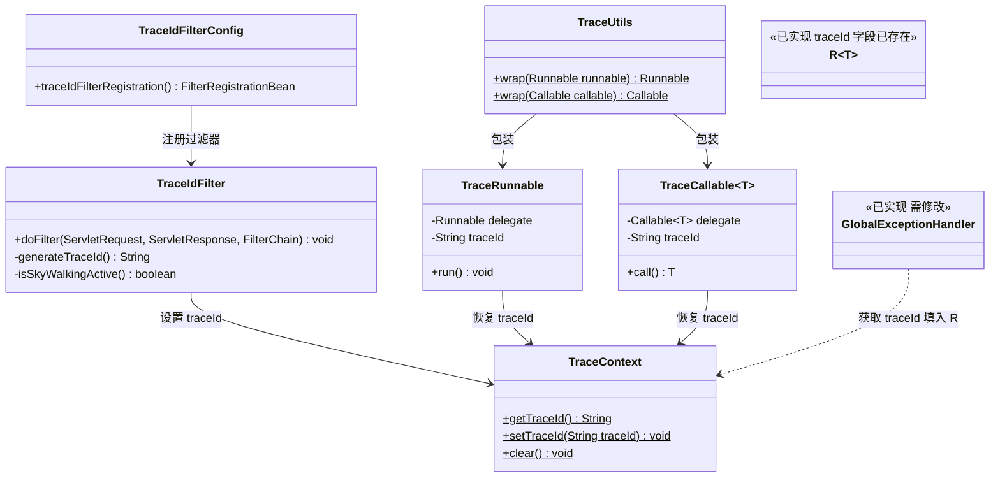
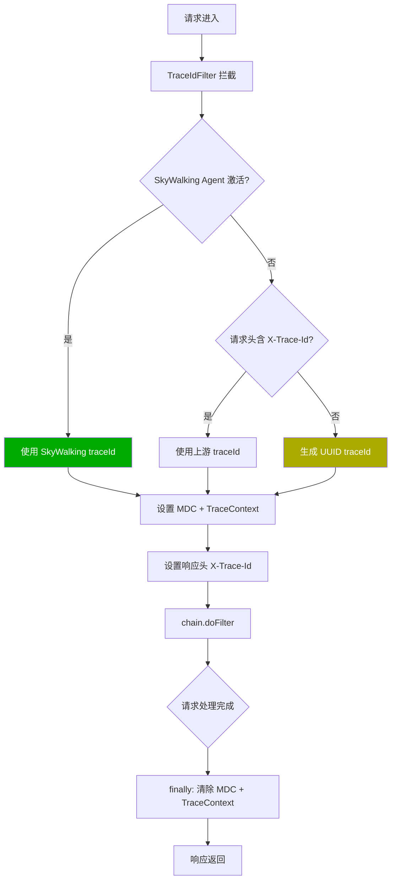
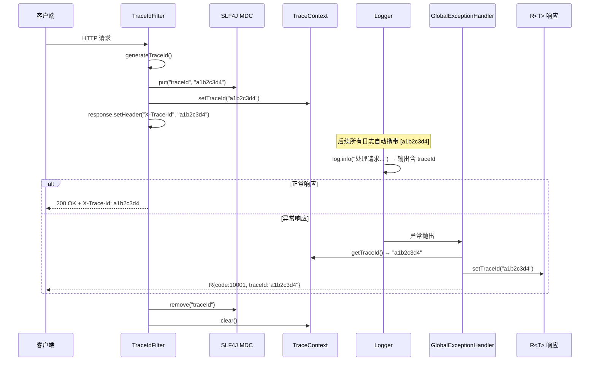
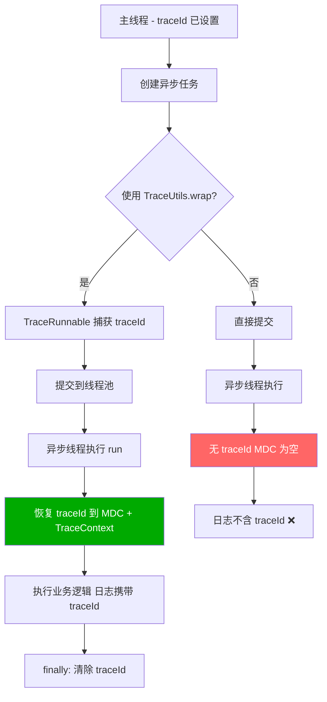
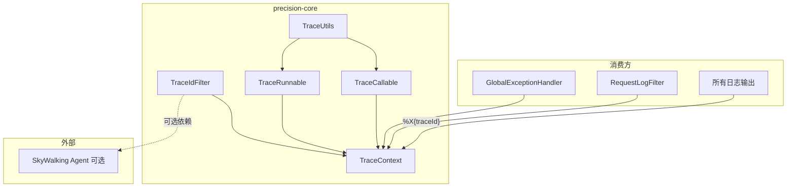

# 全链路追踪 详细设计

> **实现状态：✅ 已实现** — 代码位于 `precision-core/src/main/java/com/precision/core/trace/`，覆盖 8 个单元测试 + 端到端验证。

## 文档信息

| 项目 | 内容 |
|------|------|
| 模块名称 | 全链路追踪 |
| 模块标识 | trace |
| 所属系统 | precision-core 公共基础设施 |
| 文档版本 | v1.0.0 |
| 设计负责人 | 后端开发（AI辅助） |
| 最后更新时间 | 2026-04-12 |
| 优先级 | P2（重要） |

适用对象：
- 后端开发
- 运维人员
- AI 编程

---

# 一、设计概述

## 1.1 功能定位

全链路追踪为平台提供统一的请求标识（traceId）能力，贯穿 HTTP 请求、日志输出、异常响应的完整链路，是线上问题排查的核心基础设施。

核心职责：

1. **traceId 生成**：为每个 HTTP 请求生成唯一的追踪标识
2. **SkyWalking 集成**：优先使用 SkyWalking agent 生成的 traceId，无 agent 时使用 UUID
3. **MDC 注入**：将 traceId 注入 SLF4J MDC，所有日志自动携带 traceId
4. **响应头透传**：通过 `X-Trace-Id` 响应头将 traceId 返回给客户端
5. **统一响应集成**：在 `R<T>` 统一响应中自动填充 traceId 字段

## 1.2 设计约束

- **优先 SkyWalking**：如果部署了 SkyWalking agent，使用其原生 traceId，保证分布式追踪的完整性
- **降级 UUID**：未部署 agent 时，使用 UUID 作为 traceId，保证基础追踪能力
- **最高优先级**：TraceIdFilter 必须是第一个执行的 Filter，确保后续所有组件都能获取到 traceId
- **线程安全**：MDC 基于 ThreadLocal，天然线程隔离
- **异步传递**：异步线程需通过 `TraceRunnable` / `TraceCallable` 传递 traceId

## 1.3 traceId 使用场景

| 场景 | 使用方式 | 说明 |
|------|---------|------|
| 日志关联 | `%X{traceId}` 在 logback pattern 中 | 每行日志自动携带 traceId |
| 错误响应 | `R.traceId` 字段 | 前端展示错误时可提供 traceId 给后端排查 |
| 问题排查 | 通过 traceId 在日志文件中 grep | 快速定位一次请求的所有日志 |
| SkyWalking 关联 | traceId 与 SkyWalking span 关联 | 在 SkyWalking UI 中通过 traceId 查询 |

---

# 二、类设计

## 2.1 类图



## 2.2 核心类详细设计

### 2.2.1 TraceIdFilter

**包路径**：`com.precision.core.trace.TraceIdFilter`

**实现接口**：`jakarta.servlet.Filter`

**方法设计**：

#### `doFilter(ServletRequest, ServletResponse, FilterChain)`

```
1. 生成 traceId：
   traceId = generateTraceId()

2. 设置 traceId 到上下文：
   MDC.put("traceId", traceId)
   TraceContext.setTraceId(traceId)

3. 设置响应头：
   response.setHeader("X-Trace-Id", traceId)

4. try:
     chain.doFilter(request, response)
   finally:
     MDC.remove("traceId")
     TraceContext.clear()
```

#### `generateTraceId()`

```
1. 检查 SkyWalking 是否激活：
   if isSkyWalkingActive() → return TraceContext.traceId()  (SkyWalking API)

2. 检查请求头是否已携带 traceId（支持链路透传）：
   String existingTraceId = request.getHeader("X-Trace-Id")
   if existingTraceId != null && !existingTraceId.isEmpty()
     → return existingTraceId

3. 生成新的 traceId：
   return UUID.randomUUID().toString().replace("-", "")
```

#### `isSkyWalkingActive()`

```
try:
    String swTraceId = org.apache.skywalking.apm.toolkit.trace.TraceContext.traceId()
    if swTraceId != null && !swTraceId.isEmpty() && !"Ignored_Trace".equals(swTraceId)
      → return true
    → return false
catch (Exception e):
    → return false  (SkyWalking 类不存在时)
```

**注意**：`apm-toolkit-trace` 依赖设为 `<optional>true</optional>`，运行时可能不存在，需要 try-catch 保护。

### 2.2.2 TraceIdFilterConfig

**包路径**：`com.precision.core.trace.TraceIdFilterConfig`

**注解**：`@Configuration`

```java
@Bean
public FilterRegistrationBean<TraceIdFilter> traceIdFilterRegistration() {
    FilterRegistrationBean<TraceIdFilter> registration = new FilterRegistrationBean<>();
    registration.setFilter(new TraceIdFilter());
    registration.addUrlPatterns("/*");
    registration.setName("traceIdFilter");
    // 最高优先级，确保第一个执行
    registration.setOrder(Ordered.HIGHEST_PRECEDENCE);
    return registration;
}
```

### 2.2.3 TraceContext

**包路径**：`com.precision.core.trace.TraceContext`

**说明**：TraceContext 是 traceId 存取的静态工具类，同时操作 MDC 和 ThreadLocal。

```java
public class TraceContext {

    private static final ThreadLocal<String> TRACE_ID = new ThreadLocal<>();

    /**
     * 获取当前 traceId
     */
    public static String getTraceId() {
        String traceId = TRACE_ID.get();
        if (traceId == null) {
            traceId = MDC.get("traceId");
        }
        return traceId;
    }

    /**
     * 设置当前 traceId（同时设置 ThreadLocal 和 MDC）
     */
    public static void setTraceId(String traceId) {
        TRACE_ID.set(traceId);
        MDC.put("traceId", traceId);
    }

    /**
     * 清除当前 traceId
     */
    public static void clear() {
        TRACE_ID.remove();
        MDC.remove("traceId");
    }
}
```

### 2.2.4 TraceRunnable

**包路径**：`com.precision.core.trace.TraceRunnable`

**实现**：`Runnable`

```java
public class TraceRunnable implements Runnable {
    private final Runnable delegate;
    private final String traceId;
    private final Map<String, String> mdcContext;

    public TraceRunnable(Runnable delegate) {
        this.delegate = delegate;
        this.traceId = TraceContext.getTraceId();
        this.mdcContext = MDC.getCopyOfContextMap();
    }

    @Override
    public void run() {
        // 恢复父线程的 traceId 和 MDC 上下文
        if (traceId != null) {
            TraceContext.setTraceId(traceId);
        }
        if (mdcContext != null) {
            MDC.setContextMap(mdcContext);
        }
        try {
            delegate.run();
        } finally {
            TraceContext.clear();
            MDC.clear();
        }
    }
}
```

### 2.2.5 TraceCallable

**包路径**：`com.precision.core.trace.TraceCallable`

**实现**：`Callable<T>`

设计同 TraceRunnable，增加返回值和异常处理：

```java
public class TraceCallable<T> implements Callable<T> {
    private final Callable<T> delegate;
    private final String traceId;
    private final Map<String, String> mdcContext;

    public TraceCallable(Callable<T> delegate) {
        this.delegate = delegate;
        this.traceId = TraceContext.getTraceId();
        this.mdcContext = MDC.getCopyOfContextMap();
    }

    @Override
    public T call() throws Exception {
        if (traceId != null) {
            TraceContext.setTraceId(traceId);
        }
        if (mdcContext != null) {
            MDC.setContextMap(mdcContext);
        }
        try {
            return delegate.call();
        } finally {
            TraceContext.clear();
            MDC.clear();
        }
    }
}
```

### 2.2.6 TraceUtils

**包路径**：`com.precision.core.trace.TraceUtils`

```java
public class TraceUtils {

    /**
     * 包装 Runnable，传递 traceId 到异步线程
     */
    public static Runnable wrap(Runnable runnable) {
        return new TraceRunnable(runnable);
    }

    /**
     * 包装 Callable，传递 traceId 到异步线程
     */
    public static <T> Callable<T> wrap(Callable<T> callable) {
        return new TraceCallable<>(callable);
    }
}
```

**使用示例**：

```java
// @Async 方法中使用
@Async
public void asyncProcess(LocationData data) {
    // traceId 已通过 TraceRunnable 传递，日志中可正常输出
    log.info("异步处理位置数据: deviceId={}", data.getDeviceId());
}

// 手动线程池中使用
executorService.submit(TraceUtils.wrap(() -> {
    log.info("异步任务执行");  // 日志携带 traceId
}));

// CompletableFuture 中使用
CompletableFuture.runAsync(TraceUtils.wrap(() -> {
    log.info("异步计算");
}), executorService);
```

### 2.2.7 GlobalExceptionHandler 修改

在现有 `GlobalExceptionHandler` 中修改所有异常处理方法，在构造 `R<>` 响应时填充 traceId：

```java
@ExceptionHandler(BizException.class)
public R<?> handleBizException(BizException e) {
    log.warn("业务异常: code={}, message={}", e.getCode(), e.getMessage());
    R<?> r = R.fail(e.getCode(), e.getMessage());
    r.setTraceId(TraceContext.getTraceId());  // 新增
    return r;
}

@ExceptionHandler(Exception.class)
public R<?> handleException(Exception e) {
    log.error("系统异常", e);
    R<?> r = R.fail(ErrorCode.SYSTEM_ERROR);
    r.setTraceId(TraceContext.getTraceId());  // 新增
    return r;
}

// 其他 handler 方法同理...
```

### 2.2.8 Logback 配置修改

在 `application.yml` 或 `logback-spring.xml` 中添加 traceId 到日志 pattern：

**application.yml 方式**：

```yaml
logging:
  pattern:
    console: "%d{yyyy-MM-dd HH:mm:ss.SSS} [%thread] [%X{traceId:-}] %-5level %logger{36} - %msg%n"
    file: "%d{yyyy-MM-dd HH:mm:ss.SSS} [%thread] [%X{traceId:-}] %-5level %logger{36} - %msg%n"
```

**logback-spring.xml 方式**：

```xml
<property name="LOG_PATTERN"
    value="%d{yyyy-MM-dd HH:mm:ss.SSS} [%thread] [%X{traceId:-}] %-5level %logger{36} - %msg%n"/>

<appender name="CONSOLE" class="ch.qos.logback.core.ConsoleAppender">
    <encoder>
        <pattern>${LOG_PATTERN}</pattern>
    </encoder>
</appender>
```

**说明**：`%X{traceId:-}` 中的 `:-` 表示当 MDC 中没有 traceId 时输出空字符串。

---

# 三、接口设计

## 3.1 对外接口

### 3.1.1 HTTP 响应头

每个 HTTP 响应都携带 `X-Trace-Id` 头：

```
HTTP/1.1 200 OK
Content-Type: application/json
X-Trace-Id: a1b2c3d4e5f67890
```

### 3.1.2 统一响应 traceId 字段

`R<T>` 响应体中的 `traceId` 字段：

```json
{
  "code": 10001,
  "message": "系统异常",
  "data": null,
  "timestamp": 1712908800000,
  "traceId": "a1b2c3d4e5f67890"
}
```

### 3.1.3 TraceContext API

```java
// 获取当前 traceId（可在任意位置调用）
String traceId = TraceContext.getTraceId();

// 手动设置 traceId（通常由 Filter 自动设置）
TraceContext.setTraceId("custom-trace-id");

// 清除 traceId（通常在 finally 中调用）
TraceContext.clear();
```

### 3.1.4 TraceUtils API

```java
// 包装 Runnable（用于线程池 / @Async）
Runnable wrapped = TraceUtils.wrap(() -> { ... });

// 包装 Callable（用于 Future / CompletableFuture）
Callable<String> wrapped = TraceUtils.wrap(() -> "result");
```

## 3.2 内部接口

| 接口 | 提供方 | 消费方 | 说明 |
|------|--------|--------|------|
| `MDC.put("traceId", ...)` | TraceIdFilter | 日志框架 | SLF4J MDC |
| `TraceContext.getTraceId()` | TraceContext | GlobalExceptionHandler, RequestLogFilter | 获取 traceId |
| `response.setHeader("X-Trace-Id", ...)` | TraceIdFilter | 客户端 | 响应头透传 |

---

# 四、流程设计

## 4.1 核心流程图



## 4.2 traceId 传递链路



## 4.3 异步线程 traceId 传递流程



---

# 五、数据设计

## 5.1 配置项

| 配置项 | 键 | 默认值 | 说明 |
|--------|-----|--------|------|
| 响应头名称 | `precision.trace.header-name` | `X-Trace-Id` | traceId 响应头名称 |
| 请求头名称 | `precision.trace.request-header-name` | `X-Trace-Id` | 接收上游 traceId 的请求头名称 |
| 日志 MDC key | `precision.trace.mdc-key` | `traceId` | MDC 中 traceId 的 key 名称 |

## 5.2 缓存设计

本组件不使用业务缓存。

**MDC 注意**：`MDC` 基于 `InheritableThreadLocal` 实现的是浅拷贝，子线程不会自动继承父线程的 MDC。因此必须使用 `TraceRunnable` / `TraceCallable` 显式传递。

## 5.3 数据库查询

本组件不涉及数据库查询。

---

# 六、依赖关系

## 6.1 Maven 依赖

```xml
<!-- SkyWalking Toolkit（可选依赖） -->
<dependency>
    <groupId>org.apache.skywalking</groupId>
    <artifactId>apm-toolkit-trace</artifactId>
    <version>9.3.0</version>
    <optional>true</optional>
</dependency>
```

**说明**：`<optional>true</optional>` 表示此依赖不会传递给依赖 precision-core 的模块。运行时如果存在 SkyWalking agent，则使用 SkyWalking traceId；否则降级为 UUID。

## 6.2 内部依赖



| 依赖组件 | 版本 | 说明 |
|----------|------|------|
| `SLF4J MDC` | Spring Boot 内置 | 日志上下文传递 |
| `jakarta.servlet.Filter` | Spring Boot 内置 | Servlet 过滤器 |
| `apm-toolkit-trace` | 9.3.0 (optional) | SkyWalking 集成（可选） |
| `R<T>` | 已实现 | traceId 字段已存在 |
| `GlobalExceptionHandler` | 已实现 | 需修改以填充 traceId |

## 6.3 被依赖关系

| 消费方 | 使用方式 |
|--------|---------|
| RequestLogFilter | 从 MDC 获取 traceId 记录日志 |
| GlobalExceptionHandler | 从 TraceContext 获取 traceId 填入 R |
| 所有 Service / Component | 日志自动携带 traceId |
| 异步任务 | 通过 TraceUtils.wrap() 传递 traceId |
| 前端 | 从响应头或响应体获取 traceId 用于问题反馈 |

## 6.4 Filter 执行顺序

```
请求进入 →
  TraceIdFilter (Order: HIGHEST_PRECEDENCE)        ← 最先执行，设置 traceId
  → RequestLogFilter (Order: HIGHEST_PRECEDENCE + 20) ← 记录日志（traceId 可用）
  → Spring Security FilterChain                     ← 安全过滤
  → Sa-Token Interceptor                            ← 登录校验 + UserContext 设置
  → DispatcherServlet                               ← 路由到 Controller
  → Controller → Service → Mapper                   ← 业务处理
← 响应返回
```

---

# 七、测试设计

## 7.1 单元测试用例

### 7.1.1 TraceIdFilter 测试

**测试类**：`com.precision.core.trace.TraceIdFilterTest`

| 编号 | 测试方法 | 场景 | 预期结果 |
|------|---------|------|----------|
| UT-001 | `doFilter_无SkyWalking_生成UUID` | 未部署 SkyWalking agent | MDC 中有 traceId，值为 32 位十六进制 |
| UT-002 | `doFilter_请求头携带traceId_使用上游值` | X-Trace-Id: upstream-trace-123 | traceId 为 "upstream-trace-123" |
| UT-003 | `doFilter_设置响应头` | 正常请求 | 响应头 X-Trace-Id = traceId |
| UT-004 | `doFilter_finally清除MDC` | 请求完成后 | MDC.get("traceId") == null |
| UT-005 | `doFilter_finally清除TraceContext` | 请求完成后 | TraceContext.getTraceId() == null |

### 7.1.2 TraceContext 测试

**测试类**：`com.precision.core.trace.TraceContextTest`

| 编号 | 测试方法 | 场景 | 预期结果 |
|------|---------|------|----------|
| UT-006 | `setTraceId_MDC同步设置` | setTraceId("test-123") | MDC.get("traceId") == "test-123" |
| UT-007 | `getTraceId_ThreadLocal优先` | ThreadLocal="a", MDC="b" | 返回 "a" |
| UT-008 | `getTraceId_ThreadLocal为空_取MDC` | ThreadLocal=null, MDC="b" | 返回 "b" |
| UT-009 | `clear_全部清除` | clear() 后 | ThreadLocal 和 MDC 均为 null |
| UT-010 | `getTraceId_未设置` | 无 setTraceId 调用 | 返回 null |

### 7.1.3 TraceRunnable / TraceCallable 测试

**测试类**：`com.precision.core.trace.TraceRunnableTest`

| 编号 | 测试方法 | 场景 | 预期结果 |
|------|---------|------|----------|
| UT-011 | `run_传递traceId` | 主线程设置 traceId 后执行 | 异步线程中 TraceContext.getTraceId() == 主线程 traceId |
| UT-012 | `run_finally清除` | 异步任务执行后 | MDC 已清除 |
| UT-013 | `run_异常不丢失traceId` | 任务内抛异常 | 执行期间 traceId 可用 |

**测试类**：`com.precision.core.trace.TraceCallableTest`

| 编号 | 测试方法 | 场景 | 预期结果 |
|------|---------|------|----------|
| UT-014 | `call_传递traceId_返回结果` | 主线程设置 traceId | 异步线程中 traceId 可用，返回值正确 |
| UT-015 | `call_异常传递` | 任务内抛 Exception | 异常正确抛出，traceId 在执行期间可用 |

### 7.1.4 TraceUtils 测试

**测试类**：`com.precision.core.trace.TraceUtilsTest`

| 编号 | 测试方法 | 场景 | 预期结果 |
|------|---------|------|----------|
| UT-016 | `wrap_Runnable_类型正确` | wrap(runnable) | 返回 TraceRunnable 实例 |
| UT-017 | `wrap_Callable_类型正确` | wrap(callable) | 返回 TraceCallable 实例 |

## 7.2 集成测试场景

**测试类**：`com.precision.core.trace.TraceIdIntegrationTest`

| 编号 | 测试场景 | 操作步骤 | 验证点 |
|------|---------|---------|--------|
| IT-001 | 请求自动携带 traceId | 发起 GET /api/v1/vehicles | 响应头含 X-Trace-Id，响应体含 traceId |
| IT-002 | 异常响应含 traceId | 触发系统异常 | R{traceId: "xxx"} 非空 |
| IT-003 | 日志输出含 traceId | 发起请求并检查日志 | 每行日志含 traceId |
| IT-004 | 不同请求 traceId 不同 | 连续两个请求 | traceId 不同 |
| IT-005 | 上游 traceId 透传 | 请求头携带 X-Trace-Id | 响应使用相同的 traceId |
| IT-006 | Filter 执行顺序 | 验证 TraceIdFilter 先于 RequestLogFilter | RequestLogFilter 日志中有 traceId |
| IT-007 | 异步任务 traceId 传递 | 使用 TraceUtils.wrap 提交异步任务 | 异步日志含相同 traceId |
| IT-008 | 异步任务未包装无 traceId | 直接提交异步任务（不 wrap） | 异步日志不含 traceId |

---

# 八、变更记录

| 版本 | 日期 | 修改人 | 变更描述 |
|------|------|--------|---------|
| v1.0.0 | 2026-04-12 | 后端开发（AI辅助） | 初始版本 |
