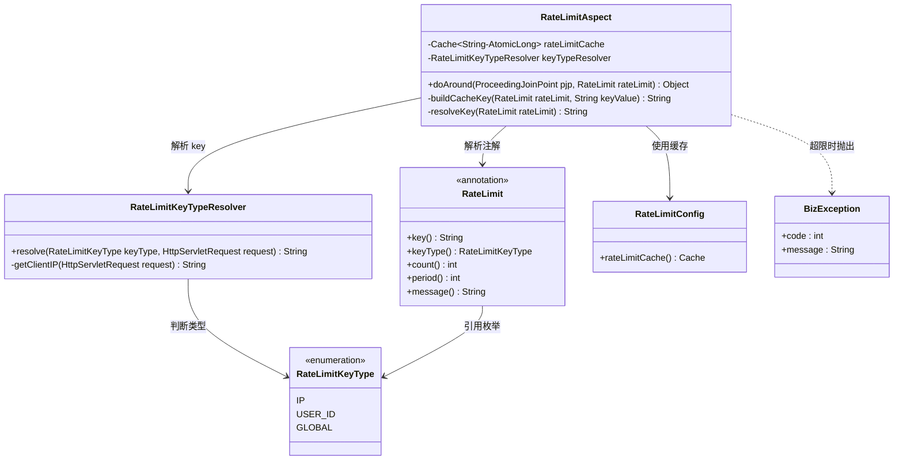
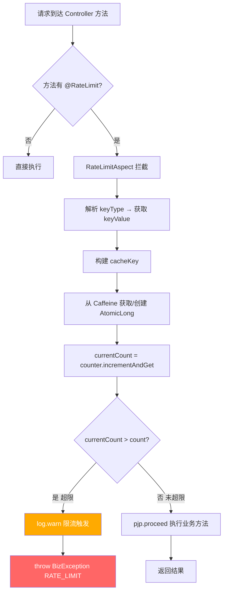
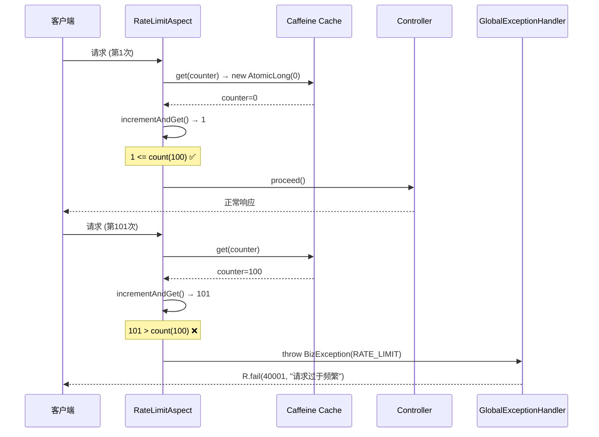
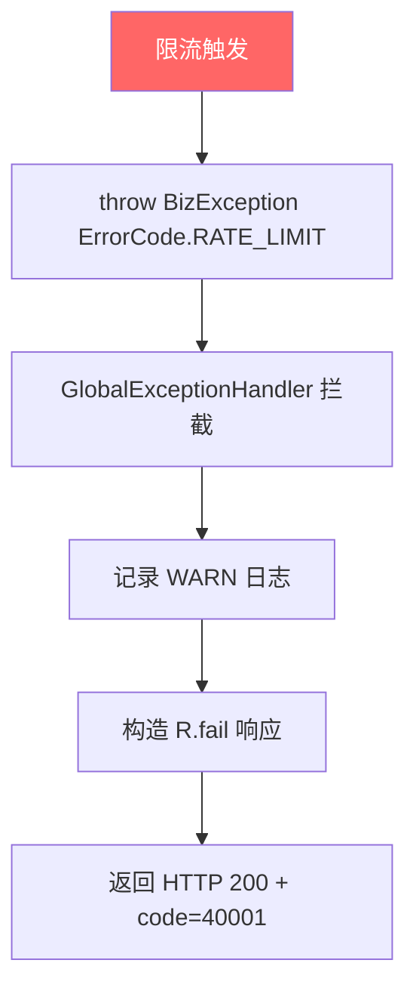
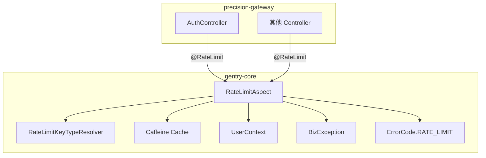

# 接口限流 详细设计

> **实现状态：✅ 已实现** — 代码位于 `gentry-core/src/main/java/com/gentry/core/web/`，覆盖 7 个单元测试 + 端到端验证。

## 文档信息

| 项目 | 内容 |
|------|------|
| 模块名称 | 接口限流 |
| 模块标识 | rate-limit |
| 所属系统 | gentry-core 公共基础设施 |
| 文档版本 | v1.0.0 |
| 设计负责人 | 后端开发（AI辅助） |
| 最后更新时间 | 2026-04-12 |
| 优先级 | P2（重要） |

适用对象：
- 后端开发
- 测试人员
- AI 编程

---

# 一、设计概述

## 1.1 功能定位

接口限流通过注解驱动的 AOP 切面，基于 Caffeine 本地缓存实现滑动窗口计数，对高频请求进行拦截，保护系统免受过载影响。

核心职责：

1. **注解驱动**：在需要限流的 Controller 方法上添加 `@RateLimit` 注解即可启用
2. **多维度限流**：支持按 IP、用户ID、全局三个维度进行限流
3. **可配置阈值**：每个接口可独立配置请求次数和时间窗口
4. **优雅拒绝**：超限请求抛出 `BizException`，由全局异常处理器返回友好提示

## 1.2 设计约束

- **单机方案**：首期使用 Caffeine 本地缓存，满足单机部署需求
- **扩展预留**：接口抽象设计，未来可切换为 Redis 分布式限流
- **原子计数**：使用 `AtomicLong` 保证计数线程安全
- **自动过期**：利用 Caffeine 的 `expireAfterWrite` 实现时间窗口自动过期

## 1.3 适用场景

| 场景 | 说明 |
|------|------|
| 登录接口 | 防止暴力破解，按 IP 限制每分钟 5 次 |
| 短信发送 | 防止短信轰炸，按手机号限制每小时 3 次 |
| 数据导出 | 防止频繁导出，按用户限制每分钟 2 次 |
| 通用查询 | 防止接口滥用，按 IP 限制每分钟 100 次 |

---

# 二、类设计

## 2.1 类图



## 2.2 核心类详细设计

### 2.2.1 @RateLimit 注解

**包路径**：`com.gentry.core.web.RateLimit`

**注解定义**：

```java
@Target(ElementType.METHOD)
@Retention(RetentionPolicy.RUNTIME)
@Documented
public @interface RateLimit {

    /**
     * 限流 key 的自定义部分（可选）
     * 如果指定，将拼接到 key 中
     */
    String key() default "";

    /**
     * 限流维度
     */
    RateLimitKeyType keyType() default RateLimitKeyType.IP;

    /**
     * 时间窗口内允许的最大请求次数
     */
    int count() default 100;

    /**
     * 时间窗口大小（秒）
     */
    int period() default 60;

    /**
     * 超限提示信息
     */
    String message() default "请求过于频繁，请稍后重试";
}
```

**使用示例**：

```java
// 登录接口：每 IP 每分钟 5 次
@RateLimit(keyType = RateLimitKeyType.IP, count = 5, period = 60, message = "登录尝试过于频繁")
@PostMapping("/auth/login")
public R<LoginVO> login(@RequestBody LoginDTO dto) { ... }

// 数据导出：每用户每分钟 2 次
@RateLimit(keyType = RateLimitKeyType.USER_ID, count = 2, period = 60)
@PostMapping("/vehicles/export")
public R<String> exportVehicles(@RequestBody VehicleQuery query) { ... }

// 全局限流：全局每秒 50 次
@RateLimit(keyType = RateLimitKeyType.GLOBAL, count = 50, period = 1)
@GetMapping("/monitor/realtime")
public R<List<RealtimeVO>> getRealtimeData() { ... }
```

### 2.2.2 RateLimitKeyType 枚举

**包路径**：`com.gentry.core.web.RateLimitKeyType`

```java
public enum RateLimitKeyType {
    /** 按客户端 IP 限流 */
    IP,
    /** 按当前登录用户 ID 限流 */
    USER_ID,
    /** 全局限流（不区分用户/IP） */
    GLOBAL
}
```

### 2.2.3 RateLimitAspect

**包路径**：`com.gentry.core.web.RateLimitAspect`

**注解**：`@Aspect` `@Component`

**字段设计**：

| 字段 | 类型 | 说明 |
|------|------|------|
| `rateLimitCache` | `Cache<String, AtomicLong>` | Caffeine 限流计数缓存 |
| `keyTypeResolver` | `RateLimitKeyTypeResolver` | Key 解析器 |

**缓存初始化**（在构造器中）：

```java
this.rateLimitCache = Caffeine.newBuilder()
    .maximumSize(10_000)                    // 最多 10000 个限流 key
    .expireAfterWrite(maxPeriod, TimeUnit.SECONDS)  // 按最长时间窗口过期
    .build();
```

**注意**：由于不同注解的 `period` 不同，`expireAfterWrite` 只能设置一个全局值。方案：取注解中的 `period` 值作为缓存过期时间。通过 `cache.get(key, mappingFunction)` 在首次访问时创建 `AtomicLong`，过期时间取决于 Caffeine 配置。

**优化方案 — 分组缓存**：

```java
// 不使用单一缓存，而是在 doAround 中动态管理过期
// 使用 cache.put(key, counter) + Caffeine 的 expireAfterWrite
// 由于 period 不同，使用统一的过期时间（取 period 最大值）
// 或使用 Caffeine 的 expireAfter 自定义过期策略
```

**实际实现方案**：使用 `Caffeine.expireAfterWrite()` 配合动态过期时间。由于 Caffeine 不支持每个 key 独立 TTL（除非使用 Expiry 接口），采用以下策略：

```java
this.rateLimitCache = Caffeine.newBuilder()
    .maximumSize(10_000)
    .expireAfter(new Expiry<String, AtomicLong>() {
        @Override
        public long expireAfterCreate(String key, AtomicLong value, long currentTime) {
            // 从 key 中解析 period，返回纳秒
            return parsedPeriod * 1_000_000_000L;
        }
        @Override
        public long expireAfterUpdate(String key, AtomicLong value, long currentTime, long currentDuration) {
            return currentDuration; // 不修改过期时间
        }
        @Override
        public long expireAfterRead(String key, AtomicLong value, long currentTime, long currentDuration) {
            return currentDuration; // 读取不修改过期时间
        }
    })
    .build();
```

#### `doAround(ProceedingJoinPoint pjp, RateLimit rateLimit)`

```
1. 解析限流维度对应的 key 值：
   keyValue = keyTypeResolver.resolve(rateLimit.keyType(), request)

2. 构建缓存 key：
   cacheKey = buildCacheKey(rateLimit, keyValue)
   格式：rate_limit:{keyType}:{keyValue}:{methodSignature}

3. 从缓存获取计数器：
   counter = rateLimitCache.get(cacheKey, k -> new AtomicLong(0))

4. 原子递增并判断：
   currentCount = counter.incrementAndGet()
   if currentCount > rateLimit.count():
     log.warn("接口限流触发: key={}, count={}, limit={}", cacheKey, currentCount, rateLimit.count())
     throw new BizException(ErrorCode.RATE_LIMIT, rateLimit.message())

5. 未超限，继续执行：
   return pjp.proceed()
```

#### `buildCacheKey(RateLimit rateLimit, String keyValue)`

```
key = "rate_limit:"
    + rateLimit.keyType().name() + ":"
    + keyValue + ":"
    + rateLimit.key() (如果非空)
    + ":" + methodSignature
return key

示例：
- rate_limit:IP:192.168.1.100:com.gentry.gateway.controller.AuthController.login
- rate_limit:USER_ID:1001:export
- rate_limit:GLOBAL::realtime
```

### 2.2.4 RateLimitKeyTypeResolver

**包路径**：`com.gentry.core.web.RateLimitKeyTypeResolver`

**注解**：`@Component`

**方法设计**：

#### `resolve(RateLimitKeyType keyType, HttpServletRequest request)`

```
switch (keyType):
  case IP:
    return getClientIP(request)
  case USER_ID:
    userId = UserContext.getUserId()
    if userId == null → return "anonymous"
    return String.valueOf(userId)
  case GLOBAL:
    return "global"
```

#### `getClientIP(HttpServletRequest request)`

同请求日志过滤器中的 IP 获取逻辑，优先从 `X-Forwarded-For` / `X-Real-IP` 获取。

### 2.2.5 RateLimitConfig

**包路径**：`com.gentry.core.web.RateLimitConfig`

**注解**：`@Configuration`

```java
@Configuration
public class RateLimitConfig {
    // RateLimitAspect 已通过 @Component 注解自动注册
    // 此处可定义默认限流策略的 Bean（如有需要）

    @Bean
    @ConditionalOnMissingBean
    public RateLimitKeyTypeResolver rateLimitKeyTypeResolver() {
        return new RateLimitKeyTypeResolver();
    }
}
```

---

# 三、接口设计

## 3.1 对外接口

### 3.1.1 @RateLimit 注解参数

| 参数 | 类型 | 默认值 | 说明 |
|------|------|--------|------|
| `key` | String | `""` | 自定义 key（拼接到缓存 key 中） |
| `keyType` | RateLimitKeyType | `IP` | 限流维度 |
| `count` | int | `100` | 时间窗口内允许的最大请求数 |
| `period` | int | `60` | 时间窗口（秒） |
| `message` | String | `"请求过于频繁，请稍后重试"` | 超限提示信息 |

### 3.1.2 超限响应格式

```json
{
  "code": 40001,
  "message": "请求过于频繁，请稍后重试",
  "data": null,
  "timestamp": 1712908800000,
  "traceId": "a1b2c3d4"
}
```

## 3.2 内部接口

| 接口 | 提供方 | 消费方 | 说明 |
|------|--------|--------|------|
| `UserContext.getUserId()` | UserContext | RateLimitKeyTypeResolver | 获取当前用户 ID |
| `BizException` | 异常模块 | RateLimitAspect | 超限时抛出 |
| `ErrorCode.RATE_LIMIT` | ErrorCode | RateLimitAspect | 错误码 40001 |
| `HttpServletRequest` | Servlet API | RateLimitKeyTypeResolver | 获取客户端 IP |

---

# 四、流程设计

## 4.1 核心流程图



## 4.2 时序图



## 4.3 异常处理流程



**注意**：限流触发时 HTTP 状态码仍为 200，通过业务错误码 `40001` 区分。此设计与平台统一响应格式一致。

---

# 五、数据设计

## 5.1 配置项

| 配置项 | 键 | 默认值 | 说明 |
|--------|-----|--------|------|
| 缓存最大容量 | `gentry.rate-limit.cache-max-size` | `10000` | 最大限流 key 数量 |
| 全局开关 | `gentry.rate-limit.enabled` | `true` | 是否启用限流功能 |

## 5.2 缓存设计

### 5.2.1 限流计数缓存

**缓存结构**：

```
Key:   "rate_limit:{keyType}:{keyValue}:{methodSignature}"
Value: AtomicLong (当前计数)
```

**缓存策略**：

| 策略 | 值 | 说明 |
|------|-----|------|
| 过期策略 | Variable Expiry | 根据注解 `period` 动态过期 |
| 驱逐策略 | Size | 最大 10000 个 key |
| 原子性 | AtomicLong | incrementAndGet 保证线程安全 |
| 初始值 | 0 | 首次访问创建 |

**示例**：

```
Key:   rate_limit:IP:192.168.1.100:AuthController.login
Value: AtomicLong(3)
TTL:   60 秒

Key:   rate_limit:USER_ID:1001:VehicleController.export
Value: AtomicLong(1)
TTL:   60 秒
```

### 5.2.2 内存估算

```
单个 key-value 占用：
  key: ~80 bytes (平均)
  AtomicLong: 16 bytes
  Caffeine 节点: ~200 bytes
  总计: ~300 bytes

10000 个 key: ~3 MB
```

内存占用可控，不影响系统性能。

## 5.3 数据库查询

本组件不涉及数据库查询。

---

# 六、依赖关系

## 6.1 Maven 依赖

```xml
<!-- Spring AOP -->
<dependency>
    <groupId>org.springframework.boot</groupId>
    <artifactId>spring-boot-starter-aop</artifactId>
</dependency>

<!-- Caffeine 缓存 -->
<dependency>
    <groupId>com.github.ben-manes.caffeine</groupId>
    <artifactId>caffeine</artifactId>
</dependency>
```

## 6.2 内部依赖



| 依赖组件 | 版本 | 说明 |
|----------|------|------|
| `UserContext` | 已实现 | 获取当前用户 ID（按用户限流时） |
| `BizException` | 已实现 | 超限时抛出 |
| `ErrorCode` | 已实现 | RATE_LIMIT 错误码（需新增 `RATE_LIMIT(40001, "...")`） |
| Caffeine | 3.1+ | 限流计数缓存 |

## 6.3 被依赖关系

| 消费方 | 使用方式 |
|--------|---------|
| AuthController | `@RateLimit(keyType=IP, count=5, period=60)` |
| 数据导出接口 | `@RateLimit(keyType=USER_ID, count=2, period=60)` |
| 其他需限流的 Controller | 按需配置 |

---

# 七、测试设计

## 7.1 单元测试用例

### 7.1.1 RateLimitAspect 测试

**测试类**：`com.gentry.core.web.RateLimitAspectTest`

| 编号 | 测试方法 | 场景 | 预期结果 |
|------|---------|------|----------|
| UT-001 | `doAround_未超限_正常执行` | 第 1-100 次请求 | 正常返回结果 |
| UT-002 | `doAround_刚好超限_抛异常` | 第 101 次请求 | 抛出 `BizException`，code=40001 |
| UT-003 | `doAround_超限消息自定义` | message="登录过于频繁" | 异常消息为 "登录过于频繁" |
| UT-004 | `doAround_不同key独立计数` | IP=192.168.1.100 100次 + IP=10.0.0.1 1次 | 10.0.0.1 未超限 |
| UT-005 | `doAround_不同方法独立计数` | 同 IP 访问两个方法 | 各自独立计数 |
| UT-006 | `doAround_时间窗口过期后重置` | 等 period 秒后再次请求 | 计数器重置，正常执行 |

### 7.1.2 RateLimitKeyTypeResolver 测试

**测试类**：`com.gentry.core.web.RateLimitKeyTypeResolverTest`

| 编号 | 测试方法 | 场景 | 预期结果 |
|------|---------|------|----------|
| UT-007 | `resolve_IP类型_返回客户端IP` | X-Forwarded-For: 10.0.0.1 | 返回 "10.0.0.1" |
| UT-008 | `resolve_USER_ID类型_返回用户ID` | UserContext.userId=1001 | 返回 "1001" |
| UT-009 | `resolve_USER_ID类型_未登录` | UserContext.userId=null | 返回 "anonymous" |
| UT-010 | `resolve_GLOBAL类型_返回global` | 任意请求 | 返回 "global" |

### 7.1.3 缓存 Key 构建测试

**测试类**：`com.gentry.core.web.RateLimitAspectTest`（续）

| 编号 | 测试方法 | 场景 | 预期结果 |
|------|---------|------|----------|
| UT-011 | `buildCacheKey_IP类型` | IP=192.168.1.100, method=login | `rate_limit:IP:192.168.1.100:AuthController.login` |
| UT-012 | `buildCacheKey_USER_ID类型` | userId=1001, method=export | `rate_limit:USER_ID:1001:VehicleController.export` |
| UT-013 | `buildCacheKey_GLOBAL类型` | method=realtime | `rate_limit:GLOBAL:global:MonitorController.realtime` |
| UT-014 | `buildCacheKey_自定义key` | key="sms", IP=10.0.0.1 | key 包含 "sms" |

## 7.2 集成测试场景

**测试类**：`com.gentry.core.web.RateLimitIntegrationTest`

| 编号 | 测试场景 | 操作步骤 | 验证点 |
|------|---------|---------|--------|
| IT-001 | 登录接口限流 | 连续 6 次登录请求 | 第 6 次返回 40001 错误码 |
| IT-002 | 不同 IP 独立计数 | 模拟两个不同 IP 各 5 次请求 | 均正常返回 |
| IT-003 | 时间窗口重置 | 限流后等待 period 秒再请求 | 正常返回 |
| IT-004 | 全局限流 | 多用户并发请求全局接口 | 总请求数超限时触发 |
| IT-005 | 并发安全 | 10 线程并发请求限流接口 | 计数准确，无线程安全问题 |
| IT-006 | 全局开关关闭 | enabled=false | 所有请求不受限流 |

---

# 八、变更记录

| 版本 | 日期 | 修改人 | 变更描述 |
|------|------|--------|---------|
| v1.0.0 | 2026-04-12 | 后端开发（AI辅助） | 初始版本 |
