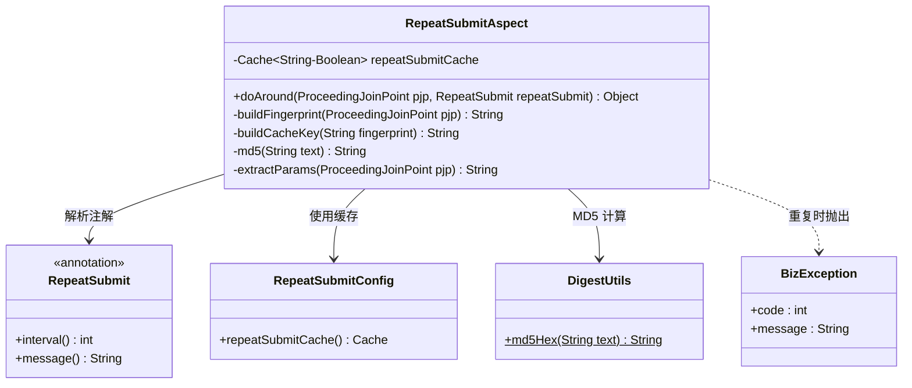
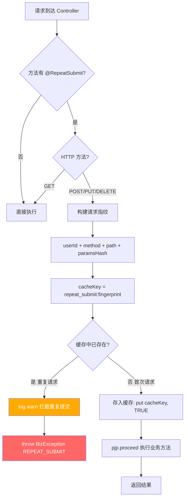
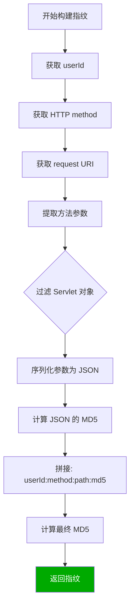
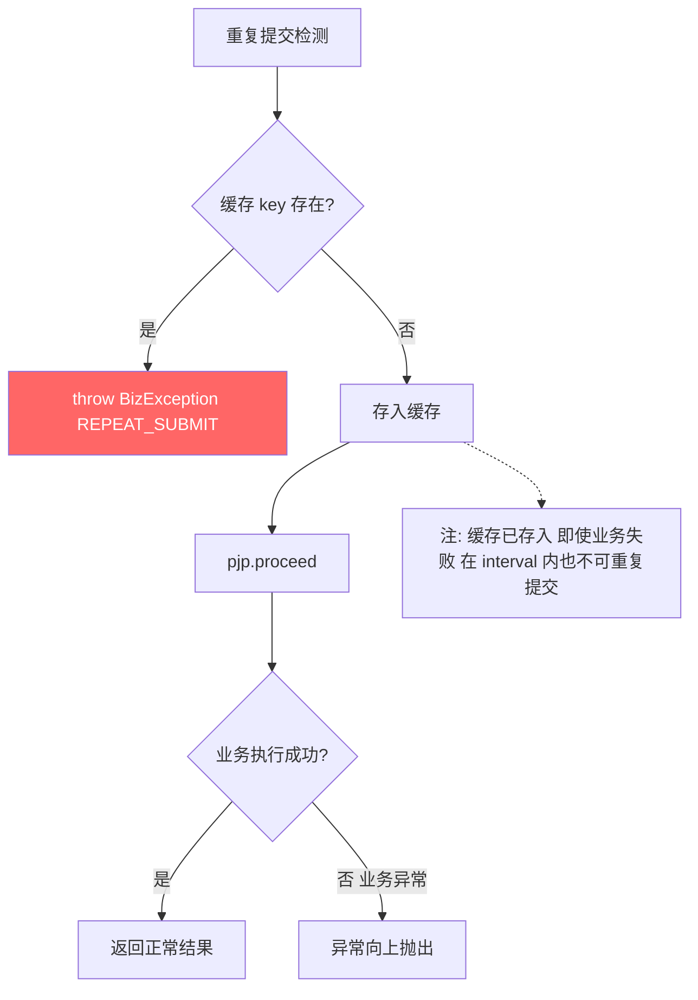
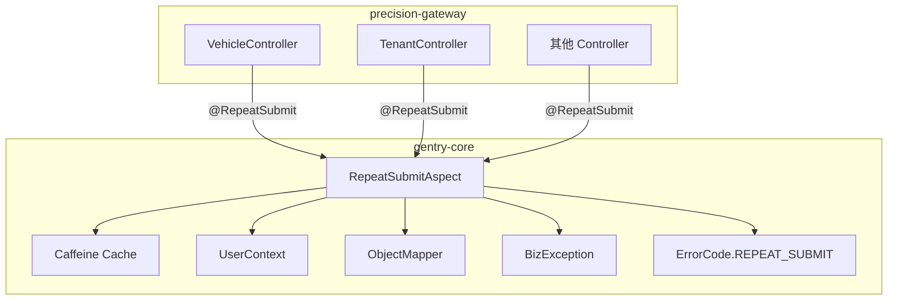

# 重复提交防护 详细设计

> **实现状态：✅ 已实现** — 代码位于 `gentry-core/src/main/java/com/gentry/core/web/`，覆盖 8 个单元测试 + 端到端验证。

## 文档信息

| 项目 | 内容 |
|------|------|
| 模块名称 | 重复提交防护 |
| 模块标识 | repeat-submit |
| 所属系统 | gentry-core 公共基础设施 |
| 文档版本 | v1.0.0 |
| 设计负责人 | 后端开发（AI辅助） |
| 最后更新时间 | 2026-04-12 |
| 优先级 | P2（重要） |

适用对象：
- 后端开发
- 测试人员
- AI 编程

---

# 一、设计概述

## 1.1 功能定位

重复提交防护通过 AOP 切面拦截标注了 `@RepeatSubmit` 注解的 Controller 方法，基于请求指纹（用户ID + 请求路径 + 请求体 MD5）在指定时间窗口内检测重复请求并拒绝。

核心职责：

1. **注解驱动**：在需要防重的 Controller 方法上添加 `@RepeatSubmit` 注解即可启用
2. **请求指纹**：基于 userId + method + path + params(MD5) 构建唯一标识
3. **时间窗口**：在配置的时间间隔内，相同请求指纹的请求被视为重复
4. **优雅拒绝**：重复请求抛出 `BizException`，由全局异常处理器返回友好提示

## 1.2 设计约束

- **单机方案**：使用 Caffeine 本地缓存存储请求指纹，满足单机部署需求
- **仅限写操作**：仅对 POST/PUT/DELETE 方法生效，GET 请求不防重
- **粒度控制**：支持方法级别自定义间隔时间和提示信息
- **幂等性补充**：防重复提交是第一道防线，关键业务仍需数据库唯一约束兜底

## 1.3 与数据库唯一约束的区别

| 维度 | 重复提交防护 | 数据库唯一约束 |
|------|------------|---------------|
| 层级 | 应用层 | 数据库层 |
| 时效 | 时间窗口内有效 | 永久有效 |
| 粒度 | 请求级别 | 数据级别 |
| 适用 | 防止连续点击 | 防止数据重复 |
| 位置 | Controller 切面 | Service/Mapper 层 |

两者配合使用：防重复提交作为快速失败机制，数据库唯一约束作为最终保障。

---

# 二、类设计

## 2.1 类图



## 2.2 核心类详细设计

### 2.2.1 @RepeatSubmit 注解

**包路径**：`com.gentry.core.web.RepeatSubmit`

**注解定义**：

```java
@Target(ElementType.METHOD)
@Retention(RetentionPolicy.RUNTIME)
@Documented
public @interface RepeatSubmit {

    /**
     * 防重时间间隔（毫秒）
     * 在此时间内，相同请求被视为重复
     */
    int interval() default 3000;

    /**
     * 重复提交提示信息
     */
    String message() default "请勿重复提交";
}
```

**使用示例**：

```java
// 创建车辆 — 默认 3 秒防重
@RepeatSubmit
@PostMapping("/vehicles")
public R<VehicleVO> createVehicle(@RequestBody VehicleCreateDTO dto) { ... }

// 创建租户 — 自定义 5 秒防重
@RepeatSubmit(interval = 5000, message = "请勿重复创建租户")
@PostMapping("/tenants")
public R<TenantVO> createTenant(@RequestBody TenantCreateDTO dto) { ... }

// 删除操作 — 2 秒防重
@RepeatSubmit(interval = 2000)
@DeleteMapping("/vehicles/{id}")
public R<Void> deleteVehicle(@PathVariable Long id) { ... }
```

### 2.2.2 RepeatSubmitAspect

**包路径**：`com.gentry.core.web.RepeatSubmitAspect`

**注解**：`@Aspect` `@Component`

**字段设计**：

| 字段 | 类型 | 说明 |
|------|------|------|
| `repeatSubmitCache` | `Cache<String, Boolean>` | Caffeine 缓存，存储请求指纹 |
| `objectMapper` | `ObjectMapper` | JSON 序列化（用于计算请求体 MD5） |

**缓存初始化**：

```java
this.repeatSubmitCache = Caffeine.newBuilder()
    .maximumSize(50_000)                   // 最多 50000 个防重 key
    .expireAfterWrite(10, TimeUnit.SECONDS) // 默认最大过期时间
    .build();
```

**注意**：Caffeine 不支持 per-key TTL，`expireAfterWrite` 设置为注解 `interval` 的最大值。由于 `interval` 通常为 2-5 秒，10 秒过期时间足够覆盖。

**优化方案**：使用 Caffeine 的 `Expiry` 接口支持动态 TTL（与限流组件类似）：

```java
this.repeatSubmitCache = Caffeine.newBuilder()
    .maximumSize(50_000)
    .expireAfter(new Expiry<String, Boolean>() {
        @Override
        public long expireAfterCreate(String key, Boolean value, long currentTime) {
            // 从 key 中解析 interval，返回纳秒
            return parsedInterval * 1_000_000L; // 毫秒 → 纳秒
        }
        @Override
        public long expireAfterUpdate(String key, Boolean value, long currentTime, long currentDuration) {
            return currentDuration;
        }
        @Override
        public long expireAfterRead(String key, Boolean value, long currentTime, long currentDuration) {
            return currentDuration;
        }
    })
    .build();
```

#### `doAround(ProceedingJoinPoint pjp, RepeatSubmit repeatSubmit)`

```
1. 获取当前请求信息：
   - request = getCurrentRequest()
   - method = request.getMethod()
   - 仅对 POST/PUT/DELETE 生效，其他直接 proceed

2. 构建请求指纹：
   fingerprint = buildFingerprint(pjp)

3. 构建缓存 key：
   cacheKey = "repeat_submit:" + fingerprint

4. 检查是否已存在：
   existing = repeatSubmitCache.getIfPresent(cacheKey)
   if existing != null:
     log.warn("重复提交拦截: key={}", cacheKey)
     throw new BizException(ErrorCode.REPEAT_SUBMIT, repeatSubmit.message())

5. 首次请求，存入缓存并执行：
   repeatSubmitCache.put(cacheKey, Boolean.TRUE)
   result = pjp.proceed()

6. return result
```

**重要**：在 `pjp.proceed()` 之前存入缓存。即使业务执行失败，防重标记仍然生效，防止失败重试风暴。如果需要在业务失败时允许重试，则应在 `pjp.proceed()` 成功后才存入缓存。

**设计选择**：默认在执行前存入缓存（防止重试风暴），后续可通过注解参数扩展。

#### `buildFingerprint(ProceedingJoinPoint pjp)`

```
1. 获取请求信息：
   - request = getCurrentRequest()
   - userId = UserContext.getUserId() (可能为 null)
   - method = request.getMethod()
   - path = request.getRequestURI()

2. 提取请求参数摘要：
   paramsHash = extractParams(pjp)

3. 拼接指纹字符串：
   raw = userId + ":" + method + ":" + path + ":" + paramsHash

4. 计算 MD5：
   fingerprint = md5(raw)

5. return fingerprint
```

**指纹组成说明**：

| 组成部分 | 说明 | 示例 |
|----------|------|------|
| userId | 当前登录用户 ID，未登录为 "anonymous" | `1001` |
| method | HTTP 方法 | `POST` |
| path | 请求 URI | `/api/v1/vehicles` |
| paramsHash | 请求体/参数的 MD5 摘要 | `a1b2c3d4...` |

**为什么需要 paramsHash**：同一个用户对同一接口可能提交不同数据，只有参数完全相同时才视为重复。

#### `extractParams(ProceedingJoinPoint pjp)`

```
1. 获取方法参数：
   args = pjp.getArgs()

2. 筛选需要参与计算的参数：
   - 排除 HttpServletRequest, HttpServletResponse, Model, Principal 等 Servlet 对象
   - 保留 @RequestBody 参数、@RequestParam 参数、@PathVariable 参数

3. 序列化为 JSON：
   if args.length == 0 → return ""
   json = objectMapper.writeValueAsString(filteredArgs)

4. 计算 MD5：
   return md5(json)
```

#### `md5(String text)`

```
使用 Spring 的 DigestUtils：
return DigestUtils.md5DigestAsHex(text.getBytes(StandardCharsets.UTF_8))
```

### 2.2.3 RepeatSubmitConfig

**包路径**：`com.gentry.core.web.RepeatSubmitConfig`

**注解**：`@Configuration`

```java
@Configuration
public class RepeatSubmitConfig {
    // RepeatSubmitAspect 已通过 @Component 自动注册
    // 如需全局配置可在此添加
}
```

---

# 三、接口设计

## 3.1 对外接口

### 3.1.1 @RepeatSubmit 注解参数

| 参数 | 类型 | 默认值 | 说明 |
|------|------|--------|------|
| `interval` | int | `3000` | 防重时间间隔（毫秒） |
| `message` | String | `"请勿重复提交"` | 重复提交提示信息 |

### 3.1.2 重复提交响应格式

```json
{
  "code": 40002,
  "message": "请勿重复提交",
  "data": null,
  "timestamp": 1712908800000,
  "traceId": "a1b2c3d4"
}
```

在 ErrorCode 枚举中新增：

```java
REPEAT_SUBMIT(40002, "请勿重复提交"),
```

## 3.2 内部接口

| 接口 | 提供方 | 消费方 | 说明 |
|------|--------|--------|------|
| `UserContext.getUserId()` | UserContext | RepeatSubmitAspect | 构建请求指纹 |
| `ObjectMapper` | JacksonConfig | RepeatSubmitAspect | 序列化请求参数 |
| `BizException` | 异常模块 | RepeatSubmitAspect | 重复时抛出 |
| `ErrorCode.REPEAT_SUBMIT` | ErrorCode | RepeatSubmitAspect | 错误码（需新增） |

---

# 四、流程设计

## 4.1 核心流程图



## 4.2 请求指纹构建流程



## 4.3 异常处理流程



---

# 五、数据设计

## 5.1 配置项

| 配置项 | 键 | 默认值 | 说明 |
|--------|-----|--------|------|
| 缓存最大容量 | `precision.repeat-submit.cache-max-size` | `50000` | 最大防重 key 数量 |
| 默认间隔时间 | `precision.repeat-submit.default-interval` | `3000` | 默认防重间隔（毫秒） |
| 全局开关 | `precision.repeat-submit.enabled` | `true` | 是否启用防重功能 |

## 5.2 缓存设计

### 5.2.1 防重缓存

**缓存结构**：

```
Key:   "repeat_submit:{fingerprint(MD5)}"
Value: Boolean.TRUE
TTL:   由注解 interval 决定（动态过期）
```

**缓存策略**：

| 策略 | 值 | 说明 |
|------|-----|------|
| 过期策略 | Variable Expiry | 根据注解 interval 动态过期 |
| 驱逐策略 | Size | 最大 50000 个 key |
| Value 类型 | Boolean.TRUE | 仅做存在性判断，值无意义 |

### 5.2.2 内存估算

```
单个 key-value 占用：
  key: ~60 bytes (MD5 哈希)
  value: Boolean.TRUE → 无额外开销
  Caffeine 节点: ~200 bytes
  总计: ~260 bytes

50000 个 key: ~13 MB
```

### 5.2.3 缓存失效

- **自动失效**：Caffeine 的 Expiry 策略根据注解 `interval` 自动过期
- **手动失效**：无需手动管理，过期自动清理
- **内存回收**：Caffeine 基于 Window TinyLFU 算法自动驱逐冷数据

## 5.3 数据库查询

本组件不涉及数据库查询。

---

# 六、依赖关系

## 6.1 Maven 依赖

```xml
<!-- Spring AOP -->
<dependency>
    <groupId>org.springframework.boot</groupId>
    <artifactId>spring-boot-starter-aop</artifactId>
</dependency>

<!-- Caffeine 缓存 -->
<dependency>
    <groupId>com.github.ben-manes.caffeine</groupId>
    <artifactId>caffeine</artifactId>
</dependency>
```

## 6.2 内部依赖



| 依赖组件 | 版本 | 说明 |
|----------|------|------|
| `UserContext` | 已实现 | 获取当前用户 ID |
| `ObjectMapper` | JacksonConfig 提供 | 序列化请求参数 |
| `BizException` | 已实现 | 重复时抛出 |
| `ErrorCode` | 已实现 | 需新增 `REPEAT_SUBMIT(40002, "...")` |
| Caffeine | 3.1+ | 防重缓存 |

## 6.3 被依赖关系

| 消费方 | 使用方式 |
|--------|---------|
| 创建类接口 | `@RepeatSubmit` 防止重复创建 |
| 更新类接口 | `@RepeatSubmit` 防止重复更新 |
| 删除类接口 | `@RepeatSubmit` 防止重复删除 |
| 表单提交接口 | `@RepeatSubmit` 防止连续点击 |

---

# 七、测试设计

## 7.1 单元测试用例

### 7.1.1 RepeatSubmitAspect 测试

**测试类**：`com.gentry.core.web.RepeatSubmitAspectTest`

| 编号 | 测试方法 | 场景 | 预期结果 |
|------|---------|------|----------|
| UT-001 | `doAround_首次请求_正常执行` | 首次 POST 请求 | 正常返回结果，缓存写入 |
| UT-002 | `doAround_3秒内重复请求_抛异常` | 间隔 1 秒重复提交 | 抛出 `BizException`，code=40002 |
| UT-003 | `doAround_3秒后重复请求_正常执行` | 间隔 4 秒后再次提交 | 正常执行（缓存已过期） |
| UT-004 | `doAround_GET请求_不拦截` | GET 请求连续两次 | 均正常返回 |
| UT-005 | `doAround_不同用户独立计数` | 用户 A 提交后用户 B 提交相同数据 | 用户 B 正常执行 |
| UT-006 | `doAround_不同路径不互相影响` | 同用户 POST /a 后 POST /b | 均正常执行 |
| UT-007 | `doAround_不同参数不互相影响` | 同用户同路径，参数不同 | 均正常执行 |
| UT-008 | `doAround_相同参数视为重复` | 同用户同路径同参数 | 第二次抛异常 |
| UT-009 | `doAround_自定义消息` | message="请勿重复创建" | 异常消息为 "请勿重复创建" |
| UT-010 | `doAround_未登录用户` | userId=null | 使用 "anonymous" 构建指纹 |

### 7.1.2 指纹构建测试

**测试类**：`com.gentry.core.web.RepeatSubmitAspectTest`（续）

| 编号 | 测试方法 | 场景 | 预期结果 |
|------|---------|------|----------|
| UT-011 | `buildFingerprint_含RequestBody` | POST 请求含 JSON body | 指纹包含 body 的 MD5 |
| UT-012 | `buildFingerprint_无参数` | DELETE /vehicles/{id} | 指纹含路径变量 |
| UT-013 | `buildFingerprint_排除Servlet对象` | 参数含 HttpServletRequest | 指纹不包含 Servlet 对象 |
| UT-014 | `md5_一致性` | 相同输入多次计算 | MD5 值一致 |
| UT-015 | `md5_不同输入` | 不同输入 | MD5 值不同 |

## 7.2 集成测试场景

**测试类**：`com.gentry.core.web.RepeatSubmitIntegrationTest`

| 编号 | 测试场景 | 操作步骤 | 验证点 |
|------|---------|---------|--------|
| IT-001 | 创建接口防重 | 连续两次 POST /api/v1/vehicles | 第二次返回 40002 错误码 |
| IT-002 | 等待间隔后正常 | 第一次提交后等待 interval 毫秒再提交 | 正常创建 |
| IT-003 | 不同用户互不影响 | 用户 A 提交后用户 B 提交相同数据 | 用户 B 正常创建 |
| IT-004 | 数据库唯一约束兜底 | 防重过期后提交重复车牌号 | 数据库唯一约束报错 |
| IT-005 | 并发提交 | 两个线程同时提交相同请求 | 仅一个成功，一个被拦截 |
| IT-006 | 全局开关关闭 | enabled=false | 所有请求不受防重 |

---

# 八、变更记录

| 版本 | 日期 | 修改人 | 变更描述 |
|------|------|--------|---------|
| v1.0.0 | 2026-04-12 | 后端开发（AI辅助） | 初始版本 |
