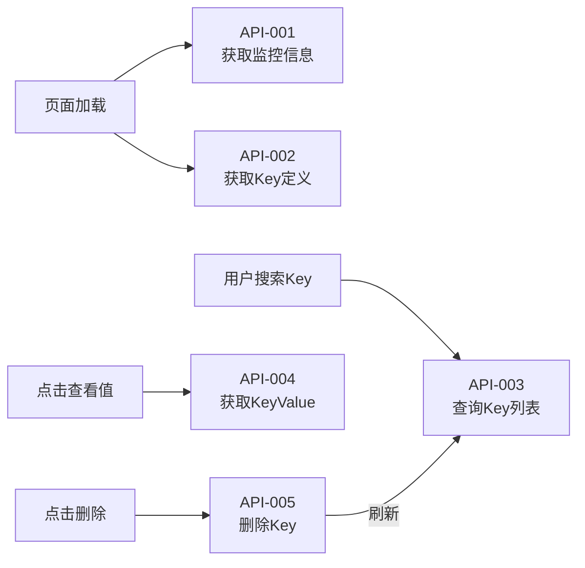
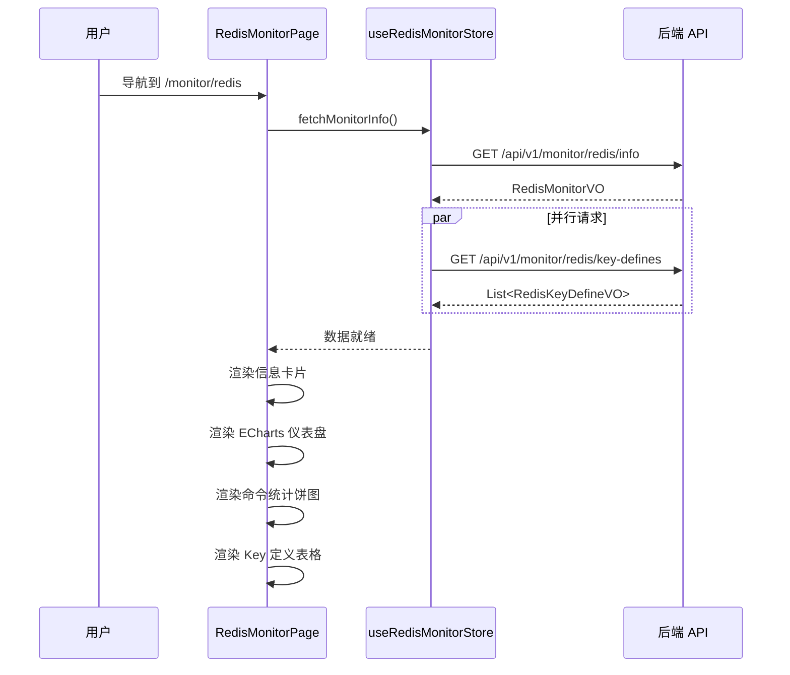
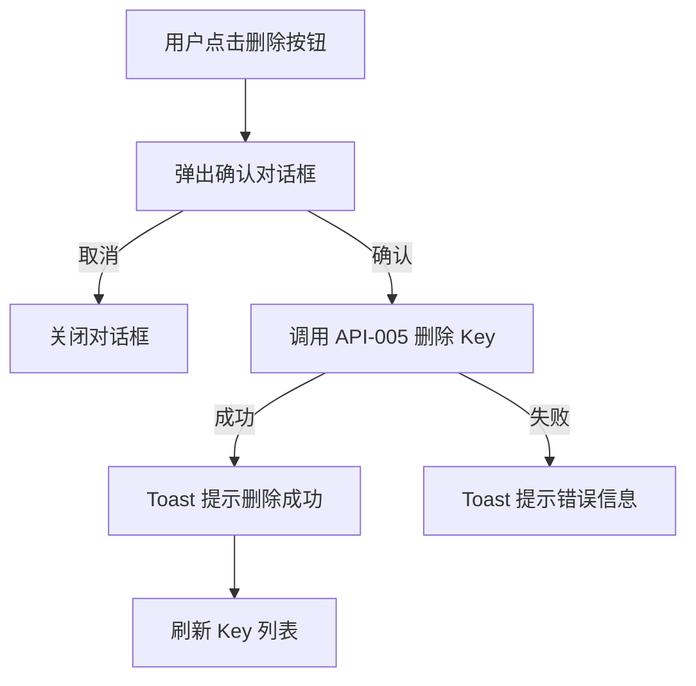
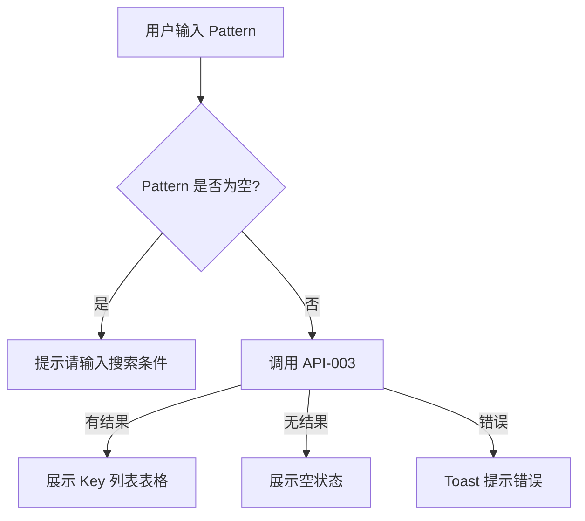
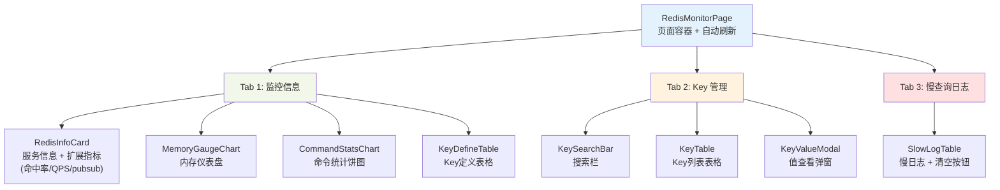

# 前端详细设计文档

## 文档信息

| 项目 | 内容 |
|------|------|
| 文档名称 | Redis 监控前端详细设计文档 |
| 对应后端模块 | 监控模块 — Redis 监控 |
| 参考文档 | `doc/design/modules/monitor/modules/Redis监控/后端详细设计.md` |
| 版本 | v1.1.0 |
| 创建日期 | 2026-05-05 |
| 最后更新 | 2026-05-05 |
| 负责人 | 前端开发（AI辅助） |

> **⚠️ 部分内容已过期（2026-09-01）**：本仓库已拿掉多租户机制，本文中「超级管理员
> `SUPER_ADMIN`」「租户管理员 `ADMIN`」两级权限描述已不适用（`SUPER_ADMIN` 已并入
> `ADMIN`，`ADMIN` 现为唯一角色并持有全部 Redis 监控权限，包括 Key 删除、慢日志清空）。
> Redis 监控页面本身的交互设计仍然有效。
> 原因见 `doc/design/modules/core/去多租户化-概要设计.md`。

**版本历史：**
- v1.0.0（2026-05-05）：初版（监控信息 Tab + Key 管理 Tab）
- v1.1.0（2026-05-05）：新增扩展指标展示、自动刷新开关、慢查询日志 Tab

------

# 一、模块概述

## 1.1 模块功能描述

Redis 监控页面为系统管理员提供 Redis 实例的实时运行状态可视化展示，包括：
- 服务基础信息（版本、运行时长、连接数等）
- 内存使用情况（仪表盘图表）
- 命令执行统计（饼图展示各命令占比）
- Key 定义信息表格
- Key 管理功能（搜索、查看值、删除）

## 1.2 模块边界与职责

| 职责 | 说明 |
|------|------|
| 本模块负责 | Redis 监控数据的展示与交互、Key 管理 CRUD |
| 不负责 | Redis 配置修改、历史趋势分析、集群管理 |

## 1.3 用户角色与权限

| 角色 | 权限标识 | 可执行操作 |
|------|---------|-----------|
| 超级管理员（SUPER_ADMIN） | `monitor:redis:*` | 全部操作 |
| 租户管理员（ADMIN） | `monitor:redis:info` | 仅查看监控信息和 Key 列表 |
| 普通用户 | 无 | 不可访问 |

------

# 二、接口调用总览

## 2.1 接口引用说明

| 接口标识 | 接口名称 | HTTP方法 | 路径 | 主要用途 | 对应后端接口文档章节 |
|----------|----------|----------|------|----------|---------------------|
| API-001 | 获取 Redis 监控信息 | GET | `/api/v1/monitor/redis/info` | 页面加载 | §6.2 |
| API-002 | 获取 Key 定义列表 | GET | `/api/v1/monitor/redis/key-defines` | Key 定义表格 | §6.3 |
| API-003 | 查询 Key 列表 | GET | `/api/v1/monitor/redis/keys` | Key 搜索 | §6.4 |
| API-004 | 获取 Key Value | GET | `/api/v1/monitor/redis/keys/{key}/value` | 查看 Key 值 | §6.5 |
| API-005 | 删除 Key | DELETE | `/api/v1/monitor/redis/keys/{key}` | 删除 Key | §6.6 |
| API-006 | 获取慢查询日志 | GET | `/api/v1/monitor/redis/slowlog` | 慢日志列表 | §6.7 |
| API-007 | 清空慢查询日志 | DELETE | `/api/v1/monitor/redis/slowlog` | 清空慢日志 | §6.8 |

## 2.2 接口依赖关系



------

# 三、页面详细设计

## 3.1 页面清单

| 页面名称 | 路由路径 | 页面功能描述 | 关联接口列表 |
|----------|----------|--------------|--------------|
| Redis 监控主页 | `/monitor-center/redis` | Redis 运行状态监控 + Key 管理 + 慢查询日志 | API-001 ~ API-007 |

## 3.2 页面跳转关系

本模块为单页面，通过 Tab 切换三个面板："监控信息" / "Key 管理" / "慢查询日志"。

------

# 四、页面初始化流程设计

## 4.1 Redis 监控页面初始化流程

### 4.1.1 接口调用序列

1. 并行调用 API-001（获取监控信息）和 API-002（获取 Key 定义列表）
2. 等待两个请求均完成后渲染页面

### 4.1.2 初始化时序图



### 4.1.3 初始化数据流

```
API-001 Response → Store.monitorInfo → 组件消费：
  - RedisInfoCard ← info 字段
  - MemoryGauge ← info.usedMemory / info.maxMemory
  - CommandStatsChart ← commandStats
  - InfoValue: dbSize

API-002 Response → Store.keyDefines → 组件消费：
  - KeyDefineTable ← keyDefines[]
```

------

# 五、用户操作流程设计

## 5.1 操作-接口映射表

| 用户操作描述 | 触发组件 | 调用接口 | 请求参数构造 | 响应数据处理 | 异常处理 |
|--------------|----------|----------|--------------|--------------|----------|
| 刷新监控数据 | 刷新按钮 | API-001 | 无 | 更新 Store.monitorInfo | Toast 提示错误 |
| 切换到 Key 管理 | Tab 标签 | 无（切换面板） | - | - | - |
| 按 Pattern 搜索 Key | 搜索按钮 | API-003 | pattern=input, pageSize=20 | 填充 Key 表格 | Toast 提示 |
| 点击 Key 查看值 | 表格操作列 | API-004 | key=row.key | 弹窗展示 Value | Toast 提示 |
| 删除 Key | 删除按钮 | API-005 | key=row.key | 刷新 Key 列表 | Toast 提示 |
| 点击 Key 定义模板搜索 | 表格操作列 | API-003 | pattern=keyTemplate | 填充 Key 表格 | Toast 提示 |
| 切换自动刷新（v1.1） | 页面右上角 Switch | API-001（定时） | 无 | 每 30 秒重拉监控数据 | Toast 提示错误 |
| 查看慢查询日志（v1.1） | 慢查询 Tab | API-006 | limit=20 | 填充慢日志表格 | Toast 提示 |
| 清空慢查询日志（v1.1） | 清空按钮 | API-007 | 无 | 刷新慢日志列表 | 二次确认 + Toast |

## 5.2 复杂操作流程

### 5.2.1 Key 删除流程



### 5.2.2 Key 搜索流程



------

# 六、组件设计

## 6.1 组件结构图



## 6.2 组件清单

| 组件名称 | 组件类型 | 主要职责 | 直接调用接口 | 父组件 | 子组件 |
|----------|----------|----------|--------------|--------|--------|
| RedisMonitorPage | 页面 | 页面容器、Tab 切换、自动刷新开关 | API-001, API-002 | Layout | 所有子组件 |
| RedisInfoCard | UI | 基础信息 + 扩展指标（命中率/QPS/pubsub/总命令数/连接数） | 无 | Tab1 | 无 |
| MemoryGaugeChart | UI | ECharts Gauge 图表展示内存使用率 | 无 | Tab1 | 无 |
| CommandStatsChart | UI | ECharts Pie 图表展示命令调用占比 | 无 | Tab1 | 无 |
| KeyDefineTable | 业务 | 展示系统 Key 定义，支持点击搜索 | API-003（间接） | Tab1 | 无 |
| KeySearchBar | UI | Pattern 输入和搜索按钮 | 无 | Tab2 | 无 |
| KeyTable | 业务 | Key 列表展示、分页、操作按钮 | API-003, API-005 | Tab2 | 无 |
| KeyValueModal | UI | 弹窗展示 Key 的值和 TTL | API-004 | KeyTable | 无 |
| SlowLogTable | 业务 | 慢日志查询 + 清空（v1.1 新增） | API-006, API-007 | Tab3 | 无 |

## 6.3 关键组件详细设计

### 6.3.1 RedisInfoCard 组件

- **接口调用设计**：不直接调用接口，从 Store 获取 monitorInfo.info
- **Props 设计**：

| Prop | 类型 | 说明 |
|------|------|------|
| info | RedisInfoVO | Redis 服务信息 |

- **展示字段**：

| 字段 | 展示方式 | 说明 |
|------|---------|------|
| redisVersion | Tag | 版本号标签 |
| redisMode | Tag（颜色区分） | standalone=蓝, sentinel=橙, cluster=绿 |
| uptimeInSeconds | 格式化文本 | 转为 "X天X时X分" 格式 |
| connectedClients | 数字 + 图标 | 实时连接数 |
| usedMemory / maxMemory | 文本 | "1MB / 1GB" 格式 |
| totalKeys | 数字 | Key 总数 |
| expiresKeys | 数字 | 有过期时间的 Key 数 |
| aofEnabled | Badge | yes=绿, no=红 |

### 6.3.2 MemoryGaugeChart 组件

- **接口调用设计**：不直接调用接口，从 Store 获取内存数据
- **Props 设计**：

| Prop | 类型 | 说明 |
|------|------|------|
| usedMemory | number | 已用内存（bytes） |
| maxMemory | number | 最大内存（bytes） |

- **ECharts 配置**：

```typescript
const option = {
  series: [{
    type: 'gauge',
    startAngle: 200,
    endAngle: -20,
    min: 0,
    max: 100,
    detail: { formatter: '{value}%' },
    data: [{ value: usedMemoryPercent, name: '内存使用率' }],
    axisLine: {
      lineStyle: {
        width: 20,
        color: [
          [0.6, '#67C23A'],  // 绿色 <60%
          [0.8, '#E6A23C'],  // 橙色 60-80%
          [1, '#F56C6C'],    // 红色 >80%
        ]
      }
    }
  }]
};
```

### 6.3.3 CommandStatsChart 组件

- **接口调用设计**：不直接调用接口，从 Store 获取 commandStats
- **Props 设计**：

| Prop | 类型 | 说明 |
|------|------|------|
| commandStats | RedisCommandStatVO[] | 命令统计数据 |

- **ECharts 配置**：Pie 饼图，取 TOP 10 命令按 calls 排序，其余归为"其他"
- **Events 设计**：无交互事件

### 6.3.4 KeyTable 组件

- **接口调用设计**：直接调用 API-003（搜索）、API-005（删除），通过 API-004 在弹窗中查看值
- **Props 设计**：无（自管理数据）
- **Events 设计**：无向上冒泡事件
- **状态管理**：
  - `keys`: Key 列表数据
  - `loading`: 加载状态
  - `pagination`: 分页信息
  - `selectedPattern`: 当前搜索 Pattern

### 6.3.5 KeyValueModal 组件

- **接口调用设计**：打开时调用 API-004 获取 Key 值
- **Props 设计**：

| Prop | 类型 | 说明 |
|------|------|------|
| open | boolean | 弹窗是否打开 |
| keyName | string | 要查看的 Key 名称 |

- **Events 设计**：

| Event | 参数 | 说明 |
|-------|------|------|
| onClose | void | 关闭弹窗 |

- **状态管理**：
  - `valueData`: API-004 返回的 RedisKeyVO
  - `loading`: 加载状态
- **展示规则**：Value 使用 `<pre>` 标签格式化展示（如果是 JSON 则美化），超过 500 字符显示截断提示

------

# 七、数据转换设计

## 7.1 请求数据构造

### 7.1.1 数据转换规则

| 接口 | 参数 | 转换规则 |
|------|------|---------|
| API-003 | pattern | 直接透传用户输入，前端做 trim |
| API-003 | pageNum | 默认 1，翻页时递增 |
| API-003 | pageSize | 默认 20 |
| API-004 | key | encodeURIComponent 编码 |
| API-005 | key | encodeURIComponent 编码 |

### 7.1.2 转换函数设计

```typescript
// API 服务层
const redisMonitorApi = {
  getInfo: () =>
    request.get<RedisMonitorVO>('/api/v1/monitor/redis/info'),

  getKeyDefines: () =>
    request.get<RedisKeyDefineVO[]>('/api/v1/monitor/redis/key-defines'),

  scanKeys: (params: { pattern: string; pageNum: number; pageSize: number }) =>
    request.get<PageResult<RedisKeyVO>>('/api/v1/monitor/redis/keys', { params }),

  getKeyValue: (key: string) =>
    request.get<RedisKeyVO>(`/api/v1/monitor/redis/keys/${encodeURIComponent(key)}/value`),

  deleteKey: (key: string) =>
    request.delete(`/api/v1/monitor/redis/keys/${encodeURIComponent(key)}`),
};
```

## 7.2 响应数据处理

### 7.2.1 数据解析规则

| 接口 | 响应字段 | 解析规则 |
|------|---------|---------|
| API-001 | info.uptimeInSeconds | `formatUptime(seconds)` → "X天X时X分" |
| API-001 | info.usedMemory | `formatBytes(bytes)` → "1.5 MB" |
| API-001 | info.usedMemoryPercent | 直接使用，保留 2 位小数 |
| API-003 | records[].ttl | `formatTtl(ttl)` → "永不过期" / "X分X秒" / "已过期" |

### 7.2.2 数据格式化

```typescript
// 工具函数
function formatUptime(seconds: number): string {
  const days = Math.floor(seconds / 86400);
  const hours = Math.floor((seconds % 86400) / 3600);
  const minutes = Math.floor((seconds % 3600) / 60);
  if (days > 0) return `${days}天${hours}时${minutes}分`;
  if (hours > 0) return `${hours}时${minutes}分`;
  return `${minutes}分`;
}

function formatBytes(bytes: number): string {
  if (bytes < 1024) return `${bytes} B`;
  if (bytes < 1024 * 1024) return `${(bytes / 1024).toFixed(2)} KB`;
  if (bytes < 1024 * 1024 * 1024) return `${(bytes / (1024 * 1024)).toFixed(2)} MB`;
  return `${(bytes / (1024 * 1024 * 1024)).toFixed(2)} GB`;
}

function formatTtl(ttl: number): string {
  if (ttl === -1) return '永不过期';
  if (ttl === -2) return '已过期';
  if (ttl < 60) return `${ttl}秒`;
  if (ttl < 3600) return `${Math.floor(ttl / 60)}分${ttl % 60}秒`;
  return `${Math.floor(ttl / 3600)}时${Math.floor((ttl % 3600) / 60)}分`;
}
```

------

# 八、状态管理设计

## 8.1 全局状态设计

### 8.1.1 状态定义

使用 Zustand Store `useRedisMonitorStore`：

```typescript
interface RedisMonitorStore {
  // 监控信息
  monitorInfo: RedisMonitorVO | null;
  keyDefines: RedisKeyDefineVO[];
  loading: boolean;
  error: string | null;

  // Key 管理
  keyList: RedisKeyVO[];
  keyTotal: number;
  keyLoading: boolean;
  currentPattern: string;

  // Actions
  fetchMonitorInfo: () => Promise<void>;
  fetchKeyDefines: () => Promise<void>;
  searchKeys: (pattern: string, pageNum?: number, pageSize?: number) => Promise<void>;
  deleteKey: (key: string) => Promise<void>;
}
```

### 8.1.2 状态更新规则

| Action | 触发时机 | 更新的状态 |
|--------|---------|-----------|
| fetchMonitorInfo | 页面加载、手动刷新 | monitorInfo, loading, error |
| fetchKeyDefines | 页面加载（并行） | keyDefines |
| searchKeys | 用户搜索、翻页 | keyList, keyTotal, keyLoading, currentPattern |
| deleteKey | 用户确认删除 | keyList（移除已删除项）、keyTotal |

## 8.2 页面状态设计

| 状态 | 类型 | 说明 |
|------|------|------|
| activeTab | `'monitor' | 'keys'` | 当前激活的 Tab |
| refreshTimer | `NodeJS.Timeout | null` | 自动刷新定时器（可选，30s 间隔） |

## 8.3 组件状态设计

| 组件 | 状态 | 类型 | 说明 |
|------|------|------|------|
| KeySearchBar | patternInput | string | 搜索输入框值 |
| KeyTable | selectedRowKeys | string[] | 表格选中行（批量删除预留） |
| KeyValueModal | open | boolean | 弹窗可见性 |
| KeyValueModal | loading | boolean | 值加载中 |
| KeyValueModal | valueData | RedisKeyVO | Key 值数据 |

------

# 九、模块安全规范

## 9.1 认证与授权

### 9.1.1 Token管理

- Token 存储位置：localStorage
- Token 刷新策略：后端控制，前端透明
- Token 过期处理：401 响应跳转登录页

### 9.1.2 权限控制

| 页面/组件 | 权限标识 | 无权限处理 |
|-----------|---------|-----------|
| Redis 监控页面（路由级） | `monitor:redis:info` | 403 页面 |
| Key 搜索和列表 | `monitor:redis:key:list` | 隐藏 Key 管理 Tab |
| Key 值查看按钮 | `monitor:redis:key:query` | 隐藏按钮 |
| Key 删除按钮 | `monitor:redis:key:delete` | 隐藏按钮 |
| 慢查询日志 Tab（v1.1） | `monitor:redis:info` | 依然可见（与 info 同权限） |
| 清空慢日志按钮（v1.1） | `monitor:redis:slowlog:reset` | 隐藏按钮（仅 SUPER_ADMIN） |

## 9.2 敏感数据处理

本模块无敏感数据（Redis 运行时信息不属于业务敏感数据）。

## 9.3 安全检查清单

- [x] Token 安全存储（localStorage + httpOnly Cookie 配合）
- [x] 权限控制完整（路由级 + 按钮级）
- [x] Key 删除需二次确认
- [x] 无 XSS 风险（React 自动转义 + ECharts 安全配置）

------

# 十、错误处理设计

## 10.1 接口调用错误处理

### 10.1.1 错误分类与处理

| 错误类型 | HTTP状态码 | 处理策略 |
|---------|-----------|---------|
| 未认证 | 401 | 跳转登录页 |
| 权限不足 | 403 | 显示 403 提示 |
| Redis 连接失败 | 500 | 显示 Redis 连接错误占位图 + 重试按钮 |
| Key 不存在 | 404 | Toast "Key 不存在" |
| 参数校验失败 | 400 | Toast 显示具体错误信息 |
| 网络超时 | - | Toast "网络超时，请稍后重试" |

### 10.1.2 重试机制

- 监控信息（API-001）：支持手动刷新按钮，可选自动刷新（30s）
- Key 搜索（API-003）：无自动重试，用户手动重新搜索
- Key 删除（API-005）：失败后 Toast 提示，用户可手动重试

## 10.2 用户操作错误处理

| 操作 | 错误场景 | 处理方式 |
|------|---------|---------|
| 搜索 Key | Pattern 为空 | 禁用搜索按钮，提示"请输入搜索条件" |
| 搜索 Key | Pattern 为 `*` | 允许但弹出警告："全量扫描可能影响性能，最多返回 100 条" |
| 删除 Key | 用户未确认 | 弹窗二次确认，显示 Key 名称 |
| 查看 Value | Value 为空 | 弹窗显示"（空值）" |

------

# 十一、页面布局设计

## 11.1 页面整体布局

```
┌──────────────────────────────────────────────────────────────────┐
│  页面标题：Redis 监控                          [自动刷新] [刷新]  │
├──────────────────────────────────────────────────────────────────┤
│  [监控信息]  [Key 管理]                         ← Tab 标签切换    │
├──────────────────────────────────────────────────────────────────┤
│                                                                  │
│  === Tab 1: 监控信息 ===                                         │
│                                                                  │
│  ┌─────────────────────┐  ┌─────────────────────┐               │
│  │  Redis 版本: 7.2.4  │  │  运行模式: standalone │               │
│  │  运行时长: 10天5时   │  │  连接数: 12          │               │
│  │  Key 总数: 1523     │  │  过期Key: 800        │               │
│  └─────────────────────┘  └─────────────────────┘               │
│                                                                  │
│  ┌─────────────────────┐  ┌─────────────────────┐               │
│  │                     │  │                     │               │
│  │   ECharts Gauge     │  │   ECharts Pie       │               │
│  │   内存使用率         │  │   命令统计           │               │
│  │   45.2%             │  │   GET 65%           │               │
│  │                     │  │   SET 20%           │               │
│  └─────────────────────┘  └─────────────────────┘               │
│                                                                  │
│  ┌──────────────────────────────────────────────┐               │
│  │  Key 定义信息表格                              │               │
│  │  Key模板              │ 用途         │ TTL    │ 操作  │       │
│  │  satoken:login:token:* │ Token映射    │ 1800s  │ [搜索]│       │
│  │  blacklist:*          │ JWT黑名单    │ 动态   │ [搜索]│       │
│  └──────────────────────────────────────────────┘               │
│                                                                  │
│  === Tab 2: Key 管理 ===                                         │
│                                                                  │
│  ┌──────────────────────────────────────────────┐               │
│  │ 搜索: [blacklist:*____________] [搜索]        │               │
│  └──────────────────────────────────────────────┘               │
│                                                                  │
│  ┌──────────────────────────────────────────────┐               │
│  │ Key 列表                                      │               │
│  │ Key名称      │ 类型    │ TTL    │ 操作        │               │
│  │ blacklist:ey │ string  │ 1500s  │ [查看][删除]│               │
│  │ blacklist:ey │ string  │ 800s   │ [查看][删除]│               │
│  └──────────────────────────────────────────────┘               │
│  [< 上一页]  第 1/3 页  [下一页 >]                               │
│                                                                  │
└──────────────────────────────────────────────────────────────────┘
```

## 11.2 组件尺寸规范

| 组件 | 宽度 | 说明 |
|------|------|------|
| 信息卡片（InfoCard） | `span={12}`（50%） | Ant Design Grid 栅格 |
| 内存仪表盘（Gauge） | `span={12}`（50%） | 高度 300px |
| 命令统计饼图（Pie） | `span={12}`（50%） | 高度 300px |
| Key 定义表格 | `span={24}`（100%） | 最大高度 400px |
| Key 搜索栏 | `span={24}`（100%） | 输入框 + 按钮 |
| Key 列表表格 | `span={24}`（100%） | 标准表格 + 分页 |
| 值查看弹窗 | 固定宽度 640px | 最大高度 480px |
