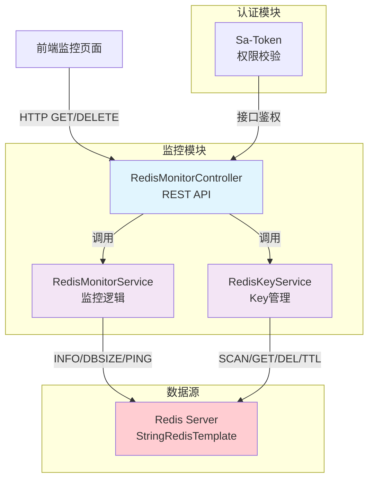
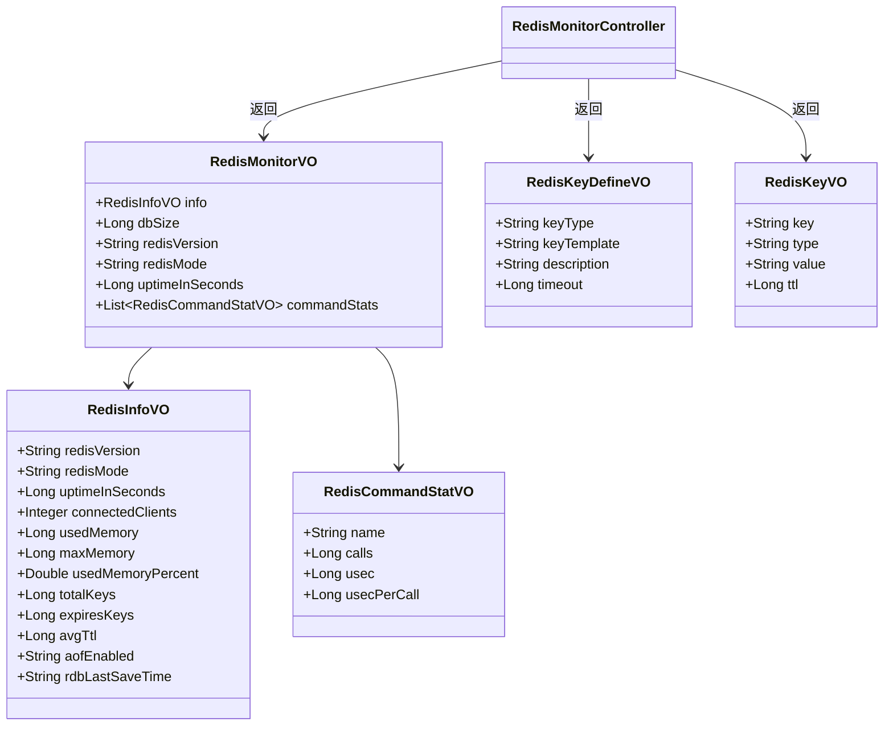
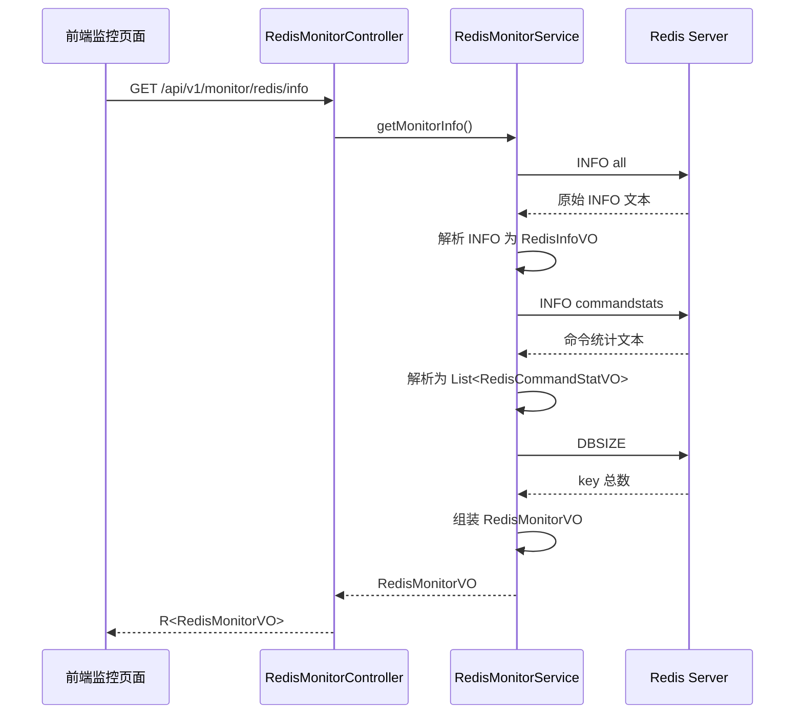
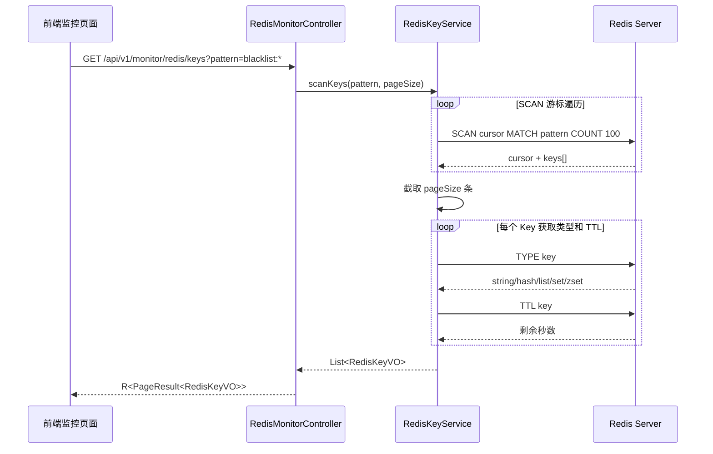
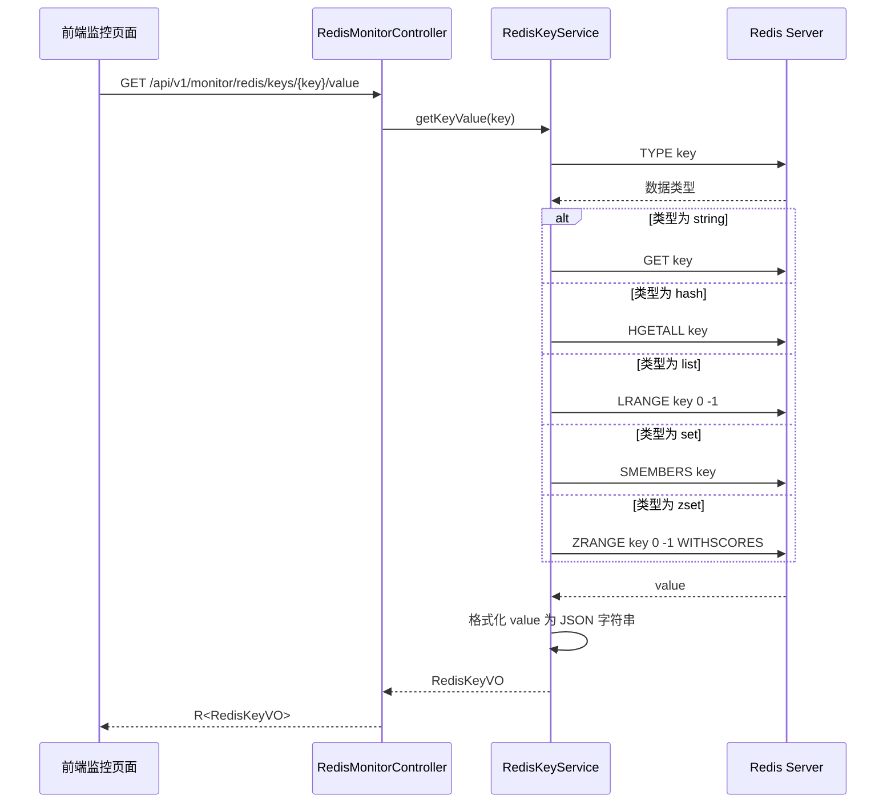
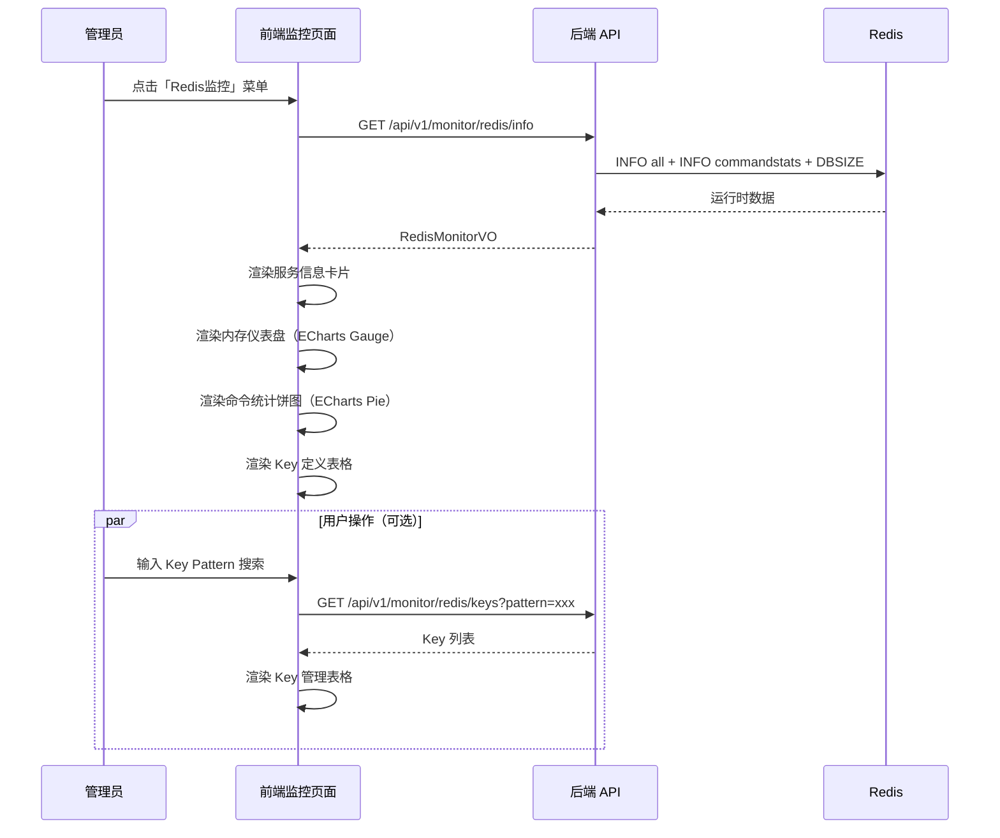

# 程序详细设计文档

> **定位**
> - 数据库驱动设计
> - 分层思想
> - 前后端无代码协同
> - AI 分阶段稳定交付

------

## 文档信息

| 项目 | 内容 |
|------|------|
| 模块名称 | Redis 监控 |
| 模块标识 | monitor-redis |
| 所属系统 | 监控模块 |
| 文档版本 | v1.1.0 |
| 设计负责人 | 后端开发（AI辅助） |
| 最后更新时间 | 2026-05-05 |

**版本历史：**
- v1.0.0（2026-05-05）：初版，监控信息 + Key 管理
- v1.1.0（2026-05-05）：扩展 INFO 指标（命中率/QPS/pubsub/总命令数），新增慢查询日志查询与清空

适用对象：
- 后端开发
- 前端开发
- 测试人员
- AI 编程

------

# 一、数据库设计

> ⚠️ 本模块不创建业务表。Redis 监控数据全部来自 `Redis INFO` 命令和 `SCAN` 遍历，无需持久化。

## 1.1 表清单与业务职责

无业务表。Redis 监控是纯读操作，数据源为 Redis Server 运行时信息。

------

# 二、模块目标与边界

**模块解决的业务问题：**
为运维和管理员提供 Redis 实例的实时运行状态监控，包括：服务信息、内存使用、连接数、命令统计、Key 管理等。方便排查性能瓶颈和 Key 泄漏。

**模块不解决的问题：**
- 不做 Redis 集群管理（Sentinel/Cluster 拓扑）
- 不做历史数据趋势分析（后续可接入 Prometheus + Grafana）
- 不做 Redis 配置修改（只读监控）
- 不做慢查询日志分析

**是否核心链路：** 否（运维辅助功能）

------

## 2.1 模块边界图



**关键点：**

- 所有接口受 Sa-Token 保护，仅 ADMIN 角色可访问
- 只使用 `StringRedisTemplate`，不引入额外 Redis 客户端
- INFO 命令返回值在 Service 层解析为结构化 VO

------

# 三、整体架构设计

> ⚠️ 明确声明：**本项目不采用 DDD**

------

## 3.1 分层结构定义

```
com.gentry.monitor.redis/
├── controller/
│   └── RedisMonitorController.java    # REST 控制器
├── service/
│   ├── RedisMonitorService.java       # 监控服务接口
│   ├── RedisKeyService.java           # Key管理服务接口
│   └── impl/
│       ├── RedisMonitorServiceImpl.java
│       └── RedisKeyServiceImpl.java
├── vo/
│   ├── RedisMonitorVO.java            # 监控信息响应
│   ├── RedisInfoVO.java               # INFO 解析结果（含扩展指标）
│   ├── RedisCommandStatVO.java        # 命令统计
│   ├── RedisSlowLogVO.java            # 慢查询日志条目（v1.1）
│   ├── RedisKeyDefineVO.java          # Key定义信息
│   └── RedisKeyVO.java                # Key值信息
└── constant/
    └── RedisKeyDefines.java           # 预定义 Key 模板清单
```

### 命名规范

| 数据库（Redis Key） | VO 类名 | Service 接口名 | Controller 类名 |
|-------|------|-----------|-----------|
| INFO 命令响应 | RedisMonitorVO | RedisMonitorService | RedisMonitorController |
| Key 扫描结果 | RedisKeyVO | RedisKeyService | （同上 Controller） |

------

## 3.2 层级职责与禁止事项

| 层 | 允许做 | 禁止做 |
|---|---|---|
| Controller | 参数校验、请求响应处理 | 写业务逻辑、直接操作 Redis |
| Service | 监控数据解析、Key 管理逻辑 | 处理 HTTP 请求 |
| VO | 数据结构定义、格式化注解 | 业务逻辑 |

------

# 四、业务模型与数据映射

> 本模块无数据库表。业务模型为 Redis 运行时信息的 Java 映射。

## 4.1 核心业务模型



## 4.2 Redis Key 定义信息

本模块需要维护一份 **应用级 Key 定义清单**，用于告诉前端本系统使用了哪些 Redis Key 模式：

| Key 模式 | 类型 | 用途 | TTL | 管理方 |
|----------|------|------|-----|--------|
| `Authorization:login:token:{tokenValue}` | String | Token → LoginId 映射 | 30min（可配置） | Sa-Token 自动 |
| `Authorization:login:session:{loginId}` | Hash | 用户 Session | 30min（可配置） | Sa-Token 自动 |
| `blacklist:{tokenValue}` | String | JWT 黑名单 | Token 剩余有效期 | TokenBlacklistService |
| `Authorization:timeout:{tokenValue}` | String | Token 过期时间辅助 | 与 Token 同步 | Sa-Token 自动 |

> 注：Key 前缀来源于 `sa-token.token-name` 配置（当前 `Authorization`），修改配置时需同步更新 `RedisKeyDefines`。

------

# 五、行为流程与用例设计

## 5.1 主流程（时序图）

### 5.1.1 获取 Redis 监控信息



### 5.1.2 Key 列表查询（SCAN）



### 5.1.3 获取 Key Value



## 5.2 关键业务规则说明

- **前置条件**：Redis 连接正常（`StringRedisTemplate` 可用）
- **核心校验**：
  - Key 查询时 pattern 不允许为空，防止全量扫描
  - Key 删除需二次确认（前端弹窗）
  - 只读操作，不修改 Redis 配置
- **失败路径**：
  - Redis 连接失败 → 全局异常处理返回 500 + 错误信息
  - Key 不存在 → 返回 404
  - 权限不足 → 返回 403

------

# 六、接口设计（前后端核心契约）

> **目标：无代码即可协同开发**

------

## 6.1 接口清单

| 接口编码 | 接口名称 | HTTP方法 | URL | 认证 | 授权 |
|---------|---------|----------|-----|------|------|
| API-001 | 获取 Redis 监控信息 | GET | `/api/v1/monitor/redis/info` | 是 | `monitor:redis:info` |
| API-002 | 获取 Key 定义列表 | GET | `/api/v1/monitor/redis/key-defines` | 是 | `monitor:redis:info` |
| API-003 | 查询 Key 列表 | GET | `/api/v1/monitor/redis/keys` | 是 | `monitor:redis:key:list` |
| API-004 | 获取 Key Value | GET | `/api/v1/monitor/redis/keys/{key}/value` | 是 | `monitor:redis:key:query` |
| API-005 | 删除 Key | DELETE | `/api/v1/monitor/redis/keys/{key}` | 是 | `monitor:redis:key:delete` |
| API-006 | 获取慢查询日志 | GET | `/api/v1/monitor/redis/slowlog` | 是 | `monitor:redis:info` |
| API-007 | 清空慢查询日志 | DELETE | `/api/v1/monitor/redis/slowlog` | 是 | `monitor:redis:slowlog:reset` |

------

## 6.2 API-001：获取 Redis 监控信息

### 入参设计

无请求参数。

### 出参设计

**类名：** `RedisMonitorVO`
**包路径：** `com.gentry.monitor.redis.vo`

| 字段 | 类型 | 描述 |
|------|------|------|
| info | RedisInfoVO | Redis 服务信息 |
| dbSize | Long | Key 总数 |
| commandStats | List\<RedisCommandStatVO\> | 命令统计列表 |

**RedisInfoVO：**

| 字段 | 类型 | 描述 |
|------|------|------|
| redisVersion | String | Redis 版本 |
| redisMode | String | 运行模式（standalone/sentinel/cluster） |
| uptimeInSeconds | Long | 运行时长（秒） |
| connectedClients | Integer | 当前连接数 |
| usedMemory | Long | 已用内存（bytes） |
| maxMemory | Long | 最大内存（bytes），0 表示无限制 |
| usedMemoryPercent | Double | 内存使用率（%） |
| totalKeys | Long | 当前 DB Key 总数 |
| expiresKeys | Long | 设有过期时间的 Key 数量 |
| avgTtl | Long | 平均 TTL（毫秒） |
| aofEnabled | String | AOF 是否开启（"0"/"1"） |
| rdbLastSaveTime | String | RDB 最后保存时间（Unix 时间戳字符串） |
| totalCommandsProcessed | Long | 自启动以来的总命令数（v1.1 新增） |
| totalConnectionsReceived | Long | 自启动以来的总连接数（v1.1 新增） |
| instantaneousOpsPerSec | Long | 瞬时 QPS（v1.1 新增） |
| keyspaceHits | Long | 累计命中次数（v1.1 新增） |
| keyspaceMisses | Long | 累计未命中次数（v1.1 新增） |
| hitRate | Double | 命中率（%，精度两位小数，v1.1 新增） |
| pubsubChannels | Integer | 订阅频道数（v1.1 新增） |
| pubsubPatterns | Integer | 订阅模式数（v1.1 新增） |

**RedisCommandStatVO：**

| 字段 | 类型 | 描述 |
|------|------|------|
| name | String | 命令名称（如 GET、SET） |
| calls | Long | 调用次数 |
| usec | Long | 总耗时（微秒） |
| usecPerCall | Long | 平均每次耗时（微秒） |

**响应示例：**

```json
{
  "code": 0,
  "message": "success",
  "data": {
    "info": {
      "redisVersion": "7.2.4",
      "redisMode": "standalone",
      "uptimeInSeconds": 86400,
      "connectedClients": 12,
      "usedMemory": 1048576,
      "maxMemory": 1073741824,
      "usedMemoryPercent": 0.1,
      "totalKeys": 1523,
      "expiresKeys": 800,
      "avgTtl": 1200000,
      "aofEnabled": "yes",
      "rdbLastSaveTime": "2026-05-05 10:00:00"
    },
    "dbSize": 1523,
    "commandStats": [
      { "name": "GET", "calls": 50000, "usec": 120000, "usecPerCall": 2 },
      { "name": "SET", "calls": 30000, "usec": 90000, "usecPerCall": 3 }
    ]
  }
}
```

------

## 6.3 API-002：获取 Key 定义列表

### 入参设计

无请求参数。

### 出参设计

**类名：** `List<RedisKeyDefineVO>`

| 字段 | 类型 | 描述 |
|------|------|------|
| keyType | String | Key 类型标识 |
| keyTemplate | String | Key 模板（如 `blacklist:*`） |
| description | String | 用途说明 |
| timeout | Long | TTL（秒），-1 表示永不过期 |

**响应示例：**

```json
{
  "code": 0,
  "message": "success",
  "data": [
    { "keyType": "token_mapping", "keyTemplate": "satoken:login:token:*", "description": "Token → LoginId 映射", "timeout": 1800 },
    { "keyType": "user_session", "keyTemplate": "satoken:login:session:*", "description": "用户 Session", "timeout": 1800 },
    { "keyType": "jwt_blacklist", "keyTemplate": "blacklist:*", "description": "JWT 黑名单", "timeout": -2 },
    { "keyType": "token_timeout", "keyTemplate": "satoken:timeout:*", "description": "Token 过期时间", "timeout": 1800 }
  ]
}
```

------

## 6.4 API-003：查询 Key 列表

### 入参设计

| 参数 | 类型 | 必填 | 描述 | 校验规则 |
|------|------|------|------|---------|
| pattern | String | 是 | Key 匹配模式 | 不为空，长度 ≤ 200 |
| pageNum | Integer | 否 | 页码 | 默认 1，≥ 1 |
| pageSize | Integer | 否 | 每页条数 | 默认 20，范围 1-100 |

**请求示例：**

```
GET /api/v1/monitor/redis/keys?pattern=blacklist:*&pageNum=1&pageSize=20
```

### 出参设计

**类名：** `PageResult<RedisKeyVO>`

| 字段 | 类型 | 描述 |
|------|------|------|
| key | String | 完整 Key 名称 |
| type | String | 数据类型（string/hash/list/set/zset） |
| ttl | Long | 剩余 TTL（秒），-1=永不过期，-2=已过期 |

**响应示例：**

```json
{
  "code": 0,
  "message": "success",
  "data": {
    "records": [
      { "key": "blacklist:eyJhbGciOiJIUzI1NiJ9...", "type": "string", "ttl": 1500 },
      { "key": "blacklist:eyJhbGciOiJIUzI1NiJ9...", "type": "string", "ttl": 800 }
    ],
    "total": 45,
    "pageNum": 1,
    "pageSize": 20
  }
}
```

------

## 6.5 API-004：获取 Key Value

### 入参设计

| 参数 | 类型 | 必填 | 描述 | 校验规则 |
|------|------|------|------|---------|
| key | String（路径参数） | 是 | Redis Key | URL 编码 |

### 出参设计

**类名：** `RedisKeyVO`

| 字段 | 类型 | 描述 |
|------|------|------|
| key | String | 完整 Key 名称 |
| type | String | 数据类型 |
| value | String | 值（JSON 格式化字符串，限前 500 字符） |
| ttl | Long | 剩余 TTL（秒） |

------

## 6.6 API-005：删除 Key

### 入参设计

| 参数 | 类型 | 必填 | 描述 | 校验规则 |
|------|------|------|------|---------|
| key | String（路径参数） | 是 | Redis Key | URL 编码 |

### 出参设计

无 data，仅返回操作结果。

```json
{
  "code": 0,
  "message": "success"
}
```

------

## 6.7 API-006：获取慢查询日志（v1.1 新增）

### 入参设计

| 参数 | 类型 | 必填 | 描述 | 校验规则 |
|------|------|------|------|---------|
| limit | Integer | 否 | 返回条数 | 默认 20，范围 1-200 |

### 出参设计

**类名：** `List<RedisSlowLogVO>`
**包路径：** `com.gentry.monitor.redis.vo`

| 字段 | 类型 | 描述 |
|------|------|------|
| id | Long | 慢日志唯一 ID（递增） |
| timestamp | Long | 发生 Unix 时间戳（秒） |
| durationMicros | Long | 执行耗时（微秒） |
| args | List\<String\> | 命令片段（Lettuce 会对过长参数截断） |
| clientAddress | String | 客户端地址（Redis 4.0+） |
| clientName | String | 客户端名称（CLIENT SETNAME 设置） |

**响应示例：**

```json
{
  "code": 0,
  "message": "success",
  "data": [
    {
      "id": 382,
      "timestamp": 1777970622,
      "durationMicros": 12,
      "args": ["KEYS", "*"],
      "clientAddress": "127.0.0.1:65345",
      "clientName": null
    }
  ]
}
```

**说明：**
- 慢日志阈值由 Redis 自身控制：`CONFIG SET slowlog-log-slower-than <us>`
- 接口仅读取已有 slowlog，不修改阈值
- 结果按 `durationMicros` 降序排列

------

## 6.8 API-007：清空慢查询日志（v1.1 新增）

### 入参设计

无请求参数。

### 出参设计

无 data，仅返回操作结果。

```json
{ "code": 0, "message": "success" }
```

**说明：**
- 执行 Redis `SLOWLOG RESET`，清空整个 Redis 实例的慢日志历史
- 该操作不可恢复，仅 `monitor:redis:slowlog:reset` 权限（默认仅 SUPER_ADMIN）可调用
- 前端需二次确认

------

## 6.9 接口治理要求

| 接口 | 全局防抖 | 接口级防抖 | 幂等 | 幂等依据 | 日志级别 |
|------|---------|-----------|------|---------|---------|
| API-001 | 否 | 否（实时数据） | 是 | 只读 | INFO |
| API-002 | 否 | 否 | 是 | 只读 | DEBUG |
| API-003 | 是 | 是（3s） | 是 | 只读 | INFO |
| API-004 | 是 | 是（3s） | 是 | 只读 | INFO |
| API-005 | 是 | 是（5s） | 是 | DELETE 天然幂等 | WARN |
| API-006 | 否 | 否 | 是 | 只读 | INFO |
| API-007 | 是 | 是（5s） | 是 | RESET 天然幂等 | WARN |

------

# 七、模块安全规范

## 7.1 认证与授权要求

本模块是否需要认证：**是**
认证方式：**Sa-Token（JWT Token）**
本模块是否需要授权：**是**
授权粒度：**接口级**

### 接口权限配置

| 接口 | 权限标识 | 权限说明 | 是否公开 |
|------|---------|---------|---------|
| API-001 | `monitor:redis:info` | 查看 Redis 监控信息 | 否 |
| API-002 | `monitor:redis:info` | 查看 Key 定义 | 否 |
| API-003 | `monitor:redis:key:list` | 查询 Key 列表 | 否 |
| API-004 | `monitor:redis:key:query` | 查看 Key Value | 否 |
| API-005 | `monitor:redis:key:delete` | 删除 Key | 否 |
| API-006 | `monitor:redis:info` | 获取慢日志 | 否 |
| API-007 | `monitor:redis:slowlog:reset` | 清空慢日志 | 仅 SUPER_ADMIN |

## 7.2 安全检查清单

- [x] 所有接口配置了 Sa-Token 认证
- [x] Key 查询 pattern 防止全量扫描（`*` 单独使用时限制返回数量）
- [x] Key 删除操作有权限控制和操作日志
- [x] Key Value 展示截断（最大 500 字符），防止大 Value 导致 OOM
- [x] 无 SQL 注入风险（不涉及数据库）
- [x] 无 XSS 风险（后端只返回 JSON）

------

# 八、模块安全规范

> 本模块安全规范已在第七章覆盖。

------

# 九、算法设计

### 9.1 是否涉及算法

是否涉及算法：**否**

> 本模块为纯读取 Redis 运行时信息的监控功能，无自定义算法。

------

# 十、前后端交互模型

## 10.1 监控页面加载时序



------

# 十一、测试用例设计

## 正常流程

| 用例编号 | 用例名称 | 前置条件 | 操作步骤 | 预期结果 |
|---------|---------|---------|---------|---------|
| TC-001 | 获取 Redis 监控信息 | Redis 正常运行 | 调用 API-001 | 返回完整的 RedisMonitorVO，含 info/dbSize/commandStats |
| TC-002 | 获取 Key 定义列表 | 无 | 调用 API-002 | 返回系统预定义的 Key 模板列表 |
| TC-003 | 按 Pattern 查询 Key | Redis 中有匹配 Key | 调用 API-003，pattern=`blacklist:*` | 返回匹配的 Key 列表，含 type 和 ttl |
| TC-004 | 获取 String 类型 Key Value | Key 存在且类型为 string | 调用 API-004 | 返回 Key 的字符串值 |
| TC-005 | 获取 Hash 类型 Key Value | Key 存在且类型为 hash | 调用 API-004 | 返回 Hash 所有 field-value 的 JSON |
| TC-006 | 删除 Key | Key 存在 | 调用 API-005 | 返回成功，Redis 中 Key 已被删除 |

## 异常流程

| 用例编号 | 用例名称 | 前置条件 | 操作步骤 | 预期结果 |
|---------|---------|---------|---------|---------|
| TC-007 | Redis 连接失败 | Redis 服务停止 | 调用 API-001 | 返回 500 错误，提示 Redis 连接异常 |
| TC-008 | 查询不存在的 Key | Key 不存在 | 调用 API-004 | 返回 404 |
| TC-009 | 删除不存在的 Key | Key 不存在 | 调用 API-005 | 返回成功（DELETE 幂等） |
| TC-010 | 未认证访问 | 未携带 Token | 调用任意 API | 返回 401 |
| TC-011 | 无权限访问 | 普通 user 角色 | 调用 API-005 | 返回 403 |

## 边界条件

| 用例编号 | 用例名称 | 操作步骤 | 预期结果 |
|---------|---------|---------|---------|
| TC-012 | Pattern 为 `*`（全量扫描） | 调用 API-003，pattern=`*` | 限制返回最多 100 条，避免阻塞 |
| TC-013 | Value 超长 | 查询 value > 500 字符的 Key | 截断为 500 字符，末尾追加 `...` |
| TC-014 | Key 名称含特殊字符 | 查询 Key 含 `:`、`-` 等 | URL 编码/解码正确处理 |
| TC-015 | pageSize 超限 | 传入 pageSize=500 | 自动限制为 100 |
