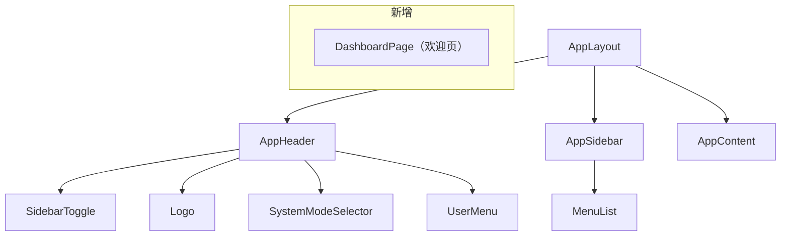
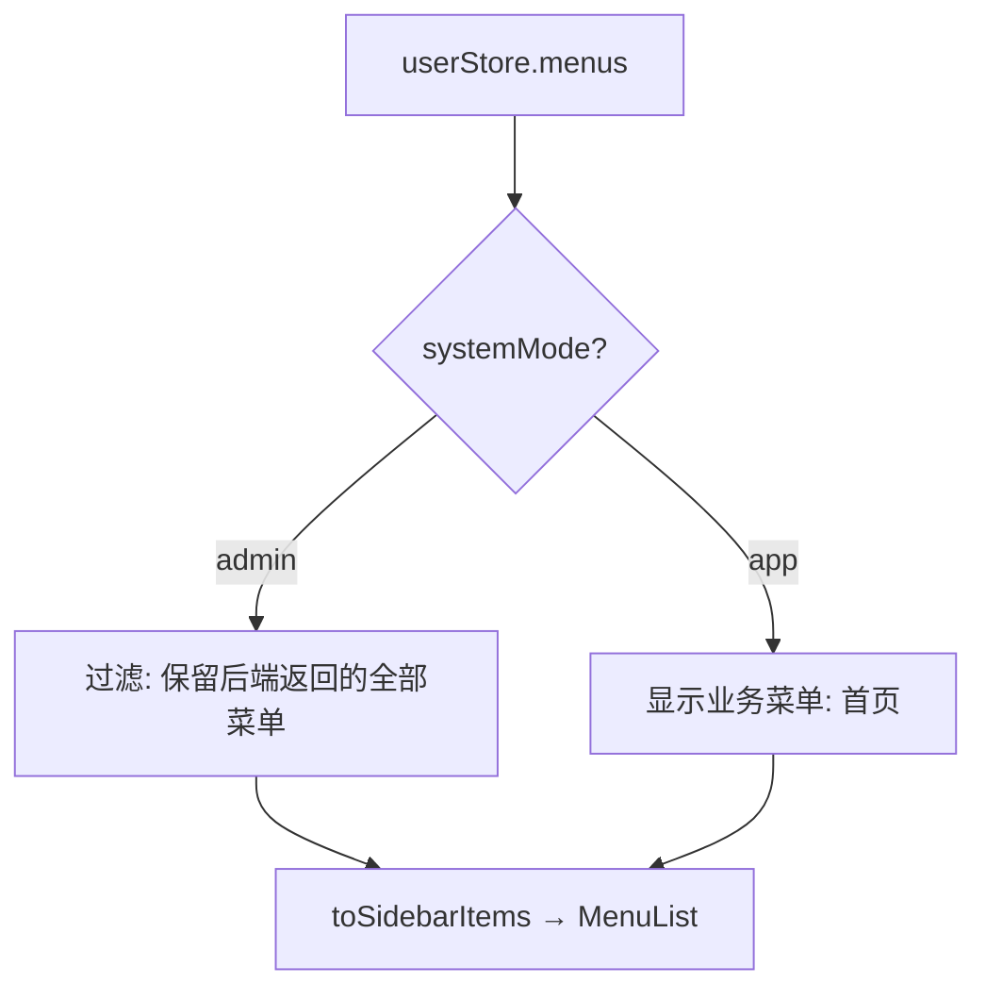
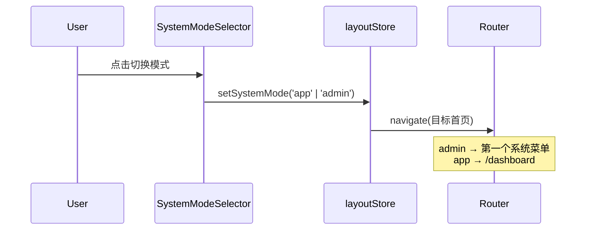

# 前端详细设计文档

## 文档信息

| 项目 | 内容 |
|------|------|
| 文档名称 | 双 Layout 布局 前端详细设计 |
| 对应后端模块 | 无（纯前端） |
| 参考文档 | `static_fe/src/app/components/Layout.tsx`（静态页面参考实现） |
| 版本 | v1.0.0 |
| 创建日期 | 2026-04-27 |
| 负责人 | 前端开发（AI辅助） |

---

# 一、模块概述

## 1.1 功能描述

登录后的页面布局分为两种模式：
- **系统管理模式（admin）**：左侧边栏展示系统管理 + 系统监控菜单，用于 RBAC 管理
- **业务模式（app）**：左侧边栏展示业务菜单，当前仅有"首页"（欢迎页），后续扩展设备/车辆/监控等业务模块

两种模式通过顶部导航栏的模式切换器切换，切换时自动跳转到对应模式的首页。

## 1.2 模块边界

| 职责 | 说明 |
|------|------|
| 本设计负责 | Layout 双模式切换、导航栏布局调整、Dashboard 首页、侧边栏菜单过滤 |
| 不变更 | 登录流程、菜单动态渲染逻辑、各业务页面 |

---

# 二、组件设计

## 2.1 组件结构



## 2.2 变更文件清单

| 文件 | 变更类型 | 说明 |
|------|---------|------|
| `components/layout/AppHeader.tsx` | 修改 | SystemModeSelector 移到左侧，去掉居中布局 |
| `components/layout/AppSidebar.tsx` | 修改 | 根据 systemMode 过滤菜单 |
| `App.tsx` | 修改 | 添加 `/dashboard` 路由 |
| `utils/menuMapper.ts` | 修改 | COMPONENT_MAP 添加 Dashboard |
| `stores/layoutStore.ts` | 修改 | systemMode 切换时触发导航 |
| `pages/dashboard/DashboardPage.tsx` | **新增** | 业务首页，显示欢迎信息 |

---

# 三、详细设计

## 3.1 AppHeader 布局调整

**当前**：左侧 = Toggle + Logo，**居中** = SystemModeSelector，右侧 = 用户菜单

**改为**：左侧 = Toggle + Logo + **SystemModeSelector**，右侧 = 用户菜单

```
┌──────────────────────────────────────────────────────────┐
│ [≡] 车联网管理系统  [系统管理 ▾]          [主题] [admin ▾] │
└──────────────────────────────────────────────────────────┘
```

SystemModeSelector 紧跟 Logo 右侧，不再居中。

## 3.2 AppSidebar 菜单过滤

根据 `layoutStore.systemMode` 过滤后端返回的菜单树：



**过滤规则**：
- `admin` 模式：直接使用后端返回的菜单树（系统管理 + 系统监控）
- `app` 模式：显示硬编码的业务菜单（当前仅"首页"，后续从后端获取业务菜单）

## 3.3 模式切换行为



## 3.4 DashboardPage 首页

```
┌─────────────────────────────────┐
│                                 │
│     欢迎使用车联网管理系统         │
│                                 │
│     当前用户：陈立               │
│     角色：超级管理员              │
│                                 │
└─────────────────────────────────┘
```

简单的欢迎页，从 `userStore.userInfo` 读取用户名和角色信息。

## 3.5 路由变更

| 路由 | 组件 | 说明 |
|------|------|------|
| `/dashboard` | DashboardPage | **新增**，业务首页 |
| `/*` 兜底 | Navigate | admin 模式跳第一个菜单，app 模式跳 /dashboard |

---

# 四、状态管理

## 4.1 layoutStore 变更

`systemMode` 切换时需要触发导航。当前 `setSystemMode` 只更新状态，不导航。

**方案**：在 `SystemModeSelector` 的 `onChange` 回调中同时调用 `navigate`，不在 store 中耦合路由逻辑。

---

# 五、变更记录

| 版本 | 日期 | 修改人 | 变更描述 | 变更原因 | 评审人 |
|------|------|--------|---------|---------|--------|
| v1.0.0 | 2026-04-27 | 前端开发（AI） | 初始版本 | 双 Layout 模式设计 | 待评审 |
