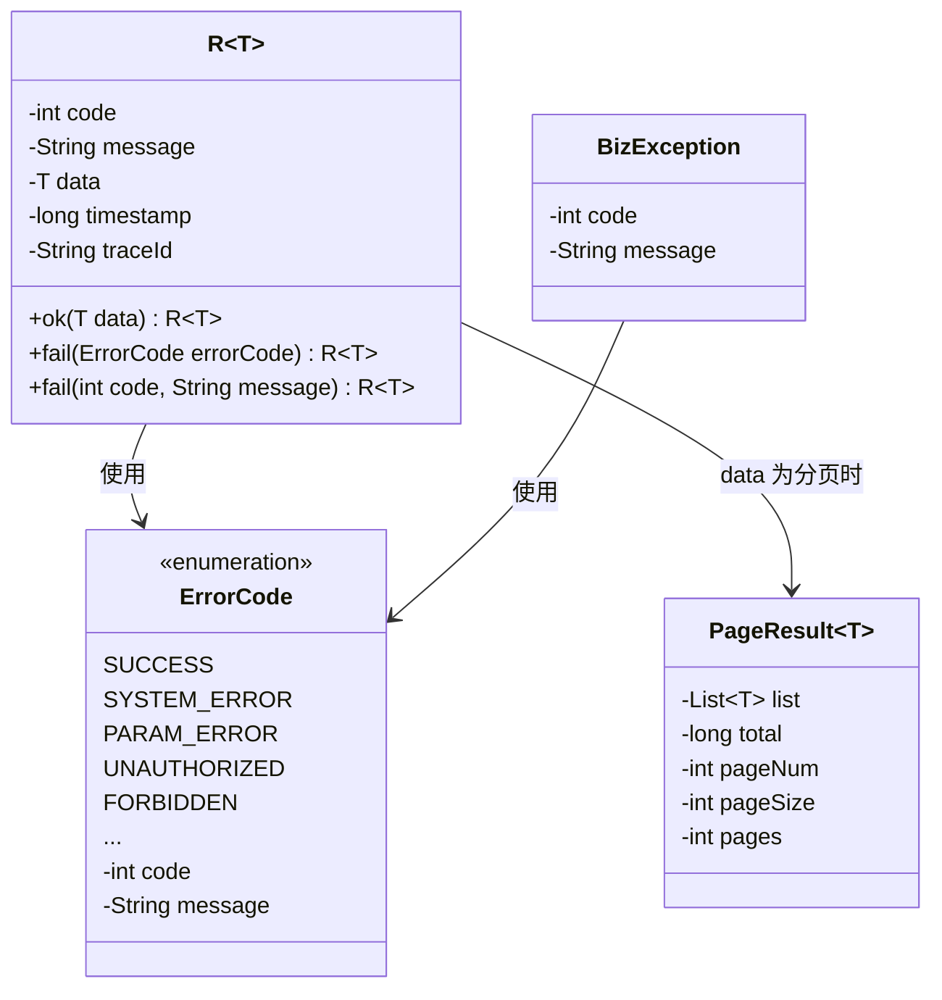
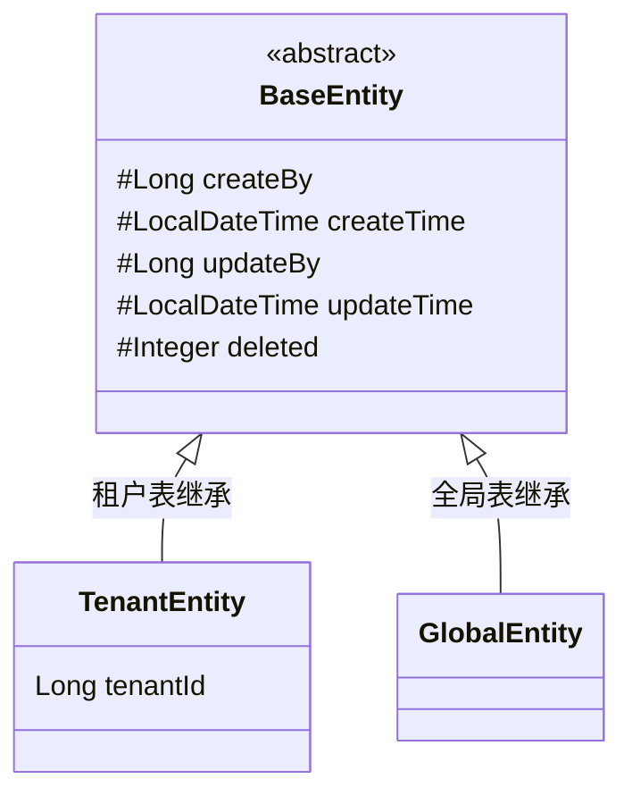
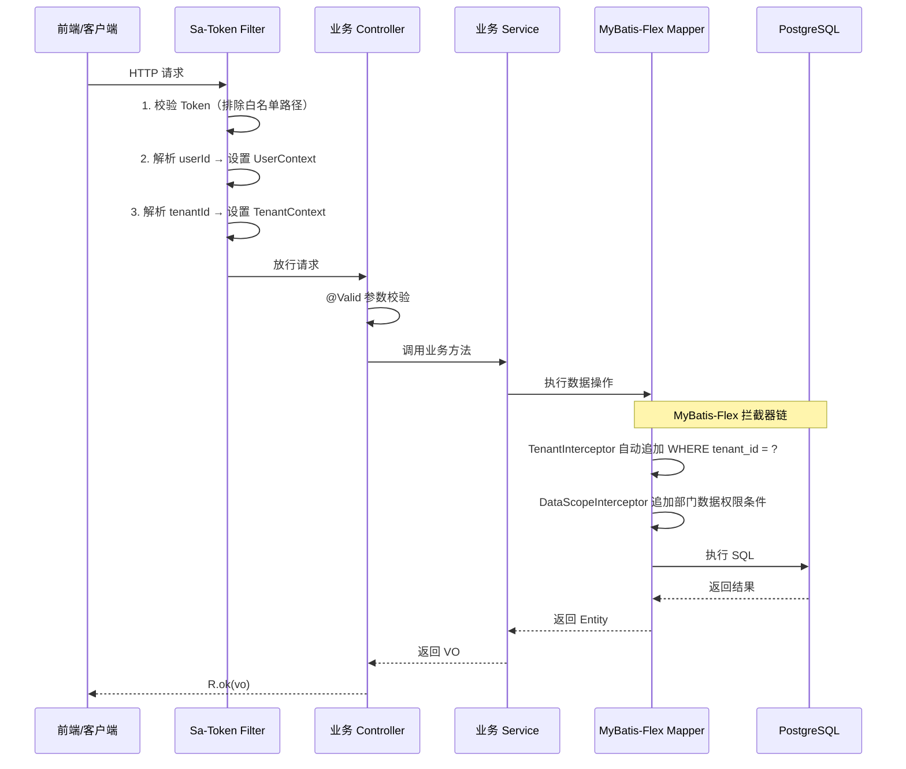
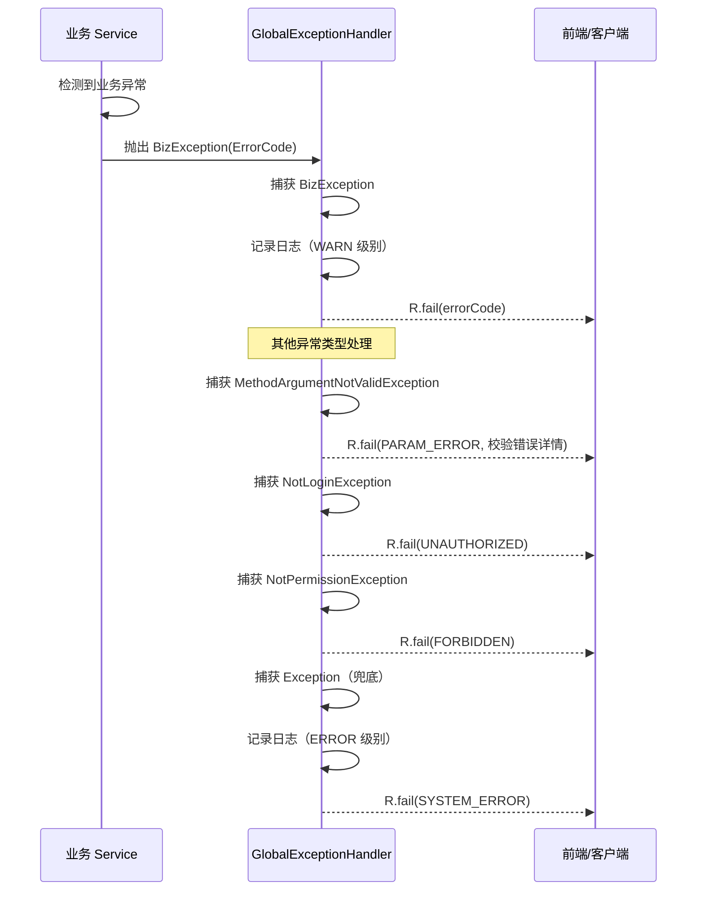
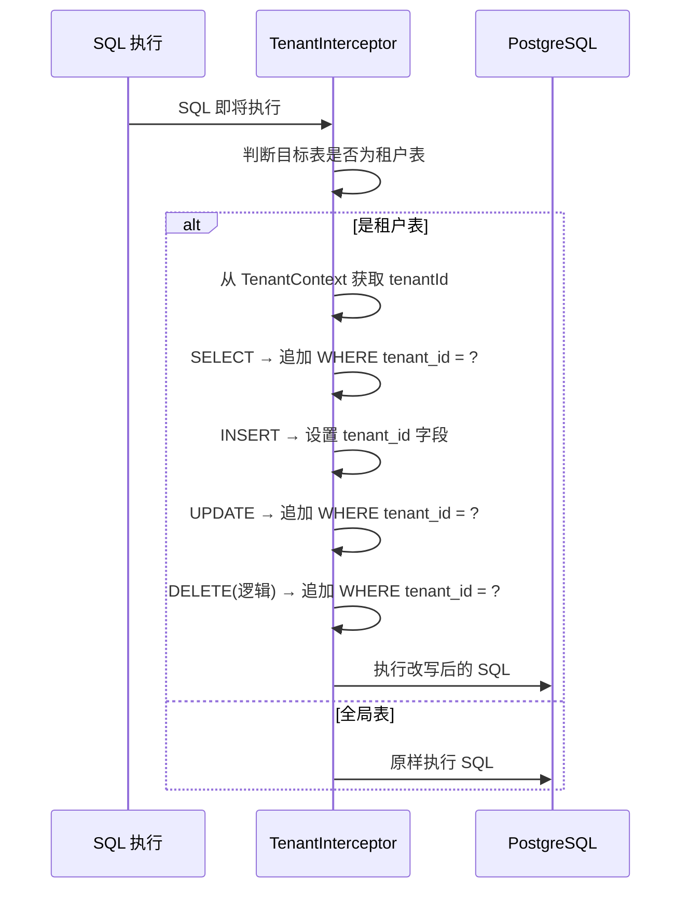
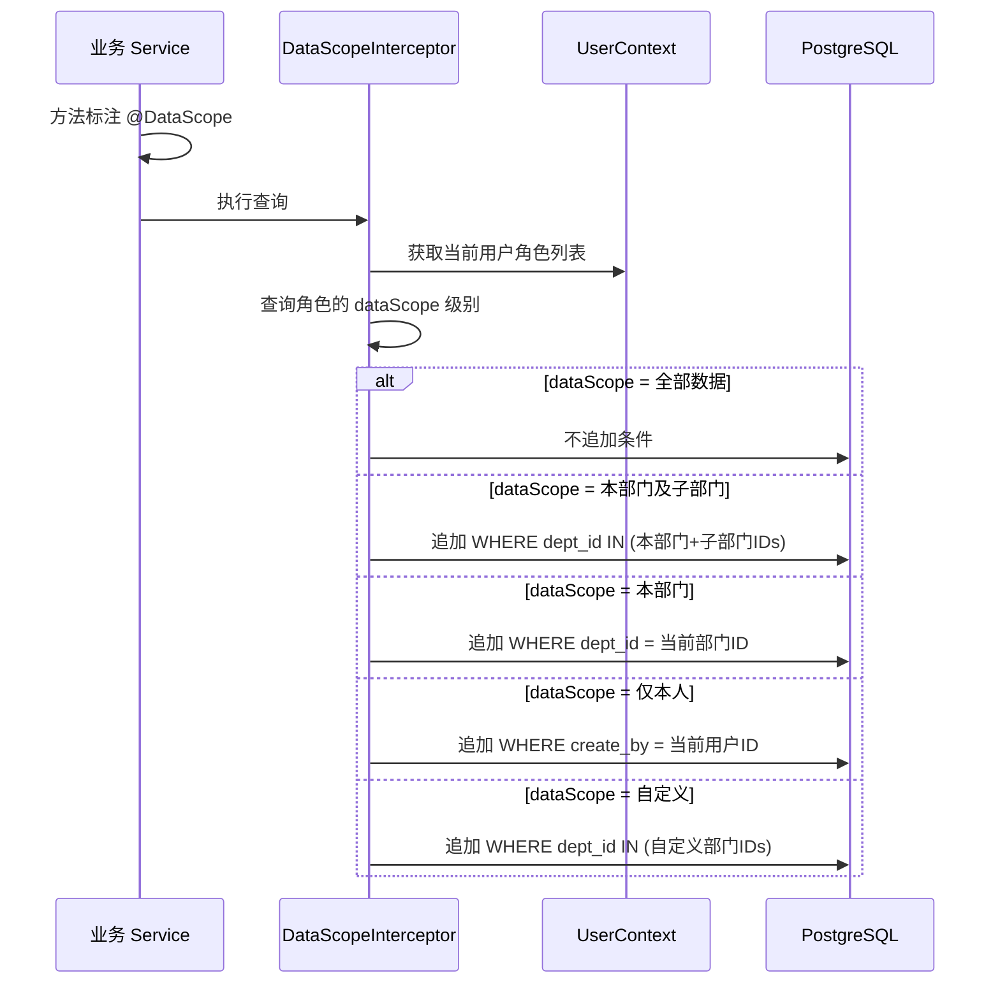
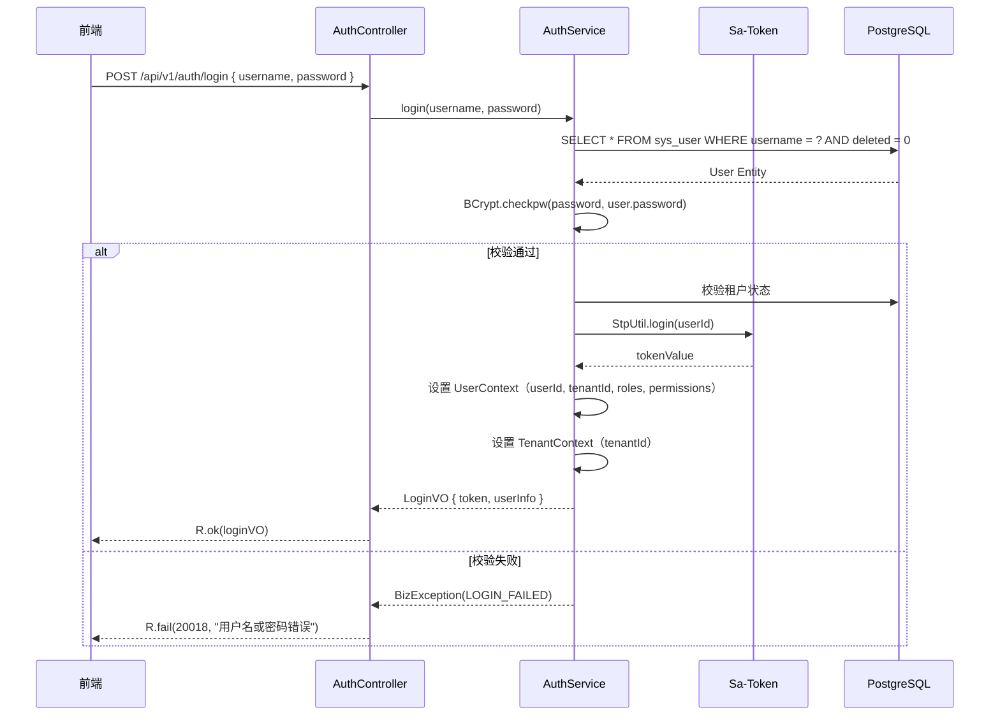
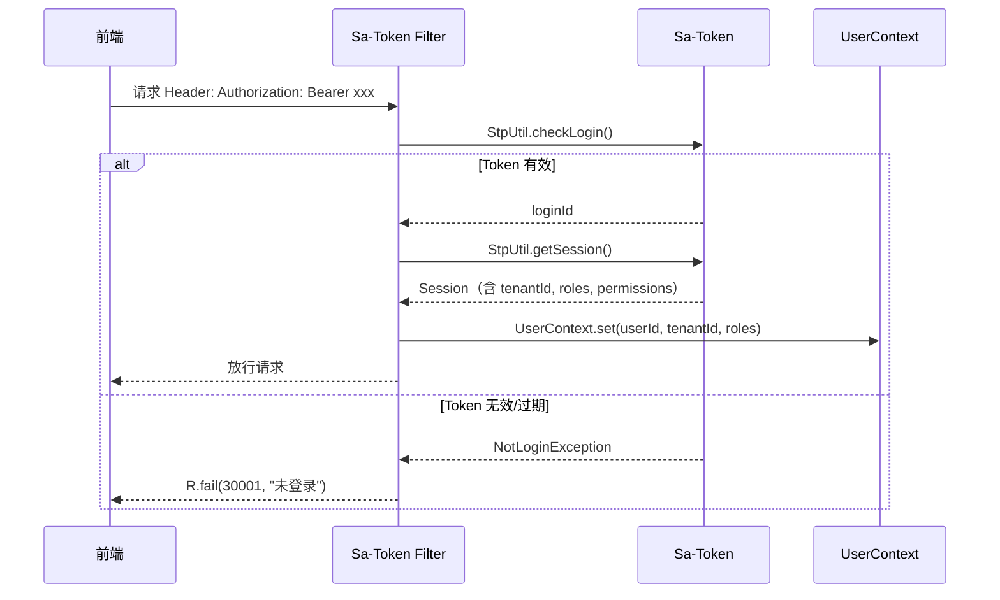
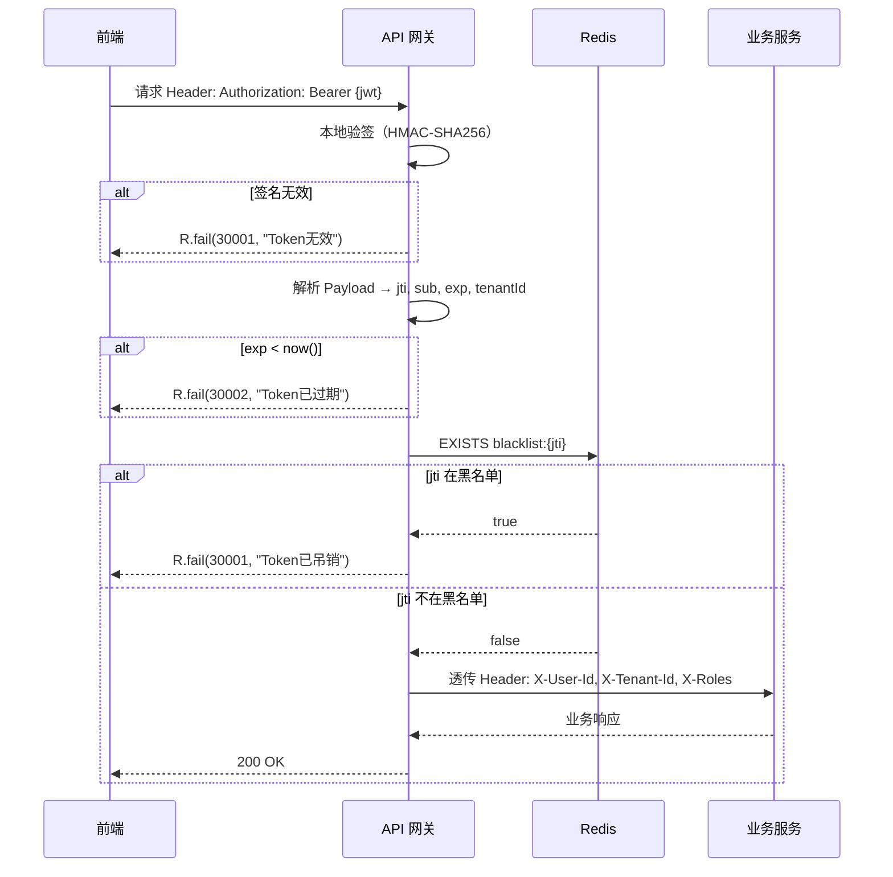

# 程序详细设计文档

> **定位**
> - 数据库驱动设计
> - 分层思想
> - 前后端无代码协同
> - AI 分阶段稳定交付

------

## 文档信息

| 项目 | 内容 |
|------|------|
| 模块名称 | 公共基础设施 |
| 模块标识 | core |
| 所属系统 | RBAC 权限模块 |
| 文档版本 | v1.0.0 |
| 设计负责人 | 后端开发（AI辅助） |
| 最后更新时间 | 2026-03-30 |

适用对象：
- 后端开发
- 前端开发
- 测试人员
- AI 编程

------

# 一、数据库设计

> ⚠️ 数据库是系统"真实状态"的最终承载
> 所有代码都必须服务于本章设计

------

## 1.1 表清单与业务职责

本模块为纯代码基础设施，不直接创建业务表。但定义了**公共字段规范**，所有后续业务表必须遵守：

| 公共字段 | 类型 | 必填 | 说明 |
|---------|------|------|------|
| id | BIGINT | 是 | 主键（雪花算法），所有表必须 |
| tenant_id | BIGINT | 是 | 租户ID（全局表除外），MyBatis-Flex 拦截器自动填充 |
| create_by | BIGINT | 否 | 创建人ID |
| create_time | TIMESTAMP | 是 | 创建时间，默认 CURRENT_TIMESTAMP |
| update_by | BIGINT | 否 | 更新人ID |
| update_time | TIMESTAMP | 是 | 更新时间，默认 CURRENT_TIMESTAMP，自动更新 |
| deleted | SMALLINT | 是 | 逻辑删除：0=正常，1=已删除 |

**跨模块约束**：后续所有模块建表必须包含以上公共字段（全局表不含 tenant_id，如 sys_menu）。

------

## 1.2 全局表 vs 租户表分类

| 表名 | 类型 | 是否含 tenant_id | 说明 |
|------|------|-----------------|------|
| sys_menu | 全局表 | 否 | 菜单数据所有租户共享 |
| sys_tenant | 全局表 | 否 | 租户表本身无 tenant_id |
| sys_user | 租户表 | 是 | 用户按租户隔离 |
| sys_role | 租户表 | 是 | 角色按租户隔离 |
| sys_dept | 租户表 | 是 | 部门按租户隔离 |
| sys_dict_type | 租户表 | 是 | 字典类型按租户隔离 |
| sys_dict_data | 租户表 | 是 | 字典数据按租户隔离 |
| sys_oper_log | 租户表 | 是 | 操作日志按租户隔离 |
| sys_login_log | 租户表 | 是 | 登录日志按租户隔离 |
| sys_user_role | 租户表 | 是 | 关联表按租户隔离 |
| sys_role_menu | 全局关联 | 否 | 菜单全局，但通过角色间接隔离 |
| sys_role_dept | 租户表 | 是 | 自定义数据权限按租户隔离 |

------

# 二、模块目标与边界

**模块解决的技术问题：**
为所有 RBAC 业务模块提供统一的公共能力：统一响应格式、全局异常处理、多租户拦截、数据权限拦截、认证鉴权集成、操作日志注解、上下文管理。

**模块不解决的问题：**
- 具体业务逻辑（用户/角色/菜单等由各自模块负责）
- 前端路由和权限渲染（前端基础设施负责）
- 分布式缓存和消息队列（首期不引入）

**是否核心链路：** 是。所有业务模块都依赖本模块。

------

## 2.1 模块边界图

```mermaid
flowchart TD
    subgraph 公共基础设施模块
        A[统一响应 R]
        B[全局异常处理]
        C[错误码枚举]
        D[多租户拦截器]
        E[数据权限拦截器]
        F[Sa-Token 认证配置]
        G[@Log 操作日志注解]
        H[UserContext 上下文]
        I[雪花ID生成器]
        J[MyBatis-Flex 自动填充]
    end

    subgraph 业务模块
        K[菜单管理]
        L[部门管理]
        M[角色管理]
        N[用户管理]
        O[租户管理]
        P[字典管理]
        Q[日志管理]
    end

    K --> A
    K --> B
    K --> F
    K --> I

    L --> A
    L --> D
    L --> E
    L --> F

    M --> A
    M --> D
    M --> E
    M --> G

    N --> A
    N --> D
    N --> F
    N --> G

    O --> A
    O --> D
    O --> G

    P --> A
    P --> D

    Q --> A
    Q --> D
    Q --> H
```

------

# 三、整体架构设计

> ⚠️ 明确声明：**本项目不采用 DDD**

------

## 3.1 分层结构定义

```
com.gentry.core/
├── config/                    # 框架配置
│   ├── MyBatisFlexConfig      # MyBatis-Flex 配置（拦截器、自动填充、逻辑删除）
│   ├── SaTokenConfig          # Sa-Token 配置
│   ├── WebMvcConfig           # Web MVC 配置（CORS、拦截器注册）
│   └── SnowflakeConfig        # 雪花算法配置
├── common/                    # 统一响应与异常
│   ├── R                      # 统一响应包装
│   ├── PageResult             # 分页响应对象
│   ├── BizException           # 业务异常
│   ├── ErrorCode              # 错误码枚举
│   └── GlobalExceptionHandler # 全局异常处理
├── context/                   # 上下文管理
│   ├── UserContext            # 用户上下文（ThreadLocal）
│   └── TenantContext          # 租户上下文（ThreadLocal）
├── interceptor/               # MyBatis-Flex 拦截器
│   ├── TenantInterceptor      # 多租户拦截器
│   └── DataScopeInterceptor   # 数据权限拦截器
├── annotation/                # 自定义注解
│   ├── Log                    # 操作日志注解
│   └── DataScope              # 数据权限注解
├── aspect/                    # AOP 切面
│   └── LogAspect              # 操作日志切面
├── util/                      # 工具类
│   ├── IdWorker               # 雪花ID生成器
│   └── SecurityUtils          # 安全工具（获取当前用户、租户等）
└── entity/                    # 公共基类
    └── BaseEntity             # 实体基类（公共字段）
```

### 命名规范

| 概念 | 类名 | 说明 |
|------|------|------|
| 统一响应 | R\<T\> | 泛型响应包装 |
| 分页结果 | PageResult\<T\> | 分页数据载体 |
| 业务异常 | BizException | 运行时异常，携带错误码 |
| 错误码 | ErrorCode | 枚举，code + message |

**禁止事项**：
- ❌ 禁止在 Controller 中直接返回裸对象，必须用 R\<T\> 包装
- ❌ 禁止在 Service 中抛出 Exception，必须抛 BizException
- ❌ 禁止使用 System.out.println，必须用 SLF4J

------

## 3.2 枚举设计规范（强制）

本模块定义公共枚举：

### ErrorCode 错误码枚举

| 枚举值 | code | description |
|--------|------|-------------|
| SUCCESS | 0 | 操作成功 |
| SYSTEM_ERROR | 10001 | 系统异常 |
| PARAM_ERROR | 10002 | 参数校验失败 |
| METHOD_NOT_ALLOWED | 10003 | 请求方法不允许 |
| PARAM_TYPE_MISMATCH | 10004 | 请求参数类型不匹配 |
| HTTP_MESSAGE_NOT_READABLE | 10005 | HTTP消息不可读 |
| TENANT_NOT_FOUND | 20001 | 租户不存在 |
| TENANT_CODE_EXISTS | 20002 | 租户编码已存在 |
| TENANT_DISABLED | 20003 | 租户已禁用 |
| TENANT_EXPIRED | 20004 | 租户已过期 |
| ROLE_CODE_EXISTS | 20005 | 角色编码已存在 |
| ROLE_IN_USE | 20006 | 角色正在使用中（角色下存在用户，禁止删除） |
| USERNAME_EXISTS | 20007 | 用户名已存在 |
| PHONE_EXISTS | 20008 | 手机号已存在 |
| USER_DISABLED | 20009 | 用户已禁用 |
| OLD_PASSWORD_ERROR | 20010 | 原密码错误 |
| DEPT_HAS_CHILDREN | 20011 | 部门下存在子部门，禁止删除 |
| DEPT_NAME_EXISTS | 20012 | 部门名称已存在 |
| USER_NOT_FOUND | 20013 | 用户不存在 |
| MENU_HAS_CHILDREN | 20014 | 菜单下存在子菜单，禁止删除 |
| ROLE_NOT_FOUND | 20015 | 角色不存在 |
| DICT_TYPE_EXISTS | 20016 | 字典类型已存在 |
| DICT_TYPE_IN_USE | 20017 | 字典类型正在使用中，禁止删除 |
| LOGIN_FAILED | 20018 | 用户名或密码错误 |
| TOKEN_INVALID | 30001 | Token无效（未登录） |
| TOKEN_EXPIRED | 30002 | Token已过期 |
| PERMISSION_DENIED | 30003 | 权限不足（无权限） |
| DATA_EXISTS | 30010 | 数据已存在 |
| DATA_NOT_FOUND | 30011 | 数据不存在 |
| TOO_MANY_REQUESTS | 40001 | 请求过于频繁 |
| DUPLICATE_SUBMIT | 40002 | 重复提交 |
| CANNOT_DELETE_SELF | 40003 | 不能删除当前登录用户 |

> 数据库 status 字段仍使用 SMALLINT（0/1），枚举仅用于 Service 层。菜单 type 字段同理。

------

## 3.3 层级职责与禁止事项

| 层 | 允许做 | 禁止做 |
|---|--------|--------|
| GlobalExceptionHandler | 捕获异常、统一响应格式 | 写业务逻辑 |
| R\<T\> | 包装响应数据、设置错误码 | 包含业务逻辑 |
| BizException | 携带错误码和消息、中断业务流程 | 替代正常的流程控制 |
| Interceptor | 自动追加 SQL 条件（tenant_id、数据权限） | 修改业务数据 |
| Aspect | 记录操作日志、解析注解 | 修改业务返回值 |
| Context | 存取当前用户/租户信息 | 存储大量数据 |

------

# 四、业务模型与数据映射

### R\<T\> 统一响应设计



### BaseEntity 公共基类设计



**继承规则**：
- 含 `tenant_id` 的表 → Entity 继承 `TenantEntity`
- 不含 `tenant_id` 的全局表（如 sys_menu）→ Entity 继承 `BaseEntity`

**MyBatis-Flex 注解映射**：

| 公共字段 | 注解 | 说明 |
|---------|------|------|
| tenantId | `@Column(tenantId = true)` | 租户拦截器自动填充 |
| createTime | `@TableField(fill = FieldFill.INSERT)` | 插入时自动填充 |
| updateTime | `@TableField(fill = FieldFill.INSERT_UPDATE)` | 插入和更新时自动填充 |
| createBy | `@TableField(fill = FieldFill.INSERT)` | 插入时从 UserContext 获取 |
| updateBy | `@TableField(fill = FieldFill.INSERT_UPDATE)` | 更新时从 UserContext 获取 |
| deleted | `@TableLogic` | 逻辑删除 |

------

# 五、行为流程与用例设计

## 5.1 主流程（时序图）

### 5.1.1 统一请求处理流程



### 5.1.2 全局异常处理流程



### 5.1.3 多租户拦截器流程



### 5.1.4 数据权限拦截器流程



## 5.2 关键业务规则说明

### 多租户隔离

- **前置条件**：UserContext 和 TenantContext 已在 Sa-Token Filter 中设置
- **核心校验**：所有租户表的 SQL 自动追加 `tenant_id` 条件
- **失败路径**：TenantContext 为空时，对租户表操作直接拒绝（抛异常）

### 数据权限

- **前置条件**：方法上标注 `@DataScope` 注解
- **核心校验**：根据用户角色的 `data_scope` 值动态追加 SQL 条件
- **失败路径**：无角色时默认"仅本人"

### 操作日志

- **前置条件**：Controller 方法上标注 `@Log` 注解
- **核心校验**：无，自动记录
- **失败路径**：日志记录失败不影响业务（catch 后仅记录 ERROR 日志）

------

# 六、状态机设计

无状态机。本模块为纯基础设施，不涉及业务状态。

------

# 七、接口设计（前后端核心契约）

> 本模块不直接暴露 REST API，但定义了所有业务模块必须遵守的**响应契约**。

------

## 7.1 统一响应格式

### 成功响应

```json
{
  "code": 0,
  "message": "操作成功",
  "data": {},
  "timestamp": 1711708800000,
  "traceId": "abc123"
}
```

### 失败响应

```json
{
  "code": 20001,
  "message": "租户不存在",
  "data": null,
  "timestamp": 1711708800000,
  "traceId": "abc123"
}
```

### 参数校验失败响应

```json
{
  "code": 10002,
  "message": "参数校验失败",
  "data": {
    "name": "部门名称不能为空",
    "phone": "手机号格式不正确"
  },
  "timestamp": 1711708800000,
  "traceId": "abc123"
}
```

### 分页响应

```json
{
  "code": 0,
  "message": "操作成功",
  "data": {
    "list": [],
    "total": 100,
    "pageNum": 1,
    "pageSize": 10,
    "pages": 10
  },
  "timestamp": 1711708800000,
  "traceId": "abc123"
}
```

------

## 7.2 认证白名单路径

以下路径不需要 Token 校验：

| 路径 | Method | 说明 |
|------|--------|------|
| /api/v1/auth/login | POST | 登录 |
| /api/v1/auth/captcha | GET | 验证码（预留） |
| /doc.html | GET | Knife4j 文档 |
| /swagger-resources/** | GET | Swagger 资源 |
| /webjars/** | GET | Swagger 静态资源 |
| /actuator/** | GET | 健康检查 |

------

## 7.3 @Log 注解设计

```java
@Target(ElementType.METHOD)
@Retention(RetentionPolicy.RUNTIME)
public @interface Log {
    /** 操作模块 */
    String module() default "";
    /** 操作类型 */
    OperType type() default OperType.OTHER;
    /** 操作描述 */
    String value() default "";
    /** 是否保存请求参数 */
    boolean saveParams() default true;
    /** 是否保存响应结果 */
    boolean saveResult() default false;
}
```

**OperType 枚举**：

| 枚举值 | code | 说明 |
|--------|------|------|
| INSERT | INSERT | 新增 |
| UPDATE | UPDATE | 修改 |
| DELETE | DELETE | 删除 |
| SELECT | SELECT | 查询 |
| EXPORT | EXPORT | 导出 |
| IMPORT | IMPORT | 导入 |
| OTHER | OTHER | 其他 |

------

## 7.4 @DataScope 注解设计

```java
@Target(ElementType.METHOD)
@Retention(RetentionPolicy.RUNTIME)
public @interface DataScope {
    /** 部门表别名，默认 "d" */
    String deptAlias() default "d";
    /** 用户表别名，默认 "u" */
    String userAlias() default "u";
    /** 权限字段名，默认 "dept_id" */
    String deptIdField() default "dept_id";
}
```

------

# 八、模块安全规范

## 8.1 认证与授权要求

本模块是否需要认证：**基础设施层，不直接认证，但为其他模块提供认证能力**

认证方式：Sa-Token（UUID Token，基于服务端 Session）
Token 有效期：2 小时
Token 刷新：支持续签
Token 存储：Header `Authorization: Bearer {token}`
SSO 演进方案：JWT + Redis 黑名单（详见概要设计 §7.2.4）

### Sa-Token 核心配置

| 配置项 | 值 | 说明 |
|--------|-----|------|
| token-name | Authorization | Header 名称 |
| token-prefix | Bearer | Token 前缀 |
| timeout | 7200 | 有效期 2 小时（秒） |
| active-timeout | 1800 | 活跃超时 30 分钟（秒） |
| is-concurrent | true | 允许多端同时在线 |
| is-share | false | 每次登录生成新 Token |
| token-style | uuid | Token 风格 |
| is-log | true | 记录登录日志 |

### SSO 演进配置对照（JWT + Redis 黑名单）

> 当平台演进到微服务/多系统 SSO 时，Sa-Token 配置变更如下。权限校验框架不变，仅 Token 机制切换。

| 配置项 | 当前值（UUID 模式） | SSO 演进后（JWT 模式） | 说明 |
|--------|--------------------|-----------------------|------|
| token-style | uuid | jwt-simple | Token 格式从 UUID 切换为 JWT |
| jwt-secret-key | — | 配置 256-bit 密钥 | JWT 签名密钥，各服务共享 |
| timeout | 7200 | 1800 | AccessToken 有效期缩短为 30 分钟 |
| is-concurrent | true | true | 保持多端在线 |
| is-share | false | false | 保持每次登录新 Token |
| token-name | Authorization | Authorization | 不变 |
| token-prefix | Bearer | Bearer | 不变 |

**JWT Payload 标准字段：**

```json
{
  "jti": "unique-token-id",       // 唯一标识，用于黑名单查询
  "sub": "userId",                // 用户ID
  "tenantId": 1,                  // 租户ID
  "iat": 1711708800,              // 签发时间
  "exp": 1711710600               // 过期时间
}
```

**Redis 黑名单 Key 设计：**

| Key 模式 | Value | TTL | 说明 |
|----------|-------|-----|------|
| `blacklist:{jti}` | 1 | AccessToken 剩余有效期 | 吊销的 AccessToken |
| `refresh:{userId}` | refreshToken | 7–30 天 | RefreshToken 存储 |
| `sso:session:{sid}` | sessionData | 与 SSO Session 一致 | SSO 会话 |

------

## 8.2 敏感数据处理

本模块不直接处理敏感数据，但提供脱敏工具方法：

| 工具方法 | 功能 | 示例 |
|---------|------|------|
| DesensitizeUtil.phone(phone) | 手机号脱敏 | 13800138000 → 138\*\*\*\*8000 |
| DesensitizeUtil.email(email) | 邮箱脱敏 | admin@example.com → a\*\*\*@example.com |

------

## 8.3 安全检查清单

- [x] 所有接口是否需要认证？ → 白名单以外的接口全部需要
- [x] Token 过期是否正确处理？ → 返回 30001/30002 + 前端跳转登录页
- [x] 多租户隔离是否生效？ → TenantInterceptor 自动追加条件
- [x] 数据权限是否生效？ → DataScopeInterceptor 按 @DataScope 注解生效
- [x] SQL 注入防护？ → MyBatis-Flex 参数化查询
- [x] XSS 防护？ → 输入过滤 + 输出转义
- [x] 操作日志记录？ → @Log 注解 + AOP 切面
- [x] 密码存储安全？ → BCrypt 加密（用户模块实现，本模块提供工具）

------

# 九、算法设计

### 9.1 是否涉及算法

是否涉及算法：**否**

> 本模块无算法设计。所有逻辑为拦截器模式（SQL 改写）、AOP 模式（日志记录）、上下文模式（ThreadLocal 存取）。

------

# 十、前后端交互模型

### 认证交互时序



### Token 校验交互时序



### SSO 演进后 Token 校验时序（JWT + 黑名单）

> 以下为平台演进到微服务 SSO 后的 Token 校验流程，当前阶段不实现，作为设计预留。



------

# 十一、测试用例设计

## 正常流程

| 用例ID | 测试场景 | 前置条件 | 测试步骤 | 预期结果 |
|--------|---------|---------|---------|---------|
| CORE-001 | 统一响应包装 | - | Controller 返回对象 | 响应体包含 code/message/data/timestamp/traceId |
| CORE-002 | 分页响应包装 | - | 查询分页数据 | 响应 data 包含 list/total/pageNum/pageSize/pages |
| CORE-003 | 多租户拦截-查询 | 已设置 TenantContext | 查询租户表 | SQL 自动追加 WHERE tenant_id = ? |
| CORE-004 | 多租户拦截-插入 | 已设置 TenantContext | 插入租户表记录 | tenant_id 自动填充 |
| CORE-005 | 数据权限-全部数据 | 角色数据权限=全部 | 查询列表 | SQL 不追加部门条件 |
| CORE-006 | 数据权限-本部门 | 角色数据权限=本部门 | 查询列表 | SQL 追加 WHERE dept_id = 当前部门ID |
| CORE-007 | 数据权限-仅本人 | 角色数据权限=仅本人 | 查询列表 | SQL 追加 WHERE create_by = 当前用户ID |
| CORE-008 | 操作日志记录 | 方法标注 @Log | 执行写操作 | sys_oper_log 表生成一条记录 |

## 异常流程

| 用例ID | 测试场景 | 前置条件 | 测试步骤 | 预期结果 |
|--------|---------|---------|---------|---------|
| CORE-009 | BizException 处理 | - | Service 抛 BizException | 返回对应错误码和消息 |
| CORE-010 | 参数校验失败 | - | 提交空必填字段 | 返回 code=10002 + 字段级错误详情 |
| CORE-011 | Token 过期 | Token 已过期 | 携带过期 Token 请求 | 返回 code=30002 |
| CORE-012 | 无权限访问 | 用户无对应权限 | 请求需权限的接口 | 返回 code=30003 |
| CORE-013 | 系统异常兜底 | - | 抛出 RuntimeException | 返回 code=10001，日志记录 ERROR |

## 边界条件

| 用例ID | 测试场景 | 前置条件 | 测试步骤 | 预期结果 |
|--------|---------|---------|---------|---------|
| CORE-014 | TenantContext 为空 | 未登录 | 操作租户表 | 抛异常或拒绝操作 |
| CORE-015 | 全局表不追加 tenant_id | 已设置 TenantContext | 查询 sys_menu | SQL 不含 tenant_id 条件 |
| CORE-016 | 逻辑删除过滤 | 存在 deleted=1 的记录 | 查询列表 | 自动追加 WHERE deleted = 0 |
| CORE-017 | 雪花ID生成唯一 | - | 连续生成 1000 个 ID | 所有 ID 不重复 |

## 并发 / 幂等

| 用例ID | 测试场景 | 前置条件 | 测试步骤 | 预期结果 |
|--------|---------|---------|---------|---------|
| CORE-018 | 并发请求 UserContext | 多线程模拟 | 不同用户并发请求 | 各线程 UserContext 正确隔离 |
| CORE-019 | 操作日志并发写入 | 多线程模拟 | 并发执行 @Log 方法 | 所有日志记录正确无丢失 |

## 数据一致性

| 用例ID | 测试场景 | 前置条件 | 测试步骤 | 预期结果 |
|--------|---------|---------|---------|---------|
| CORE-020 | 租户隔离验证 | 两个租户各有数据 | 用租户A身份查询 | 仅返回租户A的数据 |
| CORE-021 | 数据权限跨租户隔离 | 不同租户的部门ID相同 | 查询数据 | 不出现跨租户数据 |

------

## 变更记录

| 版本 | 日期 | 修改人 | 变更内容 | 变更原因 | 评审人 |
|------|------|--------|---------|---------|--------|
| v1.0.0 | 2026-03-30 | 后端开发（AI） | 初始版本 | 公共基础设施详细设计 | 待评审 |
