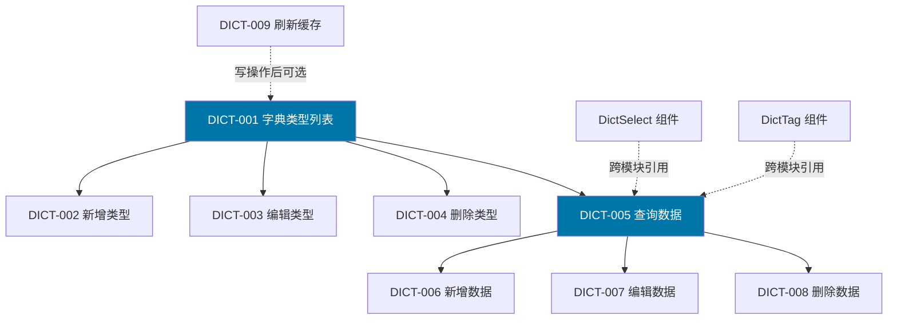
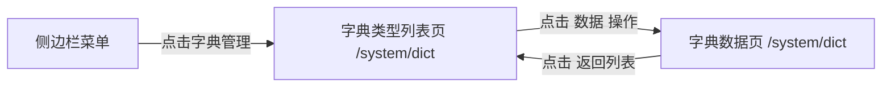
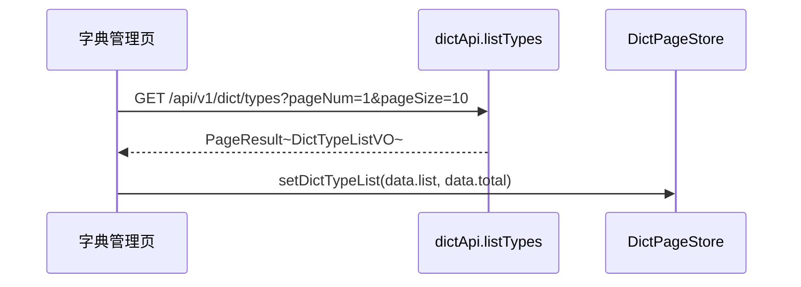
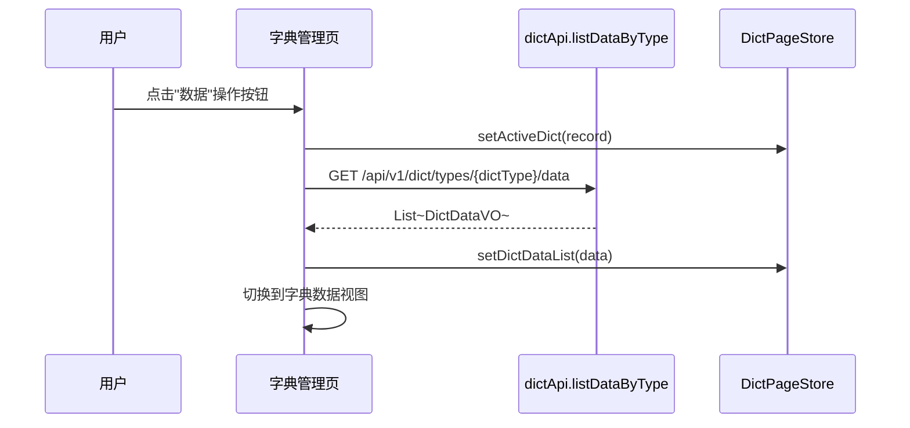
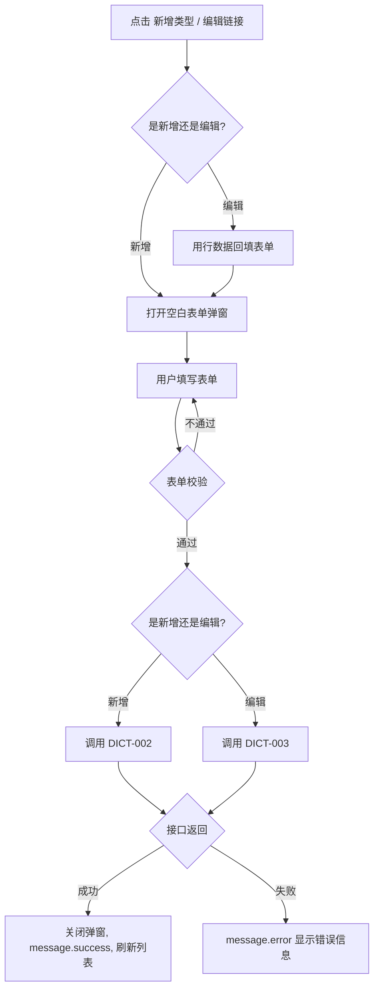
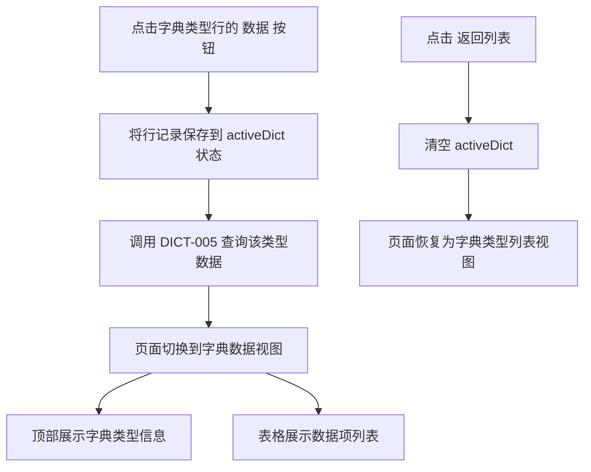
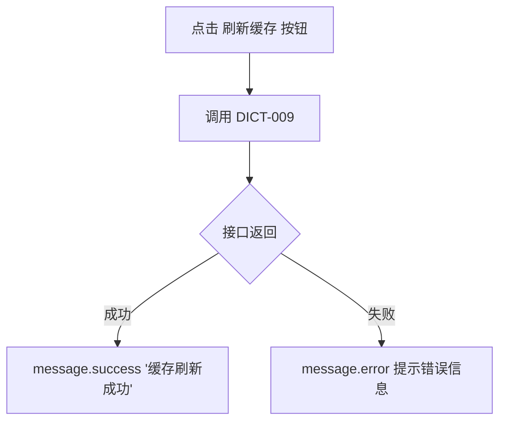
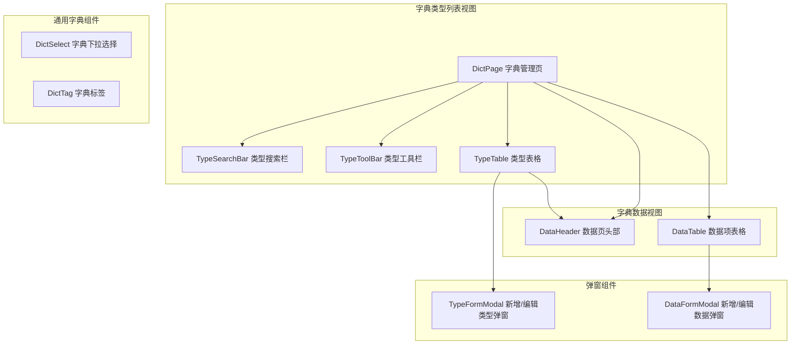

# 前端详细设计文档

## 文档信息

| 项目 | 内容 |
|------|------|
| 文档名称 | 字典管理 前端详细设计文档 |
| 对应后端模块 | 字典管理（模块标识：dict） |
| 参考文档 | `doc/design/modules/rbac/modules/字典管理/后端详细设计.md` |
| 静态页面 | `static_fe/src/app/pages/Dictionaries.tsx` |
| 版本 | v1.0.0 |
| 创建日期 | 2026-04-11 |
| 最后更新 | 2026-04-11 |
| 负责人 | 前端开发（AI辅助） |

---

# 一、模块概述

## 1.1 模块功能描述

本模块前端实现**字典类型管理**和**字典数据管理**两大功能：

- **字典类型管理**：租户管理员对系统内字典类型进行 CRUD，支持按名称、类型编码、状态搜索。采用单一表格布局（区别于用户管理的左树右表），操作列提供"数据"入口进入字典数据页。
- **字典数据管理**：点击字典类型的"数据"操作后，进入该类型下的字典数据项管理页面，展示当前字典类型信息及数据项表格，支持新增/编辑/删除数据项。
- **缓存刷新**：提供全局字典缓存刷新按钮，通知后端清除 Caffeine 缓存，确保数据一致性。
- **通用字典组件（跨模块）**：DictSelect 和 DictTag 两个通用组件，供其他模块（用户管理、设备管理、报警管理等）复用，用于渲染字典下拉选项和字典标签。

## 1.2 模块边界与职责

| 职责 | 说明 |
|------|------|
| **本模块负责** | 字典类型列表页、字典数据详情页、新增/编辑字典类型弹窗、新增/编辑字典数据弹窗、缓存刷新、DictSelect 通用组件、DictTag 通用组件 |
| **其他模块负责** | 字典数据的业务引用（各模块通过 dictType 编码引用字典）、操作日志记录（后端 AOP 自动） |

## 1.3 用户角色与权限

| 角色 | 可执行操作 | 对应权限标识 |
|------|----------|-------------|
| 平台超级管理员 | 所有操作 | system:dict:* |
| 租户管理员 | 字典类型/数据 CRUD、缓存刷新 | system:dict:list / add / edit / remove |

---

# 二、接口调用总览

## 2.1 接口引用说明

| 接口标识 | 接口名称 | HTTP方法 | 路径 | 主要用途 | 对应后端文档章节 |
|----------|----------|----------|------|----------|-----------------|
| DICT-001 | 字典类型列表 | GET | /api/v1/dict/types | 字典类型列表页加载 | §7.2 DICT-001 |
| DICT-002 | 新增字典类型 | POST | /api/v1/dict/types | 新增字典类型弹窗提交 | §7.2 DICT-002 |
| DICT-003 | 编辑字典类型 | PUT | /api/v1/dict/types/{id} | 编辑字典类型弹窗提交 | §7.2 DICT-003 |
| DICT-004 | 删除字典类型 | DELETE | /api/v1/dict/types/{id} | 列表删除按钮 | §7.2 DICT-004 |
| DICT-005 | 查询字典数据 | GET | /api/v1/dict/types/{dictType}/data | 字典数据页加载、DictSelect 组件 | §7.2 DICT-005 |
| DICT-006 | 新增字典数据 | POST | /api/v1/dict/types/{dictType}/data | 新增字典数据弹窗提交 | §7.2 DICT-006 |
| DICT-007 | 编辑字典数据 | PUT | /api/v1/dict/data/{id} | 编辑字典数据弹窗提交 | §7.2 DICT-007 |
| DICT-008 | 删除字典数据 | DELETE | /api/v1/dict/data/{id} | 数据列表删除按钮 | §7.2 DICT-008 |
| DICT-009 | 刷新字典缓存 | DELETE | /api/v1/dict/cache | 刷新缓存按钮 | §7.2 DICT-009 |

**跨模块接口依赖：**

| 接口 | 来源模块 | 用途 |
|------|---------|------|
| DICT-005 查询字典数据 | 字典管理（本模块） | 被其他模块的 DictSelect / DictTag 组件调用 |

## 2.2 接口依赖关系



---

# 三、页面详细设计

## 3.1 页面清单

| 页面名称 | 路由路径 | 页面功能描述 | 关联接口列表 |
|----------|----------|--------------|--------------|
| 字典管理页（类型列表） | /system/dict | 搜索栏 + 字典类型表格，支持 CRUD + 缓存刷新 | DICT-001~004, DICT-009 |
| 字典数据页 | /system/dict (状态切换) | 字典类型信息栏 + 数据项表格，支持 CRUD + 缓存刷新 | DICT-005~009 |

> **说明**：字典管理采用单页面双状态设计，通过页面内部状态 `activeDict` 控制显示"类型列表"还是"数据详情"，不使用独立路由。

## 3.2 页面跳转关系



**说明**：字典管理页通过侧边栏菜单「系统管理 > 字典管理」进入。点击字典类型操作列的"数据"按钮，切换到字典数据页（同一页面内部状态切换）。点击"返回列表"回到字典类型列表。

---

# 四、页面初始化流程设计

## 4.1 字典类型列表页初始化流程

### 4.1.1 接口调用序列

| 顺序 | 接口 | 并行/串行 | 说明 |
|------|------|----------|------|
| 1 | DICT-001 字典类型列表 | 串行 | 加载字典类型分页列表 |

> 仅一个接口，无需并行。

### 4.1.2 初始化时序图



### 4.1.3 初始化数据流

1. 字典类型列表接口返回 `PageResult<DictTypeListVO>` → `list` 渲染表格行，`total` 渲染分页器
2. `dataCount` 字段展示在表格"数据项数"列
3. `status` 字段映射为 Tag 颜色渲染：1 → 绿色"正常"，0 → 红色"停用"

## 4.2 字典数据页初始化流程

### 4.2.1 接口调用序列

| 顺序 | 接口 | 并行/串行 | 说明 |
|------|------|----------|------|
| 1 | DICT-005 查询字典数据 | 串行 | 按选中字典类型编码加载数据项列表 |

### 4.2.2 初始化时序图



### 4.2.3 初始化数据流

1. 用户点击字典类型行的"数据"按钮，将该行记录存入页面状态 `activeDict`
2. 页面切换到字典数据视图，顶部展示当前字典类型信息（dictType、dictName）
3. 调用 DICT-005 获取该类型下所有数据项（不分页），按 `sort` 排序
4. `cssClass` 字段控制 Tag 颜色渲染
5. `isDefault` 字段映射为"是/否"Tag

---

# 五、用户操作流程设计

## 5.1 操作-接口映射表

| 用户操作描述 | 触发组件 | 调用接口 | 请求参数构造 | 响应数据处理 | 异常处理 |
|-------------|---------|---------|-------------|-------------|---------|
| 点击搜索按钮 | 搜索按钮 | DICT-001 | 从搜索表单收集 dictName, dictType, status | 重置表格数据和分页 | message.error 提示 |
| 点击重置按钮 | 重置按钮 | — | 清空搜索表单，重置分页，重新调用 DICT-001 | — | — |
| 点击新增类型 | 新增按钮 | DICT-002 | 弹窗表单数据组装为 DictTypeCreateDTO | 关闭弹窗，刷新列表 | 表单校验失败阻止提交 |
| 点击编辑类型 | 编辑链接 | DICT-003 | 行数据回填表单，提交时组装 DictTypeUpdateDTO | 关闭弹窗，刷新列表 | — |
| 点击删除类型 | 删除链接 | DICT-004 | 取行记录 id | 刷新列表 | 二次确认后调用；有数据项时禁用 |
| 点击"数据"操作 | 数据链接 | DICT-005 | 取行记录的 dictType 字段 | 切换到数据视图 | — |
| 点击新增数据项 | 新增数据项按钮 | DICT-006 | 弹窗表单数据组装为 DictDataCreateDTO（含路径 dictType） | 关闭弹窗，刷新数据列表 | 表单校验失败阻止提交 |
| 点击编辑数据项 | 编辑链接 | DICT-007 | 行数据回填表单，提交时组装 DictDataUpdateDTO | 关闭弹窗，刷新数据列表 | — |
| 点击删除数据项 | 删除链接 | DICT-008 | 取行记录 id | 刷新数据列表 | 二次确认后调用 |
| 点击刷新缓存 | 刷新缓存按钮 | DICT-009 | 无 | message.success 提示 | message.error 提示 |
| 点击刷新按钮 | 刷新按钮 | DICT-001 / DICT-005 | 重新调用当前视图对应列表接口 | 刷新列表 | — |
| 点击返回列表 | 返回列表链接 | — | 清空 activeDict，恢复类型列表视图 | — | — |

## 5.2 复杂操作流程

### 5.2.1 新增/编辑字典类型流程



### 5.2.2 字典类型 → 字典数据页切换流程



### 5.2.3 缓存刷新流程



---

# 六、组件设计

## 6.1 组件结构图



## 6.2 组件清单

| 组件名称 | 组件类型 | 主要职责 | 直接调用接口 | 父组件 | 子组件 |
|----------|----------|----------|-------------|--------|--------|
| DictPage | 页面 | 字典管理页布局（双视图切换） | — | App | TypeSearchBar, TypeToolBar, TypeTable, DataHeader, DataTable |
| TypeSearchBar | 业务组件 | 字典类型搜索表单 | — | DictPage | — |
| TypeToolBar | 业务组件 | 新增类型 / 刷新 / 刷新缓存按钮 | — | DictPage | — |
| TypeTable | 业务组件 | 字典类型列表表格 | — | DictPage | — |
| DataHeader | 业务组件 | 数据页头部（返回、类型信息、操作按钮） | — | DictPage | — |
| DataTable | 业务组件 | 字典数据项表格 | — | DictPage | — |
| TypeFormModal | 业务组件 | 新增/编辑字典类型弹窗 | DICT-002, DICT-003 | DictPage | — |
| DataFormModal | 业务组件 | 新增/编辑字典数据弹窗 | DICT-006, DICT-007 | DictPage | — |
| DictSelect | 通用组件 | 按 dictType 渲染 Select 下拉框 | DICT-005 | 各业务页面 | — |
| DictTag | 通用组件 | 按 cssClass 渲染 Tag 标签 | — (纯渲染) | 各业务表格 | — |

## 6.3 关键组件详细设计

### 6.3.1 DictPage 组件

- **接口调用设计**：不直接调用接口，通过子组件和状态管理间接调用
- **Props 设计**：无（页面级组件）
- **状态管理**：
  - `activeDict: DictTypeListVO | null` — 当前选中的字典类型（null 显示类型列表，非 null 显示数据页）
  - `formModalOpen: boolean` — 类型表单弹窗显隐
  - `dataFormModalOpen: boolean` — 数据表单弹窗显隐
  - `editingRecord: any | null` — 编辑时当前记录
- **视图切换逻辑**：
  - `activeDict === null` → 渲染字典类型列表视图
  - `activeDict !== null` → 渲染字典数据视图

### 6.3.2 TypeFormModal 组件

- **接口调用设计**：
  - 新增：提交时调用 `DICT-002`
  - 编辑：打开时用行数据回填表单，提交时调用 `DICT-003`
- **Props 设计**：

| Prop | 类型 | 说明 |
|------|------|------|
| open | boolean | 弹窗显隐 |
| mode | 'create' \| 'edit' | 新增或编辑模式 |
| record | DictTypeListVO \| null | 编辑模式下的行数据 |
| onSuccess | () => void | 操作成功回调 |

- **表单字段**：

| 字段 | 组件 | 必填 | 校验规则 | 编辑模式 |
|------|------|------|---------|---------|
| dictName | Input | 是 | 2-100字符 | 可编辑 |
| dictType | Input | 是 | 2-100字符，字母开头，字母数字下划线 | 禁用（不可修改） |
| status | Select | 否 | 默认"启用" | 可编辑 |
| remark | TextArea | 否 | 最长500字 | 可编辑 |

### 6.3.3 DataFormModal 组件

- **接口调用设计**：
  - 新增：提交时调用 `DICT-006`（路径含 dictType）
  - 编辑：打开时用行数据回填表单，提交时调用 `DICT-007`
- **Props 设计**：

| Prop | 类型 | 说明 |
|------|------|------|
| open | boolean | 弹窗显隐 |
| mode | 'create' \| 'edit' | 新增或编辑模式 |
| dictType | string | 当前字典类型编码 |
| record | DictDataVO \| null | 编辑模式下的行数据 |
| onSuccess | () => void | 操作成功回调 |

- **表单字段**：

| 字段 | 组件 | 必填 | 校验规则 | 编辑模式 |
|------|------|------|---------|---------|
| dictLabel | Input | 是 | 1-100字符 | 可编辑 |
| dictValue | Input | 是 | 1-100字符 | 禁用（不可修改） |
| cssClass | Select | 否 | primary/success/warning/danger/default | 可编辑 |
| listClass | Input | 否 | 预留字段 | 可编辑 |
| isDefault | Switch | 否 | 默认否 | 可编辑 |
| sort | InputNumber | 否 | 0-999，默认 0 | 可编辑 |
| status | Select | 否 | 默认"启用" | 可编辑 |
| remark | TextArea | 否 | 最长500字 | 可编辑 |

### 6.3.4 DictSelect 通用组件

- **接口调用设计**：初始化时调用 `DICT-005` 获取指定 dictType 的数据列表
- **Props 设计**：

| Prop | 类型 | 说明 |
|------|------|------|
| dictType | string | 字典类型编码（必填） |
| value | string | 当前选中值（受控模式） |
| onChange | (value: string) => void | 选中变化回调 |
| placeholder | string | 占位文本，默认"请选择" |
| disabled | boolean | 是否禁用 |
| allowClear | boolean | 是否允许清空 |

- **行为设计**：
  1. 组件挂载时，检查 TanStack Query 缓存
  2. 缓存命中 → 直接使用缓存数据渲染选项
  3. 缓存未命中 → 调用 DICT-005 获取数据，缓存后渲染
  4. 仅展示 `status === 1`（启用）的数据项
  5. 按 `sort` 排序展示
  6. 若有 `isDefault === 1` 的数据项，作为默认选中值

### 6.3.5 DictTag 通用组件

- **接口调用设计**：无（纯渲染组件，接收数据即可）
- **Props 设计**：

| Prop | 类型 | 说明 |
|------|------|------|
| value | string | 字典键值 |
| dictType | string | 字典类型编码 |
| cssClass | string | 样式属性（可选，若传入直接使用，否则从缓存查找） |

- **样式映射规则**：

| cssClass 值 | Tag color | 说明 |
|-------------|-----------|------|
| primary | blue | 主要（蓝色） |
| success | green | 成功（绿色） |
| warning | orange | 警告（橙色） |
| danger | red | 危险（红色） |
| default / 空 | default | 默认（灰色） |

---

# 七、数据转换设计

## 7.1 请求数据构造

### 7.1.1 数据转换规则

| 接口 | 前端表单字段 | 接口请求字段 | 转换规则 |
|------|------------|------------|---------|
| DICT-001 | 搜索表单 + 分页 | pageNum, pageSize, dictName, dictType, status | 直接映射，空值不传 |
| DICT-002 | 新增类型表单 | dictName, dictType, status, remark | 直接映射 |
| DICT-003 | 编辑类型表单 | dictName, status, remark | 直接映射，不含 dictType |
| DICT-006 | 新增数据表单 | dictLabel, dictValue, cssClass, listClass, isDefault, sort, status, remark | 直接映射 |
| DICT-007 | 编辑数据表单 | dictLabel, cssClass, listClass, isDefault, sort, status, remark | 直接映射，不含 dictValue |
| DICT-009 | 无 | 无请求体 | 直接调用 DELETE |

### 7.1.2 转换函数设计

```
// 搜索参数构造（过滤空值）
buildDictTypeQuery(formValues, pagination): DictTypeQueryDTO → 移除 null/undefined 字段

// 状态 Select 转换
statusToApi(value: string): number → value === 'normal' ? 1 : 0

// 状态 API → 前端展示
statusToLabel(status: number): string → status === 1 ? '正常' : '停用'

// isDefault Switch 转换
isDefaultToApi(checked: boolean): number → checked ? 1 : 0

// cssClass → Tag color 映射
cssClassToTagColor(cssClass: string): string → { primary: 'blue', success: 'green', warning: 'orange', danger: 'red' }[cssClass] ?? 'default'

// 新增类型表单数据组装
buildTypeCreatePayload(formValues): DictTypeCreateDTO → 直接映射

// 编辑类型表单数据组装
buildTypeUpdatePayload(formValues): DictTypeUpdateDTO → 移除 dictType

// 新增数据表单数据组装
buildDataCreatePayload(formValues): DictDataCreateDTO → isDefault 转为 number

// 编辑数据表单数据组装
buildDataUpdatePayload(formValues): DictDataUpdateDTO → 移除 dictValue
```

## 7.2 响应数据处理

### 7.2.1 数据解析规则

| 接口 | 响应结构 | 解析规则 |
|------|---------|---------|
| DICT-001 | `PageResult<DictTypeListVO>` | list → 表格 dataSource；total → 分页 total；dataCount 渲染"数据项数"列 |
| DICT-002/003 | `DictTypeVO` | 不需要解析，操作成功后刷新列表 |
| DICT-005 | `List<DictDataVO>` | 直接渲染为数据项表格（不分页），按 sort 排序 |
| DICT-006/007 | `DictDataVO` | 不需要解析，操作成功后刷新数据列表 |

### 7.2.2 数据格式化

```
// 时间格式化
formatTime(datetime: string): string → "2026-04-11 10:30:00"

// 状态 Tag 颜色
statusTagProps(status: number): { color: string, text: string }
  → status === 1 ? { color: 'success', text: '正常' } : { color: 'error', text: '停用' }

// cssClass Tag 颜色映射
cssClassTagProps(cssClass: string): { color: string }
  → { primary: 'blue', success: 'green', warning: 'orange', danger: 'red' }[cssClass] ?? 'default'

// 是否默认 Tag
isDefaultTagProps(isDefault: number): { color: string, text: string }
  → isDefault === 1 ? { color: 'success', text: '是' } : { color: 'default', text: '否' }

// 数据项数显示
formatDataCount(count: number): string → count > 0 ? `${count}` : '0'
```

---

# 八、状态管理设计

## 8.1 全局状态设计

本模块不涉及全局状态。字典数据通过 TanStack Query 缓存管理，不需要独立的 Zustand Store。

> **说明**：字典数据属于低频变更的高频读取数据，适合使用 TanStack Query 的 staleTime 缓存策略，而非 Zustand。

## 8.2 页面状态设计（字典管理页）

```typescript
interface DictPageState {
  // 视图控制
  activeDict: DictTypeListVO | null;  // null = 类型列表视图，非 null = 数据视图

  // 字典类型列表
  dictTypeList: DictTypeListVO[];
  total: number;
  pageNum: number;
  pageSize: number;
  loading: boolean;

  // 搜索条件
  searchParams: {
    dictName?: string;
    dictType?: string;
    status?: number;
  };

  // 字典数据列表
  dictDataList: DictDataVO[];
  dataLoading: boolean;

  // 弹窗状态
  typeFormModalOpen: boolean;
  typeFormMode: 'create' | 'edit';
  editingTypeRecord: DictTypeListVO | null;

  dataFormModalOpen: boolean;
  dataFormMode: 'create' | 'edit';
  editingDataRecord: DictDataVO | null;
}
```

## 8.3 组件状态设计

| 组件 | 内部状态 | 说明 |
|------|---------|------|
| TypeSearchBar | 表单值 | 由 Ant Design Form 管理 |
| TypeFormModal | 表单值、提交中 | 由 Ant Design Form 管理 |
| DataFormModal | 表单值、提交中 | 由 Ant Design Form 管理 |
| DictSelect | loading | 数据加载中状态（由 TanStack Query 管理） |

## 8.4 TanStack Query 缓存设计

| Query Key | 对应接口 | staleTime | 说明 |
|-----------|---------|-----------|------|
| ['dict', 'types', params] | DICT-001 | 0（不缓存） | 每次搜索/翻页重新请求 |
| ['dict', 'data', dictType] | DICT-005 | 30 分钟 | 字典数据变更频率低，缓存 30 分钟 |
| ['dict', 'cache'] | DICT-009 | — | 写操作后调用 invalidateQueries 刷新 |

**缓存失效策略：**

| 操作 | 失效范围 |
|------|---------|
| 新增/编辑/删除字典类型 | invalidateQueries(['dict', 'types']) |
| 新增/编辑/删除字典数据 | invalidateQueries(['dict', 'data', dictType]) + invalidateQueries(['dict', 'types']) |
| 刷新缓存 | invalidateQueries(['dict']) — 全部失效 |

---

# 九、模块安全规范

## 9.1 认证与授权

### 9.1.1 权限控制

| 页面/组件 | 权限标识 | 无权限处理 |
|-----------|---------|-----------|
| 字典管理菜单 | system:dict:list | 菜单不显示 |
| 新增类型按钮 | system:dict:add | 隐藏按钮 |
| 编辑类型链接 | system:dict:edit | 隐藏链接 |
| 删除类型链接 | system:dict:remove | 隐藏链接 |
| 数据操作链接 | system:dict:list | 隐藏链接 |
| 新增数据项按钮 | system:dict:add | 隐藏按钮 |
| 编辑数据链接 | system:dict:edit | 隐藏链接 |
| 删除数据链接 | system:dict:remove | 隐藏链接 |
| 刷新缓存按钮 | system:dict:edit | 隐藏按钮 |

**权限判断方式**：使用 `hasPermission(perm)` 函数，从 UserStore.permissions 数组中查找匹配。按钮级权限通过条件渲染控制。

## 9.2 敏感数据处理

本模块无敏感数据。字典数据为系统配置性质的非敏感数据。

## 9.3 安全检查清单

- [x] 所有接口通过 Axios 拦截器自动携带 Token
- [x] 按钮级权限通过权限标识控制显隐
- [x] 字典类型编码格式校验（字母开头，字母数字下划线）
- [x] 删除操作二次确认
- [x] 租户隔离由后端 TenantInterceptor 保证

---

# 十、错误处理设计

## 10.1 接口调用错误处理

### 10.1.1 错误分类与处理

| 错误类型 | HTTP 状态码 | 业务错误码 | 处理策略 |
|---------|-----------|----------|---------|
| 未登录 | 401 | 30001 | 清除 Store，跳转 /login |
| 无权限 | 403 | 30003 | message.error('无操作权限') |
| 参数校验失败 | 200 | 10002 | message.error(具体字段错误) |
| 字典类型已存在 | 200 | 20016 | message.error('字典类型已存在') |
| 字典键值已存在 | 200 | 10002 | message.error('字典键值已存在') |
| 字典类型不存在 | 200 | 30011 | message.error('字典类型不存在') |
| 网络异常 | — | — | message.error('网络异常，请稍后重试') |
| 服务器错误 | 500 | — | message.error('服务器异常') |

### 10.1.2 重试机制

| 接口 | 是否重试 | 重试策略 |
|------|---------|---------|
| DICT-001 类型列表 | 是 | TanStack Query 自动重试 1 次 |
| DICT-005 查询数据 | 是 | TanStack Query 自动重试 1 次 |
| DICT-009 刷新缓存 | 是 | TanStack Query 自动重试 1 次 |
| 其他写操作 | 否 | 直接展示错误 |

## 10.2 用户操作错误处理

| 场景 | 处理方案 |
|------|---------|
| 表单校验失败 | Ant Design Form 内联红色提示 |
| 新增重复字典类型 | message.error 提示，表单不关闭 |
| 新增重复字典键值 | message.error 提示，表单不关闭 |
| 删除有数据项的字典类型 | 删除按钮 disabled + Tooltip 提示"该类型下有数据项，请先删除数据" |
| 网络断开 | 全局 Axios 拦截器 message.error |
| 刷新缓存失败 | message.error 提示 |

---

# 十一、性能优化设计

## 11.1 接口调用优化

### 11.1.1 接口缓存

| 接口 | 缓存策略 | 缓存时间 |
|------|---------|---------|
| DICT-001 类型列表 | 不缓存 | 每次搜索/翻页重新请求 |
| DICT-005 查询数据 | TanStack Query staleTime 30min | 30 分钟内不重复请求 |
| DictSelect 组件 | TanStack Query staleTime 30min | 多个页面共享同一缓存 |

### 11.1.2 DictSelect 防重复请求

当同一页面使用多个 DictSelect 组件且 dictType 相同时，TanStack Query 自动合并请求，仅发一次网络调用。多个不同页面使用相同 dictType 的 DictSelect 时，也在 staleTime 内共享缓存。

## 11.2 组件渲染优化

| 优化项 | 策略 |
|-------|------|
| 弹窗懒渲染 | `destroyOnClose: true`，关闭时销毁表单状态 |
| DictSelect 缓存 | TanStack Query staleTime 30min，避免重复请求 |
| 视图切换 | 使用条件渲染而非路由，减少组件重新挂载开销 |
| cssClass 映射缓存 | 使用常量 Map，避免每次渲染重新创建 |

---

# 十二、测试设计

## 12.1 接口调用测试

### 12.1.1 正常流程测试

| 测试场景 | 前置条件 | 操作步骤 | 预期结果 |
|---------|---------|---------|---------|
| 字典类型列表加载 | 已登录，有权限 | 进入字典管理页 | 表格加载，显示字典类型数据，含数据项数 |
| 搜索字典类型 | 有多条数据 | 输入字典名称，点击搜索 | 列表筛选，仅显示匹配项 |
| 新增字典类型 | — | 填写名称+类型编码，确定 | 弹窗关闭，列表刷新，新类型出现 |
| 编辑字典类型 | 类型存在 | 点击编辑，修改名称，确定 | 弹窗关闭，列表刷新，名称已更新 |
| 删除字典类型（无数据项） | 类型下无数据 | 点击删除，确认 | 列表刷新，类型消失 |
| 删除字典类型（有数据项） | 类型下有数据 | 查看删除按钮 | 删除按钮 disabled，Tooltip 提示 |
| 进入字典数据页 | 类型存在 | 点击"数据"操作 | 切换到数据视图，展示数据项表格 |
| 新增字典数据项 | 在数据视图 | 填写标签+键值+颜色，确定 | 弹窗关闭，列表刷新，新数据项出现 |
| 编辑字典数据项 | 数据项存在 | 点击编辑，修改标签，确定 | 弹窗关闭，列表刷新，标签已更新 |
| 删除字典数据项 | 数据项存在 | 点击删除，确认 | 列表刷新，数据项消失 |
| 刷新缓存 | — | 点击刷新缓存按钮 | message.success 提示 |
| 返回类型列表 | 在数据视图 | 点击"返回列表" | 切换回类型列表视图 |
| DictSelect 渲染 | 字典数据存在 | 渲染 DictSelect 组件 | 下拉框显示字典选项 |
| DictTag 渲染 | 字典数据存在 | 渲染 DictTag 组件 | Tag 按指定颜色显示 |

### 12.1.2 异常流程测试

| 测试场景 | 前置条件 | 操作步骤 | 预期结果 |
|---------|---------|---------|---------|
| 新增重复字典类型 | 类型已存在 | 输入已存在的 dictType | message.error('字典类型已存在') |
| 新增重复字典键值 | 同类型下已有 value | 输入已存在的 dictValue | message.error('字典键值已存在') |
| dictType 格式错误 | — | 输入数字开头的 dictType | 表单校验失败，提示格式错误 |
| Token 过期 | — | 操作任意接口 | 自动跳转登录页 |
| 网络断开 | — | 操作任意接口 | message.error 网络异常提示 |
| 刷新缓存失败 | 后端异常 | 点击刷新缓存 | message.error 提示错误信息 |

---

# 附录

## A. 接口详细说明

### A.1 DICT-001 字典类型列表

- **调用时机**：页面初始化、搜索、翻页
- **请求参数**：`{ pageNum, pageSize, dictName?, dictType?, status? }`
- **响应处理**：list → 表格数据源；total → 分页总数；dataCount → 数据项数列
- **错误处理**：message.error 提示

### A.2 DICT-002 新增字典类型

- **调用时机**：新增类型弹窗提交
- **请求参数**：`{ dictName, dictType, status, remark }`
- **响应处理**：关闭弹窗 → message.success → invalidateQueries(['dict', 'types'])
- **错误处理**：类型重复 message.error；通用错误 message.error

### A.3 DICT-003 编辑字典类型

- **调用时机**：编辑类型弹窗提交
- **请求参数**：`{ dictName, status, remark }`（不含 dictType）
- **响应处理**：同 DICT-002
- **错误处理**：同 DICT-002

### A.4 DICT-004 删除字典类型

- **调用时机**：列表删除按钮点击后确认
- **请求参数**：路径参数 `{id}`
- **响应处理**：message.success → invalidateQueries(['dict', 'types'])
- **错误处理**：message.error 提示

### A.5 DICT-005 查询字典数据

- **调用时机**：进入字典数据页、DictSelect 组件初始化
- **请求参数**：路径参数 `{dictType}`
- **响应处理**：数组直接渲染为数据项表格
- **错误处理**：message.error 提示

### A.6 DICT-006 新增字典数据

- **调用时机**：新增数据项弹窗提交
- **请求参数**：路径参数 `{dictType}` + `{ dictLabel, dictValue, cssClass, listClass, isDefault, sort, status, remark }`
- **响应处理**：关闭弹窗 → message.success → invalidateQueries(['dict', 'data', dictType]) + invalidateQueries(['dict', 'types'])
- **错误处理**：键值重复 message.error；通用错误 message.error

### A.7 DICT-007 编辑字典数据

- **调用时机**：编辑数据项弹窗提交
- **请求参数**：路径参数 `{id}` + `{ dictLabel, cssClass, listClass, isDefault, sort, status, remark }`（不含 dictValue）
- **响应处理**：同 DICT-006
- **错误处理**：同 DICT-006

### A.8 DICT-009 刷新字典缓存

- **调用时机**：刷新缓存按钮点击
- **请求参数**：无
- **响应处理**：message.success('缓存刷新成功') → invalidateQueries(['dict'])
- **错误处理**：message.error 提示

## B. 通用组件使用指南

### B.1 DictSelect 使用示例

```typescript
// 在用户管理中使用性别下拉框
<DictSelect
  dictType="sys_user_gender"
  value={form.getFieldValue('gender')}
  onChange={(value) => form.setFieldValue('gender', value)}
  placeholder="请选择性别"
/>
```

### B.2 DictTag 使用示例

```typescript
// 在用户管理表格中渲染性别标签
render: (_, record) => (
  <DictTag value={record.gender} dictType="sys_user_gender" />
)

// 在设备状态表格中渲染状态（已知 cssClass 时直接传入）
render: (_, record) => (
  <DictTag value={record.statusLabel} cssClass={record.statusColor} />
)
```

### B.3 常用字典类型编码

| dictType | 用途 | 使用模块 |
|----------|------|---------|
| sys_user_gender | 用户性别 | 用户管理 |
| sys_user_title | 用户职务 | 用户管理 |
| sys_normal_disable | 系统开关 | 多个模块 |
| sys_show_hide | 显示状态 | 菜单管理 |
| sys_menu_type | 菜单类型 | 菜单管理 |
| sys_data_scope | 数据权限范围 | 角色管理 |

## C. 变更记录

| 版本 | 日期 | 修改人 | 变更描述 | 变更原因 | 评审人 |
|------|------|--------|---------|---------|--------|
| v1.0.0 | 2026-04-11 | 前端开发（AI） | 初始版本 | 字典管理前端详细设计 | 待评审 |
