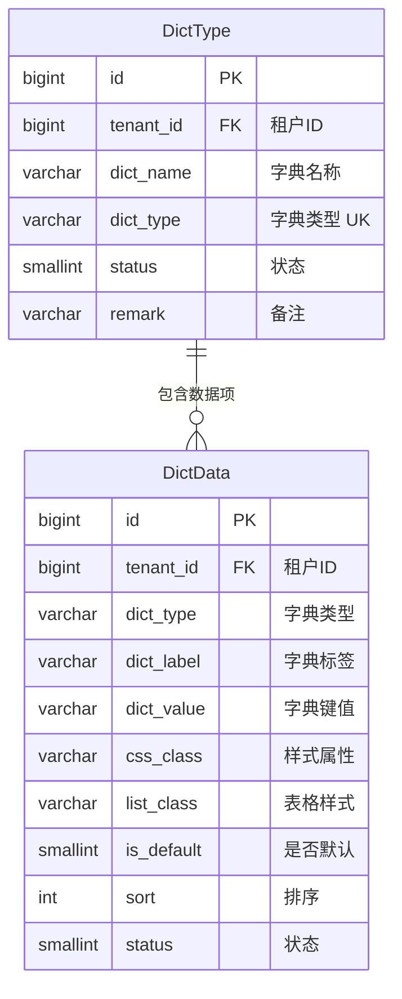
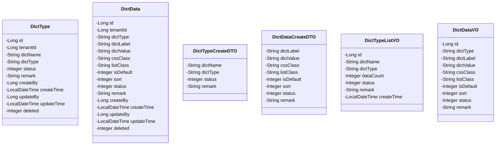
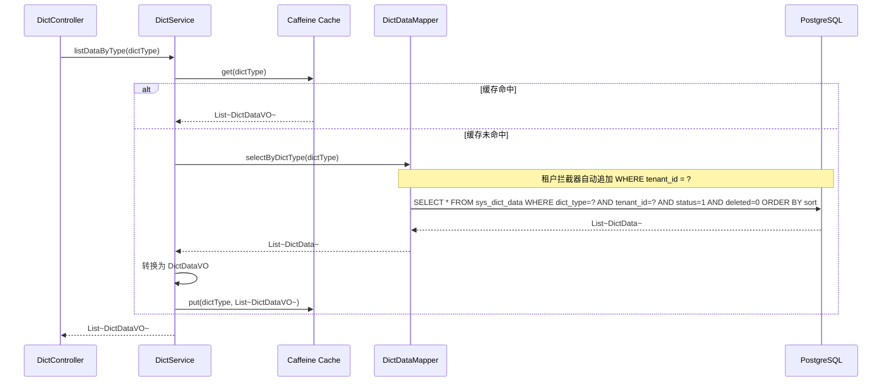
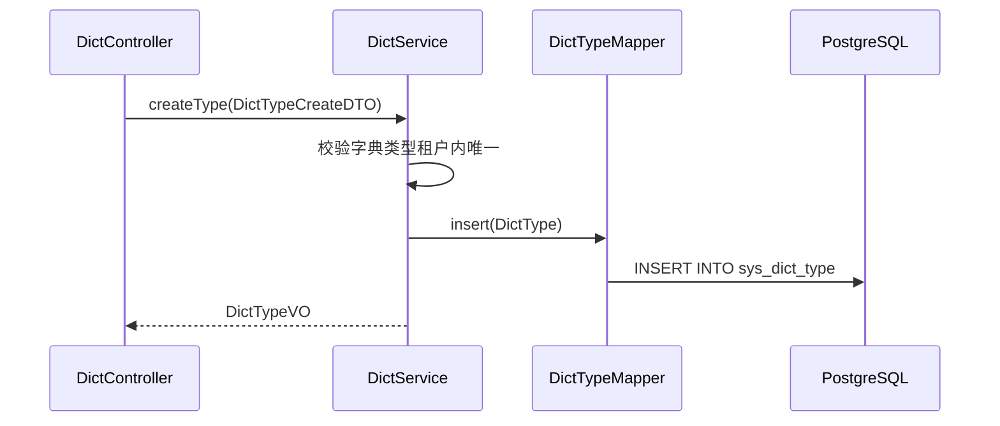
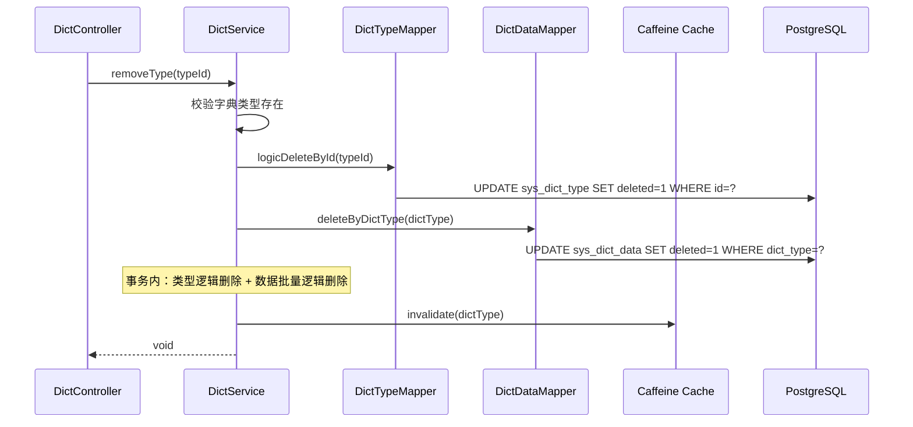
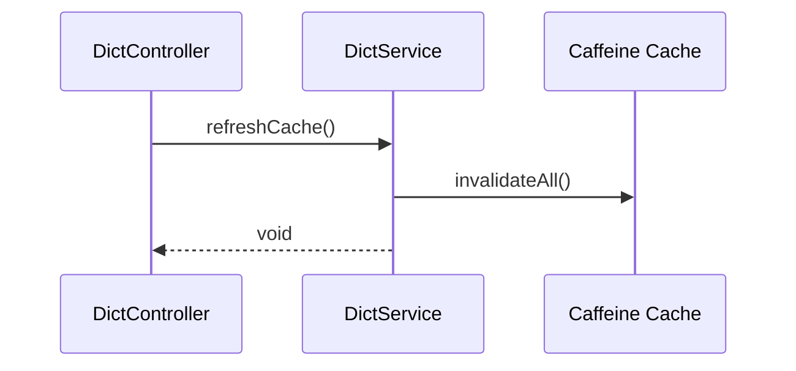
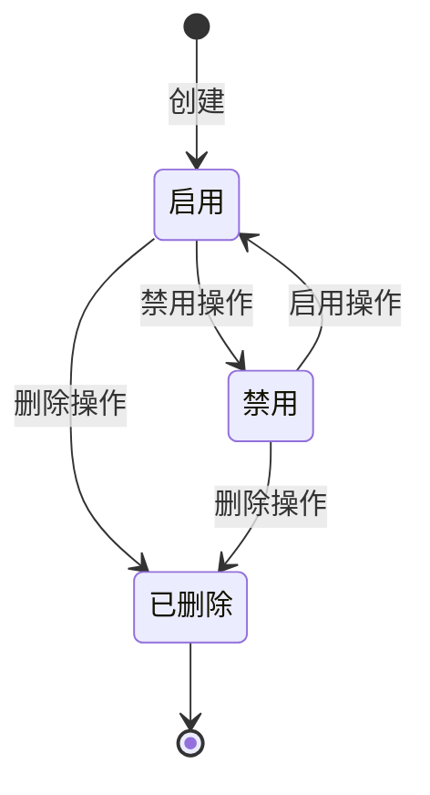
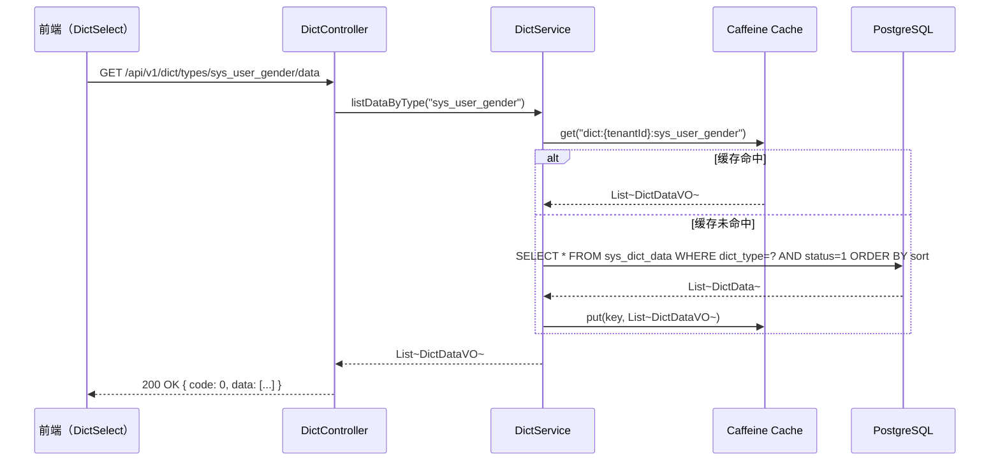
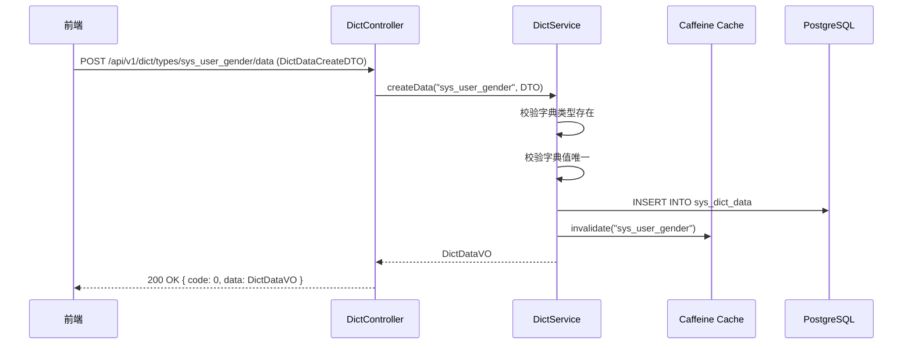

# 程序详细设计文档

> **定位**
> - 数据库驱动设计
> - 分层思想
> - 前后端无代码协同
> - AI 分阶段稳定交付

------

## 文档信息

| 项目 | 内容 |
|------|------|
| 模块名称 | 字典管理 |
| 模块标识 | dict |
| 所属系统 | RBAC 权限模块 |
| 文档版本 | v1.0.0 |
| 设计负责人 | 后端开发（AI辅助） |
| 最后更新时间 | 2026-03-30 |

适用对象：
- 后端开发
- 前端开发
- 测试人员
- AI 编程

------

# 一、数据库设计

> ⚠️ 数据库是系统"真实状态"的最终承载
> 所有代码都必须服务于本章设计

------

## 1.1 表清单与业务职责

| 表名 | 业务含义 | 主键 | 是否核心表 | 说明 |
|------|---------|------|-----------|------|
| sys_dict_type | 字典类型表 | id (BIGINT) | 是 | 租户级数据，字典分类定义 |
| sys_dict_data | 字典数据表 | id (BIGINT) | 是 | 租户级数据，字典数据项 |

------

## 1.2 表关系设计（ER 图）



**流程说明**：

1. 字典采用两级结构：字典类型（分类） + 字典数据（数据项）
2. 字典数据通过 `dict_type` 字段关联字典类型（非外键，字符串关联）
3. 字典类型和字典数据都含 `tenant_id`，支持租户级自定义字典

**关键点**：

- sys_dict_type 和 sys_dict_data 都含 `tenant_id`，受租户拦截器隔离
- 字典类型 `dict_type` 在租户内唯一（联合唯一索引 `tenant_id + dict_type + deleted`）
- 字典键值 `dict_value` 在同一租户同一字典类型内唯一（联合唯一索引 `tenant_id + dict_type + dict_value + deleted`）
- 系统预置字典通过 Flyway init SQL 初始化（无 tenant_id 的预置数据需指定租户）

------

## 1.3 表结构设计（字段级，逐字段）

### 表：sys_dict_type

| 字段 | 类型 | 必填 | 描述 | 业务含义 | 设计说明 |
|------|------|------|------|---------|---------|
| id | BIGINT | 是 | 主键 | 字典类型ID | 雪花算法生成 |
| tenant_id | BIGINT | 是 | 租户ID | 数据隔离 | 拦截器自动填充 |
| dict_name | VARCHAR(100) | 是 | 字典名称 | 显示名称 | 2-100 字符 |
| dict_type | VARCHAR(100) | 是 | 字典类型 | 唯一标识 | 2-100 字符，字母开头，字母数字下划线。联合唯一索引 `tenant_id + dict_type + deleted`。创建后不可修改 |
| status | SMALLINT | 是 | 状态 | 启用/禁用 | 0=禁用，1=启用。默认 1 |
| remark | VARCHAR(500) | 否 | 备注 | 备注信息 | - |
| create_time | TIMESTAMP | 是 | 创建时间 | 审计字段 | 自动填充 |
| update_time | TIMESTAMP | 是 | 更新时间 | 审计字段 | 自动更新 |
| deleted | SMALLINT | 是 | 逻辑删除 | 删除标识 | 0=正常，1=已删除。默认 0 |
| create_by | BIGINT | 否 | 创建人 | 审计字段 | - |
| update_by | BIGINT | 否 | 更新人 | 审计字段 | - |

### 表：sys_dict_data

| 字段 | 类型 | 必填 | 描述 | 业务含义 | 设计说明 |
|------|------|------|------|---------|---------|
| id | BIGINT | 是 | 主键 | 字典数据ID | 雪花算法生成 |
| tenant_id | BIGINT | 是 | 租户ID | 数据隔离 | 拦截器自动填充 |
| dict_type | VARCHAR(100) | 是 | 字典类型 | 关联类型 | 关联 sys_dict_type.dict_type |
| dict_label | VARCHAR(100) | 是 | 字典标签 | 显示文本 | 前端展示用，如"男"、"启用" |
| dict_value | VARCHAR(100) | 是 | 字典键值 | 存储值 | 实际存储值，如"1"、"0"。联合唯一索引 `tenant_id + dict_type + dict_value + deleted` |
| css_class | VARCHAR(100) | 否 | 样式属性 | Tag颜色 | primary/success/warning/danger/default |
| list_class | VARCHAR(100) | 否 | 表格样式 | 行样式 | 预留字段 |
| is_default | SMALLINT | 是 | 是否默认 | 默认选中 | 0=否，1=是。默认 0 |
| sort | INT | 是 | 排序 | 显示顺序 | 值越小越靠前，默认 0 |
| status | SMALLINT | 是 | 状态 | 启用/禁用 | 0=禁用，1=启用。默认 1 |
| remark | VARCHAR(500) | 否 | 备注 | 备注信息 | - |
| create_time | TIMESTAMP | 是 | 创建时间 | 审计字段 | 自动填充 |
| update_time | TIMESTAMP | 是 | 更新时间 | 审计字段 | 自动更新 |
| deleted | SMALLINT | 是 | 逻辑删除 | 删除标识 | 0=正常，1=已删除。默认 0 |
| create_by | BIGINT | 否 | 创建人 | 审计字段 | - |
| update_by | BIGINT | 否 | 更新人 | 审计字段 | - |

------

## 1.4 反范式设计

本模块无反范式设计。字典数据通过 `dict_type` 字符串关联字典类型，不做外键约束。

------

## 1.5 索引与约束设计

**唯一索引：**
- `uk_dict_type_tenant_type ON sys_dict_type(tenant_id, dict_type, deleted)` — 租户内字典类型唯一
- `uk_dict_data_tenant_type_value ON sys_dict_data(tenant_id, dict_type, dict_value, deleted)` — 租户内同类型字典值唯一

**普通索引：**
- `idx_dict_data_type ON sys_dict_data(tenant_id, dict_type)` — 按字典类型查询数据项

------

# 二、模块目标与边界

**模块解决的业务问题：**
管理系统中的枚举数据和配置项，提供两级字典管理（类型 + 数据项），支持 Caffeine 缓存加速查询。

**模块不解决的问题：**
- 前端字典组件的渲染（前端基础设施负责）
- 业务字段的字典关联逻辑（各业务模块自行引用 dict_type）
- 跨租户的字典共享（每个租户独立维护字典）

**是否核心链路：** 否（P1 优先级），但被多个模块引用。

------

## 2.1 模块边界图

```mermaid
flowchart TD
    subgraph 字典管理模块
        A[DictController]
        B[DictService]
        C[DictTypeMapper]
        D[DictDataMapper]
    end

    subgraph 公共基础设施
        E[TenantInterceptor]
        F[Caffeine Cache]
        G[@Log]
    end

    subgraph 消费方模块
        H[用户管理]
        I[设备管理]
        J[报警管理]
        K[前端 DictSelect]
    end

    A --> B
    B --> C
    B --> D
    B --> F

    H -->|查询字典数据| B
    I -->|查询字典数据| B
    J -->|查询字典数据| B
    K -->|GET /dict/types/{type}/data| A

    A --> E
    A --> G
```

------

# 三、整体架构设计

> ⚠️ 明确声明：**本项目不采用 DDD**

------

## 3.1 分层结构定义

```
com.gentry.rbac.dict/
├── controller/
│   └── DictController
├── service/
│   ├── DictService
│   └── impl/
│       └── DictServiceImpl
├── mapper/
│   ├── DictTypeMapper
│   └── DictDataMapper
├── entity/
│   ├── DictType
│   └── DictData
├── dto/
│   ├── DictTypeCreateDTO
│   ├── DictTypeUpdateDTO
│   ├── DictTypeQueryDTO
│   ├── DictDataCreateDTO
│   └── DictDataUpdateDTO
└── vo/
    ├── DictTypeVO
    ├── DictTypeListVO
    └── DictDataVO
```

### 命名规范

| 数据库表名 | Entity 类名 | Service 接口名 | Controller 类名 |
|-----------|------------|---------------|----------------|
| sys_dict_type | DictType | DictService | DictController |
| sys_dict_data | DictData | — | — |

------

## 3.2 枚举设计

本模块无独立枚举。css_class 字段使用 VARCHAR 存储样式名。

------

## 3.3 层级职责与禁止事项

| 层 | 允许做 | 禁止做 |
|---|--------|--------|
| Controller | 参数校验(@Valid)、请求响应处理 | 写业务逻辑 |
| Service | 字典类型校验、级联删除、缓存管理 | 直接写 SQL |
| Mapper | 数据访问、SQL 执行 | 业务判断 |

------

# 四、业务模型与数据映射

### Entity 类设计



**DTO → Entity 映射说明：**

| DTO 字段 | Entity 字段 | 转换逻辑 | 说明 |
|---------|------------|---------|------|
| dictType | dictType | 直接映射 | 创建时设置，不可修改 |
| — | tenantId | 拦截器自动 | 无需前端传入 |
| isDefault | isDefault | 默认 0 | — |
| sort | sort | 默认 0 | — |

------

# 五、行为流程与用例设计

## 5.1 主流程（时序图）

### 5.1.1 查询字典数据（按类型）



### 5.1.2 新增字典类型



### 5.1.3 删除字典类型（级联）



### 5.1.4 刷新缓存



## 5.2 关键业务规则说明

### 新增字典类型

- **前置条件**：操作人为租户管理员
- **核心校验**：
  - 字典类型在租户内唯一（`WHERE tenant_id=? AND dict_type=? AND deleted=0`）
  - 字典类型格式：2-100 字符，字母开头，字母数字下划线
  - 建议以模块前缀开头（如 `sys_`、`biz_`）
- **失败路径**：
  - 类型重复 → 抛出 `BizException(DICT_TYPE_EXISTS, "字典类型已存在")`

### 编辑字典类型

- **前置条件**：字典类型存在
- **核心校验**：
  - 字典类型编码 `dict_type` 不可修改
- **失败路径**：
  - 不存在 → 抛出 `BizException(PARAM_ERROR, "字典类型不存在")`

### 删除字典类型

- **前置条件**：字典类型存在
- **处理逻辑**：
  1. 逻辑删除 sys_dict_type
  2. 批量逻辑删除 sys_dict_data（按 dict_type 条件）
  3. 清除对应缓存
- **说明**：不阻止删除有数据项的字典类型，前端提示确认即可

### 新增字典数据

- **前置条件**：对应的字典类型存在
- **核心校验**：
  - 字典键值在同一租户同一字典类型内唯一
  - 字典类型必须存在且启用
- **处理逻辑**：新增后清除该 dict_type 的缓存
- **失败路径**：
  - 键值重复 → 抛出 `BizException(PARAM_ERROR, "字典键值已存在")`

### 缓存策略

- **缓存键**：`dict:{tenantId}:{dictType}`
- **缓存时机**：首次查询时加载，修改/删除后清除对应键
- **缓存刷新**：提供全局缓存刷新接口 `DELETE /api/v1/dict/cache`
- **缓存一致性**：所有写操作（增删改）后自动清除相关缓存

------

# 六、状态机设计

### 字典类型/数据状态



**状态值映射：**

| 状态 | status 值 | 说明 |
|------|----------|------|
| 启用 | 1 | 正常可用 |
| 禁用 | 0 | 禁用，前端下拉框不展示 |
| 已删除 | deleted = 1 | 逻辑删除 |

------

# 七、接口设计（前后端核心契约）

> **目标：无代码即可协同开发**

------

## 7.1 接口清单

| 接口编号 | 接口名称 | URL | Method | 认证 | 授权 |
|---------|---------|-----|--------|------|------|
| DICT-001 | 字典类型列表 | /api/v1/dict/types | GET | 是 | system:dict:list |
| DICT-002 | 新增字典类型 | /api/v1/dict/types | POST | 是 | system:dict:add |
| DICT-003 | 编辑字典类型 | /api/v1/dict/types/{id} | PUT | 是 | system:dict:edit |
| DICT-004 | 删除字典类型 | /api/v1/dict/types/{id} | DELETE | 是 | system:dict:remove |
| DICT-005 | 查询字典数据 | /api/v1/dict/types/{dictType}/data | GET | 是 | system:dict:list |
| DICT-006 | 新增字典数据 | /api/v1/dict/types/{dictType}/data | POST | 是 | system:dict:add |
| DICT-007 | 编辑字典数据 | /api/v1/dict/data/{id} | PUT | 是 | system:dict:edit |
| DICT-008 | 删除字典数据 | /api/v1/dict/data/{id} | DELETE | 是 | system:dict:remove |
| DICT-009 | 刷新字典缓存 | /api/v1/dict/cache | DELETE | 是 | system:dict:edit |

------

## 7.2 入参设计

### DICT-001 字典类型列表

**请求对象：** `DictTypeQueryDTO`

| 参数 | 类型 | 必填 | 描述 | 校验规则 |
|------|------|------|------|---------|
| pageNum | Integer | 是 | 页码 | ≥ 1 |
| pageSize | Integer | 是 | 每页条数 | 1-100 |
| dictName | String | 否 | 字典名称 | 模糊匹配 |
| dictType | String | 否 | 字典类型 | 精确匹配 |
| status | Integer | 否 | 状态 | 0=禁用，1=启用，null=全部 |

### DICT-002 新增字典类型

**请求对象：** `DictTypeCreateDTO`

| 参数 | 类型 | 必填 | 描述 | 校验规则 |
|------|------|------|------|---------|
| dictName | String | 是 | 字典名称 | @Size(min=2, max=100) |
| dictType | String | 是 | 字典类型 | @Pattern(regexp="^[a-zA-Z][a-zA-Z0-9_]{1,99}$") |
| status | Integer | 否 | 状态 | 默认 1 |
| remark | String | 否 | 备注 | @Size(max=500) |

**请求示例：**

```json
{
  "dictName": "车辆状态",
  "dictType": "biz_vehicle_status",
  "status": 1,
  "remark": "车辆运行状态"
}
```

### DICT-003 编辑字典类型

**请求对象：** `DictTypeUpdateDTO`

| 参数 | 类型 | 必填 | 描述 | 校验规则 |
|------|------|------|------|---------|
| dictName | String | 是 | 字典名称 | @Size(min=2, max=100) |
| status | Integer | 否 | 状态 | 0/1 |
| remark | String | 否 | 备注 | @Size(max=500) |

> **注意**：字典类型编码 `dictType` 不可修改。

### DICT-005 查询字典数据

路径参数 `dictType` 为字典类型编码。

### DICT-006 新增字典数据

路径参数 `dictType` 为字典类型编码。

**请求对象：** `DictDataCreateDTO`

| 参数 | 类型 | 必填 | 描述 | 校验规则 |
|------|------|------|------|---------|
| dictLabel | String | 是 | 字典标签 | @Size(min=1, max=100) |
| dictValue | String | 是 | 字典键值 | @Size(min=1, max=100) |
| cssClass | String | 否 | 样式属性 | primary/success/warning/danger/default |
| listClass | String | 否 | 表格样式 | - |
| isDefault | Integer | 否 | 是否默认 | 0/1，默认 0 |
| sort | Integer | 否 | 排序 | @Min(0) @Max(999) |
| status | Integer | 否 | 状态 | 默认 1 |
| remark | String | 否 | 备注 | @Size(max=500) |

### DICT-007 编辑字典数据

**请求对象：** `DictDataUpdateDTO`

| 参数 | 类型 | 必填 | 描述 | 校验规则 |
|------|------|------|------|---------|
| dictLabel | String | 是 | 字典标签 | @Size(min=1, max=100) |
| dictValue | String | 否 | 字典键值 | 编辑时不可修改 |
| cssClass | String | 否 | 样式属性 | - |
| listClass | String | 否 | 表格样式 | - |
| isDefault | Integer | 否 | 是否默认 | 0/1 |
| sort | Integer | 否 | 排序 | @Min(0) @Max(999) |
| status | Integer | 否 | 状态 | 0/1 |
| remark | String | 否 | 备注 | @Size(max=500) |

------

## 7.3 出参设计

### DictTypeListVO（字典类型列表）

| 字段 | 类型 | 描述 |
|------|------|------|
| id | Long | 字典类型ID |
| dictName | String | 字典名称 |
| dictType | String | 字典类型编码 |
| dataCount | Integer | 数据项数量 |
| status | Integer | 状态 |
| remark | String | 备注 |
| createTime | LocalDateTime | 创建时间 |

### DictDataVO（字典数据）

| 字段 | 类型 | 描述 |
|------|------|------|
| id | Long | 字典数据ID |
| dictType | String | 字典类型 |
| dictLabel | String | 字典标签 |
| dictValue | String | 字典键值 |
| cssClass | String | 样式属性 |
| listClass | String | 表格样式 |
| isDefault | Integer | 是否默认 |
| sort | Integer | 排序 |
| status | Integer | 状态 |
| remark | String | 备注 |

**响应示例（字典类型列表）：**

```json
{
  "code": 0,
  "message": "success",
  "data": {
    "list": [
      {
        "id": 1,
        "dictName": "用户性别",
        "dictType": "sys_user_gender",
        "dataCount": 3,
        "status": 1,
        "remark": "用户性别字典",
        "createTime": "2026-01-15 10:30:00"
      }
    ],
    "total": 10,
    "pageNum": 1,
    "pageSize": 10,
    "pages": 1
  }
}
```

**响应示例（字典数据列表）：**

```json
{
  "code": 0,
  "message": "success",
  "data": [
    {
      "id": 1,
      "dictType": "sys_user_gender",
      "dictLabel": "男",
      "dictValue": "1",
      "cssClass": "primary",
      "isDefault": 0,
      "sort": 1,
      "status": 1
    },
    {
      "id": 2,
      "dictType": "sys_user_gender",
      "dictLabel": "女",
      "dictValue": "2",
      "cssClass": "danger",
      "isDefault": 0,
      "sort": 2,
      "status": 1
    }
  ]
}
```

------

## 7.4 接口治理要求（强制）

| 接口 | 是否启用全局防抖 | 是否需要接口级防抖 | 是否幂等 | 幂等依据 | 日志级别 |
|------|----------------|------------------|---------|---------|---------|
| DICT-001 类型列表 | 是 | 否 | 是 | 相同参数相同结果 | 无 |
| DICT-002 新增类型 | 是 | 否 | 否 | 类型唯一阻止重复 | @Log |
| DICT-003 编辑类型 | 是 | 否 | 是 | 全量更新 | @Log |
| DICT-004 删除类型 | 是 | 否 | 是 | 逻辑删除 | @Log |
| DICT-005 查询数据 | 是 | 否 | 是 | 相同参数相同结果 | 无 |
| DICT-006 新增数据 | 是 | 否 | 否 | 值唯一阻止重复 | @Log |
| DICT-007 编辑数据 | 是 | 否 | 是 | 全量更新 | @Log |
| DICT-008 删除数据 | 是 | 否 | 是 | 逻辑删除 | @Log |
| DICT-009 刷新缓存 | 是 | 是（3s） | 是 | 无副作用 | @Log |

------

# 八、模块安全规范

------

## 8.1 认证与授权要求

本模块是否需要认证：**是**
认证方式：Sa-Token（Token）
本模块是否需要授权：**是**
授权粒度：**接口级**

### 接口权限配置

| 接口 | 权限标识 | 权限说明 | 是否公开 |
|------|---------|---------|---------|
| DICT-001 类型列表 | system:dict:list | 查询字典类型 | 否 |
| DICT-002 新增类型 | system:dict:add | 新增字典类型 | 否 |
| DICT-003 编辑类型 | system:dict:edit | 编辑字典类型 | 否 |
| DICT-004 删除类型 | system:dict:remove | 删除字典类型 | 否 |
| DICT-005 查询数据 | system:dict:list | 查询字典数据 | 否 |
| DICT-006 新增数据 | system:dict:add | 新增字典数据 | 否 |
| DICT-007 编辑数据 | system:dict:edit | 编辑字典数据 | 否 |
| DICT-008 删除数据 | system:dict:remove | 删除字典数据 | 否 |
| DICT-009 刷新缓存 | system:dict:edit | 刷新字典缓存 | 否 |

------

## 8.2 敏感数据处理

本模块无敏感数据。

------

## 8.3 安全检查清单

- [x] 所有接口是否配置了正确的权限？ → system:dict:* 系列
- [x] 输入参数是否有完整的校验？ → @Valid + JSR 303
- [x] 是否有 SQL 注入风险？ → MyBatis-Flex 参数化查询
- [x] 操作日志是否完整？ → 所有写接口添加 @Log
- [x] 租户隔离是否生效？ → TenantInterceptor 自动追加 tenant_id
- [x] 缓存一致性？ → 写操作后自动清除相关缓存

------

# 九、算法设计

### 9.1 是否涉及算法

是否涉及算法：**否**

> 本模块无算法设计。缓存使用 Caffeine 的 get/put/invalidate 操作。

------

# 十、前后端交互模型

### 字典数据查询交互时序



### 新增字典数据交互时序



------

# 十一、测试用例设计

## 正常流程

| 用例ID | 测试场景 | 前置条件 | 测试步骤 | 预期结果 |
|--------|---------|---------|---------|---------|
| DICT-001 | 查询字典类型列表 | 已有字典数据 | 调用 DICT-001 | 返回分页列表，含 dataCount |
| DICT-002 | 新增字典类型 | - | 填写 dictName+dictType | 创建成功 |
| DICT-003 | 编辑字典类型名称 | 字典类型存在 | 修改 dictName | 修改成功 |
| DICT-004 | 删除字典类型（级联） | 字典类型下有 3 条数据 | 删除 | 类型+数据全部逻辑删除 |
| DICT-005 | 查询字典数据 | 字典类型存在 | 按类型查询 | 返回数据列表，按 sort 排序 |
| DICT-006 | 新增字典数据 | 字典类型存在 | 填写 label+value | 创建成功 |
| DICT-007 | 编辑字典数据 | 数据存在 | 修改 dictLabel | 修改成功 |
| DICT-008 | 删除字典数据 | 数据存在 | 删除 | 逻辑删除成功 |
| DICT-009 | 缓存查询 | 数据已缓存 | 查询 | 命中缓存，不查数据库 |
| DICT-010 | 缓存刷新 | - | 调用刷新接口 | 所有缓存清除，下次查询重新加载 |

## 异常流程

| 用例ID | 测试场景 | 前置条件 | 测试步骤 | 预期结果 |
|--------|---------|---------|---------|---------|
| DICT-011 | 字典类型重复 | 已有 sys_user_gender | 新增同类型 | 提示"字典类型已存在" |
| DICT-012 | 字典值重复 | 同类型下已有 value=1 | 新增同 value | 提示"字典键值已存在" |
| DICT-013 | 新增数据时类型不存在 | - | dictType=not_exist | 提示"字典类型不存在" |
| DICT-014 | 编辑时修改 dictType | - | 传入 dictType 字段 | 忽略 dictType 字段 |

## 边界条件

| 用例ID | 测试场景 | 前置条件 | 测试步骤 | 预期结果 |
|--------|---------|---------|---------|---------|
| DICT-015 | dictType 最小长度 | - | dictType=2字符 | 创建成功 |
| DICT-016 | dictType 数字开头 | - | dictType=1test | 校验失败 |
| DICT-017 | 查询无数据的字典类型 | 类型存在但无数据 | 查询 | 返回空数组 [] |
| DICT-018 | 禁用的字典数据 | 数据 status=0 | 查询数据列表 | 不返回禁用数据 |

## 并发 / 幂等

| 用例ID | 测试场景 | 前置条件 | 测试步骤 | 预期结果 |
|--------|---------|---------|---------|---------|
| DICT-019 | 并发新增同类型 | - | 两个请求同时新增 | 唯一索引阻止一个 |
| DICT-020 | 重复删除 | 类型已删除 | 再次删除 | 幂等成功 |

## 数据一致性

| 用例ID | 测试场景 | 前置条件 | 测试步骤 | 预期结果 |
|--------|---------|---------|---------|---------|
| DICT-021 | 删除类型事务一致性 | 类型下有数据 | 删除 | 类型+数据在同一事务内逻辑删除 |
| DICT-022 | 租户隔离 | 两个租户各有字典 | 用租户A查询 | 仅返回租户A的字典 |
| DICT-023 | 缓存一致性 | 数据已缓存 | 修改数据 | 缓存已清除，下次查询获取最新数据 |

------

## 变更记录

| 版本 | 日期 | 修改人 | 变更内容 | 变更原因 | 评审人 |
|------|------|--------|---------|---------|--------|
| v1.0.0 | 2026-03-30 | 后端开发（AI） | 初始版本 | 字典管理详细设计 | 待评审 |
