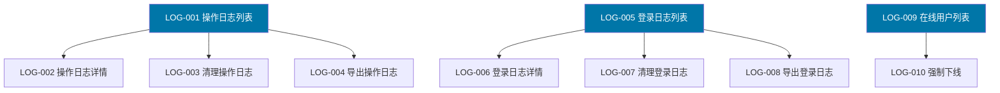
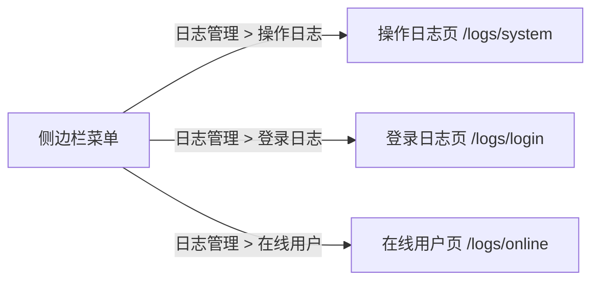
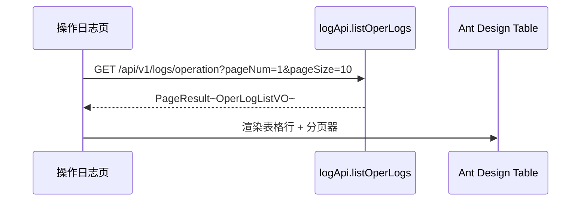
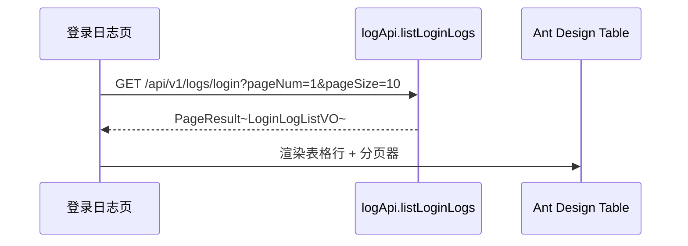
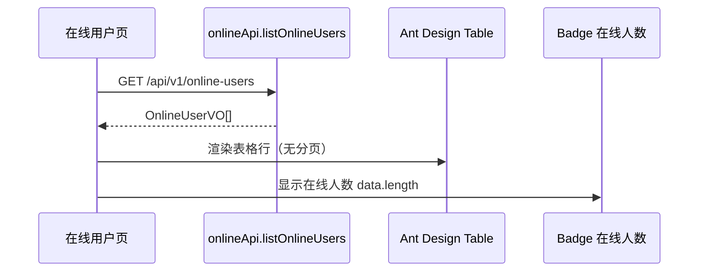
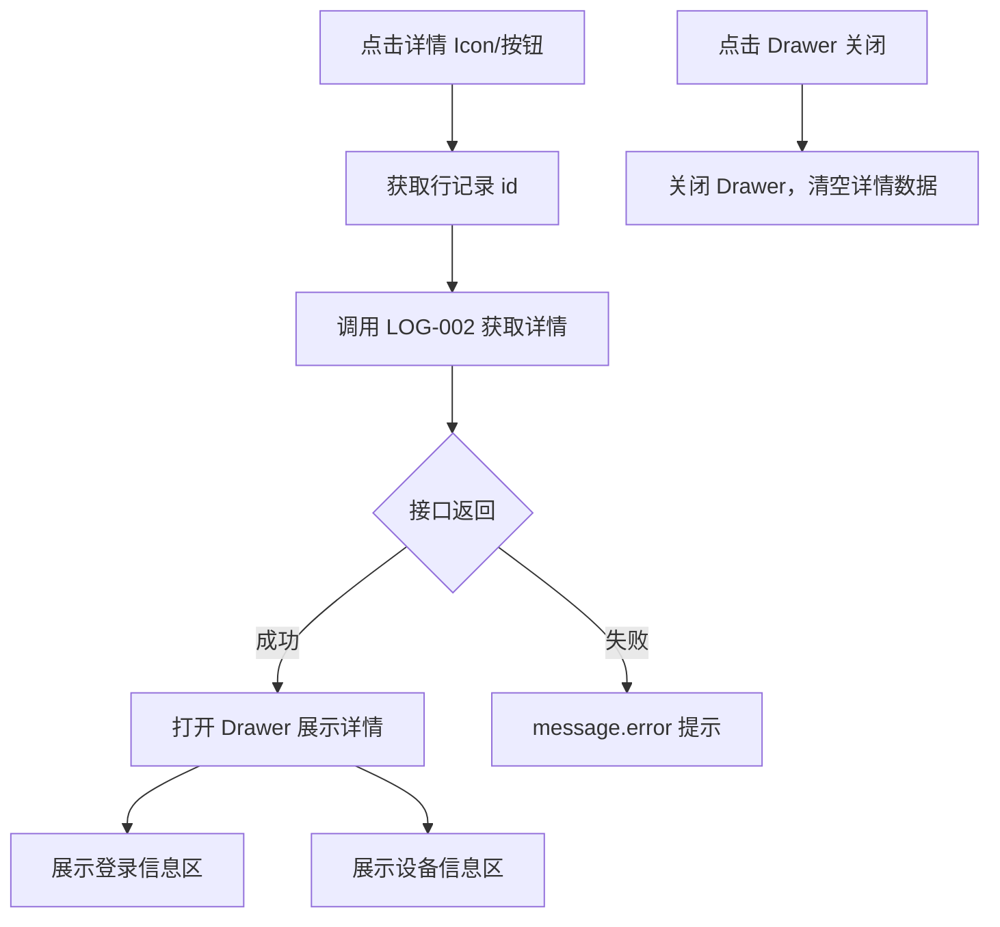
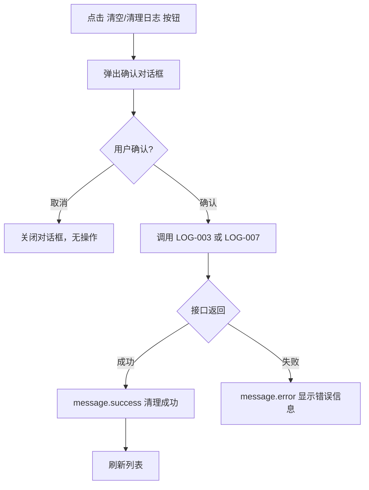
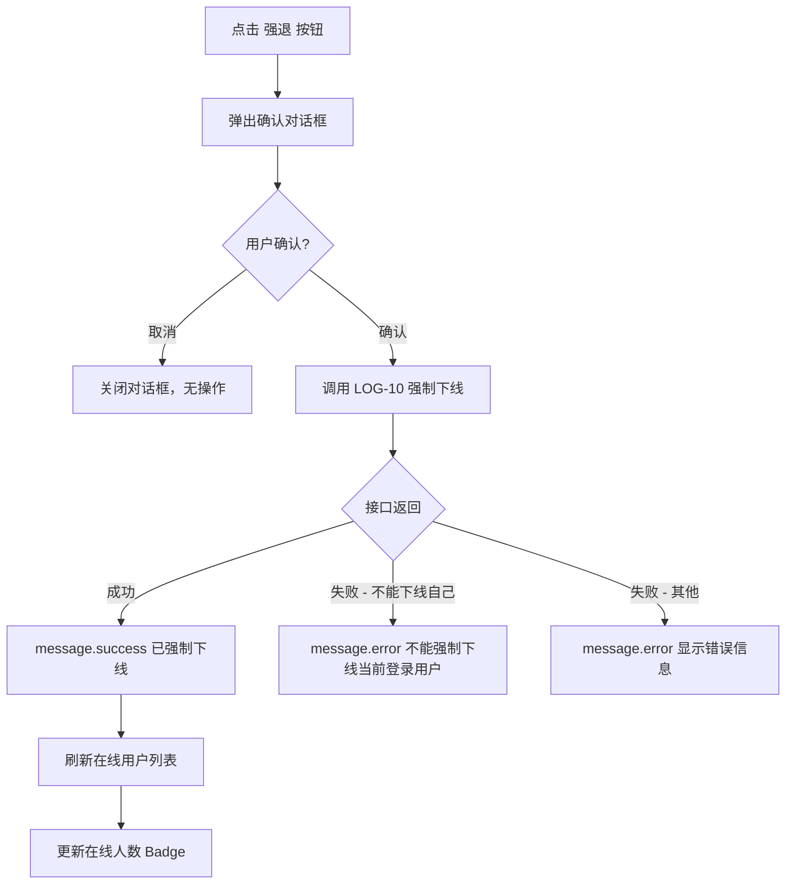
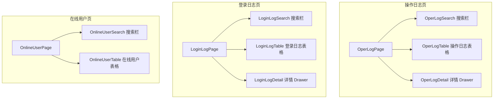

> **⚠️ 部分内容已过期（2026-09-01）**：本仓库已拿掉多租户机制，本文中「租户管理员
> 查看本租户日志」等权限层级描述已不适用（`ADMIN` 现为唯一角色，拥有全部日志权限）。
> 日志管理本身的页面/交互设计仍然有效。
> 原因见 `doc/design/modules/core/去多租户化-概要设计.md`。

# 前端详细设计文档

## 文档信息

| 项目 | 内容 |
|------|------|
| 文档名称 | 日志管理 前端详细设计文档 |
| 对应后端模块 | 日志管理（模块标识：log） |
| 参考文档 | `doc/design/modules/rbac/modules/日志管理/后端详细设计.md` |
| 静态页面 | `static_fe/src/app/pages/SystemLogs.tsx`、`static_fe/src/app/pages/LoginLogs.tsx`、`static_fe/src/app/pages/OnlineUsers.tsx` |
| 版本 | v1.1.0 |
| 创建日期 | 2026-04-11 |
| 最后更新 | 2026-09-03 |
| 负责人 | 前端开发（AI辅助） |

---

# 一、模块概述

## 1.1 模块功能描述

本模块前端实现**日志管理**三大功能页面：

- **操作日志**：展示系统操作日志列表，支持多条件搜索、分页浏览、详情查看（Drawer 抽屉展示完整请求参数、响应结果、错误信息、耗时）、日志清理和导出。
- **登录日志**：展示用户登录日志列表，支持按用户名、状态、时间范围搜索，点击查看详情（Drawer 展示完整设备信息、User-Agent），支持日志清理和导出。
- **在线用户**：展示当前在线用户列表，支持按用户名搜索，显示在线人数，管理员可强制下线指定用户。

**核心特点**：操作日志和登录日志均为**只读展示**，数据由后端 AOP 切面自动采集，前端仅负责查询和展示。在线用户页面提供唯一的写操作——强制下线。

## 1.2 模块边界与职责

| 职责 | 说明 |
|------|------|
| **本模块负责** | 操作日志列表页、登录日志列表页、在线用户页、日志详情 Drawer、日志清理确认、强制下线确认 |
| **其他模块负责** | 操作日志采集（后端 @Log 注解 + AOP 切面自动记录）、登录日志记录（AuthService 调用 LogService）、会话管理（Sa-Token） |

## 1.3 用户角色与权限

| 角色 | 可执行操作 | 对应权限标识 |
|------|----------|-------------|
| 平台超级管理员 | 所有操作 | system:operlog:* / system:loginlog:* / system:online:* |
| 租户管理员 | 查看本租户日志、清理日志、导出日志、查看在线用户、强制下线 | system:operlog:list / remove / export / detail；system:loginlog:list / remove / export / detail；system:online:list / forceLogout |
| 普通用户 | 无权限访问日志页面 | 无（菜单不显示） |

---

# 二、接口调用总览

## 2.1 接口引用说明

| 接口标识 | 接口名称 | HTTP方法 | 路径 | 主要用途 | 对应后端文档章节 |
|----------|----------|----------|------|----------|-----------------|
| LOG-001 | 操作日志列表 | GET | /api/v1/logs/operation | 操作日志页加载/搜索 | §7.2 LOG-001 |
| LOG-002 | 操作日志详情 | GET | /api/v1/logs/operation/{id} | 操作日志详情 Drawer | §7.2 LOG-002 |
| LOG-003 | 清理操作日志 | DELETE | /api/v1/logs/operation | 操作日志清空按钮 | §7.2 LOG-003 |
| LOG-004 | 导出操作日志 | GET | /api/v1/logs/operation/export | 操作日志导出按钮 | §7.2 LOG-004 |
| LOG-005 | 登录日志列表 | GET | /api/v1/logs/login | 登录日志页加载/搜索 | §7.2 LOG-005 |
| LOG-006 | 登录日志详情 | GET | /api/v1/logs/login/{id} | 登录日志详情 Drawer | §7.2 LOG-006 |
| LOG-007 | 清理登录日志 | DELETE | /api/v1/logs/login | 登录日志清理按钮 | §7.2 LOG-007 |
| LOG-008 | 导出登录日志 | GET | /api/v1/logs/login/export | 登录日志导出按钮 | §7.2 LOG-008 |
| LOG-009 | 在线用户列表 | GET | /api/v1/online-users | 在线用户页加载 | §7.2 LOG-009 |
| LOG-010 | 强制下线 | DELETE | /api/v1/online-users/{tokenId} | 在线用户强退按钮 | §7.2 LOG-010 |

**跨模块接口依赖：** 无。日志管理模块是纯查询展示模块，不依赖其他业务模块的接口。

## 2.2 接口依赖关系



**说明**：三个页面之间无接口依赖，各自独立。每个页面的详情/清理/导出操作依赖于列表数据。

---

# 三、页面详细设计

## 3.1 页面清单

| 页面名称 | 路由路径 | 页面功能描述 | 关联接口列表 |
|----------|----------|--------------|--------------|
| 操作日志页 | /logs/system | 操作日志列表查询、搜索筛选、详情查看、日志清理、日志导出 | LOG-001~004 |
| 登录日志页 | /logs/login | 登录日志列表查询、搜索筛选、详情查看、日志清理、日志导出 | LOG-005~008 |
| 在线用户页 | /logs/online | 在线用户列表查询、用户名搜索、强制下线 | LOG-009~010 |

## 3.2 页面跳转关系



**说明**：三个页面通过侧边栏菜单「日志管理」下的子菜单进入，互相独立，无页面跳转关系。

## 3.3 操作日志页设计

### 3.3.1 页面布局

页面采用上下结构：顶部为搜索筛选区（Card），底部为数据表格区（Card）。

**搜索筛选区字段：**

| 字段 | 组件 | 说明 |
|------|------|------|
| 操作用户 | Input | 模糊搜索操作人用户名 |
| 模块 | Select | 选项来自 LOG-011（`DISTINCT module`）。value 是库里的中文 key，label 走 `t(key, {defaultValue: key})`。精确匹配，不再用 MenuTableSelect |
| IP地址 | Input | 输入IP地址筛选 |
| 结果 | Select | 下拉选择：成功/失败 |
| 操作时间 | RangePicker | 时间范围选择 |
| 搜索按钮 | Button(primary) | 触发搜索 |
| 重置按钮 | Button(default) | 清空搜索条件 |

**表格区工具栏按钮：**

| 按钮 | 权限标识 | 位置 | 说明 |
|------|---------|------|------|
| 清空 | system:operlog:remove | 右侧 | 危险按钮，二次确认后调用 LOG-003 |
| 导出日志 | system:operlog:export | 右侧 | 调用 LOG-004 下载 Excel |

**表格列定义：**

| 列名 | 字段 | 宽度 | 渲染方式 | 说明 |
|------|------|------|---------|------|
| 日志编号 | id | 100px | 文本 | — |
| 操作用户 | operator | 120px | 文本 | — |
| 操作模块 | moduleLabel | 140px | 文本 | 后端译好的展示值；筛选参数仍传 `module`（中文 key） |
| 动作 | type | 100px | 文本 | INSERT/UPDATE/DELETE 等 |
| IP地址 | operatorIp | 150px | 文本 | — |
| 操作时间 | operateTime | 180px | 文本（格式化） | yyyy-MM-dd HH:mm:ss |
| 执行结果 | status | 100px | Tag | 1→绿色"成功"，0→红色"失败" |
| 详情 | — | — | Tooltip + Icon | Tooltip 显示简要描述，点击可展开详情 Drawer |

**分页**：使用 Ant Design Table 内置分页，支持 pageSize 切换。

## 3.4 登录日志页设计

### 3.4.1 页面布局

页面采用上下结构：顶部为搜索筛选区（Card），底部为数据表格区（Card）。

**搜索筛选区字段：**

| 字段 | 组件 | 说明 |
|------|------|------|
| 用户名 | Input | 输入用户名搜索 |
| 登录状态 | Select | 下拉选择：全部/成功/失败 |
| 登录时间 | RangePicker | 时间范围选择 |
| 查询按钮 | Button(primary) | 触发搜索 |
| 重置按钮 | Button(default) | 清空搜索条件 |

**表格区工具栏按钮：**

| 按钮 | 权限标识 | 位置 | 说明 |
|------|---------|------|------|
| 清理日志 | system:loginlog:remove | 右侧 | 危险按钮，二次确认后调用 LOG-007 |
| 导出 | system:loginlog:export | 右侧 | 调用 LOG-008 下载 Excel |
| 刷新 | 无 | 右侧 | 刷新当前列表 |

**表格列定义：**

| 列名 | 字段 | 宽度 | 渲染方式 | 说明 |
|------|------|------|---------|------|
| 用户名 | username | 100px | 文本 | — |
| 登录方式 | loginType | 100px | Tag | password→蓝色"密码"，sms→绿色"验证码" |
| 登录IP | loginIp | 120px | 文本 | — |
| 登录地点 | location | 120px | 文本 | — |
| 浏览器 | browser | 100px | 文本 | — |
| 操作系统 | os | 100px | 文本 | — |
| 登录状态 | status | 80px | Tag | 1→绿色"成功"，0→红色"失败" |
| 提示消息 | message | 150px | 文本 | — |
| 登录时间 | loginTime | 150px | 文本（格式化） | yyyy-MM-dd HH:mm:ss |
| 操作 | — | 80px | Button(link) | "详情"按钮，打开右侧 Drawer |

**分页**：使用 Ant Design Table 内置分页，支持 pageSize 切换。

### 3.4.2 登录日志详情 Drawer

点击"详情"按钮后，右侧打开 560px 宽 Drawer，展示两部分信息：

**登录信息区（Descriptions）：**

| 字段 | 标签 | 说明 |
|------|------|------|
| username | 用户名 | — |
| loginType | 登录方式 | password→"密码"，sms→"验证码" |
| loginIp | 登录IP | — |
| location | 登录地点 | — |
| browser | 浏览器 | — |
| os | 操作系统 | — |
| status | 登录状态 | 成功→绿色，失败→红色 |
| message | 提示消息 | — |
| loginTime | 登录时间 | 格式化显示 |

**设备信息区（Descriptions）：**

| 字段 | 标签 | 说明 |
|------|------|------|
| deviceType | 设备类型 | pc/mobile/tablet |
| userAgent | User-Agent | 等宽字体，代码块样式展示 |

## 3.5 在线用户页设计

### 3.5.1 页面布局

页面采用上下结构：顶部为搜索区 + 在线人数统计（Card），底部为数据表格区（Card）。

**搜索区字段：**

| 字段 | 组件 | 说明 |
|------|------|------|
| 用户名 | Input | 输入用户名搜索 |
| 搜索按钮 | Button(primary) | 触发搜索 |
| 重置按钮 | Button(default) | 清空搜索条件 |

**在线人数统计：** 搜索区右侧显示 Badge 组件，`当前在线: X 人`，实时显示在线人数。

**表格列定义：**

| 列名 | 字段 | 宽度 | 渲染方式 | 说明 |
|------|------|------|---------|------|
| 用户名 | username | 100px | 文本 | — |
| 昵称 | nickname | 100px | 文本 | — |
| 部门 | deptName | 120px | 文本 | — |
| 登录IP | loginIp | 120px | 文本 | — |
| 登录地点 | location | 100px | 文本 | — |
| 浏览器 | browser | 100px | 文本 | — |
| 操作系统 | os | 100px | 文本 | — |
| 登录时间 | loginTime | 150px | 文本（格式化） | yyyy-MM-dd HH:mm:ss |
| 操作 | — | 80px | Button(link, danger) | "强退"按钮，权限控制显示/隐藏 |

**分页**：在线用户数据量有限，不分页（`pagination: false`）。

---

# 四、页面初始化流程设计

## 4.1 操作日志页初始化流程

### 4.1.1 接口调用序列

| 顺序 | 接口 | 并行/串行 | 说明 |
|------|------|----------|------|
| 1 | LOG-001 操作日志列表 | — | 加载默认分页数据（pageNum=1, pageSize=10） |

> 操作日志页仅需调用一个接口，无并行依赖。

### 4.1.2 初始化时序图



### 4.1.3 初始化数据流

1. 接口返回 `PageResult<OperLogListVO>` → `list` 渲染表格行，`total` 渲染分页器
2. 表格按 `operateTime` 降序展示（后端默认排序）

## 4.2 登录日志页初始化流程

### 4.2.1 接口调用序列

| 顺序 | 接口 | 并行/串行 | 说明 |
|------|------|----------|------|
| 1 | LOG-005 登录日志列表 | — | 加载默认分页数据（pageNum=1, pageSize=10） |

### 4.2.2 初始化时序图



### 4.2.3 初始化数据流

1. 接口返回 `PageResult<LoginLogListVO>` → `list` 渲染表格行，`total` 渲染分页器
2. 表格按 `loginTime` 降序展示（后端默认排序）

## 4.3 在线用户页初始化流程

### 4.3.1 接口调用序列

| 顺序 | 接口 | 并行/串行 | 说明 |
|------|------|----------|------|
| 1 | LOG-009 在线用户列表 | — | 加载全部在线用户数据 |

### 4.3.2 初始化时序图



### 4.3.3 初始化数据流

1. 接口返回 `OnlineUserVO[]` → 直接渲染为表格行
2. 数据数组长度 → 在线人数 Badge 展示

---

# 五、用户操作流程设计

## 5.1 操作-接口映射表

### 5.1.1 操作日志页操作

| 用户操作描述 | 触发组件 | 调用接口 | 请求参数构造 | 响应数据处理 | 异常处理 |
|-------------|---------|---------|-------------|-------------|---------|
| 点击搜索按钮 | 搜索按钮 | LOG-001 | 从搜索表单收集 module, type, operator, status, startTime, endTime | 重置表格数据和分页 | message.error 提示 |
| 点击重置按钮 | 重置按钮 | LOG-001 | 清空搜索表单，使用默认分页参数重新查询 | — | — |
| 翻页/切换 pageSize | 分页器 | LOG-001 | 携带当前搜索条件 + 新的 pageNum/pageSize | 刷新表格 | message.error 提示 |
| 查看日志详情 | 详情 Icon | LOG-002 | 取行记录 id | 打开 Drawer 展示详情 | message.error 提示 |
| 清空操作日志 | 清空按钮 | LOG-003 | { beforeDays: 30 } | 二次确认后调用，成功刷新列表 | 二次确认阻止误操作 |
| 导出操作日志 | 导出按钮 | LOG-004 | 携带当前搜索条件 | 浏览器下载 Excel 文件 | message.error 提示 |

### 5.1.2 登录日志页操作

| 用户操作描述 | 触发组件 | 调用接口 | 请求参数构造 | 响应数据处理 | 异常处理 |
|-------------|---------|---------|-------------|-------------|---------|
| 点击查询按钮 | 查询按钮 | LOG-005 | 从搜索表单收集 username, status, startTime, endTime | 重置表格数据和分页 | message.error 提示 |
| 点击重置按钮 | 重置按钮 | LOG-005 | 清空搜索表单，使用默认分页参数重新查询 | — | — |
| 翻页/切换 pageSize | 分页器 | LOG-005 | 携带当前搜索条件 + 新的 pageNum/pageSize | 刷新表格 | message.error 提示 |
| 查看日志详情 | 详情按钮 | LOG-006 | 取行记录 id | 打开 Drawer 展示详情 | message.error 提示 |
| 清理登录日志 | 清理日志按钮 | LOG-007 | { beforeDays: 30 } | 二次确认后调用，成功刷新列表 | 二次确认阻止误操作 |
| 导出登录日志 | 导出按钮 | LOG-008 | 携带当前搜索条件 | 浏览器下载 Excel 文件 | message.error 提示 |
| 刷新列表 | 刷新按钮 | LOG-005 | 使用当前搜索条件和分页参数 | 刷新表格 | message.error 提示 |

### 5.1.3 在线用户页操作

| 用户操作描述 | 触发组件 | 调用接口 | 请求参数构造 | 响应数据处理 | 异常处理 |
|-------------|---------|---------|-------------|-------------|---------|
| 点击搜索按钮 | 搜索按钮 | LOG-009 | 携带 username 参数 | 刷新表格 + 更新在线人数 | message.error 提示 |
| 点击重置按钮 | 重置按钮 | LOG-009 | 清空搜索条件，重新查询 | — | — |
| 强制下线用户 | 强退按钮 | LOG-010 | 取行记录 tokenId | 二次确认后调用，成功刷新列表 + 更新在线人数 | message.error 提示（不能下线自己） |

## 5.2 复杂操作流程

### 5.2.1 操作日志详情查看流程



**说明**：操作日志详情展示完整的请求参数（JSON 格式化）、响应结果、错误消息、耗时等信息。

### 5.2.2 日志清理流程



**说明**：清理操作使用 `Modal.confirm` 二次确认，文案为"此操作将清空所有日志数据且无法恢复"，按钮使用危险样式。清理默认保留最近 30 天日志（beforeDays=30）。

### 5.2.3 强制下线流程



**说明**：强制下线使用 `Modal.confirm` 二次确认，文案为"即将强制下线用户 {username}，这会中断其当前所有操作"。确认后调用 LOG-010，传递 `tokenId` 路径参数。

---

# 六、组件设计

## 6.1 组件结构图



## 6.2 组件清单

| 组件名称 | 组件类型 | 主要职责 | 直接调用接口 | 父组件 | 子组件 |
|----------|----------|----------|-------------|--------|--------|
| OperLogPage | 页面 | 操作日志页布局和状态管理 | — | App | OperLogSearch, OperLogTable, OperLogDetail |
| OperLogSearch | 业务组件 | 操作日志搜索表单 | — | OperLogPage | — |
| OperLogTable | 业务组件 | 操作日志列表表格、工具栏按钮 | LOG-001, LOG-003, LOG-004 | OperLogPage | — |
| OperLogDetail | 业务组件 | 操作日志详情 Drawer | LOG-002 | OperLogPage | — |
| LoginLogPage | 页面 | 登录日志页布局和状态管理 | — | App | LoginLogSearch, LoginLogTable, LoginLogDetail |
| LoginLogSearch | 业务组件 | 登录日志搜索表单 | — | LoginLogPage | — |
| LoginLogTable | 业务组件 | 登录日志列表表格、工具栏按钮 | LOG-005, LOG-007, LOG-008 | LoginLogPage | — |
| LoginLogDetail | 业务组件 | 登录日志详情 Drawer | LOG-006 | LoginLogPage | — |
| OnlineUserPage | 页面 | 在线用户页布局和状态管理 | — | App | OnlineUserSearch, OnlineUserTable |
| OnlineUserSearch | 业务组件 | 在线用户搜索表单 + 在线人数 Badge | — | OnlineUserPage | — |
| OnlineUserTable | 业务组件 | 在线用户列表表格、强退按钮 | LOG-009, LOG-010 | OnlineUserPage | — |

## 6.3 关键组件详细设计

### 6.3.1 OperLogDetail 组件（操作日志详情 Drawer）

- **接口调用设计**：打开时调用 `LOG-002` 获取详情
- **Props 设计**：

| Prop | 类型 | 说明 |
|------|------|------|
| open | boolean | Drawer 显隐 |
| logId | number \| null | 日志 ID，null 时关闭 |
| onClose | () => void | 关闭回调 |

- **状态管理**：
  - `detail: OperLogDetailVO | null` — 详情数据
  - `loading: boolean` — 加载状态
- **展示内容**：
  - 操作信息区：模块、类型、描述、操作人、操作IP、地点、请求方法、请求URL
  - 请求参数区：JSON 格式化展示（代码块样式）
  - 响应结果区：JSON 格式化展示（代码块样式）
  - 错误信息区：仅操作失败时展示
  - 执行信息区：耗时（ms）、操作状态、操作时间

### 6.3.2 LoginLogDetail 组件（登录日志详情 Drawer）

- **接口调用设计**：打开时调用 `LOG-006` 获取详情
- **Props 设计**：

| Prop | 类型 | 说明 |
|------|------|------|
| open | boolean | Drawer 显隐 |
| logId | number \| null | 日志 ID，null 时关闭 |
| onClose | () => void | 关闭回调 |

- **状态管理**：
  - `detail: LoginLogDetailVO | null` — 详情数据
  - `loading: boolean` — 加载状态
- **展示内容**：
  - 登录信息区（Descriptions, column=1）：用户名、登录方式、登录IP、登录地点、浏览器、操作系统、登录状态、提示消息、登录时间
  - 设备信息区（Descriptions, column=1）：设备类型、User-Agent（代码块样式）

### 6.3.3 OperLogSearch 组件

- **接口调用设计**：无直接调用
- **Props 设计**：

| Prop | 类型 | 说明 |
|------|------|------|
| onSearch | (values: OperLogQueryParams) => void | 搜索回调 |
| onReset | () => void | 重置回调 |

- **表单字段**：

| 字段 | 组件 | 说明 |
|------|------|------|
| operator | Input | 操作用户名，placeholder="请输入用户名" |
| module | Select | 操作模块下拉选择 |
| operatorIp | Input | IP地址，placeholder="请输入IP" |
| status | Select | 执行结果：成功/失败 |
| dateRange | RangePicker | 操作时间范围 |

### 6.3.4 OnlineUserTable 组件

- **接口调用设计**：
  - 初始化时调用 `LOG-009` 加载列表
  - 强制下线调用 `LOG-010`
- **Props 设计**：

| Prop | 类型 | 说明 |
|------|------|------|
| searchParams | { username?: string } | 搜索参数 |
| onCountChange | (count: number) => void | 在线人数变更回调 |

- **事件设计**：
  - 点击"强退"按钮 → 二次确认 → 调用 LOG-010 → 成功后刷新列表
  - 强退按钮权限控制：`hasPermission('system:online:forceLogout')`

---

# 七、数据转换设计

## 7.1 请求数据构造

### 7.1.1 数据转换规则

| 接口 | 前端表单字段 | 接口请求字段 | 转换规则 |
|------|------------|------------|---------|
| LOG-001 | operator, module, operatorIp, status, dateRange | pageNum, pageSize, module, operator, status, startTime, endTime | dateRange[0]→startTime, dateRange[1]→endTime；空值不传 |
| LOG-003 | — | beforeDays | 固定传 30 |
| LOG-004 | 同 LOG-001 搜索条件 | 同 LOG-001 | 导出携带当前搜索条件 |
| LOG-005 | username, status, dateRange | pageNum, pageSize, username, status, startTime, endTime | dateRange 拆分为 startTime/endTime；空值不传 |
| LOG-007 | — | beforeDays | 固定传 30 |
| LOG-008 | 同 LOG-005 搜索条件 | 同 LOG-005 | 导出携带当前搜索条件 |
| LOG-009 | username | username | 空值不传 |
| LOG-010 | tokenId | tokenId（路径参数） | 直接取行记录的 tokenId |

### 7.1.2 转换函数设计

```
// 搜索参数构造（过滤空值）
buildOperLogQuery(formValues, pagination): OperLogQueryDTO {
  return {
    pageNum: pagination.pageNum,
    pageSize: pagination.pageSize,
    module: formValues.module || undefined,
    operator: formValues.operator || undefined,
    status: formValues.status !== undefined ? formValues.status : undefined,
    startTime: formValues.dateRange?.[0]?.format('YYYY-MM-DD HH:mm:ss'),
    endTime: formValues.dateRange?.[1]?.format('YYYY-MM-DD HH:mm:ss'),
  }
}

buildLoginLogQuery(formValues, pagination): LoginLogQueryDTO {
  return {
    pageNum: pagination.pageNum,
    pageSize: pagination.pageSize,
    username: formValues.username || undefined,
    status: formValues.status !== undefined ? formValues.status : undefined,
    startTime: formValues.dateRange?.[0]?.format('YYYY-MM-DD HH:mm:ss'),
    endTime: formValues.dateRange?.[1]?.format('YYYY-MM-DD HH:mm:ss'),
  }
}
```

## 7.2 响应数据处理

### 7.2.1 数据解析规则

| 接口 | 响应结构 | 解析规则 |
|------|---------|---------|
| LOG-001 | `PageResult<OperLogListVO>` | list → 表格 dataSource；total → 分页 total |
| LOG-002 | `OperLogDetailVO` | 整体存入详情状态，渲染 Drawer |
| LOG-003 | 删除条数 | 不需要解析，操作成功后刷新列表 |
| LOG-004 | 二进制流 | 浏览器触发文件下载 |
| LOG-005 | `PageResult<LoginLogListVO>` | list → 表格 dataSource；total → 分页 total |
| LOG-006 | `LoginLogDetailVO` | 整体存入详情状态，渲染 Drawer |
| LOG-007 | 删除条数 | 不需要解析，操作成功后刷新列表 |
| LOG-008 | 二进制流 | 浏览器触发文件下载 |
| LOG-009 | `OnlineUserVO[]` | 直接渲染表格 dataSource，数组长度为在线人数 |
| LOG-010 | 空 | 不需要解析，操作成功后刷新列表 |

### 7.2.2 数据格式化

```
// 操作类型映射
operTypeMap: Record<string, string> → {
  INSERT: '新增', UPDATE: '修改', DELETE: '删除',
  SELECT: '查询', EXPORT: '导出', IMPORT: '导入', OTHER: '其他'
}

// 登录方式映射
loginTypeMap: Record<string, string> → {
  password: '密码', sms: '验证码', sso: '单点登录'
}

// 登录方式 Tag 颜色
loginTypeColor(type: string): string → {
  password: 'blue', sms: 'green', sso: 'orange'
}

// 状态 Tag 颜色
statusTagProps(status: number): { color: string, text: string } → {
  1: { color: 'success', text: '成功' },
  0: { color: 'error', text: '失败' }
}

// 时间格式化
formatTime(datetime: string): string → "2026-04-11 10:30:00"

// 耗时格式化
formatCostTime(ms: number): string → `${ms}ms`

// JSON 格式化（请求参数/响应结果展示）
formatJson(jsonStr: string): string → JSON.stringify(JSON.parse(jsonStr), null, 2)
```

---

# 八、状态管理设计

## 8.1 全局状态设计

日志管理模块不涉及全局状态。Token 和用户信息由 UserStore（Zustand）统一管理，日志页面仅读取权限信息进行按钮级控制。

## 8.2 页面状态设计

### 8.2.1 操作日志页状态

```typescript
interface OperLogPageState {
  // 列表数据
  list: OperLogListVO[];
  total: number;
  pageNum: number;
  pageSize: number;
  loading: boolean;

  // 搜索条件
  searchParams: {
    module?: string;
    operator?: string;
    operatorIp?: string;
    status?: number;
    startTime?: string;
    endTime?: string;
  };

  // 详情 Drawer
  detailOpen: boolean;
  detailLoading: boolean;
  detailData: OperLogDetailVO | null;
}
```

### 8.2.2 登录日志页状态

```typescript
interface LoginLogPageState {
  // 列表数据
  list: LoginLogListVO[];
  total: number;
  pageNum: number;
  pageSize: number;
  loading: boolean;

  // 搜索条件
  searchParams: {
    username?: string;
    status?: number;
    startTime?: string;
    endTime?: string;
  };

  // 详情 Drawer
  detailOpen: boolean;
  detailLoading: boolean;
  detailData: LoginLogDetailVO | null;
}
```

### 8.2.3 在线用户页状态

```typescript
interface OnlineUserPageState {
  // 列表数据
  list: OnlineUserVO[];
  loading: boolean;
  onlineCount: number;

  // 搜索条件
  searchParams: {
    username?: string;
  };
}
```

## 8.3 组件状态设计

| 组件 | 内部状态 | 说明 |
|------|---------|------|
| OperLogSearch | 表单值 | 由 Ant Design Form 管理 |
| LoginLogSearch | 表单值 | 由 Ant Design Form 管理 |
| OnlineUserSearch | 表单值 | 由 Ant Design Form 管理 |
| OperLogDetail | loading, detail | 加载中、详情数据 |
| LoginLogDetail | loading, detail | 加载中、详情数据 |

## 8.4 状态更新规则

| 触发事件 | 更新动作 |
|---------|---------|
| 操作日志页初始化 | 调用 LOG-001 → 更新 list, total, loading |
| 操作日志搜索 | 更新 searchParams → 调用 LOG-001 → 更新 list, total, pageNum 重置为 1 |
| 操作日志翻页 | 更新 pageNum → 调用 LOG-001 → 更新 list |
| 操作日志详情打开 | 设置 detailOpen=true → 调用 LOG-002 → 更新 detailData |
| 操作日志详情关闭 | 设置 detailOpen=false, detailData=null |
| 操作日志清理 | 调用 LOG-003 → 成功后调用 LOG-001 刷新列表 |
| 登录日志页 | 同操作日志页模式，使用 LOG-005/006/007 |
| 在线用户页初始化 | 调用 LOG-009 → 更新 list, onlineCount |
| 在线用户搜索 | 更新 searchParams → 调用 LOG-009 → 更新 list, onlineCount |
| 强制下线 | 调用 LOG-010 → 成功后调用 LOG-009 刷新列表和 onlineCount |

---

# 九、模块安全规范

## 9.1 认证与授权

### 9.1.1 权限控制

| 页面/组件 | 权限标识 | 无权限处理 |
|-----------|---------|-----------|
| 操作日志菜单 | system:operlog:list | 菜单不显示 |
| 操作日志清空按钮 | system:operlog:remove | 隐藏按钮 |
| 操作日志导出按钮 | system:operlog:export | 隐藏按钮 |
| 操作日志详情查看 | system:operlog:detail | 详情 Icon/按钮不显示 |
| 登录日志菜单 | system:loginlog:list | 菜单不显示 |
| 登录日志清理按钮 | system:loginlog:remove | 隐藏按钮 |
| 登录日志导出按钮 | system:loginlog:export | 隐藏按钮 |
| 登录日志详情查看 | system:loginlog:detail | 详情按钮不显示 |
| 在线用户菜单 | system:online:list | 菜单不显示 |
| 在线用户强退按钮 | system:online:forceLogout | 隐藏按钮 |

**权限判断方式**：使用 `hasPermission(perm)` 函数，从 UserStore.permissions 数组中查找匹配。按钮级权限通过条件渲染控制。

## 9.2 敏感数据处理

### 9.2.1 敏感数据展示

| 数据类型 | 脱敏规则 | 完整展示条件 |
|---------|---------|-------------|
| 请求参数（操作日志详情） | 后端已脱敏（password 置空） | 详情 Drawer 展示已脱敏的 JSON |
| 响应结果（操作日志详情） | 完整展示 | 仅在详情 Drawer 展示 |
| User-Agent（登录日志详情） | 完整展示 | 仅在详情 Drawer 展示 |

> 注：日志数据中不含密码明文。后端 AOP 切面在记录操作日志时已将 password/oldPassword/newPassword 字段置空。

## 9.3 安全检查清单

- [x] 所有接口请求通过 Axios 拦截器自动携带 Token
- [x] 401 响应自动跳转登录页
- [x] 按钮级权限通过权限标识控制显隐（清空/清理/导出/强退）
- [x] 日志清理操作需二次确认
- [x] 强制下线操作需二次确认
- [x] 强制下线自己时后端拒绝，前端展示错误提示
- [x] 日志详情不展示密码明文（后端已脱敏）

---

# 十、错误处理设计

## 10.1 接口调用错误处理

### 10.1.1 错误分类与处理

| 错误类型 | HTTP 状态码 | 业务错误码 | 处理策略 |
|---------|-----------|----------|---------|
| 未登录 | 401 | 30001 | 清除 Store，跳转 /login |
| 无权限 | 403 | 30003 | message.error('无操作权限') |
| 参数校验失败 | 200 | 10002 | message.error(具体字段错误) |
| 日志不存在 | 200 | — | message.error('日志不存在') |
| 清理天数不足30天 | 200 | 10002 | message.error('至少保留30天日志') |
| 不能下线自己 | 200 | 10002 | message.error('不能强制下线当前登录用户') |
| 网络异常 | — | — | message.error('网络异常，请稍后重试') |
| 服务器错误 | 500 | — | message.error('服务器异常') |

### 10.1.2 重试机制

| 接口 | 是否重试 | 重试策略 |
|------|---------|---------|
| LOG-001 操作日志列表 | 是 | TanStack Query 自动重试 1 次 |
| LOG-002 操作日志详情 | 是 | TanStack Query 自动重试 1 次 |
| LOG-003 清理操作日志 | 否 | 直接展示错误 |
| LOG-004 导出操作日志 | 是 | 自动重试 1 次 |
| LOG-005 登录日志列表 | 是 | TanStack Query 自动重试 1 次 |
| LOG-006 登录日志详情 | 是 | TanStack Query 自动重试 1 次 |
| LOG-007 清理登录日志 | 否 | 直接展示错误 |
| LOG-008 导出登录日志 | 是 | 自动重试 1 次 |
| LOG-009 在线用户列表 | 是 | TanStack Query 自动重试 1 次 |
| LOG-010 强制下线 | 否 | 直接展示错误 |

## 10.2 用户操作错误处理

| 场景 | 处理方案 |
|------|---------|
| 搜索无结果 | 表格显示 Ant Design Table 空状态（Empty） |
| 日志详情加载失败 | Drawer 内展示错误提示，不关闭 Drawer |
| 清理日志后列表为空 | 正常显示空表格 |
| 强制下线失败 | message.error 展示后端错误信息 |
| 导出文件失败 | message.error('导出失败，请稍后重试') |
| 网络断开 | 全局 Axios 拦截器 message.error |

---

# 十一、性能优化设计

## 11.1 接口调用优化

### 11.1.1 接口缓存

| 接口 | 缓存策略 | 缓存时间 |
|------|---------|---------|
| LOG-001 操作日志列表 | 不缓存 | 每次搜索/翻页重新请求 |
| LOG-002 操作日志详情 | TanStack Query staleTime 5min | 5 分钟内不重复请求同一条日志 |
| LOG-005 登录日志列表 | 不缓存 | 每次搜索/翻页重新请求 |
| LOG-006 登录日志详情 | TanStack Query staleTime 5min | 5 分钟内不重复请求同一条日志 |
| LOG-009 在线用户列表 | 不缓存 | 每次加载/搜索重新请求（实时数据） |

### 11.1.2 导出优化

- 导出操作使用 Blob 流式下载，避免前端内存占用过大
- 导出按钮添加 loading 状态，防止重复点击

## 11.2 组件渲染优化

| 优化项 | 策略 |
|-------|------|
| Drawer 懒渲染 | `destroyOnClose: true`，关闭时销毁内部状态 |
| 表格滚动 | `scroll={{ x: 1000 }}` 或 `scroll={{ x: 1200 }}`，避免列过多时挤压 |
| 搜索防抖 | 用户名输入 300ms 防抖（如有即时搜索需求） |
| JSON 格式化 | 操作日志详情中的请求参数和响应结果使用虚拟列表渲染（数据量超大时） |

---

# 十二、测试设计

## 12.1 接口调用测试

### 12.1.1 正常流程测试

| 测试场景 | 前置条件 | 操作步骤 | 预期结果 |
|---------|---------|---------|---------|
| 操作日志列表加载 | 已登录，有操作日志 | 进入操作日志页 | 表格显示日志数据，分页正确 |
| 操作日志搜索 | 有多条不同模块日志 | 选择模块"用户管理"，点击搜索 | 仅显示用户管理模块的日志 |
| 操作日志按结果筛选 | 有成功和失败日志 | 选择结果"失败"，点击搜索 | 仅显示失败的日志 |
| 操作日志按时间筛选 | 有不同时间日志 | 选择时间范围，点击搜索 | 仅显示该时间范围内的日志 |
| 操作日志详情查看 | 日志存在 | 点击详情 Icon | 打开 Drawer，展示完整详情 |
| 操作日志清理 | 有操作日志 | 点击清空按钮，确认 | 提示清理成功，列表刷新 |
| 操作日志导出 | 有操作日志 | 点击导出按钮 | 浏览器下载 Excel 文件 |
| 登录日志列表加载 | 已登录，有登录日志 | 进入登录日志页 | 表格显示日志数据，分页正确 |
| 登录日志按用户名搜索 | 有多条不同用户日志 | 输入用户名，点击查询 | 仅显示该用户的登录日志 |
| 登录日志按状态筛选 | 有成功和失败日志 | 选择状态"失败"，点击查询 | 仅显示失败的登录日志 |
| 登录日志详情查看 | 日志存在 | 点击详情按钮 | 打开右侧 Drawer，展示登录信息和设备信息 |
| 登录日志清理 | 有登录日志 | 点击清理日志按钮，确认 | 提示清理成功，列表刷新 |
| 在线用户列表加载 | 多人在线 | 进入在线用户页 | 表格显示在线用户，Badge 显示正确人数 |
| 在线用户搜索 | 多人在线 | 输入用户名，点击搜索 | 仅显示匹配的在线用户 |
| 强制下线 | 其他用户在线 | 点击强退按钮，确认 | 提示已强制下线，列表刷新，人数减少 |

### 12.1.2 异常流程测试

| 测试场景 | 前置条件 | 操作步骤 | 预期结果 |
|---------|---------|---------|---------|
| 操作日志搜索无结果 | 无匹配数据 | 搜索不存在的操作人 | 表格显示空状态 |
| 操作日志详情加载失败 | 网络异常 | 点击详情 | Drawer 内展示错误提示 |
| 清理日志天数不足30天 | — | 前端默认传 30 天，无此场景 | 后端校验已通过 |
| 强制下线自己 | — | 点击自己账号的强退按钮 | message.error('不能强制下线当前登录用户') |
| 强制下线已离线用户 | 用户刚下线 | 点击强退 | message.error 提示 |
| 导出无数据 | 日志表为空 | 点击导出 | 下载空 Excel 或提示无数据 |
| Token 过期 | — | 操作任意接口 | 自动跳转登录页 |
| 网络断开 | — | 操作任意接口 | message.error 网络异常提示 |

### 12.1.3 权限测试

| 测试场景 | 前置条件 | 操作步骤 | 预期结果 |
|---------|---------|---------|---------|
| 无操作日志查看权限 | 用户角色无 system:operlog:list | 访问操作日志页 | 菜单不显示/页面无权限提示 |
| 无清空权限 | 用户角色无 system:operlog:remove | 进入操作日志页 | 清空按钮不显示 |
| 无导出权限 | 用户角色无 system:operlog:export | 进入操作日志页 | 导出按钮不显示 |
| 无详情查看权限 | 用户角色无 system:operlog:detail | 进入操作日志页 | 详情 Icon 不显示 |
| 无强制下线权限 | 用户角色无 system:online:forceLogout | 进入在线用户页 | 强退按钮不显示 |

---

# 附录

## A. 接口详细说明

### A.1 LOG-001 操作日志列表

- **调用时机**：页面初始化、搜索、翻页、切换 pageSize
- **请求参数**：`{ pageNum, pageSize, module?, operator?, status?, startTime?, endTime? }`
- **响应处理**：list → 表格数据源；total → 分页总数
- **错误处理**：message.error 提示

### A.2 LOG-002 操作日志详情

- **调用时机**：点击详情 Icon
- **请求参数**：路径参数 `id`
- **响应处理**：整体存入详情状态，Drawer 展示
- **错误处理**：Drawer 内展示错误提示

### A.3 LOG-003 清理操作日志

- **调用时机**：点击清空按钮并二次确认
- **请求参数**：`{ beforeDays: 30 }`
- **响应处理**：关闭确认框 → message.success → 刷新列表
- **错误处理**：message.error 显示错误信息

### A.4 LOG-005 登录日志列表

- **调用时机**：页面初始化、搜索、翻页、切换 pageSize、刷新
- **请求参数**：`{ pageNum, pageSize, username?, status?, startTime?, endTime? }`
- **响应处理**：list → 表格数据源；total → 分页总数
- **错误处理**：message.error 提示

### A.5 LOG-006 登录日志详情

- **调用时机**：点击详情按钮
- **请求参数**：路径参数 `id`
- **响应处理**：整体存入详情状态，Drawer 展示登录信息 + 设备信息
- **错误处理**：Drawer 内展示错误提示

### A.6 LOG-009 在线用户列表

- **调用时机**：页面初始化、搜索、强制下线后刷新
- **请求参数**：`{ username? }`
- **响应处理**：数组直接渲染表格，长度为在线人数
- **错误处理**：message.error 提示

### A.7 LOG-010 强制下线

- **调用时机**：点击强退按钮并二次确认
- **请求参数**：路径参数 `tokenId`
- **响应处理**：关闭确认框 → message.success → 刷新列表 → 更新在线人数
- **错误处理**：message.error 显示错误信息（不能下线自己等）

## B. 变更记录

| 版本 | 日期 | 修改人 | 变更描述 | 变更原因 | 评审人 |
|------|------|--------|---------|---------|--------|
| v1.0.0 | 2026-04-11 | 前端开发（AI） | 初始版本 | 日志管理前端详细设计 | 待评审 |
| v1.1.0 | 2026-09-03 | 技术经理（AI辅助） | 模块筛选改为 LOG-011 下拉；列绑 `moduleLabel` | 对齐 i18n §4.8.1 | 待评审 |
