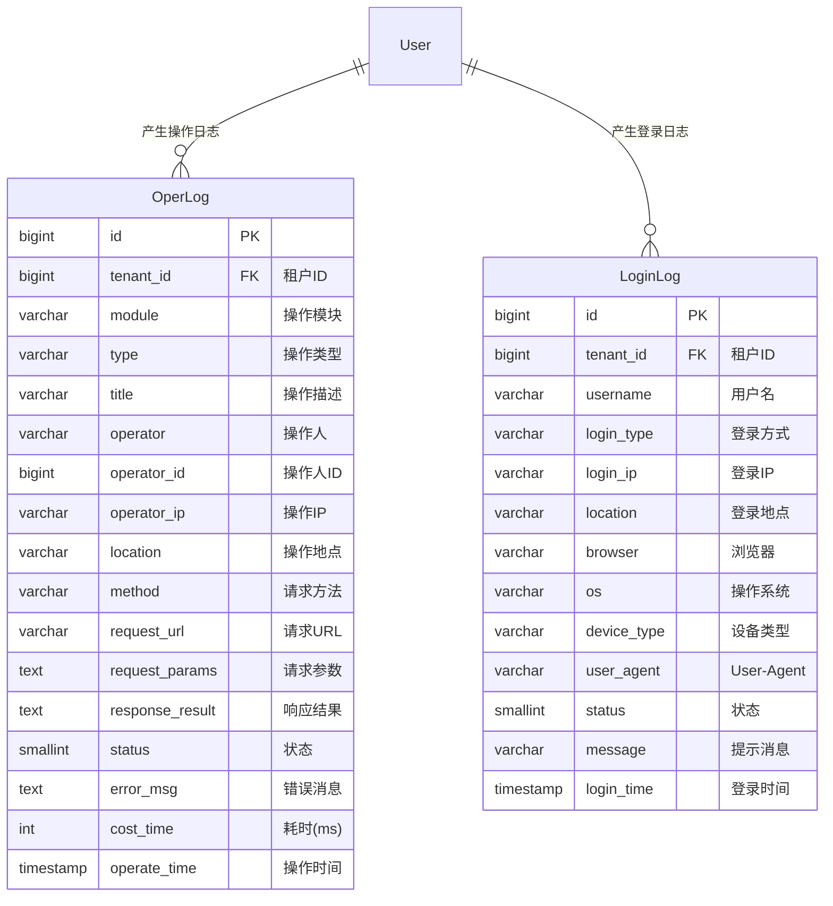
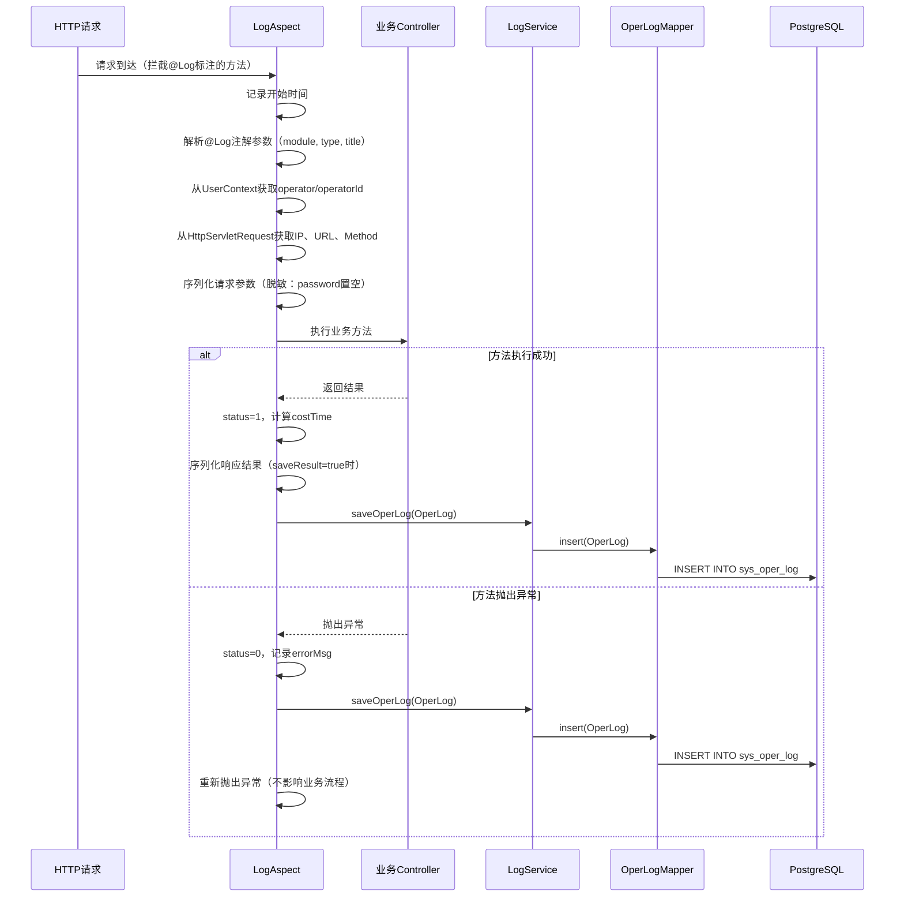
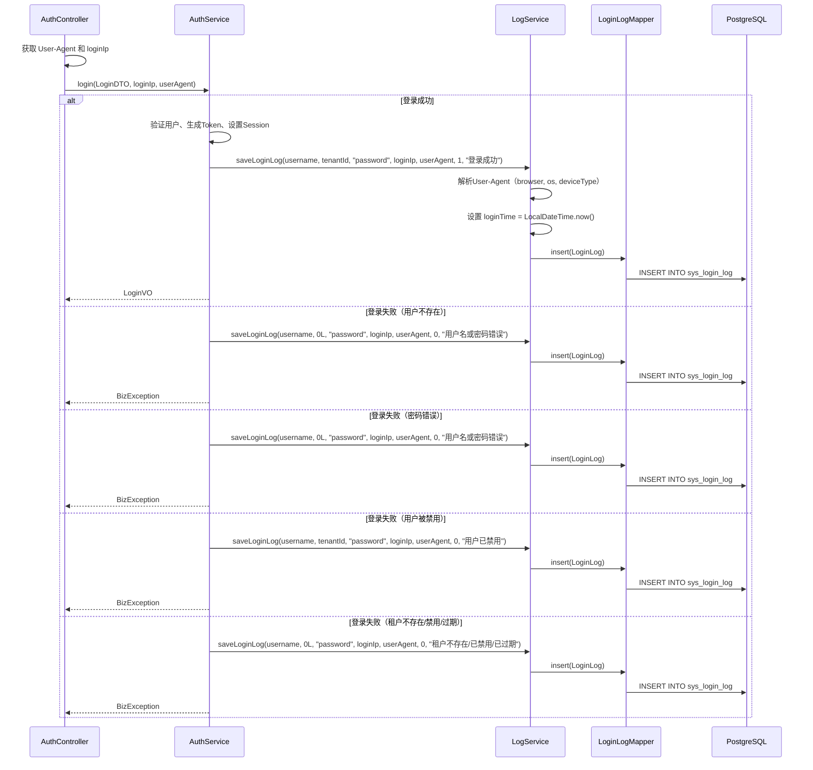
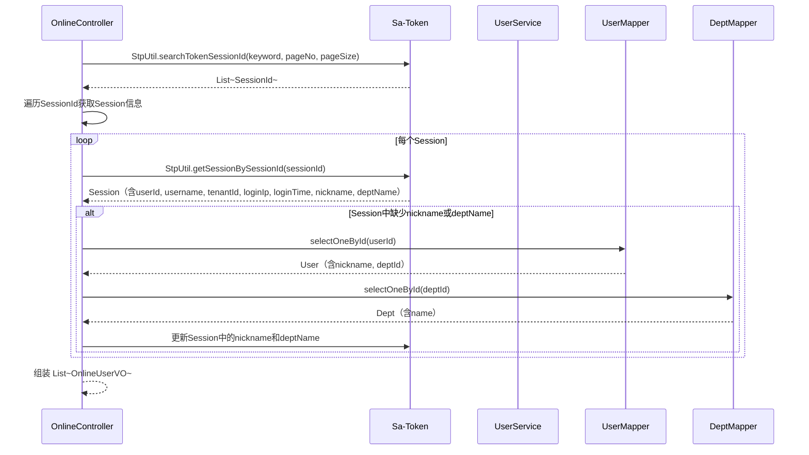
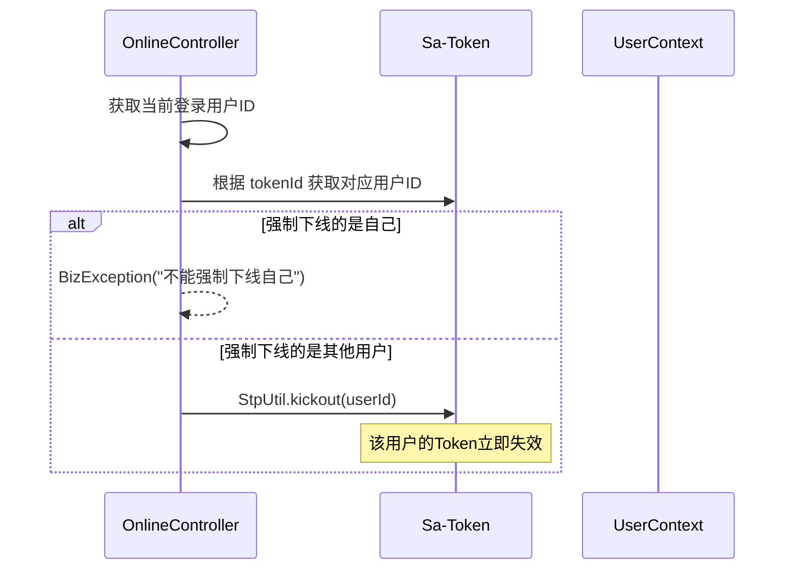
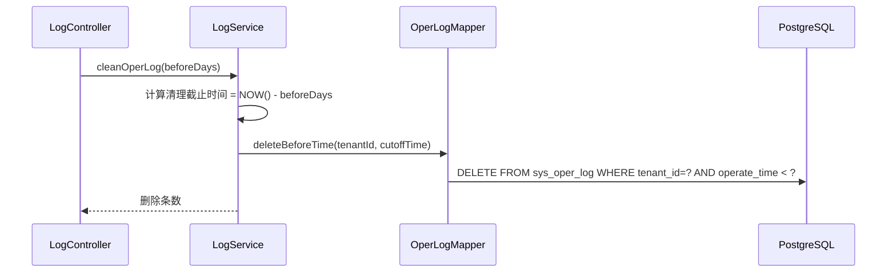
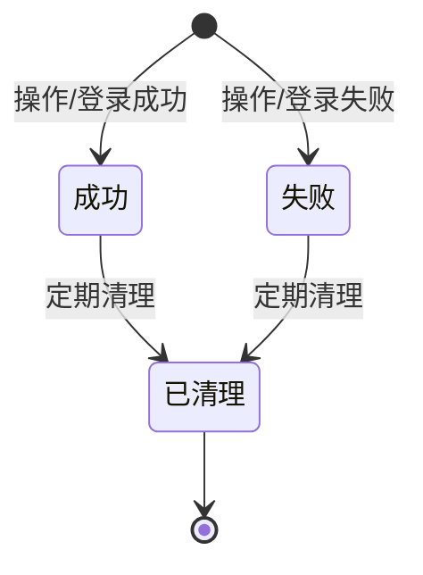
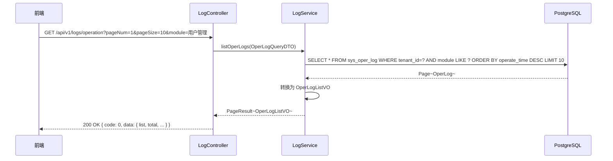
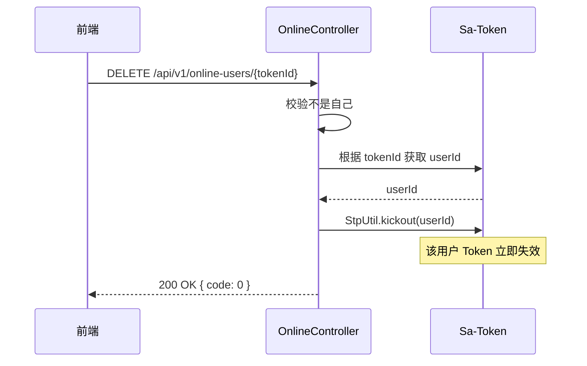

> **⚠️ 部分内容已过期（2026-09-01）**：本仓库已拿掉多租户机制，本文中所有 `tenant_id`
> 字段、`FlexGlobalConfig.setTenantColumn`、「租户管理员/平台超级管理员」权限层级描述
> 均已不适用（`tenant_id` 列已删除，`ADMIN` 现为唯一角色）。日志管理本身的字段/接口/
> 流程设计仍然有效，仅去掉 `tenant_id` 维度。
> 原因见 `doc/design/modules/core/去多租户化-概要设计.md`。

# 程序详细设计文档

> **定位**
> - 数据库驱动设计
> - 分层思想
> - 前后端无代码协同
> - AI 分阶段稳定交付

------

## 文档信息

| 项目 | 内容 |
|------|------|
| 模块名称 | 日志管理 |
| 模块标识 | log |
| 所属系统 | RBAC 权限模块 |
| 文档版本 | v1.0.0 |
| 设计负责人 | 后端开发（AI辅助） |
| 最后更新时间 | 2026-03-30 |

适用对象：
- 后端开发
- 前端开发
- 测试人员
- AI 编程

------

# 一、数据库设计

> ⚠️ 数据库是系统"真实状态"的最终承载
> 所有代码都必须服务于本章设计

------

## 1.1 表清单与业务职责

| 表名 | 业务含义 | 主键 | 是否核心表 | 说明 |
|------|---------|------|-----------|------|
| sys_oper_log | 操作日志表 | id (BIGINT) | 是 | 租户级数据，记录用户操作行为 |
| sys_login_log | 登录日志表 | id (BIGINT) | 是 | 租户级数据，记录用户登录行为 |

> **横切说明**：日志管理是**横切模块**，操作日志通过 AOP 切面（@Log 注解）自动采集，登录日志在 AuthService 中手动记录。无逻辑删除，采用物理删除 + 定期清理策略。

------

## 1.2 表关系设计（ER 图）



**流程说明**：

1. 操作日志由 AOP 切面自动采集，Controller 方法标注 `@Log` 注解后自动记录
2. 登录日志在 AuthService.login() 方法中手动调用 LogService 记录
3. 两张日志表都是租户级数据，受租户拦截器隔离

**关键点**：

- sys_oper_log 和 sys_login_log 含 `tenant_id`，受租户拦截器隔离
- 日志表**不做逻辑删除**（无 deleted 字段），采用物理删除 + 定期清理
- 日志表**不做反范式冗余**，纯追加写入
- 日志表不含 `create_by`/`update_by`/`update_time`/`deleted` 等审计字段（日志本身就是审计数据）

------

## 1.3 表结构设计（字段级，逐字段）

### 表：sys_oper_log

> ⚠️ 日志表不做逻辑删除，无 deleted 字段
> ⚠️ 租户隔离：通过全局配置 `FlexGlobalConfig.setTenantColumn("tenant_id")` 自动生效，无需 `@Column(tenantId=true)` 标注。所有 BaseMapper 的增删改查都会自动追加 `tenant_id` 条件。

| 字段 | 类型 | 必填 | 描述 | 业务含义 | 设计说明 |
|------|------|------|------|---------|---------|
| id | BIGINT | 是 | 主键 | 日志ID | 雪花算法生成 |
| tenant_id | BIGINT | 是 | 租户ID | 数据隔离 | 从 UserContext 获取，**全局 tenantColumn 自动隔离** |
| module | VARCHAR(50) | 是 | 操作模块 | 模块名称 | 如"用户管理"、"角色管理"，**支持国际化** |
| type | VARCHAR(20) | 是 | 操作类型 | 操作分类 | INSERT/UPDATE/DELETE/SELECT/EXPORT/IMPORT，**存储英文代码** |
| title | VARCHAR(200) | 是 | 操作描述 | 操作说明 | 如"新增用户[张三]"，**中文描述** |
| operator | VARCHAR(50) | 是 | 操作人 | 用户名 | 从 UserContext 获取，**必须准确获取完整用户名** |
| operator_id | BIGINT | 否 | 操作人ID | 用户ID | 从 UserContext 获取 |
| operator_ip | VARCHAR(50) | 是 | 操作IP | 来源IP | 从 HttpServletRequest 获取 |
| location | VARCHAR(100) | 否 | 操作地点 | IP归属地 | 离线IP库解析（预留） |
| method | VARCHAR(10) | 否 | 请求方法 | HTTP方法 | GET/POST/PUT/DELETE |
| request_url | VARCHAR(500) | 否 | 请求URL | 接口路径 | 完整 URL |
| request_params | TEXT | 否 | 请求参数 | 入参JSON | 脱敏后存储（密码字段置空） |
| response_result | TEXT | 否 | 响应结果 | 出参JSON | @Log(saveResult=true) 时记录 |
| status | SMALLINT | 是 | 状态 | 操作结果 | 0=失败，1=成功 |
| error_msg | TEXT | 否 | 错误消息 | 异常信息 | 操作失败时记录异常堆栈摘要 |
| cost_time | INT | 是 | 耗时(ms) | 执行时间 | 方法执行耗时，默认 0 |
| operate_time | TIMESTAMP | 是 | 操作时间 | 发生时间 | 默认 CURRENT_TIMESTAMP |

### 表：sys_login_log

> ⚠️ 日志表不做逻辑删除，无 deleted 字段
> ⚠️ 租户隔离：通过全局配置 `FlexGlobalConfig.setTenantColumn("tenant_id")` 自动生效，无需 `@Column(tenantId=true)` 标注。

| 字段 | 类型 | 必填 | 描述 | 业务含义 | 设计说明 |
|------|------|------|------|---------|---------|
| id | BIGINT | 是 | 主键 | 日志ID | 雪花算法生成 |
| tenant_id | BIGINT | 是 | 租户ID | 数据隔离 | 登录成功后从用户信息获取，失败时为默认租户 0，**全局 tenantColumn 自动隔离** |
| username | VARCHAR(50) | 是 | 用户名 | 登录账号 | 用户输入的用户名，**必须准确获取完整用户名** |
| login_type | VARCHAR(20) | 是 | 登录方式 | 认证方式 | password/sms/sso，默认 password |
| login_ip | VARCHAR(50) | 是 | 登录IP | 来源IP | 从 HttpServletRequest 获取 |
| location | VARCHAR(100) | 否 | 登录地点 | IP归属地 | 离线IP库解析（预留） |
| browser | VARCHAR(50) | 否 | 浏览器 | 浏览器名 | User-Agent 解析，如"Chrome 120" |
| os | VARCHAR(50) | 否 | 操作系统 | 系统名 | User-Agent 解析，如"Windows 11" |
| device_type | VARCHAR(20) | 否 | 设备类型 | 设备分类 | pc/mobile/tablet，User-Agent 解析 |
| user_agent | VARCHAR(500) | 否 | User-Agent | 原始UA | 完整 User-Agent 字符串，**必须从 HttpServletRequest 获取** |
| status | SMALLINT | 是 | 状态 | 登录结果 | 0=失败，1=成功 |
| message | VARCHAR(200) | 是 | 提示消息 | 结果描述 | 如"登录成功"、"用户名或密码错误" |
| login_time | TIMESTAMP | 是 | 登录时间 | 发生时间 | **必须显式设置为 LocalDateTime.now()，不能依赖数据库默认值** |

------

## 1.4 反范式设计

本模块无反范式设计。日志表为纯追加写入，不做冗余。

------

## 1.5 索引与约束设计

**sys_oper_log 索引：**

**普通索引：**
- `idx_oper_log_tenant_time ON sys_oper_log(tenant_id, operate_time)` — 按租户+时间查询（列表主查询）
- `idx_oper_log_tenant_operator ON sys_oper_log(tenant_id, operator)` — 按租户+操作人查询（筛选操作人）

**sys_login_log 索引：**

**普通索引：**
- `idx_login_log_tenant_time ON sys_login_log(tenant_id, login_time)` — 按租户+时间查询（列表主查询）
- `idx_login_log_tenant_username ON sys_login_log(tenant_id, username)` — 按租户+用户名查询（筛选用户名）

> **说明**：日志表数据量大，不做唯一索引。按时间范围查询走复合索引即可。

------

# 二、模块目标与边界

**模块解决的业务问题：**
记录系统操作日志和登录日志，提供审计追踪和安全监控能力。支持日志查询、详情查看、定期清理。提供在线用户查看和强制下线功能。

**模块不解决的问题：**
- 操作日志的采集（公共基础设施的 @Log 注解 + LogAspect 负责）
- IP归属地解析的离线库维护（预留字段，首期不实现）
- 日志的自动归档和冷热分离（首期不做）
- 前端日志页面的渲染（前端基础设施负责）

**是否核心链路：** 否（P1 优先级），横切关注点，被所有业务模块引用。

------

## 2.1 模块边界图

```mermaid
flowchart TD
    subgraph 日志管理模块
        A[LogController]
        B[OnlineController]
        C[LogService]
        D[OperLogMapper]
        E[LoginLogMapper]
    end

    subgraph 公共基础设施
        F[LogAspect]
        G[@Log]
        H[UserContext]
        I[Sa-Token]
    end

    subgraph 用户管理模块
        J[AuthService]
    end

    subgraph 消费方模块
        K[所有业务Controller]
    end

    A --> C
    B --> I
    C --> D
    C --> E

    F -->|AOP自动采集| C
    K -->|标注@Log| F
    J -->|登录成功/失败| C

    F --> H
    A --> I
    B --> I
```

------

# 三、整体架构设计

> ⚠️ 明确声明：**本项目不采用 DDD**

------

## 3.1 分层结构定义

```
com.gentry.rbac.log/
├── controller/
│   ├── LogController
│   └── OnlineController
├── service/
│   ├── LogService
│   └── impl/
│       └── LogServiceImpl
├── mapper/
│   ├── OperLogMapper
│   └── LoginLogMapper
├── entity/
│   ├── OperLog
│   └── LoginLog
├── dto/
│   ├── OperLogQueryDTO
│   ├── LoginLogQueryDTO
│   └── LogCleanDTO
└── vo/
    ├── OperLogVO
    ├── OperLogDetailVO
    ├── LoginLogVO
    ├── LoginLogDetailVO
    └── OnlineUserVO
```

### 命名规范

| 数据库表名 | Entity 类名 | Service 接口名 | Controller 类名 |
|-----------|------------|---------------|----------------|
| sys_oper_log | OperLog | LogService | LogController |
| sys_login_log | LoginLog | — | — |

------

## 3.2 枚举设计

### OperType 操作类型枚举

| 枚举值 | code | description |
|--------|------|-------------|
| INSERT | INSERT | 新增 |
| UPDATE | UPDATE | 修改 |
| DELETE | DELETE | 删除 |
| SELECT | SELECT | 查询 |
| EXPORT | EXPORT | 导出 |
| IMPORT | IMPORT | 导入 |
| OTHER | OTHER | 其他 |

> 注：OperType 枚举在公共基础设施模块定义，日志模块引用。数据库 type 字段存储 VARCHAR 字符串。

------

## 3.3 层级职责与禁止事项

| 层 | 允许做 | 禁止做 |
|---|--------|--------|
| Controller | 参数校验(@Valid)、请求响应处理 | 写业务逻辑 |
| Service | 日志查询、日志清理、登录日志记录、在线用户管理 | 直接写 SQL |
| Mapper | 数据访问、SQL 执行 | 业务判断 |

------

# 四、业务模型与数据映射

### Entity 类设计

```mermaid
classDiagram
    direction TB

    class OperLog {
        -Long id
        -Long tenantId
        -String module
        -String type
        -String title
        -String operator
        -Long operatorId
        -String operatorIp
        -String location
        -String method
        -String requestUrl
        -String requestParams
        -String responseResult
        -Integer status
        -String errorMsg
        -Integer costTime
        -LocalDateTime operateTime
    }

    class LoginLog {
        -Long id
        -Long tenantId
        -String username
        -String loginType
        -String loginIp
        -String location
        -String browser
        -String os
        -String deviceType
        -String userAgent
        -Integer status
        -String message
        -LocalDateTime loginTime
    }

    class OperLogQueryDTO {
        -Integer pageNum
        -Integer pageSize
        -String module
        -String type
        -String operator
        -Integer status
        -LocalDateTime startTime
        -LocalDateTime endTime
    }

    class LoginLogQueryDTO {
        -Integer pageNum
        -Integer pageSize
        -String username
        -Integer status
        -LocalDateTime startTime
        -LocalDateTime endTime
    }

    class LogCleanDTO {
        -Integer beforeDays
    }

    class OperLogListVO {
        -Long id
        -String module
        -String type
        -String title
        -String operator
        -String operatorIp
        -String location
        -Integer status
        -Integer costTime
        -LocalDateTime operateTime
    }

    class OperLogDetailVO {
        -Long id
        -String module
        -String type
        -String title
        -String operator
        -Long operatorId
        -String operatorIp
        -String location
        -String method
        -String requestUrl
        -String requestParams
        -String responseResult
        -Integer status
        -String errorMsg
        -Integer costTime
        -LocalDateTime operateTime
    }

    class LoginLogListVO {
        -Long id
        -String username
        -String loginType
        -String loginIp
        -String location
        -String browser
        -String os
        -Integer status
        -String message
        -LocalDateTime loginTime
    }

    class LoginLogDetailVO {
        -Long id
        -String username
        -String loginType
        -String loginIp
        -String location
        -String browser
        -String os
        -String deviceType
        -String userAgent
        -Integer status
        -String message
        -LocalDateTime loginTime
    }

    class OnlineUserVO {
        -String tokenId
        -Long userId
        -String username
        -String nickname
        -String deptName
        -String loginIp
        -String location
        -String browser
        -String os
        -LocalDateTime loginTime
    }
```



**DTO → Entity 映射说明：**

| DTO 字段 | Entity 字段 | 转换逻辑 | 说明 |
|---------|------------|---------|------|
| — | id | 雪花算法生成 | 日志写入时自动生成 |
| — | tenantId | UserContext 获取 | 操作日志从上下文获取 |
| — | operator | UserContext 获取 | 操作日志自动填充 |
| — | operatorIp | HttpServletRequest 获取 | AOP 切面提取 |
| — | loginTime | CURRENT_TIMESTAMP | 数据库默认值 |

------

# 五、行为流程与用例设计

## 5.1 主流程（时序图）

### 5.1.1 操作日志自动采集（AOP 切面）



### 5.1.2 登录日志记录



**关键设计点：**

1. **User-Agent 获取**：必须在 AuthController 中从 HttpServletRequest 获取，传入 AuthService
2. **登陆失败也要记录**：在异常处理中捕获失败原因，调用 saveLoginLog 记录
3. **登陆时间准确性**：必须显式设置 `loginTime = LocalDateTime.now()`，不能依赖数据库默认值
4. **用户名准确性**：必须获取完整的用户名（如 chenli_93），不能截断
5. **租户ID准确性**：
   - 登陆成功：从用户信息获取真实 tenantId
   - 登陆失败：设为 0（表示未知租户）
6. **异常分类**：区分不同的失败原因，记录准确的 message

### 5.1.3 查询在线用户



**关键设计点：**

1. **Session 中必须存储完整用户信息**：
   - userId, username, tenantId（已有）
   - nickname, deptName, avatar（新增）
   - loginIp, loginTime（新增）

2. **用户名准确性**：Session 中存储的 username 必须是完整的（如 chenli_93），不能被截断

3. **部门信息获取**：
   - 登陆时查询用户的部门，存入 Session
   - 查询在线用户时从 Session 获取，避免重复查询

4. **Session 更新时机**：
   - 登陆时：在 AuthServiceImpl.buildLoginResult() 中存储
   - 查询时：如果 Session 中缺少信息，从数据库补充

### 5.1.4 强制下线



### 5.1.5 日志清理



## 5.2 关键业务规则说明

### 操作日志采集

- **前置条件**：Controller 方法标注 `@Log` 注解
- **核心校验**：无，自动记录
- **处理逻辑**：
  1. AOP 切面拦截标注了 `@Log` 的方法
  2. 方法执行前：记录开始时间、解析注解参数、获取操作人信息、序列化请求参数
  3. 方法执行后：计算耗时、记录状态（成功/失败）、保存日志
  4. 请求参数脱敏：password/oldPassword/newPassword 字段置空
- **失败路径**：日志记录失败不影响业务（catch 后仅记录 ERROR 日志）

### 登录日志记录

- **前置条件**：无
- **记录时机**：登录成功、登录失败、退出登录
- **处理逻辑**：
  1. 解析 User-Agent 获取 browser、os、deviceType
  2. 获取 loginIp（支持 X-Forwarded-For 代理头）
  3. 登录成功：tenantId 从用户信息获取
  4. 登录失败：tenantId 设为 0（未知租户）
- **失败路径**：日志记录失败不影响登录流程

### 日志清理

- **前置条件**：操作人为管理员
- **核心校验**：
  - beforeDays >= 30（最少保留30天）
  - 清理操作本身也会记录操作日志
- **处理逻辑**：物理删除指定时间之前的日志记录
- **失败路径**：
  - beforeDays < 30 → 抛出 `BizException(PARAM_ERROR, "至少保留30天日志")`

### 在线用户管理

- **前置条件**：操作人为管理员
- **核心校验**：
  - 不能强制下线自己
- **处理逻辑**：通过 Sa-Token API 查询在线会话列表
- **失败路径**：
  - 下线自己 → 抛出 `BizException(PARAM_ERROR, "不能强制下线当前登录用户")`

------

# 六、状态机设计

### 日志状态



**状态值映射：**

| 状态 | status 值 | 说明 |
|------|----------|------|
| 成功 | 1 | 操作/登录成功 |
| 失败 | 0 | 操作/登录失败 |
| 已清理 | 物理删除 | 日志被清理（记录不存在） |

> 日志表无逻辑删除字段，状态仅标识操作结果。

------

# 七、接口设计（前后端核心契约）

> **目标：无代码即可协同开发**

------

## 7.1 接口清单

### 操作日志接口（LogController）

| 接口编号 | 接口名称 | URL | Method | 认证 | 授权 |
|---------|---------|-----|--------|------|------|
| LOG-001 | 操作日志列表 | /api/v1/logs/operation | GET | 是 | system:operlog:list |
| LOG-002 | 操作日志详情 | /api/v1/logs/operation/{id} | GET | 是 | system:operlog:detail |
| LOG-003 | 清理操作日志 | /api/v1/logs/operation | DELETE | 是 | system:operlog:remove |
| LOG-004 | 导出操作日志 | /api/v1/logs/operation/export | GET | 是 | system:operlog:export |

### 登录日志接口（LogController）

| 接口编号 | 接口名称 | URL | Method | 认证 | 授权 |
|---------|---------|-----|--------|------|------|
| LOG-005 | 登录日志列表 | /api/v1/logs/login | GET | 是 | system:loginlog:list |
| LOG-006 | 登录日志详情 | /api/v1/logs/login/{id} | GET | 是 | system:loginlog:detail |
| LOG-007 | 清理登录日志 | /api/v1/logs/login | DELETE | 是 | system:loginlog:remove |
| LOG-008 | 导出登录日志 | /api/v1/logs/login/export | GET | 是 | system:loginlog:export |

### 在线用户接口（OnlineController）

| 接口编号 | 接口名称 | URL | Method | 认证 | 授权 |
|---------|---------|-----|--------|------|------|
| LOG-009 | 在线用户列表 | /api/v1/online-users | GET | 是 | system:online:list |
| LOG-010 | 强制下线 | /api/v1/online-users/{tokenId} | DELETE | 是 | system:online:forceLogout |

------

## 7.2 入参设计

### LOG-001 操作日志列表

**请求对象：** `OperLogQueryDTO`

| 参数 | 类型 | 必填 | 描述 | 校验规则 |
|------|------|------|------|---------|
| pageNum | Integer | 是 | 页码 | ≥ 1 |
| pageSize | Integer | 是 | 每页条数 | 1-100 |
| module | String | 否 | 操作模块 | 模糊匹配 |
| type | String | 否 | 操作类型 | 精确匹配：INSERT/UPDATE/DELETE/SELECT/EXPORT/IMPORT |
| operator | String | 否 | 操作人 | 模糊匹配 |
| status | Integer | 否 | 操作状态 | 0=失败，1=成功，null=全部 |
| startTime | LocalDateTime | 否 | 开始时间 | 与 endTime 成对 |
| endTime | LocalDateTime | 否 | 结束时间 | 与 startTime 成对 |

### LOG-003 清理操作日志

**请求对象：** `LogCleanDTO`

| 参数 | 类型 | 必填 | 描述 | 校验规则 |
|------|------|------|------|---------|
| beforeDays | Integer | 是 | 清理多少天前的日志 | @Min(30)，至少保留30天 |

**请求示例：**

```json
{
  "beforeDays": 90
}
```

### LOG-005 登录日志列表

**请求对象：** `LoginLogQueryDTO`

| 参数 | 类型 | 必填 | 描述 | 校验规则 |
|------|------|------|------|---------|
| pageNum | Integer | 是 | 页码 | ≥ 1 |
| pageSize | Integer | 是 | 每页条数 | 1-100 |
| username | String | 否 | 用户名 | 精确匹配 |
| status | Integer | 否 | 登录状态 | 0=失败，1=成功，null=全部 |
| startTime | LocalDateTime | 否 | 开始时间 | 与 endTime 成对 |
| endTime | LocalDateTime | 否 | 结束时间 | 与 startTime 成对 |

### LOG-009 在线用户列表

| 参数 | 类型 | 必填 | 描述 | 校验规则 |
|------|------|------|------|---------|
| username | String | 否 | 用户名 | 精确匹配（查询参数） |

------

## 7.3 出参设计

### OperLogListVO（操作日志列表）

| 字段 | 类型 | 描述 |
|------|------|------|
| id | Long | 日志ID |
| module | String | 操作模块（英文代码） |
| moduleLabel | String | 操作模块（国际化标签） |
| type | String | 操作类型（英文代码） |
| typeLabel | String | 操作类型（国际化标签） |
| title | String | 操作描述 |
| operator | String | 操作人 |
| operatorIp | String | 操作IP |
| location | String | 操作地点 |
| status | Integer | 操作状态 |
| costTime | Integer | 耗时(ms) |
| operateTime | LocalDateTime | 操作时间 |

### OperLogDetailVO（操作日志详情）

| 字段 | 类型 | 描述 |
|------|------|------|
| id | Long | 日志ID |
| module | String | 操作模块（英文代码） |
| moduleLabel | String | 操作模块（国际化标签） |
| type | String | 操作类型（英文代码） |
| typeLabel | String | 操作类型（国际化标签） |
| title | String | 操作描述 |
| operator | String | 操作人 |
| operatorId | Long | 操作人ID |
| operatorIp | String | 操作IP |
| location | String | 操作地点 |
| method | String | 请求方法 |
| requestUrl | String | 请求URL |
| requestParams | String | 请求参数（JSON） |
| responseResult | String | 响应结果（JSON） |
| status | Integer | 操作状态 |
| errorMsg | String | 错误消息 |
| costTime | Integer | 耗时(ms) |
| operateTime | LocalDateTime | 操作时间 |

### LoginLogListVO（登录日志列表）

| 字段 | 类型 | 描述 |
|------|------|------|
| id | Long | 日志ID |
| username | String | 用户名 |
| loginType | String | 登录方式 |
| loginIp | String | 登录IP |
| location | String | 登录地点 |
| browser | String | 浏览器 |
| os | String | 操作系统 |
| status | Integer | 登录状态 |
| message | String | 提示消息 |
| loginTime | LocalDateTime | 登录时间 |

### LoginLogDetailVO（登录日志详情）

| 字段 | 类型 | 描述 |
|------|------|------|
| id | Long | 日志ID |
| username | String | 用户名 |
| loginType | String | 登录方式 |
| loginIp | String | 登录IP |
| location | String | 登录地点 |
| browser | String | 浏览器 |
| os | String | 操作系统 |
| deviceType | String | 设备类型 |
| userAgent | String | User-Agent |
| status | Integer | 登录状态 |
| message | String | 提示消息 |
| loginTime | LocalDateTime | 登录时间 |

### OnlineUserVO（在线用户）

| 字段 | 类型 | 描述 |
|------|------|------|
| tokenId | String | 会话TokenID |
| userId | Long | 用户ID |
| username | String | 用户名 |
| nickname | String | 昵称 |
| deptName | String | 部门名称 |
| loginIp | String | 登录IP |
| location | String | 登录地点 |
| browser | String | 浏览器 |
| os | String | 操作系统 |
| loginTime | LocalDateTime | 登录时间 |

**响应示例（操作日志列表）：**

```json
{
  "code": 0,
  "message": "success",
  "data": {
    "list": [
      {
        "id": 1,
        "module": "用户管理",
        "type": "INSERT",
        "title": "新增用户[张三]",
        "operator": "admin",
        "operatorIp": "192.168.1.100",
        "location": null,
        "status": 1,
        "costTime": 156,
        "operateTime": "2026-03-15 10:30:00"
      }
    ],
    "total": 100,
    "pageNum": 1,
    "pageSize": 10,
    "pages": 10
  }
}
```

**响应示例（在线用户列表）：**

```json
{
  "code": 0,
  "message": "success",
  "data": [
    {
      "tokenId": "abc123-session-1",
      "userId": 1,
      "username": "admin",
      "nickname": "管理员",
      "deptName": "总公司",
      "loginIp": "192.168.1.100",
      "location": null,
      "browser": "Chrome 120",
      "os": "Windows 11",
      "loginTime": "2026-03-15 10:30:00"
    },
    {
      "tokenId": "def456-session-2",
      "userId": 2,
      "username": "zhangsan",
      "nickname": "张三",
      "deptName": "运营部",
      "loginIp": "192.168.1.101",
      "location": null,
      "browser": "Firefox 122",
      "os": "Mac OS X",
      "loginTime": "2026-03-15 09:15:00"
    }
  ]
}
```

------

## 7.4 接口治理要求（强制）

| 接口 | 是否启用全局防抖 | 是否需要接口级防抖 | 是否幂等 | 幂等依据 | 日志级别 |
|------|----------------|------------------|---------|---------|---------|
| LOG-001 操作日志列表 | 是 | 否 | 是 | 相同参数相同结果 | 无 |
| LOG-002 操作日志详情 | 是 | 否 | 是 | 相同参数相同结果 | 无 |
| LOG-003 清理操作日志 | 是 | 是（3s） | 是 | 物理删除 | @Log |
| LOG-004 导出操作日志 | 是 | 是（3s） | 是 | 相同参数相同结果 | @Log |
| LOG-005 登录日志列表 | 是 | 否 | 是 | 相同参数相同结果 | 无 |
| LOG-006 登录日志详情 | 是 | 否 | 是 | 相同参数相同结果 | 无 |
| LOG-007 清理登录日志 | 是 | 是（3s） | 是 | 物理删除 | @Log |
| LOG-008 导出登录日志 | 是 | 是（3s） | 是 | 相同参数相同结果 | @Log |
| LOG-009 在线用户列表 | 是 | 否 | 否 | 实时数据 | 无 |
| LOG-010 强制下线 | 是 | 是（2s） | 是 | 无状态操作 | @Log |

------

# 八、模块安全规范

------

## 8.1 认证与授权要求

本模块是否需要认证：**是**
认证方式：Sa-Token（Token）
本模块是否需要授权：**是**
授权粒度：**接口级**

### 接口权限配置

| 接口 | 权限标识 | 权限说明 | 是否公开 |
|------|---------|---------|---------|
| LOG-001 操作日志列表 | system:operlog:list | 查询操作日志 | 否 |
| LOG-002 操作日志详情 | system:operlog:detail | 查看操作日志详情 | 否 |
| LOG-003 清理操作日志 | system:operlog:remove | 清理操作日志 | 否 |
| LOG-004 导出操作日志 | system:operlog:export | 导出操作日志 | 否 |
| LOG-005 登录日志列表 | system:loginlog:list | 查询登录日志 | 否 |
| LOG-006 登录日志详情 | system:loginlog:detail | 查看登录日志详情 | 否 |
| LOG-007 清理登录日志 | system:loginlog:remove | 清理登录日志 | 否 |
| LOG-008 导出登录日志 | system:loginlog:export | 导出登录日志 | 否 |
| LOG-009 在线用户列表 | system:online:list | 查询在线用户 | 否 |
| LOG-010 强制下线 | system:online:forceLogout | 强制下线用户 | 否 |

------

## 8.2 敏感数据处理

### 敏感字段清单

| 字段名 | 所属表/对象 | 敏感等级 | 存储处理 | 传输处理 | 展示处理 |
|--------|-----------|---------|---------|---------|---------|
| requestParams | sys_oper_log | 高 | 脱敏存储 | HTTPS | 详情页展示（已脱敏） |
| password（请求参数中） | sys_oper_log.request_params | 高 | 置空存储 | HTTPS | 不展示 |

### 请求参数脱敏规则

| 字段名 | 脱敏方式 | 说明 |
|--------|---------|------|
| password | 置空 | 密码相关字段不存储 |
| oldPassword | 置空 | 旧密码不存储 |
| newPassword | 置空 | 新密码不存储 |

------

## 8.3 安全检查清单

- [x] 所有接口是否配置了正确的权限？ → system:* 系列
- [x] 请求参数中密码是否脱敏？ → password/oldPassword/newPassword 置空
- [x] 日志清理最小保留天数？ → 30天
- [x] 清理操作是否记录日志？ → @Log 注解记录
- [x] 强制下线是否校验自己？ → 不能下线自己
- [x] 租户隔离是否生效？ → 日志查询自动追加 tenant_id
- [x] 日志写入失败是否影响业务？ → catch 后仅记录 ERROR 日志

------

# 九、算法设计

### 9.1 是否涉及算法

是否涉及算法：**否**

> 本模块无算法设计。User-Agent 解析使用第三方库（如 UserAgentUtils 或 yauaa），IP归属地解析首期不实现（预留 location 字段）。

------

# 十、前后端交互模型

### 操作日志查询交互时序



### 操作日志采集交互时序

```mermaid
sequenceDiagram
    participant FE as 前端
    participant AOP as LogAspect
    participant Ctrl as UserController
    participant Svc as LogService
    participant DB as PostgreSQL

    FE->>Ctrl: POST /api/v1/users (UserCreateDTO)
    Note over Ctrl: 方法标注 @Log(module="用户管理", type=INSERT, title="新增用户")

    Ctrl->>AOP: AOP前置拦截
    AOP->>AOP: 记录开始时间、解析注解、获取操作人信息

    AOP->>Ctrl: 执行业务方法
    Ctrl-->>AOP: 返回 UserVO

    AOP->>AOP: 计算costTime、设置status=1
    AOP->->Svc: saveOperLog(OperLog)
    Note over Svc,DB: 异步写入，不阻塞业务响应
    Svc->>DB: INSERT INTO sys_oper_log
    AOP-->>FE: 200 OK { code: 0, data: UserVO }
```

### 强制下线交互时序



------

# 十一、测试用例设计

## 正常流程

| 用例ID | 测试场景 | 前置条件 | 测试步骤 | 预期结果 |
|--------|---------|---------|---------|---------|
| LOG-001 | 查询操作日志列表 | 已有操作日志 | 调用 LOG-001 | 返回分页列表 |
| LOG-002 | 按模块筛选操作日志 | 已有多模块日志 | module=用户管理 | 仅返回用户管理模块日志 |
| LOG-003 | 按操作人筛选 | 已有多人日志 | operator=admin | 仅返回 admin 的操作日志 |
| LOG-004 | 查看操作日志详情 | 日志存在 | 调用 LOG-002 | 返回完整信息含请求参数和响应结果 |
| LOG-005 | 新增用户自动记录日志 | - | 新增用户操作 | sys_oper_log 生成一条 INSERT 类型记录 |
| LOG-006 | 删除用户自动记录日志 | 用户存在 | 删除用户操作 | sys_oper_log 生成一条 DELETE 类型记录 |
| LOG-007 | 登录成功记录 | 用户存在 | 正确账密登录 | sys_login_log 生成一条 status=1 记录 |
| LOG-008 | 登录失败记录 | - | 错误密码登录 | sys_login_log 生成一条 status=0 记录 |
| LOG-009 | 查询登录日志列表 | 已有登录日志 | 调用 LOG-005 | 返回分页列表 |
| LOG-010 | 查询在线用户 | 多人在线 | 调用 LOG-009 | 返回在线用户列表 |
| LOG-011 | 强制下线 | 其他用户在线 | 强制下线 | 该用户 Token 失效 |
| LOG-012 | 清理操作日志 | 有90天前日志 | beforeDays=90 | 90天前日志已物理删除 |
| LOG-013 | 操作失败记录错误信息 | 方法抛出异常 | 执行失败操作 | status=0，errorMsg 有值 |

## 异常流程

| 用例ID | 测试场景 | 前置条件 | 测试步骤 | 预期结果 |
|--------|---------|---------|---------|---------|
| LOG-014 | 清理日志保留天数不足30 | - | beforeDays=10 | 提示"至少保留30天日志" |
| LOG-015 | 强制下线自己 | - | 下线当前登录用户 | 提示"不能强制下线当前登录用户" |
| LOG-016 | 查看不存在的日志详情 | - | 传入不存在的ID | 提示"日志不存在" |
| LOG-017 | 日志写入失败不影响业务 | DB连接异常 | 执行写操作 | 业务操作正常返回，日志记录失败仅打印ERROR |

## 边界条件

| 用例ID | 测试场景 | 前置条件 | 测试步骤 | 预期结果 |
|--------|---------|---------|---------|---------|
| LOG-018 | 清理日志最小天数 | - | beforeDays=30 | 成功清理30天前的日志 |
| LOG-019 | 查询空日志列表 | 无日志数据 | 调用列表查询 | 返回空数组 |
| LOG-020 | 请求参数中密码脱敏 | - | 新增用户含密码 | request_params 中 password 字段为空 |
| LOG-021 | 操作日志耗时记录 | - | 执行耗时操作 | costTime > 0 |
| LOG-022 | 登录日志租户ID | 登录失败 | 用户名不存在 | tenantId = 0 |
| LOG-023 | 无在线用户时查询 | 无人在线 | 调用在线用户查询 | 返回空数组 |

## 并发 / 幂等

| 用例ID | 测试场景 | 前置条件 | 测试步骤 | 预期结果 |
|--------|---------|---------|---------|---------|
| LOG-024 | 并发操作日志写入 | 多用户同时操作 | 并发执行@Log方法 | 所有日志记录正确无丢失 |
| LOG-025 | 重复清理 | 已清理 | 再次清理同时间范围 | 幂等成功（删除0条） |
| LOG-026 | 重复强制下线 | 用户已下线 | 再次下线同用户 | 幂等成功 |

## 数据一致性

| 用例ID | 测试场景 | 前置条件 | 测试步骤 | 预期结果 |
|--------|---------|---------|---------|---------|
| LOG-027 | 租户隔离 | 两个租户各有日志 | 用租户A查询 | 仅返回租户A的日志 |
| LOG-028 | 操作日志与业务一致性 | 新增用户成功 | 查看操作日志 | 存在对应 INSERT 记录，status=1 |
| LOG-029 | 操作日志记录业务失败 | 新增用户名重复 | 查看操作日志 | 存在对应 INSERT 记录，status=0 |
| LOG-030 | 清理操作本身被记录 | - | 执行日志清理 | 存在一条 DELETE 类型的操作日志 |

------

------

# 十二、国际化设计

## 12.1 国际化范围

本模块涉及国际化的字段：

| 字段 | 所属表/对象 | 国际化方式 | 说明 |
|------|-----------|---------|------|
| type | sys_oper_log | 枚举翻译 | INSERT/UPDATE/DELETE/SELECT/EXPORT/IMPORT → 新增/修改/删除/查询/导出/导入 |
| module | sys_oper_log | 资源文件 | 用户管理/角色管理/菜单管理 → 对应的中英文翻译 |

## 12.2 国际化实现方案

### 方案 A：SQL CASE 语句（推荐，数据库层）

**优点**：
- 查询时直接返回翻译后的标签，无需应用层处理
- 性能最优，减少应用层逻辑
- 支持多语言扩展

**缺点**：
- SQL 语句复杂
- 翻译维护在 SQL 中，不够灵活

**实现方式**：

在 OperLogMapper 的 selectList() 方法中使用 CASE 语句：

```sql
SELECT 
    id, module, type, title, operator, operator_ip, operate_time,
    CASE type 
        WHEN 'INSERT' THEN '新增'
        WHEN 'UPDATE' THEN '修改'
        WHEN 'DELETE' THEN '删除'
        WHEN 'SELECT' THEN '查询'
        WHEN 'EXPORT' THEN '导出'
        WHEN 'IMPORT' THEN '导入'
        ELSE type
    END as typeLabel,
    CASE module
        WHEN 'user' THEN '用户管理'
        WHEN 'role' THEN '角色管理'
        WHEN 'menu' THEN '菜单管理'
        WHEN 'dept' THEN '部门管理'
        WHEN 'dict' THEN '字典管理'
        WHEN 'tenant' THEN '租户管理'
        WHEN 'log' THEN '日志管理'
        ELSE module
    END as moduleLabel
FROM sys_oper_log
WHERE tenant_id = #{tenantId}
ORDER BY operate_time DESC
LIMIT #{offset}, #{limit}
```

### 方案 B：应用层翻译（备选，灵活性高）

**优点**：
- 翻译逻辑集中在应用层，易于维护
- 支持动态加载翻译资源
- 支持多语言切换

**缺点**：
- 需要应用层处理，性能略低
- 代码复杂度增加

**实现方式**：

1. 创建国际化资源文件：

```
src/main/resources/i18n/
├── messages_zh_CN.properties
├── messages_en_US.properties
└── messages.properties (默认)
```

**messages_zh_CN.properties:**
```properties
operlog.type.INSERT=新增
operlog.type.UPDATE=修改
operlog.type.DELETE=删除
operlog.type.SELECT=查询
operlog.type.EXPORT=导出
operlog.type.IMPORT=导入

operlog.module.user=用户管理
operlog.module.role=角色管理
operlog.module.menu=菜单管理
operlog.module.dept=部门管理
operlog.module.dict=字典管理
operlog.module.tenant=租户管理
operlog.module.log=日志管理
```

2. 创建国际化工具类：

```java
@Component
public class I18nUtil {
    private final MessageSource messageSource;
    
    public I18nUtil(MessageSource messageSource) {
        this.messageSource = messageSource;
    }
    
    public String getMessage(String key, String defaultValue) {
        try {
            Locale locale = LocaleContextHolder.getLocale();
            return messageSource.getMessage(key, null, defaultValue, locale);
        } catch (Exception e) {
            return defaultValue;
        }
    }
    
    public String getOperLogTypeLabel(String type) {
        return getMessage("operlog.type." + type, type);
    }
    
    public String getOperLogModuleLabel(String module) {
        return getMessage("operlog.module." + module, module);
    }
}
```

3. 在 Service 层调用翻译：

```java
@Service
public class LogServiceImpl implements LogService {
    private final I18nUtil i18nUtil;
    
    @Override
    public PageResult<OperLogListVO> listOperLogs(OperLogQueryDTO query) {
        Long tenantId = UserContext.getTenantId();
        long total = operLogMapper.selectCount(query, tenantId);
        List<OperLogListVO> list = total > 0 ? operLogMapper.selectList(query, tenantId) : List.of();
        
        // 添加国际化翻译
        for (OperLogListVO vo : list) {
            vo.setTypeLabel(i18nUtil.getOperLogTypeLabel(vo.getType()));
            vo.setModuleLabel(i18nUtil.getOperLogModuleLabel(vo.getModule()));
        }
        
        return new PageResult<>(list, total, query.getPageNum(), query.getPageSize());
    }
}
```

## 12.3 推荐方案

**选择方案 A（SQL CASE 语句）**，原因：

1. **性能最优**：翻译在数据库层完成，减少应用层处理
2. **代码简洁**：无需额外的工具类和资源文件
3. **易于维护**：翻译规则集中在 SQL 中，易于查看和修改
4. **支持多语言**：可在 SQL 中添加多个 CASE 分支

**后续扩展**：

如果需要支持动态语言切换（如前端选择中文/英文），可升级为方案 B。

------

## 变更记录

| 版本 | 日期 | 修改人 | 变更内容 | 变更原因 | 评审人 |
|------|------|--------|---------|---------|--------|
| v1.0.0 | 2026-03-30 | 后端开发（AI） | 初始版本 | 日志管理详细设计 | 待评审 |
| v1.1.0 | 2026-04-25 | 后端开发（AI） | Bug 修复和优化 | 修复登陆日志入库准确性、租户隔离、在线用户信息完整性、国际化 | 待评审 |
