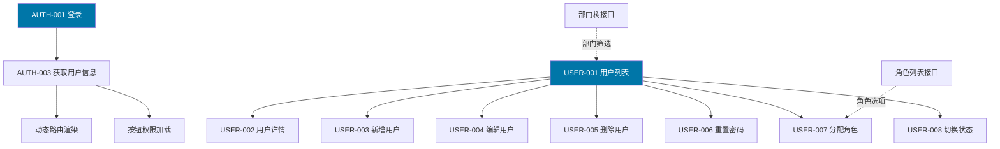
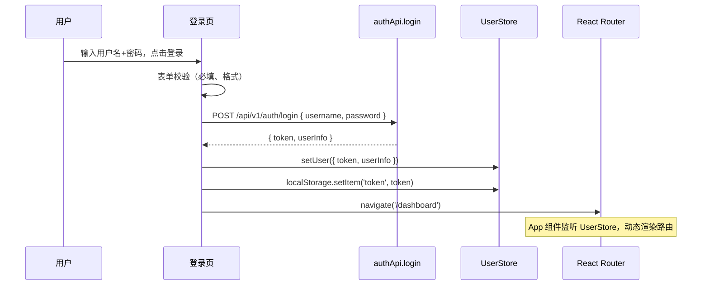
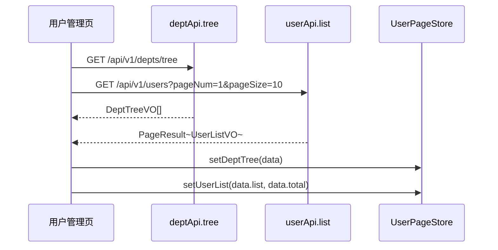
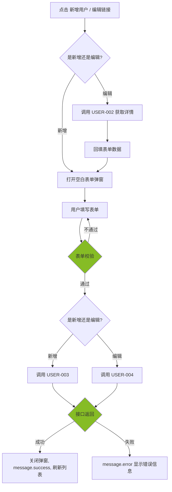
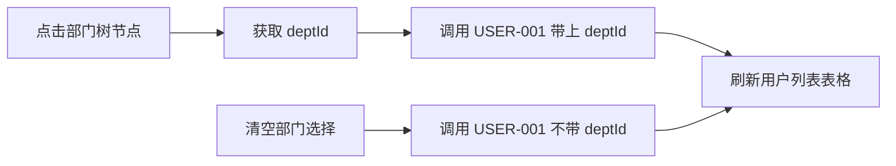
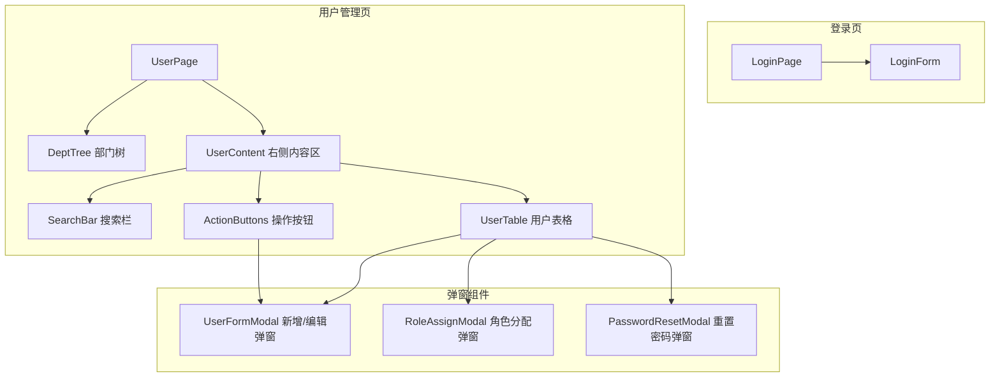

> **⚠️ 部分内容已过期（2026-09-01）**：本仓库已拿掉多租户机制，本文中「租户管理员对
> 租户内用户 CRUD」等权限层级描述已不适用（`ADMIN` 现为唯一角色，拥有全部用户管理权限）。
> 用户管理本身的页面/交互设计仍然有效。
> 原因见 `doc/design/modules/core/去多租户化-概要设计.md`。

# 前端详细设计文档

## 文档信息

| 项目 | 内容 |
|------|------|
| 文档名称 | 用户管理+认证 前端详细设计文档 |
| 对应后端模块 | 用户管理+认证（模块标识：user） |
| 参考文档 | `doc/design/modules/rbac/modules/用户管理/后端详细设计.md` |
| 静态页面 | `static_fe/src/app/pages/Login.tsx`、`static_fe/src/app/pages/Users.tsx` |
| 版本 | v1.0.0 |
| 创建日期 | 2026-04-11 |
| 最后更新 | 2026-04-11 |
| 负责人 | 前端开发（AI辅助） |

---

# 一、模块概述

## 1.1 模块功能描述

本模块前端实现**用户管理**和**认证登录**两大功能：

- **认证登录**：用户通过账号密码登录系统，登录成功后获取 Token 和用户信息，前端据此渲染动态路由和按钮权限。
- **用户管理**：租户管理员对租户内用户进行 CRUD、角色分配、密码重置、状态切换等操作。采用左树（部门树）右表（用户列表）的经典布局。

## 1.2 模块边界与职责

| 职责 | 说明 |
|------|------|
| **本模块负责** | 登录页、用户列表页、用户新增/编辑弹窗、角色分配弹窗、密码重置、状态切换 |
| **其他模块负责** | 部门树组件（部门管理模块提供）、角色列表数据（角色管理模块 API 提供）、操作日志记录（后端 AOP 自动） |

## 1.3 用户角色与权限

| 角色 | 可执行操作 | 对应权限标识 |
|------|----------|-------------|
| 平台超级管理员 | 所有操作 | system:user:* |
| 租户管理员 | 用户 CRUD、角色分配、密码重置 | system:user:list / add / edit / remove / resetPwd / assignRole |
| 普通用户 | 仅修改自己的密码 | AUTH-004（无需权限标识，仅改自己） |

---

# 二、接口调用总览

## 2.1 接口引用说明

| 接口标识 | 接口名称 | HTTP方法 | 路径 | 主要用途 | 对应后端文档章节 |
|----------|----------|----------|------|----------|-----------------|
| AUTH-001 | 用户登录 | POST | /api/v1/auth/login | 登录页提交 | §7.2 AUTH-001 |
| AUTH-002 | 用户登出 | POST | /api/v1/auth/logout | 顶部栏退出 | §7.1 AUTH-002 |
| AUTH-003 | 获取用户信息 | GET | /api/v1/auth/user-info | 登录后/刷新页面 | §7.2 AUTH-003 |
| AUTH-004 | 修改密码 | PUT | /api/v1/auth/password | 个人中心修改密码 | §7.2 AUTH-004 |
| USER-001 | 用户列表查询 | GET | /api/v1/users | 用户列表页加载 | §7.2 USER-001 |
| USER-002 | 用户详情 | GET | /api/v1/users/{id} | 编辑弹窗回填 | §7.2 USER-002 |
| USER-003 | 新增用户 | POST | /api/v1/users | 新增弹窗提交 | §7.2 USER-003 |
| USER-004 | 编辑用户 | PUT | /api/v1/users/{id} | 编辑弹窗提交 | §7.2 USER-004 |
| USER-005 | 删除用户 | DELETE | /api/v1/users/{id} | 列表删除按钮 | §7.2 USER-005 |
| USER-006 | 重置密码 | PUT | /api/v1/users/{id}/password/reset | 重置密码弹窗 | §7.2 USER-006 |
| USER-007 | 分配角色 | PUT | /api/v1/users/{id}/roles | 角色分配弹窗 | §7.2 USER-007 |
| USER-008 | 切换用户状态 | PUT | /api/v1/users/{id}/status | 列表状态 Switch | §7.2 USER-008 |

**跨模块接口依赖：**

| 接口 | 来源模块 | 用途 |
|------|---------|------|
| 部门树查询 | 部门管理 | 用户列表页左侧部门树 |
| 角色列表查询 | 角色管理 | 角色分配弹窗中角色选项 |

## 2.2 接口依赖关系



---

# 三、页面详细设计

## 3.1 页面清单

| 页面名称 | 路由路径 | 页面功能描述 | 关联接口列表 |
|----------|----------|--------------|--------------|
| 登录页 | /login | 账号密码登录，获取 Token 和权限 | AUTH-001 |
| 用户管理页 | /system/users | 左树右表布局，用户 CRUD | USER-001~008, 部门树, 角色列表 |

## 3.2 页面跳转关系


**说明**：登录成功后跳转到首页（/dashboard）。用户管理页通过侧边栏菜单「系统管理 > 用户管理」进入。点击顶部栏「退出登录」调用 AUTH-002 后跳转到登录页。

---

# 四、页面初始化流程设计

## 4.1 登录页初始化流程

### 4.1.1 接口调用序列

登录页无需初始化接口调用。页面渲染静态表单。

### 4.1.2 登录提交时序图



### 4.1.3 初始化数据流

无初始化数据流。登录成功后数据流：
1. 接口返回 `LoginVO` → 解构 `token` 和 `userInfo`
2. `token` 存入 `localStorage`，同时写入 Zustand UserStore
3. `userInfo.menus` 传入路由生成器，动态注册路由
4. `userInfo.permissions` 存入 UserStore，用于按钮权限判断

## 4.2 用户管理页初始化流程

### 4.2.1 接口调用序列

| 顺序 | 接口 | 并行/串行 | 说明 |
|------|------|----------|------|
| 1 | 部门树查询 | 并行 | 加载左侧部门树 |
| 2 | USER-001 用户列表 | 并行 | 加载右侧用户列表（默认不带 deptId） |

> 部门树和用户列表可并行加载，无依赖关系。

### 4.2.2 初始化时序图



### 4.2.3 初始化数据流

1. 部门树接口返回 `DeptTreeVO[]` → 直接渲染为 Ant Design `Tree` 组件数据源
2. 用户列表接口返回 `PageResult<UserListVO>` → `list` 渲染表格行，`total` 渲染分页器

---

# 五、用户操作流程设计

## 5.1 操作-接口映射表

| 用户操作描述 | 触发组件 | 调用接口 | 请求参数构造 | 响应数据处理 | 异常处理 |
|-------------|---------|---------|-------------|-------------|---------|
| 点击搜索按钮 | 搜索按钮 | USER-001 | 从搜索表单收集 username, phone, status | 重置表格数据和分页 | message.error 提示 |
| 点击重置按钮 | 重置按钮 | — | 清空搜索表单，重置分页，重新调用 USER-001 | — | — |
| 点击部门树节点 | 部门树 | USER-001 | 取节点 ID 作为 deptId 参数 | 刷新表格 | — |
| 点击新增用户 | 新增按钮 | USER-003 | 弹窗表单数据组装为 UserCreateDTO | 关闭弹窗，刷新列表 | 表单校验失败阻止提交 |
| 点击编辑用户 | 编辑链接 | USER-002 → USER-004 | 先调详情回填，提交时组装 UserUpdateDTO | 关闭弹窗，刷新列表 | — |
| 点击删除用户 | 删除链接 | USER-005 | 取行记录 id | 刷新列表 | 二次确认后调用 |
| 点击切换状态 | 状态 Switch | USER-008 | 取行记录 id + 反转的 status 值 | 刷新列表 | Switch 回滚到原状态 |
| 点击分配角色 | 角色链接 | USER-007 | 取行记录 id + 选中的 roleIds | 关闭弹窗，刷新列表 | — |
| 点击重置密码 | 重置密码按钮 | USER-006 | 取行记录 id + 新密码 | 关闭弹窗，提示成功 | — |
| 修改自己的密码 | 个人中心 | AUTH-004 | oldPassword + newPassword | 提示成功 | 原密码错误时提示 |
| 退出登录 | 退出按钮 | AUTH-002 | 无 | 清除 localStorage，跳转 /login | — |

## 5.2 复杂操作流程

### 5.2.1 新增/编辑用户流程



### 5.2.2 部门筛选 + 用户列表联动



**说明**：点击部门树某个节点时，取该节点 ID 及所有子部门 ID，作为 USER-001 的 `deptId` 参数（后端负责查询含子部门的用户）。清空选择时传空 `deptId`，查询全部用户。

---

# 六、组件设计

## 6.1 组件结构图



## 6.2 组件清单

| 组件名称 | 组件类型 | 主要职责 | 直接调用接口 | 父组件 | 子组件 |
|----------|----------|----------|-------------|--------|--------|
| LoginPage | 页面 | 登录页布局和逻辑 | AUTH-001 | App | LoginForm |
| LoginForm | 业务组件 | 登录表单渲染和提交 | AUTH-001 | LoginPage | — |
| UserPage | 页面 | 用户管理页布局（左树右表） | — | App | DeptTree, UserContent |
| DeptTree | 业务组件 | 部门树展示和选择 | 部门树接口 | UserPage | — |
| SearchBar | 业务组件 | 用户搜索表单 | — | UserContent | — |
| UserTable | 业务组件 | 用户列表表格 | — | UserContent | — |
| ActionButtons | UI 组件 | 新增/批量删除等按钮 | — | UserContent | — |
| UserFormModal | 业务组件 | 新增/编辑用户弹窗 | USER-002, USER-003, USER-004 | UserPage | — |
| RoleAssignModal | 业务组件 | 角色分配弹窗 | USER-007, 角色列表接口 | UserPage | — |
| PasswordResetModal | 业务组件 | 重置密码弹窗 | USER-006 | UserPage | — |

## 6.3 关键组件详细设计

### 6.3.1 LoginForm 组件

- **接口调用设计**：调用 `authApi.login(LoginDTO)` 提交登录
- **Props 设计**：无（页面级组件）
- **状态管理**：
  - `loading: boolean` — 提交中状态
  - 表单字段：username, password
- **校验规则**：
  - username：必填
  - password：必填

### 6.3.2 UserFormModal 组件

- **接口调用设计**：
  - 编辑模式：打开时调用 `USER-002` 获取详情，回填表单
  - 提交时：新增调用 `USER-003`，编辑调用 `USER-004`
- **Props 设计**：

| Prop | 类型 | 说明 |
|------|------|------|
| open | boolean | 弹窗显隐 |
| userId | number \| null | null 为新增模式，有值为编辑模式 |
| onSuccess | () => void | 操作成功回调 |

- **表单字段**：

| 字段 | 组件 | 必填 | 校验规则 | 编辑模式 |
|------|------|------|---------|---------|
| username | Input | 是 | 4-20字符，字母开头 | 禁用（不可修改） |
| nickname | Input | 是 | 2-20字符 | 可编辑 |
| deptId | TreeSelect | 否 | — | 可编辑 |
| phone | Input | 否 | 11位手机号 | 可编辑 |
| email | Input | 否 | 邮箱格式 | 可编辑 |
| gender | Radio.Group | 否 | 男/女/未知 | 可编辑 |
| postName | Select(字典) | 否 | 字典 sys_user_post | 可编辑 |
| password | Input.Password | 新增必填 | 8-20位，含大小写+数字 | 不显示 |
| status | Switch | 否 | 默认启用 | 可编辑 |
| roleIds | Transfer（穿梭框） | 否 | 角色列表选项 | 可编辑 |
| remark | TextArea | 否 | 最长500字 | 可编辑 |

### 6.3.3 RoleAssignModal 组件

- **接口调用设计**：
  - 打开时调用角色列表接口获取所有可选角色
  - 用户已有角色通过 USER-002 详情接口获取
  - 提交时调用 `USER-007` 分配角色
- **Props 设计**：

| Prop | 类型 | 说明 |
|------|------|------|
| open | boolean | 弹窗显隐 |
| userId | number | 目标用户 ID |
| currentRoleIds | number[] | 用户当前角色 ID 列表 |
| onSuccess | () => void | 操作成功回调 |

- **状态管理**：`selectedRoleIds: number[]` — 已选角色列表

### 6.3.4 DeptTree 组件

- **接口调用设计**：初始化时调用部门树接口
- **Props 设计**：

| Prop | 类型 | 说明 |
|------|------|------|
| onSelect | (deptId: number \| null) => void | 选中部门回调 |
| selectedDeptId | number \| null | 当前选中部门 ID |

- **事件设计**：
  - 点击部门节点 → 触发 `onSelect(deptId)`
  - 清空选择 → 触发 `onSelect(null)`

---

# 七、数据转换设计

## 7.1 请求数据构造

### 7.1.1 数据转换规则

| 接口 | 前端表单字段 | 接口请求字段 | 转换规则 |
|------|------------|------------|---------|
| AUTH-001 | username, password | username, password | 直接映射 |
| USER-001 | 搜索表单 + 分页 | pageNum, pageSize, deptId, username, phone, status | 直接映射，空值不传 |
| USER-003 | 新增表单 | UserCreateDTO | 直接映射，password 原文传输（HTTPS） |
| USER-004 | 编辑表单 | UserUpdateDTO | 直接映射，不含 username 和 password |
| USER-006 | 新密码 | newPassword | 直接映射 |
| USER-007 | 选中角色 | roleIds | 数组直接映射 |
| USER-008 | 状态值 | status | Switch 的 checked → 1/0 映射 |

### 7.1.2 转换函数设计

```
// 状态 Switch 转换
statusToApi(checked: boolean): number → checked ? 1 : 0

// 搜索参数构造（过滤空值）
buildUserQuery(formValues, pagination, deptId): UserQueryDTO → 移除 null/undefined 字段

// 新增/编辑表单数据组装
buildCreatePayload(formValues): UserCreateDTO → 直接映射
buildUpdatePayload(formValues): UserUpdateDTO → 移除 username, password
```

## 7.2 响应数据处理

### 7.2.1 数据解析规则

| 接口 | 响应结构 | 解析规则 |
|------|---------|---------|
| AUTH-001 | `{ token, userInfo }` | token → localStorage；userInfo → UserStore |
| AUTH-003 | `UserInfoVO` | 整体存入 UserStore，提取 menus 用于路由生成 |
| USER-001 | `PageResult<UserListVO>` | list → 表格 dataSource；total → 分页 total |
| USER-002 | `UserDetailVO` | 回填编辑表单，roleIds 预选角色 |
| USER-003/004 | `UserVO` | 不需要解析，操作成功后刷新列表 |

### 7.2.2 数据格式化

```
// 手机号脱敏（列表展示）
maskPhone(phone: string): string → "138****8000"

// 时间格式化
formatTime(datetime: string): string → "2026-04-11 10:30:00"

// 性别字典映射
genderMap: Record<number, string> → { 0: '未知', 1: '男', 2: '女' }

// 状态 Tag 颜色
statusColor(status: number): string → status === 1 ? 'success' : 'error'
```

---

# 八、状态管理设计

## 8.1 全局状态设计（UserStore — Zustand）

### 8.1.1 状态定义

```typescript
interface UserStore {
  // 认证状态
  token: string | null;
  userInfo: UserInfoVO | null;
  permissions: string[];
  menus: MenuTreeVO[];

  // 计算属性
  isLoggedIn: boolean;

  // Actions
  login: (dto: LoginDTO) => Promise<void>;
  logout: () => Promise<void>;
  fetchUserInfo: () => Promise<void>;
  hasPermission: (perm: string) => boolean;
  clearAuth: () => void;
}
```

### 8.1.2 状态更新规则

| 触发事件 | 更新动作 |
|---------|---------|
| 登录成功 | token → localStorage；userInfo, permissions, menus → Store |
| 页面刷新 | 检测 localStorage 有 token → 调用 AUTH-003 刷新 Store |
| 登出 | 清除 localStorage token → 清空 Store 所有字段 |
| Token 过期 | HTTP 拦截器检测 401 → 清空 Store → 跳转 /login |

## 8.2 页面状态设计（用户管理页）

```typescript
interface UserPageState {
  // 部门树
  deptTree: DeptTreeVO[];
  selectedDeptId: number | null;

  // 用户列表
  userList: UserListVO[];
  total: number;
  pageNum: number;
  pageSize: number;
  loading: boolean;

  // 搜索条件
  searchParams: {
    username?: string;
    phone?: string;
    status?: number;
  };

  // 弹窗状态
  formModalOpen: boolean;
  editingUserId: number | null;
  roleModalOpen: boolean;
  roleTargetUserId: number | null;
  currentRoleIds: number[];
  passwordModalOpen: boolean;
  passwordTargetUserId: number | null;
}
```

## 8.3 组件状态设计

| 组件 | 内部状态 | 说明 |
|------|---------|------|
| LoginForm | loading, error | 提交中、错误信息 |
| SearchBar | 表单值 | 由 Ant Design Form 管理 |
| UserFormModal | 表单值、提交中 | 由 Ant Design Form 管理 |
| RoleAssignModal | selectedRoleIds、loading | 已选角色、提交中 |
| PasswordResetModal | 表单值、loading | 新密码、提交中 |

---

# 九、模块安全规范

## 9.1 认证与授权

### 9.1.1 Token 管理

| 项目 | 说明 |
|------|------|
| Token 存储位置 | localStorage（key: `gentry_token`） |
| Token 刷新策略 | 不主动刷新，过期后重新登录（首期方案） |
| Token 过期处理 | Axios 拦截器检测 401 → 清除 Store → 跳转 /login |
| Token 传递方式 | 请求 Header `Authorization: Bearer {token}` |

### 9.1.2 权限控制

| 页面/组件 | 权限标识 | 无权限处理 |
|-----------|---------|-----------|
| 新增用户按钮 | system:user:add | 隐藏按钮 |
| 编辑操作链接 | system:user:edit | 隐藏链接 |
| 删除操作链接 | system:user:remove | 隐藏链接 |
| 重置密码按钮 | system:user:resetPwd | 隐藏按钮 |
| 角色分配链接 | system:user:assignRole | 隐藏链接 |
| 用户管理菜单 | system:user:list | 菜单不显示 |

**权限判断方式**：使用 `hasPermission(perm)` 函数，从 UserStore.permissions 数组中查找匹配。按钮级权限通过条件渲染控制。

## 9.2 敏感数据处理

### 9.2.1 敏感数据展示

| 数据类型 | 脱敏规则 | 完整展示条件 |
|---------|---------|-------------|
| 手机号（列表） | 138****8000 | 后端已脱敏，前端直接展示 |
| 手机号（详情/编辑） | 完整展示 | 弹窗内可查看完整手机号 |
| 密码 | 永不展示 | 任何场景均不返回密码字段 |

## 9.3 安全检查清单

- [x] Token 存储在 localStorage（首期方案，后续可升级为 HttpOnly Cookie）
- [x] 所有请求通过 Axios 拦截器自动携带 Token
- [x] 401 响应自动跳转登录页
- [x] 按钮级权限通过权限标识控制显隐
- [x] 密码不明文展示
- [x] 手机号列表脱敏展示

---

# 十、错误处理设计

## 10.1 接口调用错误处理

### 10.1.1 错误分类与处理

| 错误类型 | HTTP 状态码 | 业务错误码 | 处理策略 |
|---------|-----------|----------|---------|
| 未登录 | 401 | 30001 | 清除 Store，跳转 /login |
| 无权限 | 403 | 30003 | message.error('无操作权限') |
| 参数校验失败 | 200 | 10002 | message.error(具体字段错误) |
| 用户名已存在 | 200 | 20007 | message.error('用户名已存在') |
| 手机号已使用 | 200 | 20008 | message.error('手机号已被使用') |
| 网络异常 | — | — | message.error('网络异常，请稍后重试') |
| 服务器错误 | 500 | — | message.error('服务器异常') |

### 10.1.2 重试机制

| 接口 | 是否重试 | 重试策略 |
|------|---------|---------|
| AUTH-001 登录 | 否 | 直接展示错误 |
| USER-001 列表查询 | 是 | TanStack Query 自动重试 1 次 |
| 其他写操作 | 否 | 直接展示错误 |

## 10.2 用户操作错误处理

| 场景 | 处理方案 |
|------|---------|
| 表单校验失败 | Ant Design Form 内联红色提示 |
| 新增用户名重复 | message.error 提示，表单不关闭 |
| 删除当前登录用户 | 后端拒绝，前端 message.error |
| 删除 admin 用户 | 后端拒绝，前端 message.error |
| 网络断开 | 全局 Axios 拦截器 message.error |

---

# 十一、性能优化设计

## 11.1 接口调用优化

### 11.1.1 接口合并

无需合并。用户管理页初始化时部门树和用户列表并行加载。

### 11.1.2 接口缓存

| 接口 | 缓存策略 | 缓存时间 |
|------|---------|---------|
| AUTH-003 用户信息 | TanStack Query staleTime 5min | 5 分钟内不重复请求 |
| 部门树 | TanStack Query staleTime 10min | 10 分钟内不重复请求 |
| 角色列表 | TanStack Query staleTime 10min | 10 分钟内不重复请求 |
| USER-001 用户列表 | 不缓存 | 每次搜索/翻页重新请求 |

## 11.2 组件渲染优化

| 优化项 | 策略 |
|-------|------|
| 表格大数据量 | 使用 Ant Design Table 虚拟滚动（超 100 条时） |
| 弹窗懒渲染 | `destroyOnClose: true`，关闭时销毁表单状态 |
| 搜索防抖 | 用户名输入 300ms 防抖（如有即时搜索需求） |

---

# 十二、测试设计

## 12.1 接口调用测试

### 12.1.1 正常流程测试

| 测试场景 | 前置条件 | 操作步骤 | 预期结果 |
|---------|---------|---------|---------|
| 登录成功 | 已有用户 admin | 输入正确账密，点击登录 | 跳转首页，Token 存入 localStorage，用户信息加载 |
| 用户列表加载 | 已登录 | 进入用户管理页 | 部门树和用户列表并行加载，表格显示数据 |
| 部门筛选用户 | 部门树有数据 | 点击某部门节点 | 用户列表刷新，仅显示该部门及子部门用户 |
| 新增用户 | — | 填写表单，点击确定 | 弹窗关闭，列表刷新，新用户出现 |
| 编辑用户 | 用户存在 | 点击编辑，修改昵称，确定 | 弹窗关闭，列表刷新，昵称已更新 |
| 分配角色 | 用户和角色存在 | 点击角色，勾选角色，确定 | 弹窗关闭，列表刷新，角色 Tag 更新 |
| 删除用户 | 用户非 admin/自己 | 点击删除，确认 | 列表刷新，用户消失 |
| 切换状态 | 用户为启用 | 点击 Switch | 状态切换为禁用，列表刷新 |
| 重置密码 | 用户存在 | 输入新密码，确定 | 提示成功 |
| 退出登录 | 已登录 | 点击退出 | Token 清除，跳转登录页 |

### 12.1.2 异常流程测试

| 测试场景 | 前置条件 | 操作步骤 | 预期结果 |
|---------|---------|---------|---------|
| 登录失败 | — | 输入错误密码 | message.error('用户名或密码错误') |
| 登录已禁用用户 | 用户已禁用 | 输入正确账密 | message.error('用户已禁用') |
| 新增重复用户名 | 用户名已存在 | 输入已存在用户名 | message.error('用户名已存在') |
| 删除自己 | — | 删除当前登录用户 | message.error('不能删除当前登录用户') |
| 删除 admin | admin 存在 | 删除 admin | message.error('系统管理员不可删除') |
| Token 过期 | — | 操作任意接口 | 自动跳转登录页 |
| 网络断开 | — | 操作任意接口 | message.error 网络异常提示 |

---

# 附录

## A. 接口详细说明

### A.1 AUTH-001 用户登录

- **调用时机**：登录页表单提交
- **请求参数**：`{ username: string, password: string }`
- **响应处理**：解构 `token` → localStorage；解构 `userInfo` → UserStore；`userInfo.menus` → 动态路由
- **错误处理**：统一 message.error 展示后端错误信息

### A.2 AUTH-003 获取用户信息

- **调用时机**：页面刷新、路由切换时检查 Store 无 userInfo
- **请求参数**：无（通过 Header Token 识别）
- **响应处理**：整体存入 UserStore，提取 permissions 和 menus
- **错误处理**：401 → 清除 Store → 跳转登录页

### A.3 USER-001 用户列表查询

- **调用时机**：页面初始化、搜索、翻页、部门筛选
- **请求参数**：`{ pageNum, pageSize, deptId?, username?, phone?, status? }`
- **响应处理**：list → 表格数据源；total → 分页总数
- **错误处理**：message.error 提示

### A.4 USER-003 新增用户

- **调用时机**：新增弹窗提交
- **请求参数**：UserCreateDTO（含 roleIds）
- **响应处理**：关闭弹窗 → message.success → 刷新列表
- **错误处理**：表单字段级错误回显；通用错误 message.error

### A.5 USER-004 编辑用户

- **调用时机**：编辑弹窗提交
- **请求参数**：UserUpdateDTO（不含 username, password）
- **响应处理**：同 USER-003
- **错误处理**：同 USER-003

### A.6 USER-007 分配角色

- **调用时机**：角色分配弹窗提交
- **请求参数**：`{ roleIds: number[] }`
- **响应处理**：关闭弹窗 → message.success → 刷新列表
- **错误处理**：message.error 提示

## B. 变更记录

| 版本 | 日期 | 修改人 | 变更描述 | 变更原因 | 评审人 |
|------|------|--------|---------|---------|--------|
| v1.0.0 | 2026-04-11 | 前端开发（AI） | 初始版本 | 用户管理+认证前端详细设计 | 待评审 |
