> **⚠️ 部分内容已过期（2026-09-01）**：本仓库已拿掉多租户机制，本文中所有 `tenant_id`
> 字段、租户级唯一索引（`tenant_id + username + deleted` 等）、「租户管理员/平台超级
> 管理员」权限层级描述均已不适用（`tenant_id` 列已删除，`ADMIN` 现为唯一角色）。
> 用户管理本身的字段/接口/流程设计仍然有效，仅去掉 `tenant_id` 维度。
> 原因见 `doc/design/modules/core/去多租户化-概要设计.md`。

# 程序详细设计文档

> **定位**
> - 数据库驱动设计
> - 分层思想
> - 前后端无代码协同
> - AI 分阶段稳定交付

------

## 文档信息

| 项目 | 内容 |
|------|------|
| 模块名称 | 用户管理+认证 |
| 模块标识 | user |
| 所属系统 | RBAC 权限模块 |
| 文档版本 | v1.2.0 |
| 设计负责人 | 后端开发（AI辅助） |
| 最后更新时间 | 2026-09-03 |

适用对象：
- 后端开发
- 前端开发
- 测试人员
- AI 编程

------

# 一、数据库设计

> ⚠️ 数据库是系统"真实状态"的最终承载
> 所有代码都必须服务于本章设计

------

## 1.1 表清单与业务职责

| 表名 | 业务含义 | 主键 | 是否核心表 | 说明 |
|------|---------|------|-----------|------|
| sys_user | 用户表 | id (BIGINT) | 是 | 租户级数据，存储用户账号信息 |
| sys_user_role | 用户角色关联表 | id (BIGINT) | 是 | 租户级关联表，用户分配角色 |

> **认证相关**：登录/登出不新增业务表，使用 Sa-Token 会话管理。登录日志由日志管理模块（Phase 7）负责。

------

## 1.2 表关系设计（ER 图）

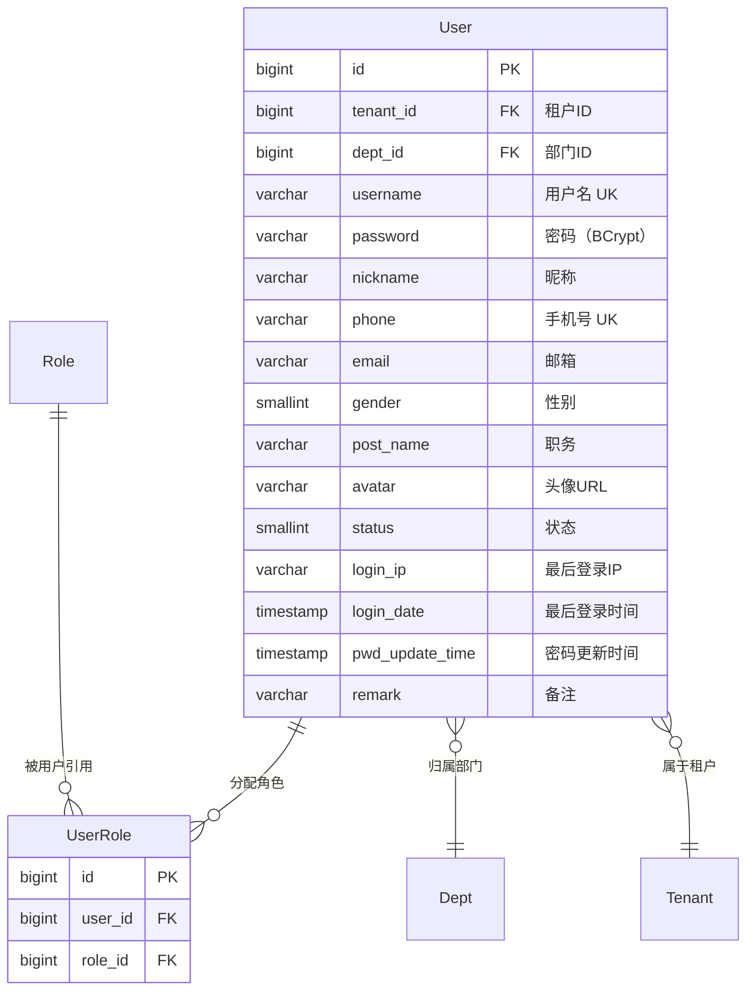

**流程说明**：

1. 用户通过 `sys_user_role` 关联角色，支持一个用户分配多个角色（权限取并集）
2. 用户通过 `dept_id` 归属部门，用于数据权限判断
3. 用户登录时，根据角色列表收集所有菜单权限和按钮权限

**关键点**：

- sys_user 含 `tenant_id`，受租户拦截器隔离
- sys_user_role 含 `tenant_id`，受租户拦截器隔离
- 用户名 `username` 在租户内唯一（联合唯一索引 `tenant_id + username + deleted`）
- 手机号 `phone` 在租户内唯一（条件唯一索引 `tenant_id + phone WHERE phone IS NOT NULL`）
- 密码 `password` 使用 BCrypt 加密存储，永不明文返回前端

------

## 1.3 表结构设计（字段级，逐字段）

### 表：sys_user

| 字段 | 类型 | 必填 | 描述 | 业务含义 | 设计说明 |
|------|------|------|------|---------|---------|
| id | BIGINT | 是 | 主键 | 用户ID | 雪花算法生成 |
| tenant_id | BIGINT | 是 | 租户ID | 数据隔离 | 拦截器自动填充 |
| username | VARCHAR(50) | 是 | 用户名 | 登录账号 | 4-20字符，字母开头，字母数字下划线。联合唯一索引 `tenant_id + username + deleted` |
| password | VARCHAR(200) | 是 | 密码 | BCrypt加密 | 前端传入明文，后端 BCrypt.hashpw 加密后存储。永不出现在响应中 |
| nickname | VARCHAR(50) | 是 | 昵称 | 显示名称 | 2-20 字符 |
| phone | VARCHAR(20) | 否 | 手机号 | 联系方式 | 11位手机号格式。条件唯一索引 `tenant_id + phone WHERE phone IS NOT NULL` |
| email | VARCHAR(100) | 否 | 邮箱 | 联系方式 | 标准邮箱格式校验 |
| gender | SMALLINT | 是 | 性别 | 性别标识 | 0=未知，1=男，2=女。默认 0 |
| post_name | VARCHAR(50) | 否 | 职务 | 职务标识 | 存字典 `sys_user_post` 的 **dict_value（码）**，如 `Manager`。**V13 之前存的是 label（「经理」），已由迁移转换** —— 存展示文案会让职务下拉无法翻译，见 `doc/design/modules/rbac/modules/业务域残留清理/详细设计.md` §3 |
| avatar | VARCHAR(500) | 否 | 头像URL | 用户头像 | 预留字段 |
| dept_id | BIGINT | 否 | 部门ID | 所属部门 | 关联 sys_dept.id |
| status | SMALLINT | 是 | 状态 | 启用/禁用 | 0=禁用，1=启用。默认 1 |
| login_ip | VARCHAR(50) | 否 | 最后登录IP | 审计字段 | 登录成功时更新 |
| login_date | TIMESTAMP | 否 | 最后登录时间 | 审计字段 | 登录成功时更新 |
| pwd_update_time | TIMESTAMP | 否 | 密码更新时间 | 安全审计 | 密码修改时更新 |
| remark | VARCHAR(500) | 否 | 备注 | 备注信息 | - |
| create_time | TIMESTAMP | 是 | 创建时间 | 审计字段 | 自动填充 |
| update_time | TIMESTAMP | 是 | 更新时间 | 审计字段 | 自动更新 |
| deleted | SMALLINT | 是 | 逻辑删除 | 删除标识 | 0=正常，1=已删除。默认 0 |
| create_by | BIGINT | 否 | 创建人 | 审计字段 | - |
| update_by | BIGINT | 否 | 更新人 | 审计字段 | - |

### 表：sys_user_role

| 字段 | 类型 | 必填 | 描述 | 业务含义 | 设计说明 |
|------|------|------|------|---------|---------|
| id | BIGINT | 是 | 主键 | - | 雪花算法 |
| tenant_id | BIGINT | 是 | 租户ID | 数据隔离 | 拦截器自动填充 |
| user_id | BIGINT | 是 | 用户ID | 关联用户 | - |
| role_id | BIGINT | 是 | 角色ID | 关联角色 | - |
| create_time | TIMESTAMP | 是 | 创建时间 | 审计字段 | - |

------

## 1.4 反范式设计

### 反范式字段清单

| 表 | 字段 | 冗余来源 | 冗余原因 | 一致性策略 | 风险 |
|---|------|---------|---------|-----------|------|
| sys_user | post_name | sys_dict_data.dict_value | 避免列表查询时联查字典表 | 存**码**不存 label：字典改译文不影响已存数据，且展示名可随语言变化 | 低 |

> 注：用户列表中的 `deptName` 和 `roles` 信息通过查询时关联获取，不做反范式冗余。

------

## 1.5 索引与约束设计

**唯一索引：**
- `uk_user_tenant_username ON sys_user(tenant_id, username, deleted)` — 租户内用户名唯一
- `uk_user_tenant_phone ON sys_user(tenant_id, phone) WHERE phone IS NOT NULL` — 租户内手机号唯一（允许为空）

**普通索引：**
- `idx_user_tenant_dept ON sys_user(tenant_id, dept_id)` — 按部门查询用户
- `idx_user_tenant_status ON sys_user(tenant_id, status) WHERE deleted = 0` — 按状态查询
- `idx_user_role_user ON sys_user_role(user_id)` — 按用户查角色
- `idx_user_role_role ON sys_user_role(role_id)` — 按角色查用户（角色删除/统计时使用）

------

# 二、模块目标与边界

**模块解决的业务问题：**
管理租户内的用户账号，支持用户 CRUD、角色分配、密码管理。提供基于 Sa-Token 的登录/登出/获取用户信息等认证能力。

**模块不解决的问题：**
- 角色和菜单权限的定义（角色管理模块负责）
- 部门树的构建和查询（部门管理模块提供）
- 操作日志和登录日志的记录（日志管理模块负责）
- 前端路由动态渲染（前端根据 API 返回数据生成）

**是否核心链路：** 是。用户是 RBAC 权限模型的主体，认证是系统入口。

------

## 2.1 模块边界图

```mermaid
flowchart TD
    subgraph 用户管理模块
        A[UserController]
        B[AuthController]
        C[UserService]
        D[AuthService]
        E[UserMapper]
        F[UserRoleMapper]
    end

    subgraph 角色管理模块
        G[RoleService]
    end

    subgraph 部门管理模块
        H[DeptService]
    end

    subgraph 公共基础设施
        I[Sa-Token]
        J[TenantInterceptor]
        K[@Log]
        L[UserContext]
    end

    A --> C
    B --> D
    C --> E
    C --> F
    D --> C

    C -->|验证角色存在性| G
    C -->|验证部门存在性| H

    D --> I
    D --> L
    A --> J
    A --> K
    B --> K
```

------

# 三、整体架构设计

> ⚠️ 明确声明：**本项目不采用 DDD**

------

## 3.1 分层结构定义

```
com.gentry.rbac.user/
├── controller/
│   ├── UserController
│   └── AuthController
├── service/
│   ├── UserService
│   ├── AuthService
│   └── impl/
│       ├── UserServiceImpl
│       └── AuthServiceImpl
├── mapper/
│   ├── UserMapper
│   └── UserRoleMapper
├── entity/
│   ├── User
│   └── UserRole
├── dto/
│   ├── UserCreateDTO
│   ├── UserUpdateDTO
│   ├── UserQueryDTO
│   ├── UserPasswordResetDTO
│   ├── UserPasswordUpdateDTO
│   ├── UserRoleAssignDTO
│   ├── UserStatusDTO
│   └── LoginDTO
├── vo/
│   ├── UserVO
│   ├── UserListVO
│   ├── UserDetailVO
│   ├── LoginVO
│   └── UserInfoVO
└── enums/
    └── Gender
```

### 命名规范

| 数据库表名 | Entity 类名 | Service 接口名 | Controller 类名 |
|-----------|------------|---------------|----------------|
| sys_user | User | UserService / AuthService | UserController / AuthController |
| sys_user_role | UserRole | — | — |

------

## 3.2 枚举设计规范（强制）

| 枚举类 | 枚举值 | code | description |
|--------|--------|------|-------------|
| Gender | 未知 | UNKNOWN | 性别未知 |
| Gender | 男 | MALE | 男性 |
| Gender | 女 | FEMALE | 女性 |

> 数据库 `gender` 字段存储 SMALLINT（0/1/2），Entity 层通过 `@EnumValue` 映射。

------

## 3.3 层级职责与禁止事项

| 层 | 允许做 | 禁止做 |
|---|--------|--------|
| Controller | 参数校验(@Valid)、请求响应处理 | 写业务逻辑 |
| Service | 用户管理事务、密码加密/校验、角色分配（先删后插）、跨模块调用（RoleService/DeptService 只读） | 直接写 SQL |
| AuthService | 登录校验、Token 管理、用户上下文设置 | 操作非用户相关数据 |
| Mapper | 数据访问、SQL 执行 | 业务判断 |

------

# 四、业务模型与数据映射

### Entity 类设计

```mermaid
classDiagram
    direction TB

    class User {
        -Long id
        -Long tenantId
        -String username
        -String password
        -String nickname
        -String phone
        -String email
        -Gender gender
        -String postName
        -String avatar
        -Long deptId
        -Integer status
        -String loginIp
        -LocalDateTime loginDate
        -LocalDateTime pwdUpdateTime
        -String remark
        -Long createBy
        -LocalDateTime createTime
        -Long updateBy
        -LocalDateTime updateTime
        -Integer deleted
    }

    class UserRole {
        -Long id
        -Long tenantId
        -Long userId
        -Long roleId
        -LocalDateTime createTime
    }

    class LoginDTO {
        -String username
        -String password
        %% 注意：LoginDTO 已被「默认租户与登录模式-详细设计.md」扩展，增加了可选的 tenantCode 字段。本定义为基础版本。
    }

    class UserCreateDTO {
        -String username
        -String nickname
        -Long deptId
        -String phone
        -String email
        -Gender gender
        -String postName
        -String password
        -Integer status
        -List~Long~ roleIds
        -String remark
    }

    class UserUpdateDTO {
        -String nickname
        -Long deptId
        -String phone
        -String email
        -Gender gender
        -String postName
        -Integer status
        -List~Long~ roleIds
        -String remark
    }

    class UserPasswordResetDTO {
        -String newPassword
    }

    class UserPasswordUpdateDTO {
        -String oldPassword
        -String newPassword
    }

    class UserRoleAssignDTO {
        -List~Long~ roleIds
    }

    class LoginVO {
        -String token
        -UserInfoVO userInfo
    }

    class UserInfoVO {
        -Long userId
        -String username
        -String nickname
        -String avatar
        -Long deptId
        -String deptName
        -List~RoleInfo~ roles
        -List~String~ permissions
        -List~MenuTreeVO~ menus
        %% 注意：UserInfoVO 已被「登录菜单动态渲染-前端详细设计.md」扩展，增加了 menus 字段。本定义为基础版本。
    }

    class UserListVO {
        -Long id
        -String username
        -String nickname
        -String phone
        -String email
        -Integer gender
        -String postName
        -Long deptId
        -String deptName
        -Integer status
        -LocalDateTime createTime
        -List~RoleVO~ roles
    }
```

**DTO → Entity 映射说明：**

| DTO 字段 | Entity 字段 | 转换逻辑 | 说明 |
|---------|------------|---------|------|
| password | password | BCrypt.hashpw(dto.password, BCrypt.gensalt()) | BCrypt 加密后存储 |
| roleIds | UserRole | 遍历生成 List\<UserRole\> | 新增/编辑时同时处理 |
| — | tenantId | 拦截器自动 | 无需前端传入 |
| — | loginIp | 登录时设置 | 从 HttpRequest 获取 |
| deptId | deptId | 直接映射 | 校验部门存在 |
| postName | postName | 直接映射 | 存字典**码**（`sys_user_post.dict_value`） |

------

# 五、行为流程与用例设计

## 5.1 主流程（时序图）

### 5.1.1 用户登录

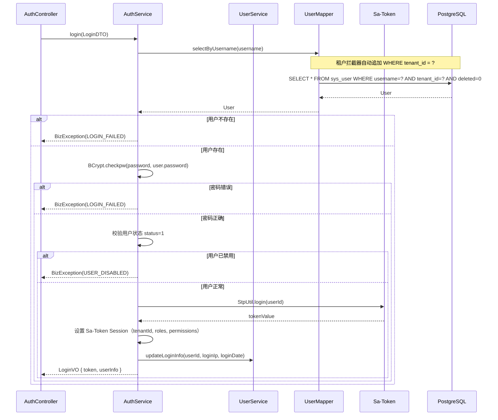

### 5.1.2 新增用户

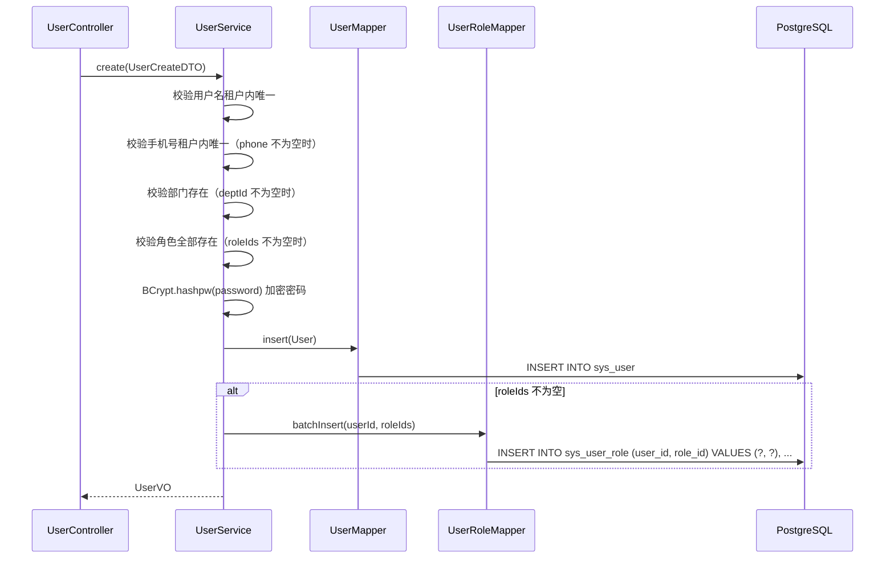

### 5.1.3 分配角色

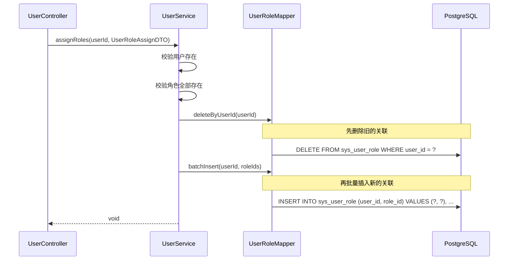

### 5.1.4 删除用户

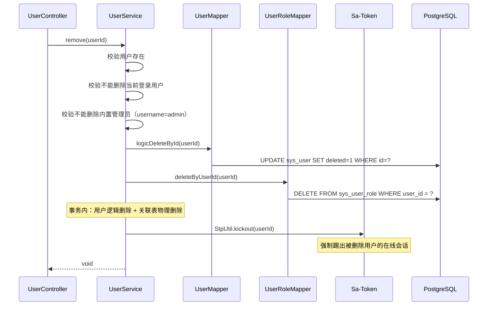

### 5.1.5 修改密码（用户自助）

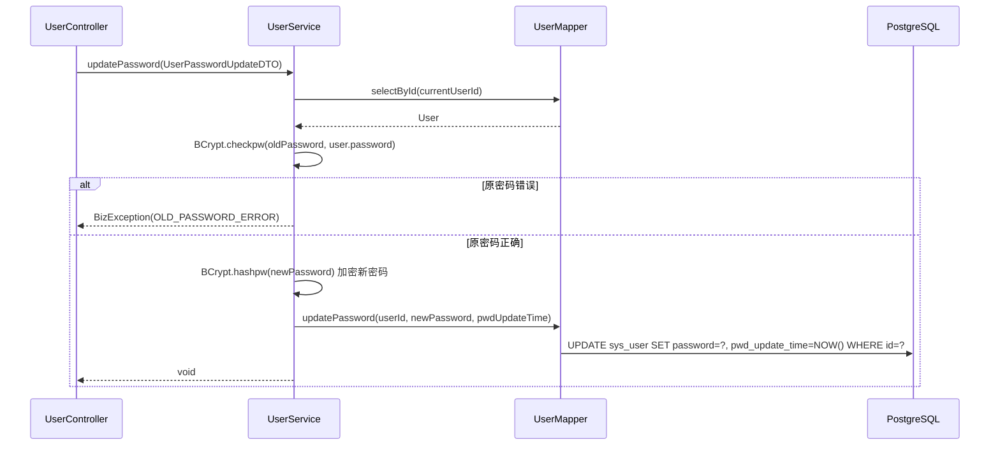

## 5.2 关键业务规则说明

### 用户登录

- **前置条件**：无
- **核心校验**：
  - 用户名 + 密码匹配（BCrypt 校验）
  - 用户状态为启用（status=1）
  - 租户状态为启用（通过 TenantContext 获取，在 Filter 中已校验）
- **处理逻辑**：
  1. 校验通过后调用 `StpUtil.login(userId)` 生成 Token
  2. 设置 Sa-Token Session：tenantId、角色列表、权限列表
  3. 更新 login_ip 和 login_date
  4. 返回 Token + 用户基本信息 + 权限信息
- **失败路径**：
  - 用户名或密码错误 → 抛出 `BizException(LOGIN_FAILED, "用户名或密码错误")`
  - 用户已禁用 → 抛出 `BizException(USER_DISABLED, "用户已禁用")`

### 新增用户

- **前置条件**：操作人为租户管理员
- **核心校验**：
  - 用户名在租户内唯一（`WHERE tenant_id=? AND username=? AND deleted=0`）
  - 用户名格式：4-20 字符，字母开头，字母数字下划线
  - 手机号在租户内唯一（phone 不为空时校验）
  - 内置用户名（admin）禁止使用
  - 部门 ID 必须存在（不为空时校验）
  - 角色 ID 必须全部存在（不为空时校验）
- **失败路径**：
  - 用户名重复 → 抛出 `BizException(USERNAME_EXISTS, "用户名已存在")`

### 编辑用户

- **前置条件**：用户存在
- **核心校验**：
  - 用户名不可修改
  - 手机号修改后需校验租户内唯一（排除自身）
  - 不能将当前登录用户禁用
- **失败路径**：
  - 手机号重复 → 抛出 `BizException(PARAM_ERROR, "手机号已被使用")`

### 删除用户

- **前置条件**：用户存在
- **核心校验**：
  - 不能删除当前登录用户（`UserContext.getUserId() == userId`）
  - 不能删除内置管理员（`username = "admin"`）
- **处理逻辑**：
  1. 逻辑删除 sys_user
  2. 物理删除 sys_user_role
  3. 强制踢出该用户在线会话
- **失败路径**：
  - 删除自己 → 抛出 `BizException(PARAM_ERROR, "不能删除当前登录用户")`
  - 删除 admin → 抛出 `BizException(PARAM_ERROR, "系统管理员不可删除")`

### 分配角色

- **前置条件**：用户存在
- **核心校验**：
  - roleIds 中的角色 ID 必须全部存在
  - 空列表表示清除所有角色（合法操作）
- **处理逻辑**：先删后插（在同一事务内）
- **失败路径**：
  - 用户不存在 → 抛出 `BizException(USER_NOT_FOUND, "用户不存在")`

### 重置密码（管理员）

- **前置条件**：用户存在
- **核心校验**：
  - 新密码格式：8-20位，含大小写字母+数字
- **处理逻辑**：
  1. BCrypt 加密新密码
  2. 更新 password 和 pwd_update_time
  3. 强制踢出该用户在线会话（使其重新登录）

### 修改密码（用户自助）

- **前置条件**：用户已登录
- **核心校验**：
  - 原密码正确
  - 新密码格式：8-20位，含大小写字母+数字
- **失败路径**：
  - 原密码错误 → 抛出 `BizException(OLD_PASSWORD_ERROR, "原密码错误")`

### 获取用户信息（登录后）

- **前置条件**：用户已登录
- **处理逻辑**：
  1. 从 Sa-Token 获取当前用户 ID
  2. 查询用户基本信息
  3. 查询用户角色列表
  4. 根据角色列表收集所有权限标识（去重）
  5. 根据角色列表查询分配的菜单树
  6. 组装 UserInfoVO 返回

------

# 六、状态机设计

### 用户状态

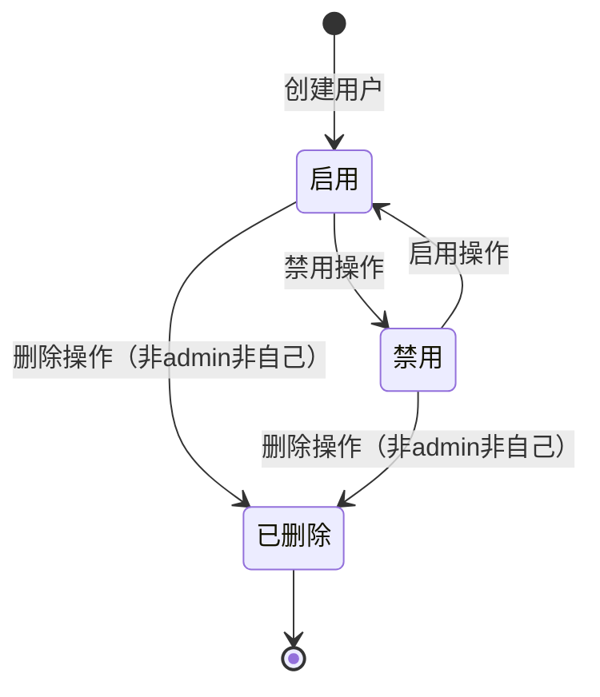

**状态值映射：**

| 状态 | status 值 | 说明 |
|------|----------|------|
| 启用 | 1 | 正常可用，可登录 |
| 禁用 | 0 | 禁用，已登录用户下次请求被拒绝，不可再登录 |
| 已删除 | deleted = 1 | 逻辑删除，踢出在线会话 |

------

# 七、接口设计（前后端核心契约）

> **目标：无代码即可协同开发**

------

## 7.1 接口清单

### 认证接口（AuthController）

| 接口编号 | 接口名称 | URL | Method | 认证 | 授权 |
|---------|---------|-----|--------|------|------|
| AUTH-001 | 用户登录 | /api/v1/auth/login | POST | 否 | 公开 |
| AUTH-002 | 用户登出 | /api/v1/auth/logout | POST | 是 | — |
| AUTH-003 | 获取用户信息 | /api/v1/auth/user-info | GET | 是 | — |
| AUTH-004 | 修改密码 | /api/v1/auth/password | PUT | 是 | — |

### 用户管理接口（UserController）

| 接口编号 | 接口名称 | URL | Method | 认证 | 授权 |
|---------|---------|-----|--------|------|------|
| USER-001 | 用户列表查询 | /api/v1/users | GET | 是 | system:user:list |
| USER-002 | 用户详情 | /api/v1/users/{id} | GET | 是 | system:user:list |
| USER-003 | 新增用户 | /api/v1/users | POST | 是 | system:user:add |
| USER-004 | 编辑用户 | /api/v1/users/{id} | PUT | 是 | system:user:edit |
| USER-005 | 删除用户 | /api/v1/users/{id} | DELETE | 是 | system:user:remove |
| USER-006 | 重置密码 | /api/v1/users/{id}/password/reset | PUT | 是 | system:user:resetPwd |
| USER-007 | 分配角色 | /api/v1/users/{id}/roles | PUT | 是 | system:user:assignRole |
| USER-008 | 切换用户状态 | /api/v1/users/{id}/status | PUT | 是 | system:user:edit |

------

## 7.2 入参设计

### AUTH-001 用户登录

**请求对象：** `LoginDTO`

| 参数 | 类型 | 必填 | 描述 | 校验规则 |
|------|------|------|------|---------|
| username | String | 是 | 用户名 | @NotBlank |
| password | String | 是 | 密码 | @NotBlank |

**请求示例：**

```json
{
  "username": "admin",
  "password": "Abc@123456"
}
```

### AUTH-003 获取用户信息

无请求参数，通过 Token 识别当前用户。

### AUTH-004 修改密码

**请求对象：** `UserPasswordUpdateDTO`

| 参数 | 类型 | 必填 | 描述 | 校验规则 |
|------|------|------|------|---------|
| oldPassword | String | 是 | 原密码 | @NotBlank |
| newPassword | String | 是 | 新密码 | @Pattern(regexp="^(?=.*[a-z])(?=.*[A-Z])(?=.*\\d)[a-zA-Z\\d@$!%*?&]{8,20}$") |

### USER-001 用户列表查询

**请求对象：** `UserQueryDTO`

| 参数 | 类型 | 必填 | 描述 | 校验规则 |
|------|------|------|------|---------|
| pageNum | Integer | 是 | 页码 | ≥ 1 |
| pageSize | Integer | 是 | 每页条数 | 1-100 |
| deptId | Long | 否 | 部门ID | 含子部门用户 |
| username | String | 否 | 用户名 | 模糊匹配 |
| phone | String | 否 | 手机号 | 精确匹配 |
| status | Integer | 否 | 状态 | 0=禁用，1=启用，null=全部 |

### USER-003 新增用户

**请求对象：** `UserCreateDTO`

| 参数 | 类型 | 必填 | 描述 | 校验规则 |
|------|------|------|------|---------|
| username | String | 是 | 用户名 | @Pattern(regexp="^[a-zA-Z][a-zA-Z0-9_]{3,19}$") |
| nickname | String | 是 | 昵称 | @Size(min=2, max=20) |
| deptId | Long | 否 | 部门ID | — |
| phone | String | 否 | 手机号 | @Pattern(regexp="^1[3-9]\\d{9}$") |
| email | String | 否 | 邮箱 | @Email |
| gender | Integer | 否 | 性别 | 0/1/2，默认 0 |
| postName | String | 否 | 职务 | @Size(max=50) |
| password | String | 是 | 初始密码 | @Pattern(regexp="^(?=.*[a-z])(?=.*[A-Z])(?=.*\\d)[a-zA-Z\\d@$!%*?&]{8,20}$") |
| status | Integer | 否 | 状态 | 默认 1 |
| roleIds | List\<Long\> | 否 | 角色ID列表 | — |
| remark | String | 否 | 备注 | @Size(max=500) |

**请求示例：**

```json
{
  "username": "zhangsan",
  "nickname": "张三",
  "deptId": 2,
  "phone": "13800138001",
  "email": "zhangsan@example.com",
  "gender": 1,
  "password": "Abc@123456",
  "status": 1,
  "roleIds": [2, 3],
  "remark": "运营部员工"
}
```

### USER-004 编辑用户

**请求对象：** `UserUpdateDTO`

| 参数 | 类型 | 必填 | 描述 | 校验规则 |
|------|------|------|------|---------|
| nickname | String | 是 | 昵称 | @Size(min=2, max=20) |
| deptId | Long | 否 | 部门ID | — |
| phone | String | 否 | 手机号 | @Pattern(regexp="^1[3-9]\\d{9}$") |
| email | String | 否 | 邮箱 | @Email |
| gender | Integer | 否 | 性别 | 0/1/2 |
| postName | String | 否 | 职务 | @Size(max=50) |
| status | Integer | 否 | 状态 | 0/1 |
| roleIds | List\<Long\> | 否 | 角色ID列表 | — |
| remark | String | 否 | 备注 | @Size(max=500) |

> **注意**：用户名 username 不可修改。

### USER-006 重置密码

**请求对象：** `UserPasswordResetDTO`

| 参数 | 类型 | 必填 | 描述 | 校验规则 |
|------|------|------|------|---------|
| newPassword | String | 是 | 新密码 | @Pattern(regexp="^(?=.*[a-z])(?=.*[A-Z])(?=.*\\d)[a-zA-Z\\d@$!%*?&]{8,20}$") |

### USER-007 分配角色

**请求对象：** `UserRoleAssignDTO`

| 参数 | 类型 | 必填 | 描述 | 校验规则 |
|------|------|------|------|---------|
| roleIds | List\<Long\> | 是 | 角色ID列表 | 可为空列表（清除角色） |

### USER-008 切换用户状态

**请求对象：** `UserStatusDTO`

| 参数 | 类型 | 必填 | 描述 | 校验规则 |
|------|------|------|------|---------|
| status | Integer | 是 | 状态 | 0=禁用，1=启用 |

------

## 7.3 出参设计

### LoginVO（登录响应）

| 字段 | 类型 | 描述 |
|------|------|------|
| token | String | Sa-Token 令牌 |
| userInfo | UserInfoVO | 用户信息 |

### UserInfoVO（用户信息响应）

| 字段 | 类型 | 描述 |
|------|------|------|
| userId | Long | 用户ID |
| username | String | 用户名 |
| nickname | String | 昵称 |
| avatar | String | 头像URL |
| deptId | Long | 部门ID |
| deptName | String | 部门名称 |
| roles | List\<RoleInfo\> | 角色列表 |
| permissions | List\<String\> | 权限标识列表 |
| menus | List\<MenuTreeVO\> | 菜单树（用于前端路由渲染） |

**RoleInfo 结构：**

| 字段 | 类型 | 描述 |
|------|------|------|
| id | Long | 角色ID |
| roleCode | String | 角色编码 |
| roleName | String | 角色名称 |
| i18nKey | String | 由 `role_code` 派生，不落库。见 i18n 后端详细设计 §2.2.11a |
| dataScope | Integer | 数据权限范围 |

### UserListVO（列表响应）

| 字段 | 类型 | 描述 |
|------|------|------|
| id | Long | 用户ID |
| username | String | 用户名 |
| nickname | String | 昵称 |
| phone | String | 手机号（脱敏） |
| email | String | 邮箱 |
| gender | Integer | 性别 |
| postName | String | 职务 |
| deptId | Long | 部门ID |
| deptName | String | 部门名称 |
| status | Integer | 状态 |
| createTime | LocalDateTime | 创建时间 |
| roles | List\<RoleVO\> | 角色列表 |

**RoleVO 结构（简化）：**

| 字段 | 类型 | 描述 |
|------|------|------|
| id | Long | 角色ID |
| roleName | String | 角色名称 |
| i18nKey | String | 由 `role_code` 派生，不落库 |
| roleCode | String | 角色编码 |

### UserDetailVO（详情响应）

| 字段 | 类型 | 描述 |
|------|------|------|
| id | Long | 用户ID |
| username | String | 用户名 |
| nickname | String | 昵称 |
| phone | String | 手机号 |
| email | String | 邮箱 |
| gender | Integer | 性别 |
| postName | String | 职务 |
| avatar | String | 头像URL |
| deptId | Long | 部门ID |
| deptName | String | 部门名称 |
| status | Integer | 状态 |
| remark | String | 备注 |
| roleIds | List\<Long\> | 已分配的角色ID列表 |
| roles | List\<RoleVO\> | 角色列表 |
| loginIp | String | 最后登录IP |
| loginDate | LocalDateTime | 最后登录时间 |
| pwdUpdateTime | LocalDateTime | 密码更新时间 |
| createTime | LocalDateTime | 创建时间 |
| updateTime | LocalDateTime | 更新时间 |

**响应示例（登录）：**

```json
{
  "code": 0,
  "message": "success",
  "data": {
    "token": "abc123-def456-ghi789",
    "userInfo": {
      "userId": 1,
      "username": "admin",
      "nickname": "管理员",
      "avatar": null,
      "deptId": 1,
      "deptName": "总公司",
      "roles": [
        { "id": 1, "roleCode": "ADMIN", "roleName": "管理员", "i18nKey": "role.admin", "dataScope": 1 }
      ],
      "permissions": ["system:user:list", "system:user:add", "system:role:list", "..."],
      "menus": [
        {
          "id": 1,
          "parentId": 0,
          "name": "系统管理",
          "type": 1,
          "path": "/system",
          "children": [...]
        }
      ]
    }
  }
}
```

**响应示例（列表）：**

```json
{
  "code": 0,
  "message": "success",
  "data": {
    "list": [
      {
        "id": 1,
        "username": "admin",
        "nickname": "管理员",
        "phone": "138****8000",
        "email": "admin@example.com",
        "gender": 1,
        "postName": "总经理",
        "deptId": 1,
        "deptName": "总公司",
        "status": 1,
        "createTime": "2026-01-15 10:30:00",
        "roles": [
          { "id": 1, "roleName": "管理员", "roleCode": "ADMIN", "i18nKey": "role.admin" }
        ]
      }
    ],
    "total": 25,
    "pageNum": 1,
    "pageSize": 10,
    "pages": 3
  }
}
```

------

## 7.4 接口治理要求（强制）

| 接口 | 是否启用全局防抖 | 是否需要接口级防抖 | 是否幂等 | 幂等依据 | 日志级别 |
|------|----------------|------------------|---------|---------|---------|
| AUTH-001 登录 | 否 | 是（1s） | 否 | Token 每次不同 | @Log |
| AUTH-002 登出 | 是 | 否 | 是 | 无副作用 | @Log |
| AUTH-003 用户信息 | 是 | 否 | 是 | 相同参数相同结果 | 无 |
| AUTH-004 修改密码 | 是 | 是（1s） | 是 | 密码覆盖 | @Log |
| USER-001 列表查询 | 是 | 否 | 是 | 相同参数相同结果 | 无 |
| USER-002 详情 | 是 | 否 | 是 | 相同参数相同结果 | 无 |
| USER-003 新增用户 | 是 | 否 | 否 | 同名校验阻止重复 | @Log |
| USER-004 编辑用户 | 是 | 否 | 是 | 全量更新 | @Log |
| USER-005 删除用户 | 是 | 否 | 是 | 逻辑删除 | @Log |
| USER-006 重置密码 | 是 | 是（1s） | 是 | 密码覆盖 | @Log |
| USER-007 分配角色 | 是 | 是（1s） | 是 | 先删后插 | @Log |
| USER-008 切换状态 | 是 | 否 | 是 | 状态值覆盖 | @Log |

------

# 八、模块安全规范

------

## 8.1 认证与授权要求

本模块是否需要认证：**认证接口（AUTH-001）不需要，用户管理接口全部需要**
认证方式：Sa-Token（UUID Token，基于服务端 Session）
SSO 演进方案：JWT + Redis 黑名单（详见概要设计 §7.2.4）
本模块是否需要授权：**是**
授权粒度：**接口级**

### 接口权限配置

| 接口 | 权限标识 | 权限说明 | 是否公开 |
|------|---------|---------|---------|
| AUTH-001 登录 | — | 公开接口 | 是 |
| AUTH-002 登出 | — | 已登录用户 | 否（仅需认证） |
| AUTH-003 用户信息 | — | 已登录用户 | 否（仅需认证） |
| AUTH-004 修改密码 | — | 已登录用户（仅改自己） | 否（仅需认证） |
| USER-001 列表查询 | system:user:list | 查询用户列表 | 否 |
| USER-002 详情 | system:user:list | 查看用户详情 | 否 |
| USER-003 新增用户 | system:user:add | 新增用户 | 否 |
| USER-004 编辑用户 | system:user:edit | 编辑用户 | 否 |
| USER-005 删除用户 | system:user:remove | 删除用户 | 否 |
| USER-006 重置密码 | system:user:resetPwd | 重置用户密码 | 否 |
| USER-007 分配角色 | system:user:assignRole | 分配角色 | 否 |
| USER-008 切换状态 | system:user:edit | 启用/禁用用户 | 否 |

------

## 8.2 敏感数据处理

### 敏感字段清单

| 字段名 | 所属表/对象 | 敏感等级 | 存储处理 | 传输处理 | 展示处理 |
|--------|-----------|---------|---------|---------|---------|
| password | sys_user | 高 | BCrypt 加密 | HTTPS | 禁止出现在任何响应中 |
| phone | sys_user / UserListVO | 中 | 明文存储 | HTTPS | 列表脱敏 138\*\*\*\*8000 |
| phone | sys_user / UserDetailVO | 中 | 明文存储 | HTTPS | 详情完整展示 |

### 密码安全规范

| 规范项 | 要求 |
|--------|------|
| 加密算法 | BCrypt，成本因子 10 |
| 密码强度 | 8-20 位，必须含大写字母、小写字母、数字 |
| 密码传输 | HTTPS，前端明文传输（后端加密） |
| 密码存储 | BCrypt hash，永不明文存储 |
| 密码展示 | 永不返回密码字段（包括加密后的 hash） |
| 密码修改 | 校验原密码，更新 pwd_update_time |
| 密码重置 | 管理员操作，强制踢出在线会话 |

------

## 8.3 安全检查清单

- [x] 所有接口是否配置了正确的权限？ → system:user:* 系列 + 认证公开
- [x] 密码是否加密存储？ → BCrypt
- [x] 密码是否在响应中隐藏？ → UserVO/UserListVO 不含 password 字段
- [x] 手机号是否脱敏展示？ → 列表脱敏，详情完整
- [x] 输入参数是否有完整的校验？ → @Valid + JSR 303
- [x] 是否有 SQL 注入风险？ → MyBatis-Flex 参数化查询
- [x] 操作日志是否完整？ → 所有写接口添加 @Log
- [x] 删除用户是否踢出会话？ → StpUtil.kickout()
- [x] 禁用用户是否阻止登录？ → 登录时校验 status
- [x] 内置管理员保护？ → admin 用户禁止删除和禁用
- [x] 不能删除/禁用自己？ → UserContext.getUserId() 校验

------

# 九、算法设计

### 9.1 是否涉及算法

是否涉及算法：**否**

> 本模块无算法设计。用户列表按部门查询时，通过 DeptService 查询子部门 ID 列表，然后用 IN 条件过滤。角色分配为"先删后插"模式。

------

# 十、前后端交互模型

### 登录交互时序

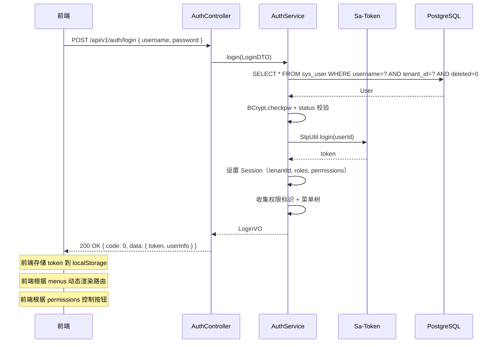

### SSO 演进后登录交互时序（JWT + Redis 黑名单）

> 以下为平台演进到微服务 SSO 后的登录流程，当前阶段不实现，作为设计预留。参考 Sa-Token SSO Pro 模式二的业务流程。

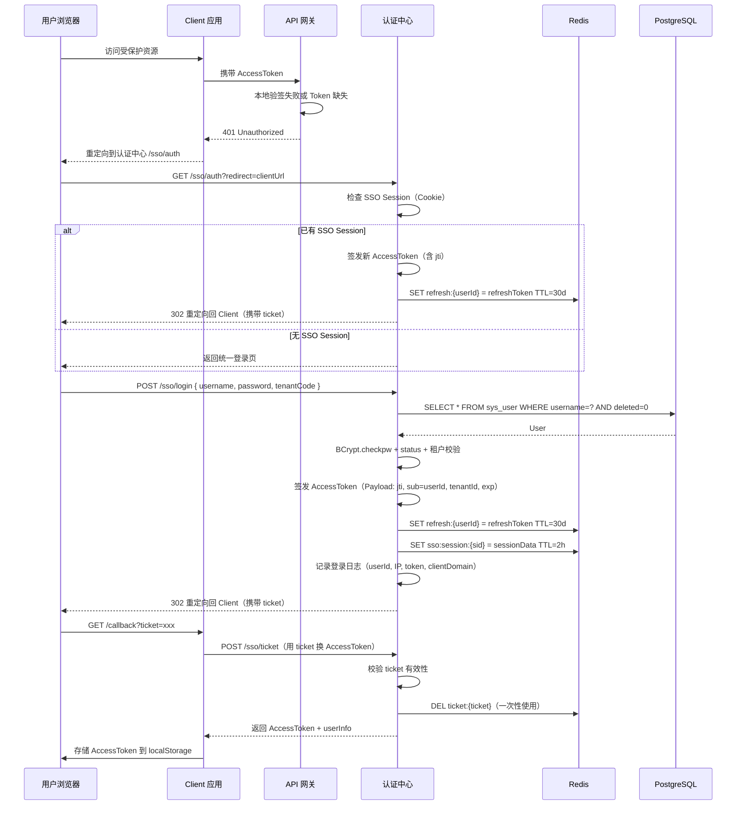

### SSO 演进后登出交互时序

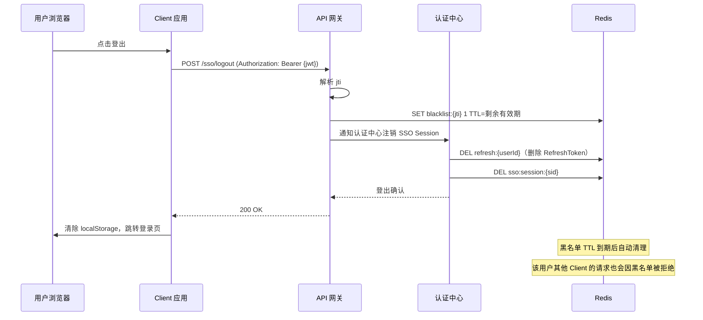

### SSO 演进后改密码踢设备时序

```mermaid
sequenceDiagram
    participant U as 用户浏览器
    participant GW as API 网关
    participant Svc as UserService
    participant R as Redis
    participant DB as PostgreSQL

    U->>GW: PUT /api/v1/users/password (Authorization: Bearer {jwt})
    GW->>GW: 验签 + 查黑名单
    GW->>Svc: 修改密码请求
    Svc->->DB: UPDATE sys_user SET password=BCrypt(newPwd)
    Svc->>R: 获取该用户所有活跃 jti 列表
    Svc->>R: 批量 SET blacklist:{jti} 1 TTL=剩余有效期
    Svc->>R: DEL refresh:{userId}（删除 RefreshToken）
    Svc-->>GW: 修改成功
    GW-->>U: 200 OK → 前端跳转登录页

    Note over R: 所有设备即时失效（jti 入黑名单 + RefreshToken 删除）
```

### 新增用户交互时序

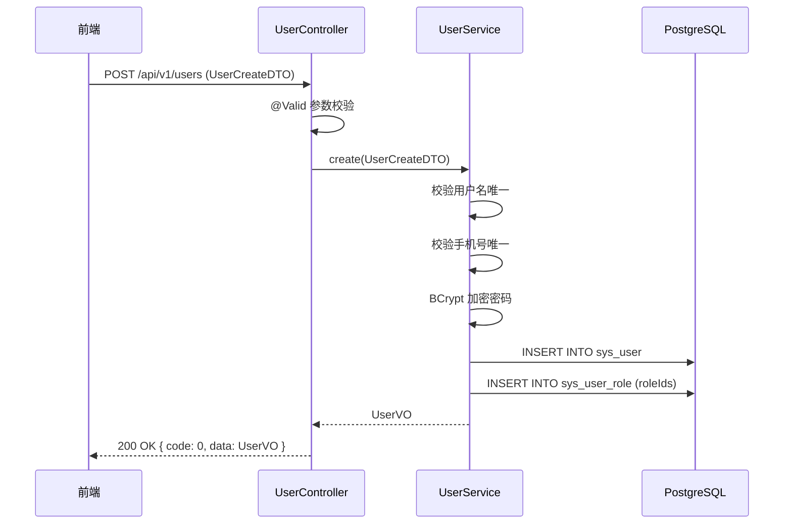

### 部门筛选用户交互时序

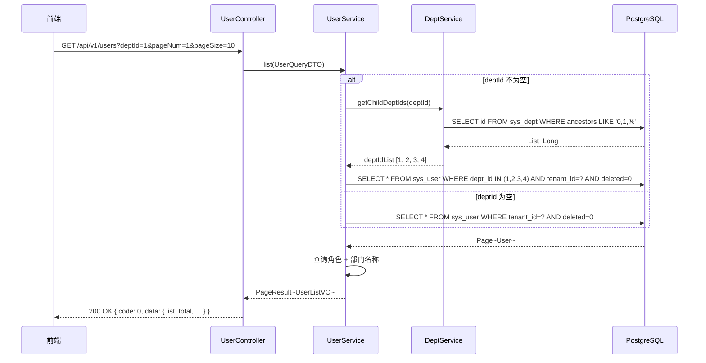

------

# 十一、测试用例设计

## 正常流程

| 用例ID | 测试场景 | 前置条件 | 测试步骤 | 预期结果 |
|--------|---------|---------|---------|---------|
| USER-001 | 用户登录 | 已存在用户 admin/Abc@123456 | 调用 AUTH-001 | 返回 token + userInfo（含 roles, permissions, menus） |
| USER-002 | 用户登出 | 已登录 | 调用 AUTH-002 | Token 失效 |
| USER-003 | 获取用户信息 | 已登录 | 调用 AUTH-003 | 返回完整 userInfo |
| USER-004 | 新增用户 | - | 填写 username+nickname+password | 创建成功，密码已 BCrypt 加密 |
| USER-005 | 新增用户并分配角色 | 角色存在 | 填写 roleIds=[1,2] | 创建成功，sys_user_role 写入 2 条 |
| USER-006 | 编辑用户昵称 | 用户存在 | 修改 nickname | 修改成功 |
| USER-007 | 分配角色 | 用户存在 + 角色存在 | 传入 roleIds | 先删后插成功 |
| USER-008 | 重置密码 | 用户存在 | 管理员重置密码 | 密码已更新，在线会话已踢出 |
| USER-009 | 修改密码 | 用户已登录 | 输入正确原密码+新密码 | 密码已更新 |
| USER-010 | 删除用户 | 用户存在且非 admin | 删除 | 成功，关联表已清理，在线会话已踢出 |
| USER-011 | 切换用户状态 | 用户为启用 | 禁用 | status 变为 0 |
| USER-012 | 按部门查询用户 | 部门树存在 | deptId=1 | 返回该部门及子部门下的用户 |
| USER-013 | 用户列表手机号脱敏 | 用户有手机号 | 查询列表 | 手机号显示为 138****8000 |

## 异常流程

| 用例ID | 测试场景 | 前置条件 | 测试步骤 | 预期结果 |
|--------|---------|---------|---------|---------|
| USER-014 | 登录用户名错误 | - | 不存在的用户名 | 提示"用户名或密码错误" |
| USER-015 | 登录密码错误 | 用户存在 | 错误密码 | 提示"用户名或密码错误" |
| USER-016 | 登录已禁用用户 | 用户已禁用 | 正确账密 | 提示"用户已禁用" |
| USER-017 | 用户名重复 | 已有用户 admin | 新增同名用户 | 提示"用户名已存在" |
| USER-018 | 手机号重复 | 已有手机号 13800138000 | 新增同手机号用户 | 提示"手机号已被使用" |
| USER-019 | 删除当前登录用户 | - | 删除自己 | 提示"不能删除当前登录用户" |
| USER-020 | 删除 admin 用户 | admin 存在 | 删除 admin | 提示"系统管理员不可删除" |
| USER-021 | 禁用 admin 用户 | admin 存在 | 禁用 admin | 提示"系统管理员不可禁用" |
| USER-022 | 禁用当前登录用户 | - | 禁用自己 | 提示"不能禁用当前登录用户" |
| USER-023 | 修改密码原密码错误 | - | 输入错误原密码 | 提示"原密码错误" |
| USER-024 | 新增用户使用 admin 用户名 | - | username=admin | 提示"系统保留用户名不可使用" |
| USER-025 | 分配不存在的角色 | - | roleIds 包含无效 ID | 提示"角色不存在" |

## 边界条件

| 用例ID | 测试场景 | 前置条件 | 测试步骤 | 预期结果 |
|--------|---------|---------|---------|---------|
| USER-026 | 用户名最小长度 | - | username=`abcd`（4字符） | 创建成功 |
| USER-027 | 用户名数字开头 | - | username=`1admin` | 校验失败 |
| USER-028 | 密码最小强度 | - | password=`Abc12345` | 创建成功 |
| USER-029 | 密码强度不足 | - | password=`12345678` | 校验失败（无大写字母） |
| USER-030 | 手机号为空 | - | phone=null | 创建成功（允许为空） |
| USER-031 | 清空用户角色 | 用户已有角色 | roleIds=[] | 成功，sys_user_role 为空 |
| USER-032 | 编辑时不修改用户名 | - | 传入 username 字段 | 忽略 username 字段 |

## 并发 / 幂等

| 用例ID | 测试场景 | 前置条件 | 测试步骤 | 预期结果 |
|--------|---------|---------|---------|---------|
| USER-033 | 并发新增同名用户 | - | 两个请求同时新增 | 唯一索引阻止一个 |
| USER-034 | 重复删除 | 用户已删除 | 再次删除同一 ID | 幂等成功 |
| USER-035 | 重复切换状态 | 用户已禁用 | 再次禁用 | 幂等成功 |

## 数据一致性

| 用例ID | 测试场景 | 前置条件 | 测试步骤 | 预期结果 |
|--------|---------|---------|---------|---------|
| USER-036 | 新增用户事务一致性 | 角色校验失败 | 新增用户并分配无效角色 | sys_user 不插入（事务回滚） |
| USER-037 | 删除用户事务一致性 | 用户有角色 | 删除 | sys_user 逻辑删除 + sys_user_role 物理删除，全部在同一事务 |
| USER-038 | 分配角色事务一致性 | - | 分配无效角色 | sys_user_role 不变（事务回滚） |
| USER-039 | 租户隔离 | 两个租户各有用户 | 用租户A查询 | 仅返回租户A的用户 |
| USER-040 | 登录后权限完整 | 用户有 2 个角色 | 获取 userInfo | permissions 为两个角色权限的并集 |

------

## 变更记录

| 版本 | 日期 | 修改人 | 变更内容 | 变更原因 | 评审人 |
|------|------|--------|---------|---------|--------|
| v1.0.0 | 2026-03-30 | 后端开发（AI） | 初始版本 | 用户管理+认证详细设计 | 待评审 |
| v1.1.0 | 2026-05-05 | 后端开发（AI） | §8.1 认证方式补充 SSO 演进引用；新增 SSO 登录/登出/改密码踢设备时序图（JWT+Redis 黑名单）；补充 Token 类型说明 | 补充 SSO 认证流程设计 | 待评审 |
| v1.2.0 | 2026-09-03 | 技术经理（AI辅助） | UserInfoVO.RoleInfo / 列表 RoleVO 增加 `i18nKey` | 对齐 i18n 内置角色名增量 | 待评审 |
