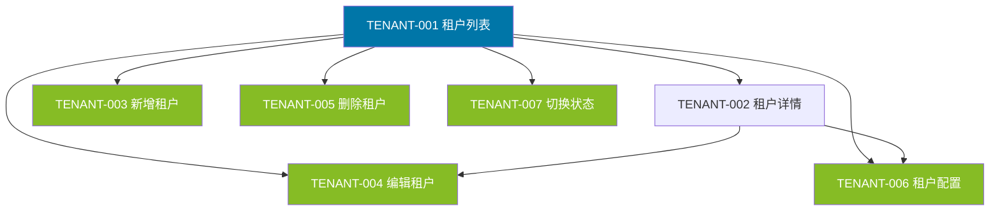
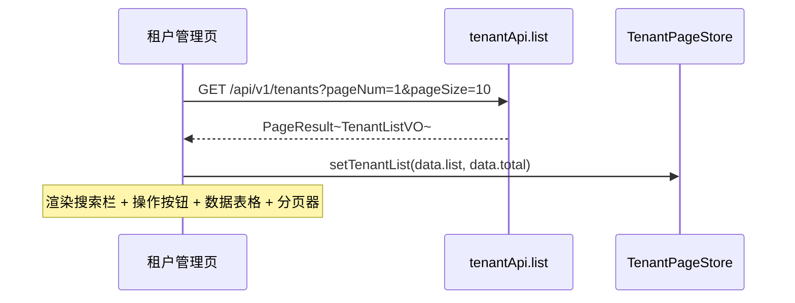
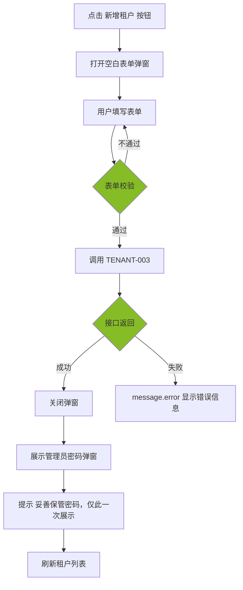
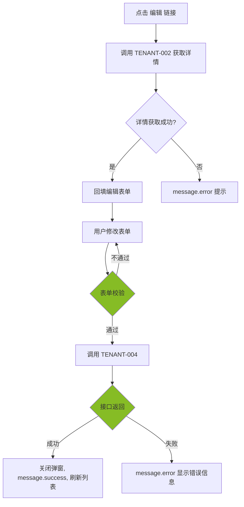
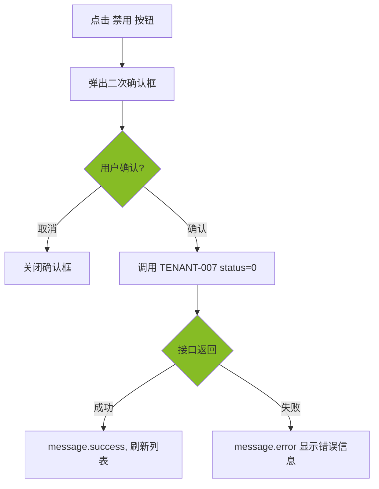
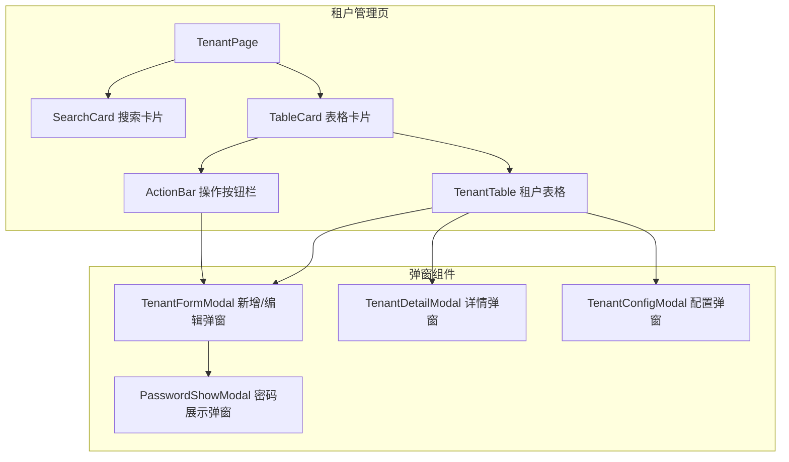

# 前端详细设计文档

## 文档信息

| 项目 | 内容 |
|------|------|
| 文档名称 | 租户管理 前端详细设计文档 |
| 对应后端模块 | 租户管理（模块标识：tenant） |
| 参考文档 | `doc/design/modules/rbac/modules/租户管理/后端详细设计.md` |
| 静态页面 | `static_fe/src/app/pages/Tenants.tsx` |
| 版本 | v1.0.0 |
| 创建日期 | 2026-04-11 |
| 最后更新 | 2026-04-11 |
| 负责人 | 前端开发（AI辅助） |

---

# 一、模块概述

## 1.1 功能描述

本模块前端实现**租户管理**功能，面向平台超级管理员，提供以下能力：

- **租户列表**：分页展示所有租户信息，支持按名称、编码、状态筛选
- **新增租户**：填写租户基本信息，创建后自动编排生成默认部门、管理员角色和 admin 用户
- **编辑租户**：修改租户基本信息（租户编码不可修改）
- **租户详情**：查看租户完整信息，包含统计数据（用户数、部门数、角色数）
- **租户配置**：配置租户级参数（功能开关、设备限额、地图服务商等）
- **启用/禁用**：切换租户状态，禁用时踢出该租户所有在线会话
- **删除租户**：仅允许删除无业务用户的租户

## 1.2 模块边界与职责

| 职责 | 说明 |
|------|------|
| **本模块负责** | 租户列表页、新增/编辑租户弹窗、租户详情弹窗、租户配置弹窗、状态切换、删除 |
| **其他模块负责** | 租户下用户的增删改（用户管理模块负责）、部门/角色的定义（各自模块负责）、设备统计（业务模块提供）、操作日志记录（后端 AOP 自动） |

## 1.3 用户角色与权限

| 角色 | 可执行操作 | 对应权限标识 |
|------|----------|-------------|
| 平台超级管理员 | 所有操作（租户管理仅面向平台超管） | system:tenant:list / add / edit / remove / config |

> **重要**：租户管理是平台级操作，不属于任何租户的租户级功能。所有接口均需平台超管权限，sys_tenant 是全局表（无 tenant_id）。

---

# 二、接口调用总览

## 2.1 接口引用说明

| 接口标识 | 接口名称 | HTTP方法 | 路径 | 主要用途 | 对应后端文档章节 |
|----------|----------|----------|------|----------|-----------------|
| TENANT-001 | 租户列表查询 | GET | /api/v1/tenants | 租户列表页加载、搜索、翻页 | §7.2 TENANT-001 |
| TENANT-002 | 租户详情 | GET | /api/v1/tenants/{id} | 详情弹窗回填、编辑弹窗回填 | §7.2 TENANT-002 |
| TENANT-003 | 新增租户 | POST | /api/v1/tenants | 新增弹窗提交 | §7.2 TENANT-003 |
| TENANT-004 | 编辑租户 | PUT | /api/v1/tenants/{id} | 编辑弹窗提交 | §7.2 TENANT-004 |
| TENANT-005 | 删除租户 | DELETE | /api/v1/tenants/{id} | 列表删除按钮 | §7.2 TENANT-005 |
| TENANT-006 | 租户配置 | PUT | /api/v1/tenants/{id}/config | 配置弹窗提交 | §7.2 TENANT-006 |
| TENANT-007 | 切换租户状态 | PUT | /api/v1/tenants/{id}/status | 列表状态 Switch | §7.2 TENANT-007 |

## 2.2 接口依赖关系



**说明**：TENANT-001 是核心查询接口，页面初始化、搜索、翻页均依赖此接口。TENANT-002 为详情查询，编辑和配置操作前需先获取租户详情回填表单。所有写操作成功后刷新列表。

---

# 三、页面详细设计

## 3.1 页面清单

| 页面名称 | 路由路径 | 页面功能描述 | 关联接口列表 |
|----------|----------|--------------|--------------|
| 租户管理页 | /system/tenants | 租户列表展示，搜索筛选，新增/编辑/删除/配置/状态切换操作 | TENANT-001~007 |

## 3.2 页面跳转关系


**说明**：租户管理是单页面结构，所有操作（新增、编辑、详情、配置）均通过弹窗（Modal）完成，不涉及页面跳转。通过侧边栏菜单「系统管理 > 租户管理」进入。

---

# 四、页面初始化流程设计

## 4.1 租户管理页初始化流程

### 4.1.1 接口调用序列

| 顺序 | 接口 | 并行/串行 | 说明 |
|------|------|----------|------|
| 1 | TENANT-001 租户列表 | — | 加载租户列表数据（默认 pageNum=1, pageSize=10） |

> 租户管理页无需并行加载其他数据，仅调用一个列表接口即可完成初始化。

### 4.1.2 初始化时序图



### 4.1.3 初始化数据流

1. 租户列表接口返回 `PageResult<TenantListVO>` → `list` 渲染表格行，`total` 渲染分页器
2. 搜索栏渲染为静态表单，无初始数据
3. 操作按钮根据用户权限（system:tenant:add / edit / remove / config）控制显隐

---

# 五、用户操作流程设计

## 5.1 操作-接口映射表

| 用户操作描述 | 触发组件 | 调用接口 | 请求参数构造 | 响应数据处理 | 异常处理 |
|-------------|---------|---------|-------------|-------------|---------|
| 点击查询按钮 | 搜索栏查询按钮 | TENANT-001 | 从搜索表单收集 name, code, status | 重置表格数据和分页 | message.error 提示 |
| 点击重置按钮 | 搜索栏重置按钮 | — | 清空搜索表单，重置分页，重新调用 TENANT-001 | — | — |
| 点击刷新按钮 | 刷新按钮 | TENANT-001 | 当前分页参数 + 搜索条件 | 刷新表格 | message.error 提示 |
| 点击新增租户 | 新增按钮 | TENANT-003 | 弹窗表单数据组装为 TenantCreateDTO | 关闭弹窗，展示管理员密码，刷新列表 | 表单校验失败阻止提交 |
| 点击编辑链接 | 操作列编辑链接 | TENANT-002 → TENANT-004 | 先调详情回填，提交时组装 TenantUpdateDTO | 关闭弹窗，刷新列表 | — |
| 点击详情链接 | 操作列详情链接 | TENANT-002 | 取行记录 id | 弹窗展示详情数据 | — |
| 点击配置链接 | 操作列配置链接 | TENANT-002 → TENANT-006 | 先调详情回填 config，提交时组装 TenantConfigDTO | 关闭弹窗，刷新列表 | — |
| 点击状态 Switch | 操作列 Switch | TENANT-007 | 取行记录 id + 反转的 status 值 | 刷新列表 | Switch 回滚到原状态 |
| 点击禁用按钮 | 操作列禁用按钮 | TENANT-007 | 取行记录 id + status=0 | 刷新列表 | 二次确认后调用 |
| 点击删除 | 操作列删除链接 | TENANT-005 | 取行记录 id | 刷新列表 | 二次确认后调用 |
| 翻页/切换每页条数 | 分页器 | TENANT-001 | 新的 pageNum/pageSize + 当前搜索条件 | 刷新表格 | message.error 提示 |

## 5.2 复杂操作流程

### 5.2.1 新增租户流程



**说明**：新增租户成功后，后端返回 `TenantCreateResultVO`，包含 admin 初始密码。前端必须弹窗展示此密码，并明确提示「仅此一次展示，请妥善保管」。用户确认后关闭密码展示弹窗。

### 5.2.2 编辑租户流程



### 5.2.3 禁用租户流程



---

# 六、组件设计

## 6.1 组件结构图



## 6.2 组件清单

| 组件名称 | 组件类型 | 主要职责 | 直接调用接口 | 父组件 | 子组件 |
|----------|----------|----------|-------------|--------|--------|
| TenantPage | 页面 | 租户管理页整体布局和状态管理 | — | App | SearchCard, TableCard |
| SearchCard | 业务组件 | 搜索表单（名称、编码、状态） | — | TenantPage | — |
| ActionBar | UI 组件 | 新增、刷新、导出按钮 | — | TableCard | — |
| TenantTable | 业务组件 | 租户列表表格、分页、操作列 | — | TableCard | — |
| TenantFormModal | 业务组件 | 新增/编辑租户弹窗表单 | TENANT-002, TENANT-003, TENANT-004 | TenantPage | — |
| TenantDetailModal | 业务组件 | 租户详情展示弹窗 | TENANT-002 | TenantPage | — |
| TenantConfigModal | 业务组件 | 租户配置弹窗 | TENANT-002, TENANT-006 | TenantPage | — |
| PasswordShowModal | 业务组件 | 新增成功后展示管理员密码 | — | TenantPage | — |

## 6.3 关键组件详细设计

### 6.3.1 SearchCard 组件

- **接口调用设计**：不直接调用接口，通过回调通知父组件触发搜索
- **Props 设计**：

| Prop | 类型 | 说明 |
|------|------|------|
| onSearch | (values: TenantQueryDTO) => void | 搜索回调 |
| onReset | () => void | 重置回调 |
| loading | boolean | 搜索中状态 |

- **表单字段**：

| 字段 | 组件 | 必填 | 校验规则 | 说明 |
|------|------|------|---------|------|
| name | Input | 否 | — | 租户名称，模糊匹配 |
| code | Input | 否 | — | 租户编码，精确匹配 |
| status | Select | 否 | — | 状态筛选：全部 / 正常(1) / 已禁用(0) |

### 6.3.2 TenantFormModal 组件（新增/编辑共用）

- **接口调用设计**：
  - 编辑模式：打开时调用 `TENANT-002` 获取详情，回填表单
  - 提交时：新增调用 `TENANT-003`，编辑调用 `TENANT-004`
  - 新增成功后回调 `onCreated`，传递 `TenantCreateResultVO` 用于展示管理员密码
- **Props 设计**：

| Prop | 类型 | 说明 |
|------|------|------|
| open | boolean | 弹窗显隐 |
| tenantId | number \| null | null 为新增模式，有值为编辑模式 |
| onSuccess | () => void | 操作成功回调（编辑成功后刷新列表） |
| onCreated | (result: TenantCreateResultVO) => void | 新增成功回调（展示管理员密码） |

- **表单字段**：

| 字段 | 组件 | 必填 | 校验规则 | 编辑模式 | 新增模式 |
|------|------|------|---------|---------|---------|
| code | Input | 是 | 6-20字符，仅字母数字 `^[a-zA-Z0-9]{6,20}$` | 禁用（不可修改） | 可输入 |
| name | Input | 是 | 2-100字符 | 可编辑 | 可输入 |
| contact | Input | 否 | 最长50字符 | 可编辑 | 可输入 |
| phone | Input | 否 | 手机号格式 `^1[3-9]\d{9}$` | 可编辑 | 可输入 |
| email | Input | 否 | 邮箱格式 | 可编辑 | 可输入 |
| expireTime | DatePicker | 否 | — | 可编辑 | 可输入 |
| accountLimit | InputNumber | 否 | 正整数，默认 100 | 可编辑 | 可输入 |
| deviceLimit | InputNumber | 否 | 正整数，默认 1000 | 可编辑 | 可输入 |
| address | Input | 否 | 最长200字符 | 可编辑 | 可输入 |
| status | Switch | 否 | 默认启用 | 可编辑 | 可输入 |
| remark | TextArea | 否 | 最长500字 | 可编辑 | 可输入 |

### 6.3.3 TenantDetailModal 组件

- **接口调用设计**：打开时调用 `TENANT-002` 获取详情
- **Props 设计**：

| Prop | 类型 | 说明 |
|------|------|------|
| open | boolean | 弹窗显隐 |
| tenantId | number \| null | 目标租户 ID |
| onCancel | () => void | 关闭回调 |

- **展示内容**：使用 Ant Design `Descriptions` 组件展示租户详情，包含基本信息和统计数据（用户数、部门数、角色数）
- **字段展示**：

| 字段 | 说明 | 展示方式 |
|------|------|---------|
| code | 租户编码 | 文本 |
| name | 租户名称 | 文本 |
| contact | 联系人 | 文本 |
| phone | 联系电话 | 文本 |
| email | 联系邮箱 | 文本 |
| address | 地址 | 文本 |
| expireTime | 到期时间 | 格式化为 YYYY-MM-DD |
| accountLimit | 账号限额 | 数字 |
| deviceLimit | 设备限额 | 数字 |
| status | 状态 | Tag（正常=绿色，禁用=红色） |
| remark | 备注 | 文本 |
| createTime | 创建时间 | 格式化为 YYYY-MM-DD HH:mm:ss |
| updateTime | 更新时间 | 格式化为 YYYY-MM-DD HH:mm:ss |
| statistics.userCount | 用户数 | 数字 |
| statistics.deptCount | 部门数 | 数字 |
| statistics.roleCount | 角色数 | 数字 |

### 6.3.4 TenantConfigModal 组件

- **接口调用设计**：
  - 打开时调用 `TENANT-002` 获取详情，从 `config` 字段提取配置项回填
  - 提交时调用 `TENANT-006` 全量覆盖 config
- **Props 设计**：

| Prop | 类型 | 说明 |
|------|------|------|
| open | boolean | 弹窗显隐 |
| tenantId | number \| null | 目标租户 ID |
| onSuccess | () => void | 操作成功回调 |

- **表单字段**（对应 TenantConfigDTO）：
> **⚠ 已被后续变更取代（2026-08-24）**：本节描述的租户配置字段
> （`maxDevices` / `dataRetentionDays` / `videoEnabled` / `alarmEnabled` / `reportEnabled` /
> `mapProvider`）以及 `sys_tenant.device_limit` 列是本仓库派生自车辆定位平台时留下的业务概念，
> 已由 `V13__cleanup_business_leftovers.sql` 清除，`TenantConfigDTO` 现在只有 `maxUsers`。
> 见 `doc/design/modules/rbac/modules/业务域残留清理/详细设计.md` §2。


| 字段 | 组件 | 必填 | 校验规则 | 说明 |
|------|------|------|---------|------|
| maxDevices | InputNumber | 否 | @Min(1) | 最大设备数 |
| maxUsers | InputNumber | 否 | @Min(1) | 最大用户数 |
| dataRetentionDays | InputNumber | 否 | @Min(1) | 数据保留天数 |
| videoEnabled | Switch | 否 | — | 视频功能开关 |
| alarmEnabled | Switch | 否 | — | 报警功能开关 |
| reportEnabled | Switch | 否 | — | 报表功能开关 |
| mapProvider | Select | 否 | — | 地图服务商（天地图/高德/百度） |

### 6.3.5 PasswordShowModal 组件

- **接口调用设计**：不调用接口，接收新增成功返回的数据
- **Props 设计**：

| Prop | 类型 | 说明 |
|------|------|------|
| open | boolean | 弹窗显隐 |
| result | TenantCreateResultVO \| null | 创建结果（含密码） |
| onConfirm | () => void | 确认已记录密码回调 |

- **展示内容**：
  - 租户编码（tenantCode）
  - 管理员用户名（adminUsername，固定 admin）
  - 管理员初始密码（adminPassword） — 高亮展示
  - 警告提示：「请妥善保管管理员密码，此密码仅展示一次，关闭后无法再次查看」

---

# 七、数据转换设计

## 7.1 请求数据构造

### 7.1.1 数据转换规则

| 接口 | 前端表单字段 | 接口请求字段 | 转换规则 |
|------|------------|------------|---------|
| TENANT-001 | 搜索表单 + 分页 | pageNum, pageSize, name, code, status | 直接映射，空值不传。status: 全部不传，正常传1，禁用传0 |
| TENANT-003 | 新增表单 | TenantCreateDTO | 直接映射。expireTime 通过 DatePicker 转为 ISO 格式。status: Switch checked → 1/0 |
| TENANT-004 | 编辑表单 | TenantUpdateDTO | 直接映射，不含 code 字段。expireTime 同上。status 同上 |
| TENANT-006 | 配置表单 | TenantConfigDTO | 直接映射。Switch → boolean |
| TENANT-007 | 状态值 | status | Switch/按钮 → 1/0 |

### 7.1.2 转换函数设计

```typescript
// 状态 Switch 转换
statusToApi(checked: boolean): number → checked ? 1 : 0

// 搜索参数构造（过滤空值）
buildTenantQuery(formValues, pagination): TenantQueryDTO → {
  pageNum: pagination.pageNum,
  pageSize: pagination.pageSize,
  name: formValues.name || undefined,
  code: formValues.code || undefined,
  status: formValues.status !== undefined && formValues.status !== 'all'
    ? Number(formValues.status) : undefined,
}

// 新增表单数据组装
buildCreatePayload(formValues): TenantCreateDTO → {
  code: formValues.code,
  name: formValues.name,
  contact: formValues.contact || undefined,
  phone: formValues.phone || undefined,
  email: formValues.email || undefined,
  expireTime: formValues.expireTime
    ? formValues.expireTime.format('YYYY-MM-DDTHH:mm:ss') : null,
  remark: formValues.remark || undefined,
}

// 编辑表单数据组装（不含 code）
buildUpdatePayload(formValues): TenantUpdateDTO → {
  name: formValues.name,
  contact: formValues.contact || undefined,
  phone: formValues.phone || undefined,
  email: formValues.email || undefined,
  expireTime: formValues.expireTime
    ? formValues.expireTime.format('YYYY-MM-DDTHH:mm:ss') : null,
  remark: formValues.remark || undefined,
}

// 配置数据组装
buildConfigPayload(formValues): TenantConfigDTO → 直接映射
```

## 7.2 响应数据处理

### 7.2.1 数据解析规则

| 接口 | 响应结构 | 解析规则 |
|------|---------|---------|
| TENANT-001 | `PageResult<TenantListVO>` | list → 表格 dataSource；total → 分页 total |
| TENANT-002 | `TenantDetailVO` | 回填编辑/配置表单，详情弹窗直接展示。statistics 单独解析为统计区域 |
| TENANT-003 | `TenantCreateResultVO` | 解构 tenantCode, adminUsername, adminPassword → 展示密码弹窗 |
| TENANT-004 | `void` | 不需要解析，操作成功后刷新列表 |
| TENANT-006 | `void` | 不需要解析，操作成功后刷新列表 |
| TENANT-007 | `void` | 不需要解析，操作成功后刷新列表 |

### 7.2.2 数据格式化

```typescript
// 手机号脱敏（列表展示）
maskPhone(phone: string): string → "138****8000"

// 时间格式化
formatDate(datetime: string): string → "2026-04-11"
formatDateTime(datetime: string): string → "2026-04-11 10:30:00"

// 状态 Tag 颜色
statusColor(status: number): string → status === 1 ? 'success' : 'error'

// 状态文本
statusText(status: number): string → status === 1 ? '正常' : '已禁用'

// 到期时间展示
formatExpireTime(expireTime: string | null): string → expireTime ? formatDate(expireTime) : '永不过期'

// 过期状态判断
isExpired(expireTime: string | null): boolean → expireTime ? dayjs(expireTime).isBefore(dayjs()) : false
```

---

# 八、状态管理设计

## 8.1 全局状态设计

本模块不使用独立的全局 Zustand Store。租户管理是平台级功能，仅在租户管理页面使用，数据通过 TanStack Query 管理请求缓存，页面级状态通过 useState 管理。

复用全局 `UserStore` 中的权限判断能力（`hasPermission`）。

## 8.2 页面状态设计（租户管理页）

```typescript
interface TenantPageState {
  // 列表数据（由 TanStack Query 管理）
  // - tenantList: TenantListVO[]
  // - total: number
  // - loading: boolean

  // 分页
  pageNum: number;
  pageSize: number;

  // 搜索条件
  searchParams: {
    name?: string;
    code?: string;
    status?: number | undefined;
  };

  // 弹窗状态
  formModalOpen: boolean;
  editingTenantId: number | null;  // null = 新增，有值 = 编辑

  detailModalOpen: boolean;
  detailTenantId: number | null;

  configModalOpen: boolean;
  configTenantId: number | null;

  passwordModalOpen: boolean;
  createResult: TenantCreateResultVO | null;
}
```

## 8.3 组件状态设计

| 组件 | 内部状态 | 说明 |
|------|---------|------|
| SearchCard | 表单值 | 由 Ant Design Form 管理 |
| TenantTable | 无额外状态 | 数据由 TanStack Query + 父组件分页状态管理 |
| TenantFormModal | 表单值、提交中 loading | 由 Ant Design Form 管理 loading 状态 |
| TenantDetailModal | loading、detailData | 详情加载中、详情数据 |
| TenantConfigModal | 表单值、提交中 loading | 由 Ant Design Form 管理 |
| PasswordShowModal | 无额外状态 | 纯展示组件 |

---

# 九、模块安全规范

## 9.1 认证与授权

### 9.1.1 Token 管理

| 项目 | 说明 |
|------|------|
| Token 存储位置 | localStorage（key: `gentry_token`） |
| Token 刷新策略 | 不主动刷新，过期后重新登录（首期方案） |
| Token 过期处理 | Axios 拦截器检测 401 → 清除 Store → 跳转 /login |
| Token 传递方式 | 请求 Header `Authorization: Bearer {token}` |

### 9.1.2 权限控制

| 页面/组件 | 权限标识 | 无权限处理 |
|-----------|---------|-----------|
| 租户管理菜单 | system:tenant:list | 菜单不显示 |
| 新增租户按钮 | system:tenant:add | 隐藏按钮 |
| 编辑操作链接 | system:tenant:edit | 隐藏链接 |
| 配置操作链接 | system:tenant:config | 隐藏链接 |
| 禁用操作按钮 | system:tenant:edit | 隐藏按钮 |
| 删除操作链接 | system:tenant:remove | 隐藏链接 |
| 状态 Switch | system:tenant:edit | Switch 禁用 |

**权限判断方式**：使用 `hasPermission(perm)` 函数，从 UserStore.permissions 数组中查找匹配。按钮级权限通过条件渲染控制。

## 9.2 敏感数据处理

### 9.2.1 敏感数据展示

| 数据类型 | 脱敏规则 | 完整展示条件 |
|---------|---------|-------------|
| 联系电话（列表） | 138****8000 | 后端已脱敏，前端直接展示 |
| 联系电话（详情/编辑） | 完整展示 | 弹窗内可查看完整号码 |
| 管理员初始密码 | 仅在 PasswordShowModal 展示一次 | 新增成功后弹窗展示，确认后不再展示 |

## 9.3 安全检查清单

- [x] Token 存储在 localStorage（首期方案，后续可升级为 HttpOnly Cookie）
- [x] 所有请求通过 Axios 拦截器自动携带 Token
- [x] 401 响应自动跳转登录页
- [x] 按钮级权限通过权限标识控制显隐
- [x] 租户管理页面仅平台超管可访问
- [x] 管理员初始密码仅展示一次
- [x] 联系电话列表脱敏展示

---

# 十、错误处理设计

## 10.1 接口调用错误处理

### 10.1.1 错误分类与处理

| 错误类型 | HTTP 状态码 | 业务错误码 | 处理策略 |
|---------|-----------|----------|---------|
| 未登录 | 401 | 30001 | 清除 Store，跳转 /login |
| 无权限 | 403 | 30003 | message.error('无操作权限') |
| 参数校验失败 | 200 | 10002 | message.error(具体字段错误) |
| 租户编码已存在 | 200 | 20002 | message.error('租户编码已存在') |
| 租户不存在 | 200 | 20001 | message.error('租户不存在') |
| 租户下存在用户 | 200 | 10002 | message.error('租户下存在用户，禁止删除') |
| 网络异常 | — | — | message.error('网络异常，请稍后重试') |
| 服务器错误 | 500 | — | message.error('服务器异常') |

### 10.1.2 重试机制

| 接口 | 是否重试 | 重试策略 |
|------|---------|---------|
| TENANT-001 列表查询 | 是 | TanStack Query 自动重试 1 次 |
| TENANT-002 详情查询 | 是 | TanStack Query 自动重试 1 次 |
| 其他写操作 | 否 | 直接展示错误 |

## 10.2 用户操作错误处理

| 场景 | 处理方案 |
|------|---------|
| 表单校验失败 | Ant Design Form 内联红色提示 |
| 新增租户编码重复 | message.error('租户编码已存在')，表单不关闭 |
| 删除有用户的租户 | message.error('租户下存在用户，禁止删除') |
| 禁用租户二次确认 | Popconfirm 确认框，取消不执行 |
| 删除租户二次确认 | Popconfirm 确认框，取消不执行 |
| 网络断开 | 全局 Axios 拦截器 message.error |

---

# 十一、性能优化设计

## 11.1 接口调用优化

### 11.1.1 接口合并

无需合并。租户管理页初始化仅调用一个列表接口（TENANT-001），无并行接口合并需求。

### 11.1.2 接口缓存

| 接口 | 缓存策略 | 缓存时间 |
|------|---------|---------|
| TENANT-001 租户列表 | 不缓存 | 每次搜索/翻页重新请求 |
| TENANT-002 租户详情 | TanStack Query staleTime 30s | 30 秒内重复打开不重复请求 |

## 11.2 组件渲染优化

| 优化项 | 策略 |
|-------|------|
| 弹窗懒渲染 | `destroyOnClose: true`，关闭时销毁表单状态，避免残留数据 |
| 搜索防抖 | 租户名称输入不做即时搜索，仅点击查询按钮触发 |
| 表格滚动 | `scroll={{ x: 1200 }}` 处理列较多时的横向滚动 |

---

# 十二、测试设计

## 12.1 正常流程测试

| 测试场景 | 前置条件 | 操作步骤 | 预期结果 |
|---------|---------|---------|---------|
| 租户列表加载 | 平台超管已登录 | 进入租户管理页 | 表格正常显示租户列表，分页器显示总数 |
| 搜索租户 | 列表有数据 | 输入租户名称，点击查询 | 列表按名称模糊筛选 |
| 按编码搜索 | 列表有数据 | 输入租户编码，点击查询 | 列表按编码精确筛选 |
| 按状态筛选 | 列表有数据 | 选择「已禁用」，点击查询 | 列表仅显示禁用租户 |
| 重置搜索 | 有搜索条件 | 点击重置按钮 | 搜索表单清空，列表恢复默认查询 |
| 新增租户 | — | 填写 code + name + contact + phone，点击确定 | 弹窗关闭，密码展示弹窗弹出，列表刷新 |
| 查看管理员密码 | 新增成功 | 密码弹窗展示 | 显示 admin 用户名和初始密码 |
| 编辑租户 | 租户存在 | 点击编辑，修改名称，确定 | 弹窗关闭，列表刷新，名称已更新 |
| 编辑租户编码不可改 | 租户存在 | 点击编辑 | 编码字段禁用，不可修改 |
| 查看详情 | 租户存在 | 点击详情链接 | 弹窗展示完整信息，含统计数据 |
| 配置租户 | 租户存在 | 点击配置，修改功能开关，确定 | 弹窗关闭，message.success |
| 禁用租户 | 租户为启用 | 点击禁用，确认 | 状态变为已禁用，列表刷新 |
| 启用租户 | 租户为禁用 | 点击状态 Switch | 状态变为正常，列表刷新 |
| 删除租户 | 租户无业务用户 | 点击删除，确认 | 列表刷新，租户消失 |
| 翻页 | 租户超过 10 条 | 点击第 2 页 | 列表刷新为第 2 页数据 |

## 12.2 异常流程测试

| 测试场景 | 前置条件 | 操作步骤 | 预期结果 |
|---------|---------|---------|---------|
| 新增租户编码重复 | 编码已存在 | 输入已存在的编码，点击确定 | message.error('租户编码已存在') |
| 新增租户编码格式错误 | — | 输入 2 字符编码 | 表单内联校验提示 |
| 新增租户手机号格式错误 | — | 输入错误格式手机号 | 表单内联校验提示 |
| 删除有用户的租户 | 租户下有用户 | 点击删除，确认 | message.error('租户下存在用户，禁止删除') |
| 删除二次确认取消 | — | 点击删除，取消 | 不执行删除，列表不变 |
| 禁用二次确认取消 | — | 点击禁用，取消 | 不执行禁用，列表不变 |
| Token 过期 | — | 操作任意接口 | 自动跳转登录页 |
| 网络断开 | — | 操作任意接口 | message.error 网络异常提示 |
| 无权限访问 | 非平台超管登录 | 尝试访问租户管理 | 菜单不显示；直接访问 URL 返回 403 |

---

# 附录

## A. 接口详细说明

### A.1 TENANT-001 租户列表查询

- **调用时机**：页面初始化、搜索、翻页、切换每页条数、刷新
- **请求参数**：`{ pageNum, pageSize, name?, code?, status? }`
- **响应处理**：list → 表格数据源；total → 分页总数
- **错误处理**：message.error 提示

### A.2 TENANT-002 租户详情

- **调用时机**：编辑弹窗打开、详情弹窗打开、配置弹窗打开
- **请求参数**：路径参数 `id`
- **响应处理**：编辑模式 → 回填表单字段（排除 code）；详情模式 → Descriptions 展示；配置模式 → 提取 config 字段回填
- **错误处理**：401 → 跳转登录；租户不存在 → message.error

### A.3 TENANT-003 新增租户

- **调用时机**：新增弹窗表单提交
- **请求参数**：TenantCreateDTO（code, name, contact, phone, email, expireTime, remark）
- **响应处理**：解构 TenantCreateResultVO → 打开密码展示弹窗 → 刷新列表
- **错误处理**：编码重复 → message.error，表单不关闭；校验失败 → 内联提示

### A.4 TENANT-004 编辑租户

- **调用时机**：编辑弹窗表单提交
- **请求参数**：TenantUpdateDTO（name, contact, phone, email, expireTime, remark），路径参数 `id`
- **响应处理**：关闭弹窗 → message.success → 刷新列表
- **错误处理**：租户不存在 → message.error

### A.5 TENANT-005 删除租户

- **调用时机**：删除按钮点击并二次确认后
- **请求参数**：路径参数 `id`
- **响应处理**：message.success → 刷新列表
- **错误处理**：存在用户 → message.error('租户下存在用户，禁止删除')

### A.6 TENANT-006 租户配置

- **调用时机**：配置弹窗表单提交
- **请求参数**：TenantConfigDTO，路径参数 `id`
- **响应处理**：关闭弹窗 → message.success → 刷新列表
- **错误处理**：message.error 提示

### A.7 TENANT-007 切换租户状态

- **调用时机**：状态 Switch 切换、禁用按钮点击并确认后
- **请求参数**：`{ status: 0 | 1 }`，路径参数 `id`
- **响应处理**：message.success → 刷新列表
- **错误处理**：Switch 回滚到原状态；message.error 提示

## B. 变更记录

| 版本 | 日期 | 修改人 | 变更描述 | 变更原因 | 评审人 |
|------|------|--------|---------|---------|--------|
| v1.0.0 | 2026-04-11 | 前端开发（AI） | 初始版本 | 租户管理前端详细设计 | 待评审 |
