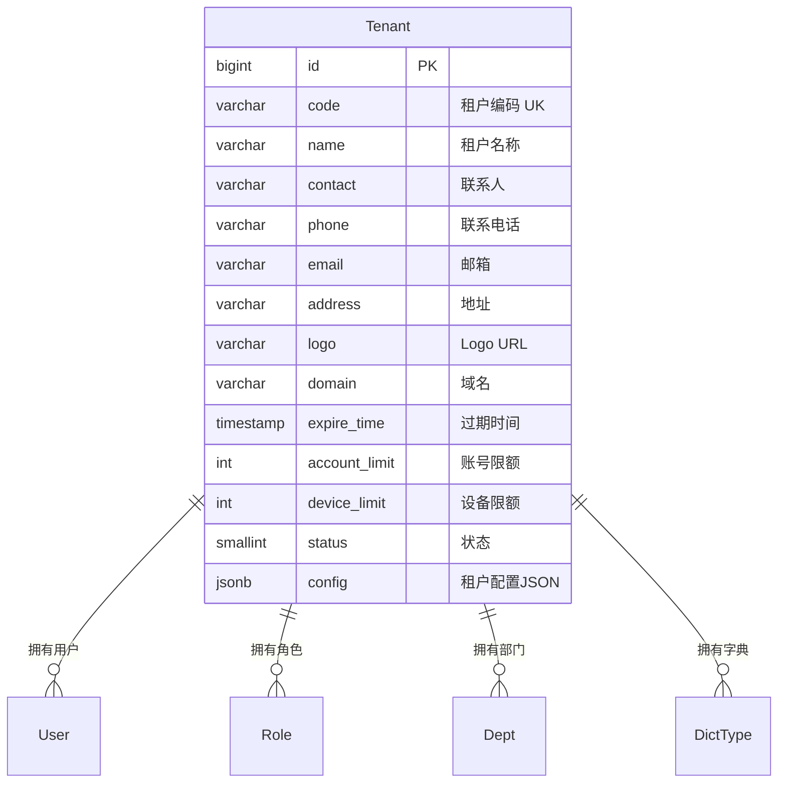
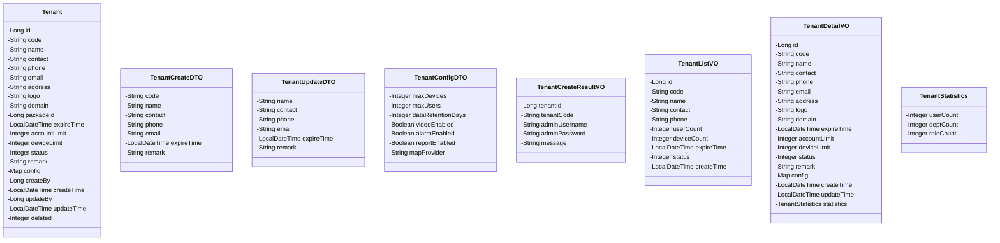
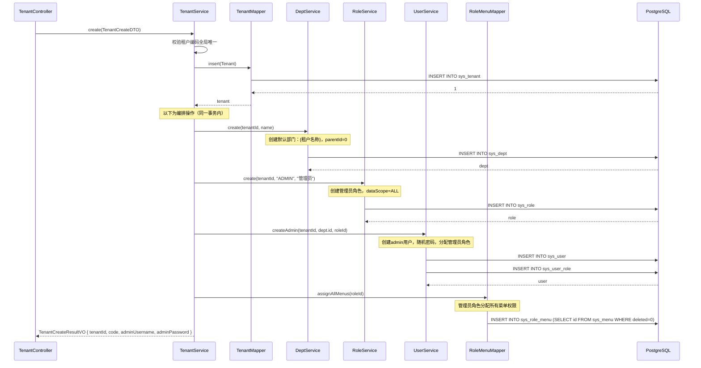
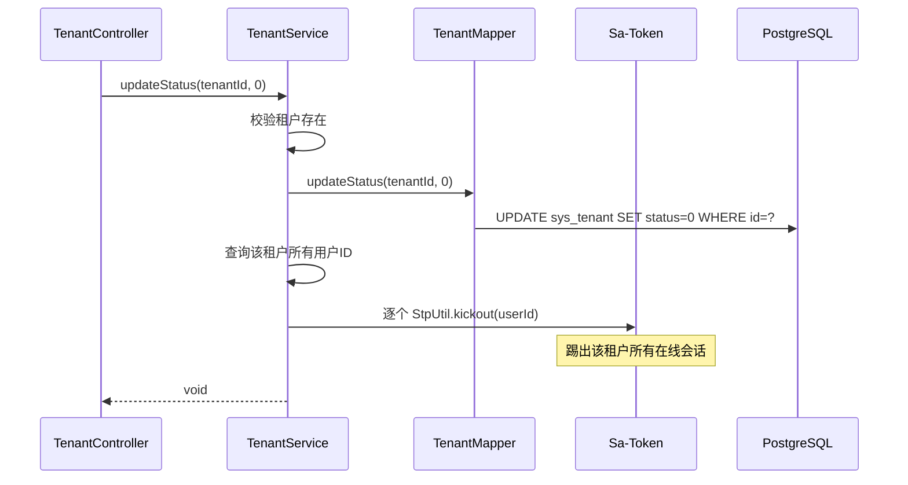
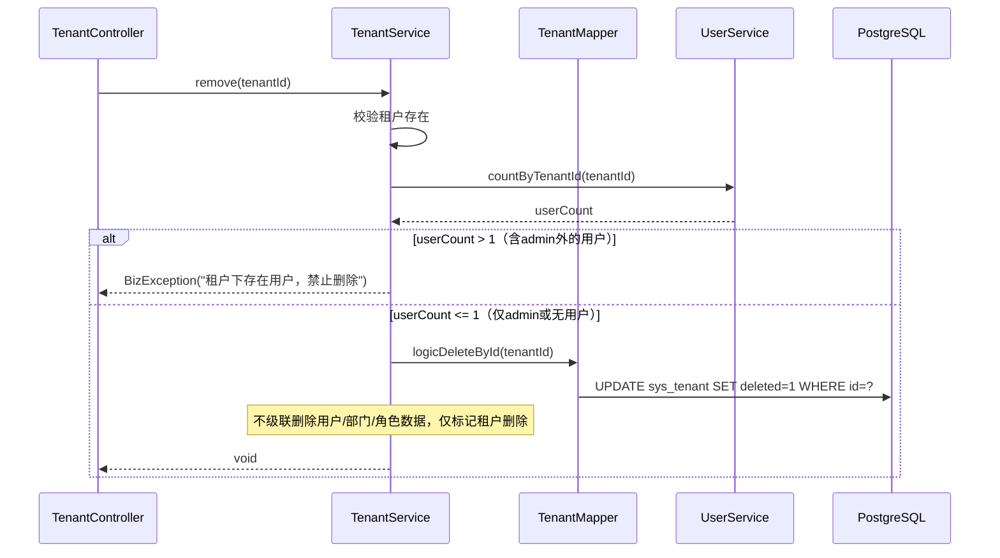
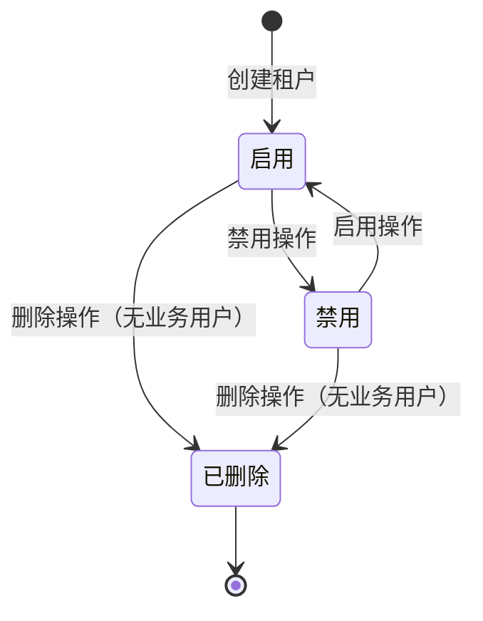
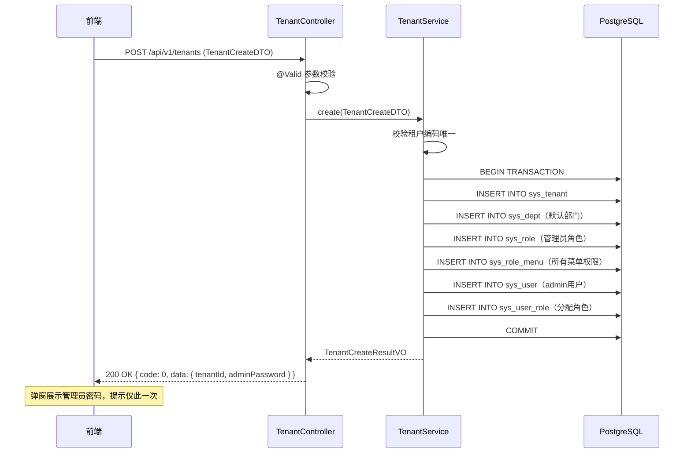
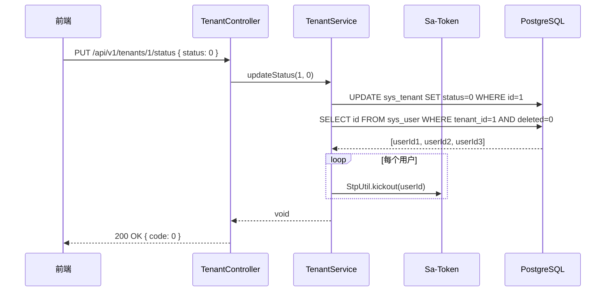

# 程序详细设计文档

> **定位**
> - 数据库驱动设计
> - 分层思想
> - 前后端无代码协同
> - AI 分阶段稳定交付

------

## 文档信息

| 项目 | 内容 |
|------|------|
| 模块名称 | 租户管理 |
| 模块标识 | tenant |
| 所属系统 | RBAC 权限模块 |
| 文档版本 | v1.0.0 |
| 设计负责人 | 后端开发（AI辅助） |
| 最后更新时间 | 2026-03-30 |

适用对象：
- 后端开发
- 前端开发
- 测试人员
- AI 编程

------

# 一、数据库设计

> ⚠️ 数据库是系统"真实状态"的最终承载
> 所有代码都必须服务于本章设计

------

## 1.1 表清单与业务职责

| 表名 | 业务含义 | 主键 | 是否核心表 | 说明 |
|------|---------|------|-----------|------|
| sys_tenant | 租户表 | id (BIGINT) | 是 | 全局表（无 tenant_id），存储企业客户信息 |
| sys_user | 用户表 | id (BIGINT) | 否 | 跨模块只读，统计租户用户数 |
| sys_dept | 部门表 | id (BIGINT) | 否 | 跨模块只读，新增租户时创建默认部门 |

> **编排说明**：租户管理是**编排模块**，新增租户时需跨模块调用 DeptService、RoleService、UserService 创建默认数据。

------

## 1.2 表关系设计（ER 图）



**流程说明**：

1. 租户是 SaaS 多租户隔离的顶层实体，所有租户级表通过 `tenant_id` 关联
2. 新增租户时自动编排创建：默认部门 + 管理员角色 + admin 用户
3. 租户状态控制其下所有用户的登录权限

**关键点**：

- sys_tenant 是**全局表**，不含 `tenant_id`，不受租户拦截器过滤
- 租户编码 `code` 全局唯一（条件唯一索引 `code WHERE deleted = 0`）
- 租户管理仅面向平台超级管理员

------

## 1.3 表结构设计（字段级，逐字段）

### 表：sys_tenant

> ⚠️ 全局表，无 tenant_id 字段

| 字段 | 类型 | 必填 | 描述 | 业务含义 | 设计说明 |
|------|------|------|------|---------|---------|
| id | BIGINT | 是 | 主键 | 租户ID | 雪花算法生成 |
| code | VARCHAR(50) | 是 | 租户编码 | 唯一标识 | 6-20字符，字母数字。条件唯一索引 `code WHERE deleted = 0`。创建后不可修改 |
| name | VARCHAR(100) | 是 | 租户名称 | 企业名称 | 2-100 字符 |
| contact | VARCHAR(50) | 否 | 联系人 | 联系人姓名 | - |
| phone | VARCHAR(20) | 否 | 联系电话 | 联系电话 | 手机号格式校验 |
| email | VARCHAR(100) | 否 | 联系邮箱 | 联系邮箱 | 标准邮箱格式校验 |
| address | VARCHAR(200) | 否 | 地址 | 企业地址 | 预留字段 |
| logo | VARCHAR(500) | 否 | Logo URL | 企业Logo | 预留字段 |
| domain | VARCHAR(200) | 否 | 域名 | 企业域名 | 预留字段 |
| package_id | BIGINT | 否 | 套餐ID | 套餐关联 | 预留字段，首期不使用 |
| expire_time | TIMESTAMP | 否 | 过期时间 | 服务到期 | NULL 表示永不过期 |
| account_limit | INT | 是 | 账号限额 | 最大用户数 | 默认 100 |
| device_limit | INT | 是 | 设备限额 | 最大设备数 | 默认 1000 |
| status | SMALLINT | 是 | 状态 | 启用/禁用 | 0=禁用，1=启用。默认 1 |
| remark | VARCHAR(500) | 否 | 备注 | 备注信息 | - |
| config | JSONB | 否 | 租户配置 | 功能开关等 | JSON 格式存储配置参数 |
| create_time | TIMESTAMP | 是 | 创建时间 | 审计字段 | 自动填充 |
| update_time | TIMESTAMP | 是 | 更新时间 | 审计字段 | 自动更新 |
| deleted | SMALLINT | 是 | 逻辑删除 | 删除标识 | 0=正常，1=已删除。默认 0 |
| create_by | BIGINT | 否 | 创建人 | 审计字段 | - |
| update_by | BIGINT | 否 | 更新人 | 审计字段 | - |

**config 字段 JSON 结构定义：**

```json
{
  "maxDevices": 200,
  "maxUsers": 50,
  "dataRetentionDays": 90,
  "features": {
    "video": true,
    "alarm": true,
    "report": true
  },
  "mapProvider": "tianditu"
}
```

------

## 1.4 反范式设计

本模块无反范式设计。列表中的 userCount、deviceCount 等统计数据通过关联查询获取。

------

## 1.5 索引与约束设计

**唯一索引：**
- `uk_tenant_code ON sys_tenant(code) WHERE deleted = 0` — 租户编码全局唯一

**普通索引：**
- `idx_tenant_status ON sys_tenant(status) WHERE deleted = 0` — 按状态查询
- `idx_tenant_expire ON sys_tenant(expire_time) WHERE deleted = 0` — 按过期时间查询（定时任务扫描过期租户）

------

# 二、模块目标与边界

**模块解决的业务问题：**
管理平台上的企业客户（租户），支持租户 CRUD、租户级配置、租户启用/禁用。新增租户时自动编排创建默认组织架构和管理员账号。

**模块不解决的问题：**
- 租户下用户的增删改（用户管理模块负责）
- 租户下部门/角色的定义（各自模块负责）
- 设备和车辆的统计（业务模块提供）
- 前端路由动态渲染（前端根据 API 返回数据生成）

**是否核心链路：** 是。租户是多租户 SaaS 架构的顶层隔离单位。

------

## 2.1 模块边界图

```mermaid
flowchart TD
    subgraph 租户管理模块
        A[TenantController]
        B[TenantService]
        C[TenantMapper]
    end

    subgraph 用户管理模块
        D[UserService]
    end

    subgraph 角色管理模块
        E[RoleService]
        F[RoleMenuMapper]
    end

    subgraph 部门管理模块
        G[DeptService]
    end

    subgraph 菜单管理模块
        H[MenuService]
    end

    subgraph 公共基础设施
        I[Sa-Token]
        J[@Log]
    end

    A --> B
    B --> C
    B -->|编排：创建默认部门| G
    B -->|编排：创建管理员角色| E
    B -->|编排：创建admin用户| D
    B -->|编排：分配所有菜单权限| F
    B -->|编排：分配角色给用户| D
    B -->|统计用户数| D
    B -->|查询所有菜单| H

    A --> I
    A --> J
```

------

# 三、整体架构设计

> ⚠️ 明确声明：**本项目不采用 DDD**

------

## 3.1 分层结构定义

```
com.gentry.rbac.tenant/
├── controller/
│   └── TenantController
├── service/
│   ├── TenantService
│   └── impl/
│       └── TenantServiceImpl
├── mapper/
│   └── TenantMapper
├── entity/
│   └── Tenant
├── dto/
│   ├── TenantCreateDTO
│   ├── TenantUpdateDTO
│   ├── TenantQueryDTO
│   ├── TenantConfigDTO
│   └── TenantStatusDTO
└── vo/
    ├── TenantVO
    ├── TenantListVO
    ├── TenantDetailVO
    └── TenantCreateResultVO
```

### 命名规范

| 数据库表名 | Entity 类名 | Service 接口名 | Controller 类名 |
|-----------|------------|---------------|----------------|
| sys_tenant | Tenant | TenantService | TenantController |

------

## 3.2 枚举设计

本模块无独立枚举。status 字段使用 SMALLINT（0/1）。

------

## 3.3 层级职责与禁止事项

| 层 | 允许做 | 禁止做 |
|---|--------|--------|
| Controller | 参数校验(@Valid)、请求响应处理 | 写业务逻辑 |
| Service | 租户编排逻辑（跨模块调用 UserService/RoleService/DeptService）、租户状态管理、踢出会话 | 直接写 SQL |
| Mapper | 数据访问、SQL 执行 | 业务判断 |

------

# 四、业务模型与数据映射

### Entity 类设计



**DTO → Entity 映射说明：**

| DTO 字段 | Entity 字段 | 转换逻辑 | 说明 |
|---------|------------|---------|------|
| code | code | 直接映射 | 创建时设置，不可修改 |
| — | accountLimit | 默认 100 | — |
| — | deviceLimit | 默认 1000 | — |
| — | status | 默认 1（启用） | — |
| — | config | 默认 null | 通过单独接口配置 |

------

# 五、行为流程与用例设计

## 5.1 主流程（时序图）

### 5.1.1 新增租户（编排流程）



### 5.1.2 禁用租户



### 5.1.3 删除租户



## 5.2 关键业务规则说明

### 新增租户

- **前置条件**：操作人为平台超级管理员
- **核心校验**：
  - 租户编码全局唯一（`WHERE code=? AND deleted=0`）
  - 租户编码格式：6-20 字符，字母数字
  - 联系电话格式校验（不为空时）
- **编排逻辑**（在同一事务内）：
  1. 创建租户记录
  2. 创建默认部门（名称=租户名称，parentId=0）
  3. 创建管理员角色（code=ADMIN，name=管理员，dataScope=ALL）
  4. 创建 admin 用户（username=admin，随机密码，分配默认部门）
  5. 将管理员角色分配给 admin 用户
  6. 将所有菜单权限分配给管理员角色
- **失败路径**：
  - 编码重复 → 抛出 `BizException(TENANT_CODE_EXISTS, "租户编码已存在")`
  - 编排失败 → 事务回滚，租户和所有关联数据都不入库
- **返回值**：包含 admin 初始密码，仅此一次展示

### 编辑租户

- **前置条件**：租户存在
- **核心校验**：
  - 租户编码不可修改
  - 名称不能为空
- **失败路径**：
  - 租户不存在 → 抛出 `BizException(TENANT_NOT_FOUND, "租户不存在")`

### 删除租户

- **前置条件**：租户存在
- **核心校验**：
  - 租户下仅允许存在 admin 用户（或其他用户均已删除）才可删除
- **处理逻辑**：仅逻辑删除 sys_tenant，不级联删除子数据
- **失败路径**：
  - 存在非 admin 用户 → 抛出 `BizException(PARAM_ERROR, "租户下存在用户，禁止删除")`

### 禁用/启用租户

- **前置条件**：租户存在
- **处理逻辑**：
  - 禁用时：更新 status=0，踢出该租户所有在线会话
  - 启用时：更新 status=1
- **登录联动**：用户登录时，AuthService 校验租户状态，已禁用则拒绝登录

### 租户配置

- **前置条件**：租户存在
- **处理逻辑**：更新 config JSONB 字段（全量覆盖）
- **说明**：account_limit 和 device_limit 为独立字段，不在 config JSON 中

------

# 六、状态机设计

### 租户状态



**状态值映射：**

| 状态 | status 值 | 说明 |
|------|----------|------|
| 启用 | 1 | 正常可用，用户可登录 |
| 禁用 | 0 | 禁用，所有用户无法登录，已登录会话被踢出 |
| 已删除 | deleted = 1 | 逻辑删除 |

------

# 七、接口设计（前后端核心契约）

> **目标：无代码即可协同开发**

------

## 7.1 接口清单

| 接口编号 | 接口名称 | URL | Method | 认证 | 授权 |
|---------|---------|-----|--------|------|------|
| TENANT-001 | 租户列表查询 | /api/v1/tenants | GET | 是 | system:tenant:list |
| TENANT-002 | 租户详情 | /api/v1/tenants/{id} | GET | 是 | system:tenant:list |
| TENANT-003 | 新增租户 | /api/v1/tenants | POST | 是 | system:tenant:add |
| TENANT-004 | 编辑租户 | /api/v1/tenants/{id} | PUT | 是 | system:tenant:edit |
| TENANT-005 | 删除租户 | /api/v1/tenants/{id} | DELETE | 是 | system:tenant:remove |
| TENANT-006 | 租户配置 | /api/v1/tenants/{id}/config | PUT | 是 | system:tenant:config |
| TENANT-007 | 切换租户状态 | /api/v1/tenants/{id}/status | PUT | 是 | system:tenant:edit |

------

## 7.2 入参设计

### TENANT-001 租户列表查询

**请求对象：** `TenantQueryDTO`

| 参数 | 类型 | 必填 | 描述 | 校验规则 |
|------|------|------|------|---------|
| pageNum | Integer | 是 | 页码 | ≥ 1 |
| pageSize | Integer | 是 | 每页条数 | 1-100 |
| name | String | 否 | 租户名称 | 模糊匹配 |
| code | String | 否 | 租户编码 | 精确匹配 |
| contact | String | 否 | 联系人 | 模糊匹配 |
| phone | String | 否 | 联系电话 | 精确匹配 |
| status | Integer | 否 | 状态 | 0=禁用，1=启用，null=全部 |

### TENANT-003 新增租户

**请求对象：** `TenantCreateDTO`

| 参数 | 类型 | 必填 | 描述 | 校验规则 |
|------|------|------|------|---------|
| code | String | 是 | 租户编码 | @Pattern(regexp="^[a-zA-Z0-9]{6,20}$") |
| name | String | 是 | 租户名称 | @Size(min=2, max=100) |
| contact | String | 否 | 联系人 | @Size(max=50) |
| phone | String | 否 | 联系电话 | @Pattern(regexp="^1[3-9]\\d{9}$") |
| email | String | 否 | 联系邮箱 | @Email |
| expireTime | LocalDateTime | 否 | 到期时间 | null 表示永不过期 |
| remark | String | 否 | 备注 | @Size(max=500) |

**请求示例：**

```json
{
  "code": "TENANT002",
  "name": "京东物流股份有限公司",
  "contact": "李四",
  "phone": "13900139000",
  "email": "lisi@jd.com",
  "expireTime": "2027-03-30T00:00:00",
  "remark": "京东物流车队管理系统"
}
```

### TENANT-004 编辑租户

**请求对象：** `TenantUpdateDTO`

| 参数 | 类型 | 必填 | 描述 | 校验规则 |
|------|------|------|------|---------|
| name | String | 是 | 租户名称 | @Size(min=2, max=100) |
| contact | String | 否 | 联系人 | @Size(max=50) |
| phone | String | 否 | 联系电话 | @Pattern(regexp="^1[3-9]\\d{9}$") |
| email | String | 否 | 联系邮箱 | @Email |
| expireTime | LocalDateTime | 否 | 到期时间 | - |
| remark | String | 否 | 备注 | @Size(max=500) |

> **注意**：租户编码 code 不可修改。

### TENANT-006 租户配置

**请求对象：** `TenantConfigDTO`
> **⚠ 已被后续变更取代（2026-08-24）**：本节描述的租户配置字段
> （`maxDevices` / `dataRetentionDays` / `videoEnabled` / `alarmEnabled` / `reportEnabled` /
> `mapProvider`）以及 `sys_tenant.device_limit` 列是本仓库派生自车辆定位平台时留下的业务概念，
> 已由 `V13__cleanup_business_leftovers.sql` 清除，`TenantConfigDTO` 现在只有 `maxUsers`。
> 见 `doc/design/modules/rbac/modules/业务域残留清理/详细设计.md` §2。


| 参数 | 类型 | 必填 | 描述 | 校验规则 |
|------|------|------|------|---------|
| maxDevices | Integer | 否 | 最大设备数 | @Min(1) |
| maxUsers | Integer | 否 | 最大用户数 | @Min(1) |
| dataRetentionDays | Integer | 否 | 数据保留天数 | @Min(1) |
| videoEnabled | Boolean | 否 | 视频功能开关 | - |
| alarmEnabled | Boolean | 否 | 报警功能开关 | - |
| reportEnabled | Boolean | 否 | 报表功能开关 | - |
| mapProvider | String | 否 | 地图服务商 | - |

### TENANT-007 切换租户状态

**请求对象：** `TenantStatusDTO`

| 参数 | 类型 | 必填 | 描述 | 校验规则 |
|------|------|------|------|---------|
| status | Integer | 是 | 状态 | 0=禁用，1=启用 |

------

## 7.3 出参设计

### TenantCreateResultVO（创建响应）

| 字段 | 类型 | 描述 |
|------|------|------|
| tenantId | Long | 租户ID |
| tenantCode | String | 租户编码 |
| adminUsername | String | 管理员用户名（固定 admin） |
| adminPassword | String | 管理员初始密码（仅此一次展示） |
| message | String | 提示信息 |

### TenantListVO（列表响应）

| 字段 | 类型 | 描述 |
|------|------|------|
| id | Long | 租户ID |
| code | String | 租户编码 |
| name | String | 租户名称 |
| contact | String | 联系人 |
| phone | String | 联系电话 |
| userCount | Integer | 用户数量 |
| deviceCount | Integer | 设备数量（首期返回 0，预留） |
| expireTime | LocalDateTime | 到期时间 |
| status | Integer | 状态 |
| createTime | LocalDateTime | 创建时间 |

### TenantDetailVO（详情响应）

| 字段 | 类型 | 描述 |
|------|------|------|
| id | Long | 租户ID |
| code | String | 租户编码 |
| name | String | 租户名称 |
| contact | String | 联系人 |
| phone | String | 联系电话 |
| email | String | 联系邮箱 |
| address | String | 地址 |
| logo | String | Logo URL |
| domain | String | 域名 |
| expireTime | LocalDateTime | 到期时间 |
| accountLimit | Integer | 账号限额 |
| deviceLimit | Integer | 设备限额 |
| status | Integer | 状态 |
| remark | String | 备注 |
| config | Map | 租户配置 |
| createTime | LocalDateTime | 创建时间 |
| updateTime | LocalDateTime | 更新时间 |
| statistics | TenantStatistics | 统计信息 |

**TenantStatistics 结构：**

| 字段 | 类型 | 描述 |
|------|------|------|
| userCount | Integer | 用户数 |
| deptCount | Integer | 部门数 |
| roleCount | Integer | 角色数 |

**响应示例（创建）：**

```json
{
  "code": 0,
  "message": "success",
  "data": {
    "tenantId": 2,
    "tenantCode": "TENANT002",
    "adminUsername": "admin",
    "adminPassword": "Xk9@mP2qR",
    "message": "租户创建成功，请妥善保管管理员密码"
  }
}
```

**响应示例（列表）：**

```json
{
  "code": 0,
  "message": "success",
  "data": {
    "list": [
      {
        "id": 1,
        "code": "TENANT001",
        "name": "顺丰速运有限公司",
        "contact": "张三",
        "phone": "13800138000",
        "userCount": 25,
        "deviceCount": 0,
        "expireTime": "2027-03-30 00:00:00",
        "status": 1,
        "createTime": "2026-01-15 10:30:00"
      }
    ],
    "total": 10,
    "pageNum": 1,
    "pageSize": 10,
    "pages": 1
  }
}
```

------

## 7.4 接口治理要求（强制）

| 接口 | 是否启用全局防抖 | 是否需要接口级防抖 | 是否幂等 | 幂等依据 | 日志级别 |
|------|----------------|------------------|---------|---------|---------|
| TENANT-001 列表查询 | 是 | 否 | 是 | 相同参数相同结果 | 无 |
| TENANT-002 详情 | 是 | 否 | 是 | 相同参数相同结果 | 无 |
| TENANT-003 新增租户 | 是 | 是（2s） | 否 | 编码唯一阻止重复 | @Log |
| TENANT-004 编辑租户 | 是 | 否 | 是 | 全量更新 | @Log |
| TENANT-005 删除租户 | 是 | 否 | 是 | 逻辑删除 | @Log |
| TENANT-006 租户配置 | 是 | 否 | 是 | 全量覆盖 config | @Log |
| TENANT-007 切换状态 | 是 | 否 | 是 | 状态值覆盖 | @Log |

------

# 八、模块安全规范

------

## 8.1 认证与授权要求

本模块是否需要认证：**是**
认证方式：Sa-Token（Token）
本模块是否需要授权：**是**
授权粒度：**接口级**

### 接口权限配置

| 接口 | 权限标识 | 权限说明 | 是否公开 |
|------|---------|---------|---------|
| TENANT-001 列表查询 | system:tenant:list | 查询租户列表 | 否 |
| TENANT-002 详情 | system:tenant:list | 查看租户详情 | 否 |
| TENANT-003 新增租户 | system:tenant:add | 新增租户 | 否 |
| TENANT-004 编辑租户 | system:tenant:edit | 编辑租户 | 否 |
| TENANT-005 删除租户 | system:tenant:remove | 删除租户 | 否 |
| TENANT-006 租户配置 | system:tenant:config | 配置租户参数 | 否 |
| TENANT-007 切换状态 | system:tenant:edit | 启用/禁用租户 | 否 |

> **注意**：租户管理仅面向平台超级管理员。tenant_id 拦截器对本模块无效（sys_tenant 是全局表），需手动处理权限。

------

## 8.2 敏感数据处理

本模块无高敏感数据。联系电话在列表中脱敏展示。

------

## 8.3 安全检查清单

- [x] 所有接口是否配置了正确的权限？ → system:tenant:* 系列
- [x] 输入参数是否有完整的校验？ → @Valid + JSR 303
- [x] 是否有 SQL 注入风险？ → MyBatis-Flex 参数化查询
- [x] 操作日志是否完整？ → 所有写接口添加 @Log
- [x] 租户编码唯一性？ → 条件唯一索引 + 业务层校验
- [x] 新增租户编排事务一致性？ → 同一事务内，失败全部回滚
- [x] 禁用租户是否踢出会话？ → 遍历该租户用户踢出
- [x] 删除租户是否校验用户？ → userCount > 1 禁止删除
- [x] 租户表是否绕过租户拦截器？ → sys_tenant 无 tenant_id，需手动校验

------

# 九、算法设计

### 9.1 是否涉及算法

是否涉及算法：**否**

> 本模块无算法设计。新增租户为编排模式（顺序调用多个 Service），禁用时遍历用户列表踢出会话。

------

# 十、前后端交互模型

### 新增租户交互时序



### 禁用租户交互时序



------

# 十一、测试用例设计

## 正常流程

| 用例ID | 测试场景 | 前置条件 | 测试步骤 | 预期结果 |
|--------|---------|---------|---------|---------|
| TENANT-001 | 新增租户 | - | 填写 code+name+contact+phone | 创建成功，返回 admin 密码 |
| TENANT-002 | 新增租户自动编排 | 租户创建成功 | 检查数据库 | 存在默认部门、管理员角色、admin 用户、全部菜单权限 |
| TENANT-003 | 查询租户列表 | 已有租户数据 | 调用 TENANT-001 | 返回分页列表，含 userCount |
| TENANT-004 | 租户详情 | 租户存在 | 调用 TENANT-002 | 返回完整信息 + statistics |
| TENANT-005 | 编辑租户名称 | 租户存在 | 修改 name | 修改成功 |
| TENANT-006 | 租户配置 | 租户存在 | 更新 config | config JSONB 已更新 |
| TENANT-007 | 禁用租户 | 租户为启用 | 禁用 | status=0，该租户用户已踢出 |
| TENANT-008 | 启用租户 | 租户为禁用 | 启用 | status=1，用户可正常登录 |
| TENANT-009 | 用新租户admin登录 | 租户刚创建 | admin + 初始密码登录 | 登录成功，返回 token |

## 异常流程

| 用例ID | 测试场景 | 前置条件 | 测试步骤 | 预期结果 |
|--------|---------|---------|---------|---------|
| TENANT-010 | 租户编码重复 | 已有编码 TENANT001 | 新增同编码租户 | 提示"租户编码已存在" |
| TENANT-011 | 禁用租户后登录 | 租户已禁用 | 该租户用户尝试登录 | 提示"租户已禁用" |
| TENANT-012 | 删除有用户的租户 | 租户下有 5 个用户 | 删除 | 提示"租户下存在用户，禁止删除" |
| TENANT-013 | 编码格式错误 | - | code=`ab`（2字符） | 校验失败 |
| TENANT-014 | 编辑时修改编码 | 租户存在 | 传入 code 字段 | 忽略 code 字段 |
| TENANT-015 | 新增租户编排失败 | 角色创建失败 | 创建租户 | 事务回滚，租户和所有关联数据不入库 |

## 边界条件

| 用例ID | 测试场景 | 前置条件 | 测试步骤 | 预期结果 |
|--------|---------|---------|---------|---------|
| TENANT-016 | 编码最小长度 | - | code=6字符 | 创建成功 |
| TENANT-017 | 编码最大长度 | - | code=20字符 | 创建成功 |
| TENANT-018 | 过期时间为空 | - | expireTime=null | 创建成功，永不过期 |
| TENANT-019 | 删除仅有admin的租户 | 租户下只有 admin | 删除 | 成功 |
| TENANT-020 | 查询空列表 | 无租户数据 | 调用列表查询 | 返回空数组 |

## 并发 / 幂等

| 用例ID | 测试场景 | 前置条件 | 测试步骤 | 预期结果 |
|--------|---------|---------|---------|---------|
| TENANT-021 | 并发新增同编码租户 | - | 两个请求同时新增 | 唯一索引阻止一个 |
| TENANT-022 | 重复禁用 | 租户已禁用 | 再次禁用 | 幂等成功 |
| TENANT-023 | 重复删除 | 租户已删除 | 再次删除同一 ID | 幂等成功 |

## 数据一致性

| 用例ID | 测试场景 | 前置条件 | 测试步骤 | 预期结果 |
|--------|---------|---------|---------|---------|
| TENANT-024 | 新增租户事务一致性 | 部门创建失败 | 创建租户 | sys_tenant 不插入（事务回滚） |
| TENANT-025 | 禁用租户后在线用户 | 用户A在线 | 禁用租户 | 用户A的 Token 立即失效 |
| TENANT-026 | 启用租户后用户登录 | 租户从禁用→启用 | 用户登录 | 登录成功 |

------

## 变更记录

| 版本 | 日期 | 修改人 | 变更内容 | 变更原因 | 评审人 |
|------|------|--------|---------|---------|--------|
| v1.0.0 | 2026-03-30 | 后端开发（AI） | 初始版本 | 租户管理详细设计 | 待评审 |
