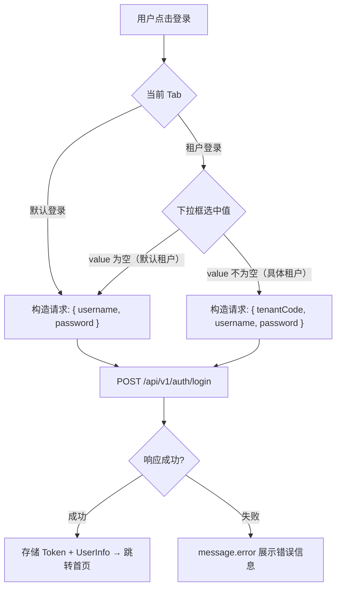

> **⚠️ 已废弃（2026-08-26）**：本仓库已拿掉多租户机制，登录页租户 Tab 已删除。
> 原因与替代方案见 `doc/design/modules/core/去多租户化-概要设计.md`。
> 本文仅作历史记录保留，**不要按本文描述的机制写新代码**。

# 前端详细设计文档

## 文档信息

| 项目 | 内容 |
|------|------|
| 文档名称 | 默认租户与登录模式 前端详细设计文档 |
| 对应后端模块 | 默认租户与登录模式（模块标识：tenant-login） |
| 参考文档 | `doc/design/modules/rbac/modules/租户管理/默认租户与登录模式-详细设计.md` |
| 静态页面 | `static_fe/src/app/pages/Login.tsx` |
| 版本 | v1.0.0 |
| 创建日期 | 2026-04-11 |
| 最后更新 | 2026-04-11 |
| 负责人 | 前端开发（AI辅助） |

---

# 一、模块概述

## 1.1 功能描述

对登录页面进行改造，支持两种登录模式：

- **默认登录**：仅输入用户名和密码。后端自动使用代码中写死的默认租户（id=1）。当前阶段所有用户都属于默认租户，这是主要的登录方式。
- **租户登录**：输入租户编码 + 用户名 + 密码。为未来多租户 SaaS 场景预留，当前阶段可用但非主流程。

两种模式通过 Tabs 切换，默认展示"默认登录"Tab。

## 1.2 模块边界与职责

| 职责 | 说明 |
|------|------|
| **本设计负责** | 登录页 Tab 切换、默认登录表单、租户登录表单、LoginDTO 构造逻辑 |
| **不变更** | 登录成功后的路由跳转、Token 存储、UserStore 状态管理（已有逻辑不变） |

---

# 二、接口调用总览

## 2.1 接口引用说明

| 接口标识 | 接口名称 | HTTP方法 | 路径 | 主要用途 |
|----------|----------|----------|------|----------|
| AUTH-001 | 用户登录 | POST | /api/v1/auth/login | 登录提交（默认登录和租户登录共用同一接口） |
| TENANT-009 | 租户选项列表 | GET | /api/v1/tenants/options | 登录页租户下拉框数据源（公开接口） |

---

# 三、页面详细设计

## 3.1 页面清单

| 页面名称 | 路由路径 | 变更类型 | 说明 |
|----------|----------|---------|------|
| 登录页 | /login | **修改** | 新增 Tabs 切换，支持默认登录和租户登录 |

## 3.2 登录页 UI 结构

```
┌─────────────────────────────────────┐
│           车联网管理平台              │
│         RBAC 权限管理控制台           │
│                                     │
│   ┌──────────────┬──────────────┐   │
│   │  默认登录     │  租户登录     │   │  ← Tabs（默认选中"默认登录"）
│   └──────────────┴──────────────┘   │
│                                     │
│   【默认登录 Tab】                    │
│   ┌─────────────────────────────┐   │
│   │  👤 用户名                   │   │
│   │  🔒 密码                     │   │
│   │  [      登录按钮      ]      │   │
│   └─────────────────────────────┘   │
│                                     │
│   【租户登录 Tab】                    │
│   ┌─────────────────────────────┐   │
│   │  🏢 租户 [▼ 默认租户      ]  │   │  ← Select 下拉框
│   │  👤 用户名                   │   │
│   │  🔒 密码                     │   │
│   │  [      登录按钮      ]      │   │
│   └─────────────────────────────┘   │
│                                     │
│   测试账号: admin / Abc@123456      │
└─────────────────────────────────────┘
```

---

# 四、页面初始化流程设计

## 4.1 登录页初始化

### 4.1.1 接口调用序列

| 顺序 | 接口 | 说明 |
|------|------|------|
| 1 | TENANT-009 | 获取租户选项列表，用于租户登录 Tab 的下拉框。接口失败不阻塞页面 |

### 4.1.2 初始化数据流

1. 页面加载时调用 `TENANT-009` 获取租户选项列表
2. 接口返回 `[{code, name}]` → 映射为下拉框选项 `{label: name, value: code}`
3. 在选项列表头部插入固定项 `{label: "默认租户", value: ""}` — value 为空字符串
4. 接口失败或返回空列表时，下拉框仅有"默认租户"一个选项
5. 下拉框默认选中"默认租户"（value=""）

---

# 五、用户操作流程设计

## 5.1 操作-接口映射表

| 用户操作 | 触发组件 | 调用接口 | 请求参数构造 | 响应处理 |
|---------|---------|---------|-------------|---------|
| 切换到默认登录 Tab | Tabs | — | — | 切换表单 |
| 切换到租户登录 Tab | Tabs | — | — | 切换表单，显示租户下拉框 |
| 默认登录提交 | 登录按钮 | AUTH-001 | `{ username, password }` — 不传 tenantCode | Token 存储 + 跳转 |
| 租户登录提交（选中默认租户） | 登录按钮 | AUTH-001 | `{ username, password }` — tenantCode 为空，等同默认登录 | Token 存储 + 跳转 |
| 租户登录提交（选中具体租户） | 登录按钮 | AUTH-001 | `{ tenantCode, username, password }` | Token 存储 + 跳转 |

## 5.2 登录提交流程



---

# 六、组件设计

## 6.1 组件变更

| 组件名称 | 变更类型 | 说明 |
|----------|---------|------|
| LoginPage | **修改** | 新增 Tabs，包含默认登录和租户登录两个 TabPane |

> 不拆分为独立子组件。两个 Tab 的表单逻辑简单，直接在 LoginPage 内通过 Tabs 切换渲染即可。

## 6.2 LoginPage 组件设计

- **状态管理**：

| 状态 | 类型 | 说明 |
|------|------|------|
| activeTab | 'default' \| 'tenant' | 当前激活的 Tab，默认 'default' |
| loading | boolean | 登录中状态 |
| tenantOptions | {label, value}[] | 租户下拉选项，初始化时从 TENANT-009 加载 |

- **Tab 配置**：

| Tab Key | Tab 标题 | 表单字段 |
|---------|---------|---------|
| default | 默认登录 | username + password |
| tenant | 租户登录 | tenantCode（Select 下拉框） + username + password |

- **租户下拉框逻辑**：

```typescript
// 页面加载时获取租户选项
useEffect(() => {
  tenantApi.options()
    .then(res => {
      const options = (res.data || []).map(t => ({ label: t.name, value: t.code }));
      // 头部插入"默认租户"固定项，value 为空字符串
      setTenantOptions([{ label: '默认租户', value: '' }, ...options]);
    })
    .catch(() => {
      // 接口失败，仅保留默认租户选项
      setTenantOptions([{ label: '默认租户', value: '' }]);
    });
}, []);
```

- **提交逻辑**：

```typescript
const onFinish = async (values) => {
  const tenantCode = activeTab === 'tenant' ? (values.tenantCode || '') : '';
  if (tenantCode) {
    // 选中了具体租户 → 租户登录
    await login({ tenantCode, username: values.username, password: values.password });
  } else {
    // 默认登录 Tab 或 租户登录 Tab 选中"默认租户" → 默认登录
    await login({ username: values.username, password: values.password });
  }
};
```

- **租户登录 Tab 表单字段**：

| 字段 | 组件 | 必填 | 说明 |
|------|------|------|------|
| tenantCode | Select | 否 | 下拉框，默认选中"默认租户"（value=""）。选中默认租户时提交 tenantCode 为空 |
| username | Input | 是 | 用户名 |
| password | Input.Password | 是 | 密码 |

---

# 七、数据转换设计

## 7.1 请求数据构造

| 登录模式 | 前端表单字段 | 接口请求字段 | 转换规则 |
|---------|------------|------------|---------|
| 默认登录 Tab | username, password | `{ username, password }` | 不传 tenantCode |
| 租户登录 Tab + 选中"默认租户" | tenantCode="", username, password | `{ username, password }` | tenantCode 为空，不传，等同默认登录 |
| 租户登录 Tab + 选中具体租户 | tenantCode="TENANT002", username, password | `{ tenantCode: "TENANT002", username, password }` | 直接映射 |

## 7.2 响应数据处理

| 接口 | 响应处理 |
|------|---------|
| AUTH-001 | 与现有登录响应处理一致，无变更 |
| TENANT-009 | `[{code, name}]` → 映射为 Select options `[{label, value}]`，头部插入固定项"默认租户" |

---

# 八、状态管理设计

## 8.1 LoginDTO 类型变更

```typescript
// 旧版
interface LoginDTO {
  tenantId: number;    // ❌ 移除
  username: string;
  password: string;
}

// 新版
interface LoginDTO {
  tenantCode?: string; // ✅ 可选，不传=默认登录
  username: string;
  password: string;
}
```

## 8.2 UserStore 变更

`login` action 的入参类型跟随 LoginDTO 变更，其余不变。

---

# 九、模块安全规范

## 9.1 安全检查清单

- [x] 默认登录不暴露 tenantId 给前端（后端自动使用常量）
- [x] 密码传输通过 HTTPS
- [x] 登录失败错误信息不泄露密码是否正确（统一提示"用户名或密码错误"）
- [x] 租户不存在时提示"租户不存在"（租户编码非敏感信息，可提示）
- [x] TENANT-009 仅返回 code + name，不暴露联系人、手机号等敏感信息

---

# 十、错误处理设计

## 10.1 错误分类

| 错误类型 | 业务错误码 | 出现场景 | 处理策略 |
|---------|----------|---------|---------|
| 租户不存在 | 20001 | 租户登录模式 | message.error('租户不存在') |
| 租户已禁用 | 20003 | 租户登录模式 | message.error('租户已禁用') |
| 租户已过期 | 20004 | 租户登录模式 | message.error('租户已过期') |
| 用户名或密码错误 | 20018 | 两种模式 | message.error('用户名或密码错误') |
| 用户已禁用 | 20009 | 两种模式 | message.error('用户已禁用') |

> 默认登录模式下不会出现租户相关错误（不查租户表）。

---

# 十一、测试设计

## 11.1 正常流程

| 测试场景 | 操作步骤 | 预期结果 |
|---------|---------|---------|
| 默认展示默认登录 Tab | 打开登录页 | 默认选中"默认登录"Tab，表单仅有用户名和密码 |
| 切换到租户登录 | 点击"租户登录"Tab | 表单显示租户下拉框 + 用户名 + 密码 |
| 租户下拉框默认选中 | 切换到租户登录 Tab | 下拉框默认选中"默认租户" |
| 租户下拉框有选项 | 有其他租户存在 | 下拉框包含"默认租户" + 其他租户 |
| 租户下拉框仅默认 | 无其他租户 | 下拉框仅有"默认租户"一个选项 |
| 默认登录成功 | 输入 admin / Abc@123456，点击登录 | 登录成功，跳转用户管理页 |
| 租户登录选中默认租户 | 下拉框选"默认租户"，输入 admin / Abc@123456 | 登录成功（等同默认登录） |
| 租户登录选中具体租户 | 下拉框选具体租户，输入正确账密 | 登录成功 |

## 11.2 异常流程

| 测试场景 | 操作步骤 | 预期结果 |
|---------|---------|---------|
| 默认登录密码错误 | 输入错误密码 | message.error('用户名或密码错误') |
| 租户登录密码错误 | 选中具体租户，输入错误密码 | message.error('用户名或密码错误') |
| 表单校验 | 不填用户名直接登录 | 表单内联提示"请输入用户名" |
| 租户选项接口失败 | 网络异常 | 下拉框仅有"默认租户"，不阻塞登录 |

---

# 附录

## A. 变更记录

| 版本 | 日期 | 修改人 | 变更描述 | 变更原因 | 评审人 |
|------|------|--------|---------|---------|--------|
| v1.0.0 | 2026-04-11 | 前端开发（AI） | 初始版本 | 登录页支持默认登录和租户登录两种模式，租户登录 Tab 使用 Select 下拉框 | 待评审 |
