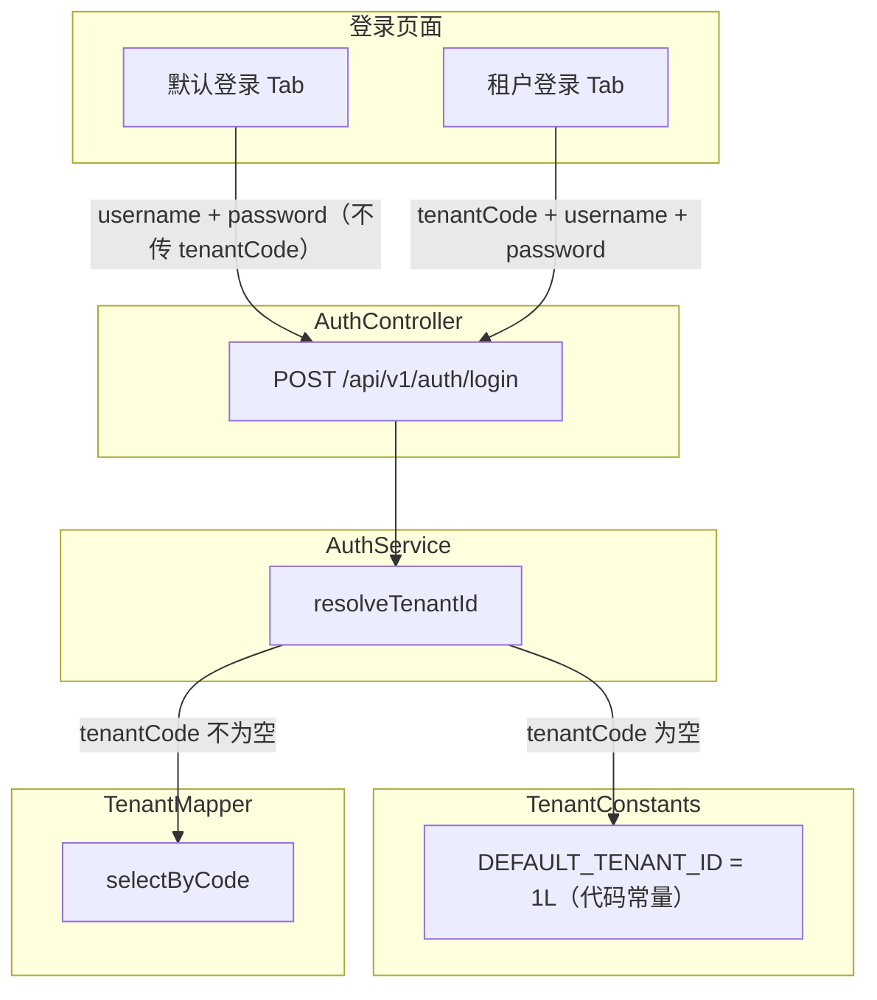
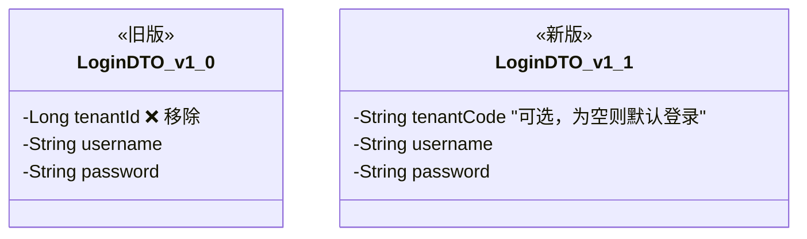
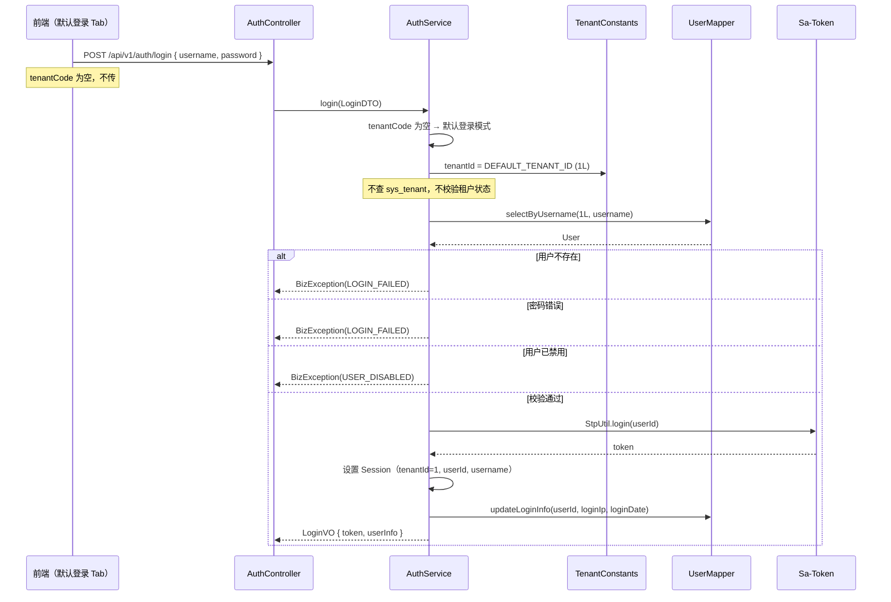
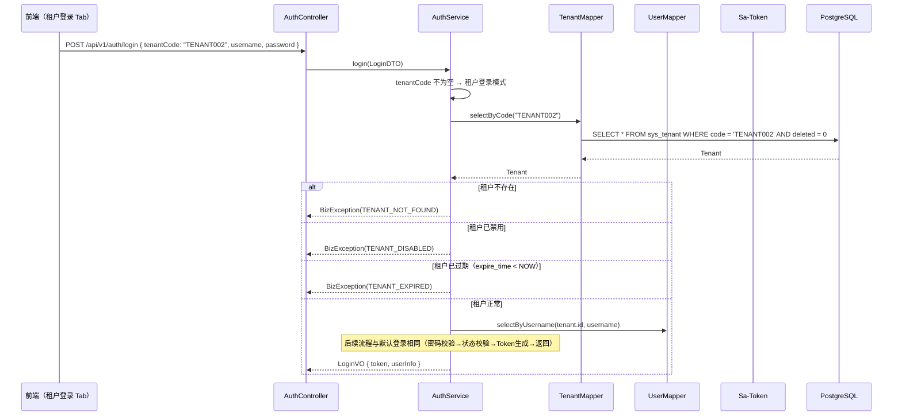
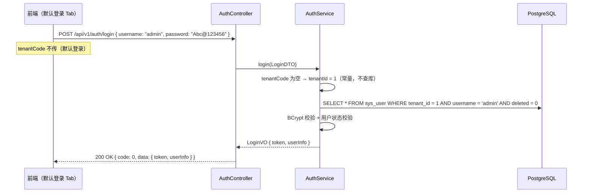
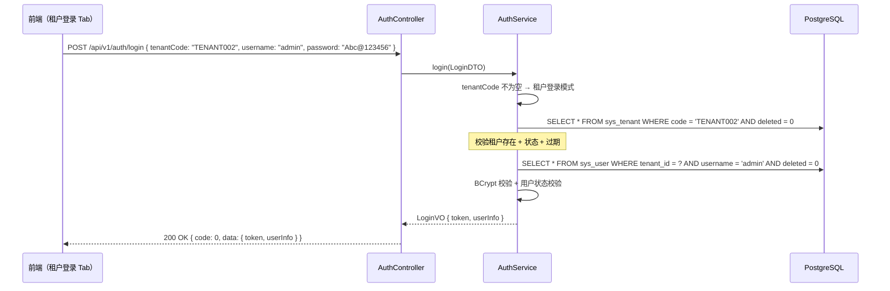

# 程序详细设计文档

> **定位**
> - 数据库驱动设计
> - 分层思想
> - 前后端无代码协同
> - AI 分阶段稳定交付

------

## 文档信息

| 项目 | 内容 |
|------|------|
| 模块名称 | 默认租户与登录模式 |
| 模块标识 | tenant-login |
| 所属系统 | RBAC 权限模块（租户管理子模块） |
| 文档版本 | v1.0.0 |
| 设计负责人 | 后端开发（AI辅助） |
| 最后更新时间 | 2026-04-11 |
| 关联文档 | `租户管理/后端详细设计.md`、`用户管理/后端详细设计.md` |

适用对象：
- 后端开发
- 前端开发
- 测试人员
- AI 编程

------

# 一、数据库设计

> ⚠️ 数据库是系统"真实状态"的最终承载
> 所有代码都必须服务于本章设计

------

## 1.1 表清单与业务职责

| 表名 | 业务含义 | 主键 | 是否核心表 | 说明 |
|------|---------|------|-----------|------|
| sys_tenant | 租户表 | id (BIGINT) | 是 | 已有表，**无结构变更** |

> **本设计不新增表，不变更表结构。**
> 默认租户通过代码常量 `DEFAULT_TENANT_ID = 1L` 定义，不在数据库层面标识。
> 默认租户就是 id=1 的那条 sys_tenant 记录，它是一个普通租户，只是被代码约定为默认值。

------

## 1.2 表结构变更

无。

------

## 1.3 反范式设计

无。

------

## 1.4 索引与约束设计

无新增。

------

# 二、模块目标与边界

**模块解决的业务问题：**
当前项目处于单租户阶段，尚未开放多租户。引入"默认租户"概念作为关闭多租户的简化方式——登录时无需填写租户信息，后端自动使用代码中写死的默认租户 ID。同时保留"租户登录"模式，所有代码按多租户架构开发，未来开放多租户时无需改动核心逻辑。

**核心定位：默认租户 = 关闭多租户的一种方式，不是一种特殊租户。**

**模块不解决的问题：**
- 租户 CRUD（已有租户管理模块负责）
- 用户 CRUD（用户管理模块负责）
- 多租户数据隔离机制（公共基础设施模块负责）

**是否核心链路：** 是。登录是系统入口。

------

## 2.1 模块边界图



------

# 三、整体架构设计

> ⚠️ 明确声明：**本项目不采用 DDD**

------

## 3.1 核心概念定义

### 默认租户

| 属性 | 说明 |
|------|------|
| 定义 | 代码常量指定的租户 ID，当前阶段所有用户都属于此租户 |
| ID | `TenantConstants.DEFAULT_TENANT_ID = 1L`，写死在代码中 |
| 本质 | 就是 sys_tenant 表中 id=1 的普通租户记录，没有任何特殊数据库标识 |
| 用途 | 默认登录模式下自动使用，省去用户输入租户信息的步骤 |
| 状态 | 不存在禁用/过期的概念。默认租户是系统内置约定，永远可用 |
| 未来演进 | 开放多租户后，默认登录模式可保留（面向默认租户用户），也可关闭 |

### 登录模式

| 模式 | 前端表现 | 后端处理 | 适用场景 |
|------|---------|---------|---------|
| 默认登录 | 仅输入用户名+密码 | tenantCode 为空 → 直接使用 `DEFAULT_TENANT_ID` | 当前阶段（单租户）、默认租户用户 |
| 租户登录 | 输入租户编码+用户名+密码 | 通过 tenantCode 查询 sys_tenant 获取 tenant_id，校验租户状态和过期 | 未来多租户 SaaS 场景 |

**关键区别：**
- 默认登录：**不查 sys_tenant 表**，直接用常量，不校验租户状态/过期（默认租户永远可用）
- 租户登录：**查 sys_tenant 表**，走完整的租户校验（存在性、状态、过期时间）

------

## 3.2 分层结构定义（增量）

```
com.gentry.core/
├── constant/
│   └── TenantConstants              # 新增：默认租户常量

com.gentry.rbac.user/
├── dto/
│   └── LoginDTO                     # 修改：tenantId → tenantCode（可选）
├── service/impl/
│   └── AuthServiceImpl              # 修改：方法抽取，login() 保持线性
│           ├── login()              # 公开方法，圈复杂度 = 1（零分支）
│           ├── resolveTenantId()    # 私有方法，租户解析（分支收敛于此）
│           ├── findAndValidateUser() # 私有方法，用户查询+密码+状态校验
│           └── buildLoginResult()   # 私有方法，Token生成+Session+响应构建

com.gentry.rbac.tenant/
├── mapper/
│   └── TenantMapper                 # 新增方法：selectByCode
```

### AuthServiceImpl 方法职责

| 方法 | 职责 | 圈复杂度 | 说明 |
|------|------|---------|------|
| `login(dto, loginIp)` | 编排入口，串联三个步骤 | 1 | 无分支，纯顺序调用 |
| `resolveTenantId(tenantCode)` | 解析 tenantCode → tenantId | 4 | 所有租户相关分支收敛于此 |
| `findAndValidateUser(tenantId, username, password)` | 查用户 + 校验密码 + 校验状态 | 3 | 所有用户相关分支收敛于此 |
| `buildLoginResult(user, tenantId, loginIp)` | Sa-Token 登录 + Session + 构建 VO | 1 | 无分支 |

------

## 3.3 枚举设计

无新增枚举。

------

## 3.4 层级职责与禁止事项

| 层 | 允许做 | 禁止做 |
|---|--------|--------|
| TenantConstants | 定义默认租户 ID 常量 | 包含业务逻辑 |
| AuthService | 根据 tenantCode 是否为空判断登录模式，解析 tenantId | 对默认租户做状态/过期校验 |
| TenantMapper | 按编码查询租户 | 业务判断 |

------

# 四、业务模型与数据映射

### 常量定义

```java
public class TenantConstants {
    /** 默认租户 ID（写死在代码中，对应 sys_tenant.id = 1） */
    public static final Long DEFAULT_TENANT_ID = 1L;
}
```

> 仅一个常量，不需要 DEFAULT_TENANT_CODE。默认登录不涉及编码查询。

### LoginDTO 变更



**DTO 字段说明：**

| 字段 | 类型 | 必填 | 描述 | 校验规则 |
|------|------|------|------|---------|
| tenantCode | String | 否 | 租户编码 | 为空=默认登录；不为空=租户登录。@Size(max=50) |
| username | String | 是 | 用户名 | @NotBlank |
| password | String | 是 | 密码 | @NotBlank |

**tenantId 解析逻辑：**

| tenantCode 值 | 解析方式 | 是否查 sys_tenant | 是否校验租户状态 |
|--------------|---------|-----------------|----------------|
| null 或 "" | `TenantConstants.DEFAULT_TENANT_ID`（1L） | 否 | 否 |
| "TENANT002" | `TenantMapper.selectByCode("TENANT002")` → `tenant.id` | 是 | 是（状态+过期） |

------

# 五、行为流程与用例设计

## 5.1 主流程（时序图）

### 5.1.1 默认登录



### 5.1.2 租户登录



## 5.2 关键业务规则说明

### 默认登录

- **前置条件**：无
- **核心逻辑**：
  - `tenantCode` 为空（null 或 ""）→ 进入默认登录模式
  - `tenantId = TenantConstants.DEFAULT_TENANT_ID`（1L），直接使用，**不查 sys_tenant 表**
  - 不校验租户状态、不校验过期时间（默认租户永远可用）
  - 后续流程：查用户 → 校验密码 → 校验用户状态 → 生成 Token
- **失败路径**：
  - 用户不存在或密码错误 → `BizException(LOGIN_FAILED, "用户名或密码错误")`
  - 用户已禁用 → `BizException(USER_DISABLED, "用户已禁用")`

### 租户登录

- **前置条件**：无
- **核心逻辑**：
  - `tenantCode` 不为空 → 进入租户登录模式
  - 通过 `tenantCode` 查询 sys_tenant 获取 `tenant_id`
  - **完整校验**：租户存在性 → 租户状态（status=1） → 租户过期时间
  - 后续流程：查用户 → 校验密码 → 校验用户状态 → 生成 Token
- **失败路径**：
  - 租户编码不存在 → `BizException(TENANT_NOT_FOUND, "租户不存在")`
  - 租户已禁用 → `BizException(TENANT_DISABLED, "租户已禁用")`
  - 租户已过期 → `BizException(TENANT_EXPIRED, "租户已过期")`
  - 用户不存在或密码错误 → `BizException(LOGIN_FAILED, "用户名或密码错误")`
  - 用户已禁用 → `BizException(USER_DISABLED, "用户已禁用")`

### AuthService 方法设计（Extract Method）

> **设计目标**：通过方法抽取将 `login()` 的圈复杂度降为 1，所有分支收敛到职责单一的私有方法中。
> **未来演进**：如果租户解析策略增多（域名解析、Header 解析等），`resolveTenantId()` 可直接升级为策略接口 `TenantResolver.resolve()`，改动点仅一处。

```java
public LoginVO login(LoginDTO dto, String loginIp) {
    // 步骤1：解析租户 → 所有租户相关分支收敛在此方法内
    Long tenantId = resolveTenantId(dto.getTenantCode());

    // 步骤2：校验用户 → 所有用户相关分支收敛在此方法内
    User user = findAndValidateUser(tenantId, dto.getUsername(), dto.getPassword());

    // 步骤3：构建登录结果 → 无分支
    return buildLoginResult(user, tenantId, loginIp);
}

/**
 * 解析租户ID。
 * - tenantCode 为空 → 默认租户（常量，不查库）
 * - tenantCode 不为空 → 查 sys_tenant，校验状态和过期
 */
private Long resolveTenantId(String tenantCode) {
    if (StringUtils.isBlank(tenantCode)) {
        return TenantConstants.DEFAULT_TENANT_ID;
    }
    Tenant tenant = tenantMapper.selectByCode(tenantCode);
    if (tenant == null) {
        throw new BizException(ErrorCode.TENANT_NOT_FOUND);
    }
    if (tenant.getStatus() != 1) {
        throw new BizException(ErrorCode.TENANT_DISABLED);
    }
    if (tenant.getExpireTime() != null && tenant.getExpireTime().isBefore(LocalDateTime.now())) {
        throw new BizException(ErrorCode.TENANT_EXPIRED);
    }
    return tenant.getId();
}

/**
 * 查询用户并校验密码和状态。
 */
private User findAndValidateUser(Long tenantId, String username, String password) {
    User user = userMapper.selectByUsername(tenantId, username);
    if (user == null) {
        throw new BizException(ErrorCode.LOGIN_FAILED);
    }
    if (!passwordEncoder.matches(password, user.getPassword())) {
        throw new BizException(ErrorCode.LOGIN_FAILED);
    }
    if (user.getStatus() != 1) {
        throw new BizException(ErrorCode.USER_DISABLED);
    }
    return user;
}

/**
 * 生成 Token、设置 Session、更新登录信息、构建响应。
 */
private LoginVO buildLoginResult(User user, Long tenantId, String loginIp) {
    StpUtil.login(user.getId());
    String token = StpUtil.getTokenValue();
    StpUtil.getSession().set("tenantId", tenantId);
    StpUtil.getSession().set("userId", user.getId());
    StpUtil.getSession().set("username", user.getUsername());
    UserContext.setUserId(user.getId());
    UserContext.setTenantId(tenantId);
    userMapper.updateLoginInfo(user.getId(), loginIp, LocalDateTime.now());
    UserInfoVO userInfo = buildUserInfo(user);
    return new LoginVO(token, userInfo);
}
```

**圈复杂度分析：**

| 方法 | 分支数 | 圈复杂度 | 说明 |
|------|-------|---------|------|
| `login()` | 0 | 1 | 纯顺序调用，无 if/else/try-catch |
| `resolveTenantId()` | 4（blank判断 + null + status + expire） | 4 | 线性卫语句，无嵌套 |
| `findAndValidateUser()` | 3（null + password + status） | 3 | 线性卫语句，无嵌套 |
| `buildLoginResult()` | 0 | 1 | 纯顺序操作 |

------

# 六、状态机设计

无新增状态机。默认租户不存在状态流转。

------

# 七、接口设计（前后端核心契约）

> **目标：无代码即可协同开发**

------

## 7.1 接口变更清单

| 接口编号 | 接口名称 | URL | Method | 变更类型 | 说明 |
|---------|---------|-----|--------|---------|------|
| AUTH-001 | 用户登录 | /api/v1/auth/login | POST | **修改** | LoginDTO 入参变更：`tenantId` → `tenantCode`（可选） |
| TENANT-009 | 租户选项列表 | /api/v1/tenants/options | GET | **新增** | 公开接口，登录页租户下拉框数据源。最小字段，仅返回 code + name |

------

## 7.2 入参设计

### AUTH-001 用户登录（修改后）

**请求对象：** `LoginDTO`（v1.1）

| 参数 | 类型 | 必填 | 描述 | 校验规则 |
|------|------|------|------|---------|
| tenantCode | String | 否 | 租户编码 | 为空=默认登录；不为空=租户登录。@Size(max=50) |
| username | String | 是 | 用户名 | @NotBlank |
| password | String | 是 | 密码 | @NotBlank |

**请求示例（默认登录）：**

```json
{
  "username": "admin",
  "password": "Abc@123456"
}
```

**请求示例（租户登录）：**

```json
{
  "tenantCode": "TENANT002",
  "username": "admin",
  "password": "Abc@123456"
}
```

### TENANT-009 租户选项列表（新增）

无请求参数。公开接口，不需要认证。

**查询条件**：`status = 1 AND deleted = 0 AND (expire_time IS NULL OR expire_time > NOW())`

> 仅返回启用且未过期的租户，字段最小化，不暴露联系人、手机号、配置等信息。

------

## 7.3 出参设计

### AUTH-001 登录响应

与原 LoginVO 一致，无变更。

### TENANT-009 租户选项列表响应（新增）

**响应对象**：`List<TenantOptionVO>`

| 字段 | 类型 | 描述 |
|------|------|------|
| code | String | 租户编码 |
| name | String | 租户名称 |

> 仅两个字段，最小化暴露。不返回 id、联系人、手机号、配置等。

**响应示例：**

```json
{
  "code": 0,
  "message": "success",
  "data": [
    { "code": "default", "name": "默认租户" },
    { "code": "TENANT002", "name": "京东物流" }
  ]
}
```

**前端使用方式**：
- 下拉框选项 = 固定项 `{label: "默认租户", value: ""}` + 接口返回列表映射为 `{label: name, value: code}`
- 选中"默认租户"时 value 为空字符串 → 提交时 tenantCode 为空 → 走默认登录
- 选中具体租户时 value 为租户编码 → 走租户登录
- 接口返回空列表时，下拉框仅有"默认租户"一个选项

------

## 7.4 接口治理要求（强制）

| 接口 | 是否启用全局防抖 | 是否需要接口级防抖 | 是否幂等 | 日志级别 |
|------|----------------|------------------|---------|---------|
| AUTH-001 登录（修改） | 否 | 是（1s） | 否 | @Log |
| TENANT-009 租户选项 | 是 | 否 | 是 | 无 |

------

# 八、模块安全规范

------

## 8.1 认证与授权要求

| 接口 | 权限标识 | 是否公开 |
|------|---------|---------|
| AUTH-001 登录 | — | 是（公开） |
| TENANT-009 租户选项 | — | 是（公开，登录页下拉框需要） |

------

## 8.2 敏感数据处理

无新增敏感数据。密码处理规范与用户管理模块一致。

------

## 8.3 安全检查清单

- [x] 默认登录是否查 sys_tenant 表？ → 否，直接用常量
- [x] 租户登录是否校验租户状态和过期？ → 是，完整校验
- [x] 默认租户 ID 是否硬编码？ → 是，`TenantConstants.DEFAULT_TENANT_ID = 1L`
- [x] 登录失败是否区分"租户不存在"和"密码错误"？ → 租户登录模式下租户不存在单独提示；密码错误统一提示"用户名或密码错误"
- [x] 默认登录模式是否泄露租户信息？ → 否，前端不传也不展示租户信息
- [x] TENANT-009 是否泄露敏感信息？ → 否，仅返回 code + name 两个字段，不含联系人、手机号、配置等

------

# 九、算法设计

### 9.1 是否涉及算法

是否涉及算法：**否**，但涉及降低圈复杂度的方法设计。

### 9.2 设计决策：Extract Method（方法抽取）

**问题**：`login()` 方法需要处理两种登录模式（默认/租户），如果在一个方法体内用 if/else 分叉，圈复杂度高，且随着未来租户解析策略增多（域名解析、Header 解析等），分支会持续膨胀。

**备选方案对比：**

| 方案 | 优点 | 缺点 | 结论 |
|------|------|------|------|
| 策略模式（TenantResolver 接口 + 两个实现类 + 工厂） | 完全消除 if/else，符合开闭原则 | 当前只有两条路径，引入接口+2实现+工厂是过度设计 | ❌ 暂不采用 |
| 方法抽取（Extract Method） | login() 圈复杂度降为 1，分支收敛到职责单一的私有方法 | 仍有 if/else，但在独立方法内且为线性卫语句 | ✅ 采用 |

**选择理由：**
1. 当前只有两条路径（默认/租户），策略模式是过度设计
2. 方法抽取已将 `login()` 圈复杂度降到 1，`resolveTenantId()` 内部为线性卫语句（非嵌套），圈复杂度仅 4
3. `resolveTenantId(String tenantCode) → Long` 的方法签名天然就是策略接口的雏形，未来升级为 `TenantResolver.resolve()` 只需改一处

------

# 十、前后端交互模型

### 默认登录交互时序



### 租户登录交互时序



------

# 十一、测试用例设计

## 正常流程

| 用例ID | 测试场景 | 前置条件 | 测试步骤 | 预期结果 |
|--------|---------|---------|---------|---------|
| TL-001 | 默认登录成功 | id=1 的租户存在，admin 用户存在 | 不传 tenantCode，传 username=admin, password=Abc@123456 | 登录成功，返回 token + userInfo，Session 中 tenantId=1 |
| TL-002 | 租户登录成功 | 租户 TENANT002 存在且启用 | 传 tenantCode=TENANT002, username=admin, password=正确密码 | 登录成功，返回 token + userInfo |
| TL-003 | 默认登录后操作走多租户隔离 | 默认登录成功 | 查询用户列表 | 仅返回 tenant_id=1 的用户（多租户拦截器正常工作） |
| TL-014 | 租户选项列表 | 有启用的租户 | GET /api/v1/tenants/options | 返回启用且未过期的租户 code + name 列表 |
| TL-015 | 租户选项列表为空 | 仅有默认租户 | GET /api/v1/tenants/options | 返回仅含默认租户的列表 |

## 异常流程

| 用例ID | 测试场景 | 前置条件 | 测试步骤 | 预期结果 |
|--------|---------|---------|---------|---------|
| TL-004 | 默认登录密码错误 | - | 不传 tenantCode，传错误密码 | 提示"用户名或密码错误" |
| TL-005 | 默认登录用户不存在 | - | 不传 tenantCode，传不存在的用户名 | 提示"用户名或密码错误" |
| TL-006 | 默认登录用户已禁用 | 用户 status=0 | 不传 tenantCode，传已禁用用户 | 提示"用户已禁用" |
| TL-007 | 租户登录租户编码不存在 | - | 传 tenantCode=NOTEXIST | 提示"租户不存在" |
| TL-008 | 租户登录租户已禁用 | 租户 status=0 | 传已禁用租户编码 | 提示"租户已禁用" |
| TL-009 | 租户登录租户已过期 | 租户 expire_time < NOW | 传已过期租户编码 | 提示"租户已过期" |
| TL-010 | 租户登录密码错误 | 租户正常 | 传正确租户编码+错误密码 | 提示"用户名或密码错误" |

## 边界条件

| 用例ID | 测试场景 | 前置条件 | 测试步骤 | 预期结果 |
|--------|---------|---------|---------|---------|
| TL-011 | tenantCode 传空字符串 | - | tenantCode="" | 等同默认登录，成功 |
| TL-012 | tenantCode 传 null | - | 不传 tenantCode 字段 | 等同默认登录，成功 |
| TL-013 | tenantCode 传默认租户编码 "default" | - | tenantCode="default" | 走租户登录模式，查到 id=1 的租户，登录成功 |

------

## 变更记录

| 版本 | 日期 | 修改人 | 变更内容 | 变更原因 | 评审人 |
|------|------|--------|---------|---------|--------|
| v1.0.0 | 2026-04-11 | 后端开发（AI） | 初始版本 | 引入默认租户概念，支持默认登录和租户登录两种模式；采用 Extract Method 降低 login() 圈复杂度 | 待评审 |
