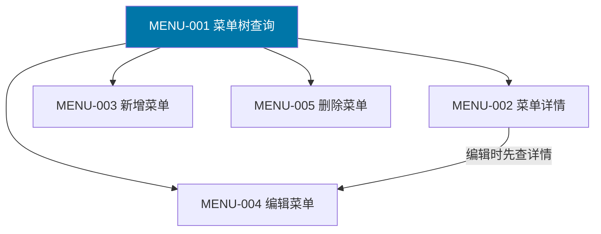
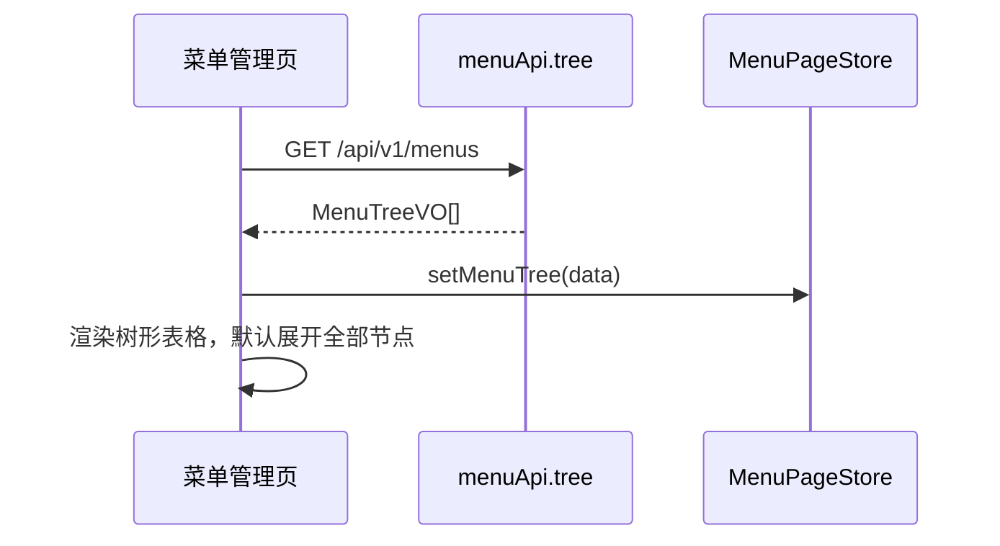
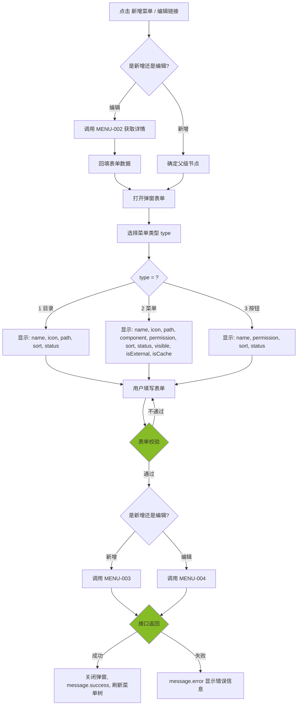
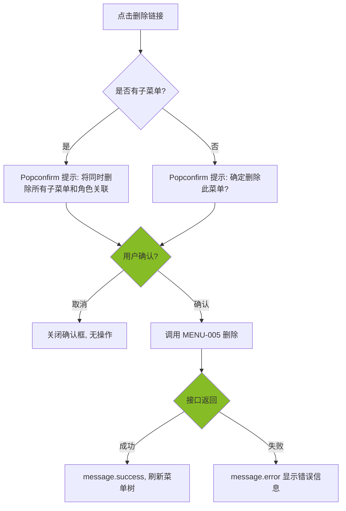
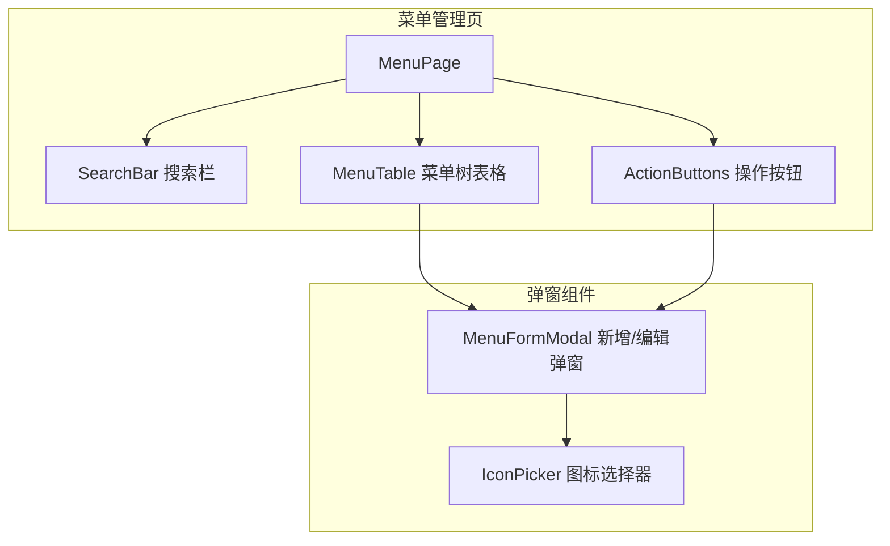

# 前端详细设计文档

## 文档信息

| 项目 | 内容 |
|------|------|
| 文档名称 | 菜单管理 前端详细设计文档 |
| 对应后端模块 | 菜单管理（模块标识：menu） |
| 参考文档 | `doc/design/modules/rbac/modules/菜单管理/后端详细设计.md` |
| 静态页面 | `static_fe/src/app/pages/Permissions.tsx` |
| 版本 | v1.0.0 |
| 创建日期 | 2026-04-11 |
| 最后更新 | 2026-04-11 |
| 负责人 | 前端开发（AI辅助） |

---

# 一、模块概述

## 1.1 功能描述

本模块前端实现**菜单管理**功能，面向平台超级管理员，管理系统三级菜单树结构（目录 > 菜单 > 按钮）。

核心功能：
- **菜单树展示**：以 Table 树形表格展示全部菜单数据，支持展开/折叠，默认展开全部
- **菜单搜索**：按菜单名称、状态、类型筛选菜单树
- **新增菜单**：根据菜单类型（目录/菜单/按钮）动态渲染表单字段，支持指定父级节点
- **编辑菜单**：回填已有菜单数据，菜单类型不可修改，支持修改名称、图标、路由、权限标识等
- **删除菜单**：级联删除子菜单，同时清除角色-菜单关联，操作前二次确认

## 1.2 模块边界与职责

| 职责 | 说明 |
|------|------|
| **本模块负责** | 菜单管理页、菜单树表格、新增/编辑菜单弹窗、删除确认、状态切换、搜索筛选 |
| **其他模块负责** | 角色管理模块消费菜单树数据进行权限分配；用户登录时 AuthService 加载菜单权限用于动态路由渲染 |

## 1.3 用户角色与权限

| 角色 | 可执行操作 | 对应权限标识 |
|------|----------|-------------|
| 平台超级管理员 | 所有操作（查询、新增、编辑、删除） | system:menu:list / add / edit / remove |

> **重要说明**：菜单是**全局数据**，不区分租户。仅平台超级管理员可管理菜单，租户管理员无此菜单入口。

---

# 二、接口调用总览

## 2.1 接口引用说明

| 接口标识 | 接口名称 | HTTP方法 | 路径 | 主要用途 | 对应后端文档章节 |
|----------|----------|----------|------|----------|-----------------|
| MENU-001 | 菜单树查询 | GET | /api/v1/menus | 页面加载、搜索筛选 | §7.2 API-001 |
| MENU-002 | 菜单详情 | GET | /api/v1/menus/{id} | 编辑弹窗回填 | §7.2 API-002 |
| MENU-003 | 新增菜单 | POST | /api/v1/menus | 新增弹窗提交 | §7.2 API-003 |
| MENU-004 | 编辑菜单 | PUT | /api/v1/menus/{id} | 编辑弹窗提交 | §7.2 API-004 |
| MENU-005 | 删除菜单 | DELETE | /api/v1/menus/{id} | 删除操作 | §7.2 API-005 |

**跨模块接口依赖：** 无。菜单管理模块为独立模块，不依赖其他业务模块的接口。

## 2.2 接口依赖关系



**说明**：MENU-001 是本模块的核心接口，页面初始化、搜索筛选均依赖此接口。编辑菜单时先调用 MENU-002 获取详情回填表单，再调用 MENU-004 提交修改。

---

# 三、页面详细设计

## 3.1 页面清单

| 页面名称 | 路由路径 | 页面功能描述 | 关联接口列表 |
|----------|----------|--------------|--------------|
| 菜单管理页 | /system/menu | 树形表格展示菜单，支持新增/编辑/删除 | MENU-001 ~ MENU-005 |

## 3.2 页面跳转关系


**说明**：菜单管理页通过侧边栏菜单「系统管理 > 菜单管理」进入。本页面为单页面操作，所有新增/编辑操作通过弹窗完成，不涉及页面跳转。

---

# 四、页面初始化流程设计

## 4.1 接口调用序列

| 顺序 | 接口 | 并行/串行 | 说明 |
|------|------|----------|------|
| 1 | MENU-001 菜单树查询 | 串行 | 页面加载时请求，无搜索条件 |

> 菜单管理仅有一个初始化接口调用，无并行依赖。

## 4.2 初始化时序图



## 4.3 初始化数据流

1. 接口返回 `MenuTreeVO[]` 树形数据 → 直接作为 Ant Design `Table`（树形模式）的 `dataSource`
2. 表格列配置映射：`name` → 菜单名称列、`icon` → 图标列、`type` → 类型 Tag 列、`sort` → 排序列、`permission` → 权限标识列、`path` → 路由地址列、`component` → 组件路径列、`status` → 状态 Tag 列
3. `children` 字段由后端递归构建，前端无需二次组装树

---

# 五、用户操作流程设计

## 5.1 操作-接口映射表

| 用户操作描述 | 触发组件 | 调用接口 | 请求参数构造 | 响应数据处理 | 异常处理 |
|-------------|---------|---------|-------------|-------------|---------|
| 点击搜索按钮 | 搜索按钮 | MENU-001 | 从搜索表单收集 name, status, type | 重置树形表格数据 | message.error 提示 |
| 点击重置按钮 | 重置按钮 | — | 清空搜索表单，重新调用 MENU-001 无参数 | — | — |
| 展开全部/折叠全部 | 工具栏按钮 | — | 操作 Table 的 expandAll / collapseAll | — | — |
| 点击新增菜单 | 新增按钮 | MENU-003 | 弹窗表单数据组装为 MenuCreateDTO | 关闭弹窗，刷新菜单树 | 表单校验失败阻止提交 |
| 点击编辑菜单 | 编辑链接 | MENU-002 → MENU-004 | 先调详情回填，提交时组装 MenuUpdateDTO | 关闭弹窗，刷新菜单树 | — |
| 点击删除菜单 | 删除链接 | MENU-005 | 取行记录 id | 刷新菜单树 | 二次确认后调用，提示级联删除 |
| 点击状态切换 | 状态 Tag 链接 | MENU-004 | 取行记录 id + 反转的 status 值 | 刷新菜单树 | message.error 提示 |

## 5.2 复杂操作流程

### 5.2.1 新增/编辑菜单流程



### 5.2.2 删除菜单流程



**说明**：删除操作前通过 Popconfirm 进行二次确认。如果目标菜单有子节点，提示文案需明确告知级联删除的后果。

---

# 六、组件设计

## 6.1 组件结构图



## 6.2 组件清单

| 组件名称 | 组件类型 | 主要职责 | 直接调用接口 | 父组件 | 子组件 |
|----------|----------|----------|-------------|--------|--------|
| MenuPage | 页面 | 菜单管理页布局 | — | App | SearchBar, MenuTable, ActionButtons |
| SearchBar | 业务组件 | 搜索表单（名称、状态、类型） | — | MenuPage | — |
| MenuTable | 业务组件 | 树形表格展示菜单 | MENU-005 | MenuPage | — |
| ActionButtons | UI 组件 | 新增菜单、展开/折叠按钮 | — | MenuPage | — |
| MenuFormModal | 业务组件 | 新增/编辑菜单弹窗 | MENU-002, MENU-003, MENU-004 | MenuPage | IconPicker |
| IconPicker | 业务组件 | Ant Design 图标选择器 | — | MenuFormModal | — |

## 6.3 关键组件详细设计

### 6.3.1 MenuTable 组件

- **接口调用设计**：不直接调用接口，数据由父组件通过 props 传入
- **Props 设计**：

| Prop | 类型 | 说明 |
|------|------|------|
| dataSource | MenuTreeVO[] | 树形表格数据源 |
| loading | boolean | 加载状态 |
| onEdit | (record: MenuTreeVO) => void | 点击编辑回调 |
| onDelete | (record: MenuTreeVO) => void | 点击删除回调 |
| onStatusChange | (record: MenuTreeVO) => void | 点击状态切换回调 |

- **表格列设计**：

| 列名 | 数据字段 | 渲染方式 | 宽度 |
|------|---------|---------|------|
| 菜单名称 | name | 文本 + 图标（`icon` 字段渲染 Ant Design Icon） | 自适应 |
| 图标 | icon | 渲染为 Ant Design Icon 组件 | 80px |
| 类型 | type | Tag：目录(cyan) / 菜单(blue) / 按钮(orange) | 80px |
| 排序 | sort | 数字 | 80px |
| 权限标识 | permission | Tag(blue)，按钮类型显示，其他类型为空 | 180px |
| 路由地址 | path | 文本，目录和菜单显示 | 160px |
| 组件路径 | component | 文本，菜单类型显示 | 160px |
| 可见 | visible | Tag：显示(green) / 隐藏(red) | 80px |
| 状态 | status | Tag：启用(success) / 禁用(error)，可点击切换 | 80px |
| 操作 | — | 编辑链接 + 删除链接 | 150px |

- **表格配置**：
  - `rowKey: 'id'`
  - `pagination: false`（不分页，树形展示全部数据）
  - `defaultExpandAllRows: true`（默认展开全部）
  - `childrenColumnName: 'children'`

### 6.3.2 MenuFormModal 组件

- **接口调用设计**：
  - 编辑模式：打开时调用 `MENU-002` 获取详情，回填表单
  - 提交时：新增调用 `MENU-003`，编辑调用 `MENU-004`
- **Props 设计**：

| Prop | 类型 | 说明 |
|------|------|------|
| open | boolean | 弹窗显隐 |
| menuId | number \| null | null 为新增模式，有值为编辑模式 |
| parentId | number \| null | 新增时的父级菜单 ID，null 表示顶级 |
| parentName | string \| null | 父级菜单名称，用于弹窗标题展示 |
| onSuccess | () => void | 操作成功回调 |

- **表单字段（根据 type 动态显隐）**：

| 字段 | 组件 | 必填 | 校验规则 | 适用类型 | 编辑模式 |
|------|------|------|---------|---------|---------|
| type | Radio.Group | 是 | 必选，新增时可选，编辑时禁用 | 所有 | 禁用（不可修改） |
| name | Input | 是 | 2-50 字符 | 所有 | 可编辑 |
| icon | IconPicker | 否 | — | 目录、菜单 | 可编辑 |
| path | Input | 条件必填 | 菜单类型必填 | 目录、菜单 | 可编辑 |
| component | Input | 条件必填 | 菜单类型必填 | 菜单 | 可编辑 |
| permission | Input | 条件必填 | 按钮类型必填，格式 `module:entity:action` | 菜单、按钮 | 可编辑 |
| sort | InputNumber | 是 | 0-999，默认 0 | 所有 | 可编辑 |
| visible | Switch | 否 | 默认 显示(1) | 菜单 | 可编辑 |
| status | Switch | 否 | 默认 启用(1) | 所有 | 可编辑 |
| isExternal | Switch | 否 | 默认 否(0) | 菜单 | 可编辑 |
| isCache | Switch | 否 | 默认 否(0) | 菜单 | 可编辑 |

- **type 变化时表单联动逻辑**：

```
当 type = 1（目录）时：
  显示：name, icon, path(可选), sort, status
  隐藏：component, permission(必填), visible, isExternal, isCache

当 type = 2（菜单）时：
  显示：name, icon, path(必填), component(必填), permission(可选), sort, status, visible, isExternal, isCache
  隐藏：无额外隐藏

当 type = 3（按钮）时：
  显示：name, permission(必填), sort, status
  隐藏：icon, path, component, visible, isExternal, isCache
```

- **弹窗标题规则**：
  - 新增：`新增菜单`（如果 parentId 存在，显示为 `新增子菜单 - {parentName}`）
  - 编辑：`编辑菜单 - {name}`

### 6.3.3 SearchBar 组件

- **接口调用设计**：不调用接口，通过回调将搜索条件传递给父组件
- **Props 设计**：

| Prop | 类型 | 说明 |
|------|------|------|
| onSearch | (values: MenuQueryDTO) => void | 搜索回调 |
| onReset | () => void | 重置回调 |

- **搜索字段**：

| 字段 | 组件 | 说明 |
|------|------|------|
| name | Input | 菜单名称，模糊搜索 |
| status | Select | 状态筛选：启用(1) / 禁用(0) / 全部 |
| type | Select | 类型筛选：目录(1) / 菜单(2) / 按钮(3) / 全部 |

### 6.3.4 IconPicker 组件

- **接口调用设计**：无接口调用，使用本地 Ant Design 图标列表
- **Props 设计**：

| Prop | 类型 | 说明 |
|------|------|------|
| value | string \| null | 当前选中的图标名称 |
| onChange | (icon: string \| null) => void | 图标选择回调 |

- **交互设计**：
  - 点击输入框弹出 Popover，展示 Ant Design 图标网格
  - 图标按分类展示（方向类、建议类、编辑类、数据类等）
  - 支持搜索过滤图标
  - 选中图标后回填到输入框，输入框前缀显示选中的图标

---

# 七、数据转换设计

## 7.1 请求数据构造

### 7.1.1 数据转换规则

| 接口 | 前端表单字段 | 接口请求字段 | 转换规则 |
|------|------------|------------|---------|
| MENU-001 | 搜索表单 | name, status, type | 直接映射，空值不传 |
| MENU-003 | 新增表单 | MenuCreateDTO | 直接映射，Switch 的 checked → 1/0；parentId 新增时传入 |
| MENU-004 | 编辑表单 | MenuUpdateDTO | 直接映射，不含 type 字段；Switch 的 checked → 1/0 |

### 7.1.2 转换函数设计

```
// Switch 布尔值转换为整数
boolToInt(checked: boolean): number → checked ? 1 : 0

// 整数转换为 Switch 布尔值
intToBool(value: number): boolean → value === 1

// 搜索参数构造（过滤空值）
buildMenuQuery(formValues): MenuQueryDTO → 移除 null/undefined/空字符串字段

// 新增表单数据组装
buildCreatePayload(formValues, parentId): MenuCreateDTO → {
  ...formValues,
  parentId: parentId ?? 0,
  visible: boolToInt(formValues.visible ?? true),
  status: boolToInt(formValues.status ?? true),
  isExternal: boolToInt(formValues.isExternal ?? false),
  isCache: boolToInt(formValues.isCache ?? false),
}

// 编辑表单数据组装（不含 type）
buildUpdatePayload(formValues): MenuUpdateDTO → {
  ...formValues（排除 type 字段）,
  visible: boolToInt(formValues.visible),
  status: boolToInt(formValues.status),
  isExternal: boolToInt(formValues.isExternal),
  isCache: boolToInt(formValues.isCache),
}

// 详情响应回填表单
detailToFormValues(detail: MenuTreeVO): FormValues → {
  ...detail,
  visible: intToBool(detail.visible),
  status: intToBool(detail.status),
  isExternal: intToBool(detail.isExternal),
  isCache: intToBool(detail.isCache),
}
```

## 7.2 响应数据处理

### 7.2.1 数据解析规则

| 接口 | 响应结构 | 解析规则 |
|------|---------|---------|
| MENU-001 | `MenuTreeVO[]` | 直接作为树形 Table 的 dataSource，无需转换 |
| MENU-002 | `MenuTreeVO`（无 children） | 回填编辑表单，布尔字段需 `intToBool` 转换 |
| MENU-003 | `MenuVO` | 不需要解析，操作成功后刷新菜单树 |
| MENU-004 | `MenuVO` | 同 MENU-003 |

### 7.2.2 数据格式化

```
// 菜单类型 Tag 映射
menuTypeMap: Record<number, { label: string, color: string }> → {
  1: { label: '目录', color: 'cyan' },
  2: { label: '菜单', color: 'blue' },
  3: { label: '按钮', color: 'orange' },
}

// 状态 Tag 映射
statusMap: Record<number, { label: string, color: string }> → {
  0: { label: '禁用', color: 'error' },
  1: { label: '启用', color: 'success' },
}

// 可见性 Tag 映射
visibleMap: Record<number, { label: string, color: string }> → {
  0: { label: '隐藏', color: 'red' },
  1: { label: '显示', color: 'green' },
}

// 图标名称渲染为组件
renderIcon(iconName: string | null): ReactNode → iconName ? <Icon component={iconMap[iconName]} /> : '-'
```

---

# 八、状态管理设计

## 8.1 全局状态设计

本模块不使用全局 Zustand Store。菜单数据为页面级状态，不跨页面共享。

> **说明**：菜单树数据在角色管理模块的权限分配弹窗中会用到，但角色管理模块会独立调用 MENU-001 接口获取菜单树，不依赖本模块的状态。

## 8.2 页面状态设计（菜单管理页）

```typescript
interface MenuPageState {
  // 菜单树
  menuTree: MenuTreeVO[];
  loading: boolean;

  // 搜索条件
  searchParams: {
    name?: string;
    status?: number;
    type?: number;
  };

  // 弹窗状态
  formModalOpen: boolean;
  editingMenuId: number | null;     // null = 新增模式
  parentMenuId: number | null;      // 新增时的父级 ID
  parentMenuName: string | null;    // 父级菜单名称
}
```

### 状态更新规则

| 触发事件 | 更新动作 |
|---------|---------|
| 页面初始化 | loading=true → 调用 MENU-001 → menuTree=data → loading=false |
| 搜索提交 | searchParams=新值 → loading=true → 调用 MENU-001(带参数) → menuTree=data → loading=false |
| 重置搜索 | searchParams={} → 重新调用 MENU-001(无参数) |
| 点击新增 | formModalOpen=true, editingMenuId=null, parentMenuId=指定值 |
| 点击编辑 | formModalOpen=true, editingMenuId=行 id |
| 弹窗关闭 | formModalOpen=false, editingMenuId=null |
| 操作成功 | formModalOpen=false → 重新调用 MENU-001 刷新菜单树 |

## 8.3 组件状态设计

| 组件 | 内部状态 | 说明 |
|------|---------|------|
| SearchBar | 表单值 | 由 Ant Design Form 管理 |
| MenuFormModal | 表单值、提交中(loading)、当前 type | 由 Ant Design Form 管理；type 变化控制字段显隐 |
| IconPicker | 搜索关键词、弹窗显隐 | Popover 内搜索过滤图标 |
| MenuTable | 展开状态、选中行 | 由 Ant Design Table 内部管理 |

---

# 九、模块安全规范

## 9.1 认证与授权

### 9.1.1 Token 管理

| 项目 | 说明 |
|------|------|
| Token 存储位置 | localStorage（key: `precision_token`） |
| Token 传递方式 | 请求 Header `Authorization: Bearer {token}` |
| Token 过期处理 | Axios 拦截器检测 401 → 清除 Store → 跳转 /login |

### 9.1.2 权限控制

| 页面/组件 | 权限标识 | 无权限处理 |
|-----------|---------|-----------|
| 菜单管理菜单入口 | system:menu:list | 菜单不显示（路由级别拦截） |
| 新增菜单按钮 | system:menu:add | 隐藏按钮 |
| 编辑操作链接 | system:menu:edit | 隐藏链接 |
| 删除操作链接 | system:menu:remove | 隐藏链接 |

**权限判断方式**：使用 `hasPermission(perm)` 函数，从 UserStore.permissions 数组中查找匹配。按钮级权限通过条件渲染控制。

## 9.2 敏感数据处理

本模块无敏感数据。菜单配置信息为公开的系统配置数据。

## 9.3 安全检查清单

- [x] 所有请求通过 Axios 拦截器自动携带 Token
- [x] 401 响应自动跳转登录页
- [x] 按钮级权限通过权限标识控制显隐
- [x] 路由级别权限拦截（无 system:menu:list 权限则菜单不显示）
- [x] 删除操作二次确认，提示级联删除影响

---

# 十、错误处理设计

## 10.1 接口调用错误处理

### 10.1.1 错误分类与处理

| 错误类型 | HTTP 状态码 | 业务错误码 | 处理策略 |
|---------|-----------|----------|---------|
| 未登录 | 401 | 30001 | 清除 Store，跳转 /login |
| 无权限 | 403 | 30003 | message.error('无操作权限') |
| 参数校验失败 | 200 | 10002 | message.error(具体字段错误) |
| 同级名称重复 | 200 | 10002 | message.error('同级已存在同名菜单') |
| 按钮缺少权限标识 | 200 | 10002 | message.error('按钮权限标识不能为空') |
| 菜单不存在 | 200 | 10002 | message.error('菜单不存在') |
| 移动到子菜单下 | 200 | 10002 | message.error('不能将菜单移动到自己的子菜单下') |
| 网络异常 | — | — | message.error('网络异常，请稍后重试') |
| 服务器错误 | 500 | — | message.error('服务器异常') |

### 10.1.2 重试机制

| 接口 | 是否重试 | 重试策略 |
|------|---------|---------|
| MENU-001 菜单树查询 | 是 | TanStack Query 自动重试 1 次 |
| MENU-002 菜单详情 | 是 | TanStack Query 自动重试 1 次 |
| MENU-003 新增菜单 | 否 | 直接展示错误 |
| MENU-004 编辑菜单 | 否 | 直接展示错误 |
| MENU-005 删除菜单 | 否 | 直接展示错误 |

## 10.2 用户操作错误处理

| 场景 | 处理方案 |
|------|---------|
| 表单校验失败 | Ant Design Form 内联红色提示 |
| 新增同名菜单 | message.error 提示，表单不关闭 |
| 按钮类型缺少 permission | Form.Item rules 条件校验，阻止提交 |
| 菜单类型缺少 path/component | Form.Item rules 条件校验，阻止提交 |
| 编辑时菜单已被删除 | message.error('菜单不存在')，关闭弹窗，刷新列表 |
| 删除有子菜单的节点 | Popconfirm 中明确提示级联删除，用户确认后执行 |
| 网络断开 | 全局 Axios 拦截器 message.error |

---

# 十一、性能优化设计

## 11.1 接口调用优化

### 11.1.1 接口合并

无需合并。菜单管理页仅调用 MENU-001 一个接口。

### 11.1.2 接口缓存

| 接口 | 缓存策略 | 缓存时间 | 说明 |
|------|---------|---------|------|
| MENU-001 菜单树 | TanStack Query staleTime 5min | 5 分钟内不重复请求 | 菜单数据变更频率低 |
| MENU-002 菜单详情 | 不缓存 | 每次打开编辑弹窗重新请求 | 确保最新数据 |

> **缓存失效**：新增/编辑/删除操作成功后，调用 `queryClient.invalidateQueries(['menu', 'tree'])` 主动失效缓存，触发重新请求。

## 11.2 组件渲染优化

| 优化项 | 策略 |
|-------|------|
| 树形表格渲染 | 菜单数据量通常 < 200 条，无需虚拟滚动，直接渲染 |
| 弹窗懒渲染 | `destroyOnClose: true`，关闭时销毁表单状态，避免残留 |
| 图标组件缓存 | IconPicker 中的图标列表为静态数据，使用 `useMemo` 缓存 |
| 搜索防抖 | 菜单名称输入 300ms 防抖（如有即时搜索需求） |

---

# 十二、测试设计

## 12.1 正常流程测试

| 测试场景 | 前置条件 | 操作步骤 | 预期结果 |
|---------|---------|---------|---------|
| 菜单树加载 | 已登录且有权限 | 进入菜单管理页 | 表格加载完整菜单树，默认全部展开 |
| 新增目录 | 菜单树已加载 | 点击新增，type=目录，填写 name+sort，确定 | 弹窗关闭，菜单树刷新，新目录出现 |
| 新增菜单 | 已存在目录 | 点击目录的编辑旁新增子菜单，type=菜单，填写 name+path+component，确定 | 弹窗关闭，新菜单出现在目录下 |
| 新增按钮 | 已存在菜单 | 点击菜单的新增子菜单，type=按钮，填写 name+permission，确定 | 弹窗关闭，新按钮出现在菜单下 |
| 编辑菜单 | 菜单存在 | 点击编辑，修改 name，确定 | 弹窗关闭，列表刷新，名称已更新 |
| 删除叶子菜单 | 菜单无子项 | 点击删除，确认 | 菜单从树中消失，角色关联已清除 |
| 删除有子菜单的目录 | 目录下有菜单 | 点击删除，确认（提示级联） | 目录及子菜单全部消失 |
| 搜索菜单 | 菜单树有数据 | 输入名称"用户"，点击搜索 | 树形表格仅展示匹配的菜单 |
| 按状态筛选 | 菜单有不同状态 | 选择"禁用"，搜索 | 仅展示 status=0 的菜单 |
| 按类型筛选 | 菜单有不同类型 | 选择"按钮"，搜索 | 仅展示 type=3 的菜单 |
| 重置搜索 | 搜索条件存在 | 点击重置 | 搜索条件清空，重新加载完整菜单树 |

## 12.2 异常流程测试

| 测试场景 | 前置条件 | 操作步骤 | 预期结果 |
|---------|---------|---------|---------|
| 新增同名菜单 | 同级已有"用户管理" | 新增菜单，name 输入"用户管理" | message.error('同级已存在同名菜单') |
| 按钮缺少 permission | — | type=按钮，permission 留空，提交 | 表单校验失败，提示"按钮权限标识不能为空" |
| 菜单缺少 path | — | type=菜单，path 留空，提交 | 表单校验失败，提示"路由地址不能为空" |
| 菜单缺少 component | — | type=菜单，component 留空，提交 | 表单校验失败，提示"组件路径不能为空" |
| 编辑已删除的菜单 | 菜单已被其他管理员删除 | 点击编辑 | message.error('菜单不存在')，关闭弹窗 |
| Token 过期 | — | 操作任意接口 | 自动跳转登录页 |
| 网络断开 | — | 操作任意接口 | message.error 网络异常提示 |

---

# 附录

## A. 接口详细说明

### A.1 MENU-001 菜单树查询

- **调用时机**：页面初始化、搜索提交、重置搜索、新增/编辑/删除操作成功后刷新
- **请求参数**：`{ name?: string, status?: number, type?: number }`
- **响应处理**：`data` 直接作为 Table 树形数据源
- **错误处理**：message.error 提示

### A.2 MENU-002 菜单详情

- **调用时机**：编辑弹窗打开时
- **请求参数**：路径参数 `id`
- **响应处理**：回填表单字段，布尔字段 intToBool 转换
- **错误处理**：message.error 提示，关闭弹窗

### A.3 MENU-003 新增菜单

- **调用时机**：新增弹窗提交
- **请求参数**：MenuCreateDTO（含 parentId）
- **响应处理**：关闭弹窗 → message.success → 失效菜单树缓存 → 刷新列表
- **错误处理**：表单字段级错误回显；通用错误 message.error

### A.4 MENU-004 编辑菜单

- **调用时机**：编辑弹窗提交
- **请求参数**：MenuUpdateDTO（路径含 id，不含 type）
- **响应处理**：同 MENU-003
- **错误处理**：同 MENU-003

### A.5 MENU-005 删除菜单

- **调用时机**：删除确认后
- **请求参数**：路径参数 `id`
- **响应处理**：message.success → 失效菜单树缓存 → 刷新列表
- **错误处理**：message.error 提示

## B. 类型定义

```typescript
/** 菜单类型枚举 */
enum MenuType {
  DIR = 1,     // 目录
  MENU = 2,    // 菜单
  BUTTON = 3,  // 按钮
}

/** 菜单树节点 */
interface MenuTreeVO {
  id: number;
  parentId: number;
  name: string;
  icon: string | null;
  type: MenuType;
  sort: number;
  permission: string | null;
  path: string | null;
  component: string | null;
  visible: number;
  status: number;
  isExternal: number;
  isCache: number;
  children: MenuTreeVO[];
}

/** 菜单查询参数 */
interface MenuQueryDTO {
  name?: string;
  status?: number;
  type?: number;
}

/** 新增菜单请求 */
interface MenuCreateDTO {
  parentId: number;
  name: string;
  icon?: string;
  type: MenuType;
  sort: number;
  permission?: string;
  path?: string;
  component?: string;
  visible?: number;
  status?: number;
  isExternal?: number;
  isCache?: number;
}

/** 编辑菜单请求 */
interface MenuUpdateDTO {
  name: string;
  icon?: string;
  sort: number;
  permission?: string;
  path?: string;
  component?: string;
  visible?: number;
  status?: number;
  isExternal?: number;
  isCache?: number;
}
```

## C. 变更记录

| 版本 | 日期 | 修改人 | 变更描述 | 变更原因 | 评审人 |
|------|------|--------|---------|---------|--------|
| v1.0.0 | 2026-04-11 | 前端开发（AI） | 初始版本 | 菜单管理前端详细设计 | 待评审 |
