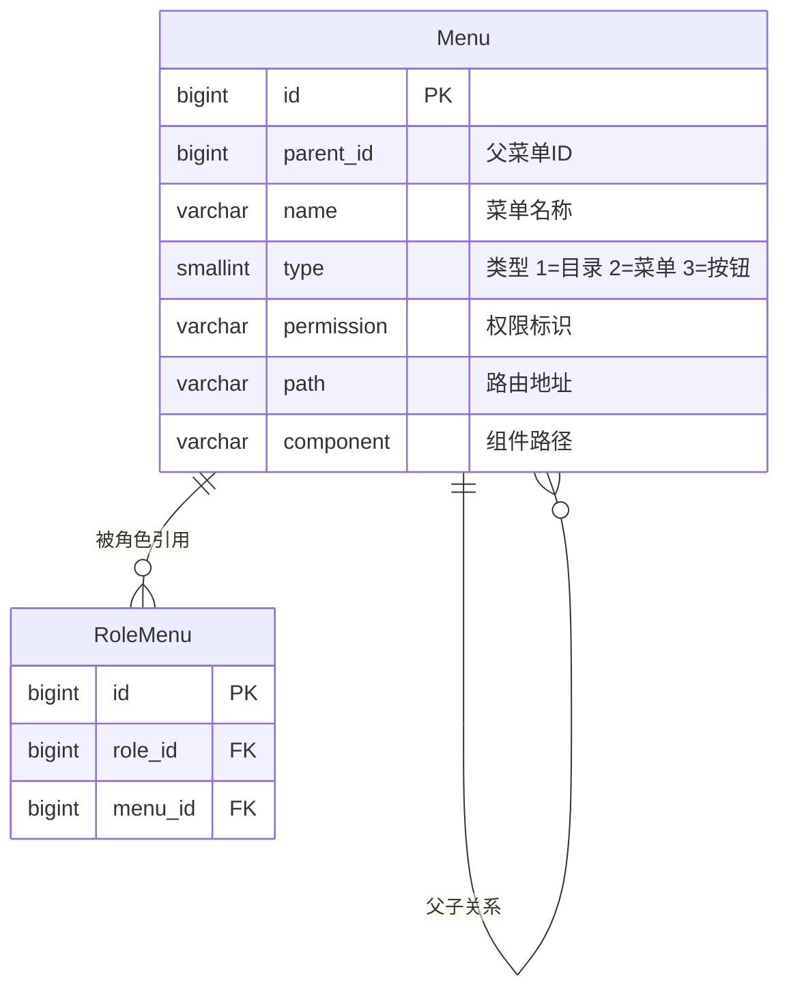
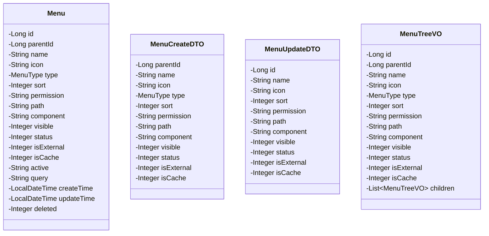
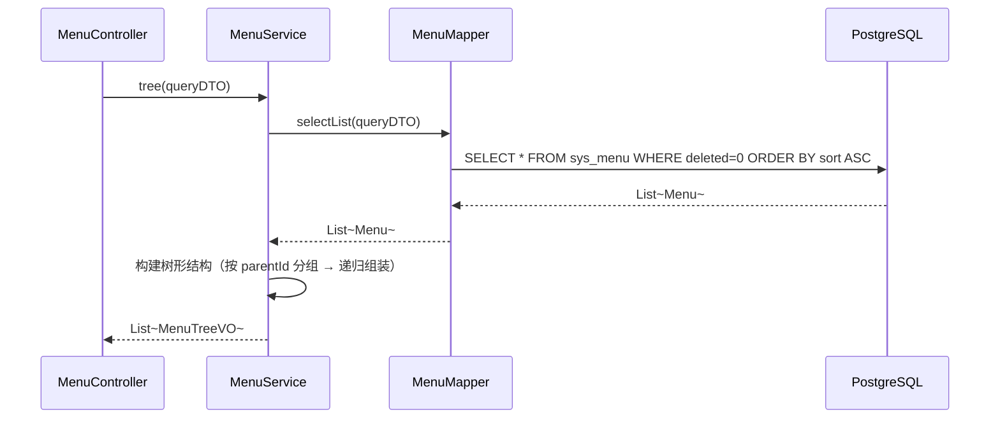
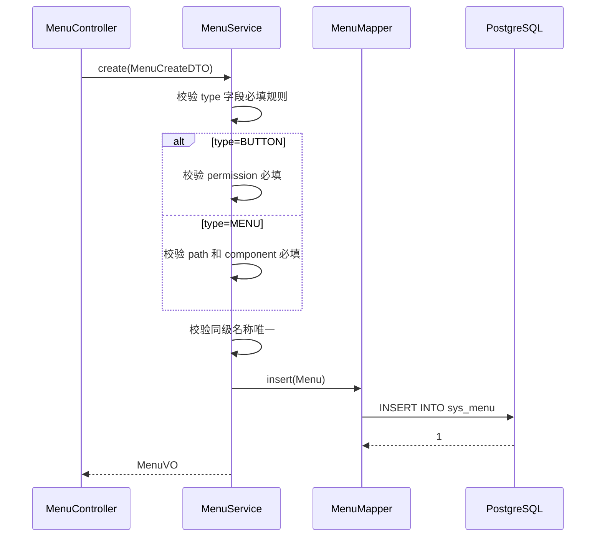
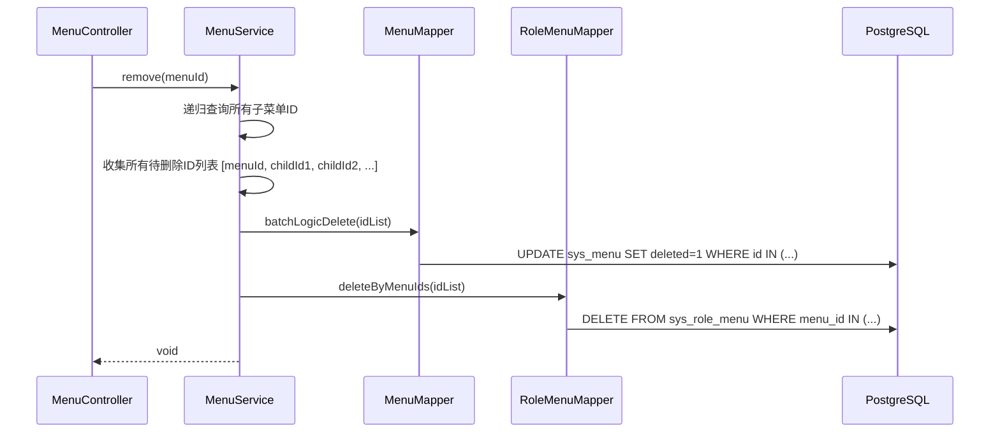
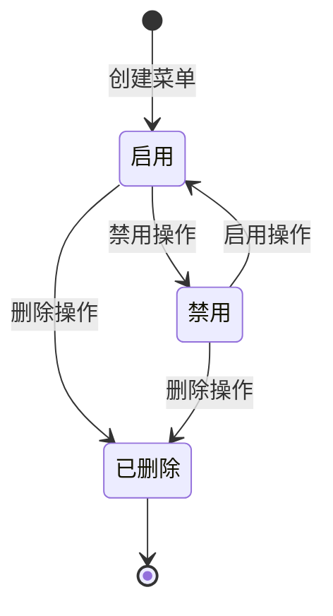
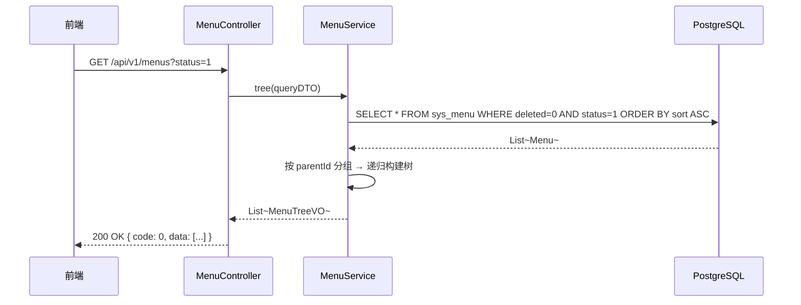
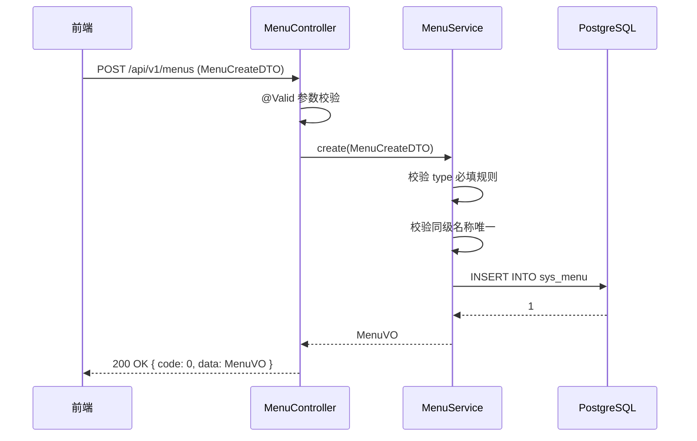

# 程序详细设计文档

> **定位**
> - 数据库驱动设计
> - 分层思想
> - 前后端无代码协同
> - AI 分阶段稳定交付

------

## 文档信息

| 项目 | 内容 |
|------|------|
| 模块名称 | 菜单管理 |
| 模块标识 | menu |
| 所属系统 | RBAC 权限模块 |
| 文档版本 | v1.0.0 |
| 设计负责人 | 后端开发（AI辅助） |
| 最后更新时间 | 2026-03-30 |

适用对象：
- 后端开发
- 前端开发
- 测试人员
- AI 编程

------

# 一、数据库设计

> ⚠️ 数据库是系统"真实状态"的最终承载
> 所有代码都必须服务于本章设计

------

## 1.1 表清单与业务职责

| 表名 | 业务含义 | 主键 | 是否核心表 | 说明 |
|------|---------|------|-----------|------|
| sys_menu | 菜单表 | id (BIGINT) | 是 | 全局表（无 tenant_id），存储目录/菜单/按钮三级结构 |
| sys_role_menu | 角色菜单关联表 | id (BIGINT) | 否 | 全局关联表，角色分配菜单权限时写入 |

------

## 1.2 表关系设计（ER 图）



**流程说明**：

1. 菜单树为三级结构：目录(type=1) → 菜单(type=2) → 按钮(type=3)
2. 角色通过 sys_role_menu 关联菜单，实现菜单权限和按钮权限控制
3. 菜单删除时，级联删除 sys_role_menu 中对应记录

**关键点**：

- sys_menu 是**全局表**，不含 tenant_id，不受租户拦截器过滤
- 菜单数据对所有租户共享，通过角色权限间接控制各租户可见的菜单
- sys_role_menu 是**全局关联表**，不含 tenant_id

------

## 1.3 表结构设计（字段级，逐字段）

### 表：sys_menu

> ⚠️ 全局表，无 tenant_id 字段

| 字段 | 类型 | 必填 | 描述 | 业务含义 | 设计说明 |
|------|------|------|------|---------|---------|
| id | BIGINT | 是 | 主键 | 菜单ID | 雪花算法生成 |
| parent_id | BIGINT | 是 | 父菜单ID | 树形结构 | 顶级为 0 |
| name | VARCHAR(50) | 是 | 菜单名称 | 展示名称 | 2-50 字符 |
| icon | VARCHAR(100) | 否 | 菜单图标 | 前端图标 | 图标名称，如 "user", "setting" |
| type | SMALLINT | 是 | 菜单类型 | 区分层级 | 1=目录，2=菜单，3=按钮 |
| sort | INT | 是 | 显示排序 | 排序权重 | 值越小越靠前，默认 0 |
| permission | VARCHAR(100) | 否 | 权限标识 | 按钮权限 | 格式：`module:entity:action`，如 `system:user:add` |
| path | VARCHAR(200) | 否 | 路由地址 | 前端路由 | 菜单类型必填，如 `/system/user` |
| component | VARCHAR(200) | 否 | 组件路径 | 前端组件 | 菜单类型必填，如 `system/user/index` |
| visible | SMALLINT | 是 | 是否显示 | 显示控制 | 0=隐藏，1=显示。默认 1 |
| status | SMALLINT | 是 | 状态 | 启用/禁用 | 0=禁用，1=启用。默认 1 |
| is_external | SMALLINT | 是 | 是否外链 | 外链标识 | 0=否，1=是。默认 0 |
| is_cache | SMALLINT | 是 | 是否缓存 | 页面缓存 | 0=否，1=是。默认 0 |
| active | VARCHAR(200) | 否 | 路由参数 | 路由激活 | 预留字段 |
| query | VARCHAR(200) | 否 | 路由参数JSON | 路由查询 | 预留字段 |
| create_time | TIMESTAMP | 是 | 创建时间 | 审计字段 | 自动填充 |
| update_time | TIMESTAMP | 是 | 更新时间 | 审计字段 | 自动更新 |
| deleted | SMALLINT | 是 | 逻辑删除 | 删除标识 | 0=正常，1=已删除。默认 0 |

**type 字段与必填规则**：

| type 值 | 类型 | permission | path | component |
|---------|------|-----------|------|-----------|
| 1 | 目录 | 可选 | 可选 | — |
| 2 | 菜单 | 可选 | 必填 | 必填 |
| 3 | 按钮 | 必填 | — | — |

------

## 1.4 反范式设计

### 反范式字段清单

| 表 | 字段 | 冗余来源 | 冗余原因 | 一致性策略 | 风险 |
|---|------|---------|---------|-----------|------|
| 无 | — | — | — | — | — |

> 菜单表为树形结构，无反范式需求。查询效率通过索引保证。

------

## 1.5 索引与约束设计

**唯一索引：** 无（菜单名称不要求全局唯一，同级内建议不重复但不强制）

**普通索引：**
- `idx_menu_parent ON sys_menu(parent_id) WHERE deleted = 0` — 按父级查询子菜单（树构建）
- `idx_menu_type ON sys_menu(type) WHERE deleted = 0` — 按类型筛选
- `idx_menu_permission ON sys_menu(permission) WHERE permission IS NOT NULL` — 按权限标识查询（登录时加载权限）

**业务唯一约束：**
- 同一 parent_id 下 name 建议不重复（业务层校验，不建唯一索引，因为软删除后可重建）

------

# 二、模块目标与边界

**模块解决的业务问题：**
管理系统三级菜单树（目录 > 菜单 > 按钮），定义权限标识和前端路由映射。为角色权限分配提供菜单数据源。

**模块不解决的问题：**
- 前端路由动态渲染（前端根据 API 返回数据自行生成路由）
- 按钮级权限前端展示（前端根据 permission 标识控制）
- 菜单与角色的关联管理（角色管理模块负责）

**是否核心链路：** 是。菜单是 RBAC 权限控制的数据基础。

------

## 2.1 模块边界图

```mermaid
flowchart TD
    subgraph 菜单管理模块
        A[MenuController]
        B[MenuService]
        C[MenuMapper]
    end

    subgraph 角色管理模块
        D[RoleService]
    end

    subgraph 用户管理模块
        E[AuthService]
    end

    subgraph 公共基础设施
        F[Sa-Token]
        G[@Log]
    end

    A --> B
    B --> C

    D -->|分配菜单权限时查询菜单树| B
    E -->|登录时加载用户菜单| B

    A --> F
    A --> G
```

**关键点**：

- 菜单管理模块**不被其他模块的 Mapper 侵入**
- 角色管理模块通过调用 MenuService 获取菜单树
- 用户登录时通过 AuthService → MenuService 加载菜单权限

------

# 三、整体架构设计

> ⚠️ 明确声明：**本项目不采用 DDD**

------

## 3.1 分层结构定义

```
com.precision.rbac.menu/
├── controller/
│   └── MenuController
├── service/
│   ├── MenuService
│   └── impl/
│       └── MenuServiceImpl
├── mapper/
│   └── MenuMapper
├── entity/
│   └── Menu
├── dto/
│   ├── MenuCreateDTO
│   ├── MenuUpdateDTO
│   └── MenuQueryDTO
├── vo/
│   ├── MenuVO
│   └── MenuTreeVO
└── enums/
    └── MenuType
```

### 命名规范

| 数据库表名 | Entity 类名 | Service 接口名 | Controller 类名 |
|-----------|------------|---------------|----------------|
| sys_menu | Menu | MenuService | MenuController |

------

## 3.2 枚举设计规范（强制）

| 枚举类 | 枚举值 | code | description |
|--------|--------|------|-------------|
| MenuType | 目录 | DIR | 菜单容器，不对应页面 |
| MenuType | 菜单 | MENU | 实际页面，对应前端路由 |
| MenuType | 按钮 | BUTTON | 页面内的操作按钮权限 |

> 数据库 `type` 字段存储 SMALLINT（1/2/3），Entity 层通过 `@EnumValue` 映射。

------

## 3.3 层级职责与禁止事项

| 层 | 允许做 | 禁止做 |
|---|--------|--------|
| Controller | 参数校验(@Valid)、请求响应处理 | 写业务逻辑、直接操作数据库 |
| Service | 菜单树构建、级联删除逻辑、同级名称唯一校验 | 直接写 SQL、处理 HTTP 请求 |
| Mapper | 数据访问、SQL 执行 | 业务判断、参数校验 |

------

# 四、业务模型与数据映射

### Entity 类设计



**DTO → Entity 映射说明：**

| DTO 字段 | Entity 字段 | 转换逻辑 | 说明 |
|---------|------------|---------|------|
| type | type | 直接映射 | 创建时设置，不可修改 |
| parentId | parentId | 直接映射 | 默认 0（顶级） |
| visible | visible | 为空时默认 1 | 显示 |
| status | status | 为空时默认 1 | 启用 |

**Entity → VO 映射说明：**

| VO 字段 | 来源 | 转换逻辑 |
|---------|------|---------|
| children | 内存构建 | 按 parentId 分组，递归组装树 |
| type | Entity.type | 直接映射，前端根据值展示不同 Tag |

------

# 五、行为流程与用例设计

## 5.1 主流程（时序图）

### 5.1.1 查询菜单树流程



### 5.1.2 新增菜单流程



### 5.1.3 删除菜单流程（级联）



## 5.2 关键业务规则说明

### 新增菜单

- **前置条件**：操作人为超级管理员
- **核心校验**：
  - 目录：name 必填
  - 菜单：name、path、component 必填
  - 按钮：name、permission 必填
  - 同一 parent_id 下 name 不重复（`WHERE parent_id = ? AND name = ? AND deleted = 0`）
- **失败路径**：
  - 名称重复 → 抛出 `BizException(PARAM_ERROR, "同级已存在同名菜单")`
  - 按钮缺少 permission → 抛出 `BizException(PARAM_ERROR, "按钮权限标识不能为空")`

### 编辑菜单

- **前置条件**：菜单存在
- **核心校验**：
  - 菜单类型 type 不可修改
  - 不能将菜单移动到自己的子菜单下
  - 同级名称唯一
- **失败路径**：
  - 菜单不存在 → 抛出 `BizException(PARAM_ERROR, "菜单不存在")`
  - 移动到子菜单下 → 抛出 `BizException(PARAM_ERROR, "不能将菜单移动到自己的子部门下")`

### 删除菜单

- **前置条件**：菜单存在
- **核心校验**：无（允许级联删除子菜单）
- **处理逻辑**：
  1. 递归收集所有子菜单 ID
  2. 批量逻辑删除所有菜单
  3. 删除 sys_role_menu 中对应的关联记录
- **失败路径**：
  - 菜单不存在 → 抛出 `BizException(PARAM_ERROR, "菜单不存在")`

------

# 六、状态机设计

### 菜单状态



**状态值映射：**

| 状态 | status 值 | 说明 |
|------|----------|------|
| 启用 | 1 | 正常显示 |
| 禁用 | 0 | 不显示，但不影响权限配置 |
| 已删除 | deleted = 1 | 逻辑删除 |

------

# 七、接口设计（前后端核心契约）

> **目标：无代码即可协同开发**

------

## 7.1 接口清单

| 接口编号 | 接口名称 | URL | Method | 认证 | 授权 |
|---------|---------|-----|--------|------|------|
| API-001 | 菜单树查询 | /api/v1/menus | GET | 是 | system:menu:list |
| API-002 | 菜单详情 | /api/v1/menus/{id} | GET | 是 | system:menu:list |
| API-003 | 新增菜单 | /api/v1/menus | POST | 是 | system:menu:add |
| API-004 | 编辑菜单 | /api/v1/menus/{id} | PUT | 是 | system:menu:edit |
| API-005 | 删除菜单 | /api/v1/menus/{id} | DELETE | 是 | system:menu:remove |

------

## 7.2 入参设计

### API-001 菜单树查询

**请求对象：** `MenuQueryDTO`

| 参数 | 类型 | 必填 | 描述 | 校验规则 |
|------|------|------|------|---------|
| name | String | 否 | 菜单名称 | 模糊匹配 |
| status | Integer | 否 | 状态 | 0=禁用，1=启用，null=全部 |
| type | Integer | 否 | 菜单类型 | 1=目录，2=菜单，3=按钮 |

**请求示例：**

```
GET /api/v1/menus?name=用户&status=1
```

### API-003 新增菜单

**请求对象：** `MenuCreateDTO`

| 参数 | 类型 | 必填 | 描述 | 校验规则 |
|------|------|------|------|---------|
| parentId | Long | 否 | 父菜单ID | 默认 0（顶级） |
| name | String | 是 | 菜单名称 | @Size(min=2, max=50) |
| icon | String | 否 | 图标 | @Size(max=100) |
| type | Integer | 是 | 菜单类型 | 1/2/3 |
| sort | Integer | 是 | 排序 | @Min(0) @Max(999) |
| permission | String | 否 | 权限标识 | 按钮类型必填 |
| path | String | 否 | 路由地址 | 菜单类型必填 |
| component | String | 否 | 组件路径 | 菜单类型必填 |
| visible | Integer | 否 | 是否显示 | 默认 1 |
| status | Integer | 否 | 状态 | 默认 1 |
| isExternal | Integer | 否 | 是否外链 | 默认 0 |
| isCache | Integer | 否 | 是否缓存 | 默认 0 |

**请求示例（菜单类型）：**

```json
{
  "parentId": 1,
  "name": "用户管理",
  "type": 2,
  "icon": "user",
  "sort": 1,
  "path": "/system/user",
  "component": "system/user/index",
  "permission": "system:user",
  "visible": 1,
  "status": 1
}
```

### API-004 编辑菜单

**请求对象：** `MenuUpdateDTO`

| 参数 | 类型 | 必填 | 描述 | 校验规则 |
|------|------|------|------|---------|
| name | String | 是 | 菜单名称 | @Size(min=2, max=50) |
| icon | String | 否 | 图标 | @Size(max=100) |
| sort | Integer | 是 | 排序 | @Min(0) @Max(999) |
| permission | String | 否 | 权限标识 | 按钮类型必填 |
| path | String | 否 | 路由地址 | 菜单类型必填 |
| component | String | 否 | 组件路径 | 菜单类型必填 |
| visible | Integer | 否 | 是否显示 | - |
| status | Integer | 否 | 状态 | - |
| isExternal | Integer | 否 | 是否外链 | - |
| isCache | Integer | 否 | 是否缓存 | - |

> **注意**：菜单类型 type 不可修改。

------

## 7.3 出参设计

### MenuTreeVO（菜单树响应）

**类名：** `MenuTreeVO`

| 字段 | 类型 | 描述 |
|------|------|------|
| id | Long | 菜单ID |
| parentId | Long | 父菜单ID |
| name | String | 菜单名称 |
| icon | String | 图标 |
| type | Integer | 类型：1=目录，2=菜单，3=按钮 |
| sort | Integer | 排序 |
| permission | String | 权限标识 |
| path | String | 路由地址 |
| component | String | 组件路径 |
| visible | Integer | 是否显示 |
| status | Integer | 状态 |
| isExternal | Integer | 是否外链 |
| isCache | Integer | 是否缓存 |
| children | List\<MenuTreeVO\> | 子菜单列表 |

**响应示例：**

```json
{
  "code": 0,
  "message": "success",
  "data": [
    {
      "id": 1,
      "parentId": 0,
      "name": "系统管理",
      "icon": "setting",
      "type": 1,
      "sort": 1,
      "path": "/system",
      "status": 1,
      "children": [
        {
          "id": 2,
          "parentId": 1,
          "name": "用户管理",
          "icon": "user",
          "type": 2,
          "sort": 1,
          "path": "/system/user",
          "component": "system/user/index",
          "permission": "system:user",
          "status": 1,
          "children": [
            {
              "id": 3,
              "parentId": 2,
              "name": "用户新增",
              "type": 3,
              "sort": 1,
              "permission": "system:user:add",
              "status": 1,
              "children": []
            }
          ]
        }
      ]
    }
  ]
}
```

------

## 7.4 接口治理要求（强制）

| 接口 | 是否启用全局防抖 | 是否需要接口级防抖 | 是否幂等 | 幂等依据 | 日志级别 |
|------|----------------|------------------|---------|---------|---------|
| API-001 菜单树查询 | 是 | 否 | 是 | 相同参数相同结果 | 无 |
| API-002 菜单详情 | 是 | 否 | 是 | 相同参数相同结果 | 无 |
| API-003 新增菜单 | 是 | 否 | 否 | 同名可被阻止 | @Log |
| API-004 编辑菜单 | 是 | 否 | 是 | 全量更新 | @Log |
| API-005 删除菜单 | 是 | 否 | 是 | 逻辑删除 | @Log |

------

# 八、模块安全规范

------

## 8.1 认证与授权要求

本模块是否需要认证：**是**
认证方式：Sa-Token（Token）
本模块是否需要授权：**是**
授权粒度：**接口级**

### 接口权限配置

| 接口 | 权限标识 | 权限说明 | 是否公开 |
|------|---------|---------|---------|
| API-001 菜单树查询 | system:menu:list | 查询菜单树 | 否 |
| API-002 菜单详情 | system:menu:list | 查看菜单详情 | 否 |
| API-003 新增菜单 | system:menu:add | 新增菜单 | 否 |
| API-004 编辑菜单 | system:menu:edit | 编辑菜单 | 否 |
| API-005 删除菜单 | system:menu:remove | 删除菜单 | 否 |

> **注意**：菜单管理仅面向平台超级管理员，属于系统级配置。

------

## 8.2 敏感数据处理

本模块无敏感数据。

------

## 8.3 安全检查清单

- [x] 所有接口是否配置了正确的权限？ → system:menu:* 系列
- [x] 输入参数是否有完整的校验？ → @Valid + JSR 303
- [x] 是否有 SQL 注入风险？ → MyBatis-Flex 参数化查询
- [x] 是否有 XSS 风险？ → 输入过滤 + 输出转义
- [x] 操作日志是否完整？ → 所有写接口添加 @Log
- [x] 删除菜单是否级联清理？ → 同时删除 sys_role_menu 关联

------

# 九、算法设计

### 9.1 是否涉及算法

是否涉及算法：**否**

> 本模块无算法设计。菜单树通过内存分组 + 递归构建，时间复杂度 O(n)。级联删除通过递归收集子节点 ID 列表，一次批量更新。

------

# 十、前后端交互模型

### 菜单树查询交互时序



### 新增菜单交互时序



------

# 十一、测试用例设计

## 正常流程

| 用例ID | 测试场景 | 前置条件 | 测试步骤 | 预期结果 |
|--------|---------|---------|---------|---------|
| MENU-001 | 查询完整菜单树 | 已初始化菜单数据 | 调用 API-001 | 返回三级树结构 |
| MENU-002 | 新增目录 | - | type=1, 填写 name | 创建成功 |
| MENU-003 | 新增菜单 | 已存在目录 | type=2, 填写 name+path+component | 创建成功 |
| MENU-004 | 新增按钮 | 已存在菜单 | type=3, 填写 name+permission | 创建成功 |
| MENU-005 | 编辑菜单名称 | 菜单存在 | 修改 name | 修改成功 |
| MENU-006 | 删除叶子菜单 | 菜单无子项 | 删除 | 成功，sys_role_menu 对应记录已清除 |

## 异常流程

| 用例ID | 测试场景 | 前置条件 | 测试步骤 | 预期结果 |
|--------|---------|---------|---------|---------|
| MENU-007 | 按钮缺少 permission | - | type=3, permission 为空 | 提示"按钮权限标识不能为空" |
| MENU-008 | 菜单缺少 path | - | type=2, path 为空 | 提示"菜单路由地址不能为空" |
| MENU-009 | 同级名称重复 | 同级已有"用户管理" | 新增同名为"用户管理" | 提示"同级已存在同名菜单" |
| MENU-010 | 编辑时修改 type | 菜单 type=2 | 尝试修改 type=1 | 忽略 type 字段或提示不可修改 |
| MENU-011 | 移动到子菜单下 | A→B→C 层级 | 将 A 的 parentId 改为 C | 提示"不能将菜单移动到自己的子菜单下" |

## 边界条件

| 用例ID | 测试场景 | 前置条件 | 测试步骤 | 预期结果 |
|--------|---------|---------|---------|---------|
| MENU-012 | 名称长度刚好 | - | name=2字符 | 创建成功 |
| MENU-013 | 名称超长 | - | name=51字符 | 校验失败 |
| MENU-014 | sort 边界 | - | sort=999 | 创建成功 |
| MENU-015 | sort 超限 | - | sort=1000 | 校验失败 |
| MENU-016 | 查询空树 | 无菜单数据 | 调用 API-001 | 返回空数组 [] |

## 并发 / 幂等

| 用例ID | 测试场景 | 前置条件 | 测试步骤 | 预期结果 |
|--------|---------|---------|---------|---------|
| MENU-017 | 并发新增同名菜单 | - | 两个请求同时新增 | 业务校验阻止一个 |
| MENU-018 | 重复删除 | 菜单已删除 | 再次删除同一 ID | 幂等成功（已删除） |

## 数据一致性

| 用例ID | 测试场景 | 前置条件 | 测试步骤 | 预期结果 |
|--------|---------|---------|---------|---------|
| MENU-019 | 删除父菜单级联 | A→B→C | 删除 A | A、B、C 全部逻辑删除，sys_role_menu 全部清除 |
| MENU-020 | 删除菜单后角色权限一致 | 角色引用了该菜单 | 删除菜单 | 角色的 menu 列表中不再包含该菜单 |

------

## 变更记录

| 版本 | 日期 | 修改人 | 变更内容 | 变更原因 | 评审人 |
|------|------|--------|---------|---------|--------|
| v1.0.0 | 2026-03-30 | 后端开发（AI） | 初始版本 | 菜单管理详细设计 | 待评审 |
