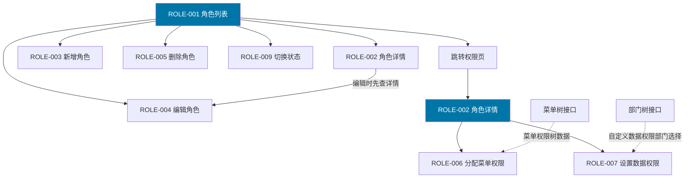
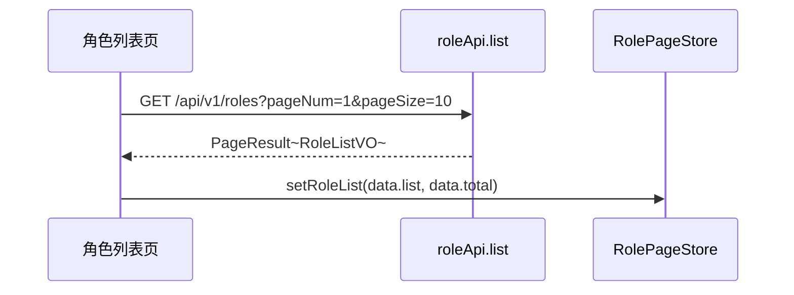
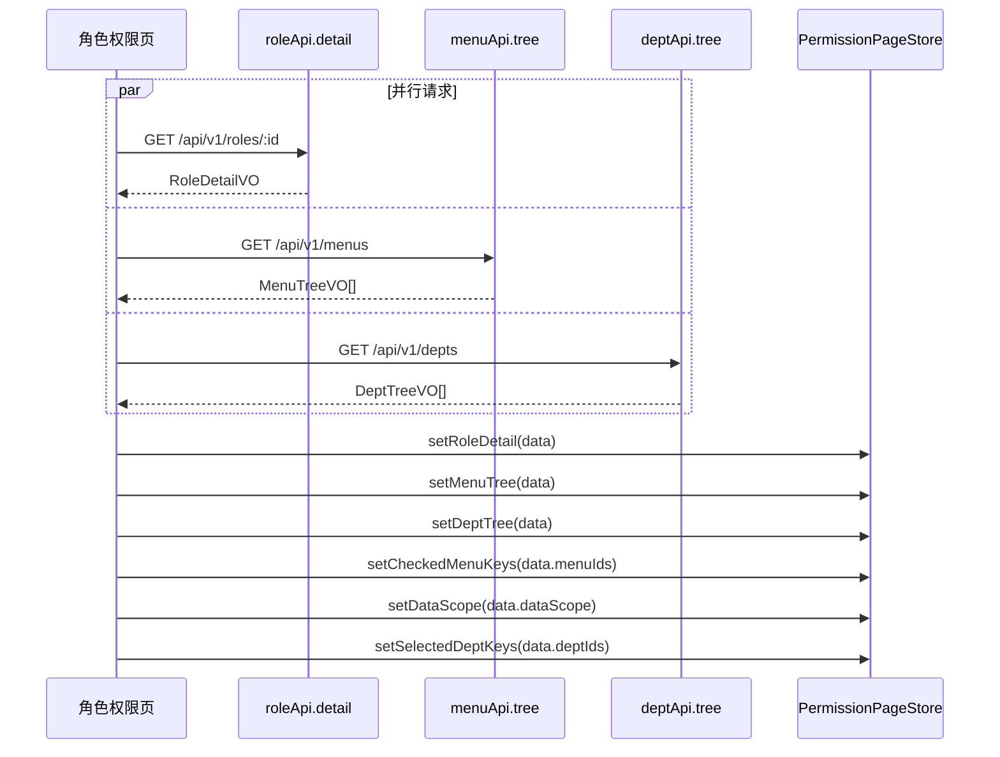
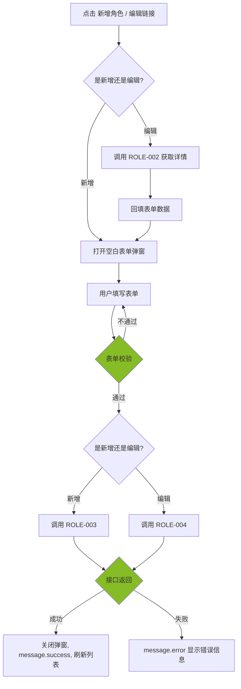
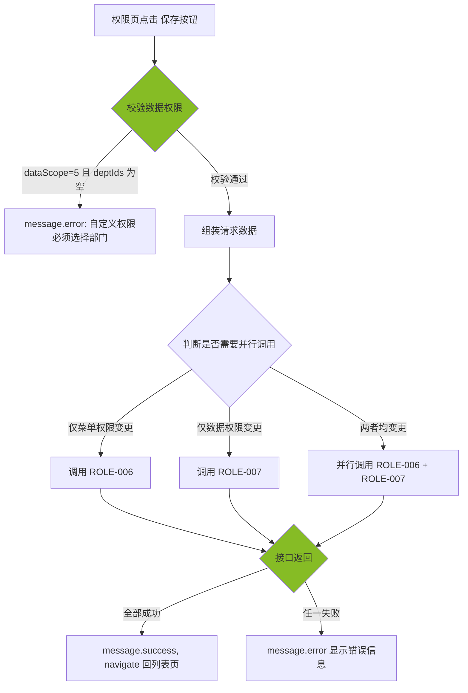
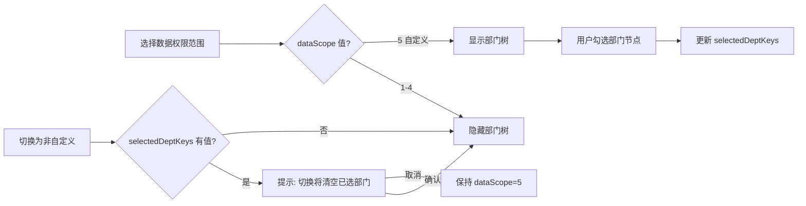
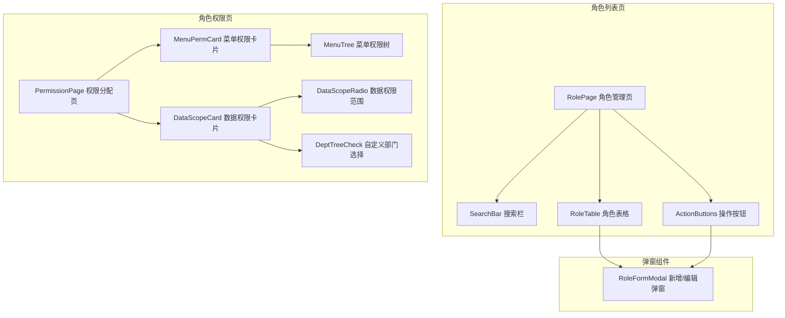

# 前端详细设计文档

## 文档信息

| 项目 | 内容 |
|------|------|
| 文档名称 | 角色管理 前端详细设计文档 |
| 对应后端模块 | 角色管理（模块标识：role） |
| 参考文档 | `doc/design/modules/rbac/modules/角色管理/后端详细设计.md` |
| 静态页面 | `static_fe/src/app/pages/Roles.tsx`、`static_fe/src/app/pages/RolePermissions.tsx` |
| 版本 | v1.1.0 |
| 创建日期 | 2026-04-11 |
| 最后更新 | 2026-09-03 |
| 负责人 | 前端开发（AI辅助） |

---

# 一、模块概述

## 1.1 模块功能描述

本模块前端实现**角色管理**功能，包含两个页面：

- **角色列表页**（`/system/roles`）：以表格展示租户内所有角色，支持按名称、编码、状态搜索筛选。提供新增、编辑、删除、状态切换、跳转权限分配等操作。
- **角色权限页**（`/system/roles/:id/permissions`）：为指定角色分配菜单权限（树形勾选）和数据权限（5 级范围选择 + 自定义部门多选）。是本模块最复杂的交互页面。

## 1.2 模块边界与职责

| 职责 | 说明 |
|------|------|
| **本模块负责** | 角色列表页（搜索 + 表格 + CRUD 弹窗）、角色权限页（菜单权限树 + 数据权限设置）、角色新增/编辑弹窗 |
| **其他模块负责** | 菜单树数据（菜单管理模块 API 提供）、部门树数据（部门管理模块 API 提供）、角色与用户关联（用户管理模块的"分配角色"操作）、操作日志记录（后端 AOP 自动） |

## 1.3 用户角色与权限

| 角色 | 可执行操作 | 对应权限标识 |
|------|----------|-------------|
| 平台超级管理员 | 所有操作 | system:role:* |
| 租户管理员 | 角色 CRUD、分配菜单权限、设置数据权限 | system:role:list / add / edit / remove / assignMenu / assignDataScope |

---

# 二、接口调用总览

## 2.1 接口引用说明

| 接口标识 | 接口名称 | HTTP方法 | 路径 | 主要用途 | 对应后端文档章节 |
|----------|----------|----------|------|----------|-----------------|
| ROLE-001 | 角色列表查询 | GET | /api/v1/roles | 角色列表页加载、搜索、翻页 | §7.2 API-001 |
| ROLE-002 | 角色详情 | GET | /api/v1/roles/{id} | 编辑弹窗回填、权限页初始化 | §7.2 API-002 |
| ROLE-003 | 新增角色 | POST | /api/v1/roles | 新增弹窗提交 | §7.2 API-003 |
| ROLE-004 | 编辑角色 | PUT | /api/v1/roles/{id} | 编辑弹窗提交 | §7.2 API-004 |
| ROLE-005 | 删除角色 | DELETE | /api/v1/roles/{id} | 列表删除操作 | §7.2 API-005 |
| ROLE-006 | 分配菜单权限 | PUT | /api/v1/roles/{id}/menus | 权限页保存菜单勾选 | §7.2 API-006 |
| ROLE-007 | 设置数据权限 | PUT | /api/v1/roles/{id}/data-scope | 权限页保存数据权限 | §7.2 API-007 |
| ROLE-008 | 查看关联用户 | GET | /api/v1/roles/{id}/users | 角色列表页查看关联用户数（可选） | §7.2 API-008 |
| ROLE-009 | 切换角色状态 | PUT | /api/v1/roles/{id}/status | 列表状态 Switch | §7.2 API-009 |

**跨模块接口依赖：**

| 接口 | 来源模块 | 用途 |
|------|---------|------|
| 菜单树查询 | 菜单管理 | 角色权限页加载菜单权限树 |
| 部门树查询 | 部门管理 | 角色权限页自定义数据权限选择部门 |

## 2.2 接口依赖关系



**说明**：ROLE-001 是角色列表页的核心接口。角色权限页初始化时调用 ROLE-002 获取角色详情（含已分配 menuIds 和 deptIds），同时调用菜单树接口获取完整菜单树。保存权限时可能同时调用 ROLE-006 和 ROLE-007。

---

# 三、页面详细设计

## 3.1 页面清单

| 页面名称 | 路由路径 | 页面功能描述 | 关联接口列表 |
|----------|----------|--------------|--------------|
| 角色列表页 | /system/roles | 角色搜索、表格展示、新增/编辑弹窗、删除、状态切换 | ROLE-001~005, ROLE-008~009 |
| 角色权限页 | /system/roles/:id/permissions | 菜单权限树勾选、数据权限范围设置、保存 | ROLE-002, ROLE-006, ROLE-007, 菜单树, 部门树 |

## 3.2 页面跳转关系


**说明**：角色管理通过侧边栏菜单「系统管理 > 角色管理」进入角色列表页。点击操作列的「权限」链接，跳转到角色权限页，URL 中携带角色 ID（`:id` 路由参数）。权限页点击「返回」按钮或保存成功后，跳转回角色列表页。

---

# 四、页面初始化流程设计

## 4.1 角色列表页初始化流程

### 4.1.1 接口调用序列

| 顺序 | 接口 | 并行/串行 | 说明 |
|------|------|----------|------|
| 1 | ROLE-001 角色列表 | — | 加载角色列表（默认第 1 页） |

> 角色列表页仅依赖 ROLE-001 接口，无需并行加载其他数据。

### 4.1.2 初始化时序图



### 4.1.3 初始化数据流

1. 接口返回 `PageResult<RoleListVO>` → `list` 渲染表格行，`total` 渲染分页器
2. 每行 `RoleListVO` 含 `userCount` 字段，直接在表格列中展示关联用户数
3. `status` 字段映射为 Switch 组件的 checked 状态
4. 角色名称列走 `makeRoleLabel(t)`（`i18nKey` + `roleName` 兜底），禁止直接渲染 `roleName`。见 i18n 前端详细设计 §6.3.2
5. 数据权限列用字典 `dict.sys_data_scope.{n}`，不读 `dataScopeName`（后端已不再下发）

## 4.2 角色权限页初始化流程

### 4.2.1 接口调用序列

| 顺序 | 接口 | 并行/串行 | 说明 |
|------|------|----------|------|
| 1a | ROLE-002 角色详情 | 并行 | 获取角色信息（含已分配的 menuIds 和 deptIds） |
| 1b | 菜单树查询 | 并行 | 加载完整菜单权限树 |
| 1c | 部门树查询 | 并行 | 加载部门树（自定义数据权限时使用） |

> 三个接口可并行加载，无依赖关系。全部返回后渲染页面。

### 4.2.2 初始化时序图



### 4.2.3 初始化数据流

1. 角色详情接口返回 `RoleDetailVO` → 用 `makeRoleLabel` 渲染页面标题（勿直接取 `roleName`），提取 `menuIds` 设置菜单权限树的已勾选状态，提取 `dataScope` 和 `deptIds` 设置数据权限表单初始值
2. 菜单树接口返回 `MenuTreeVO[]` → 转换为 Ant Design `Tree` 组件的 `treeData` 格式
3. 部门树接口返回 `DeptTreeVO[]` → 转换为 Ant Design `Tree` 组件的 `treeData` 格式（当 `dataScope === 5` 时显示并预选）

---

# 五、用户操作流程设计

## 5.1 操作-接口映射表

| 用户操作描述 | 触发组件 | 调用接口 | 请求参数构造 | 响应数据处理 | 异常处理 |
|-------------|---------|---------|-------------|-------------|---------|
| 点击搜索按钮 | 搜索按钮 | ROLE-001 | 从搜索表单收集 roleName, roleCode, status | 重置表格数据和分页 | message.error 提示 |
| 点击重置按钮 | 重置按钮 | — | 清空搜索表单，重置分页，重新调用 ROLE-001 | — | — |
| 点击新增角色 | 新增按钮 | ROLE-003 | 弹窗表单数据组装为 RoleCreateDTO | 关闭弹窗，刷新列表 | 表单校验失败阻止提交 |
| 点击编辑角色 | 编辑链接 | ROLE-002 -> ROLE-004 | 先调详情回填，提交时组装 RoleUpdateDTO | 关闭弹窗，刷新列表 | — |
| 点击删除角色 | 删除链接 | ROLE-005 | 取行记录 id | 刷新列表 | 二次确认后调用，有用户时提示禁止删除 |
| 点击切换状态 | 状态 Switch | ROLE-009 | 取行记录 id + 反转的 status 值 | 刷新列表 | Switch 回滚到原状态 |
| 点击权限链接 | 权限链接 | — | navigate 到权限页 | — | — |
| 菜单权限树勾选 | Tree(checkable) | — | 更新本地 checkedKeys 状态 | — | — |
| 点击全选菜单 | 全选按钮 | — | 收集所有菜单节点 key | — | — |
| 点击清空菜单 | 清空按钮 | — | 清空 checkedKeys | — | — |
| 切换数据权限范围 | Radio.Group | — | 更新本地 dataScope 状态，dataScope=5 时显示部门树 | — | — |
| 勾选自定义部门 | Tree(checkable) | — | 更新本地 selectedDeptKeys | — | — |
| 点击保存权限 | 保存按钮 | ROLE-006 + ROLE-007 | 收集 menuIds + dataScope + deptIds | 提示成功，跳转列表页 | 校验不通过阻止提交 |
| 点击返回 | 返回按钮 | — | navigate 回列表页 | — | — |

## 5.2 复杂操作流程

### 5.2.1 新增/编辑角色流程



### 5.2.2 角色权限保存流程



### 5.2.3 数据权限范围切换联动



**说明**：当数据权限范围从"自定义"切换为其他选项时，如已勾选了部门节点，需提示用户确认。切换后清空已选部门列表。

---

# 六、组件设计

## 6.1 组件结构图



## 6.2 组件清单

| 组件名称 | 组件类型 | 主要职责 | 直接调用接口 | 父组件 | 子组件 |
|----------|----------|----------|-------------|--------|--------|
| RolePage | 页面 | 角色列表页布局和状态管理 | ROLE-001 | App | SearchBar, RoleTable, ActionButtons, RoleFormModal |
| SearchBar | 业务组件 | 角色搜索表单（名称、编码、状态） | — | RolePage | — |
| RoleTable | 业务组件 | 角色列表表格（分页、操作列） | — | RolePage | — |
| ActionButtons | UI 组件 | 新增角色按钮 | — | RolePage | — |
| RoleFormModal | 业务组件 | 新增/编辑角色弹窗 | ROLE-002, ROLE-003, ROLE-004 | RolePage | — |
| PermissionPage | 页面 | 权限分配页布局和状态管理 | ROLE-002, ROLE-006, ROLE-007, 菜单树, 部门树 | App | MenuPermCard, DataScopeCard |
| MenuPermCard | 业务组件 | 菜单权限树展示和勾选 | — | PermissionPage | MenuTree |
| MenuTree | 业务组件 | 菜单权限树（可勾选、全选、清空） | — | MenuPermCard | — |
| DataScopeCard | 业务组件 | 数据权限范围设置 | — | PermissionPage | DataScopeRadio, DeptTreeCheck |
| DataScopeRadio | UI 组件 | 数据权限 5 级范围选择 | — | DataScopeCard | — |
| DeptTreeCheck | 业务组件 | 自定义部门树多选 | — | DataScopeCard | — |

## 6.3 关键组件详细设计

### 6.3.1 RoleFormModal 组件

- **接口调用设计**：
  - 编辑模式：打开时调用 `ROLE-002` 获取详情，回填表单
  - 提交时：新增调用 `ROLE-003`，编辑调用 `ROLE-004`
- **Props 设计**：

| Prop | 类型 | 说明 |
|------|------|------|
| open | boolean | 弹窗显隐 |
| roleId | number \| null | null 为新增模式，有值为编辑模式 |
| onSuccess | () => void | 操作成功回调 |

- **表单字段**：

| 字段 | 组件 | 必填 | 校验规则 | 编辑模式 |
|------|------|------|---------|---------|
| roleCode | Input | 是 | 2-50 字符，字母开头，仅字母数字下划线 | 禁用（不可修改） |
| roleName | Input | 是 | 2-50 字符 | 可编辑。表单编辑的是库字段（C 类录入）。内置角色 ADMIN/USER 改名后界面仍显示语言包译文，本增量不锁输入框，见 i18n 前端详细设计 §6.3.2 |
| dataScope | Select | 否 | 默认 1（全部数据） | 可编辑 |
| sort | InputNumber | 是 | 0-999，默认 0 | 可编辑 |
| status | Switch | 否 | 默认启用 | 可编辑 |
| remark | TextArea | 否 | 最长 500 字 | 可编辑 |

- **状态管理**：`loading: boolean` — 提交中状态

### 6.3.2 PermissionPage 组件

- **接口调用设计**：
  - 初始化时并行调用 `ROLE-002`（获取角色详情 + 已分配权限）、菜单树接口、部门树接口
  - 保存时调用 `ROLE-006` 和/或 `ROLE-007`
- **路由参数**：通过 React Router 的 `useParams()` 获取 `:id` 参数
- **状态管理**：

| 状态 | 类型 | 说明 |
|------|------|------|
| roleDetail | RoleDetailVO \| null | 角色详情（含已有权限） |
| menuTree | MenuTreeNode[] | 菜单权限树数据 |
| checkedMenuKeys | Key[] | 菜单权限树已勾选的 key 列表 |
| halfCheckedKeys | Key[] | 菜单权限树半选状态的 key 列表 |
| dataScope | number | 当前选中的数据权限范围（1-5） |
| deptTree | DeptTreeNode[] | 部门树数据 |
| selectedDeptKeys | Key[] | 自定义部门已勾选的 key 列表 |
| loading | boolean | 保存中状态 |
| initLoading | boolean | 初始化加载状态 |

### 6.3.3 MenuTree 组件

- **接口调用设计**：不直接调用接口，数据由父组件传入
- **Props 设计**：

| Prop | 类型 | 说明 |
|------|------|------|
| treeData | MenuTreeNode[] | 菜单树数据 |
| checkedKeys | Key[] | 已勾选的菜单 key |
| onCheck | (checkedKeys: Key[], halfCheckedKeys: Key[]) => void | 勾选变更回调 |
| loading | boolean | 加载状态 |

- **交互设计**：
  - 使用 Ant Design `Tree` 组件，设置 `checkable`、`defaultExpandAll`
  - 顶部提供「全选」「清空」快捷操作按钮
  - `checkStrictly = false`（默认），父子节点联动：勾选父节点自动选中所有子节点
  - `onCheck` 回调中同时传出 `checkedKeys`（完全选中的节点）和 `halfCheckedKeys`（半选的父节点），提交时需合并两者作为 `menuIds`

- **菜单树节点数据结构**：

```typescript
interface MenuTreeNode {
  key: number;          // 菜单 ID
  title: string;        // 菜单名称
  children?: MenuTreeNode[];
  // 扩展属性
  type: number;         // 菜单类型（1=目录 2=菜单 3=按钮）
  permission?: string;  // 权限标识
}
```

### 6.3.4 DataScopeCard 组件

- **接口调用设计**：不直接调用接口，数据由父组件传入
- **Props 设计**：

| Prop | 类型 | 说明 |
|------|------|------|
| value | number | 当前数据权限范围（1-5） |
| onChange | (dataScope: number) => void | 范围变更回调 |
| deptTree | DeptTreeNode[] | 部门树数据 |
| selectedDeptKeys | Key[] | 已勾选的部门 key |
| onDeptCheck | (selectedDeptKeys: Key[]) => void | 部门勾选变更回调 |
| loading | boolean | 加载状态 |

- **Radio.Group 选项**：

| 值 | 标签 | 说明 |
|----|------|------|
| 1 | 全部数据 | 可查看所有数据 |
| 2 | 本部门及子部门数据 | 可查看所属部门及下级部门数据 |
| 3 | 本部门数据 | 仅可查看所属部门数据 |
| 4 | 仅本人数据 | 仅可查看自己创建/负责的数据 |
| 5 | 自定义 | 指定可访问的部门列表 |

- **联动逻辑**：选择"自定义"(5) 时，下方展示 `DeptTreeCheck` 组件；选择其他选项时，隐藏部门树。

### 6.3.5 DeptTreeCheck 组件

- **接口调用设计**：不直接调用接口，数据由父组件传入
- **Props 设计**：

| Prop | 类型 | 说明 |
|------|------|------|
| treeData | DeptTreeNode[] | 部门树数据 |
| checkedKeys | Key[] | 已勾选的部门 key |
| onCheck | (checkedKeys: Key[]) => void | 勾选变更回调 |

- **交互设计**：使用 Ant Design `Tree` 组件，设置 `checkable`、`defaultExpandAll`，`checkStrictly = false` 实现父子联动。

---

# 七、数据转换设计

## 7.1 请求数据构造

### 7.1.1 数据转换规则

| 接口 | 前端表单字段 | 接口请求字段 | 转换规则 |
|------|------------|------------|---------|
| ROLE-001 | 搜索表单 + 分页 | pageNum, pageSize, roleName, roleCode, status | 直接映射，空值不传 |
| ROLE-003 | 新增表单 | RoleCreateDTO | 直接映射，dataScope 默认 1 |
| ROLE-004 | 编辑表单 | RoleUpdateDTO | 直接映射，不含 roleCode |
| ROLE-006 | 菜单权限树 | menuIds: number[] | checkedKeys + halfCheckedKeys 合并去重 |
| ROLE-007 | 数据权限表单 | dataScope + deptIds | dataScope 直接映射，dataScope=5 时传 deptIds，否则传空数组 |
| ROLE-009 | 状态值 | status | Switch 的 checked -> 1/0 映射 |

### 7.1.2 转换函数设计

```
// 状态 Switch 转换
statusToApi(checked: boolean): number -> checked ? 1 : 0

// 搜索参数构造（过滤空值）
buildRoleQuery(formValues, pagination): RoleQueryDTO -> 移除 null/undefined 字段

// 新增表单数据组装
buildCreatePayload(formValues): RoleCreateDTO -> 直接映射

// 编辑表单数据组装
buildUpdatePayload(formValues): RoleUpdateDTO -> 移除 roleCode

// 菜单权限 ID 列表构造（合并全选 + 半选节点）
buildMenuIds(checkedKeys: Key[], halfCheckedKeys: Key[]): number[] ->
  [...checkedKeys, ...halfCheckedKeys] 去重转为 number[]

// 数据权限请求构造
buildDataScopePayload(dataScope: number, deptKeys: Key[]): RoleDataScopeDTO ->
  dataScope=5 时传 deptKeys，否则 deptIds 传空数组

// 菜单树数据转换（后端 MenuTreeVO -> 前端 TreeNode）
transformMenuTree(menuList: MenuTreeVO[]): MenuTreeNode[] ->
  递归转换 { key: id, title: name, children, type, permission }

// 部门树数据转换（后端 DeptTreeVO -> 前端 TreeNode）
transformDeptTree(deptList: DeptTreeVO[]): DeptTreeNode[] ->
  递归转换 { key: id, title: name, children }
```

## 7.2 响应数据处理

### 7.2.1 数据解析规则

| 接口 | 响应结构 | 解析规则 |
|------|---------|---------|
| ROLE-001 | `PageResult<RoleListVO>` | list -> 表格 dataSource；total -> 分页 total |
| ROLE-002 | `RoleDetailVO` | 整体存入状态；menuIds -> 菜单树 checkedKeys；deptIds -> 部门树 checkedKeys；dataScope -> 数据权限表单初始值 |
| ROLE-003/004 | `RoleVO` | 不需要解析，操作成功后刷新列表 |
| ROLE-006/007 | void | 不需要解析，操作成功后跳转列表页 |
| 菜单树 | `MenuTreeVO[]` | transformMenuTree 转换为 Tree 组件数据源 |
| 部门树 | `DeptTreeVO[]` | transformDeptTree 转换为 Tree 组件数据源 |

### 7.2.2 数据格式化

```
// 数据权限范围名称映射
dataScopeMap: Record<number, string> -> {
  1: '全部数据',
  2: '本部门及子部门',
  3: '本部门',
  4: '仅本人',
  5: '自定义'
}

// 状态 Tag 颜色
statusColor(status: number): string -> status === 1 ? 'success' : 'error'

// 角色类型展示
roleTypeTag(roleCode: string): string ->
  roleCode 为 ADMIN 或 USER ? '系统内置' : '自定义'

// 时间格式化
formatTime(datetime: string): string -> "2026-04-11 10:30:00"
```

---

# 八、状态管理设计

## 8.1 页面状态设计（角色列表页）

```typescript
interface RolePageState {
  // 角色列表
  roleList: RoleListVO[];
  total: number;
  pageNum: number;
  pageSize: number;
  loading: boolean;

  // 搜索条件
  searchParams: {
    roleName?: string;
    roleCode?: string;
    status?: number;
  };

  // 弹窗状态
  formModalOpen: boolean;
  editingRoleId: number | null;
}
```

## 8.2 页面状态设计（角色权限页）

```typescript
interface PermissionPageState {
  // 初始化加载
  initLoading: boolean;
  saving: boolean;

  // 角色详情
  roleDetail: RoleDetailVO | null;

  // 菜单权限
  menuTree: MenuTreeNode[];
  checkedMenuKeys: React.Key[];
  halfCheckedMenuKeys: React.Key[];

  // 数据权限
  dataScope: number;
  deptTree: DeptTreeNode[];
  selectedDeptKeys: React.Key[];
}
```

## 8.3 组件状态设计

| 组件 | 内部状态 | 说明 |
|------|---------|------|
| SearchBar | 表单值 | 由 Ant Design Form 管理 |
| RoleFormModal | 表单值、loading、确认加载 | 由 Ant Design Form 管理 |
| MenuTree | 无内部状态 | checkedKeys 由父组件控制（受控模式） |
| DeptTreeCheck | 无内部状态 | checkedKeys 由父组件控制（受控模式） |
| DataScopeCard | 无内部状态 | dataScope 和 deptKeys 由父组件控制（受控模式） |

---

# 九、模块安全规范

## 9.1 认证与授权

### 9.1.1 权限控制

| 页面/组件 | 权限标识 | 无权限处理 |
|-----------|---------|-----------|
| 角色管理菜单 | system:role:list | 菜单不显示 |
| 新增角色按钮 | system:role:add | 隐藏按钮 |
| 编辑操作链接 | system:role:edit | 隐藏链接 |
| 删除操作链接 | system:role:remove | 隐藏链接 |
| 权限分配链接 | system:role:assignMenu | 隐藏链接 |
| 数据权限设置 | system:role:assignDataScope | 权限页不展示数据权限卡片 |
| 角色权限页（整体） | system:role:list | 路由守卫拦截，无权限跳转 403 |
| 角色状态切换 | system:role:edit | Switch 组件禁用 |

**权限判断方式**：使用 `hasPermission(perm)` 函数，从 UserStore.permissions 数组中查找匹配。按钮级权限通过条件渲染控制。

## 9.2 安全检查清单

- [x] 所有页面路由需要登录才能访问（路由守卫）
- [x] 按钮级权限通过权限标识控制显隐
- [x] 角色编码编辑模式下不可修改（前端禁用 + 后端忽略）
- [x] 删除操作需二次确认
- [x] 有用户的角色禁止删除（后端校验，前端提示）
- [x] 内置角色（ADMIN/USER）禁止删除（后端校验）
- [x] 自定义数据权限必须选择部门（前端校验 + 后端校验）

---

# 十、错误处理设计

## 10.1 接口调用错误处理

### 10.1.1 错误分类与处理

| 错误类型 | HTTP 状态码 | 业务错误码 | 处理策略 |
|---------|-----------|----------|---------|
| 未登录 | 401 | 30001 | 清除 Store，跳转 /login |
| 无权限 | 403 | 30003 | message.error('无操作权限') |
| 参数校验失败 | 200 | 10002 | message.error(具体字段错误) |
| 角色编码已存在 | 200 | 20005 | message.error('角色编码已存在') |
| 角色下存在用户 | 200 | 20006 | message.error('角色下存在用户，禁止删除') |
| 角色不存在 | 200 | 20015 | message.error('角色不存在') |
| 自定义权限部门为空 | 200 | 10002 | message.error('自定义数据权限必须选择部门') |
| 网络异常 | — | — | message.error('网络异常，请稍后重试') |
| 服务器错误 | 500 | — | message.error('服务器异常') |

### 10.1.2 重试机制

| 接口 | 是否重试 | 重试策略 |
|------|---------|---------|
| ROLE-001 列表查询 | 是 | TanStack Query 自动重试 1 次 |
| ROLE-002 角色详情 | 是 | TanStack Query 自动重试 1 次 |
| 菜单树/部门树 | 是 | TanStack Query 自动重试 1 次 |
| 其他写操作 | 否 | 直接展示错误 |

## 10.2 用户操作错误处理

| 场景 | 处理方案 |
|------|---------|
| 表单校验失败 | Ant Design Form 内联红色提示 |
| 新增角色编码重复 | message.error 提示，表单不关闭 |
| 删除有用户的角色 | message.error('角色下存在用户，禁止删除') |
| 删除内置角色 | message.error('系统内置角色不可删除') |
| 自定义数据权限未选部门 | message.error 提示，阻止保存 |
| 网络断开 | 全局 Axios 拦截器 message.error |
| 权限页角色 ID 无效 | 检测详情接口 404，message.error 并跳转回列表页 |

---

# 十一、性能优化设计

## 11.1 接口调用优化

### 11.1.1 接口合并

角色权限页初始化时三个接口（角色详情 + 菜单树 + 部门树）并行请求，使用 `Promise.all` 合并等待。保存时如需同时调用 ROLE-006 和 ROLE-007，同样并行调用。

### 11.1.2 接口缓存

| 接口 | 缓存策略 | 缓存时间 |
|------|---------|---------|
| ROLE-001 角色列表 | 不缓存 | 每次搜索/翻页重新请求 |
| 菜单树 | TanStack Query staleTime 10min | 10 分钟内不重复请求 |
| 部门树 | TanStack Query staleTime 10min | 10 分钟内不重复请求 |

## 11.2 组件渲染优化

| 优化项 | 策略 |
|-------|------|
| 菜单权限树大数据量 | 使用 Ant Design Tree 虚拟滚动（超 200 个节点时） |
| 弹窗懒渲染 | `destroyOnClose: true`，关闭时销毁表单状态 |
| 权限页组件按条件渲染 | dataScope !== 5 时不渲染 DeptTreeCheck 组件 |
| 搜索防抖 | 角色名称输入 300ms 防抖（如有即时搜索需求） |

---

# 十二、测试设计

## 12.1 接口调用测试

### 12.1.1 正常流程测试

| 测试场景 | 前置条件 | 操作步骤 | 预期结果 |
|---------|---------|---------|---------|
| 角色列表加载 | 已有角色数据 | 进入角色管理页 | 表格显示角色数据，含角色编码、名称、状态、关联用户数 |
| 搜索角色 | 角色列表已加载 | 输入角色名称，点击搜索 | 列表刷新，仅显示匹配角色 |
| 新增角色 | — | 填写角色编码和名称，点击确定 | 弹窗关闭，列表刷新，新角色出现 |
| 编辑角色 | 角色存在 | 点击编辑，修改角色名称，确定 | 弹窗关闭，列表刷新，名称已更新 |
| 删除角色（无用户） | 角色无关联用户 | 点击删除，确认 | 列表刷新，角色消失 |
| 切换状态 | 角色为启用 | 点击 Switch | 状态切换为禁用，列表刷新 |
| 跳转权限页 | 角色存在 | 点击权限链接 | 跳转到权限页，显示角色名称 |
| 权限页初始化 | 角色已有权限 | 进入权限页 | 菜单权限树已勾选对应节点，数据权限范围正确显示 |
| 菜单权限勾选 | 权限页已加载 | 勾选/取消菜单节点 | 勾选状态实时更新 |
| 全选/清空菜单 | 权限页已加载 | 点击全选/清空按钮 | 所有节点选中/清空 |
| 设置自定义数据权限 | 权限页已加载 | 选择"自定义"，勾选部门 | 部门树显示，已选部门高亮 |
| 保存权限 | 权限页已填写 | 点击保存 | 提示成功，跳转回列表页 |
| 返回列表页 | 权限页已打开 | 点击返回 | 跳转回角色列表页 |

### 12.1.2 异常流程测试

| 测试场景 | 前置条件 | 操作步骤 | 预期结果 |
|---------|---------|---------|---------|
| 新增重复编码角色 | 角色编码已存在 | 输入已存在的角色编码 | message.error('角色编码已存在') |
| 删除有用户的角色 | 角色下有用户 | 点击删除 | message.error('角色下存在用户，禁止删除') |
| 删除内置角色 | 角色 code 为 ADMIN | 点击删除 | message.error('系统内置角色不可删除') |
| 自定义权限未选部门 | 权限页选择自定义 | 不选部门，点击保存 | message.error 提示，阻止提交 |
| 无效角色 ID 访问权限页 | — | 手动输入不存在的角色 ID | 详情接口报错，提示并跳转回列表页 |
| Token 过期 | — | 操作任意接口 | 自动跳转登录页 |
| 网络断开 | — | 操作任意接口 | message.error 网络异常提示 |

---

# 附录

## A. 接口详细说明

### A.1 ROLE-001 角色列表查询

- **调用时机**：页面初始化、搜索、翻页
- **请求参数**：`{ pageNum, pageSize, roleName?, roleCode?, status? }`
- **响应处理**：list -> 表格数据源；total -> 分页总数
- **错误处理**：message.error 提示

### A.2 ROLE-002 角色详情

- **调用时机**：编辑弹窗打开、权限页初始化
- **请求参数**：路径参数 `id`
- **响应处理**：编辑模式回填表单；权限页提取 menuIds、dataScope、deptIds
- **错误处理**：404 时 message.error 并跳转回列表页

### A.3 ROLE-003 新增角色

- **调用时机**：新增弹窗提交
- **请求参数**：RoleCreateDTO（roleCode, roleName, dataScope, sort, status, remark）
- **响应处理**：关闭弹窗 -> message.success -> 刷新列表
- **错误处理**：编码重复 message.error；通用错误 message.error

### A.4 ROLE-004 编辑角色

- **调用时机**：编辑弹窗提交
- **请求参数**：RoleUpdateDTO（roleName, dataScope, sort, status, remark，不含 roleCode）
- **响应处理**：同 ROLE-003
- **错误处理**：同 ROLE-003

### A.5 ROLE-006 分配菜单权限

- **调用时机**：权限页保存按钮
- **请求参数**：`{ menuIds: number[] }`（checkedKeys + halfCheckedKeys 合并）
- **响应处理**：保存成功后（如同时调用了 ROLE-007 则等待全部完成）message.success 并跳转回列表页
- **错误处理**：message.error 提示

### A.6 ROLE-007 设置数据权限

- **调用时机**：权限页保存按钮
- **请求参数**：`{ dataScope: number, deptIds: number[] }`
- **响应处理**：同 ROLE-006
- **错误处理**：dataScope=5 且 deptIds 为空时后端返回参数校验失败

### A.7 ROLE-009 切换角色状态

- **调用时机**：列表页 Switch 组件点击
- **请求参数**：`{ status: number }` (0 或 1)
- **响应处理**：刷新列表
- **错误处理**：Switch 回滚到原状态，message.error 提示

## B. 变更记录

| 版本 | 日期 | 修改人 | 变更描述 | 变更原因 | 评审人 |
|------|------|--------|---------|---------|--------|
| v1.0.0 | 2026-04-11 | 前端开发（AI） | 初始版本 | 角色管理前端详细设计 | 待评审 |
| v1.1.0 | 2026-09-03 | 技术经理（AI辅助） | 列表/权限页标题走 `makeRoleLabel`；数据权限列改字典 i18n | 对齐 i18n 内置角色名增量 | 待评审 |
