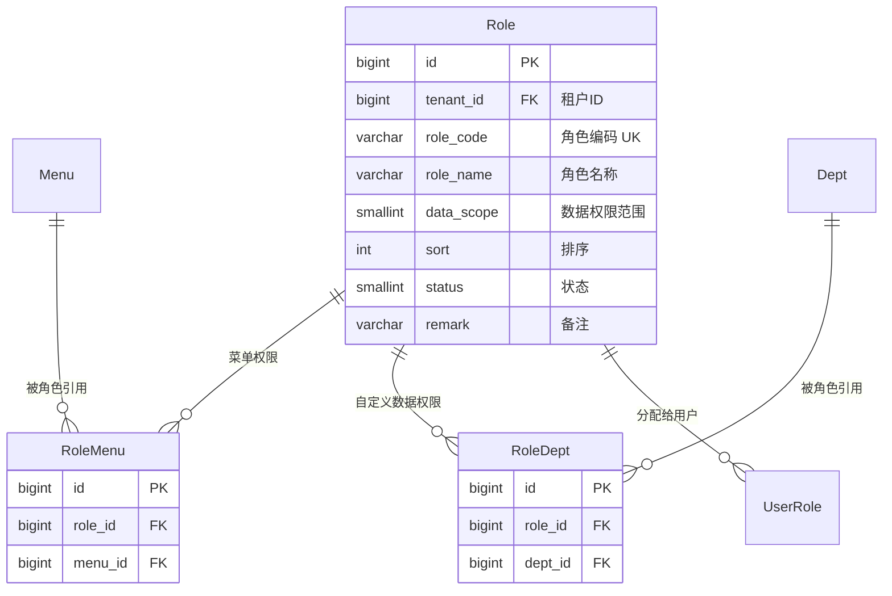
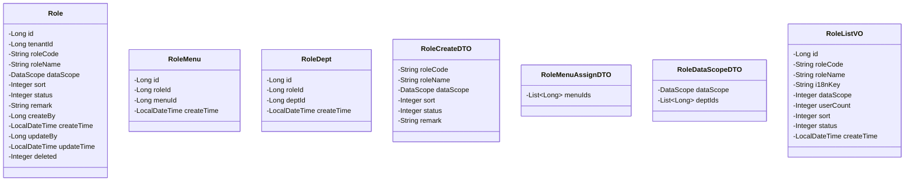
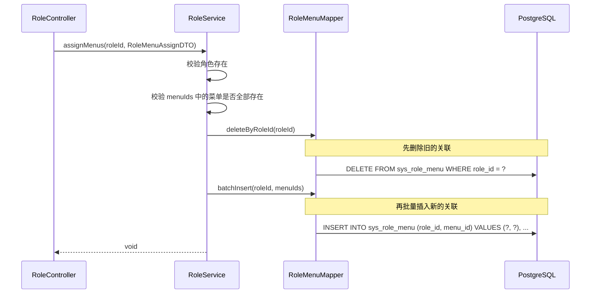
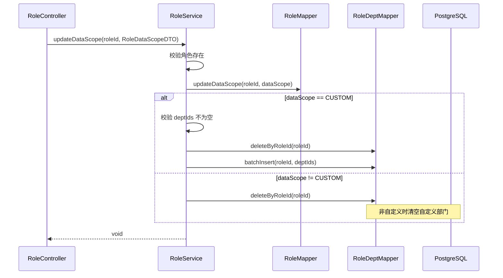
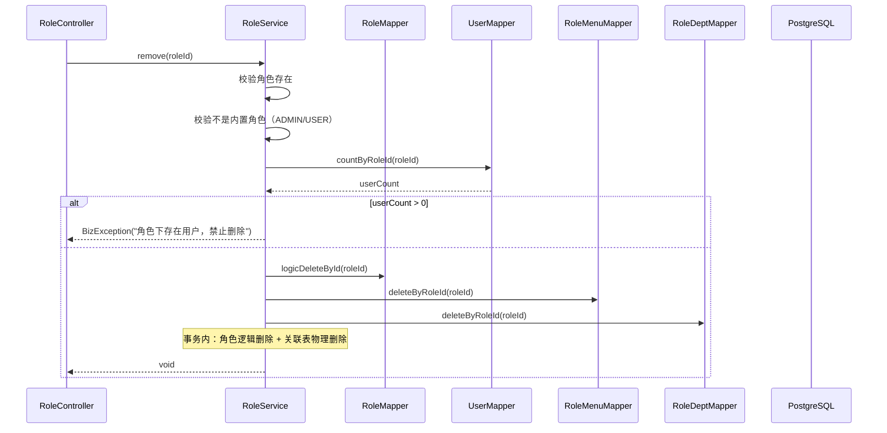
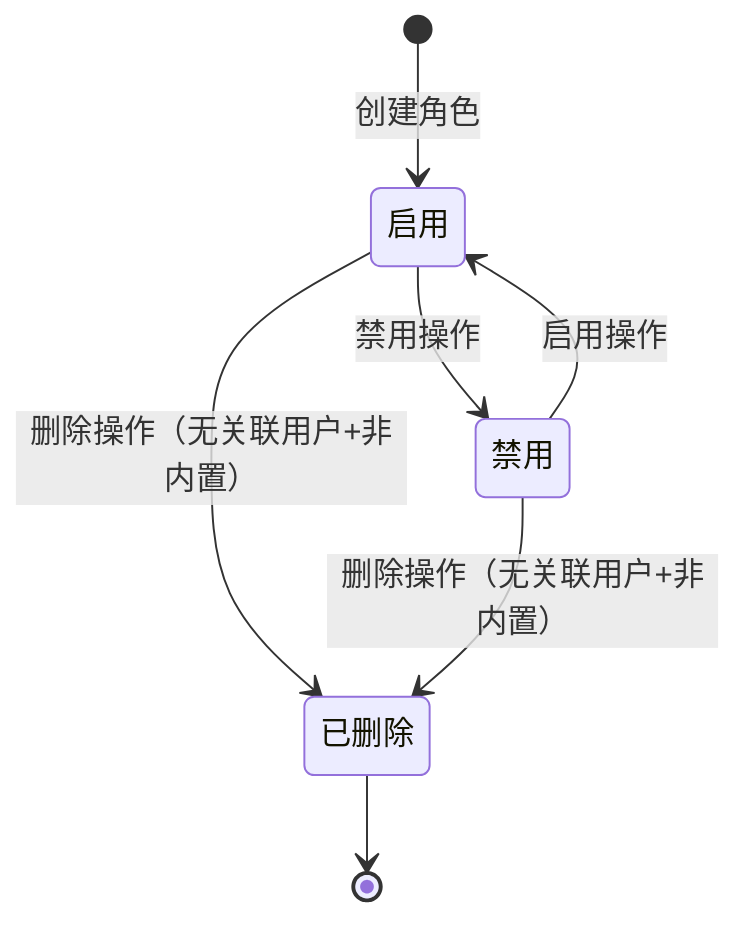
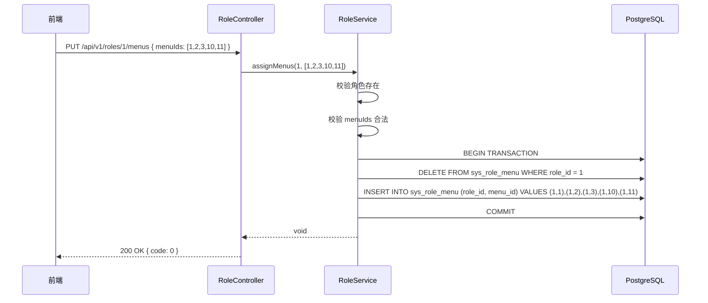
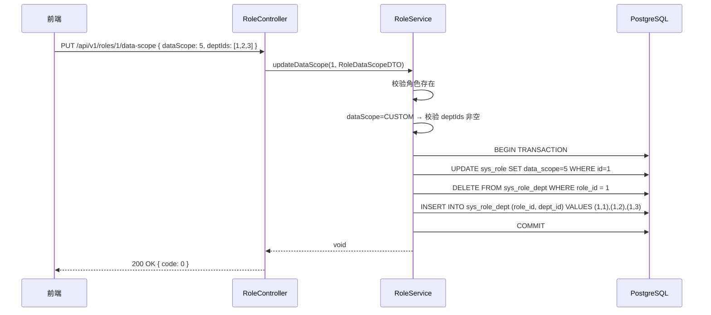

> **⚠️ 部分内容已过期（2026-09-01）**：本仓库已拿掉多租户机制，本文中所有 `tenant_id`
> 字段、租户级唯一索引（`tenant_id + role_code + deleted` 等）、「租户管理员/平台超级
> 管理员」权限层级描述均已不适用（`tenant_id` 列已删除，`ADMIN` 现为唯一角色）。
> 角色管理本身的字段/接口/流程设计仍然有效，仅去掉 `tenant_id` 维度。
> 原因见 `doc/design/modules/core/去多租户化-概要设计.md`。

# 程序详细设计文档

> **定位**
> - 数据库驱动设计
> - 分层思想
> - 前后端无代码协同
> - AI 分阶段稳定交付

------

## 文档信息

| 项目 | 内容 |
|------|------|
| 模块名称 | 角色管理 |
| 模块标识 | role |
| 所属系统 | RBAC 权限模块 |
| 文档版本 | v1.1.0 |
| 设计负责人 | 后端开发（AI辅助） |
| 最后更新时间 | 2026-09-03 |

适用对象：
- 后端开发
- 前端开发
- 测试人员
- AI 编程

------

# 一、数据库设计

> ⚠️ 数据库是系统"真实状态"的最终承载
> 所有代码都必须服务于本章设计

------

## 1.1 表清单与业务职责

| 表名 | 业务含义 | 主键 | 是否核心表 | 说明 |
|------|---------|------|-----------|------|
| sys_role | 角色表 | id (BIGINT) | 是 | 租户级数据，存储角色定义和数据权限范围 |
| sys_role_menu | 角色菜单关联表 | id (BIGINT) | 是 | 全局关联表，角色分配菜单权限 |
| sys_role_dept | 角色部门关联表 | id (BIGINT) | 否 | 全局关联表，自定义数据权限时存储部门列表 |

------

## 1.2 表关系设计（ER 图）



**流程说明**：

1. 角色通过 `sys_role_menu` 关联菜单，实现菜单权限和按钮权限控制
2. 角色的 `data_scope` 字段定义数据权限范围，当值为 5（自定义）时，通过 `sys_role_dept` 存储自定义部门列表
3. 角色通过 `sys_user_role`（用户模块管理）分配给用户

**关键点**：

- sys_role 含 `tenant_id`，受租户拦截器隔离
- sys_role_menu 和 sys_role_dept 为全局关联表（无 tenant_id），但通过 role_id 间接属于租户
- 角色编码 `role_code` 在租户内唯一

------

## 1.3 表结构设计（字段级，逐字段）

### 表：sys_role

| 字段 | 类型 | 必填 | 描述 | 业务含义 | 设计说明 |
|------|------|------|------|---------|---------|
| id | BIGINT | 是 | 主键 | 角色ID | 雪花算法生成 |
| tenant_id | BIGINT | 是 | 租户ID | 数据隔离 | 拦截器自动填充 |
| role_code | VARCHAR(50) | 是 | 角色编码 | 唯一标识 | 2-50字符，字母开头，创建后不可修改。联合唯一索引 `tenant_id + role_code + deleted` |
| role_name | VARCHAR(50) | 是 | 角色名称 | 显示名称 | 2-50 字符 |
| data_scope | SMALLINT | 是 | 数据权限范围 | 行级过滤 | 1=全部，2=本部门及子部门，3=本部门，4=仅本人，5=自定义。默认 1 |
| sort | INT | 是 | 显示排序 | 排序权重 | 值越小越靠前，默认 0 |
| status | SMALLINT | 是 | 状态 | 启用/禁用 | 0=禁用，1=启用。默认 1 |
| remark | VARCHAR(500) | 否 | 备注 | 备注信息 | - |
| create_time | TIMESTAMP | 是 | 创建时间 | 审计字段 | 自动填充 |
| update_time | TIMESTAMP | 是 | 更新时间 | 审计字段 | 自动更新 |
| deleted | SMALLINT | 是 | 逻辑删除 | 删除标识 | 0=正常，1=已删除。默认 0 |
| create_by | BIGINT | 否 | 创建人 | 审计字段 | - |
| update_by | BIGINT | 否 | 更新人 | 审计字段 | - |

### 表：sys_role_menu

| 字段 | 类型 | 必填 | 描述 | 业务含义 | 设计说明 |
|------|------|------|------|---------|---------|
| id | BIGINT | 是 | 主键 | - | 雪花算法 |
| role_id | BIGINT | 是 | 角色ID | 关联角色 | - |
| menu_id | BIGINT | 是 | 菜单ID | 关联菜单 | - |
| create_time | TIMESTAMP | 是 | 创建时间 | 审计字段 | - |

### 表：sys_role_dept

| 字段 | 类型 | 必填 | 描述 | 业务含义 | 设计说明 |
|------|------|------|------|---------|---------|
| id | BIGINT | 是 | 主键 | - | 雪花算法 |
| role_id | BIGINT | 是 | 角色ID | 关联角色 | - |
| dept_id | BIGINT | 是 | 部门ID | 关联部门 | 仅 data_scope=5 时使用 |
| create_time | TIMESTAMP | 是 | 创建时间 | 审计字段 | - |

------

## 1.4 反范式设计

本模块无反范式设计。data_scope 为角色自身属性，user_count 为关联查询统计。

------

## 1.5 索引与约束设计

**唯一索引：**
- `uk_role_tenant_code ON sys_role(tenant_id, role_code, deleted)` — 租户内角色编码唯一

**普通索引：**
- `idx_role_tenant_status ON sys_role(tenant_id, status) WHERE deleted = 0` — 按状态查询
- `idx_role_menu_role ON sys_role_menu(role_id)` — 按角色查菜单
- `idx_role_menu_menu ON sys_role_menu(menu_id)` — 按菜单查角色（菜单删除时清理）
- `idx_role_dept_role ON sys_role_dept(role_id)` — 按角色查部门
- `idx_role_dept_dept ON sys_role_dept(dept_id)` — 按部门查角色

------

# 二、模块目标与边界

**模块解决的业务问题：**
管理 RBAC 中的角色定义，支持角色 CRUD、菜单权限分配（三级树勾选）、数据权限设置（5 级范围 + 自定义部门）。

**模块不解决的问题：**
- 角色与用户的关联（用户管理模块的"分配角色"操作）
- 菜单树的构建和查询（菜单管理模块提供）
- 部门树的构建和查询（部门管理模块提供）
- 前端路由动态渲染（前端根据 API 返回数据生成）

**是否核心链路：** 是。角色是 RBAC 权限模型的桥梁。

**跨模块协作说明：**
- 用户管理模块在分配角色（UserService.assignRoles）时，需校验 roleIds 中的角色是否全部存在。角色管理模块的 RoleService 应提供 `existsByIds(List<Long> roleIds)` 方法供跨模块调用，确保 roleIds 中的每个角色 ID 在当前租户下存在且未删除。

------

## 2.1 模块边界图

```mermaid
flowchart TD
    subgraph 角色管理模块
        A[RoleController]
        B[RoleService]
        C[RoleMapper]
        D[RoleMenuMapper]
        E[RoleDeptMapper]
    end

    subgraph 菜单管理模块
        F[MenuService]
    end

    subgraph 部门管理模块
        G[DeptService]
    end

    subgraph 用户管理模块
        H[UserMapper]
    end

    subgraph 公共基础设施
        I[TenantInterceptor]
        J[DataScopeInterceptor]
        K[@Log]
    end

    A --> B
    B --> C
    B --> D
    B --> E

    B -->|查询菜单树（权限分配）| F
    B -->|查询部门树（自定义数据权限）| G
    B -->|统计关联用户数| H

    J -->|运行时读取角色数据权限| B

    A --> I
    A --> K
```

------

# 三、整体架构设计

> ⚠️ 明确声明：**本项目不采用 DDD**

------

## 3.1 分层结构定义

```
com.gentry.rbac.role/
├── controller/
│   └── RoleController
├── service/
│   ├── RoleService
│   └── impl/
│       └── RoleServiceImpl
├── mapper/
│   ├── RoleMapper
│   ├── RoleMenuMapper
│   └── RoleDeptMapper
├── entity/
│   ├── Role
│   ├── RoleMenu
│   └── RoleDept
├── dto/
│   ├── RoleCreateDTO
│   ├── RoleUpdateDTO
│   ├── RoleQueryDTO
│   ├── RoleMenuAssignDTO
│   └── RoleDataScopeDTO
├── vo/
│   ├── RoleVO
│   ├── RoleListVO
│   └── RoleDetailVO
└── enums/
    └── DataScope
```

### 命名规范

| 数据库表名 | Entity 类名 | Service 接口名 | Controller 类名 |
|-----------|------------|---------------|----------------|
| sys_role | Role | RoleService | RoleController |
| sys_role_menu | RoleMenu | — | — |
| sys_role_dept | RoleDept | — | — |

------

## 3.2 枚举设计规范（强制）

| 枚举类 | 枚举值 | code | description |
|--------|--------|------|-------------|
| DataScope | 全部数据 | ALL | 可查看所有数据 |
| DataScope | 本部门及子部门数据 | DEPT_AND_CHILD | 可查看所属部门及下级部门数据 |
| DataScope | 本部门数据 | DEPT_ONLY | 仅可查看所属部门数据 |
| DataScope | 仅本人数据 | SELF_ONLY | 仅可查看自己创建/负责的数据 |
| DataScope | 自定义 | CUSTOM | 指定可访问的部门列表 |

> 数据库 `data_scope` 字段存储 SMALLINT（1/2/3/4/5），Entity 层通过 `@EnumValue` 映射。

------

## 3.3 层级职责与禁止事项

| 层 | 允许做 | 禁止做 |
|---|--------|--------|
| Controller | 参数校验(@Valid)、请求响应处理 | 写业务逻辑 |
| Service | 权限分配事务（先删后插）、数据权限校验、跨模块调用（MenuService/DeptService 只读） | 直接写 SQL |
| Mapper | 数据访问、SQL 执行 | 业务判断 |

------

# 四、业务模型与数据映射

### Entity 类设计



**DTO → Entity 映射说明：**

| DTO 字段 | Entity 字段 | 转换逻辑 | 说明 |
|---------|------------|---------|------|
| roleCode | roleCode | 直接映射 | 创建时设置，不可修改 |
| dataScope | dataScope | 默认 ALL | — |
| — | tenantId | 拦截器自动 | 无需前端传入 |

------

# 五、行为流程与用例设计

## 5.1 主流程（时序图）

### 5.1.1 分配菜单权限



### 5.1.2 设置数据权限



### 5.1.3 删除角色



## 5.2 关键业务规则说明

### 新增角色

- **前置条件**：操作人为租户管理员
- **核心校验**：
  - 角色编码在租户内唯一（`WHERE tenant_id=? AND role_code=? AND deleted=0`）
  - 角色编码格式：2-50 字符，字母开头
  - 内置角色编码（ADMIN、USER）禁止使用
- **失败路径**：
  - 编码重复 → 抛出 `BizException(20005, "角色编码已存在")`

### 分配菜单权限

- **前置条件**：角色存在
- **核心校验**：
  - menuIds 中的菜单 ID 必须全部存在于 sys_menu 且 deleted=0
  - 空列表表示清除所有菜单权限（合法操作）
- **处理逻辑**：先删后插（在同一事务内）
- **失败路径**：
  - 角色不存在 → 抛出 `BizException(20015, "角色不存在")`

### 设置数据权限

- **前置条件**：角色存在
- **核心校验**：
  - data_scope=CUSTOM 时，deptIds 不能为空
  - deptIds 中的部门 ID 必须全部存在
- **处理逻辑**：
  - 更新角色的 data_scope 字段
  - data_scope≠CUSTOM 时，清空 sys_role_dept 中的关联
  - data_scope=CUSTOM 时，先删后插 sys_role_dept
- **失败路径**：
  - CUSTOM + 空 deptIds → 抛出 `BizException(PARAM_ERROR, "自定义数据权限必须选择部门")`

### 删除角色

- **前置条件**：角色存在且非内置角色
- **核心校验**：
  - 角色编码为 ADMIN 或 USER 时禁止删除
  - 角色下无关联用户（`SELECT COUNT FROM sys_user_role WHERE role_id=?`）
- **处理逻辑**：
  1. 逻辑删除 sys_role
  2. 物理删除 sys_role_menu
  3. 物理删除 sys_role_dept
- **失败路径**：
  - 内置角色 → 抛出 `BizException(PARAM_ERROR, "系统内置角色不可删除")`
  - 存在关联用户 → 抛出 `BizException(20006, "角色下存在用户，禁止删除")`

------

# 六、状态机设计

### 角色状态



**状态值映射：**

| 状态 | status 值 | 说明 |
|------|----------|------|
| 启用 | 1 | 正常可用 |
| 禁用 | 0 | 禁用，不影响已分配用户（权限仍保留，但角色不可再分配） |
| 已删除 | deleted = 1 | 逻辑删除 |

------

# 七、接口设计（前后端核心契约）

> **目标：无代码即可协同开发**

------

## 7.1 接口清单

| 接口编号 | 接口名称 | URL | Method | 认证 | 授权 |
|---------|---------|-----|--------|------|------|
| API-001 | 角色列表查询 | /api/v1/roles | GET | 是 | system:role:list |
| API-002 | 角色详情 | /api/v1/roles/{id} | GET | 是 | system:role:list |
| API-003 | 新增角色 | /api/v1/roles | POST | 是 | system:role:add |
| API-004 | 编辑角色 | /api/v1/roles/{id} | PUT | 是 | system:role:edit |
| API-005 | 删除角色 | /api/v1/roles/{id} | DELETE | 是 | system:role:remove |
| API-006 | 分配菜单权限 | /api/v1/roles/{id}/menus | PUT | 是 | system:role:assignMenu |
| API-007 | 设置数据权限 | /api/v1/roles/{id}/data-scope | PUT | 是 | system:role:assignDataScope |
| API-008 | 查看关联用户 | /api/v1/roles/{id}/users | GET | 是 | system:role:list |
| API-009 | 切换角色状态 | /api/v1/roles/{id}/status | PUT | 是 | system:role:edit |

------

## 7.2 入参设计

### API-001 角色列表查询

**请求对象：** `RoleQueryDTO`

| 参数 | 类型 | 必填 | 描述 | 校验规则 |
|------|------|------|------|---------|
| pageNum | Integer | 是 | 页码 | ≥ 1 |
| pageSize | Integer | 是 | 每页条数 | 1-100 |
| roleName | String | 否 | 角色名称 | 模糊匹配 |
| roleCode | String | 否 | 角色编码 | 精确匹配 |
| status | Integer | 否 | 状态 | 0=禁用，1=启用，null=全部 |

### API-003 新增角色

**请求对象：** `RoleCreateDTO`

| 参数 | 类型 | 必填 | 描述 | 校验规则 |
|------|------|------|------|---------|
| roleCode | String | 是 | 角色编码 | @Pattern(regexp="^[a-zA-Z][a-zA-Z0-9_]{1,49}$") |
| roleName | String | 是 | 角色名称 | @Size(min=2, max=50) |
| dataScope | Integer | 否 | 数据权限范围 | 默认 1（全部数据） |
| sort | Integer | 是 | 排序 | @Min(0) @Max(999) |
| status | Integer | 否 | 状态 | 默认 1 |
| remark | String | 否 | 备注 | @Size(max=500) |

**请求示例：**

```json
{
  "roleCode": "OPERATOR",
  "roleName": "运营人员",
  "dataScope": 3,
  "sort": 2,
  "status": 1,
  "remark": "负责日常运营工作"
}
```

### API-006 分配菜单权限

**请求对象：** `RoleMenuAssignDTO`

| 参数 | 类型 | 必填 | 描述 | 校验规则 |
|------|------|------|------|---------|
| menuIds | List\<Long\> | 是 | 菜单ID列表 | 可为空列表（清除权限） |

### API-007 设置数据权限

**请求对象：** `RoleDataScopeDTO`

| 参数 | 类型 | 必填 | 描述 | 校验规则 |
|------|------|------|------|---------|
| dataScope | Integer | 是 | 数据权限范围 | 1-5 |
| deptIds | List\<Long\> | 否 | 自定义部门ID列表 | dataScope=5 时必填 |

**请求示例（自定义数据权限）：**

```json
{
  "dataScope": 5,
  "deptIds": [1, 2, 3]
}
```

------

## 7.3 出参设计

### RoleListVO（列表响应）

| 字段 | 类型 | 描述 |
|------|------|------|
| id | Long | 角色ID |
| roleCode | String | 角色编码 |
| roleName | String | 角色名称 |
| i18nKey | String | 由 `role_code` 派生（`role.{小写}`），不落库；自建角色语言包 miss，前端回退 `roleName`。见 i18n 后端详细设计 §2.2.11a |
| dataScope | Integer | 数据权限范围值 |
| userCount | Integer | 关联用户数 |
| sort | Integer | 排序 |
| status | Integer | 状态 |
| createTime | LocalDateTime | 创建时间 |

### RoleDetailVO（详情响应）

| 字段 | 类型 | 描述 |
|------|------|------|
| id | Long | 角色ID |
| roleCode | String | 角色编码 |
| roleName | String | 角色名称 |
| i18nKey | String | 同列表：由 `role_code` 派生，不落库 |
| dataScope | Integer | 数据权限范围 |
| sort | Integer | 排序 |
| status | Integer | 状态 |
| remark | String | 备注 |
| menuIds | List\<Long\> | 已分配的菜单ID列表 |
| deptIds | List\<Long\> | 自定义部门ID列表（dataScope=5时） |
| createTime | LocalDateTime | 创建时间 |
| updateTime | LocalDateTime | 更新时间 |

**响应示例（列表）：**

```json
{
  "code": 0,
  "message": "success",
  "data": {
    "list": [
      {
        "id": 1,
        "roleCode": "ADMIN",
        "roleName": "管理员",
        "i18nKey": "role.admin",
        "dataScope": 1,
        "userCount": 3,
        "sort": 1,
        "status": 1,
        "createTime": "2026-03-30 10:30:00"
      }
    ],
    "total": 5,
    "pageNum": 1,
    "pageSize": 10,
    "pages": 1
  }
}
```

------

## 7.4 接口治理要求（强制）

| 接口 | 是否启用全局防抖 | 是否需要接口级防抖 | 是否幂等 | 幂等依据 | 日志级别 |
|------|----------------|------------------|---------|---------|---------|
| API-001 列表查询 | 是 | 否 | 是 | 相同参数相同结果 | 无 |
| API-002 详情 | 是 | 否 | 是 | 相同参数相同结果 | 无 |
| API-003 新增角色 | 是 | 否 | 否 | 编码唯一阻止重复 | @Log |
| API-004 编辑角色 | 是 | 否 | 是 | 全量更新 | @Log |
| API-005 删除角色 | 是 | 否 | 是 | 逻辑删除 | @Log |
| API-006 分配菜单权限 | 是 | 是（1s） | 是 | 先删后插 | @Log |
| API-007 设置数据权限 | 是 | 是（1s） | 是 | 先删后插 | @Log |
| API-008 关联用户 | 是 | 否 | 是 | 相同参数相同结果 | 无 |
| API-009 切换状态 | 是 | 否 | 是 | 状态值覆盖 | @Log |

------

# 八、模块安全规范

------

## 8.1 认证与授权要求

本模块是否需要认证：**是**
认证方式：Sa-Token（Token）
本模块是否需要授权：**是**
授权粒度：**接口级**

### 接口权限配置

| 接口 | 权限标识 | 权限说明 | 是否公开 |
|------|---------|---------|---------|
| API-001 列表查询 | system:role:list | 查询角色列表 | 否 |
| API-002 详情 | system:role:list | 查看角色详情 | 否 |
| API-003 新增角色 | system:role:add | 新增角色 | 否 |
| API-004 编辑角色 | system:role:edit | 编辑角色 | 否 |
| API-005 删除角色 | system:role:remove | 删除角色 | 否 |
| API-006 分配菜单权限 | system:role:assignMenu | 分配菜单权限 | 否 |
| API-007 设置数据权限 | system:role:assignDataScope | 设置数据权限 | 否 |
| API-008 关联用户 | system:role:list | 查看关联用户 | 否 |
| API-009 切换状态 | system:role:edit | 启用/禁用角色 | 否 |

------

## 8.2 敏感数据处理

本模块无敏感数据。

------

## 8.3 安全检查清单

- [x] 所有接口是否配置了正确的权限？ → system:role:* 系列
- [x] 输入参数是否有完整的校验？ → @Valid + JSR 303
- [x] 是否有 SQL 注入风险？ → MyBatis-Flex 参数化查询
- [x] 操作日志是否完整？ → 所有写接口添加 @Log
- [x] 内置角色保护？ → ADMIN/USER 编码禁止删除
- [x] 删除前检查关联用户？ → userCount > 0 禁止删除
- [x] 分配菜单权限事务一致性？ → 先删后插在同一事务内

------

# 九、算法设计

### 9.1 是否涉及算法

是否涉及算法：**否**

> 本模块无算法设计。权限分配为"先删后插"模式，数据权限通过拦截器读取 data_scope 值追加 SQL 条件。

------

# 十、前后端交互模型

### 分配菜单权限交互时序



### 设置数据权限交互时序（自定义）



------

# 十一、测试用例设计

## 正常流程

| 用例ID | 测试场景 | 前置条件 | 测试步骤 | 预期结果 |
|--------|---------|---------|---------|---------|
| ROLE-001 | 查询角色列表 | 已有角色数据 | 调用 API-001 | 返回分页列表，含 i18nKey 和 userCount；不再含 dataScopeName |
| ROLE-002 | 新增角色 | - | 填写 roleCode+roleName | 创建成功 |
| ROLE-003 | 编辑角色名称 | 角色存在 | 修改 roleName | 修改成功 |
| ROLE-004 | 分配菜单权限 | 角色存在 + 菜单存在 | 传入 menuIds | 先删后插成功 |
| ROLE-005 | 设置数据权限=本部门 | 角色存在 | dataScope=3 | 更新成功，sys_role_dept 已清空 |
| ROLE-006 | 设置数据权限=自定义 | 角色存在 + 部门存在 | dataScope=5, deptIds=[1,2] | 更新成功，sys_role_dept 写入 2 条 |
| ROLE-007 | 删除角色（无用户） | 角色无关联用户 | 删除 | 成功，关联表已清理 |
| ROLE-008 | 切换角色状态 | 角色为启用 | 禁用 | status 变为 0 |

## 异常流程

| 用例ID | 测试场景 | 前置条件 | 测试步骤 | 预期结果 |
|--------|---------|---------|---------|---------|
| ROLE-009 | 角色编码重复 | 已有编码 OPERATOR | 新增同编码角色 | 提示"角色编码已存在" |
| ROLE-010 | 删除内置角色 | 角色编码=ADMIN | 删除 | 提示"系统内置角色不可删除" |
| ROLE-011 | 删除有用户的角色 | 角色下有 3 个用户 | 删除 | 提示"角色下存在用户，禁止删除" |
| ROLE-012 | 自定义数据权限但 deptIds 为空 | - | dataScope=5, deptIds=[] | 提示"自定义数据权限必须选择部门" |
| ROLE-013 | 分配不存在的菜单 | - | menuIds 包含无效 ID | 提示"菜单不存在" |

## 边界条件

| 用例ID | 测试场景 | 前置条件 | 测试步骤 | 预期结果 |
|--------|---------|---------|---------|---------|
| ROLE-014 | 角色编码长度边界 | - | roleCode=`AB` (2字符) | 创建成功 |
| ROLE-015 | 角色编码格式错误 | - | roleCode=`1ADMIN` (数字开头) | 校验失败 |
| ROLE-016 | 清空菜单权限 | 角色已有权限 | menuIds=[] | 成功，sys_role_menu 为空 |
| ROLE-017 | 编辑时角色编码不可修改 | - | 传入 roleCode 字段 | 忽略 roleCode 字段 |

## 并发 / 幂等

| 用例ID | 测试场景 | 前置条件 | 测试步骤 | 预期结果 |
|--------|---------|---------|---------|---------|
| ROLE-018 | 并发分配菜单权限 | - | 两个请求同时分配 | 事务保证最终一致（后执行的覆盖） |
| ROLE-019 | 重复切换状态 | 角色已禁用 | 再次禁用 | 幂等成功 |

## 数据一致性

| 用例ID | 测试场景 | 前置条件 | 测试步骤 | 预期结果 |
|--------|---------|---------|---------|---------|
| ROLE-020 | 删除角色事务一致性 | 角色有菜单权限+自定义部门 | 删除 | sys_role 逻辑删除 + sys_role_menu 物理删除 + sys_role_dept 物理删除，全部在同一事务 |
| ROLE-021 | 分配菜单权限事务回滚 | 菜单校验失败 | 分配无效 menuIds | sys_role_menu 不变（事务回滚） |

------

## 变更记录

| 版本 | 日期 | 修改人 | 变更内容 | 变更原因 | 评审人 |
|------|------|--------|---------|---------|--------|
| v1.0.0 | 2026-03-30 | 后端开发（AI） | 初始版本 | 角色管理详细设计 | 待评审 |
| v1.1.0 | 2026-09-03 | 技术经理（AI辅助） | RoleListVO / RoleDetailVO 增加 `i18nKey`，去掉 `dataScopeName` | 对齐 i18n 增量：内置角色名走语言包，数据权限档位走字典 i18n | 待评审 |
