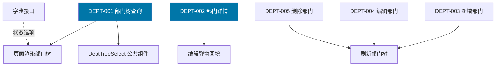
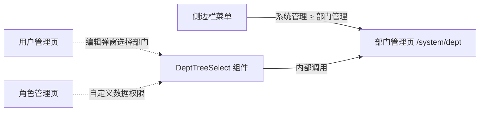
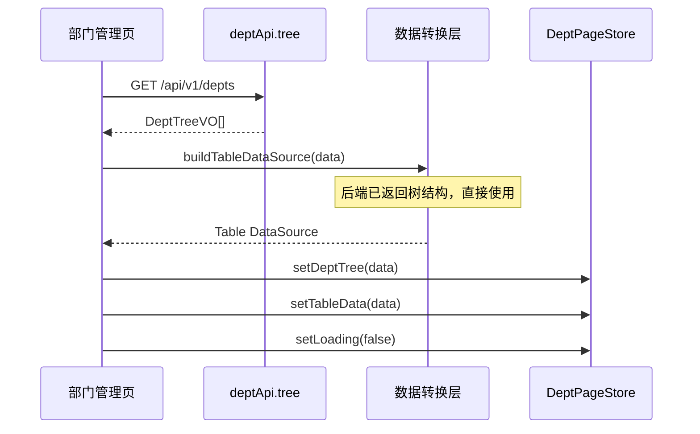
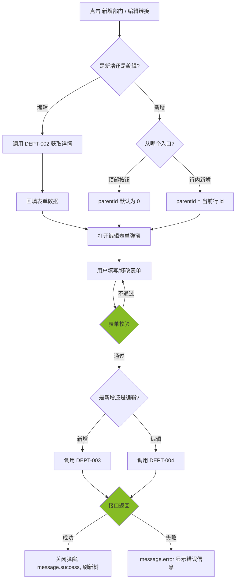
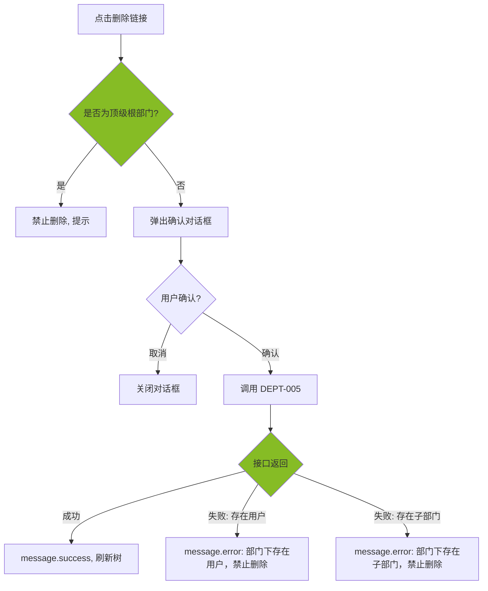
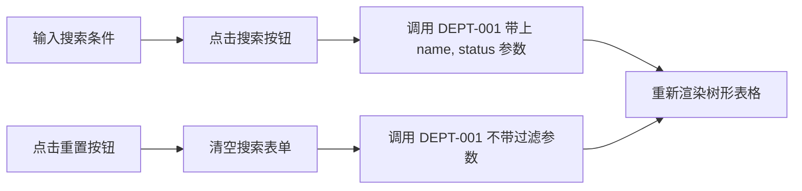

# 前端详细设计文档

## 文档信息

| 项目 | 内容 |
|------|------|
| 文档名称 | 部门管理 前端详细设计文档 |
| 对应后端模块 | 部门管理（模块标识：dept） |
| 参考文档 | `doc/design/modules/rbac/modules/部门管理/后端详细设计.md` |
| 静态页面 | `static_fe/src/app/pages/Departments.tsx` |
| 版本 | v1.0.0 |
| 创建日期 | 2026-04-11 |
| 最后更新 | 2026-04-11 |
| 负责人 | 前端开发（AI辅助） |

---

# 一、模块概述

## 1.1 模块功能描述

本模块前端实现**部门管理**功能：

- **部门树管理**：以树形表格（Table + 展开行）展示租户内的多级组织架构，支持展开/折叠全部、按名称和状态搜索筛选。
- **部门 CRUD**：通过弹窗表单新增/编辑部门，支持设置上级部门、负责人、联系电话、邮箱、排序、状态等字段。支持删除部门（有用户或子部门时禁止删除）。

## 1.2 模块边界与职责

| 职责 | 说明 |
|------|------|
| **本模块负责** | 部门管理页（树形表格 + 搜索 + CRUD 弹窗）、DeptTreeSelect 公共组件（供其他模块复用的部门树选择器） |
| **其他模块负责** | 用户归属部门（用户管理模块）、角色自定义数据权限关联部门（角色管理模块）、字典数据渲染（字典管理模块提供 sys_normal_disable 字典） |

**跨模块复用说明**：

DeptTreeSelect 组件是本模块的核心导出组件，被以下模块引用：

| 引用模块 | 使用场景 |
|---------|---------|
| 用户管理 | 用户新增/编辑弹窗中的"所属部门"字段 |
| 角色管理 | 角色数据权限设置中的"自定义部门"选择 |

## 1.3 用户角色与权限

| 角色 | 可执行操作 | 对应权限标识 |
|------|----------|-------------|
| 平台超级管理员 | 所有操作 | system:dept:* |
| 租户管理员 | 部门树查看、新增、编辑、删除 | system:dept:list / add / edit / remove |
| 普通用户 | 仅查看部门树（用于下拉选择） | system:dept:list |

---

# 二、接口调用总览

## 2.1 接口引用说明

| 接口标识 | 接口名称 | HTTP方法 | 路径 | 主要用途 | 对应后端文档章节 |
|----------|----------|----------|------|----------|-----------------|
| DEPT-001 | 部门树查询 | GET | /api/v1/depts | 页面初始化加载部门树 | §7.2 API-001 |
| DEPT-002 | 部门详情 | GET | /api/v1/depts/{id} | 编辑弹窗回填 | §7.2 API-002 |
| DEPT-003 | 新增部门 | POST | /api/v1/depts | 新增弹窗提交 | §7.2 API-003 |
| DEPT-004 | 编辑部门 | PUT | /api/v1/depts/{id} | 编辑弹窗提交 | §7.2 API-004 |
| DEPT-005 | 删除部门 | DELETE | /api/v1/depts/{id} | 列表删除操作 | §7.2 API-005 |

**跨模块接口依赖：**

| 接口 | 来源模块 | 用途 |
|------|---------|------|
| 字典数据接口 | 字典管理 | 获取 sys_normal_disable 字典用于状态下拉 |

> 本模块不依赖其他业务接口。但本模块的 DEPT-001 接口会被用户管理、角色管理等模块的 DeptTreeSelect 组件调用。

## 2.2 接口依赖关系



---

# 三、页面详细设计

## 3.1 页面清单

| 页面名称 | 路由路径 | 页面功能描述 | 关联接口列表 |
|----------|----------|--------------|--------------|
| 部门管理页 | /system/dept | 树形表格展示部门层级，支持搜索、新增、编辑、删除 | DEPT-001~005 |

## 3.2 页面跳转关系



**说明**：部门管理页通过侧边栏菜单「系统管理 > 部门管理」进入。本模块无页面跳转（纯 CRUD 页面），DeptTreeSelect 组件以弹窗内嵌组件形式被其他模块使用。

---

# 四、页面初始化流程设计

## 4.1 接口调用序列

| 顺序 | 接口 | 并行/串行 | 说明 |
|------|------|----------|------|
| 1 | DEPT-001 部门树查询 | 串行 | 加载全部部门数据，构建树形表格 |

> 部门管理页仅需一个接口即可完成初始化。后端返回完整树结构（含 children），前端直接渲染。

## 4.2 初始化时序图



## 4.3 初始化数据流

1. DEPT-001 接口返回 `DeptTreeVO[]`（后端已构建为嵌套树结构）
2. 树形数据直接作为 Ant Design Table 的 `dataSource`（Ant Design Table 支持 `children` 字段自动渲染树形表格）
3. 同时缓存一份扁平化的部门列表，用于 DeptTreeSelect 组件的数据源

---

# 五、用户操作流程设计

## 5.1 操作-接口映射表

| 用户操作描述 | 触发组件 | 调用接口 | 请求参数构造 | 响应数据处理 | 异常处理 |
|-------------|---------|---------|-------------|-------------|---------|
| 点击搜索按钮 | 搜索按钮 | DEPT-001 | 从搜索表单收集 name, status | 重新渲染树形表格（前端过滤或重新请求） | message.error 提示 |
| 点击重置按钮 | 重置按钮 | DEPT-001 | 清空搜索条件，重新请求 | 重新渲染完整树 | — |
| 点击新增部门 | 顶部新增按钮 | DEPT-003 | 弹窗表单数据组装为 DeptCreateDTO | 关闭弹窗，刷新列表 | 表单校验失败阻止提交 |
| 点击行内新增 | 行内新增链接 | DEPT-003 | 弹窗表单 + 自动填入 parentId | 关闭弹窗，刷新列表 | — |
| 点击编辑部门 | 行内编辑链接 | DEPT-002 → DEPT-004 | 先调详情回填，提交时组装 DeptUpdateDTO | 关闭弹窗，刷新列表 | — |
| 点击删除部门 | 行内删除链接 | DEPT-005 | 取行记录 id | 二次确认后调用，刷新列表 | 确认弹窗 + message.error |
| 展开/折叠全部 | 展开折叠按钮 | — | 切换表格展开状态 | 本地状态变更 | — |

## 5.2 复杂操作流程

### 5.2.1 新增/编辑部门流程



### 5.2.2 删除部门流程



### 5.2.3 搜索筛选流程



**说明**：搜索时将 name 和 status 作为查询参数传给后端，后端负责过滤并返回匹配的部门树。前端无需本地过滤，避免树结构断裂。

---

# 六、组件设计

## 6.1 组件结构图

```mermaid
flowchart TD
    subgraph 部门管理页
        DeptPage --> SearchCard["SearchCard 搜索栏"]
        DeptPage --> DeptTableCard["DeptTableCard 表格卡片"]
    end

    subgraph 搜索栏
        SearchCard --> SearchForm["SearchForm 搜索表单"]
        SearchCard --> SearchButtons["搜索/重置按钮"]
    end

    subgraph 表格区域
        DeptTableCard --> ActionButtons["ActionButtons 操作按钮栏"]
        DeptTableCard --> DeptTable["DeptTable 树形表格"]
    end

    subgraph 弹窗组件
        DeptFormModal["DeptFormModal 新增/编辑弹窗"]
    end

    subgraph 公共组件（跨模块导出）
        DeptTreeSelect["DeptTreeSelect 部门树选择器"]
    end

    DeptTable --> DeptFormModal
    ActionButtons --> DeptFormModal
```

## 6.2 组件清单

| 组件名称 | 组件类型 | 主要职责 | 直接调用接口 | 父组件 | 子组件 |
|----------|----------|----------|-------------|--------|--------|
| DeptPage | 页面 | 部门管理页整体布局 | — | App | SearchCard, DeptTableCard |
| SearchCard | 业务组件 | 搜索表单（部门名称、状态） | — | DeptPage | — |
| DeptTableCard | 业务组件 | 树形表格展示 + 操作按钮 | DEPT-001 | DeptPage | ActionButtons, DeptTable |
| ActionButtons | UI 组件 | 新增部门、展开/折叠按钮 | — | DeptTableCard | — |
| DeptTable | 业务组件 | 部门树形表格渲染 | — | DeptTableCard | — |
| DeptFormModal | 业务组件 | 新增/编辑部门弹窗 | DEPT-002, DEPT-003, DEPT-004 | DeptPage | DeptTreeSelect |
| DeptTreeSelect | 公共组件 | 部门树下拉选择器（供其他模块复用） | DEPT-001 | DeptFormModal, 外部模块 | — |

## 6.3 关键组件详细设计

### 6.3.1 DeptTable 组件

- **接口调用设计**：不直接调用接口，由父组件通过 Props 传入 `dataSource`
- **Props 设计**：

| Prop | 类型 | 说明 |
|------|------|------|
| dataSource | DeptTreeVO[] | 树形表格数据源 |
| loading | boolean | 加载状态 |
| onEdit | (record: DeptTreeVO) => void | 点击编辑回调 |
| onAdd | (parentId: number) => void | 点击行内新增回调 |
| onDelete | (record: DeptTreeVO) => void | 点击删除回调 |
| expandedKeys | string[] | 当前展开的节点 key 列表 |
| onExpandedChange | (keys: string[]) => void | 展开/折叠变更回调 |

- **列定义**：

| 列名 | 字段 | 宽度 | 渲染方式 |
|------|------|------|---------|
| 部门名称 | name | 30% | 直接渲染（树形缩进由 Table 自动处理） |
| 排序 | sort | 10% | 直接渲染 |
| 状态 | status | 15% | Tag 组件：1 → `<Tag color="blue">正常</Tag>`，0 → `<Tag color="default">停用</Tag>` |
| 创建时间 | createTime | 20% | formatTime 格式化 |
| 操作 | — | 25% | 编辑/新增/删除链接（按权限控制显隐） |

- **权限控制**：

| 操作 | 权限标识 | 无权限处理 |
|------|---------|-----------|
| 编辑链接 | system:dept:edit | 隐藏链接 |
| 行内新增链接 | system:dept:add | 隐藏链接 |
| 删除链接 | system:dept:remove | 隐藏链接 |

### 6.3.2 DeptFormModal 组件

- **接口调用设计**：
  - 编辑模式：打开时调用 `DEPT-002` 获取详情，回填表单
  - 提交时：新增调用 `DEPT-003`，编辑调用 `DEPT-004`
- **Props 设计**：

| Prop | 类型 | 说明 |
|------|------|------|
| open | boolean | 弹窗显隐 |
| deptId | number \| null | null 为新增模式，有值为编辑模式 |
| defaultParentId | number | 新增时的默认上级部门 ID（行内新增时传入） |
| onSuccess | () => void | 操作成功回调 |

- **表单字段**：

| 字段 | 组件 | 必填 | 校验规则 | 编辑模式 |
|------|------|------|---------|---------|
| parentId | DeptTreeSelect | 否 | 默认 0（顶级） | 可修改 |
| name | Input | 是 | 2-50 字符 | 可编辑 |
| leaderId | Select（远程搜索用户） | 否 | 本租户用户 | 可编辑 |
| phone | Input | 否 | 11 位手机号格式 | 可编辑 |
| email | Input | 否 | 邮箱格式 | 可编辑 |
| sort | InputNumber | 是 | 0-999 整数 | 可编辑 |
| status | Select | 否 | 字典 sys_normal_disable | 可编辑 |

- **状态管理**：
  - `loading: boolean` — 提交中状态
  - `detailLoading: boolean` — 编辑模式详情加载中
  - `form` — Ant Design Form 实例

### 6.3.3 DeptTreeSelect 组件（公共组件）

- **接口调用设计**：初始化时调用 `DEPT-001` 获取部门树数据
- **Props 设计**：

| Prop | 类型 | 说明 |
|------|------|------|
| value | number \| null | 当前选中值（受控模式） |
| onChange | (value: number \| null) => void | 选中变更回调 |
| placeholder | string | 占位文本，默认"请选择上级部门" |
| allowClear | boolean | 是否允许清空，默认 true |
| disabled | boolean | 是否禁用 |
| showRoot | boolean | 是否显示"无上级（顶级）"选项，默认 true |
| excludeId | number \| null | 排除的部门 ID（编辑时排除自身及子部门） |

- **事件设计**：
  - 选择部门节点 → 触发 `onChange(deptId)`
  - 清空选择 → 触发 `onChange(null)`

- **数据缓存**：使用 TanStack Query 缓存部门树数据，`staleTime: 10min`，避免多个使用该组件的页面重复请求。

---

# 七、数据转换设计

## 7.1 请求数据构造

### 7.1.1 数据转换规则

| 接口 | 前端表单字段 | 接口请求字段 | 转换规则 |
|------|------------|------------|---------|
| DEPT-001 | 搜索表单 | name, status | 直接映射，空值不传 |
| DEPT-003 | 新增表单 | DeptCreateDTO | 直接映射 |
| DEPT-004 | 编辑表单 | DeptUpdateDTO | 直接映射，含 id |
| DEPT-005 | 行记录 id | path variable id | 直接使用 |

### 7.1.2 转换函数设计

```typescript
// 搜索参数构造（过滤空值）
buildDeptQuery(formValues: SearchFormValues): DeptQueryDTO {
  return {
    name: formValues.name || undefined,
    status: formValues.status ?? undefined,
  };
}

// 新增表单数据组装
buildDeptCreatePayload(formValues: DeptFormValues): DeptCreateDTO {
  return {
    parentId: formValues.parentId ?? 0,
    name: formValues.name,
    leaderId: formValues.leaderId ?? undefined,
    phone: formValues.phone || undefined,
    email: formValues.email || undefined,
    sort: formValues.sort,
    status: formValues.status ?? 1,
  };
}

// 编辑表单数据组装
buildDeptUpdatePayload(id: number, formValues: DeptFormValues): DeptUpdateDTO {
  return {
    id,
    parentId: formValues.parentId ?? 0,
    name: formValues.name,
    leaderId: formValues.leaderId ?? undefined,
    phone: formValues.phone || undefined,
    email: formValues.email || undefined,
    sort: formValues.sort,
    status: formValues.status ?? 1,
  };
}

// 后端树数据 → Ant Design Table 数据源（直接使用，无需转换）
// 后端 DeptTreeVO 已包含 children 字段，结构与 Ant Design Table 的
// 树形数据源一致，可直接作为 dataSource 使用。

// 后端树数据 → DeptTreeSelect 的 TreeSelectNode 数据
buildTreeSelectData(list: DeptTreeVO[], showRoot: boolean): TreeSelectNode[] {
  const treeNodes = list.map(item => ({
    title: item.name,
    value: item.id,
    children: item.children ? buildTreeSelectData(item.children, false) : [],
  }));
  if (showRoot) {
    return [{ title: '无上级（顶级）', value: 0, children: treeNodes }];
  }
  return treeNodes;
}
```

## 7.2 响应数据处理

### 7.2.1 数据解析规则

| 接口 | 响应结构 | 解析规则 |
|------|---------|---------|
| DEPT-001 | `DeptTreeVO[]` | 直接作为 Table dataSource；同时提取扁平列表供 DeptTreeSelect 使用 |
| DEPT-002 | `DeptTreeVO`（单条，无 children） | 回填编辑表单 |
| DEPT-003 | `DeptVO` | 不需要解析，操作成功后刷新树 |
| DEPT-004 | `DeptVO` | 不需要解析，操作成功后刷新树 |

### 7.2.2 数据格式化

```typescript
// 时间格式化
formatTime(datetime: string): string → "2026-04-11 10:30:00"

// 状态 Tag 颜色
statusColor(status: number): string → status === 1 ? 'blue' : 'default'

// 状态文本
statusText(status: number): string → status === 1 ? '正常' : '停用'

// 手机号脱敏（列表展示）
maskPhone(phone: string): string → "138****8000"

// 从树数据中提取扁平列表（供 DeptTreeSelect 使用）
flattenDeptTree(tree: DeptTreeVO[]): DeptTreeVO[] {
  const result: DeptTreeVO[] = [];
  const traverse = (nodes: DeptTreeVO[]) => {
    nodes.forEach(node => {
      result.push(node);
      if (node.children?.length) {
        traverse(node.children);
      }
    });
  };
  traverse(tree);
  return result;
}
```

---

# 八、状态管理设计

## 8.1 全局状态

本模块无独立全局状态。部门树数据通过 TanStack Query 缓存管理，不使用 Zustand 全局 Store。

> 部门树数据被多个模块共享（用户管理的 DeptTree、角色管理的数据权限选择），统一通过 TanStack Query 的缓存键 `['dept', 'tree']` 管理，确保跨组件数据一致性。

## 8.2 页面状态设计

```typescript
interface DeptPageState {
  // 部门树数据
  deptTree: DeptTreeVO[];
  loading: boolean;

  // 搜索条件
  searchParams: {
    name?: string;
    status?: number;
  };

  // 表格展开状态
  expandedKeys: string[];
  isExpandAll: boolean;

  // 弹窗状态
  formModalOpen: boolean;
  editingDeptId: number | null;    // null 为新增模式
  defaultParentId: number;         // 新增时预设的上级部门 ID
}
```

### 8.2.1 状态更新规则

| 触发事件 | 更新动作 |
|---------|---------|
| 页面初始化 | 调用 DEPT-001 → 设置 deptTree、expandedKeys（默认展开全部） |
| 搜索提交 | 更新 searchParams → 重新调用 DEPT-001 → 更新 deptTree |
| 重置搜索 | 清空 searchParams → 重新调用 DEPT-001 → 更新 deptTree |
| 新增成功 | 刷新 deptTree（TanStack Query invalidate） |
| 编辑成功 | 刷新 deptTree（TanStack Query invalidate） |
| 删除成功 | 刷新 deptTree（TanStack Query invalidate） |
| 展开/折叠 | 更新 expandedKeys、isExpandAll |

## 8.3 组件状态设计

| 组件 | 内部状态 | 说明 |
|------|---------|------|
| SearchCard | 表单值 | 由 Ant Design Form 管理 |
| DeptFormModal | loading、detailLoading、表单值 | 提交中、详情加载中、表单由 Ant Design Form 管理 |
| DeptTreeSelect | treeData、loading | 部门树数据（TanStack Query 缓存）、加载中 |

---

# 九、模块安全规范

## 9.1 认证与授权

### 9.1.1 Token 管理

| 项目 | 说明 |
|------|------|
| Token 存储位置 | localStorage（key: `precision_token`） |
| Token 过期处理 | Axios 拦截器检测 401 → 清除 Store → 跳转 /login |
| Token 传递方式 | 请求 Header `Authorization: Bearer {token}` |

### 9.1.2 权限控制

| 页面/组件 | 权限标识 | 无权限处理 |
|-----------|---------|-----------|
| 新增部门按钮（顶部） | system:dept:add | 隐藏按钮 |
| 行内新增链接 | system:dept:add | 隐藏链接 |
| 行内编辑链接 | system:dept:edit | 隐藏链接 |
| 行内删除链接 | system:dept:remove | 隐藏链接 |
| 部门管理菜单 | system:dept:list | 菜单不显示 |

**权限判断方式**：使用 `hasPermission(perm)` 函数，从 UserStore.permissions 数组中查找匹配。按钮级权限通过条件渲染控制。

## 9.2 敏感数据处理

### 9.2.1 敏感数据展示

| 数据类型 | 脱敏规则 | 完整展示条件 |
|---------|---------|-------------|
| 手机号（列表） | 138****8000 | 后端已脱敏，前端直接展示 |
| 手机号（详情/编辑弹窗） | 完整展示 | 弹窗内可查看和编辑完整手机号 |

## 9.3 安全检查清单

- [x] 所有请求通过 Axios 拦截器自动携带 Token
- [x] 401 响应自动跳转登录页
- [x] 按钮级权限通过权限标识控制显隐
- [x] 手机号列表脱敏展示
- [x] 删除操作需二次确认
- [x] 表单输入做 XSS 过滤（前端输入过滤 + 后端 HtmlUtils.htmlEscape）
- [x] 租户数据隔离由后端拦截器自动处理

---

# 十、错误处理设计

## 10.1 接口调用错误处理

### 10.1.1 错误分类与处理

| 错误类型 | HTTP 状态码 | 业务错误码 | 处理策略 |
|---------|-----------|----------|---------|
| 未登录 | 401 | 30001 | 清除 Store，跳转 /login |
| 无权限 | 403 | 30003 | message.error('无操作权限') |
| 参数校验失败 | 200 | 10002 | message.error(具体字段错误) |
| 部门名称已存在 | 200 | 20012 | message.error('部门名称已存在') |
| 部门下存在用户 | 200 | 10002 | message.error('部门下存在用户，禁止删除') |
| 部门下存在子部门 | 200 | 20011 | message.error('部门下存在子部门，禁止删除') |
| 不能移动到子部门下 | 200 | 10002 | message.error('不能将部门移动到自己的子部门下') |
| 部门层级超过5级 | 200 | 10002 | message.error('部门层级不能超过5级') |
| 网络异常 | — | — | message.error('网络异常，请稍后重试') |
| 服务器错误 | 500 | — | message.error('服务器异常') |

### 10.1.2 重试机制

| 接口 | 是否重试 | 重试策略 |
|------|---------|---------|
| DEPT-001 部门树查询 | 是 | TanStack Query 自动重试 1 次 |
| DEPT-002 部门详情 | 否 | 直接展示错误 |
| DEPT-003 新增部门 | 否 | 直接展示错误 |
| DEPT-004 编辑部门 | 否 | 直接展示错误 |
| DEPT-005 删除部门 | 否 | 直接展示错误 |

## 10.2 用户操作错误处理

| 场景 | 处理方案 |
|------|---------|
| 表单校验失败 | Ant Design Form 内联红色提示 |
| 新增部门名称重复 | message.error 提示，表单不关闭 |
| 删除有用户的部门 | message.error('部门下存在用户，禁止删除') |
| 删除有子部门的部门 | message.error('部门下存在子部门，禁止删除') |
| 编辑时移动到子部门下 | message.error('不能将部门移动到自己的子部门下') |
| 手机号格式错误 | 表单内联校验提示"请输入正确的手机号格式" |
| 邮箱格式错误 | 表单内联校验提示"请输入正确的邮箱格式" |
| 网络断开 | 全局 Axios 拦截器 message.error |

---

# 十一、性能优化设计

## 11.1 接口调用优化

### 11.1.1 接口缓存

| 接口 | 缓存策略 | 缓存时间 | 说明 |
|------|---------|---------|------|
| DEPT-001 部门树查询 | TanStack Query staleTime 10min | 10 分钟内不重复请求 | 组织架构变更频率低，适合长缓存 |
| DEPT-002 部门详情 | 不缓存 | 每次打开编辑弹窗重新请求 | 确保最新数据 |

**缓存失效策略**：DEPT-003/004/005 写操作成功后，调用 `queryClient.invalidateQueries({ queryKey: ['dept', 'tree'] })` 主动失效缓存，触发重新加载。

### 11.1.2 DeptTreeSelect 组件复用优化

DeptTreeSelect 被多个模块使用时，共享同一份 TanStack Query 缓存数据（queryKey: `['dept', 'tree']`），避免重复请求。首次加载后，其他页面的 DeptTreeSelect 直接从缓存读取。

## 11.2 组件渲染优化

| 优化项 | 策略 |
|-------|------|
| 弹窗懒渲染 | `destroyOnClose: true`，关闭时销毁表单状态 |
| 树形表格展开 | 使用 controlled `expandedKeys`，避免非受控模式下全量重渲染 |
| 搜索防抖 | 部门名称输入 300ms 防抖（如有即时搜索需求） |

---

# 十二、测试设计

## 12.1 正常流程

| 测试场景 | 前置条件 | 操作步骤 | 预期结果 |
|---------|---------|---------|---------|
| 部门树加载 | 已登录，已有部门数据 | 进入部门管理页 | 树形表格显示多级部门，默认展开全部 |
| 搜索部门 | 部门树有数据 | 输入部门名称，点击搜索 | 表格仅显示匹配部门（保持树结构） |
| 按状态筛选 | 部门树有数据 | 选择状态"停用"，点击搜索 | 表格仅显示停用部门 |
| 新增顶级部门 | — | 点击新增部门，填写表单，确定 | 弹窗关闭，树刷新，新部门出现在顶级 |
| 新增子部门 | 部门存在 | 点击某部门行内"新增"，填写表单，确定 | 弹窗关闭，新部门作为子节点出现 |
| 编辑部门 | 部门存在 | 点击编辑，修改名称和排序，确定 | 弹窗关闭，树刷新，信息已更新 |
| 删除空部门 | 部门无用户无子部门 | 点击删除，确认 | 二次确认后删除成功，树刷新 |
| 展开/折叠 | 树已加载 | 点击展开/折叠按钮 | 切换全部节点的展开/折叠状态 |
| 重置搜索 | 已输入搜索条件 | 点击重置按钮 | 搜索表单清空，显示完整部门树 |

## 12.2 异常流程

| 测试场景 | 前置条件 | 操作步骤 | 预期结果 |
|---------|---------|---------|---------|
| 新增部门名称重复 | 租户内已有"技术部" | 新增同名部门 | message.error('部门名称已存在')，弹窗不关闭 |
| 删除有用户的部门 | 部门下有 3 个用户 | 点击删除，确认 | message.error('部门下存在用户，禁止删除') |
| 删除有子部门的部门 | 部门下有子部门 | 点击删除，确认 | message.error('部门下存在子部门，禁止删除') |
| 手机号格式错误 | — | 输入 phone=12345 | 表单内联提示"请输入正确的手机号格式" |
| 邮箱格式错误 | — | 输入 email=abc | 表单内联提示"请输入正确的邮箱格式" |
| Token 过期 | — | 操作任意接口 | 自动跳转登录页 |
| 网络断开 | — | 操作任意接口 | message.error 网络异常提示 |
| 空树 | 租户无部门 | 进入部门管理页 | 表格显示空状态 Empty |

---

# 附录

## A. 接口详细说明

### A.1 DEPT-001 部门树查询

- **调用时机**：页面初始化、搜索提交、重置搜索、CRUD 操作成功后刷新
- **请求参数**：`{ name?: string, status?: number }`（Query String）
- **响应处理**：`DeptTreeVO[]` 直接作为 Table dataSource；同时提取扁平列表缓存供 DeptTreeSelect 使用
- **错误处理**：message.error 提示

### A.2 DEPT-002 部门详情

- **调用时机**：编辑弹窗打开时
- **请求参数**：path variable `id`
- **响应处理**：`DeptTreeVO`（单条）回填编辑表单各字段
- **错误处理**：message.error 提示，关闭弹窗

### A.3 DEPT-003 新增部门

- **调用时机**：新增弹窗提交
- **请求参数**：`DeptCreateDTO`（parentId, name, leaderId, phone, email, sort, status）
- **响应处理**：关闭弹窗 → message.success('新增成功') → invalidateQueries 刷新树
- **错误处理**：名称重复等业务错误 message.error，表单不关闭

### A.4 DEPT-004 编辑部门

- **调用时机**：编辑弹窗提交
- **请求参数**：`DeptUpdateDTO`（id, parentId, name, leaderId, phone, email, sort, status）
- **响应处理**：关闭弹窗 → message.success('编辑成功') → invalidateQueries 刷新树
- **错误处理**：移动到子部门等业务错误 message.error，表单不关闭

### A.5 DEPT-005 删除部门

- **调用时机**：删除链接点击并确认后
- **请求参数**：path variable `id`
- **响应处理**：message.success('删除成功') → invalidateQueries 刷新树
- **错误处理**：存在用户/子部门等业务错误 message.error

## B. 变更记录

| 版本 | 日期 | 修改人 | 变更描述 | 变更原因 | 评审人 |
|------|------|--------|---------|---------|--------|
| v1.0.0 | 2026-04-11 | 前端开发（AI） | 初始版本 | 部门管理前端详细设计 | 待评审 |
