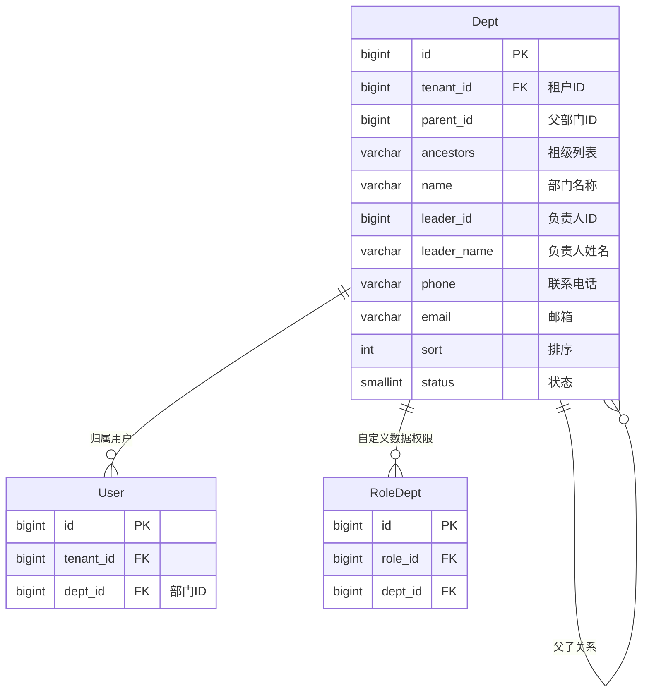
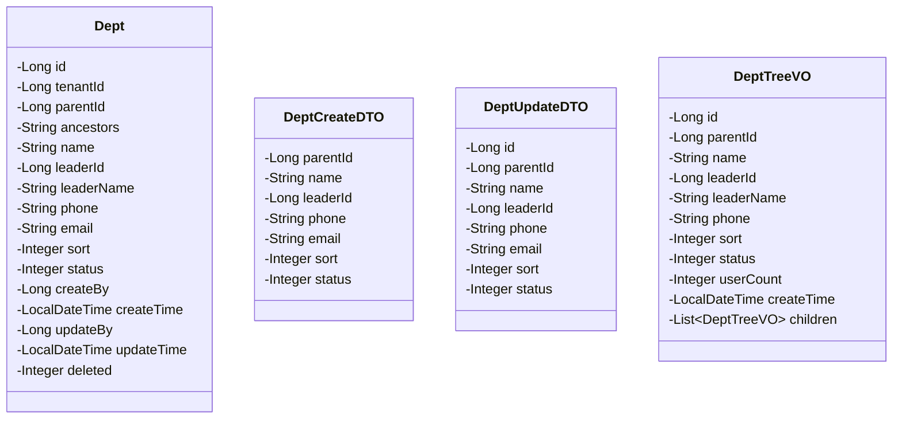
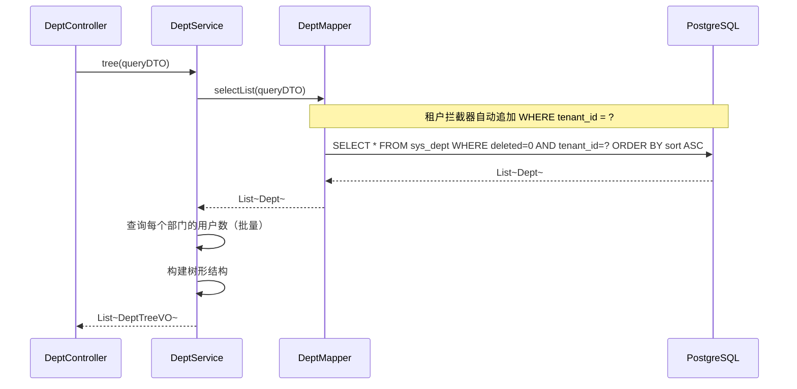
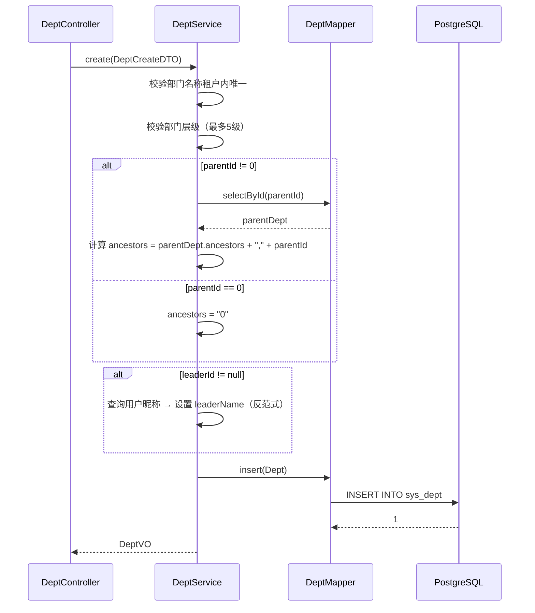
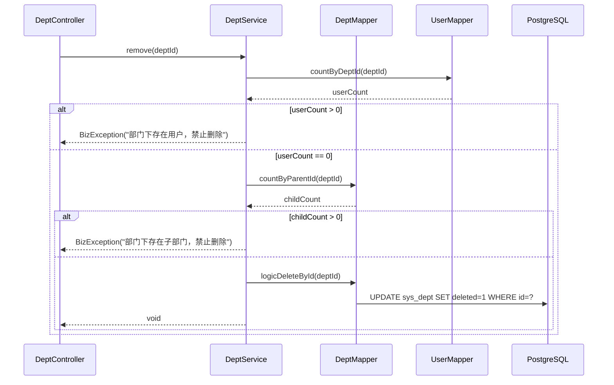
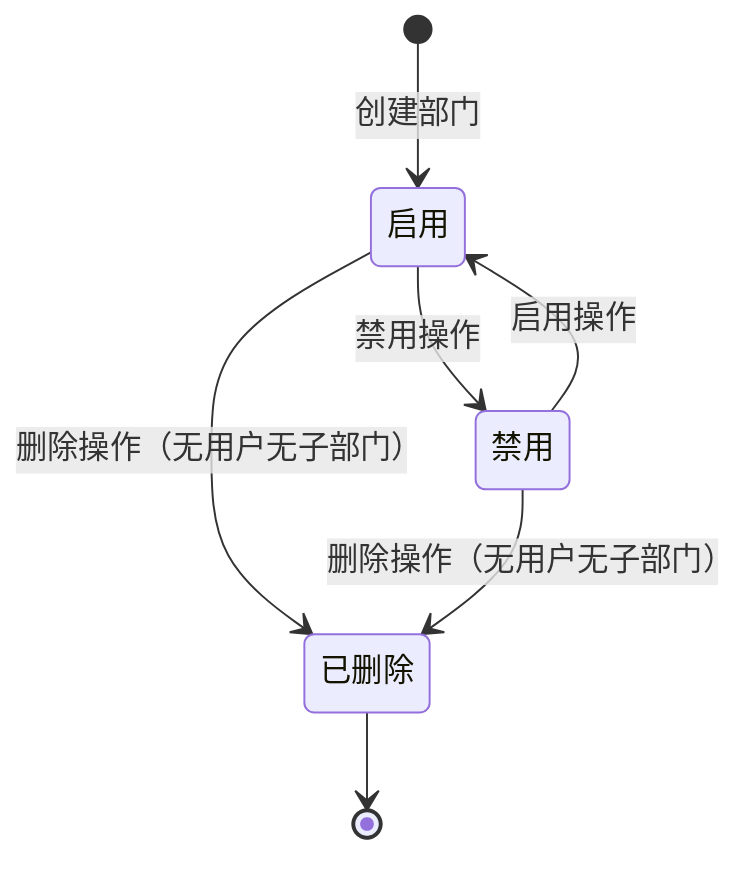
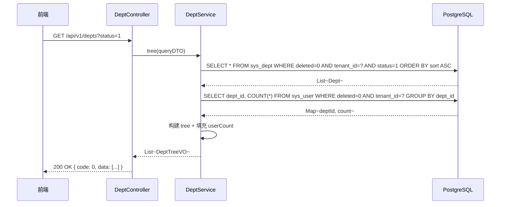
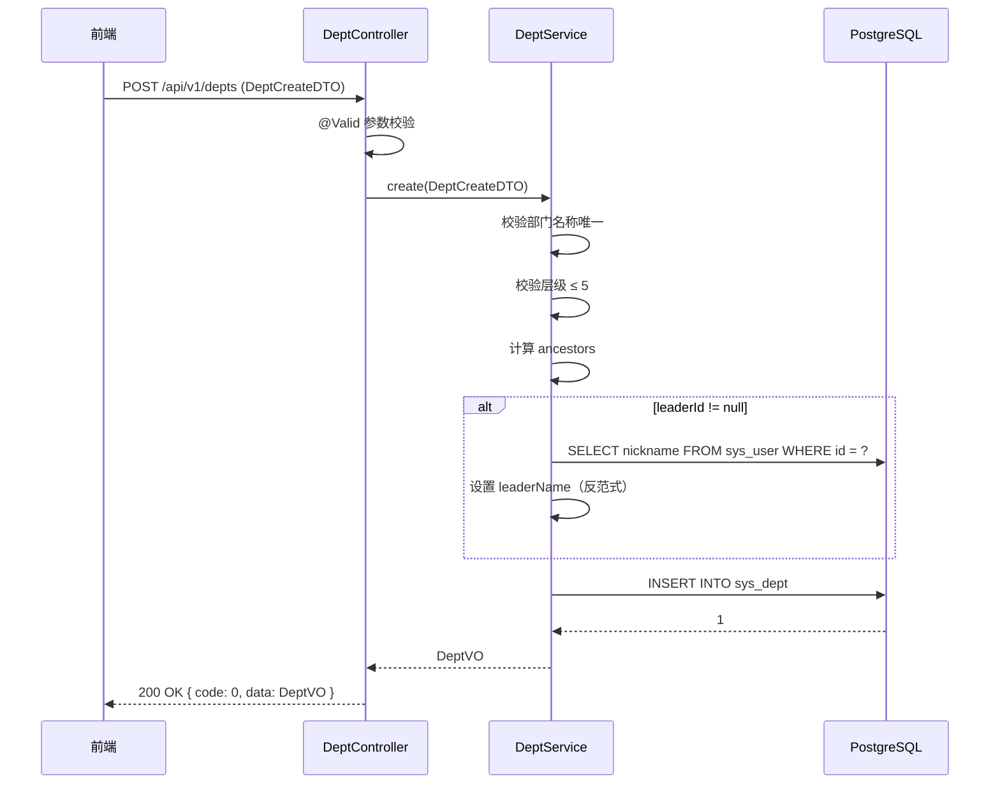

# 程序详细设计文档

> **定位**
> - 数据库驱动设计
> - 分层思想
> - 前后端无代码协同
> - AI 分阶段稳定交付

------

## 文档信息

| 项目 | 内容 |
|------|------|
| 模块名称 | 部门管理 |
| 模块标识 | dept |
| 所属系统 | RBAC 权限模块 |
| 文档版本 | v1.0.0 |
| 设计负责人 | 后端开发（AI辅助） |
| 最后更新时间 | 2026-03-30 |

适用对象：
- 后端开发
- 前端开发
- 测试人员
- AI 编程

------

# 一、数据库设计

> ⚠️ 数据库是系统"真实状态"的最终承载
> 所有代码都必须服务于本章设计

------

## 1.1 表清单与业务职责

| 表名 | 业务含义 | 主键 | 是否核心表 | 说明 |
|------|---------|------|-----------|------|
| sys_dept | 部门表 | id (BIGINT) | 是 | 租户级数据，多级部门树结构 |
| sys_user | 用户表 | id (BIGINT) | 否 | 关联 dept_id，统计部门用户数（跨模块只读） |

> **跨模块只读说明**：本模块通过 UserService 查询部门下用户数量，不直接操作 sys_user 表。

------

## 1.2 表关系设计（ER 图）



**流程说明**：

1. 部门树通过 `parent_id + ancestors` 字段实现，ancestors 存储从根到当前节点的路径（如 `0,1,5`）
2. 用户通过 `dept_id` 归属部门
3. 角色的自定义数据权限通过 `sys_role_dept` 关联部门

**关键点**：

- sys_dept 含 `tenant_id`，受租户拦截器自动隔离
- 部门名称在租户内唯一（联合唯一索引 `tenant_id + name + deleted`）
- `ancestors` 冗余存储祖级路径，用于快速查询所有子部门：`WHERE ancestors LIKE '0,1,5%'`

------

## 1.3 表结构设计（字段级，逐字段）

### 公共字段说明

| 字段 | 类型 | 必填 | 描述 | 业务含义 | 设计说明 |
|------|------|------|------|---------|---------|
| tenant_id | BIGINT | 是 | 租户ID | 数据隔离 | MyBatis-Flex 拦截器自动填充 |
| create_by | BIGINT | 否 | 创建人ID | 审计字段 | 记录创建该记录的用户ID |
| create_time | TIMESTAMP | 是 | 创建时间 | 审计字段 | 自动填充，默认 CURRENT_TIMESTAMP |
| update_by | BIGINT | 否 | 更新人ID | 审计字段 | 记录最后修改该记录的用户ID |
| update_time | TIMESTAMP | 是 | 更新时间 | 审计字段 | 自动更新 |
| deleted | SMALLINT | 是 | 删除标识 | 逻辑删除 | 0=未删除，1=已删除，默认0 |

### 表：sys_dept

| 字段 | 类型 | 必填 | 描述 | 业务含义 | 设计说明 |
|------|------|------|------|---------|---------|
| id | BIGINT | 是 | 主键 | 部门ID | 雪花算法生成 |
| parent_id | BIGINT | 是 | 父部门ID | 树形结构 | 顶级为 0 |
| ancestors | VARCHAR(500) | 是 | 祖级列表 | 快速查询子树 | 如 `0,1,5`，从根到父级 |
| name | VARCHAR(50) | 是 | 部门名称 | 展示名称 | 2-50 字符，租户内唯一 |
| leader_id | BIGINT | 否 | 负责人用户ID | 部门负责人 | 关联 sys_user.id |
| leader_name | VARCHAR(50) | 否 | 负责人姓名 | 冗余展示 | 冗余字段，避免联查用户表 |
| phone | VARCHAR(20) | 否 | 联系电话 | 部门电话 | 手机号格式校验 |
| email | VARCHAR(100) | 否 | 邮箱 | 部门邮箱 | 标准邮箱格式校验 |
| sort | INT | 是 | 显示排序 | 排序权重 | 值越小越靠前，默认 0 |
| status | SMALLINT | 是 | 状态 | 启用/禁用 | 0=禁用，1=启用。默认 1 |

------

## 1.4 反范式设计

### 反范式字段清单

| 表 | 字段 | 冗余来源 | 冗余原因 | 一致性策略 | 风险 |
|---|------|---------|---------|-----------|------|
| sys_dept | leader_name | sys_user.nickname | 避免列表查询时联查用户表 | 设置负责人时同步更新 | 低（负责人变更频率低） |
| sys_dept | ancestors | 递归计算 | 支持快速 `LIKE '0,1,%'` 查询所有子部门 | 新增/移动时重新计算 | 低（祖先路径变更频率低） |

------

## 1.5 索引与约束设计

**唯一索引：**
- `uk_dept_tenant_name ON sys_dept(tenant_id, name, deleted)` — 租户内部门名称唯一

**普通索引：**
- `idx_dept_tenant_parent ON sys_dept(tenant_id, parent_id)` — 按父级查询子部门
- `idx_dept_ancestors ON sys_dept(ancestors)` — 按祖级路径查询子树（LIKE 前缀匹配）

**业务唯一约束：**
- 部门名称在租户内唯一（通过唯一索引保证）

------

# 二、模块目标与边界

**模块解决的业务问题：**
管理租户内的多级组织架构树，支持部门 CRUD、负责人设置。部门是数据权限控制的重要维度。

**模块不解决的问题：**
- 部门下用户的增删改（用户管理模块负责）
- 角色数据权限配置（角色管理模块负责）
- 跨租户的部门数据隔离（租户拦截器自动处理）

**是否核心链路：** 是。部门是用户归属和数据权限的基础。

------

## 2.1 模块边界图

```mermaid
flowchart TD
    subgraph 部门管理模块
        A[DeptController]
        B[DeptService]
        C[DeptMapper]
    end

    subgraph 用户管理模块
        D[UserMapper]
    end

    subgraph 角色管理模块
        E[RoleDeptMapper]
    end

    subgraph 公共基础设施
        F[TenantInterceptor]
        G[@Log]
    end

    A --> B
    B --> C
    B -->|查询部门下用户数| D

    E -->|自定义数据权限查询| C

    A --> F
    A --> G
```

**关键点**：

- DeptService 通过 UserMapper 查询用户数量（只读，不修改用户数据）
- DeptService 不直接操作 sys_role_dept 表（角色管理模块负责）
- 租户拦截器自动追加 `tenant_id` 条件

------

# 三、整体架构设计

> ⚠️ 明确声明：**本项目不采用 DDD**

------

## 3.1 分层结构定义

```
com.gentry.rbac.dept/
├── controller/
│   └── DeptController
├── service/
│   ├── DeptService
│   └── impl/
│       └── DeptServiceImpl
├── mapper/
│   └── DeptMapper
├── entity/
│   └── Dept
├── dto/
│   ├── DeptCreateDTO
│   ├── DeptUpdateDTO
│   └── DeptQueryDTO
├── vo/
│   ├── DeptVO
│   └── DeptTreeVO
└── enums/
```

### 命名规范

| 数据库表名 | Entity 类名 | Service 接口名 | Controller 类名 |
|-----------|------------|---------------|----------------|
| sys_dept | Dept | DeptService | DeptController |

------

## 3.2 枚举设计

本模块无独立枚举。status 字段使用 SMALLINT（0/1），复用公共字典 `sys_normal_disable`。

------

## 3.3 层级职责与禁止事项

| 层 | 允许做 | 禁止做 |
|---|--------|--------|
| Controller | 参数校验(@Valid)、请求响应处理 | 写业务逻辑 |
| Service | 树构建、ancestors 计算、级联校验、跨模块调用（UserMapper 只读） | 直接写 SQL |
| Mapper | 数据访问、SQL 执行 | 业务判断 |

------

# 四、业务模型与数据映射

### Entity 类设计



**DTO → Entity 映射说明：**

| DTO 字段 | Entity 字段 | 转换逻辑 | 说明 |
|---------|------------|---------|------|
| parentId | parentId | 直接映射 | 默认 0（顶级） |
| name | name | 直接映射 | 校验租户内唯一 |
| leaderId | leaderId | 直接映射 | 设置负责人时同步查询 leaderName |
| — | ancestors | 自动计算 | `父级.ancestors + ',' + 父级.id` |
| — | tenantId | 拦截器自动 | 无需前端传入 |

**ancestors 计算规则：**

| 操作 | ancestors 值 | 示例 |
|------|-------------|------|
| 新增顶级部门(parentId=0) | `0` | — |
| 新增子部门(父级 ancestors=`0,1`) | `0,1` | 父级 ID=1 |
| 移动部门 | 重新计算本节点及所有子孙节点 | 递归更新 |

------

# 五、行为流程与用例设计

## 5.1 主流程（时序图）

### 5.1.1 查询部门树



### 5.1.2 新增部门



### 5.1.3 删除部门



## 5.2 关键业务规则说明

### 新增部门

- **前置条件**：操作人为租户管理员
- **核心校验**：
  - 部门名称在租户内唯一（`WHERE tenant_id=? AND name=? AND deleted=0`）
  - 部门层级不超过 5 级（通过 ancestors 的逗号数量判断）
  - 负责人必须是本租户用户
- **失败路径**：
  - 名称重复 → `BizException(PARAM_ERROR, "部门名称已存在")`
  - 超过5级 → `BizException(PARAM_ERROR, "部门层级不能超过5级")`

### 编辑部门

- **前置条件**：部门存在
- **核心校验**：
  - 不能将部门移动到自己的子部门下（递归检查目标 parentId 的 ancestors 是否包含当前 ID）
  - 同级名称唯一（排除自身）
  - 层级不超过5级
- **失败路径**：
  - 移动到子部门 → `BizException(PARAM_ERROR, "不能将部门移动到自己的子部门下")`

### 删除部门

- **前置条件**：部门存在
- **核心校验**：
  - 部门下无用户（`SELECT COUNT FROM sys_user WHERE dept_id=? AND deleted=0`）
  - 部门下无子部门（`SELECT COUNT FROM sys_dept WHERE parent_id=? AND deleted=0`）
- **失败路径**：
  - 存在用户 → `BizException(PARAM_ERROR, "部门下存在用户，禁止删除")`
  - 存在子部门 → `BizException(PARAM_ERROR, "部门下存在子部门，禁止删除")`

------

# 六、状态机设计

### 部门状态



**状态值映射：**

| 状态 | status 值 | 说明 |
|------|----------|------|
| 启用 | 1 | 正常 |
| 禁用 | 0 | 禁用，不影响已有用户归属 |
| 已删除 | deleted = 1 | 逻辑删除 |

------

# 七、接口设计（前后端核心契约）

> **目标：无代码即可协同开发**

------

## 7.1 接口清单

| 接口编号 | 接口名称 | URL | Method | 认证 | 授权 |
|---------|---------|-----|--------|------|------|
| API-001 | 部门树查询 | /api/v1/depts | GET | 是 | system:dept:list |
| API-002 | 部门详情 | /api/v1/depts/{id} | GET | 是 | system:dept:list |
| API-003 | 新增部门 | /api/v1/depts | POST | 是 | system:dept:add |
| API-004 | 编辑部门 | /api/v1/depts/{id} | PUT | 是 | system:dept:edit |
| API-005 | 删除部门 | /api/v1/depts/{id} | DELETE | 是 | system:dept:remove |

------

## 7.2 入参设计

### API-001 部门树查询

**请求对象：** `DeptQueryDTO`

| 参数 | 类型 | 必填 | 描述 | 校验规则 |
|------|------|------|------|---------|
| name | String | 否 | 部门名称 | 模糊匹配 |
| status | Integer | 否 | 状态 | 0=禁用，1=启用，null=全部 |

**请求示例：**

```
GET /api/v1/depts?status=1
```

### API-003 新增部门

**请求对象：** `DeptCreateDTO`

| 参数 | 类型 | 必填 | 描述 | 校验规则 |
|------|------|------|------|---------|
| parentId | Long | 否 | 上级部门ID | 默认 0（顶级） |
| name | String | 是 | 部门名称 | @Size(min=2, max=50) |
| leaderId | Long | 否 | 负责人用户ID | 必须是本租户用户 |
| phone | String | 否 | 联系电话 | @Pattern(regexp="^1[3-9]\\d{9}$") |
| email | String | 否 | 邮箱 | @Email |
| sort | Integer | 是 | 显示排序 | @Min(0) @Max(999) |
| status | Integer | 否 | 状态 | 默认 1 |

**请求示例：**

```json
{
  "parentId": 1,
  "name": "华东分公司",
  "leaderId": 10,
  "phone": "13800138001",
  "email": "huadong@example.com",
  "sort": 1,
  "status": 1
}
```

### API-004 编辑部门

**请求对象：** `DeptUpdateDTO`

| 参数 | 类型 | 必填 | 描述 | 校验规则 |
|------|------|------|------|---------|
| parentId | Long | 否 | 上级部门ID | 不能移动到子部门下 |
| name | String | 是 | 部门名称 | @Size(min=2, max=50) |
| leaderId | Long | 否 | 负责人用户ID | - |
| phone | String | 否 | 联系电话 | @Pattern(regexp="^1[3-9]\\d{9}$") |
| email | String | 否 | 邮箱 | @Email |
| sort | Integer | 是 | 显示排序 | @Min(0) @Max(999) |
| status | Integer | 否 | 状态 | - |

------

## 7.3 出参设计

### DeptTreeVO（部门树响应）

| 字段 | 类型 | 描述 |
|------|------|------|
| id | Long | 部门ID |
| parentId | Long | 父部门ID |
| name | String | 部门名称 |
| leaderId | Long | 负责人ID |
| leaderName | String | 负责人姓名 |
| phone | String | 联系电话 |
| email | String | 邮箱 |
| sort | Integer | 排序 |
| status | Integer | 状态 |
| userCount | Integer | 部门下用户数 |
| createTime | LocalDateTime | 创建时间 |
| children | List\<DeptTreeVO\> | 子部门列表 |

**响应示例：**

```json
{
  "code": 0,
  "message": "success",
  "data": [
    {
      "id": 1,
      "parentId": 0,
      "name": "总公司",
      "leaderId": 1,
      "leaderName": "张三",
      "phone": "13800138000",
      "sort": 1,
      "status": 1,
      "userCount": 3,
      "createTime": "2026-03-30 10:00:00",
      "children": [
        {
          "id": 2,
          "parentId": 1,
          "name": "运营部",
          "leaderId": 5,
          "leaderName": "李四",
          "sort": 1,
          "status": 1,
          "userCount": 8,
          "createTime": "2026-03-30 10:00:00",
          "children": []
        }
      ]
    }
  ]
}
```

------

## 7.4 接口治理要求（强制）

| 接口 | 是否启用全局防抖 | 是否需要接口级防抖 | 是否幂等 | 幂等依据 | 日志级别 |
|------|----------------|------------------|---------|---------|---------|
| API-001 部门树查询 | 是 | 否 | 是 | 相同参数相同结果 | 无 |
| API-002 部门详情 | 是 | 否 | 是 | 相同参数相同结果 | 无 |
| API-003 新增部门 | 是 | 否 | 否 | 同名校验阻止重复 | @Log |
| API-004 编辑部门 | 是 | 否 | 是 | 全量更新 | @Log |
| API-005 删除部门 | 是 | 否 | 是 | 逻辑删除 | @Log |

------

# 八、模块安全规范

------

## 8.1 认证与授权要求

本模块是否需要认证：**是**
认证方式：Sa-Token（Token）
本模块是否需要授权：**是**
授权粒度：**接口级**

### 接口权限配置

| 接口 | 权限标识 | 权限说明 | 是否公开 |
|------|---------|---------|---------|
| API-001 部门树查询 | system:dept:list | 查询部门树 | 否 |
| API-002 部门详情 | system:dept:list | 查看部门详情 | 否 |
| API-003 新增部门 | system:dept:add | 新增部门 | 否 |
| API-004 编辑部门 | system:dept:edit | 编辑部门 | 否 |
| API-005 删除部门 | system:dept:remove | 删除部门 | 否 |

------

## 8.2 敏感数据处理

### 敏感字段清单

| 字段名 | 所属表/对象 | 敏感等级 | 存储处理 | 传输处理 | 展示处理 |
|--------|-----------|---------|---------|---------|---------|
| phone | sys_dept / DeptTreeVO | 中 | 明文存储 | HTTPS | 列表脱敏 138\*\*\*\*8000 |

------

## 8.3 安全检查清单

- [x] 所有接口是否配置了正确的权限？ → system:dept:* 系列
- [x] 敏感数据是否按规范处理？ → 手机号脱敏
- [x] 输入参数是否有完整的校验？ → @Valid + JSR 303
- [x] 是否有 SQL 注入风险？ → MyBatis-Flex 参数化查询
- [x] 是否有 XSS 风险？ → 输入过滤 + 输出转义
- [x] 操作日志是否完整？ → 所有写接口添加 @Log
- [x] 租户隔离是否生效？ → TenantInterceptor 自动追加 tenant_id

------

# 九、算法设计

### 9.1 是否涉及算法

是否涉及算法：**否**

> 本模块无算法设计。ancestors 计算为字符串拼接操作，树构建为内存分组+递归。

------

# 十、前后端交互模型

### 部门树查询交互时序



### 新增部门交互时序



------

# 十一、测试用例设计

## 正常流程

| 用例ID | 测试场景 | 前置条件 | 测试步骤 | 预期结果 |
|--------|---------|---------|---------|---------|
| DEPT-001 | 查询部门树 | 已初始化部门数据 | 调用 API-001 | 返回多级树结构，含 userCount |
| DEPT-002 | 新增顶级部门 | - | parentId=0 | ancestors=`0`，创建成功 |
| DEPT-003 | 新增子部门 | 已存在部门ID=1 | parentId=1 | ancestors=`0,1`，创建成功 |
| DEPT-004 | 新增部门带负责人 | 存在用户ID=10 | leaderId=10 | leaderName 自动填充 |
| DEPT-005 | 编辑部门名称 | 部门存在 | 修改 name | 修改成功 |
| DEPT-006 | 删除空部门 | 部门无用户无子部门 | 调用删除 | 删除成功 |

## 异常流程

| 用例ID | 测试场景 | 前置条件 | 测试步骤 | 预期结果 |
|--------|---------|---------|---------|---------|
| DEPT-007 | 部门名称重复 | 租户内已有"技术部" | 新增同名部门 | 提示"部门名称已存在" |
| DEPT-008 | 删除有用户的部门 | 部门下有 3 个用户 | 调用删除 | 提示"部门下存在用户，禁止删除" |
| DEPT-009 | 删除有子部门的部门 | 部门下有子部门 | 调用删除 | 提示"部门下存在子部门，禁止删除" |
| DEPT-010 | 层级超过5级 | 已有4级嵌套 | 在第5级下新增 | 提示"部门层级不能超过5级" |
| DEPT-011 | 移动到子部门下 | A→B→C | 将 A 的 parentId 改为 C | 提示"不能将部门移动到自己的子部门下" |

## 边界条件

| 用例ID | 测试场景 | 前置条件 | 测试步骤 | 预期结果 |
|--------|---------|---------|---------|---------|
| DEPT-012 | 名称长度刚好2字符 | - | name=`技术` | 创建成功 |
| DEPT-013 | 名称超长 | - | name=51字符 | 校验失败 |
| DEPT-014 | 手机号格式错误 | - | phone=`12345` | 校验失败 |
| DEPT-015 | 查询空树 | 租户无部门 | 调用 API-001 | 返回空数组 [] |
| DEPT-016 | 5级边界 | 已有4级 | 在第4级下新增 | 创建成功 |

## 并发 / 幂等

| 用例ID | 测试场景 | 前置条件 | 测试步骤 | 预期结果 |
|--------|---------|---------|---------|---------|
| DEPT-017 | 并发新增同名部门 | - | 两个请求同时新增 | 唯一索引阻止一个 |
| DEPT-018 | 重复删除 | 部门已删除 | 再次删除同一 ID | 幂等成功 |

## 数据一致性

| 用例ID | 测试场景 | 前置条件 | 测试步骤 | 预期结果 |
|--------|---------|---------|---------|---------|
| DEPT-019 | 编辑后 ancestors 重新计算 | A→B, 将 B 移到根级 | 修改 parentId=0 | B.ancestors=`0`，B 的子节点 ancestors 同步更新 |
| DEPT-020 | 租户隔离 | 两个租户各有部门 | 用租户A查询 | 仅返回租户A的部门 |

------

## 变更记录

| 版本 | 日期 | 修改人 | 变更内容 | 变更原因 | 评审人 |
|------|------|--------|---------|---------|--------|
| v1.0.0 | 2026-03-30 | 后端开发（AI） | 初始版本 | 部门管理详细设计 | 待评审 |
