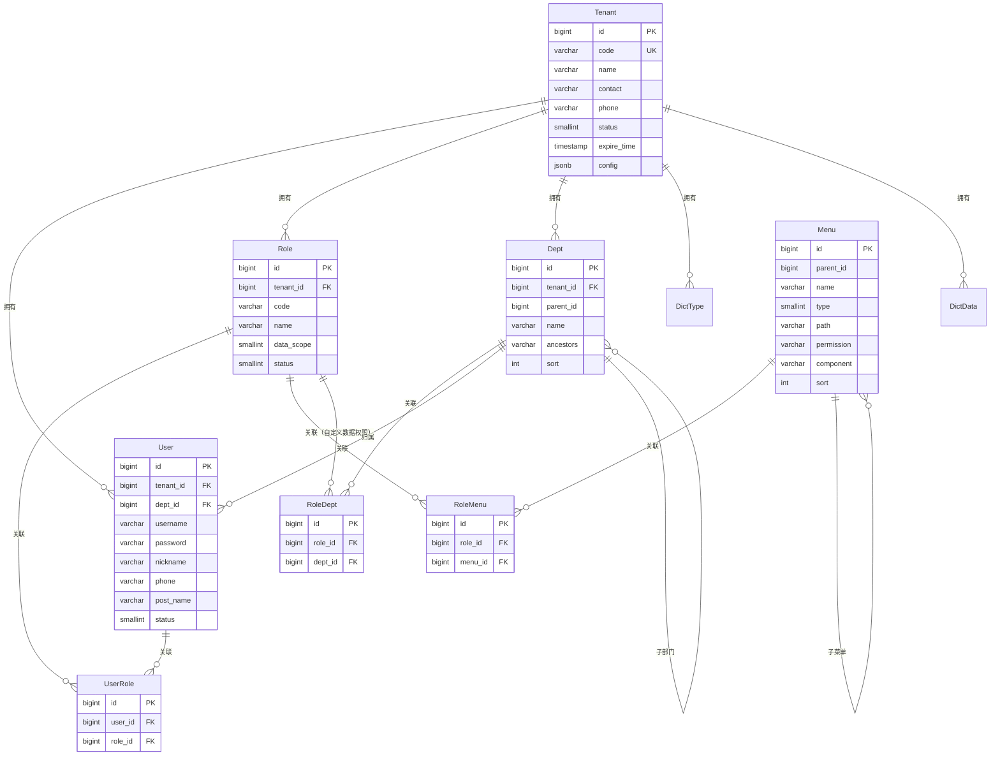
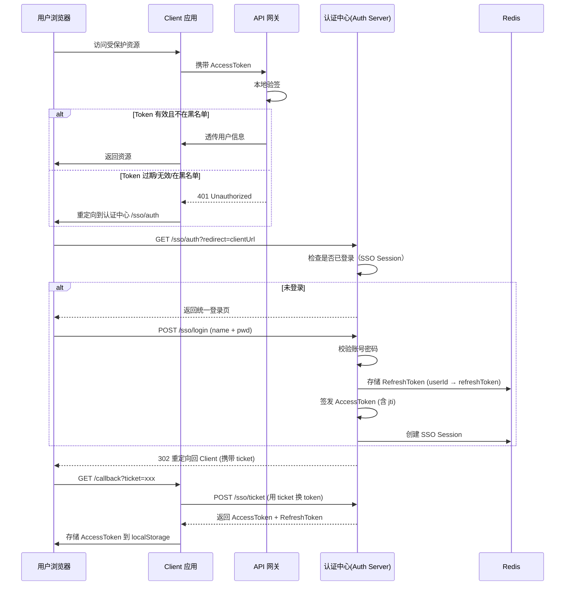
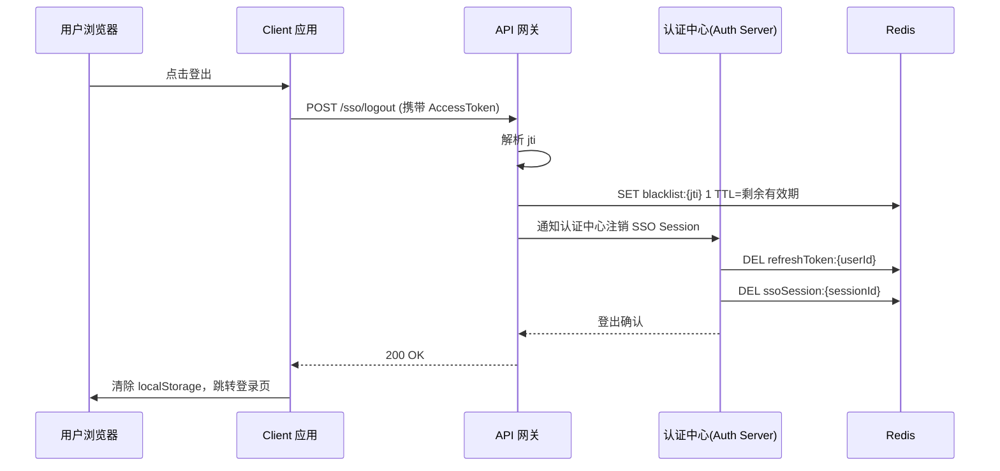
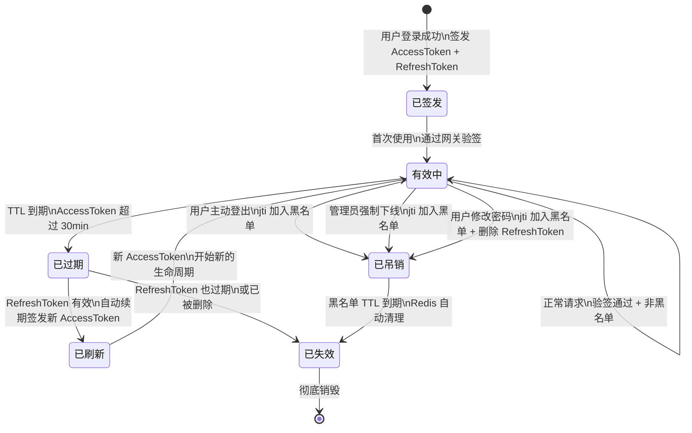

# RBAC 权限模块概要设计

## 文档信息

| 项目 | 内容 |
|------|------|
| 文档名称 | RBAC 权限模块概要设计 |
| 版本 | v1.2.0 |
| 创建日期 | 2026-03-30 |
| 最后更新 | 2026-04-25 |
| 负责人 | 技术经理（AI辅助） |
| 参考标准 | CCF微服务开发白皮书 v2.1 — 附录B.1 概要设计模板 |

> **⚠️ 部分内容已过期（2026-09-01）**：本仓库已拿掉多租户机制。本文中所有「租户管理
> 模块 / `tenant_id` 隔离 / `sys_tenant` 表 / 平台超级管理员 vs 租户管理员」相关描述
> 已不适用（租户管理整个模块已删除，`ADMIN` 现为唯一角色并持有全部权限）。
> 用户/角色/菜单/部门/字典/日志等其余模块的设计仍然有效，仅去掉 `tenant_id` 维度。
> 原因与替代方案见 `doc/design/modules/core/去多租户化-概要设计.md`。

---

# 一、项目概述

## 1.1 项目背景

车联网 SaaS 平台（Precision）是一个面向车队管理场景的多租户平台。RBAC 权限模块是平台的安全基础设施，需要实现**多租户数据隔离**和**细粒度权限控制**，确保不同企业客户之间的数据完全隔离，同时支持企业内部按角色、部门、菜单进行权限管控。

本模块是平台开发的**第一个模块**，为后续设备管理、车辆管理、实时监控等业务模块提供用户认证、权限校验和数据隔离能力。

## 1.2 项目目标

- **目标1**：实现多租户 SaaS 架构，支持企业客户数据完全隔离，租户级配置独立
- **目标2**：实现 RBAC 权限模型，支持菜单权限（页面+按钮）和数据权限（5 级范围控制）
- **目标3**：实现完整的系统管理功能（租户/用户/角色/菜单/部门/字典/日志），覆盖平台运营日常管理需求
- **目标4**：API 响应时间 P99 < 500ms，支持单租户 1000+ 用户并发

## 1.3 项目范围

### 1.3.1 功能范围（In Scope）

- 多租户管理：租户 CRUD、租户级配置、租户启用/禁用
- 用户管理：用户 CRUD、角色分配、密码管理、部门归属
- 角色管理：角色 CRUD、菜单权限分配、数据权限设置
- 菜单管理：三级菜单树（目录 > 菜单 > 按钮）管理
- 部门管理：多级部门树管理、负责人设置
- 字典管理：字典类型 + 字典数据管理、缓存刷新
- 日志管理：操作日志、登录日志、在线用户管理
- 认证系统：基于 Sa-Token 的登录/登出/Token 管理
- 数据权限：MyBatis-Flex 拦截器实现行级数据过滤

### 1.3.2 不在范围内（Out of Scope）

- 租户自助注册（首期由平台管理员手动创建）
- SSO 单点登录集成（首期仅支持账号密码登录；SSO 演进方案见 §7.2.4）
- OAuth2 第三方登录（后续迭代）
- 用户导入导出（P1 功能，后续迭代）
- 角色继承机制（首期不支持，角色之间独立）
- 数据权限的列级控制（首期仅行级过滤）

## 1.4 术语表

| 术语 | 英文 | 定义 |
|------|------|------|
| 租户 | Tenant | 平台上的企业客户，拥有独立数据空间 |
| RBAC | Role-Based Access Control | 基于角色的访问控制模型 |
| 数据权限 | Data Scope | 行级数据过滤，控制用户可查看的数据范围 |
| 菜单权限 | Menu Permission | 控制用户可访问的页面和操作按钮 |
| 数据隔离 | Data Isolation | 不同租户之间的数据完全隔离 |
| 雪花算法 | Snowflake ID | 分布式唯一 ID 生成算法 |
| 逻辑删除 | Soft Delete | 标记删除而非物理删除，保留审计记录 |

## 1.5 参考文档

| 文档名称 | 路径 | 说明 |
|----------|------|------|
| CCF微服务开发白皮书 v2.1 | `doc/standards/CCF微服务开发白皮书_v2.1.md` | 开发流程和模板标准 |
| RBAC 模块功能清单 | `doc/requirements/rbac/PRD-RBAC模块功能清单.md` | 需求功能总览 |
| 租户管理 PRD | `doc/requirements/rbac/PRD-租户管理.md` | 租户管理详细需求 |
| 用户管理 PRD | `doc/requirements/rbac/PRD-用户管理.md` | 用户管理详细需求 |
| 角色管理 PRD | `doc/requirements/rbac/PRD-角色管理.md` | 角色管理详细需求 |
| 菜单管理 PRD | `doc/requirements/rbac/PRD-菜单管理.md` | 菜单管理详细需求 |
| 部门管理 PRD | `doc/requirements/rbac/PRD-部门管理.md` | 部门管理详细需求 |
| 字典管理 PRD | `doc/requirements/rbac/PRD-字典管理.md` | 字典管理详细需求 |
| 日志管理 PRD | `doc/requirements/rbac/PRD-日志管理.md` | 日志管理详细需求 |
| RBAC SQL 迁移脚本 | `sql/rbac/V1.0.0 ~ V1.0.8` | 数据库 Schema 定义 |
| Figma Make 提示词 | `doc/requirements/figma-make-prompt.md` | 前端静态页面生成参考 |

---

# 二、技术选型

## 2.1 后端技术栈

| 技术 | 版本 | 用途 | 选型理由 |
|------|------|------|---------|
| Spring Boot | 3.2+ | 应用框架 | LTS 版本，生态成熟，Virtual Thread 支持 |
| JDK | 21 | 运行环境 | Virtual Thread 降低并发编程复杂度 |
| MyBatis-Flex | 1.11.6 | ORM 框架 | 原生多租户支持、数据权限拦截器、类型安全查询 |
| Sa-Token | 1.38.0 | 认证框架 | 轻量级，原生支持多端登录、权限验证、会话管理 |
| PostgreSQL | 16+ | 主数据库 | JSONB 支持、LISTEN/NOTIFY、成熟稳定 |
| Caffeine | 3.1+ | 本地缓存 | 高性能本地缓存，用于字典、权限等热点数据 |
| BCrypt | - | 密码加密 | Spring Security Crypto 内置，自适应成本因子 |
| Flyway | 10.x+ | 数据库版本管理 | SQL 迁移脚本版本控制 |
| JUnit 5 + Mockito | - | 单元测试 | TDD 开发标准 |

## 2.2 前端技术栈

| 技术 | 版本 | 用途 | 选型理由 |
|------|------|------|---------|
| React | 18+ | UI 框架 | 社区生态最丰富 |
| TypeScript | 5.x | 类型安全 | 编译期错误检测 |
| Ant Design | 5.x | UI 组件库 | 企业级 UI，与 RBAC 管理场景高度契合 |
| Zustand | 4.x | 状态管理 | 轻量简洁，无样板代码 |
| TanStack Query | 5.x | 数据请求 | 自动缓存、重试、乐观更新 |
| React Router | 6.x | 路由管理 | 声明式路由，动态路由支持权限过滤 |

## 2.3 中间件/基础设施

| 组件 | 版本 | 用途 |
|------|------|------|
| Docker Compose | - | 本地开发环境编排 |
| PostgreSQL | 16+ | 主数据存储 |
| Nginx | - | 反向代理、前端静态资源 |

---

# 三、模块概要设计

## 3.1 整体模块架构

```
┌─────────────────────────────────────────────────────────────────────────┐
│                         RBAC 权限模块                                     │
├─────────────────────────────────────────────────────────────────────────┤
│                                                                         │
│  ┌─────────────┐  ┌─────────────┐  ┌─────────────┐  ┌─────────────┐  │
│  │  租户管理    │  │  用户管理    │  │  角色管理    │  │  菜单管理    │  │
│  │  (Tenant)   │  │  (User)     │  │  (Role)     │  │  (Menu)     │  │
│  └──────┬──────┘  └──────┬──────┘  └──────┬──────┘  └──────┬──────┘  │
│         │                │                │                │           │
│         └────────┬───────┴───────┬────────┘                │           │
│                  │               │                         │           │
│  ┌───────────────▼───────────────▼───────────────┐  ┌─────▼─────────┐ │
│  │              核心权限引擎                        │  │  部门管理      │ │
│  │  ┌──────────┐ ┌──────────┐ ┌──────────────┐  │  │  (Dept)       │ │
│  │  │ 认证服务  │ │ 权限服务  │ │ 数据权限过滤  │  │  └───────────────┘ │
│  │  │ (Auth)   │ │ (Perm)   │ │ (DataScope)  │  │                    │
│  │  └──────────┘ └──────────┘ └──────────────┘  │  ┌───────────────┐ │
│  └───────────────────────────────────────────────┘  │  字典管理      │ │
│                                                      │  (Dict)       │ │
│  ┌───────────────┐  ┌───────────────┐               └───────────────┘ │
│  │  操作日志      │  │  登录日志      │               ┌───────────────┐ │
│  │  (OperLog)    │  │  (LoginLog)   │               │  在线用户      │ │
│  └───────────────┘  └───────────────┘               │  (Online)     │ │
│                                                      └───────────────┘ │
└─────────────────────────────────────────────────────────────────────────┘
```

## 3.2 模块设计规范

### 3.2.1 模块划分原则

| 原则 | 说明 |
|------|------|
| 单一职责 | 每个子模块只负责一类实体（如用户、角色、菜单） |
| 高内聚低耦合 | 子模块之间通过 Service 接口交互，禁止直接调用 Mapper |
| 租户透明 | 所有业务数据自动带 tenant_id，由框架层统一处理 |
| 权限统一 | 权限判断集中在拦截器/切面，业务代码不感知 |

### 3.2.2 模块包结构规范

```
com.gentry.rbac.{子模块}/
├── controller/       # REST 控制器
├── service/          # 业务接口
│   └── impl/        # 业务实现
├── mapper/           # MyBatis-Flex Mapper
├── entity/           # 数据库实体
├── dto/              # 请求对象
├── vo/               # 响应对象
└── enums/            # 枚举

# 权限核心基础设施（定义在 gentry-core 模块，详见 doc/design/modules/core/ 对应设计文档）
com.gentry.core/
├── config/             # Sa-Token 认证配置（SaTokenConfig, SecurityConfig）
├── datascope/          # 数据权限拦截器（@DataScope, DataScopeAspect, DataScopeHandler）
├── tenant/             # 多租户拦截器（GentryTenantManager, @IgnoreTenant）
├── annotation/         # 自定义注解（@RateLimit, @RepeatSubmit）
├── security/           # 上下文管理（UserContext）
├── entity/             # 实体基类（BaseEntity, TenantEntity）
├── common/             # 统一响应（R, ErrorCode, BizException）
├── interceptor/        # 自动填充（AutoFillHandler）
├── exception/          # 全局异常处理（GlobalExceptionHandler）
└── filter/             # 过滤器（TraceIdFilter, RequestLogFilter）

# StpInterface 权限接口实现（定义在 gentry-business 模块）
com.gentry.rbac.security/
└── StpInterfaceImpl.java   # Sa-Token SPI + SaSession 缓存
```

## 3.3 核心模块概要（按 5W1H 方法论描述）

### 3.3.1 租户管理模块

#### 设计目标 (What & Why)

- **是什么(What)**：管理平台上的企业客户（租户），每个租户拥有独立的数据空间。负责租户的全生命周期管理：创建、配置、启用/禁用。
- **为什么(Why)**：多租户是 SaaS 平台的核心基础。没有租户隔离，就无法为多个企业客户同时提供服务。租户管理确保了数据安全和业务隔离。

#### 定位与上下文 (Where & When)

- **在哪里(Where)**：位于 RBAC 模块最顶层，是其他所有模块的前置依赖。用户、角色、部门等数据都归属于某个租户。
- **在何时(When)**：平台运营人员创建新企业客户时、修改租户配置时、租户过期或违规禁用时触发。

#### 主要用户与交互方 (Who)

- **面向谁(Who)**：平台超级管理员（平台运营人员）。租户管理员只能管理本租户内部数据。

#### 实现思路与核心流程 (How)

- 创建租户时，事务内自动完成：创建租户 → 创建默认部门 → 创建管理员角色 → 创建管理员账号 → 分配全部菜单权限
- 租户配置存储为 JSONB，支持灵活的配置项扩展
- 租户禁用通过 Sa-Token 会话管理实现：禁用后踢出该租户所有在线用户

#### 预期效果与验收标准

- 单次租户创建响应时间 < 1s（含自动初始化）
- 租户级数据隔离 100%（禁止跨租户数据泄露）
- 租户配置实时生效

---

### 3.3.2 用户管理模块

#### 设计目标 (What & Why)

- **是什么(What)**：管理租户内的用户账号，包括用户的创建、编辑、角色分配、密码管理等。支持左树（部门树）右表（用户列表）的布局。
- **为什么(Why)**：用户是系统的最基本操作主体，所有业务操作都由用户发起。用户管理确保了正确的用户拥有正确的权限。

#### 定位与上下文 (Where & When)

- **在哪里(Where)**：依赖租户管理（确定租户归属）和部门管理（确定组织归属）。被角色管理引用（用户-角色多对多）。
- **在何时(When)**：管理员创建/编辑用户时、分配角色时、重置密码时。

#### 主要用户与交互方 (Who)

- **面向谁(Who)**：租户管理员。超级管理员可管理所有租户的用户。

#### 实现思路与核心流程 (How)

- 用户名在租户内唯一（联合唯一索引 `tenant_id + username + deleted`）
- 密码使用 BCrypt 加密，强度因子 10
- 角色分配通过中间表 `sys_user_role` 实现，支持多角色
- 用户创建时支持批量分配角色（Transfer 穿梭框交互）

#### 预期效果与验收标准

- 用户列表查询 P99 < 300ms（含部门筛选）
- 同一租户内用户名不可重复
- 密码不明文存储、不明文传输、不返回前端

---

### 3.3.3 角色管理模块

#### 设计目标 (What & Why)

- **是什么(What)**：管理租户内的角色定义，并为角色分配菜单权限和数据权限。角色是权限的载体，用户通过关联角色获得权限。
- **为什么(Why)**：RBAC 模型的核心——通过角色作为用户和权限之间的桥梁，简化权限管理。新增员工只需分配角色即可获得全部所需权限。

#### 定位与上下文 (Where & When)

- **在哪里(Where)**：依赖菜单管理（菜单权限来源）和部门管理（自定义数据权限来源）。被用户管理引用（用户-角色关联）。
- **在何时(When)**：管理员创建/编辑角色时、分配菜单权限时、设置数据权限范围时。

#### 主要用户与交互方 (Who)

- **面向谁(Who)**：租户管理员。超级管理员可管理系统级角色。

#### 实现思路与核心流程 (How)

- 角色编码在租户内唯一
- 菜单权限通过 `sys_role_menu` 中间表实现，支持树形勾选（父子联动）
- 数据权限分为 5 级：全部数据 > 本部门及子部门 > 本部门 > 仅本人 > 自定义
- 自定义数据权限通过 `sys_role_dept` 中间表指定部门列表
- 有关联用户的角色禁止删除（防止权限悬空）

#### 预期效果与验收标准

- 权限变更实时生效（缓存失效策略）
- 数据权限过滤对业务代码透明（拦截器自动追加 WHERE 条件）

---

### 3.3.4 菜单管理模块

#### 设计目标 (What & Why)

- **是什么(What)**：管理系统的三级菜单树结构（目录 > 菜单 > 按钮），定义权限标识和前端路由映射。
- **为什么(Why)**：菜单是前端路由和按钮权限的来源。菜单管理使得权限配置可视化、可动态调整，无需硬编码。

#### 定位与上下文 (Where & When)

- **在哪里(Where)**：菜单数据是全局共享的（不区分租户），所有租户使用相同的菜单结构。角色管理通过关联菜单来定义权限范围。
- **在何时(When)**：系统管理员新增/编辑菜单时、调整菜单排序时、发布新功能页面时。

#### 主要用户与交互方 (Who)

- **面向谁(Who)**：平台超级管理员（菜单是全局配置，非租户级）。

#### 实现思路与核心流程 (How)

- 菜单类型分 3 级：目录（type=1，容器）、菜单（type=2，页面）、按钮（type=3，操作权限）
- 每个菜单/按钮有唯一的 `permission` 标识（如 `system:user:add`）
- 前端根据用户角色的菜单权限，动态生成路由和渲染按钮
- 菜单删除时自动清除所有角色中对应的权限关联

#### 预期效果与验收标准

- 菜单变更后，角色权限树自动更新
- 按钮级权限控制精确到每个操作

---

### 3.3.5 部门管理模块

#### 设计目标 (What & Why)

- **是什么(What)**：管理租户内的组织架构树，支持多级部门、负责人设置。
- **为什么(Why)**：部门是数据权限的基础。角色通过「数据权限范围」关联部门，实现行级数据过滤。同时部门也是用户的组织归属。

#### 定位与上下文 (Where & When)

- **在哪里(Where)**：租户级数据。被用户管理引用（用户归属部门），被角色管理引用（数据权限范围）。
- **在何时(When)**：管理员创建/编辑部门时、调整组织架构时。

#### 主要用户与交互方 (Who)

- **面向谁(Who)**：租户管理员。

#### 实现思路与核心流程 (How)

- 使用 `parent_id + ancestors` 字段实现树结构，`ancestors` 存储从根到当前节点的路径（如 `0,1,5`）
- 支持快速查询所有子部门：`WHERE ancestors LIKE '0,1,5%'`
- 有用户或子部门的部门禁止删除
- 部门排序使用 `sort` 字段，前端按此排序展示

#### 预期效果与验收标准

- 部门树查询 < 100ms（缓存优化）
- 禁止删除有用户或子部门的部门

---

### 3.3.6 字典管理模块

#### 设计目标 (What & Why)

- **是什么(What)**：管理系统的枚举数据（如性别、职务、状态等），提供统一的下拉选项和标签展示能力。
- **为什么(Why)**：避免在业务代码中硬编码枚举值，实现枚举数据的可配置化。字典数据变更无需改代码、无需重新部署。

#### 定位与上下文 (Where & When)

- **在哪里(Where)**：租户级数据。被多个模块引用（用户管理的性别/职务字段、设备状态、报警级别等）。
- **在何时(When)**：管理员维护字典类型和数据项时、前端渲染下拉选项/Tag 标签时。

#### 主要用户与交互方 (Who)

- **面向谁(Who)**：租户管理员。

#### 实现思路与核心流程 (How)

- 字典分两层：`sys_dict_type`（字典类型）+ `sys_dict_data`（字典数据项）
- 字典数据项的 `css_class` 字段控制 Tag 颜色（primary/success/warning/danger/default）
- 字典数据启动时加载到 Caffeine 缓存，修改后触发缓存刷新
- 前端通过 `DictSelect` 和 `DictTag` 组件统一渲染

#### 预期效果与验收标准

- 字典数据从缓存读取，响应时间 < 10ms
- 缓存刷新后 1s 内全局生效

---

### 3.3.7 日志管理模块

#### 设计目标 (What & Why)

- **是什么(What)**：记录系统操作日志和用户登录日志，提供在线用户管理和强制下线能力。
- **为什么(Why)**：满足安全审计要求，支持问题追溯和安全事件分析。在线用户管理确保异常会话可及时终止。

#### 定位与上下文 (Where & When)

- **在哪里(Where)**：日志表通过 `tenant_id` 隔离。被所有需要审计的接口引用（通过 AOP 切面自动记录）。
- **在何时(When)**：用户执行操作时自动记录、用户登录/登出时自动记录、管理员查看日志或强制下线时。

#### 主要用户与交互方 (Who)

- **面向谁(Who)**：租户管理员（查看本租户日志）、平台超级管理员（查看所有日志）。

#### 实现思路与核心流程 (How)

- 操作日志通过 `@Log` 注解 + AOP 切面自动记录，对业务代码无侵入
- 日志记录异步化（Disruptor 队列或 Spring Async），不影响接口响应时间
- 登录日志在认证成功/失败后记录
- 在线用户通过 Sa-Token 会话管理实现，支持强制下线

#### 预期效果与验收标准

- 日志记录不影响接口性能（异步记录，耗时 < 5ms 额外开销）
- 日志查询支持多条件筛选 + 分页

---

# 四、部署架构

## 4.1 部署架构图

```
┌───────────────────────────────────────────────────────┐
│                    开发环境 (Docker Compose)             │
│                                                         │
│  ┌─────────────┐   ┌─────────────┐   ┌─────────────┐ │
│  │ Precision   │   │ PostgreSQL  │   │ Nginx       │ │
│  │ App         │──▶│ 16          │   │ (前端静态)   │ │
│  │ :8080       │   │ :5432       │   │ :80         │ │
│  └─────────────┘   └─────────────┘   └─────────────┘ │
│                                                         │
│  ┌─────────────┐                                       │
│  │ Redis       │  (后续引入，首期用 Caffeine)             │
│  │ :6379       │                                       │
│  └─────────────┘                                       │
└───────────────────────────────────────────────────────┘
```

## 4.2 环境规划

| 环境 | 用途 | 域名/地址 | 配置说明 |
|------|------|----------|----------|
| 本地开发 | 开发调试 | localhost:8080 | Docker Compose，H2/PostgreSQL |
| 测试环境 | 集成测试 | test.precision.io | Docker Compose，PostgreSQL |
| 预发布 | 预发布验证 | staging.precision.io | Kubernetes/单机，PostgreSQL |
| 生产 | 正式运行 | app.precision.io | Kubernetes/阿里云 ECS，RDS |

## 4.3 端口规划

| 服务 | 端口 | 协议 | 说明 |
|------|------|------|------|
| Precision App | 8080 | HTTP | REST API + WebSocket |
| PostgreSQL | 5432 | TCP | 数据库 |
| Netty TCP | 9200 | TCP | JT808 设备连接（后续模块） |
| Nginx | 80/443 | HTTP/HTTPS | 前端静态资源 + 反向代理 |

---

# 五、数据库设计

## 5.1 数据库规划

| 数据库 | 用途 | 字符集 | 备注 |
|--------|------|--------|------|
| precision | RBAC + 业务数据主库 | UTF-8 | PostgreSQL 16+ |

## 5.2 设计规范

### 5.2.1 命名规范

| 类型 | 命名格式 | 示例 |
|------|---------|------|
| 系统表 | `sys_{entity}` | sys_user, sys_role |
| 关联表 | `sys_{entity}_{entity}` | sys_user_role, sys_role_menu |
| 索引 | `idx_{table}_{columns}` | idx_user_tenant_dept |
| 唯一索引 | `uk_{table}_{columns}` | uk_tenant_code |

### 5.2.2 必备字段

| 字段 | 类型 | 说明 |
|------|------|------|
| id | BIGINT | 主键（雪花算法） |
| tenant_id | BIGINT | 租户ID（非全局表） |
| create_time | TIMESTAMP | 创建时间，自动填充 |
| update_time | TIMESTAMP | 更新时间，自动填充 |
| deleted | SMALLINT | 逻辑删除：0=正常，1=删除 |
| create_by | BIGINT | 创建人 |
| update_by | BIGINT | 更新人 |

### 5.2.3 类型映射

| Java 类型 | PostgreSQL 类型 | 说明 |
|-----------|----------------|------|
| Long | BIGINT | 主键、外键 |
| String | VARCHAR(n) | 文本，指定长度 |
| Integer | INT / SMALLINT | 整数 |
| Boolean | SMALLINT | 0/1 映射 |
| LocalDateTime | TIMESTAMP | 时间 |
| Map/Object | JSONB | JSON 数据 |

## 5.3 表清单总览

| 序号 | 表名 | 中文名 | 所属子模块 | 核心字段简述 |
|------|------|--------|-----------|-------------|
| 1 | sys_tenant | 租户表 | 租户管理 | id, code, name, status, config(JSONB) |
| 2 | sys_user | 用户表 | 用户管理 | id, tenant_id, username, password, dept_id, status |
| 3 | sys_user_role | 用户角色关联表 | 用户管理 | id, user_id, role_id |
| 4 | sys_role | 角色表 | 角色管理 | id, tenant_id, code, name, data_scope, status |
| 5 | sys_role_menu | 角色菜单关联表 | 角色管理 | id, role_id, menu_id |
| 6 | sys_role_dept | 角色部门关联表 | 角色管理 | id, role_id, dept_id |
| 7 | sys_menu | 菜单表 | 菜单管理 | id, parent_id, name, type, path, permission, component |
| 8 | sys_dept | 部门表 | 部门管理 | id, tenant_id, parent_id, name, ancestors, sort |
| 9 | sys_dict_type | 字典类型表 | 字典管理 | id, tenant_id, dict_name, dict_type |
| 10 | sys_dict_data | 字典数据表 | 字典管理 | id, tenant_id, dict_type, dict_label, dict_value, css_class |
| 11 | sys_oper_log | 操作日志表 | 日志管理 | id, tenant_id, module, type, operator, status, cost_time |
| 12 | sys_login_log | 登录日志表 | 日志管理 | id, tenant_id, username, login_ip, status, login_time |

## 5.4 ER 关系图



**关键关系说明：**

1. **Tenant → User/Role/Dept**：一对多，通过 `tenant_id` 实现租户隔离
2. **User ↔ Role**：多对多，通过 `sys_user_role` 中间表关联
3. **Role ↔ Menu**：多对多，通过 `sys_role_menu` 中间表关联
4. **Role ↔ Dept**：多对多（仅自定义数据权限），通过 `sys_role_dept` 中间表关联
5. **Dept → Dept**：自引用，通过 `parent_id` + `ancestors` 实现树结构
6. **Menu → Menu**：自引用，通过 `parent_id` 实现三级菜单树

---

# 六、接口规范

## 6.1 统一响应格式

### 6.1.1 响应码定义

| 范围 | 说明 |
|------|------|
| 0 | 成功 |
| 10001-10099 | 系统错误（系统异常、参数校验、方法不支持等） |
| 20001-20099 | RBAC 业务错误（用户、角色、菜单、租户、部门等） |
| 30001-30099 | 认证/数据错误（Token、权限、数据存在性等） |
| 40001-40099 | 安全控制（限流、重复提交等） |
| 50001-50099 | 设备错误（预留，设备通信、协议等） |

### 6.1.2 成功响应格式

```json
{
  "code": 0,
  "message": "success",
  "data": {},
  "timestamp": 1711708800000,
  "traceId": "abc123"
}
```

### 6.1.3 失败响应格式

```json
{
  "code": 20001,
  "message": "租户不存在",
  "data": null,
  "timestamp": 1711708800000,
  "traceId": "abc123"
}
```

## 6.2 统一错误码

| 错误码 | 枚举名 | 说明 |
|--------|--------|------|
| 10001 | SYSTEM_ERROR | 系统异常 |
| 10002 | PARAM_ERROR | 参数校验失败 |
| 10003 | METHOD_NOT_ALLOWED | 请求方法不允许 |
| 10004 | PARAM_TYPE_MISMATCH | 请求参数类型不匹配 |
| 10005 | HTTP_MESSAGE_NOT_READABLE | HTTP消息不可读 |
| 20001 | TENANT_NOT_FOUND | 租户不存在 |
| 20002 | TENANT_CODE_EXISTS | 租户编码已存在 |
| 20003 | TENANT_DISABLED | 租户已禁用 |
| 20004 | TENANT_EXPIRED | 租户已过期 |
| 20005 | ROLE_CODE_EXISTS | 角色编码已存在 |
| 20006 | ROLE_IN_USE | 角色正在使用中（角色下存在用户，禁止删除） |
| 20007 | USERNAME_EXISTS | 用户名已存在 |
| 20008 | PHONE_EXISTS | 手机号已存在 |
| 20009 | USER_DISABLED | 用户已禁用 |
| 20010 | OLD_PASSWORD_ERROR | 原密码错误 |
| 20011 | DEPT_HAS_CHILDREN | 部门下存在子部门，禁止删除 |
| 20012 | DEPT_NAME_EXISTS | 部门名称已存在 |
| 20013 | USER_NOT_FOUND | 用户不存在 |
| 20014 | MENU_HAS_CHILDREN | 菜单下存在子菜单，禁止删除 |
| 20015 | ROLE_NOT_FOUND | 角色不存在 |
| 20016 | DICT_TYPE_EXISTS | 字典类型已存在 |
| 20017 | DICT_TYPE_IN_USE | 字典类型正在使用中，禁止删除 |
| 20018 | LOGIN_FAILED | 用户名或密码错误 |
| 30001 | TOKEN_INVALID | Token无效（未登录） |
| 30002 | TOKEN_EXPIRED | Token已过期 |
| 30003 | PERMISSION_DENIED | 权限不足（无权限） |
| 30010 | DATA_EXISTS | 数据已存在 |
| 30011 | DATA_NOT_FOUND | 数据不存在 |
| 40001 | TOO_MANY_REQUESTS | 请求过于频繁 |
| 40002 | DUPLICATE_SUBMIT | 重复提交 |
| 40003 | CANNOT_DELETE_SELF | 不能删除当前登录用户 |

## 6.3 API 设计规范

### 6.3.1 命名规范

| 操作 | 方法 | URL | 说明 |
|------|------|-----|------|
| 列表查询 | GET | `/api/v1/{module}` | 分页、筛选 |
| 详情查询 | GET | `/api/v1/{module}/{id}` | 单个查询 |
| 创建 | POST | `/api/v1/{module}` | 新增 |
| 全量更新 | PUT | `/api/v1/{module}/{id}` | 全量更新 |
| 删除 | DELETE | `/api/v1/{module}/{id}` | 逻辑删除 |
| 状态切换 | PUT | `/api/v1/{module}/{id}/status` | 启用/禁用 |

### 6.3.2 版本管理

- API 路径包含版本号：`/api/v1/`
- 大版本升级时新增版本路径（如 `/api/v2/`）
- 小版本升级向下兼容

### 6.3.3 请求/响应规范

**分页请求：**

```json
{
  "pageNum": 1,
  "pageSize": 10,
  "keyword": "搜索关键词",
  "status": 1
}
```

**分页响应：**

```json
{
  "code": 0,
  "message": "success",
  "data": {
    "list": [],
    "total": 100,
    "pageNum": 1,
    "pageSize": 10,
    "pages": 10
  }
}
```

**树结构响应：**

```json
{
  "code": 0,
  "message": "success",
  "data": [
    {
      "id": 1,
      "name": "系统管理",
      "children": [...]
    }
  ]
}
```

## 6.4 接口安全规范

| 安全项 | 要求 |
|--------|------|
| 认证 | 所有接口（除登录外）需携带 Sa-Token |
| 鉴权 | 通过 `@SaCheckPermission` 注解校验菜单/按钮权限 |
| 数据隔离 | MyBatis-Flex TenantInterceptor 自动追加 `tenant_id` 条件 |
| 数据权限 | MyBatis-Flex DataScopeInterceptor 自动追加部门过滤条件 |
| 参数校验 | `@Valid` + JSR 303 注解 |
| 防重放 | Sa-Token 内置防重放机制 |
| 操作日志 | `@Log` 注解自动记录操作审计日志 |

## 6.5 接口性能规范

| 接口类型 | 响应时间要求 | 缓存策略 |
|---------|------------|---------|
| 登录/登出 | P99 < 500ms | 无 |
| 列表查询 | P99 < 300ms | 字典/权限数据走缓存 |
| 详情查询 | P99 < 200ms | 无 |
| 创建/编辑 | P99 < 500ms | 操作后清除相关缓存 |
| 树结构查询 | P99 < 100ms | 部门树/菜单树缓存 |

---

# 七、项目整体安全规范

## 7.1 安全设计原则

| 原则 | 说明 |
|------|------|
| 最小权限 | 用户仅拥有完成工作所需的最低权限 |
| 纵深防御 | 认证 + 鉴权 + 数据隔离 + 数据权限，多层防护 |
| 安全默认 | 新创建用户默认禁用或最小权限，需管理员手动启用/分配 |
| 审计完整 | 所有敏感操作有日志记录，不可篡改 |

## 7.2 认证与授权

### 7.2.1 认证机制

- **框架**：Sa-Token
- **Token 类型**：UUID Token（Sa-Token 默认模式，基于服务端 Session）
- **Token 有效期**：2 小时，支持续签
- **Token 存储**：前端 localStorage，请求通过 Header 携带
- **登录方式**：首期仅支持账号密码登录

**认证白名单（无需 Token 即可访问）：**

| 路径 | 说明 |
|------|------|
| `/api/v1/tenants/options` | 租户选项列表（公开接口，登录页选择租户用） |
| `/api/v1/auth/captcha` | 验证码接口 |
| `/api/v1/auth/login` | 登录接口 |
| `/doc.html` | Knife4j API 文档页面 |
| `/webjars/**` | Swagger 静态资源 |
| `/v3/api-docs/**` | OpenAPI 规范 |
| `/swagger-ui/**` | Swagger UI |

### 7.2.2 授权机制

- **菜单权限**：用户登录后，根据角色获取可访问的菜单列表，前端动态渲染路由
- **按钮权限**：前端根据权限标识控制按钮显示/隐藏，后端通过 `@SaCheckPermission` 强制校验
- **数据权限**：MyBatis-Flex 拦截器在 SQL 执行前自动追加 WHERE 条件

### 7.2.3 会话管理

| 安全项 | 策略 |
|--------|------|
| 并发登录 | 首期允许多端同时在线 |
| 会话超时 | 2 小时无操作自动过期 |
| 强制下线 | 管理员可通过在线用户管理强制踢出 |
| 租户禁用 | 禁用后踢出该租户全部在线会话 |

### 7.2.4 SSO 演进方案（JWT + Redis 黑名单）

> **阶段定位**：首期使用 Sa-Token UUID Token（基于服务端 Session），满足单体应用认证需求。当平台演进到微服务/多系统架构时，切换为 **JWT + Redis 黑名单** 方案实现 SSO。

#### 为什么选择 JWT + 黑名单

| 维度 | 说明 |
|------|------|
| **SSO 核心诉求** | 一次登录全系统通行，一次登出全系统失效。纯 JWT 无法主动吊销，黑名单补上这个缺口 |
| **适合场景** | 需要即时吊销、全局登出、改密码踢设备的企业后台/中台系统（完全匹配本平台定位） |
| **不适合场景** | 极致无状态/零存储依赖/超大规模且不需要主动吊销的纯网关透传场景（非本平台需求） |
| **参考实现** | Sa-Token SSO Pro（模式二），业务流程可复用，Token 机制替换为 JWT |

#### JWT 双 Token 方案

| Token 类型 | 有效期 | 存储位置 | 用途 |
|------------|--------|---------|------|
| **AccessToken** | 15–30 min | 前端 localStorage | 接口鉴权，Payload 含 `jti`/`sub`/`exp`/`tenantId` |
| **RefreshToken** | 7–30 天 | Redis（服务端） | 无感续期，改密码时删除即强制重新登录 |

#### Redis 黑名单设计

```
Key:   blacklist:{jti}
Value: 1
TTL:   = AccessToken 剩余有效期（过期自动清理，无需后台任务）
```

**触发黑名单的场景：**

| 场景 | 操作 |
|------|------|
| 用户主动登出 | 当前 AccessToken 的 jti 加入黑名单 |
| 管理员强制下线 | 该用户所有 AccessToken 的 jti 批量加入黑名单 |
| 用户修改密码 | 删除 Redis 中该用户的 RefreshToken，当前 jti 加入黑名单 |
| 账号被封禁 | 该用户所有 jti 批量加入黑名单 |

#### 网关统一校验流程

所有请求在网关层执行：

1. **验签** — 本地校验 JWT 签名（无需远程调用）
2. **查黑名单** — `EXISTS blacklist:{jti}`（Redis O(1) 操作）
3. **透传用户信息** — 解析 Payload 中的 `userId`/`tenantId`/`roles` 写入请求头

下游业务服务不再重复校验，直接从请求头读取用户上下文。

#### SSO 登录时序图



#### SSO 登出时序图



#### Token 生命周期状态图



#### 与当前 Sa-Token 方案的演进对照

| 维度 | 当前（首期） | SSO 演进后 |
|------|------------|-----------|
| Token 类型 | UUID（Sa-Token 默认） | JWT（含 jti/exp/sub） |
| 会话存储 | Redis 存完整会话 | Redis 仅存黑名单 + RefreshToken |
| Token 校验 | 必须查 Redis | 本地验签 + O(1) 查黑名单 |
| 权限校验框架 | Sa-Token（保留） | Sa-Token（保留，仅 Token 机制变更） |
| 改密码踢设备 | 删 Redis 会话 | 删 RefreshToken + jti 入黑名单 |
| 适用架构 | 单体应用 | 微服务/多系统 SSO |

## 7.3 数据安全

### 7.3.1 敏感数据分类

| 数据类型 | 安全等级 | 存储要求 | 传输要求 | 展示要求 |
|----------|----------|----------|----------|----------|
| 用户密码 | 高 | BCrypt 加密 | HTTPS | 禁止展示 |
| 手机号 | 中 | 明文存储 | HTTPS | 脱敏展示 138****1234 |
| 身份证号 | 高 | 加密存储 | HTTPS | 脱敏展示 |
| 邮箱 | 低 | 明文存储 | HTTPS | 完整展示 |

### 7.3.2 数据加密规范

- 密码：BCrypt，成本因子 10
- Token：Sa-Token 内置签名机制
- 数据库连接：SSL 可选（生产环境建议开启）

### 7.3.3 数据脱敏规范

- 手机号：保留前 3 后 4 位，中间 `****`
- 用户列表中的手机号默认脱敏，点击可查看完整
- 操作日志中的请求参数自动脱敏（密码字段不记录）

## 7.4 通信安全

| 安全项 | 要求 |
|--------|------|
| 传输加密 | 生产环境强制 HTTPS |
| CORS | 仅允许配置的前端域名 |
| CSRF | Sa-Token 内置防护 |

## 7.5 输入安全

| 安全项 | 措施 |
|--------|------|
| 参数校验 | `@Valid` + JSR 303（`@NotBlank`, `@Size`, `@Pattern` 等） |
| SQL 注入 | MyBatis-Flex 参数化查询，禁止拼接 SQL |
| XSS | 前端输入过滤 + 后端 `HtmlUtils.htmlEscape()` |
| 文件上传 | 首期无文件上传需求 |

## 7.6 日志与审计

### 7.6.1 安全日志规范

- 登录成功/失败：记录 IP、时间、浏览器、操作系统
- 权限变更：记录操作人、变更内容、变更前后对比
- 敏感操作：记录完整的请求参数和响应结果

### 7.6.2 操作审计规范

- 所有写操作（新增/编辑/删除）自动记录操作日志
- 通过 `@Log` 注解声明式配置，对业务代码无侵入
- 日志不可编辑、不可删除（仅支持清理过期日志）

## 7.7 安全检查清单

- [x] 所有接口是否启用认证？
- [x] 敏感操作是否有权限控制？
- [x] 密码是否加密存储？
- [x] 敏感数据是否脱敏展示？
- [ ] 是否启用 HTTPS？（生产环境部署时配置）
- [x] 是否有 SQL 注入防护？
- [x] 是否有 XSS 防护？
- [x] 操作日志是否完整？

---

# 八、附录

## 8.1 代码审查清单

### 概要设计阶段后审查要点

| 审查项 | 说明 |
|--------|------|
| 租户隔离 | 所有业务查询是否自动带 tenant_id？ |
| 权限校验 | 所有接口是否配置了正确的权限标识？ |
| 数据权限 | 列表查询是否经过 DataScope 拦截器？ |
| 密码安全 | 密码是否 BCrypt 加密？是否脱敏？ |
| 日志记录 | 敏感操作是否添加了 @Log 注解？ |
| 异常处理 | 异常是否返回统一格式？是否泄露敏感信息？ |
| 参数校验 | 请求参数是否使用 @Valid 校验？ |
| SQL 安全 | 是否存在 SQL 拼接？MyBatis 是否参数化？ |

## 8.2 子模块详细设计清单

以下子模块需要编写详细设计文档（后端详细设计 + 前端详细设计），位于 `doc/design/modules/rbac/modules/` 目录：

| 序号 | 子模块 | 优先级 | PRD 文档 | 状态 |
|------|--------|--------|---------|------|
| 1 | 租户管理 | P0 | `PRD-租户管理.md` | 待详细设计 |
| 2 | 用户管理 | P0 | `PRD-用户管理.md` | 待详细设计 |
| 3 | 角色管理 | P0 | `PRD-角色管理.md` | 待详细设计 |
| 4 | 菜单管理 | P0 | `PRD-菜单管理.md` | 待详细设计 |
| 5 | 部门管理 | P0 | `PRD-部门管理.md` | 待详细设计 |
| 6 | 字典管理 | P1 | `PRD-字典管理.md` | 待详细设计 |
| 7 | 日志管理 | P1 | `PRD-日志管理.md` | 待详细设计 |
| 8 | 公共基础设施 | P0 | - | 后端详细设计（详见 `doc/design/modules/core/`） |
| 9 | 默认租户与登录模式 | P0 | - | 前后端各 1 份详细设计 |
| 10 | 登录菜单动态渲染 | P0 | - | 前端详细设计 |

## 8.3 架构图清单

| 图名称 | 格式 | 路径 | 说明 |
|--------|------|------|------|
| RBAC 模块架构图 | DrawIO | `doc/design/modules/rbac/RBAC模块架构图.drawio` | 模块关系和分层架构 |
| 权限判断流程图 | Mermaid | 见 PRD-RBAC模块功能清单.md §4.2 | 权限判断流程 |
| 数据库 ER 图 | Mermaid | 见本文档 §5.4 | 实体关系 |

---

## 变更记录

| 版本 | 日期 | 修改人 | 变更内容 | 变更原因 | 评审人 |
|------|------|--------|---------|---------|--------|
| v1.0.0 | 2026-03-30 | 技术经理（AI） | 初始版本 | RBAC 模块概要设计 | 待评审 |
| v1.1.0 | 2026-04-25 | 技术经理（AI） | 修正包结构指向 gentry-core；ErrorCode 改为 5 段方案；补充子模块清单（公共基础设施、默认租户与登录模式、登录菜单动态渲染）；补充认证白名单；Token 描述改为 Sa-Token UUID 模式；补充错误码 20012-20018 | 与 CLAUDE.md 全局基础设施保持一致 | 待评审 |
| v1.2.0 | 2026-05-05 | 技术经理（AI） | 1.3.2 补充 SSO 演进路径引用；新增 §7.2.4 SSO 演进方案（JWT+Redis 黑名单）：含双 Token 方案、黑名单设计、网关校验流程、SSO 登录/登出时序图、Token 生命周期状态图、与当前方案对照表 | 补充 SSO 架构演进设计，明确 JWT+黑名单是适合本平台的 SSO 方案 | 待评审 |
| v1.1.1 | 2026-04-30 | 技术经理（AI） | 统一错误码表与代码实现 ErrorCode.java 对齐；补充 10003-10005、30001-30011、40001-40003 错误码；增加枚举名列 | 文档与代码一致性核对修复 | 待评审 |
