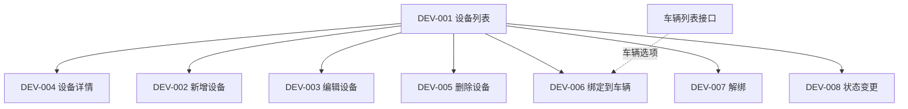
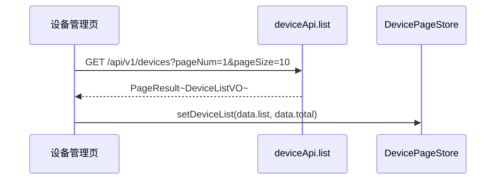
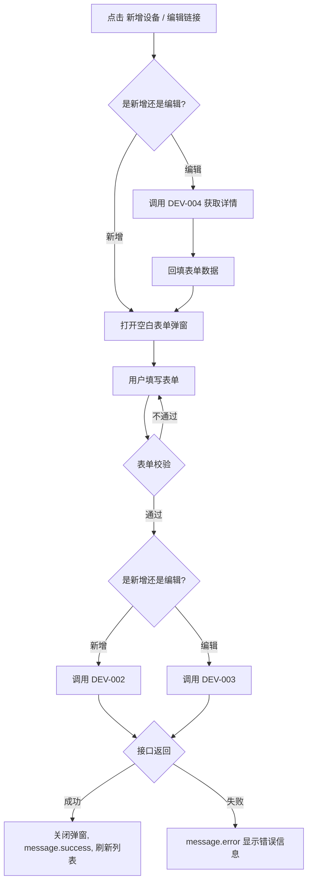
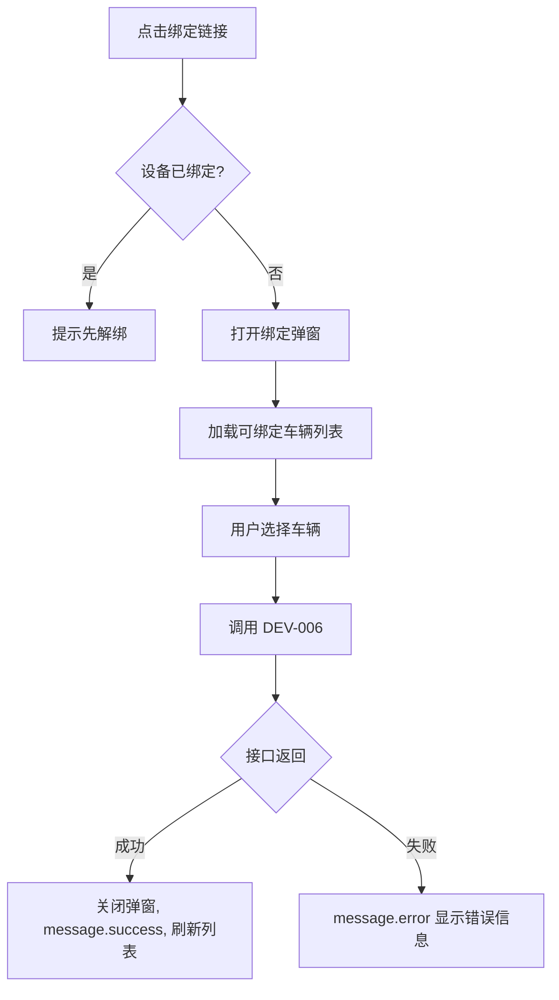
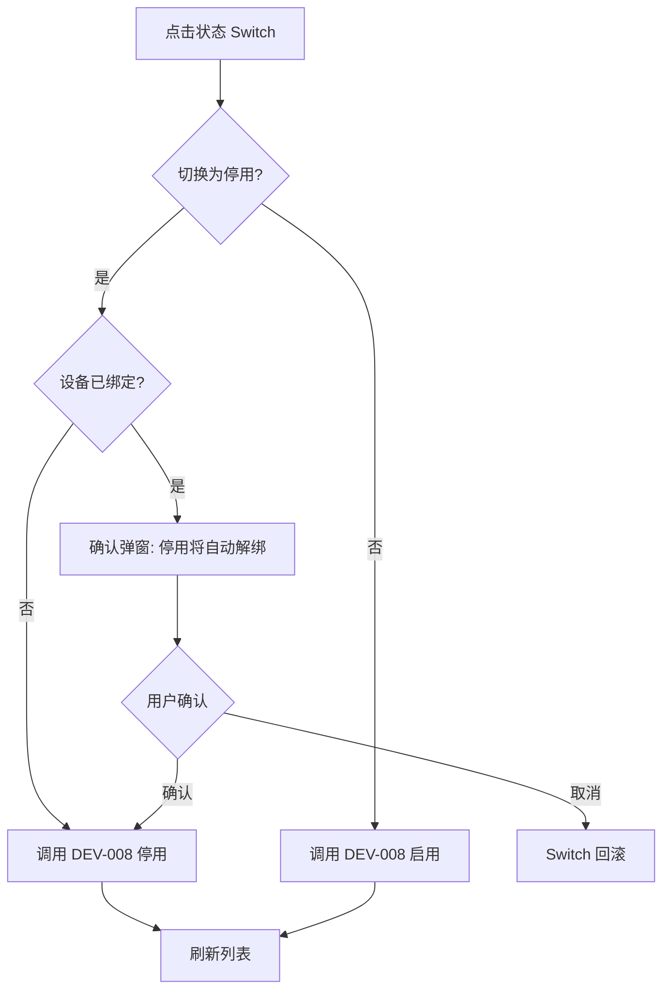
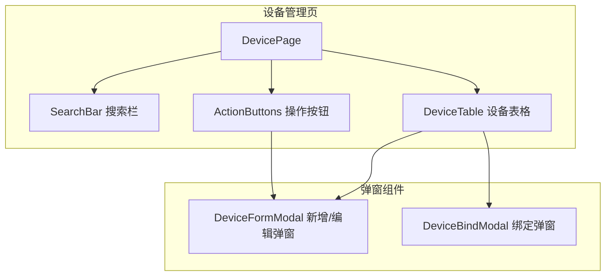

# 前端详细设计文档

## 文档信息

| 项目 | 内容 |
|------|------|
| 文档名称 | 设备管理 前端详细设计文档 |
| 对应后端模块 | 设备管理（模块标识：device） |
| 参考文档 | `doc/design/modules/device/modules/设备管理/后端详细设计.md` |
| 静态页面 | 暂无（待创建） |
| 版本 | v1.0.0 |
| 创建日期 | 2026-04-12 |
| 最后更新 | 2026-04-12 |
| 负责人 | 前端开发（AI辅助） |

---

# 一、模块概述

## 1.1 模块功能描述

本模块前端实现**设备管理**功能：

- **设备列表**：分页展示设备列表，支持按 SN、SIM 卡号、协议类型、在线状态、绑定状态多维筛选
- **设备 CRUD**：新增、编辑、删除设备，查看设备详情
- **设备绑定**：将设备绑定到车辆（弹窗选择车辆）、解绑操作
- **状态管理**：设备启用/停用切换

## 1.2 模块边界与职责

| 职责 | 说明 |
|------|------|
| **本模块负责** | 设备列表页、设备新增/编辑弹窗、设备绑定弹窗、状态切换、在线状态展示 |
| **其他模块负责** | 车辆列表数据（车辆管理模块 API 提供）、设备在线状态更新（协议网关负责） |

## 1.3 用户角色与权限

| 角色 | 可执行操作 | 对应权限标识 |
|------|----------|-------------|
| 运维人员 | 设备 CRUD、绑定/解绑、启用/停用 | device:list / add / edit / delete / bind |
| 车队管理员 | 查看设备列表、绑定/解绑 | device:list / bind |

---

# 二、接口调用总览

## 2.1 接口引用说明

| 接口标识 | 接口名称 | HTTP方法 | 路径 | 主要用途 | 对应后端文档章节 |
|----------|----------|----------|------|----------|-----------------|
| DEV-001 | 设备列表查询 | GET | /api/v1/devices | 列表页加载 | §7.2 DEV-001 |
| DEV-002 | 新增设备 | POST | /api/v1/devices | 新增弹窗提交 | §7.2 DEV-002 |
| DEV-003 | 编辑设备 | PUT | /api/v1/devices/{id} | 编辑弹窗提交 | §7.2 DEV-003 |
| DEV-004 | 设备详情 | GET | /api/v1/devices/{id} | 编辑弹窗回填/详情查看 | §7.2 DEV-004 |
| DEV-005 | 删除设备 | DELETE | /api/v1/devices/{id} | 列表删除按钮 | §7.2 DEV-005 |
| DEV-006 | 绑定到车辆 | POST | /api/v1/devices/{id}/bind | 绑定弹窗提交 | §7.2 DEV-006 |
| DEV-007 | 解绑 | POST | /api/v1/devices/{id}/unbind | 列表解绑操作 | §7.2 DEV-007 |
| DEV-008 | 状态变更 | PUT | /api/v1/devices/{id}/status | 列表状态 Switch | §7.2 DEV-008 |
| DEV-009 | 未绑定设备列表 | GET | /api/v1/devices/unbound | 车辆管理绑定设备弹窗 | §7.2 DEV-009 |

**跨模块接口依赖：**

| 接口 | 来源模块 | 用途 |
|------|---------|------|
| 未绑定设备的车辆列表 | 车辆管理 | 绑定弹窗中车辆选项（待定义） |

## 2.2 接口依赖关系



---

# 三、页面详细设计

## 3.1 页面清单

| 页面名称 | 路由路径 | 页面功能描述 | 关联接口列表 |
|----------|----------|--------------|--------------|
| 设备管理页 | /vehicle/devices | 设备列表、CRUD、绑定管理 | DEV-001~008, 车辆列表 |

## 3.2 页面跳转关系


**说明**：设备管理页通过侧边栏菜单「车辆管理 > 设备管理」进入。页面为纯列表页，所有操作通过弹窗完成。

---

# 四、页面初始化流程设计

## 4.1 设备管理页初始化流程

### 4.1.1 接口调用序列

| 顺序 | 接口 | 并行/串行 | 说明 |
|------|------|----------|------|
| 1 | DEV-001 设备列表 | 单一调用 | 加载设备列表（默认不带筛选条件） |

### 4.1.2 初始化时序图



### 4.1.3 初始化数据流

1. 设备列表接口返回 `PageResult<DeviceListVO>` → `list` 渲染表格行，`total` 渲染分页器
2. 搜索栏使用静态选项数据（协议类型、在线状态、绑定状态为固定枚举）

---

# 五、用户操作流程设计

## 5.1 操作-接口映射表

| 用户操作描述 | 触发组件 | 调用接口 | 请求参数构造 | 响应数据处理 | 异常处理 |
|-------------|---------|---------|-------------|-------------|---------|
| 点击搜索按钮 | 搜索按钮 | DEV-001 | 从搜索表单收集 deviceSn, simNumber, protocolType, onlineStatus, bindStatus | 重置表格数据和分页 | message.error 提示 |
| 点击重置按钮 | 重置按钮 | — | 清空搜索表单，重置分页，重新调用 DEV-001 | — | — |
| 点击新增设备 | 新增按钮 | DEV-002 | 弹窗表单数据组装为 DeviceCreateDTO | 关闭弹窗，刷新列表 | 表单校验失败阻止提交 |
| 点击编辑设备 | 编辑链接 | DEV-004 → DEV-003 | 先调详情回填，提交时组装 DeviceUpdateDTO | 关闭弹窗，刷新列表 | — |
| 点击删除设备 | 删除链接 | DEV-005 | 取行记录 deviceId | 刷新列表 | 二次确认后调用 |
| 点击切换状态 | 状态 Switch | DEV-008 | 取行记录 deviceId + 反转的 status 值 | 刷新列表 | Switch 回滚到原状态 |
| 点击绑定 | 绑定链接 | DEV-006 | 弹窗选择车辆，组装 DeviceBindDTO | 关闭弹窗，刷新列表 | — |
| 点击解绑 | 解绑链接 | DEV-007 | 取行记录 deviceId | 刷新列表 | 二次确认后调用 |

## 5.2 复杂操作流程

### 5.2.1 新增/编辑设备流程



### 5.2.2 设备绑定到车辆流程



### 5.2.3 停用设备流程



---

# 六、组件设计

## 6.1 组件结构图



## 6.2 组件清单

| 组件名称 | 组件类型 | 主要职责 | 直接调用接口 | 父组件 | 子组件 |
|----------|----------|----------|-------------|--------|--------|
| DevicePage | 页面 | 设备管理页布局和逻辑 | DEV-001 | App | SearchBar, ActionButtons, DeviceTable |
| SearchBar | 业务组件 | 设备搜索表单 | — | DevicePage | — |
| ActionButtons | UI 组件 | 新增/批量删除等按钮 | — | DevicePage | — |
| DeviceTable | 业务组件 | 设备列表表格 | DEV-005, DEV-007, DEV-008 | DevicePage | — |
| DeviceFormModal | 业务组件 | 新增/编辑设备弹窗 | DEV-002, DEV-003, DEV-004 | DevicePage | — |
| DeviceBindModal | 业务组件 | 设备绑定弹窗 | DEV-006, 车辆列表接口 | DevicePage | — |

## 6.3 关键组件详细设计

### 6.3.1 DevicePage 组件

- **状态管理**：使用 `useState` + `useEffect` 管理列表数据和搜索条件
- **初始化**：页面挂载时调用 DEV-001 加载设备列表
- **事件处理**：
  - `handleSearch(values)` — 搜索按钮回调
  - `handleReset()` — 重置按钮回调
  - `handleAdd()` — 打开新增弹窗
  - `handleEdit(deviceId)` — 打开编辑弹窗
  - `handleDelete(deviceId)` — 删除确认
  - `handleBind(deviceId)` — 打开绑定弹窗
  - `handleUnbind(deviceId)` — 解绑确认
  - `handleStatusChange(deviceId, status)` — 状态切换
  - `handleFormSuccess()` — 弹窗提交成功回调（刷新列表）

### 6.3.2 SearchBar 组件

- **Props 设计**：

| Prop | 类型 | 说明 |
|------|------|------|
| onSearch | (values: SearchValues) => void | 搜索回调 |
| onReset | () => void | 重置回调 |
| loading | boolean | 搜索中状态 |

- **表单字段**：

| 字段 | 组件 | 说明 |
|------|------|------|
| deviceSn | Input | 设备SN，前缀匹配 |
| simNumber | Input | SIM卡号，前缀匹配 |
| protocolType | Select | 协议类型：全部/JT808-2011/JT808-2019/JT1078/32960 |
| onlineStatus | Select | 在线状态：全部/在线/离线 |
| bindStatus | Select | 绑定状态：全部/已绑定/未绑定 |

### 6.3.3 DeviceTable 组件

- **Props 设计**：

| Prop | 类型 | 说明 |
|------|------|------|
| dataSource | DeviceListVO[] | 列表数据 |
| loading | boolean | 加载中状态 |
| pagination | PaginationProps | 分页配置 |
| onEdit | (deviceId: number) => void | 编辑回调 |
| onDelete | (deviceId: number) => void | 删除回调 |
| onBind | (deviceId: number) => void | 绑定回调 |
| onUnbind | (deviceId: number) => void | 解绑回调 |
| onStatusChange | (deviceId: number, status: number) => void | 状态切换回调 |

- **列配置**：

| 列名 | dataIndex | 渲染方式 |
|------|-----------|---------|
| 设备SN | deviceSn | 文本 |
| SIM卡号 | simNumber | 文本，无值显示 `—` |
| 协议类型 | protocolType | Tag（JT808=blue, JT1078=orange, 32960=green） |
| 在线状态 | onlineStatus | Badge（在线=green ●, 离线=gray ○） |
| 绑定对象 | bindTargetName | 图标+文本（🚗车牌号 / "未绑定"灰色） |
| 最后在线 | lastOnlineTime | 时间格式化 |
| 状态 | status | Switch（需 device:edit 权限） |
| 操作 | — | 编辑 / 详情 / 绑定或解绑 / 删除 |

- **操作列逻辑**：

```
操作列渲染规则：
- [编辑] → 需 device:edit 权限，始终显示
- [绑定] → 需 device:bind 权限，仅 bindType 为空时显示
- [解绑] → 需 device:bind 权限，仅 bindType 不为空时显示
- [删除] → 需 device:delete 权限，始终显示
  - 已绑定设备点击删除时提示"请先解绑设备"
```

### 6.3.4 DeviceFormModal 组件

- **接口调用设计**：
  - 编辑模式：打开时调用 DEV-004 获取详情，回填表单
  - 提交时：新增调用 DEV-002，编辑调用 DEV-003
- **Props 设计**：

| Prop | 类型 | 说明 |
|------|------|------|
| open | boolean | 弹窗显隐 |
| deviceId | number \| null | null 为新增模式，有值为编辑模式 |
| onSuccess | () => void | 操作成功回调 |
| onCancel | () => void | 取消回调 |

- **表单字段**：

| 字段 | 组件 | 必填 | 校验规则 | 编辑模式 |
|------|------|------|---------|---------|
| deviceSn | Input | 是 | 5-30字符，字母数字 | 禁用（不可修改） |
| simNumber | Input | 否 | 11-20位数字 | 可编辑 |
| iccid | Input | 否 | 20位 | 可编辑 |
| protocolType | Select | 是 | 1/2/3/4 | 可编辑 |
| deviceModel | Input | 否 | ≤50字符 | 可编辑 |
| manufacturer | Input | 否 | ≤50字符 | 可编辑 |
| firmwareVer | Input | 否 | ≤30字符 | 可编辑 |
| remark | TextArea | 否 | ≤500字符 | 可编辑 |

- **协议类型选项**：

```typescript
const protocolOptions = [
  { value: 1, label: 'JT808-2011' },
  { value: 2, label: 'JT808-2019' },
  { value: 3, label: 'JT1078' },
  { value: 4, label: '国标32960' },
];
```

### 6.3.5 DeviceBindModal 组件

- **接口调用设计**：
  - 打开时加载可绑定车辆列表（未绑定设备的车辆）
  - 提交时调用 DEV-006 绑定到车辆
- **Props 设计**：

| Prop | 类型 | 说明 |
|------|------|------|
| open | boolean | 弹窗显隐 |
| deviceId | number | 目标设备 ID |
| deviceSn | string | 设备SN（显示用） |
| onSuccess | () => void | 操作成功回调 |
| onCancel | () => void | 取消回调 |

- **表单字段**：

| 字段 | 组件 | 必填 | 说明 |
|------|------|------|------|
| 当前设备 | 只读展示 | — | 显示 deviceSn |
| 选择车辆 | Select（可搜索） | 是 | 下拉显示未绑定设备的车辆，按车牌号搜索 |

- **事件设计**：
  - 搜索时调用车辆列表接口（带 keyword 过滤）
  - 选中车辆后构造 `DeviceBindDTO { bindType: "vehicle", bindId: vehicleId }`

---

# 七、数据转换设计

## 7.1 请求数据构造

### 7.1.1 数据转换规则

| 接口 | 前端表单字段 | 接口请求字段 | 转换规则 |
|------|------------|------------|---------|
| DEV-001 | 搜索表单 + 分页 | DeviceQueryDTO | 直接映射，空值不传 |
| DEV-002 | 新增表单 | DeviceCreateDTO | 直接映射 |
| DEV-003 | 编辑表单 | DeviceUpdateDTO | 直接映射，不含 deviceSn |
| DEV-006 | 选中车辆 | DeviceBindDTO | bindType 固定 "vehicle"，bindId 为车辆 ID |
| DEV-008 | 状态值 | DeviceStatusDTO | Switch checked → 1/0 |

### 7.1.2 转换函数设计

```
// 状态 Switch 转换
statusToApi(checked: boolean): number → checked ? 1 : 0

// 搜索参数构造（过滤空值）
buildDeviceQuery(formValues, pagination): DeviceQueryDTO → 移除 null/undefined 字段

// 绑定参数构造
buildBindPayload(vehicleId: number): DeviceBindDTO → { bindType: "vehicle", bindId: vehicleId }
```

## 7.2 响应数据处理

### 7.2.1 数据转换规则

| 接口 | 响应字段 | 前端展示 | 转换规则 |
|------|---------|---------|---------|
| DEV-001 | protocolType | Tag | 1→JT808-2011/blue, 2→JT808-2019/blue, 3→JT1078/orange, 4→32960/green |
| DEV-001 | onlineStatus | Badge | 0→○ 离线/gray, 1→● 在线/green |
| DEV-001 | bindTargetName | 文本 | 有值显示 🚗+name，无值显示"未绑定"（灰色） |
| DEV-001 | lastOnlineTime | 文本 | 格式化为 MM-DD HH:mm |
| DEV-001 | status | Switch | 0→false, 1→true |

### 7.2.2 枚举映射

```typescript
// 协议类型
const protocolTypeMap: Record<number, { text: string; color: string }> = {
  1: { text: 'JT808-2011', color: 'blue' },
  2: { text: 'JT808-2019', color: 'blue' },
  3: { text: 'JT1078', color: 'orange' },
  4: { text: '32960', color: 'green' },
};

// 在线状态
const onlineStatusMap: Record<number, { text: string; color: string }> = {
  0: { text: '离线', color: 'default' },
  1: { text: '在线', color: 'green' },
};
```

---

# 八、API 服务层设计

## 8.1 API 模块定义

```typescript
// src/services/deviceApi.ts

/** 设备列表查询 */
export function getDeviceList(params: DeviceQueryDTO): Promise<PageResult<DeviceListVO>>;

/** 新增设备 */
export function createDevice(data: DeviceCreateDTO): Promise<void>;

/** 编辑设备 */
export function updateDevice(id: number, data: DeviceUpdateDTO): Promise<void>;

/** 设备详情 */
export function getDeviceDetail(id: number): Promise<DeviceDetailVO>;

/** 删除设备 */
export function deleteDevice(id: number): Promise<void>;

/** 绑定到车辆 */
export function bindDevice(id: number, data: DeviceBindDTO): Promise<void>;

/** 解绑 */
export function unbindDevice(id: number): Promise<void>;

/** 状态变更 */
export function updateDeviceStatus(id: number, data: DeviceStatusDTO): Promise<void>;

/** 未绑定设备列表 */
export function getUnboundDevices(keyword?: string): Promise<DeviceListVO[]>;
```

## 8.2 TypeScript 类型定义

```typescript
// src/types/device.ts

/** 设备查询参数 */
interface DeviceQueryDTO {
  pageNum: number;
  pageSize: number;
  deviceSn?: string;
  simNumber?: string;
  protocolType?: number;
  onlineStatus?: number;
  bindStatus?: string; // 'bound' | 'unbound'
}

/** 设备新增参数 */
interface DeviceCreateDTO {
  deviceSn: string;
  simNumber?: string;
  iccid?: string;
  protocolType: number;
  deviceModel?: string;
  manufacturer?: string;
  firmwareVer?: string;
  remark?: string;
}

/** 设备编辑参数 */
interface DeviceUpdateDTO {
  simNumber?: string;
  iccid?: string;
  protocolType: number;
  deviceModel?: string;
  manufacturer?: string;
  firmwareVer?: string;
  remark?: string;
}

/** 设备绑定参数 */
interface DeviceBindDTO {
  bindType: 'vehicle';
  bindId: number;
}

/** 设备状态参数 */
interface DeviceStatusDTO {
  status: number; // 0=停用, 1=启用
}

/** 设备列表项 */
interface DeviceListVO {
  deviceId: number;
  deviceSn: string;
  simNumber: string | null;
  protocolType: number;
  onlineStatus: number;
  bindType: string | null;
  bindId: number | null;
  bindTargetName: string | null;
  lastOnlineTime: string | null;
  status: number;
  createTime: string;
}

/** 设备详情 */
interface DeviceDetailVO {
  deviceId: number;
  deviceSn: string;
  simNumber: string | null;
  iccid: string | null;
  protocolType: number;
  deviceModel: string | null;
  manufacturer: string | null;
  firmwareVer: string | null;
  bindType: string | null;
  bindId: number | null;
  bindTargetName: string | null;
  onlineStatus: number;
  lastOnlineTime: string | null;
  registerTime: string | null;
  status: number;
  remark: string | null;
  createTime: string;
  updateTime: string;
}
```

---

# 九、权限控制设计

## 9.1 按钮权限控制

| UI 元素 | 权限标识 | 无权限行为 |
|---------|---------|-----------|
| 新增设备按钮 | device:add | 按钮隐藏 |
| 编辑链接 | device:edit | 链接隐藏 |
| 删除链接 | device:delete | 链接隐藏 |
| 绑定/解绑链接 | device:bind | 链接隐藏 |
| 状态 Switch | device:edit | Switch 禁用 |

## 9.2 权限判断方式

使用 UserStore 中的 `permissions` 数组进行判断：

```typescript
const hasPermission = (perm: string) => userStore.permissions.includes(perm);

// 使用
{hasPermission('device:add') && <Button>新增设备</Button>}
```

---

## 变更记录

| 版本 | 日期 | 修改人 | 变更内容 | 变更原因 | 评审人 |
|------|------|--------|---------|---------|--------|
| v1.0.0 | 2026-04-12 | 前端开发（AI） | 初始版本 | 设备管理前端详细设计 | 待评审 |
