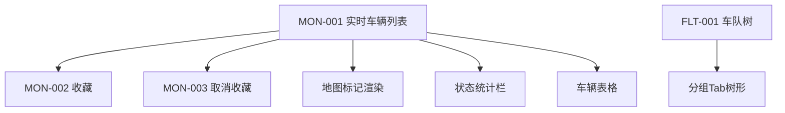
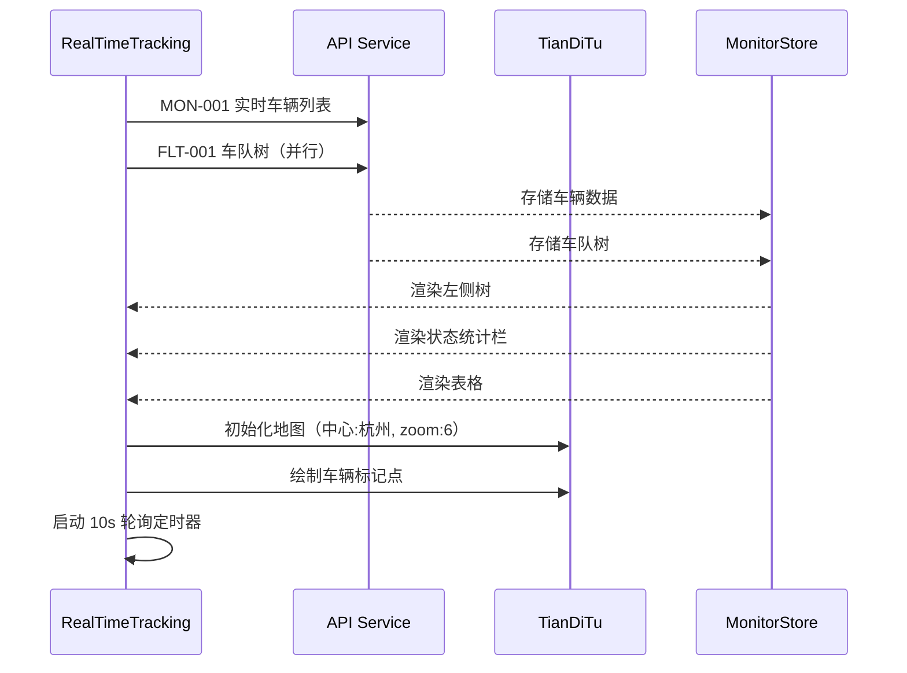
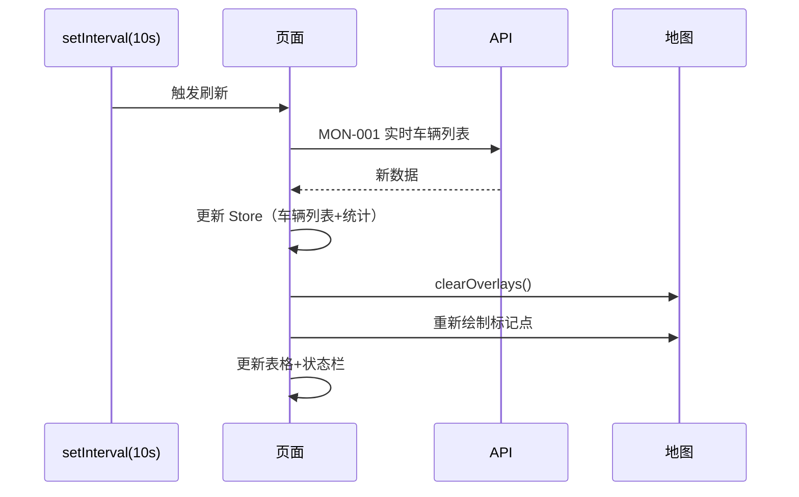
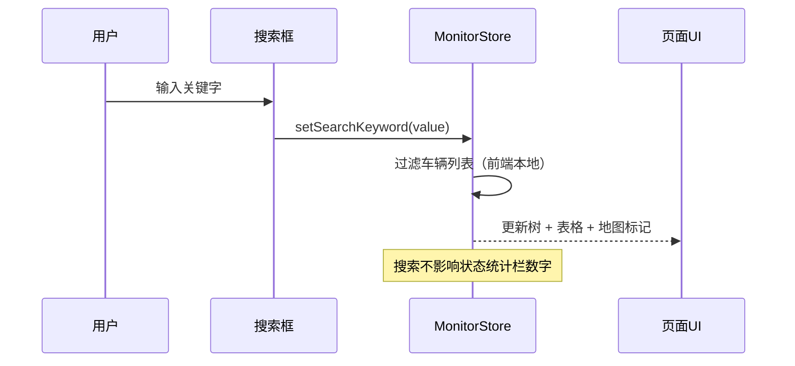
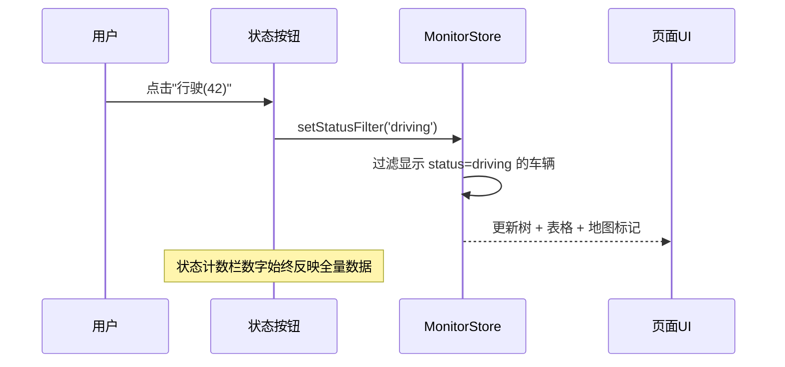
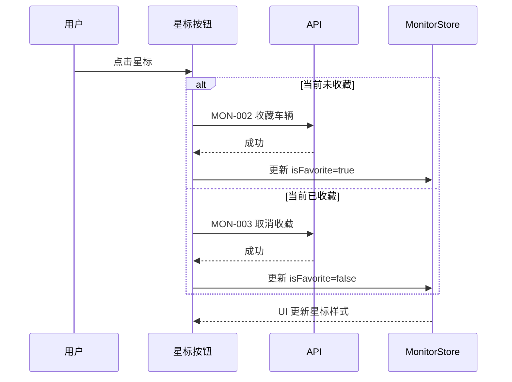
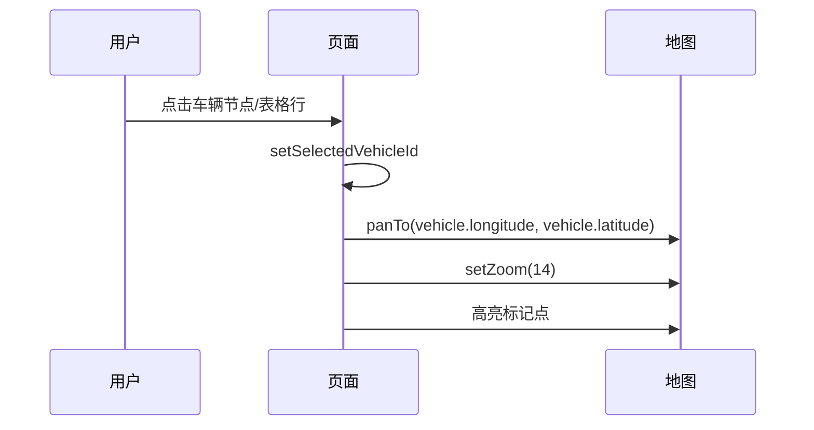

# 前端详细设计文档

## 文档信息

| 项目 | 内容 |
|------|------|
| 文档名称 | 实时监控 前端详细设计文档 |
| 对应后端模块 | 实时监控（模块标识：monitor） |
| 参考文档 | `doc/design/modules/vehicle/modules/实时监控/后端详细设计.md` |
| 静态页面 | `static_fe/src/app/pages/RealTimeTracking.tsx` |
| 版本 | v1.0.0 |
| 创建日期 | 2026-04-12 |
| 最后更新 | 2026-04-12 |
| 负责人 | 前端开发（AI辅助） |

---

# 一、模块概述

## 1.1 模块功能描述

本模块前端实现**实时监控**功能：

- **地图展示**：天地图上展示所有车辆位置标记，不同状态使用不同颜色图标
- **车辆树列表**：左侧面板以全部/收藏/分组三个 Tab 展示车辆列表
- **状态筛选**：按 7 种状态分类筛选，实时显示各状态计数
- **车辆表格**：下方表格展示车辆详细信息（速度、位置、信号等）
- **搜索**：按车牌号/车辆名称/位置模糊搜索
- **收藏**：标星收藏车辆，在收藏 Tab 快速查看
- **全屏模式**：全屏展示监控界面
- **数据刷新**：10s 自动轮询 + 手动刷新

## 1.2 模块边界与职责

| 职责 | 说明 |
|------|------|
| **本模块负责** | 地图渲染、车辆树、状态筛选、表格、搜索、收藏交互、全屏、轮询刷新 |
| **其他模块负责** | 车辆CRUD（VM-01）、车队管理（VM-02）、设备管理（VM-07）|

## 1.3 用户角色与权限

| 角色 | 可执行操作 | 对应权限标识 |
|------|----------|-------------|
| 调度员 | 查看实时监控、收藏车辆 | monitor:realtime / monitor:favorite |
| 车队管理员 | 查看实时监控、收藏车辆 | monitor:realtime / monitor:favorite |

---

# 二、接口调用总览

## 2.1 接口引用说明

| 接口标识 | 接口名称 | HTTP方法 | 路径 | 主要用途 | 对应后端文档章节 |
|----------|----------|----------|------|----------|-----------------|
| MON-001 | 实时车辆列表 | GET | /api/v1/monitor/vehicles | 页面数据加载+轮询 | §7.2 MON-001 |
| MON-002 | 收藏车辆 | POST | /api/v1/monitor/favorites/{vehicleId} | 点击星标 | §7.2 MON-002 |
| MON-003 | 取消收藏 | DELETE | /api/v1/monitor/favorites/{vehicleId} | 点击星标 | §7.2 MON-003 |
| FLT-001 | 车队树查询 | GET | /api/v1/fleets/tree | 分组Tab数据 | VM-02 §7.2 |

## 2.2 接口依赖关系



---

# 三、页面设计

## 3.1 页面布局

```
┌──────────────────────────────────────────────────────────────────────────────┐
│  🔍 搜索车辆（车牌号/车辆名称/位置）                      [刷新]  [全屏]    │
├──────────┬───────────────────────────────────────────────────────────────────┤
│          │                                                                   │
│  左侧面板  │                     天地图区域（70%高度）                         │
│  ┌──────┐│                                                                   │
│  │全部│收│    🚗浙A12345                                                     │
│  │藏│分组││         🚗浙A67890                                               │
│  ├──────┤│              🚗沪B11111                                            │
│  │📁车队A│                                                                   │
│  │ ├车辆1│                                                                   │
│  │ ├车辆2│                                                                   │
│  │ └车辆3│                                                                   │
│  │📁车队B│                                                                   │
│  │ ├车辆4├───────────────────────────────────────────────────────────────────┤
│  │ └车辆5│ [全部(128)] [在线(15)] [行驶(42)] [ACC开(8)] [超速(3)] ...       │
│  └──────┘│ ┌───┬────┬──────┬──────┬──────┬──────┬──────┬──────┬──────┐      │
│          │ │序号│状态│车牌号 │车牌色│车辆名 │速度  │定位时间│位置   │信号  │      │
│          │ └───┴────┴──────┴──────┴──────┴──────┴──────┴──────┴──────┘      │
└──────────┴───────────────────────────────────────────────────────────────────┘
```

## 3.2 布局结构

| 区域 | 宽度 | 高度 | 说明 |
|------|------|------|------|
| 顶部搜索栏 | 100% | 48px | 搜索框 + 操作按钮 |
| 左侧面板 | 280px（固定） | 剩余 | Tabs + Tree/List |
| 右侧地图 | 剩余 | 70% | 天地图 |
| 右侧下方 | 剩余 | 30% | 状态栏 + 表格 |

---

# 四、初始化流程

## 4.1 页面加载时序



## 4.2 初始化状态

| 状态项 | 初始值 | 说明 |
|--------|-------|------|
| activeTab | 'all' | 左侧当前Tab |
| searchKeyword | '' | 搜索关键字 |
| statusFilter | null | 状态筛选（null=全部） |
| selectedVehicleId | null | 选中的车辆 |
| isFullscreen | false | 是否全屏 |
| isRefreshing | false | 是否正在刷新 |

---

# 五、操作流程

## 5.1 数据刷新（轮询）



**轮询规则：**
- 间隔：10 秒
- 手动刷新：重置定时器
- 页面离开：clearInterval 停止轮询
- 请求未返回时不发起新请求（防重叠）

## 5.2 搜索过滤



**搜索匹配规则：**
- plateNumber: 包含匹配（不区分大小写）
- vehicleName: 包含匹配
- location: 包含匹配
- 任一字段匹配即显示

## 5.3 状态筛选



## 5.4 收藏/取消收藏



## 5.5 车辆定位（点击树节点/表格行）



## 5.6 全屏模式

| 操作 | 行为 |
|------|------|
| 点击"全屏"按钮 | document.documentElement.requestFullscreen() |
| 点击"退出"/ ESC | document.exitFullscreen() |
| 监听 fullscreenchange | 更新 isFullscreen 状态 |

---

# 六、组件设计

## 6.1 组件树

```
RealTimeTracking/
├── SearchBar                    # 顶部搜索栏
│   ├── Input.Search             # 搜索框
│   ├── Button[刷新]             # ReloadOutlined
│   └── Button[全屏]             # FullscreenOutlined
├── VehiclePanel                 # 左侧面板
│   └── Tabs
│       ├── Tab[全部]            # 按车队分组的树
│       ├── Tab[收藏]            # 收藏车辆平铺列表
│       └── Tab[分组]            # 按车队分组（同全部）
├── MapContainer                 # 天地图容器
│   ├── TianDiTuMap              # 地图实例
│   ├── VehicleMarkers           # 车辆标记点
│   └── InfoWindow               # 点击标记弹出详情
├── StatusFilterBar              # 状态筛选栏
│   └── Button.Group             # 8个状态按钮
└── VehicleTable                 # 车辆信息表格
    └── Table                    # Ant Design Table
```

## 6.2 核心组件规格

### MapContainer（天地图）

| 配置项 | 值 | 说明 |
|--------|------|------|
| 地图服务 | api.tianditu.gov.cn | 天地图 |
| API 版本 | v4.0 | — |
| 初始中心 | [120.15, 30.28] | 杭州 |
| 初始缩放 | 6 | 省级视图 |
| 控件 | 缩放 + 比例尺 | — |

**标记样式：**

| 状态类型 | 颜色 | 包含状态 |
|---------|------|---------|
| 正常 | 蓝色 #5E72E4 | online, driving, acc_on, stopped |
| 异常 | 红色 #F5365C | speeding, invalid |
| 离线 | 灰色 #8898AA | offline |

**标记行为：**
- Label：显示车牌号（悬浮在标记上方）
- 点击标记：弹出 InfoWindow（车辆名/车牌/速度/状态/定位时间）
- 刷新时：clearOverlays → 重新绘制所有标记

### VehiclePanel（左侧 Tabs）

| Tab | key | 计数 | 数据源 |
|-----|-----|------|--------|
| 全部 | all | vehicles.length | 按 fleetId 分组的树 |
| 收藏 | favorite | favoriteCount | 仅 isFavorite=true 的车辆 |
| 分组 | group | — | 车队树结构 |

**树节点渲染：**
```
分组节点：FolderOutlined + "{fleetName} ({count})"
车辆节点：Badge(status颜色) + "{plateNumber}" + StarOutlined/StarFilled
```

### StatusFilterBar

| 按钮 | 显示 | 筛选值 |
|------|------|--------|
| 全部 | `全部 ({stats.total})` | null |
| 在线 | `在线 ({stats.online})` | 'online' |
| 行驶 | `行驶 ({stats.driving})` | 'driving' |
| ACC开 | `ACC开 ({stats.accOn})` | 'acc_on' |
| 超速 | `超速 ({stats.speeding})` | 'speeding' |
| 无效定位 | `无效定位 ({stats.invalid})` | 'invalid' |
| 离线 | `离线 ({stats.offline})` | 'offline' |
| 停止 | `停止 ({stats.stopped})` | 'stopped' |

**样式规则：**
- 选中：type="primary"
- 未选中：type="default"
- 默认选中"全部"

### VehicleTable

| 列 | dataIndex | 宽度 | 渲染 |
|------|-----------|------|------|
| 序号 | index | 60px | 自增序号 |
| 状态 | status | 100px | Badge(颜色点 + 状态文本) |
| 车牌号 | plateNumber | 140px | 文本 + 星标按钮 |
| 车牌色 | plateColor | 100px | Tag(蓝牌=blue, 黄牌=gold, 绿牌=green) |
| 车辆名 | vehicleName | 120px | 文本 |
| 速度 | speed | 110px | `{speed} km/h`，>80 红色 |
| 定位时间 | locationTime | 170px | YYYY-MM-DD HH:mm:ss |
| 位置 | location | 250px+ | Tooltip 完整，文本省略 |
| 信号 | signal | 100px | `{signal}%`，<50 红色，≥50 绿色 |

**表格配置：**
- pagination: false（滚动模式）
- scroll: { x: 1400 }
- size: "small"
- rowKey: "vehicleId"
- onRow: 点击高亮+地图定位

---

# 七、数据转换规则

## 7.1 状态映射

```typescript
const STATUS_MAP: Record<string, { label: string; color: string }> = {
  online:   { label: '在线',   color: 'success' },
  driving:  { label: '行驶',   color: 'processing' },
  acc_on:   { label: 'ACC开',  color: 'warning' },
  speeding: { label: '超速',   color: 'error' },
  invalid:  { label: '无效定位', color: 'default' },
  offline:  { label: '离线',   color: 'default' },
  stopped:  { label: '停止',   color: 'default' },
};
```

## 7.2 车辆树构建

将平铺的 `MonitorVehicleVO[]` 按 `fleetId` 分组构建为树形：

```typescript
function buildVehicleTree(vehicles: MonitorVehicleVO[], fleetTree: FleetTreeVO[]): DataNode[] {
  // 1. 按 fleetId 分组车辆
  // 2. 遍历车队树节点，填充对应车辆作为子节点
  // 3. 未分配车队的车辆放入"未分组"节点
}
```

## 7.3 收藏列表过滤

收藏 Tab 直接从全量车辆中过滤 `isFavorite === true` 的车辆，平铺展示。

---

# 八、API 服务层

## 8.1 服务文件

`src/services/monitorService.ts`

```typescript
// 实时车辆列表（含统计）
export function getMonitorVehicles(): Promise<MonitorResult>;

// 收藏车辆
export function addFavorite(vehicleId: number): Promise<void>;

// 取消收藏
export function removeFavorite(vehicleId: number): Promise<void>;
```

---

# 九、TypeScript 类型定义

```typescript
type VehicleStatus = 'online' | 'driving' | 'acc_on' | 'speeding' | 'invalid' | 'offline' | 'stopped';

interface MonitorVehicleVO {
  vehicleId: number;
  plateNumber: string;
  plateColor: string;
  vehicleName: string;
  fleetId: number | null;
  fleetName: string | null;
  status: VehicleStatus;
  speed: number | null;
  location: string | null;
  locationTime: string | null;
  signal: number | null;
  longitude: number | null;
  latitude: number | null;
  isFavorite: boolean;
}

interface MonitorStatsVO {
  total: number;
  online: number;
  driving: number;
  accOn: number;
  speeding: number;
  invalid: number;
  offline: number;
  stopped: number;
}

interface MonitorResult {
  vehicles: MonitorVehicleVO[];
  stats: MonitorStatsVO;
}
```

---

# 十、状态管理（Zustand Store）

```typescript
interface MonitorState {
  // 数据
  vehicles: MonitorVehicleVO[];
  stats: MonitorStatsVO;
  fleetTree: FleetTreeVO[];

  // UI 状态
  searchKeyword: string;
  statusFilter: VehicleStatus | null;
  activeTab: 'all' | 'favorite' | 'group';
  selectedVehicleId: number | null;
  isFullscreen: boolean;
  isRefreshing: boolean;

  // Computed
  filteredVehicles: MonitorVehicleVO[];  // 经搜索+状态筛选后的列表

  // Actions
  fetchData: () => Promise<void>;
  setSearchKeyword: (keyword: string) => void;
  setStatusFilter: (status: VehicleStatus | null) => void;
  setActiveTab: (tab: string) => void;
  setSelectedVehicle: (id: number | null) => void;
  toggleFavorite: (vehicleId: number) => Promise<void>;
  toggleFullscreen: () => void;
}
```

---

## 变更记录

| 版本 | 日期 | 修改人 | 变更内容 | 变更原因 | 评审人 |
|------|------|--------|---------|---------|--------|
| v1.0.0 | 2026-04-12 | 前端开发（AI） | 初始版本 | 实时监控前端详细设计 | 待评审 |
