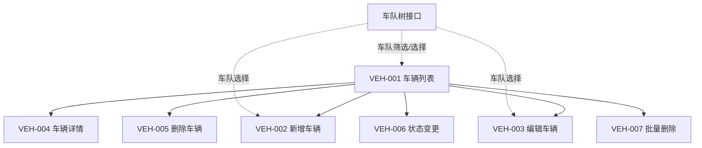
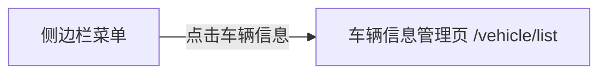
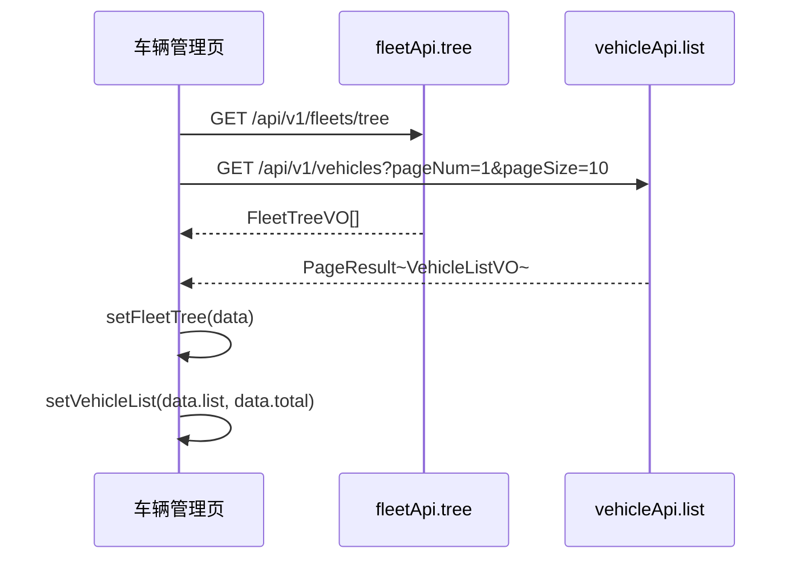
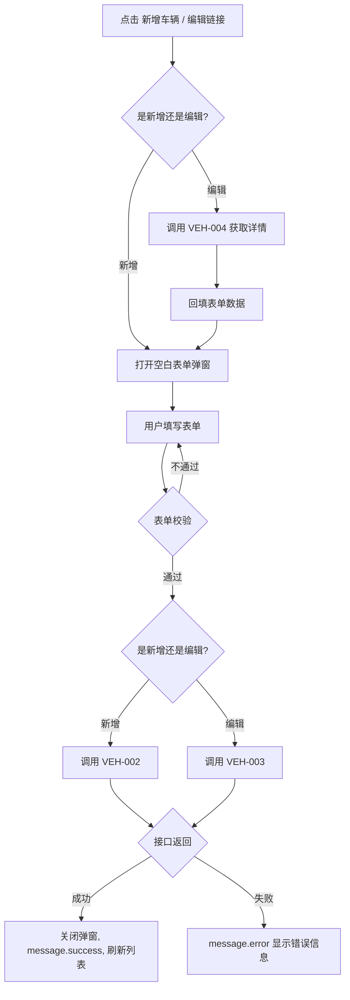
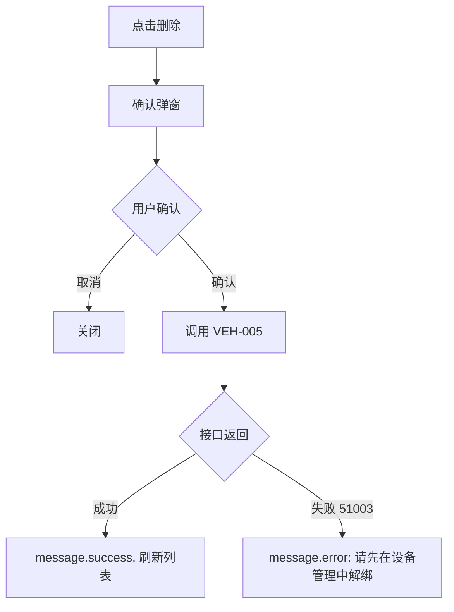
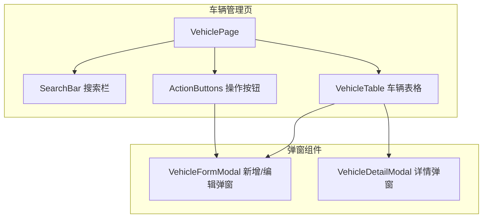

# 前端详细设计文档

## 文档信息

| 项目 | 内容 |
|------|------|
| 文档名称 | 车辆信息管理 前端详细设计文档 |
| 对应后端模块 | 车辆信息管理（模块标识：vehicle） |
| 参考文档 | `doc/design/modules/vehicle/modules/车辆信息管理/后端详细设计.md` |
| 静态页面 | 暂无（待创建） |
| 版本 | v1.0.0 |
| 创建日期 | 2026-04-12 |
| 最后更新 | 2026-04-12 |
| 负责人 | 前端开发（AI辅助） |

---

# 一、模块概述

## 1.1 模块功能描述

本模块前端实现**车辆信息管理**功能：

- **车辆列表**：分页展示车辆列表，支持按车牌号、车辆名称、所属车队、状态筛选。列表展示绑定设备 SN 和设备在线状态。
- **车辆 CRUD**：新增、编辑、删除车辆，查看车辆详情（含绑定设备信息）
- **状态管理**：车辆启用/停用切换
- **批量操作**：批量删除车辆

## 1.2 模块边界与职责

| 职责 | 说明 |
|------|------|
| **本模块负责** | 车辆列表页、新增/编辑弹窗、详情弹窗/页面、状态切换、批量删除 |
| **其他模块负责** | 设备绑定/解绑（VM-07 设备管理）、车队树数据（VM-02 车队管理）|

## 1.3 用户角色与权限

| 角色 | 可执行操作 | 对应权限标识 |
|------|----------|-------------|
| 车队管理员 | 车辆 CRUD、状态切换 | vehicle:list / add / edit / delete |
| 调度员 | 查看车辆列表和详情 | vehicle:list |

---

# 二、接口调用总览

## 2.1 接口引用说明

| 接口标识 | 接口名称 | HTTP方法 | 路径 | 主要用途 | 对应后端文档章节 |
|----------|----------|----------|------|----------|-----------------|
| VEH-001 | 车辆列表查询 | GET | /api/v1/vehicles | 列表页加载 | §7.2 VEH-001 |
| VEH-002 | 新增车辆 | POST | /api/v1/vehicles | 新增弹窗提交 | §7.2 VEH-002 |
| VEH-003 | 编辑车辆 | PUT | /api/v1/vehicles/{id} | 编辑弹窗提交 | §7.2 VEH-003 |
| VEH-004 | 车辆详情 | GET | /api/v1/vehicles/{id} | 详情展示/编辑回填 | §7.2 VEH-004 |
| VEH-005 | 删除车辆 | DELETE | /api/v1/vehicles/{id} | 列表删除按钮 | §7.2 VEH-005 |
| VEH-006 | 状态变更 | PUT | /api/v1/vehicles/{id}/status | 列表状态 Switch | §7.2 VEH-006 |
| VEH-007 | 批量删除 | DELETE | /api/v1/vehicles/batch | 批量删除按钮 | §7.2 VEH-007 |

**跨模块接口依赖：**

| 接口 | 来源模块 | 用途 |
|------|---------|------|
| 车队树查询 | VM-02 车队管理 | 新增/编辑时选择所属车队、搜索栏车队筛选 |

## 2.2 接口依赖关系



---

# 三、页面详细设计

## 3.1 页面清单

| 页面名称 | 路由路径 | 页面功能描述 | 关联接口列表 |
|----------|----------|--------------|--------------|
| 车辆信息管理页 | /vehicle/list | 车辆列表、CRUD、状态管理 | VEH-001~007, 车队树 |

## 3.2 页面跳转关系



**说明**：车辆信息管理页通过侧边栏菜单「车辆管理 > 车辆信息」进入。页面为列表页，新增/编辑通过弹窗完成。

---

# 四、页面初始化流程设计

## 4.1 车辆管理页初始化流程

### 4.1.1 接口调用序列

| 顺序 | 接口 | 并行/串行 | 说明 |
|------|------|----------|------|
| 1 | 车队树查询 | 并行 | 加载搜索栏车队下拉数据 |
| 2 | VEH-001 车辆列表 | 并行 | 加载车辆列表（默认不带筛选条件） |

> 车队树和车辆列表可并行加载，无依赖关系。

### 4.1.2 初始化时序图



### 4.1.3 初始化数据流

1. 车队树接口返回 `FleetTreeVO[]` → 渲染为搜索栏 Select 和表单 TreeSelect 的数据源
2. 车辆列表接口返回 `PageResult<VehicleListVO>` → `list` 渲染表格行，`total` 渲染分页器

---

# 五、用户操作流程设计

## 5.1 操作-接口映射表

| 用户操作描述 | 触发组件 | 调用接口 | 请求参数构造 | 响应数据处理 | 异常处理 |
|-------------|---------|---------|-------------|-------------|---------|
| 点击搜索按钮 | 搜索按钮 | VEH-001 | 从搜索表单收集 plateNumber, vehicleName, fleetId, status | 重置表格数据和分页 | message.error 提示 |
| 点击重置按钮 | 重置按钮 | — | 清空搜索表单，重置分页，重新调用 VEH-001 | — | — |
| 点击新增车辆 | 新增按钮 | VEH-002 | 弹窗表单数据组装为 VehicleCreateDTO | 关闭弹窗，刷新列表 | 表单校验失败阻止提交 |
| 点击编辑车辆 | 编辑链接 | VEH-004 → VEH-003 | 先调详情回填，提交时组装 VehicleUpdateDTO | 关闭弹窗，刷新列表 | — |
| 点击删除车辆 | 删除链接 | VEH-005 | 取行记录 vehicleId | 刷新列表 | 二次确认后调用 |
| 点击切换状态 | 状态 Switch | VEH-006 | 取行记录 vehicleId + 反转的 status 值 | 刷新列表 | Switch 回滚到原状态 |
| 点击批量删除 | 批量删除按钮 | VEH-007 | 取选中行 vehicleId 列表 | 刷新列表 | 二次确认后调用 |
| 点击详情 | 详情链接 | VEH-004 | 取行记录 vehicleId | 打开详情弹窗 | — |

## 5.2 复杂操作流程

### 5.2.1 新增/编辑车辆流程



### 5.2.2 删除车辆流程



---

# 六、组件设计

## 6.1 组件结构图



## 6.2 组件清单

| 组件名称 | 组件类型 | 主要职责 | 直接调用接口 | 父组件 | 子组件 |
|----------|----------|----------|-------------|--------|--------|
| VehiclePage | 页面 | 车辆管理页布局和逻辑 | VEH-001, 车队树 | App | SearchBar, ActionButtons, VehicleTable |
| SearchBar | 业务组件 | 车辆搜索表单 | — | VehiclePage | — |
| ActionButtons | UI 组件 | 新增/批量删除按钮 | — | VehiclePage | — |
| VehicleTable | 业务组件 | 车辆列表表格 | VEH-005, VEH-006 | VehiclePage | — |
| VehicleFormModal | 业务组件 | 新增/编辑车辆弹窗 | VEH-002, VEH-003, VEH-004, 车队树 | VehiclePage | — |
| VehicleDetailModal | 业务组件 | 车辆详情弹窗 | VEH-004 | VehiclePage | — |

## 6.3 关键组件详细设计

### 6.3.1 SearchBar 组件

- **Props 设计**：

| Prop | 类型 | 说明 |
|------|------|------|
| onSearch | (values: SearchValues) => void | 搜索回调 |
| onReset | () => void | 重置回调 |
| loading | boolean | 搜索中状态 |
| fleetTree | FleetTreeVO[] | 车队树数据 |

- **表单字段**：

| 字段 | 组件 | 说明 |
|------|------|------|
| plateNumber | Input | 车牌号，模糊匹配 |
| vehicleName | Input | 车辆名称，模糊匹配 |
| fleetId | TreeSelect | 所属车队下拉（车队树） |
| status | Select | 状态：全部/正常/停用 |

### 6.3.2 VehicleTable 组件

- **Props 设计**：

| Prop | 类型 | 说明 |
|------|------|------|
| dataSource | VehicleListVO[] | 列表数据 |
| loading | boolean | 加载中状态 |
| pagination | PaginationProps | 分页配置 |
| selectedRowKeys | number[] | 已选行（批量操作用） |
| onSelectChange | (keys: number[]) => void | 选择变更回调 |
| onEdit | (vehicleId: number) => void | 编辑回调 |
| onDelete | (vehicleId: number) => void | 删除回调 |
| onDetail | (vehicleId: number) => void | 详情回调 |
| onStatusChange | (vehicleId: number, status: number) => void | 状态切换回调 |

- **列配置**：

| 列名 | dataIndex | 渲染方式 |
|------|-----------|---------|
| 车牌号码 | plateNumber | 文本 |
| 车牌颜色 | plateColor | Tag（蓝牌=blue, 黄牌=gold, 绿牌=green, 白牌=default, 黑牌=black） |
| 车辆名称 | vehicleName | 文本 |
| 车辆类型 | vehicleType | Tag（货运=blue, 配送=cyan, 乘用=purple, 新能源=green, 其他=default） |
| 所属车队 | fleetName | 文本 |
| 绑定设备 | deviceSn | 有值显示 SN + 在线状态 Badge，无值显示"未绑定"灰色 |
| 状态 | status | Switch（需 vehicle:edit 权限） |
| 创建时间 | createTime | 时间格式化 |
| 操作 | — | 编辑 / 详情 / 删除 |

- **绑定设备列渲染逻辑**：

```
if (record.deviceSn) {
  // 显示 SN + 在线状态小圆点
  // online_status=1 → green dot, online_status=0 → gray dot
  return <><Badge status={record.deviceOnlineStatus===1?'success':'default'} />{record.deviceSn}</>
} else {
  return <Text type="secondary">未绑定</Text>
}
```

### 6.3.3 VehicleFormModal 组件

- **接口调用设计**：
  - 编辑模式：打开时调用 VEH-004 获取详情，回填表单
  - 提交时：新增调用 VEH-002，编辑调用 VEH-003
  - 打开时加载车队树（如页面已缓存则复用）
- **Props 设计**：

| Prop | 类型 | 说明 |
|------|------|------|
| open | boolean | 弹窗显隐 |
| vehicleId | number \| null | null 为新增模式，有值为编辑模式 |
| fleetTree | FleetTreeVO[] | 车队树数据 |
| onSuccess | () => void | 操作成功回调 |
| onCancel | () => void | 取消回调 |

- **表单字段**：

| 字段 | 组件 | 必填 | 校验规则 | 编辑模式 |
|------|------|------|---------|---------|
| plateNumber | Input | 是 | 车牌号格式 | 可编辑 |
| plateColor | Select | 是 | 1-5 | 可编辑 |
| vehicleName | Input | 是 | 2-50字符 | 可编辑 |
| vehicleType | Select | 是 | 1-5 | 可编辑 |
| fleetId | TreeSelect | 否 | — | 可编辑 |
| vin | Input | 否 | 17位字母数字 | 可编辑 |
| engineNo | Input | 否 | ≤30字符 | 可编辑 |
| brandModel | Input | 否 | ≤50字符 | 可编辑 |
| purchaseDate | DatePicker | 否 | — | 可编辑 |
| loadCapacity | InputNumber | 否 | ≥0 | 可编辑 |
| seatCount | InputNumber | 否 | ≥0 | 可编辑 |
| contactName | Input | 否 | ≤30字符 | 可编辑 |
| contactPhone | Input | 否 | 手机号格式 | 可编辑 |
| remark | TextArea | 否 | ≤500字符 | 可编辑 |

- **车牌颜色选项**：

```typescript
const plateColorOptions = [
  { value: 1, label: '蓝牌' },
  { value: 2, label: '黄牌' },
  { value: 3, label: '绿牌(新能源)' },
  { value: 4, label: '白牌' },
  { value: 5, label: '黑牌' },
];
```

- **车辆类型选项**：

```typescript
const vehicleTypeOptions = [
  { value: 1, label: '货运车辆' },
  { value: 2, label: '配送车辆' },
  { value: 3, label: '乘用车' },
  { value: 4, label: '新能源' },
  { value: 5, label: '其他' },
];
```

### 6.3.4 VehicleDetailModal 组件

- **接口调用设计**：打开时调用 VEH-004 获取详情
- **Props 设计**：

| Prop | 类型 | 说明 |
|------|------|------|
| open | boolean | 弹窗显隐 |
| vehicleId | number \| null | 车辆 ID |
| onClose | () => void | 关闭回调 |

- **展示区域**：

| 区域 | 展示字段 |
|------|---------|
| 基础信息 | 车牌号、车牌颜色(Tag)、车辆名称、车辆类型(Tag)、VIN、发动机号、品牌型号 |
| 组织归属 | 所属车队名称 |
| 绑定设备 | 设备SN、SIM卡号、协议类型(Tag)、在线状态(Badge)。无设备时显示"未绑定设备" |
| 其他信息 | 购置日期、载重、座位数、联系人、联系电话、备注 |
| 时间信息 | 创建时间、更新时间 |

---

# 七、数据转换设计

## 7.1 请求数据构造

### 7.1.1 数据转换规则

| 接口 | 前端表单字段 | 接口请求字段 | 转换规则 |
|------|------------|------------|---------|
| VEH-001 | 搜索表单 + 分页 | VehicleQueryDTO | 直接映射，空值不传 |
| VEH-002 | 新增表单 | VehicleCreateDTO | 直接映射 |
| VEH-003 | 编辑表单 | VehicleUpdateDTO | 直接映射 |
| VEH-006 | 状态值 | VehicleStatusDTO | Switch checked → 1/0 |
| VEH-007 | 选中行 | ids | 取 selectedRowKeys |

## 7.2 响应数据处理

### 7.2.1 数据转换规则

| 接口 | 响应字段 | 前端展示 | 转换规则 |
|------|---------|---------|---------|
| VEH-001 | plateColor | Tag | 1→蓝牌/blue, 2→黄牌/gold, 3→绿牌/green, 4→白牌/default, 5→黑牌 |
| VEH-001 | vehicleType | Tag | 1→货运/blue, 2→配送/cyan, 3→乘用/purple, 4→新能源/green, 5→其他 |
| VEH-001 | deviceSn | 文本+Badge | 有值：Badge+SN，无值："未绑定"灰色 |
| VEH-001 | status | Switch | 0→false, 1→true |

### 7.2.2 枚举映射

```typescript
const plateColorMap: Record<number, { text: string; color: string }> = {
  1: { text: '蓝牌', color: 'blue' },
  2: { text: '黄牌', color: 'gold' },
  3: { text: '绿牌', color: 'green' },
  4: { text: '白牌', color: 'default' },
  5: { text: '黑牌', color: '' },
};

const vehicleTypeMap: Record<number, { text: string; color: string }> = {
  1: { text: '货运车辆', color: 'blue' },
  2: { text: '配送车辆', color: 'cyan' },
  3: { text: '乘用车', color: 'purple' },
  4: { text: '新能源', color: 'green' },
  5: { text: '其他', color: 'default' },
};
```

---

# 八、API 服务层设计

## 8.1 API 模块定义

```typescript
// src/services/vehicleApi.ts

/** 车辆列表查询 */
export function getVehicleList(params: VehicleQueryDTO): Promise<PageResult<VehicleListVO>>;

/** 新增车辆 */
export function createVehicle(data: VehicleCreateDTO): Promise<void>;

/** 编辑车辆 */
export function updateVehicle(id: number, data: VehicleUpdateDTO): Promise<void>;

/** 车辆详情 */
export function getVehicleDetail(id: number): Promise<VehicleDetailVO>;

/** 删除车辆 */
export function deleteVehicle(id: number): Promise<void>;

/** 状态变更 */
export function updateVehicleStatus(id: number, data: VehicleStatusDTO): Promise<void>;

/** 批量删除 */
export function batchDeleteVehicles(ids: number[]): Promise<void>;
```

## 8.2 TypeScript 类型定义

```typescript
// src/types/vehicle.ts

interface VehicleQueryDTO {
  pageNum: number;
  pageSize: number;
  plateNumber?: string;
  vehicleName?: string;
  fleetId?: number;
  status?: number;
}

interface VehicleCreateDTO {
  plateNumber: string;
  plateColor: number;
  vehicleName: string;
  vehicleType: number;
  fleetId?: number;
  vin?: string;
  engineNo?: string;
  brandModel?: string;
  purchaseDate?: string;
  loadCapacity?: number;
  seatCount?: number;
  contactName?: string;
  contactPhone?: string;
  remark?: string;
}

interface VehicleUpdateDTO extends VehicleCreateDTO {}

interface VehicleStatusDTO {
  status: number;
}

interface VehicleListVO {
  vehicleId: number;
  plateNumber: string;
  plateColor: number;
  vehicleName: string;
  vehicleType: number;
  fleetId: number | null;
  fleetName: string | null;
  deviceSn: string | null;
  deviceOnlineStatus: number | null;
  status: number;
  createTime: string;
}

interface VehicleDetailVO {
  vehicleId: number;
  plateNumber: string;
  plateColor: number;
  vehicleName: string;
  vehicleType: number;
  fleetId: number | null;
  fleetName: string | null;
  vin: string | null;
  engineNo: string | null;
  brandModel: string | null;
  purchaseDate: string | null;
  loadCapacity: number | null;
  seatCount: number | null;
  contactName: string | null;
  contactPhone: string | null;
  status: number;
  remark: string | null;
  deviceSn: string | null;
  deviceSimNumber: string | null;
  deviceProtocolType: number | null;
  deviceOnlineStatus: number | null;
  createTime: string;
  updateTime: string;
}
```

---

# 九、权限控制设计

## 9.1 按钮权限控制

| UI 元素 | 权限标识 | 无权限行为 |
|---------|---------|-----------|
| 新增车辆按钮 | vehicle:add | 按钮隐藏 |
| 批量删除按钮 | vehicle:delete | 按钮隐藏 |
| 编辑链接 | vehicle:edit | 链接隐藏 |
| 删除链接 | vehicle:delete | 链接隐藏 |
| 详情链接 | vehicle:list | 始终可见（有 list 权限即可） |
| 状态 Switch | vehicle:edit | Switch 禁用 |

## 9.2 权限判断方式

```typescript
const hasPermission = (perm: string) => userStore.permissions.includes(perm);

{hasPermission('vehicle:add') && <Button type="primary">新增车辆</Button>}
```

---

## 变更记录

| 版本 | 日期 | 修改人 | 变更内容 | 变更原因 | 评审人 |
|------|------|--------|---------|---------|--------|
| v1.0.0 | 2026-04-12 | 前端开发（AI） | 初始版本 | 车辆信息管理前端详细设计 | 待评审 |
