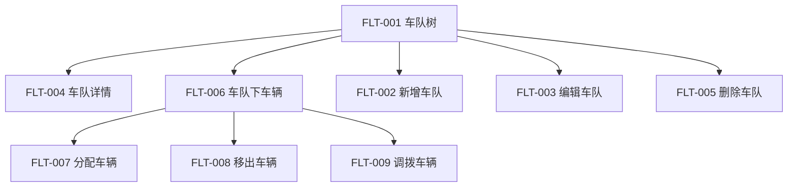
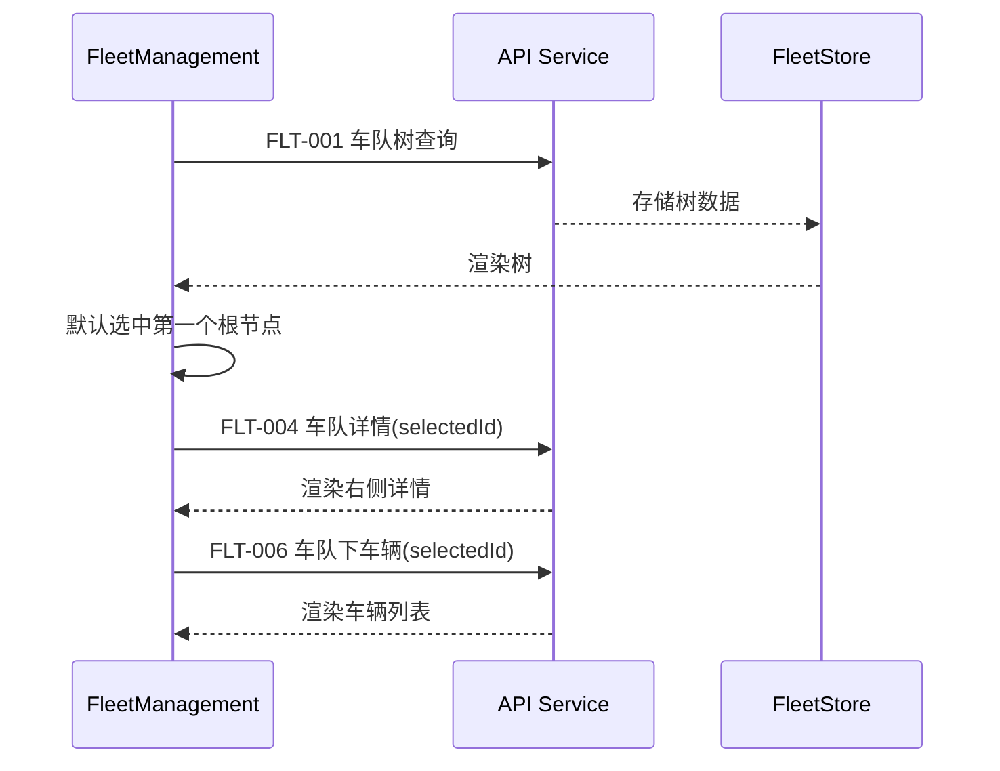
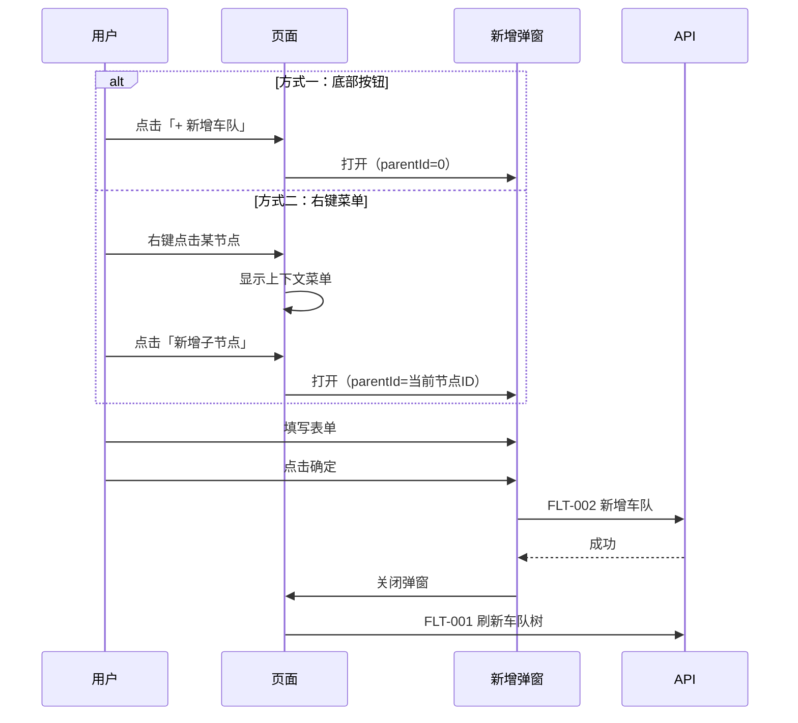
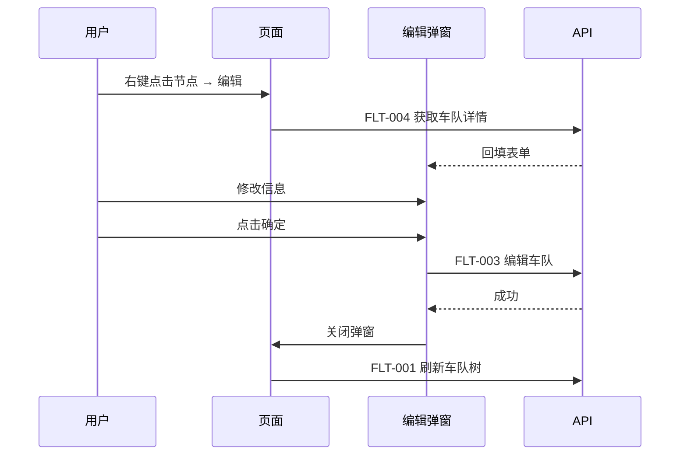
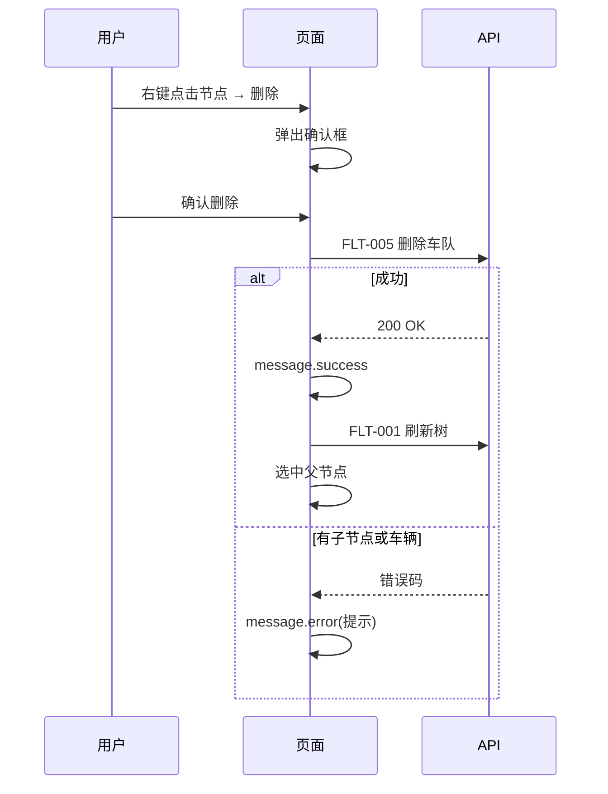
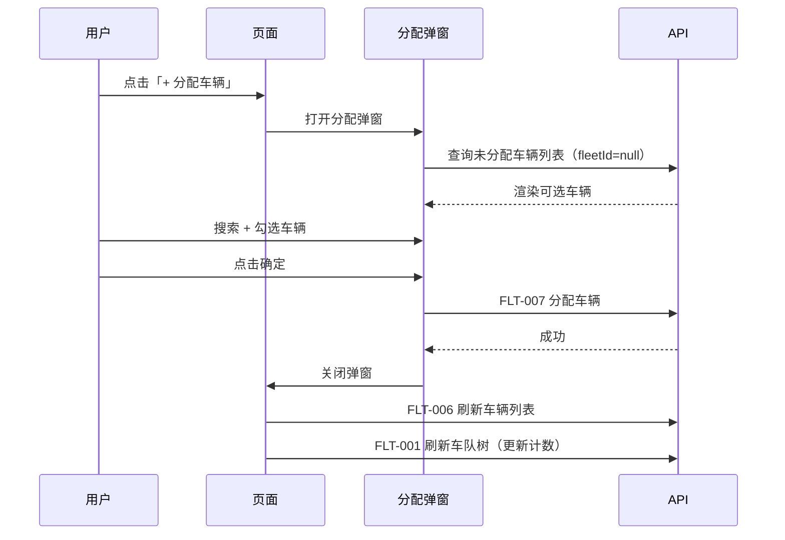
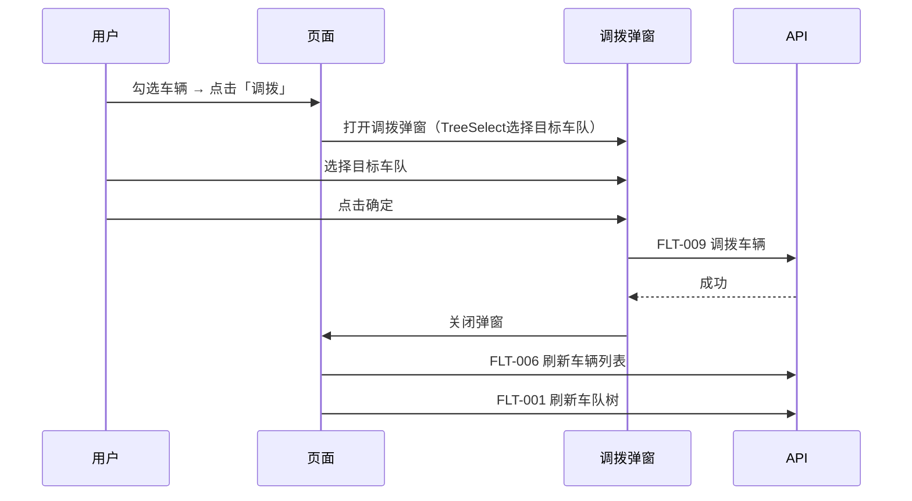

# 前端详细设计文档

## 文档信息

| 项目 | 内容 |
|------|------|
| 文档名称 | 车队管理 前端详细设计文档 |
| 对应后端模块 | 车队管理（模块标识：fleet） |
| 参考文档 | `doc/design/modules/vehicle/modules/车队管理/后端详细设计.md` |
| 静态页面 | 暂无（待创建） |
| 版本 | v1.0.0 |
| 创建日期 | 2026-04-12 |
| 最后更新 | 2026-04-12 |
| 负责人 | 前端开发（AI辅助） |

---

# 一、模块概述

## 1.1 模块功能描述

本模块前端实现**车队管理**功能：

- **车队树**：左侧面板以树形结构展示所有车队/分组，支持搜索过滤、节点展开/收起
- **车队详情**：右侧面板展示选中车队的详细信息
- **车队 CRUD**：新增、编辑、删除车队/分组（右键菜单 + 弹窗表单）
- **车辆管理**：右侧展示车队下属车辆列表，支持分配、移出、调拨
- **收藏管理**：提供收藏/取消收藏 API 服务层（供实时监控模块复用）

## 1.2 模块边界与职责

| 职责 | 说明 |
|------|------|
| **本模块负责** | 车队树展示与管理、车队CRUD弹窗、车队内车辆分配/移出/调拨、收藏API服务 |
| **其他模块负责** | 车辆CRUD（VM-01）、设备绑定/解绑（VM-07）、实时监控页面（VM-03）|

## 1.3 用户角色与权限

| 角色 | 可执行操作 | 对应权限标识 |
|------|----------|-------------|
| 车队管理员 | 车队CRUD、车辆分配/移出/调拨 | fleet:list / add / edit / delete |
| 调度员 | 查看车队树 | fleet:list |

---

# 二、接口调用总览

## 2.1 接口引用说明

| 接口标识 | 接口名称 | HTTP方法 | 路径 | 主要用途 | 对应后端文档章节 |
|----------|----------|----------|------|----------|-----------------|
| FLT-001 | 车队树查询 | GET | /api/v1/fleets/tree | 左侧树加载 | §7.2 FLT-001 |
| FLT-002 | 新增车队 | POST | /api/v1/fleets | 新增弹窗提交 | §7.2 FLT-002 |
| FLT-003 | 编辑车队 | PUT | /api/v1/fleets/{id} | 编辑弹窗提交 | §7.2 FLT-003 |
| FLT-004 | 车队详情 | GET | /api/v1/fleets/{id} | 右侧详情展示 | §7.2 FLT-004 |
| FLT-005 | 删除车队 | DELETE | /api/v1/fleets/{id} | 右键删除 | §7.2 FLT-005 |
| FLT-006 | 车队下车辆 | GET | /api/v1/fleets/{id}/vehicles | 右侧车辆列表 | §7.2 FLT-006 |
| FLT-007 | 分配车辆 | POST | /api/v1/fleets/{id}/vehicles | 分配弹窗提交 | §7.2 FLT-007 |
| FLT-008 | 移出车辆 | DELETE | /api/v1/fleets/{id}/vehicles | 移出操作 | §7.2 FLT-008 |
| FLT-009 | 调拨车辆 | PUT | /api/v1/fleets/transfer | 调拨弹窗提交 | §7.2 FLT-009 |

**跨模块接口依赖：**

| 接口 | 来源模块 | 用途 |
|------|---------|------|
| 未分配车辆列表 | VM-01 车辆管理 | 分配车辆弹窗中显示可选车辆 |

## 2.2 接口依赖关系



---

# 三、页面设计

## 3.1 页面布局

```
┌─────────────────────────────────────────────────────────────────────────┐
│  车队管理                                                               │
├──────────────┬──────────────────────────────────────────────────────────┤
│  搜索 [____] │  车队详情                                                │
│              │  ┌──────────────────────────────────────────────────┐    │
│  ▼ 全部车队   │  │ 车队名称：华东大区                                │    │
│  ├─ 华东大区  │  │ 上级车队：全部车队（根节点）                       │    │
│  │  ├─ 杭州   │  │ 车辆数量：128 辆                                 │    │
│  │  │  ├─物流 │  │ 创建时间：2026-01-15 10:00                       │    │
│  │  │  └─配送 │  │ 描述：负责华东地区的物流配送                       │    │
│  │  └─ 上海   │  ├──────────────────────────────────────────────────┤    │
│  ├─ 华南大区  │  │ 下属车辆                         [+ 分配车辆]      │    │
│  └─ 华北大区  │  │ □│ 车牌号 │ 车辆名称 │ 绑定设备│ 状态 │ 操作      │    │
│              │  │ □│浙A12345│物流车01 │ T8001  │ 正常 │ [移出]      │    │
│ [+ 新增车队]  │  │ □│浙A67890│物流车02 │ T8002  │ 正常 │ [移出]      │    │
│              │  └──────────────────────────────────────────────────┘    │
└──────────────┴──────────────────────────────────────────────────────────┘
```

## 3.2 布局结构

| 区域 | 组件 | 宽度 | 说明 |
|------|------|------|------|
| 左侧面板 | 搜索框 + Tree 组件 | 280px（固定） | 树形车队结构 |
| 右侧面板 | Descriptions + Table | 剩余宽度 | 车队详情 + 车辆列表 |

---

# 四、初始化流程

## 4.1 页面加载时序



## 4.2 初始化状态

| 状态项 | 初始值 | 说明 |
|--------|-------|------|
| selectedFleetId | 第一个根节点ID | 自动选中 |
| expandedKeys | 根节点ID列表 | 默认展开第一级 |
| searchKeyword | '' | 搜索关键字 |
| contextMenuVisible | false | 右键菜单 |

---

# 五、操作流程

## 5.1 新增车队



## 5.2 编辑车队



## 5.3 删除车队



## 5.4 分配车辆



## 5.5 调拨车辆



---

# 六、组件设计

## 6.1 组件树

```
FleetManagement/
├── FleetTree                    # 左侧车队树面板
│   ├── Input.Search             # 搜索框
│   ├── Tree                     # Ant Design Tree
│   └── ContextMenu              # 右键上下文菜单
├── FleetDetail                  # 右侧详情区域
│   ├── Descriptions             # 车队信息描述列表
│   └── FleetVehicleTable        # 下属车辆表格
│       ├── Button[分配车辆]
│       ├── Button[批量移出]
│       └── Button[调拨]
├── FleetFormModal               # 新增/编辑车队弹窗
│   ├── Form.Item[车队名称]       # Input
│   ├── Form.Item[上级车队]       # TreeSelect
│   ├── Form.Item[排序号]         # InputNumber
│   ├── Form.Item[负责人]         # Input
│   ├── Form.Item[联系电话]       # Input
│   └── Form.Item[描述]           # TextArea
├── AssignVehicleModal           # 分配车辆弹窗
│   ├── Input.Search             # 车辆搜索
│   └── Table (多选)             # 可选车辆列表
└── TransferModal                # 调拨弹窗
    └── TreeSelect               # 目标车队选择
```

## 6.2 核心组件规格

### FleetTree

| 属性 | 值 | 说明 |
|------|------|------|
| 组件 | Ant Design Tree | 树形控件 |
| showLine | true | 显示连接线 |
| blockNode | true | 节点占满一行 |
| draggable | false | P1后支持拖拽 |
| titleRender | 自定义 | 节点名称 + 车辆数角标 |

**树节点渲染：**
```
节点标题 = "{fleetName} ({vehicleCount})"
节点图标 = FolderOutlined（收起）/ FolderOpenOutlined（展开）
```

### ContextMenu（右键菜单）

| 菜单项 | 图标 | 权限 | 说明 |
|--------|------|------|------|
| 新增子节点 | PlusOutlined | fleet:add | 在当前节点下新增 |
| 编辑 | EditOutlined | fleet:edit | 编辑当前节点 |
| 删除 | DeleteOutlined | fleet:delete | 删除当前节点 |

### FleetVehicleTable

| 列 | dataIndex | 宽度 | 渲染 |
|------|-----------|------|------|
| 车牌号 | plateNumber | 140px | 文本 |
| 车辆名称 | vehicleName | 120px | 文本 |
| 绑定设备 | deviceSn | 120px | 有则显示SN，无则"未绑定" |
| 状态 | status | 100px | Badge: 1=正常绿色, 0=停用红色 |
| 操作 | — | 120px | [移出] [调拨] |

**表格配置：**
- rowSelection: checkbox（多选）
- pagination: 无（scroll）
- size: small

### FleetFormModal

| 表单项 | 控件 | 必填 | 校验 |
|--------|------|------|------|
| 车队名称 | Input | 是 | 2-30字符 |
| 上级车队 | TreeSelect | 是 | 新增时可选，编辑时禁用 |
| 排序号 | InputNumber | 否 | ≥0，默认0 |
| 负责人 | Input | 否 | ≤20字符 |
| 联系电话 | Input | 否 | 手机号格式 |
| 描述 | TextArea | 否 | ≤200字符 |

---

# 七、数据转换规则

## 7.1 树形数据转换

后端返回的 `FleetTreeVO[]` 需转换为 Ant Design Tree 的 `DataNode[]` 格式：

```typescript
interface FleetTreeNode {
  key: string;           // fleetId 转字符串
  title: string;         // `${fleetName} (${vehicleCount})`
  icon: ReactNode;       // FolderOutlined
  children: FleetTreeNode[];
  raw: FleetTreeVO;      // 原始数据
}
```

## 7.2 搜索过滤

前端本地过滤：
- 关键字匹配节点名称（包含匹配）
- 匹配的节点及其所有祖先节点保留
- 自动展开匹配节点的路径

---

# 八、API 服务层

## 8.1 服务文件

`src/services/fleetService.ts`

```typescript
// 车队树查询
export function getFleetTree(): Promise<FleetTreeVO[]>;

// 新增车队
export function createFleet(data: FleetCreateDTO): Promise<void>;

// 编辑车队
export function updateFleet(id: number, data: FleetUpdateDTO): Promise<void>;

// 车队详情
export function getFleetDetail(id: number): Promise<FleetDetailVO>;

// 删除车队
export function deleteFleet(id: number): Promise<void>;

// 车队下车辆列表
export function getFleetVehicles(id: number): Promise<FleetVehicleVO[]>;

// 分配车辆到车队
export function assignVehicles(fleetId: number, vehicleIds: number[]): Promise<void>;

// 移出车辆
export function removeVehicles(fleetId: number, vehicleIds: number[]): Promise<void>;

// 调拨车辆
export function transferVehicles(data: VehicleTransferDTO): Promise<void>;
```

## 8.2 收藏服务文件

`src/services/favoriteService.ts`

```typescript
// 收藏车辆
export function addFavorite(vehicleId: number): Promise<void>;

// 取消收藏
export function removeFavorite(vehicleId: number): Promise<void>;

// 获取收藏列表
export function getFavoriteList(): Promise<number[]>;
```

---

# 九、TypeScript 类型定义

```typescript
// VO 类型
interface FleetTreeVO {
  fleetId: number;
  fleetName: string;
  parentId: number;
  vehicleCount: number;
  children: FleetTreeVO[];
}

interface FleetDetailVO {
  fleetId: number;
  fleetName: string;
  parentId: number;
  parentName: string;
  sortOrder: number;
  leaderName: string | null;
  leaderPhone: string | null;
  description: string | null;
  vehicleCount: number;
  status: number;
  createTime: string;
}

interface FleetVehicleVO {
  vehicleId: number;
  plateNumber: string;
  vehicleName: string;
  deviceSn: string | null;
  status: number;
}

// DTO 类型
interface FleetCreateDTO {
  fleetName: string;
  parentId: number;
  sortOrder?: number;
  leaderName?: string;
  leaderPhone?: string;
  description?: string;
}

interface FleetUpdateDTO {
  fleetName: string;
  sortOrder?: number;
  leaderName?: string;
  leaderPhone?: string;
  description?: string;
}

interface VehicleTransferDTO {
  vehicleIds: number[];
  targetFleetId: number;
}
```

---

## 变更记录

| 版本 | 日期 | 修改人 | 变更内容 | 变更原因 | 评审人 |
|------|------|--------|---------|---------|--------|
| v1.0.0 | 2026-04-12 | 前端开发（AI） | 初始版本 | 车队管理前端详细设计 | 待评审 |
