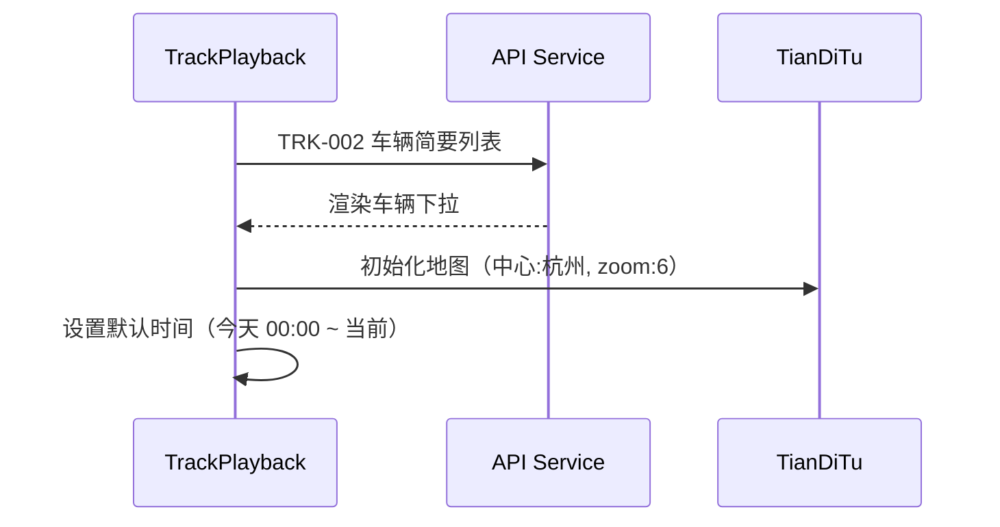
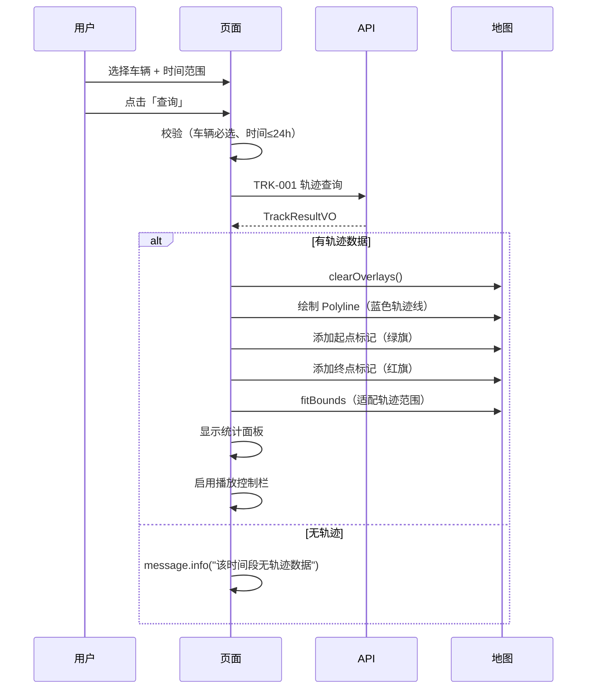
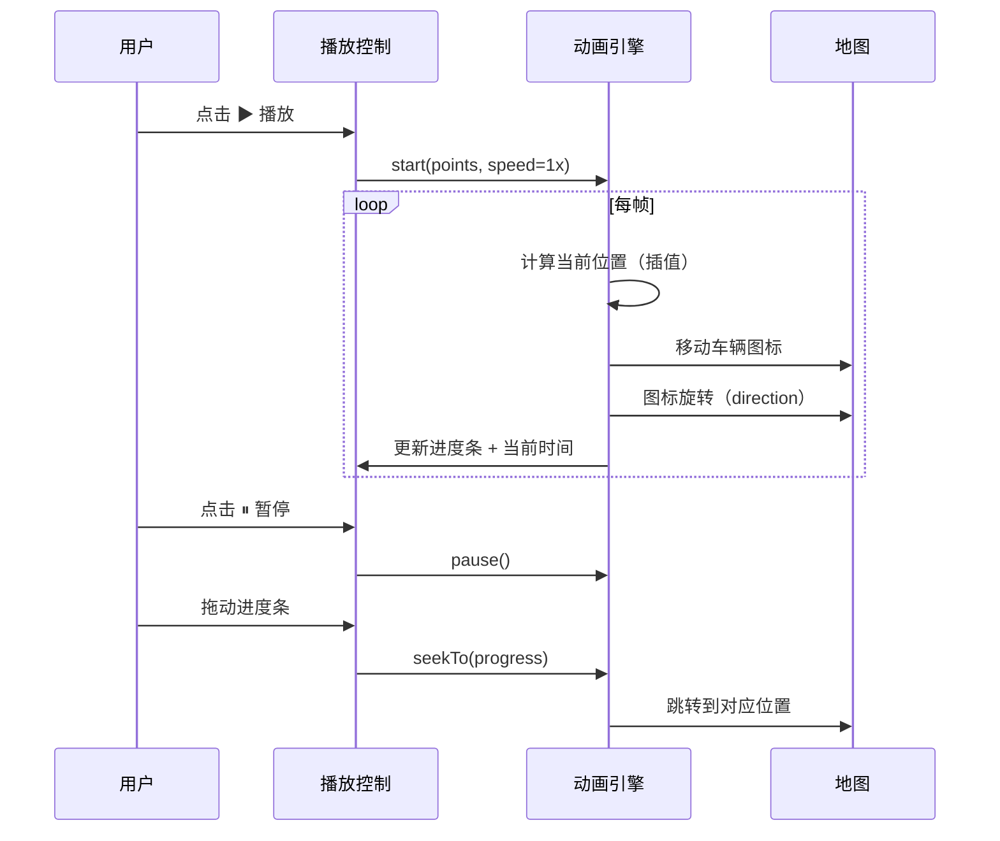

# 前端详细设计文档

## 文档信息

| 项目 | 内容 |
|------|------|
| 文档名称 | 轨迹回放 前端详细设计文档 |
| 对应后端模块 | 轨迹回放（模块标识：track） |
| 参考文档 | `doc/design/modules/vehicle/modules/轨迹回放/后端详细设计.md` |
| 静态页面 | 暂无（待创建） |
| 版本 | v1.0.0 |
| 创建日期 | 2026-04-12 |
| 最后更新 | 2026-04-12 |
| 负责人 | 前端开发（AI辅助） |

---

# 一、模块概述

## 1.1 模块功能描述

本模块前端实现**轨迹回放**功能：

- **条件查询**：选择车辆 + 时间范围查询历史轨迹
- **轨迹绘制**：天地图上绘制完整轨迹线（Polyline）
- **起止标记**：绿色旗帜标记起点，红色旗帜标记终点
- **动画回放**：车辆图标沿轨迹线平滑移动
- **播放控制**：播放/暂停、速度调节(1x/2x/4x/8x)、进度条拖动
- **轨迹点详情**：点击轨迹线弹出当前点信息
- **统计面板**：显示总里程/时长/最高速度/平均速度

## 1.2 模块边界与职责

| 职责 | 说明 |
|------|------|
| **本模块负责** | 查询条件面板、地图轨迹绘制、动画回放、播放控制、统计展示 |
| **其他模块负责** | 位置数据写入（协议引擎）、实时监控（VM-03）|

## 1.3 用户角色与权限

| 角色 | 可执行操作 | 对应权限标识 |
|------|----------|-------------|
| 调度员 | 查看任意车辆轨迹 | track:view |
| 车队管理员 | 查看任意车辆轨迹 | track:view |

---

# 二、接口调用总览

## 2.1 接口引用说明

| 接口标识 | 接口名称 | HTTP方法 | 路径 | 主要用途 |
|----------|----------|----------|------|----------|
| TRK-001 | 轨迹查询 | GET | /api/v1/tracks | 查询轨迹数据 |
| TRK-002 | 车辆简要列表 | GET | /api/v1/vehicles/simple | 车辆下拉选择 |

---

# 三、页面设计

## 3.1 页面布局

```
┌──────────────────────────────────────────────────────────────────────────────┐
│  轨迹回放                                                                    │
├──────────┬───────────────────────────────────────────────────────────────────┤
│          │                                                                   │
│ 查询面板  │                     天地图区域                                    │
│          │                                                                   │
│ 车辆选择  │     🚩起点                                                       │
│ [____▼]  │         ─────────────────────                                    │
│          │                              \                                    │
│ 开始时间  │                               ──────🚗──────                     │
│ [_______] │                                             \                    │
│          │                                              🏁终点               │
│ 结束时间  │                                                                  │
│ [_______] │  ┌─────────────────────────────────────────┐                    │
│          │  │ 总里程: 125.6km  时长: 8h32m             │                    │
│ 快捷选项  │  │ 最高速: 95.5km/h  平均: 48.2km/h       │                    │
│ [今天]   │  └─────────────────────────────────────────┘                    │
│ [昨天]   ├───────────────────────────────────────────────────────────────────┤
│ [近2h]   │ ⏮ ▶ ⏭ │ [1x] [2x] [4x] [8x] │ ━━━━━○━━━━━━━━━ │ 08:30/17:45 │
│ [近6h]   │                          播放控制栏                               │
│          │                                                                   │
│ [查 询]  │                                                                   │
└──────────┴───────────────────────────────────────────────────────────────────┘
```

## 3.2 布局结构

| 区域 | 宽度/高度 | 说明 |
|------|----------|------|
| 左侧查询面板 | 240px | 车辆选择+时间+快捷+查询按钮 |
| 右侧地图区域 | 剩余宽度 | 天地图 + 轨迹线 + 统计浮窗 |
| 底部播放控制栏 | 100% × 56px | 播放/暂停/速度/进度条/时间 |

---

# 四、初始化流程



---

# 五、操作流程

## 5.1 查询轨迹



## 5.2 动画回放



## 5.3 速度调节

| 倍速 | 说明 | 效果 |
|------|------|------|
| 1x | 正常速度 | 按实际时间间隔播放 |
| 2x | 2倍速 | 时间间隔/2 |
| 4x | 4倍速 | 时间间隔/4 |
| 8x | 8倍速 | 时间间隔/8 |

---

# 六、组件设计

## 6.1 组件树

```
TrackPlayback/
├── QueryPanel                   # 左侧查询面板
│   ├── Select[车辆选择]          # showSearch
│   ├── DatePicker[开始时间]      # showTime
│   ├── DatePicker[结束时间]      # showTime
│   ├── QuickTimeButtons         # 快捷选项按钮组
│   └── Button[查询]
├── TrackMap                     # 地图区域
│   ├── TianDiTuMap              # 地图实例
│   ├── Polyline                 # 轨迹线
│   ├── StartMarker              # 起点标记
│   ├── EndMarker                # 终点标记
│   ├── VehicleMarker            # 回放车辆图标
│   └── InfoWindow               # 点击弹窗
├── StatsPanel                   # 统计信息浮窗
│   └── Descriptions             # 里程/时长/速度
└── PlaybackControl              # 播放控制栏
    ├── Button[播放/暂停]
    ├── Radio.Group[速度]
    ├── Slider[进度条]
    └── TimeDisplay              # 当前时间/总时长
```

## 6.2 核心组件规格

### QueryPanel

| 表单项 | 控件 | 说明 |
|--------|------|------|
| 车辆选择 | Select (showSearch, placeholder="搜索车牌号/名称") | optionFilterProp="label" |
| 开始时间 | DatePicker (showTime, format="YYYY-MM-DD HH:mm") | 默认今天 00:00 |
| 结束时间 | DatePicker (showTime, format="YYYY-MM-DD HH:mm") | 默认当前时间 |
| 快捷选项 | Button 组（今天/昨天/近2h/近6h） | 点击自动填充时间 |

### TrackMap

| 配置 | 值 |
|------|------|
| 轨迹线颜色 | #5E72E4（蓝色） |
| 轨迹线宽度 | 4px |
| 起点图标 | 绿色旗帜 |
| 终点图标 | 红色旗帜 |
| 车辆回放图标 | 蓝色箭头（可旋转） |

### PlaybackControl

| 元素 | 说明 |
|------|------|
| 播放按钮 | CaretRightOutlined / PauseOutlined |
| 速度选择 | Radio.Group: 1x / 2x / 4x / 8x |
| 进度条 | Ant Design Slider, tooltip显示时间 |
| 时间显示 | `{currentTime} / {endTime}` HH:mm 格式 |

---

# 七、动画引擎设计

## 7.1 核心逻辑

```typescript
class TrackAnimator {
  private points: TrackPointVO[];
  private currentIndex: number = 0;
  private speed: number = 1;
  private isPlaying: boolean = false;
  private animationFrameId: number | null = null;

  start(): void;       // 开始播放
  pause(): void;       // 暂停
  resume(): void;      // 继续
  seekTo(progress: number): void;  // 跳转（0-1）
  setSpeed(speed: number): void;   // 设置倍速
  destroy(): void;     // 销毁
}
```

## 7.2 插值计算

相邻两点之间的移动使用线性插值：
- 位置：lerp(pointA, pointB, t)
- 方向：使用当前点的 direction 字段
- 时间：基于两点时间差 / speed 计算动画时长

---

# 八、API 服务层

`src/services/trackService.ts`

```typescript
// 查询轨迹
export function queryTrack(params: TrackQueryDTO): Promise<TrackResultVO>;

// 车辆简要列表
export function getVehicleSimpleList(): Promise<VehicleSimpleVO[]>;
```

---

# 九、TypeScript 类型定义

```typescript
interface TrackQueryDTO {
  vehicleId: number;
  startTime: string;  // ISO 8601
  endTime: string;
}

interface TrackResultVO {
  vehicleId: number;
  plateNumber: string;
  deviceSn: string;
  totalPoints: number;
  totalDistance: number;
  totalDuration: string;
  maxSpeed: number;
  avgSpeed: number;
  points: TrackPointVO[];
}

interface TrackPointVO {
  time: string;
  longitude: number;
  latitude: number;
  speed: number;
  direction: number;
  altitude: number;
}

interface VehicleSimpleVO {
  vehicleId: number;
  plateNumber: string;
  vehicleName: string;
}
```

---

## 变更记录

| 版本 | 日期 | 修改人 | 变更内容 | 变更原因 | 评审人 |
|------|------|--------|---------|---------|--------|
| v1.0.0 | 2026-04-12 | 前端开发（AI） | 初始版本 | 轨迹回放前端详细设计 | 待评审 |
