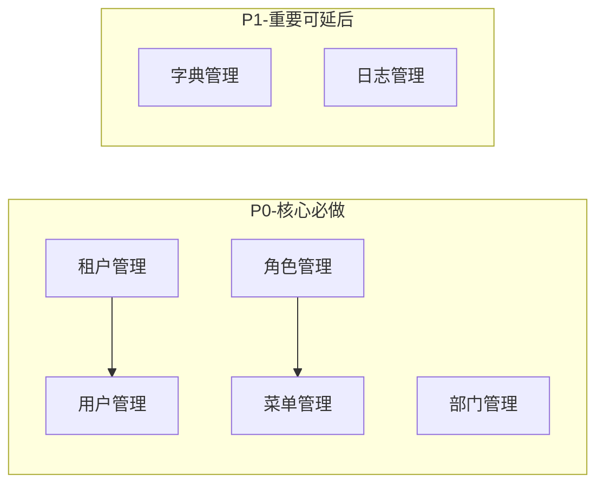
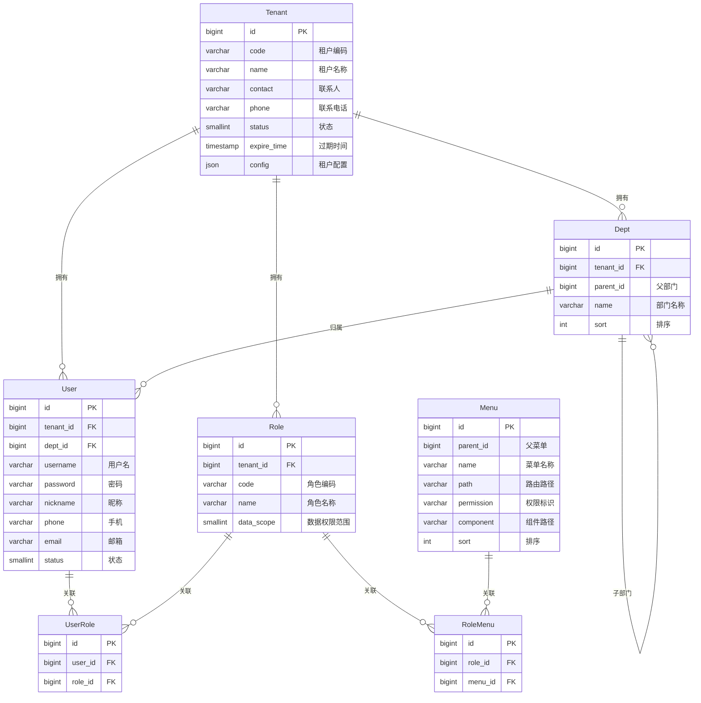
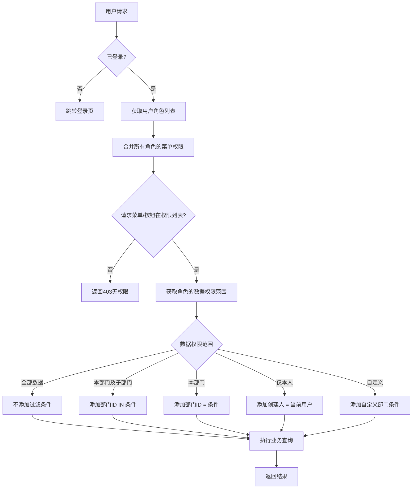

# PRD-RBAC 权限模块功能清单

> **文档类型**: 产品需求说明书 - 功能清单
> **模块名称**: RBAC 权限管理 + 多租户
> **版本**: v1.0.0
> **创建日期**: 2026-03-30
> **撰写人**: 产品经理（AI辅助）

---

## 一、模块概述

### 1.1 模块定位

**RBAC 权限模块** 是车联网 SaaS 平台的安全基础设施，实现**多租户数据隔离**和**细粒度权限控制**。

### 1.2 核心能力

| 能力 | 说明 |
|------|------|
| **多租户隔离** | 不同企业客户数据完全隔离，支持租户级配置 |
| **角色权限控制** | 基于角色的访问控制（RBAC），支持菜单权限+数据权限 |
| **部门层级管理** | 支持多级部门树结构，实现组织架构管理 |
| **数据权限** | 按部门/角色过滤数据，支持全部/本部门/仅本人等多种范围 |

### 1.3 业界标准参考

本模块设计参考以下业界标准：

| 标准 | 说明 |
|------|------|
| **NIST RBAC** | 美国国家标准与技术研究院 RBAC 模型 |
| **ACL vs RBAC** | 访问控制列表 vs 基于角色的访问控制 |
| **数据权限** | 行级数据过滤（Row-Level Security） |

### 1.4 模块边界

```
┌─────────────────────────────────────────────────────────────┐
│                     RBAC 权限模块                            │
├──────────────┬──────────────┬──────────────┬───────────────┤
│   租户管理    │   用户管理    │   角色管理    │   菜单管理     │
├──────────────┼──────────────┼──────────────┼───────────────┤
│   部门管理    │   字典管理    │  操作日志     │   登录日志     │
└──────────────┴──────────────┴──────────────┴───────────────┘
```

> **设计决策**：岗位管理功能降级为字典数据（sys_user_post），不在 RBAC 核心模块中单独管理。
> 原因：岗位只是职务标签，不涉及权限控制，真正的权限由角色管理承担。

---

## 二、功能清单总览

### 2.1 子模块列表

| 序号 | 子模块 | 功能点数量 | 优先级 | 说明 |
|------|--------|-----------|--------|------|
| 1 | **租户管理** | 5 | P0 | 多租户核心，SaaS 基础 |
| 2 | **用户管理** | 8 | P0 | 用户账号 CRUD |
| 3 | **角色管理** | 6 | P0 | 角色 + 权限分配 |
| 4 | **菜单管理** | 5 | P0 | 菜单 + 按钮权限 |
| 5 | **部门管理** | 5 | P0 | 组织架构树 |
| 6 | **字典管理** | 4 | P1 | 系统字典 + 业务字典（含职务字典） |
| 7 | **日志管理** | 6 | P1 | 操作日志 + 登录日志 + 在线用户 |

### 2.2 开发优先级



---

## 三、子模块功能详情

### 3.1 租户管理（P0）

#### 功能点清单

| 功能ID | 功能名称 | 功能描述 | 优先级 |
|--------|---------|---------|--------|
| T-001 | 租户列表 | 分页查询租户列表，支持状态筛选 | P0 |
| T-002 | 新增租户 | 创建新租户，配置租户信息 | P0 |
| T-003 | 编辑租户 | 修改租户基本信息 | P0 |
| T-004 | 租户配置 | 配置租户级参数（功能开关、限额等） | P0 |
| T-005 | 租户禁用/启用 | 禁用后该租户所有用户无法登录 | P0 |

#### 租户字段设计

| 字段 | 类型 | 必填 | 说明 |
|------|------|------|------|
| 租户编码 | string | 是 | 唯一标识，如 `TENANT001` |
| 租户名称 | string | 是 | 企业名称 |
| 联系人 | string | 是 | 联系人姓名 |
| 联系电话 | string | 是 | 联系电话 |
| 联系邮箱 | string | 否 | 联系邮箱 |
| 过期时间 | datetime | 否 | 租户过期时间，空则永不过期 |
| 状态 | int | 是 | 0=禁用，1=启用 |
| 配置JSON | json | 否 | 租户级配置 |
| 创建时间 | datetime | 自动 | 创建时间 |

---

### 3.2 用户管理（P0）

#### 功能点清单

| 功能ID | 功能名称 | 功能描述 | 优先级 |
|--------|---------|---------|--------|
| U-001 | 用户列表 | 分页查询用户，支持部门/状态筛选 | P0 |
| U-002 | 新增用户 | 创建用户账号，分配角色和部门 | P0 |
| U-003 | 编辑用户 | 修改用户基本信息 | P0 |
| U-004 | 重置密码 | 管理员重置用户密码 | P0 |
| U-005 | 修改密码 | 用户自己修改密码 | P0 |
| U-006 | 分配角色 | 给用户分配一个或多个角色 | P0 |
| U-007 | 禁用/启用用户 | 禁用后用户无法登录 | P0 |
| U-008 | 用户详情 | 查看用户详细信息、角色、权限 | P0 |

#### 用户字段设计

| 字段 | 类型 | 必填 | 说明 |
|------|------|------|------|
| 所属租户 | bigint | 自动 | 租户ID，自动填充 |
| 所属部门 | bigint | 是 | 部门ID |
| 用户名 | string | 是 | 登录用户名，租户内唯一 |
| 密码 | string | 是 | 加密存储 |
| 昵称 | string | 是 | 显示名称 |
| 手机号 | string | 否 | 手机号 |
| 邮箱 | string | 否 | 邮箱 |
| 性别 | int | 否 | 0=未知，1=男，2=女 |
| 职务 | string | 否 | 职务名称，从字典获取（sys_user_post） |
| 头像 | string | 否 | 头像URL |
| 状态 | int | 是 | 0=禁用，1=启用 |
| 创建时间 | datetime | 自动 | 创建时间 |

---

### 3.3 角色管理（P0）

#### 功能点清单

| 功能ID | 功能名称 | 功能描述 | 优先级 |
|--------|---------|---------|--------|
| R-001 | 角色列表 | 查询角色列表，支持状态筛选 | P0 |
| R-002 | 新增角色 | 创建角色，设置数据权限范围 | P0 |
| R-003 | 编辑角色 | 修改角色基本信息 | P0 |
| R-004 | 分配菜单权限 | 给角色分配菜单和按钮权限 | P0 |
| R-005 | 分配数据权限 | 设置角色的数据权限范围 | P0 |
| R-006 | 禁用/启用角色 | 禁用后该角色下的用户权限失效 | P0 |

#### 角色字段设计

| 字段 | 类型 | 必填 | 说明 |
|------|------|------|------|
| 所属租户 | bigint | 自动 | 租户ID |
| 角色编码 | string | 是 | 角色编码，如 `ADMIN`、`USER` |
| 角色名称 | string | 是 | 角色显示名称 |
| 数据权限范围 | int | 是 | 1=全部，2=本部门及子部门，3=本部门，4=仅本人，5=自定义 |
| 排序 | int | 否 | 排序号 |
| 状态 | int | 是 | 0=禁用，1=启用 |
| 备注 | string | 否 | 备注说明 |

#### 数据权限范围说明

| 值 | 名称 | 说明 | 适用场景 |
|----|------|------|---------|
| 1 | **全部数据** | 可查看所有数据 | 平台管理员、超级管理员 |
| 2 | **本部门及子部门** | 可查看所属部门及下级部门数据 | 部门经理、区域负责人 |
| 3 | **本部门** | 仅可查看所属部门数据 | 普通员工 |
| 4 | **仅本人** | 仅可查看自己创建/负责的数据 | 司机、普通用户 |
| 5 | **自定义** | 指定可访问的部门列表 | 跨部门协作角色 |

---

### 3.4 菜单管理（P0）

#### 功能点清单

| 功能ID | 功能名称 | 功能描述 | 优先级 |
|--------|---------|---------|--------|
| M-001 | 菜单树 | 以树形结构展示菜单列表 | P0 |
| M-002 | 新增菜单 | 创建菜单/按钮/目录 | P0 |
| M-003 | 编辑菜单 | 修改菜单信息 | P0 |
| M-004 | 删除菜单 | 删除菜单及其子菜单 | P0 |
| M-005 | 菜单排序 | 调整菜单显示顺序 | P0 |

#### 菜单类型

| 类型 | 说明 |
|------|------|
| **目录** | 菜单容器，不对应实际页面，如"系统管理" |
| **菜单** | 实际页面，对应前端路由，如"用户管理" |
| **按钮** | 页面内的操作按钮权限，如"新增用户" |

#### 菜单字段设计

| 字段 | 类型 | 必填 | 说明 |
|------|------|------|------|
| 父菜单 | bigint | 否 | 父菜单ID，顶级为0 |
| 菜单名称 | string | 是 | 菜单显示名称 |
| 菜单类型 | int | 是 | 1=目录，2=菜单，3=按钮 |
| 路由路径 | string | 条件 | 前端路由地址（菜单类型=菜单时必填） |
| 权限标识 | string | 条件 | 权限标识符（按钮类型时必填） |
| 组件路径 | string | 条件 | 前端组件路径（菜单类型=菜单时必填） |
| 图标 | string | 否 | 菜单图标 |
| 排序 | int | 是 | 显示排序 |
| 是否可见 | int | 是 | 0=隐藏，1=显示 |
| 状态 | int | 是 | 0=禁用，1=启用 |

---

### 3.5 部门管理（P0）

#### 功能点清单

| 功能ID | 功能名称 | 功能描述 | 优先级 |
|--------|---------|---------|--------|
| D-001 | 部门树 | 以树形结构展示部门列表 | P0 |
| D-002 | 新增部门 | 创建部门节点 | P0 |
| D-003 | 编辑部门 | 修改部门信息 | P0 |
| D-004 | 删除部门 | 删除部门（需无子部门、无用户） | P0 |
| D-005 | 部门排序 | 调整部门显示顺序 | P0 |

#### 部门字段设计

| 字段 | 类型 | 必填 | 说明 |
|------|------|------|------|
| 所属租户 | bigint | 自动 | 租户ID |
| 父部门 | bigint | 否 | 父部门ID，顶级为0 |
| 部门名称 | string | 是 | 部门名称 |
| 负责人 | bigint | 否 | 部门负责人用户ID |
| 联系电话 | string | 否 | 部门联系电话 |
| 邮箱 | string | 否 | 部门邮箱 |
| 排序 | int | 是 | 显示排序 |
| 状态 | int | 是 | 0=禁用，1=启用 |

---

### 3.6 字典管理（P1）

#### 功能点清单

| 功能ID | 功能名称 | 功能描述 | 优先级 |
|--------|---------|---------|--------|
| DT-001 | 字典类型列表 | 管理字典分类 | P1 |
| DT-002 | 字典数据列表 | 管理字典项 | P1 |
| DT-003 | 新增/编辑字典 | 维护字典类型和数据 | P1 |
| DT-004 | 字典缓存刷新 | 刷新字典缓存 | P1 |

#### 预置字典类型

| 字典编码 | 字典名称 | 说明 |
|---------|---------|------|
| sys_normal_disable | 系统开关 | 正常/停用 |
| sys_user_sex | 用户性别 | 男/女/未知 |
| sys_user_post | 用户职务 | CEO/总监/经理/专员/司机等 |
| sys_show_hide | 显示状态 | 显示/隐藏 |
| sys_device_status | 设备状态 | 在线/离线 |
| sys_alarm_level | 报警级别 | 紧急/严重/一般/提示 |

---

### 3.7 日志管理（P1）

日志管理包含操作日志、登录日志和在线用户管理三个子功能。

#### 功能点清单

| 功能ID | 功能名称 | 功能描述 | 优先级 |
|--------|---------|---------|--------|
| LOG-001 | 操作日志列表 | 分页查询操作日志 | P1 |
| LOG-002 | 操作日志详情 | 查看日志详细信息 | P1 |
| LOG-003 | 操作日志导出 | 导出操作日志 | P1 |
| LOG-004 | 登录日志列表 | 分页查询登录日志 | P1 |
| LOG-005 | 登录日志详情 | 查看日志详细信息 | P1 |
| LOG-006 | 在线用户管理 | 查看在线用户、强制下线 | P1 |

#### 操作日志字段设计

| 字段 | 类型 | 说明 |
|------|------|------|
| 租户ID | bigint | 租户ID |
| 操作人 | bigint | 操作用户ID |
| 操作模块 | string | 操作模块名称 |
| 操作类型 | string | 新增/修改/删除/查询等 |
| 操作描述 | string | 操作说明 |
| 请求方法 | string | HTTP方法 |
| 请求URL | string | 请求地址 |
| 请求参数 | text | 请求参数（脱敏） |
| 响应结果 | text | 响应结果 |
| 操作IP | string | 客户端IP |
| 操作地点 | string | IP归属地 |
| 操作状态 | int | 0=失败，1=成功 |
| 错误信息 | text | 失败时的错误信息 |
| 操作时间 | datetime | 操作时间 |
| 耗时 | int | 执行耗时(ms) |

#### 登录日志字段设计

| 字段 | 类型 | 说明 |
|------|------|------|
| 租户ID | bigint | 租户ID |
| 用户名 | string | 登录用户名 |
| 登录IP | string | 登录IP |
| 登录地点 | string | IP归属地 |
| 浏览器 | string | 浏览器类型 |
| 操作系统 | string | 操作系统 |
| 登录状态 | int | 0=失败，1=成功 |
| 提示信息 | string | 登录结果描述 |
| 登录时间 | datetime | 登录时间 |

---

## 四、权限模型设计

### 4.1 ER 图



### 4.2 权限判断流程



---

## 五、接口设计规范

### 5.1 RESTful API 规范

| 操作 | 方法 | URL | 说明 |
|------|------|-----|------|
| 列表查询 | GET | `/api/v1/{module}` | 分页、筛选 |
| 详情查询 | GET | `/api/v1/{module}/{id}` | 单个查询 |
| 新增 | POST | `/api/v1/{module}` | 新增 |
| 修改 | PUT | `/api/v1/{module}/{id}` | 全量更新 |
| 删除 | DELETE | `/api/v1/{module}/{id}` | 逻辑删除 |
| 状态切换 | PUT | `/api/v1/{module}/{id}/status` | 启用/禁用 |

### 5.2 统一响应格式

```json
{
  "code": 0,
  "message": "success",
  "data": {},
  "timestamp": 1711708800000,
  "traceId": "abc123"
}
```

### 5.3 分页请求格式

```json
// 请求
{
  "pageNum": 1,
  "pageSize": 10,
  "keyword": "搜索关键词",
  "status": 1
}

// 响应
{
  "code": 0,
  "message": "success",
  "data": {
    "list": [],
    "total": 100,
    "pageNum": 1,
    "pageSize": 10,
    "pages": 10
  }
}
```

---

## 六、安全设计

### 6.1 密码安全

| 安全项 | 规则 |
|--------|------|
| 密码加密 | BCrypt 加密存储 |
| 密码强度 | 至少8位，含大小写字母+数字 |
| 密码尝试 | 5次失败锁定30分钟 |
| 密码过期 | 可配置，默认90天 |

### 6.2 会话安全

| 安全项 | 规则 |
|--------|------|
| Token 类型 | UUID Token（Sa-Token 默认模式，基于服务端 Session） |
| Token 有效期 | 2小时，可续签 |
| Token 存储 | 首期 Caffeine 本地缓存（后续引入 Redis 支持分布式） |
| 单点登录 | 可配置是否允许同账号多端登录 |

### 6.3 数据隔离

| 隔离层级 | 实现方式 |
|---------|---------|
| 租户隔离 | 所有业务表带 `tenant_id`，MyBatis-Flex 自动填充 |
| 数据权限 | MyBatis-Flex 拦截器自动追加 WHERE 条件 |
| 行级过滤 | 基于数据权限范围自动过滤 |

---

## 七、前端页面清单

### 7.1 页面列表

| 页面 | 路由 | 菜单类型 | 说明 |
|------|------|---------|------|
| 租户管理 | `/system/tenant` | 菜单 | 租户列表、新增、编辑 |
| 用户管理 | `/system/user` | 菜单 | 用户列表、新增、编辑、分配角色 |
| 角色管理 | `/system/role` | 菜单 | 角色列表、新增、编辑、分配权限 |
| 菜单管理 | `/system/menu` | 菜单 | 菜单树、新增、编辑 |
| 部门管理 | `/system/dept` | 菜单 | 部门树、新增、编辑 |
| 字典管理 | `/system/dict` | 菜单 | 字典类型和数据管理 |
| 操作日志 | `/monitor/log/operation` | 菜单 | 操作日志查询 |
| 登录日志 | `/monitor/log/login` | 菜单 | 登录日志查询 |
| 在线用户 | `/monitor/online` | 菜单 | 在线用户管理、强制下线 |

### 7.2 公共组件

| 组件 | 说明 |
|------|------|
| 部门树选择器 | 支持搜索、多选 |
| 角色选择器 | 支持搜索、多选 |
| 菜单树 | 权限分配时使用 |
| 用户选择器 | 支持搜索、多选 |

---

## 八、技术选型

### 8.1 后端技术

| 组件 | 技术选型 | 说明 |
|------|---------|------|
| 认证框架 | **Sa-Token** | 轻量级，支持多租户 |
| ORM框架 | **MyBatis-Flex** | 自动租户填充、数据权限 |
| 缓存 | **Caffeine** | 首期本地缓存（后续引入 Redis 支持分布式） |
| 密码加密 | **BCrypt** | Spring Security Crypto |

### 8.2 前端技术

| 组件 | 技术选型 | 说明 |
|------|---------|------|
| UI框架 | **Ant Design 5.x** | 企业级UI |
| 状态管理 | **Zustand** | 轻量状态管理 |
| 路由 | **React Router 6** | 路由管理 |
| 请求库 | **TanStack Query** | 数据缓存 |

---

## 九、待确认事项

> 以下事项需要产品经理确认后才能进入详细设计阶段：

### 9.1 功能确认

| 序号 | 问题 | 选项 | 建议 |
|------|------|------|------|
| 1 | 是否需要在线用户管理？ | 需要/不需要 | 建议 P1 |
| 2 | 是否需要用户导入导出？ | 需要/不需要 | 建议 P1 |
| 3 | 数据权限是否支持自定义部门？ | 是/否 | 建议支持 |
| 4 | 是否需要角色继承功能？ | 需要/不需要 | 建议暂不支持 |

### 9.2 业务规则确认

| 序号 | 问题 | 选项 | 建议 |
|------|------|------|------|
| 1 | 租户创建后默认管理员账号规则？ | 自动创建/手动创建 | 建议自动创建 `admin` |
| 2 | 删除部门时用户如何处理？ | 禁止删除/移动到上级 | 建议有用户时禁止删除 |
| 3 | 角色删除后用户如何处理？ | 清除角色/禁止删除 | 建议有关联用户时禁止删除 |
| 4 | 菜单删除后角色权限如何处理？ | 自动清除/禁止删除 | 建议自动清除 |

---

## 十、文档清单

### 10.1 PRD 文档清单

| 序号 | 文档名称 | 文件名 | 状态 |
|------|---------|--------|------|
| 1 | 租户管理 PRD | PRD-租户管理.md | ✅ 已完成 |
| 2 | 用户管理 PRD | PRD-用户管理.md | ✅ 已完成 |
| 3 | 角色管理 PRD | PRD-角色管理.md | ✅ 已完成 |
| 4 | 菜单管理 PRD | PRD-菜单管理.md | ✅ 已完成 |
| 5 | 部门管理 PRD | PRD-部门管理.md | ✅ 已完成 |
| 6 | 字典管理 PRD | PRD-字典管理.md | ✅ 已完成 |
| 7 | 日志管理 PRD | PRD-日志管理.md | ✅ 已完成 |

---

## 变更记录

| 版本 | 变更日期 | 变更人 | 变更内容 | 变更原因 | 评审人 |
|------|---------|--------|---------|---------|--------|
| v1.0.0 | 2026-03-30 | 产品经理（AI） | 初始版本 | 模块规划 | 待评审 |
| v1.0.1 | 2026-04-30 | 技术经理（AI） | Token 类型改为 UUID Token（Sa-Token 默认模式）；Token 存储改为首期 Caffeine；缓存技术选型修正 | 与概要设计 v1.1.0 和代码实现保持一致 | 待评审 |
