# **CCF微服务开发白皮书**

**版本：v2.2**

**发布日期：2026年04月06日**


## 文档信息

### 编写人员

| 角色 | 姓名 |
|------|------|
| **撰写人** | 陈立 |

### 文档版本信息

| 项目 | 内容 |
|------|------|
| **文档名称** | CCF开发白皮书 |
| **当前版本** | v2.2 |
| **发布日期** | 2026年04月06日 |
| **密级** | 内部公开 |

### 版本历史

| 版本 | 日期 | 修改人 | 变更描述 |
|------|------|--------|---------|
| v1.0 | 2026年03月16日 | 陈立 | 初始版本 |
| v2.0 | 2026年03月18日 | 陈立 | 角色体系重构：新增架构师角色，拆分开发人员为后端开发/前端开发，统一中文命名 |
| v2.1 | 2026年03月18日 | 陈立 | 新增第三章：文档空间，定义文档目录结构和版本管理规范 |
| v2.2 | 2026年04月06日 | 陈立 | 新增 3.7 CLAUDE.md 规范，定义 AI 上下文文件的层级、章节模板和维护规则 |

### v2.0 主要变更内容

**1. 角色名称变更**

| 原名称 | 新名称 | 英文参考 |
|--------|--------|---------|
| BA | 产品经理 | Product Manager |
| 新增 | 架构师 | Architect |
| DEV Leader | 技术经理 | Tech Lead |
| DEV（后端） | 后端开发 | Backend Developer |
| DEV（前端） | 前端开发 | Frontend Developer |
| QA | 测试人员 | QA Engineer |

**2. 新增架构师角色**

架构师职责：
- 技术选型：确定技术栈、中间件、数据库等
- 架构设计：整体架构设计、微服务划分、模块边界定义
- 架构评审：评审概要设计的架构一致性
- 技术治理：代码架构规范检查、技术债务管理

**3. 开发流程升级为七阶段**

| 阶段 | 名称 | 负责角色 |
|------|------|---------|
| 阶段一 | 需求与原型 | 产品经理 |
| 阶段二 | 架构设计 | 架构师 |
| 阶段三 | 概要设计 | 技术经理 |
| 阶段四 | 详细设计 | 后端开发+前端开发 |
| 阶段五 | AI开发 | 后端开发+前端开发+AI |
| 阶段六 | 代码Review | 技术经理 |
| 阶段七 | 测试与交付 | 测试人员+技术经理 |

**4. 评审机制升级为四级评审**

| 评审级别 | 评审对象 | 评审者 |
|---------|---------|--------|
| 架构评审 | 架构设计 | 架构师 |
| 一级评审 | 概要设计 | 技术经理 |
| 二级评审 | 详细设计 | 后端开发/前端开发交叉评审 |
| 三级评审 | 详细设计 | 产品经理 |

### v2.1 主要变更内容

**新增第三章：文档空间**

定义了Git仓库的文档空间结构，实现文档与代码的统一管理：

- **仓库结构**：doc/backend/frontend三目录结构
- **文档层级**：项目级 → 微服务级 → 模块级
- **命名规范**：统一中文命名，便于检索
- **版本管理**：文档纳入Git版本控制，与代码同步演进

---

<div style="page-break-after: always;"></div>

## 序言：AI原生开发宣言

> 我们正处于软件开发范式转变的历史时刻。AI不再是辅助工具，而是核心生产力。

### 我们的目标

**1. 追求 100% AI Coding**

当前AI的编程能力已超越大多数开发者。我们的目标是让AI承担所有编码工作，开发人员聚焦于架构设计、质量把控和创新思考。

**2. 文档驱动一切**

AI Coding的核心是文档质量。我们用管理代码的方式管理文档——版本控制、评审机制、持续演进。好的文档就是给AI的精确指令。

**3. 设计文档是核心**

开发人员必须对功能模块做详细且准确的概要设计和详细设计，使用mermaid面向对象语言做程序设计。只有高质量的设计文档，才能让AI生成高质量代码。

**4. 强制评审机制**

设计文档必须经过严格的评审流程才能交给AI开发。概要设计由技术经理评审，详细设计由开发人员交叉评审，产品经理确认业务逻辑。

**5. 代码与文档一致性**

代码Review的核心是检查代码与文档是否一致。只有代码与文档完全一致，才能确保实现符合设计预期。

---

<div style="page-break-after: always;"></div>

## 目录

- [序言](#序言ai原生开发宣言)
- [第一章：角色职责](#第一章角色职责)
- [第二章：分支管理策略](#第二章分支管理策略)
- [第三章：文档空间](#第三章文档空间)
  - [3.7 CLAUDE.md — AI上下文文件规范](#37-cludemd--ai上下文文件规范)
- [第四章：开发全流程](#第四章开发全流程)
- [第五章：评审机制](#第五章评审机制)
- [第六章：质量检查清单](#第六章质量检查清单)
- [附录](#附录)

# 第一章：角色职责

## 1.1 角色协作图

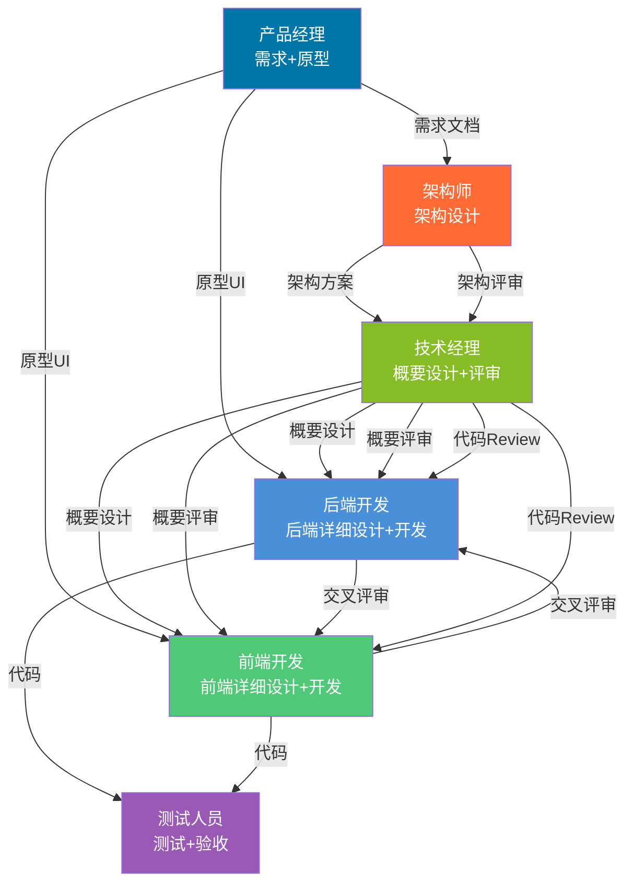

## 1.2 产品经理职责

| 职责 | 具体工作 | 产出物 | 参考文档 |
|------|---------|--------|---------|
| 需求分析 | 梳理业务需求，编写需求文档 | 产品需求说明书 | - |
| 原型设计 | 使用Figma Make生成原型和静态页面 | Figma设计稿、静态页面代码 | 《FigmaMake规范》 |
| 提交静态页面 | 将静态页面提交到frontend-static仓库 | 静态页面仓库提交记录 | - |
| 通知就绪 | 通知技术经理静态页面已就绪 | 通知消息（含Git commit信息） | - |
| 业务确认 | 参与详细设计评审，确认业务逻辑 | 评审通过意见 | - |

### 1.2.1 产品经理工作流程

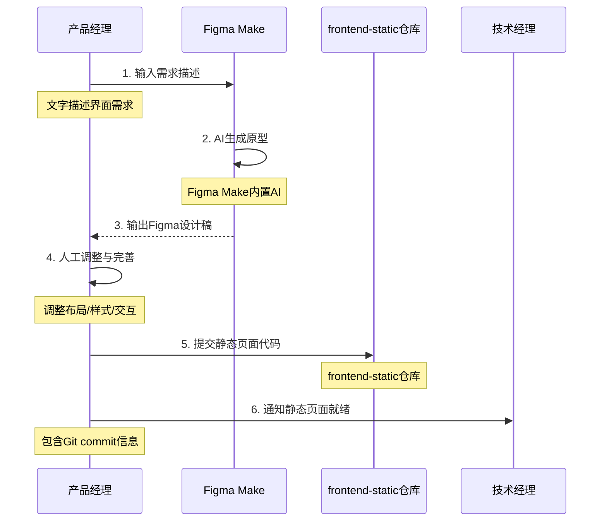

### 1.2.2 产品经理产出物

| 产出物 | 格式 | 交付对象 | 说明 |
|--------|------|----------|------|
| 设计稿 | Figma链接 | 技术经理 | UI设计参考 |
| 静态页面代码 | Angular代码 | 开发人员 | 前端开发输入 |
| 交互说明 | Markdown | 开发人员 | 交互行为说明 |

**关键点**：

- 原型UI必须完整覆盖需求页面
- 静态页面需提交到frontend-static仓库（只读）
- 静态页面就绪后需通知技术经理
- 交互说明必须清晰（筛选、分页、弹窗等）
- 需求变更需同步更新原型和静态页面

## 1.3 架构师职责

| 职责 | 具体工作 | 产出物 |
|------|---------|--------|
| 技术选型 | 确定技术栈、中间件、数据库等 | 技术选型文档 |
| 架构设计 | 整体架构设计、微服务划分、模块边界定义 | 架构设计文档 |
| 架构评审 | 评审概要设计的架构一致性 | 架构评审意见 |
| 技术治理 | 代码架构规范检查、技术债务管理 | 技术治理报告 |

**关键点**：

- 架构设计是概要设计的前置条件
- 架构师评审概要设计的架构一致性
- 负责技术选型的决策和把控
- 关注系统整体质量和长期可维护性

## 1.4 技术经理职责

| 职责 | 具体工作 | 产出物 |
|------|---------|--------|
| 概要设计 | 编写概要设计文档 | 概要设计文档 |
| 概要评审 | 评审概要设计 | 评审意见 |
| 代码Review | Review代码与文档一致性 | Review报告 |

**关键点**：
- 概要设计评审通过是进入详细设计的前置条件
- 概要设计基于架构师提供的架构方案
- 代码Review重点检查：代码是否与设计文档一致
- 需熟悉mermaid规范，能评审设计质量

## 1.5 后端开发职责

| 职责 | 具体工作 | 产出物 |
|------|---------|--------|
| 后端详细设计 | 使用mermaid编写面向对象程序设计 | 后端详细设计文档 |
| 设计评审 | 参与交叉评审 | 评审意见 |
| AI开发 | 基于设计文档，通过AI生成代码 | 后端代码 |
| 后端代码自测 | 对AI生成的代码进行功能自测 | 自测报告 |

**关键点**：
- 详细设计必须使用mermaid面向对象语法
- 详细设计评审通过是进入AI开发的前置条件
- 必须参与交叉评审（开发人员之间互评）
- AI开发前，设计文档必须是评审通过的版本
- 后端详细设计在概要设计完成后编写，依据需求文档、概要设计，包含数据库设计、接口设计、类设计

## 1.6 前端开发职责

| 职责 | 具体工作 | 产出物 |
|------|---------|--------|
| 前端详细设计 | 编写接口调用设计、组件设计 | 前端详细设计文档 |
| 静态页面同步 | 将产品经理静态页面React转换为Angular组件 | 前端组件代码 |
| 设计评审 | 参与交叉评审 | 评审意见 |
| AI开发 | 基于设计文档，通过AI生成代码 | 前端代码 |

**关键点**：

- 前端详细设计需等待产品经理提交静态页面后再编写
- 前端详细设计在后端详细设计完成后编写，依据静态页面、后端详细设计、需求文档，包含接口调用设计、组件设计、状态管理
- 静态页面需转换为项目框架组件（React/Angular）
- 详细设计评审通过是进入AI开发的前置条件
- 必须参与交叉评审

## 1.7 测试人员职责

| 职责 | 具体工作 | 产出物 |
|------|---------|--------|
| 用例设计 | 基于需求文档设计测试用例 | 测试用例 |
| 功能测试 | 执行测试用例 | 测试报告 |
| 验收 | 验证功能与需求/设计一致 | 验收报告 |

**关键点**：
- 测试用例基于需求文档，不是基于代码
- 验收标准：功能与需求文档、设计文档一致

---

<div style="page-break-after: always;"></div>

# 第二章：分支管理策略

## 2.1 核心原则

**文档先行，代码后置，版本规范**

1. **文档分支优先创建**：先创建文档分支，完成设计并评审通过后，才创建代码分支
2. **评审门禁**：文档评审通过是AI开发的前置条件
3. **严格顺序**：文档分支 → 文档评审 → 合并文档 → 代码分支 → AI开发
4. **版本对应**：文档版本标签与代码版本标签、分支一一对应
5. **测试轮次管理**：版本号第三位代表测试轮次

## 2.2 版本号规范

### 2.2.1 版本号格式

```
版本号格式：{大版本}.{小版本}.{测试轮次}
示例：v1.2.3
  ├── 1：大版本（重大架构变更、技术栈升级）
  ├── 2：小版本（新增功能模块）
  └── 3：测试轮次（第3轮测试）
```

### 2.2.2 版本号递增规则

| 版本位 | 名称 | 递增时机 | 示例 | 归零规则 |
|-------|------|---------|------|---------|
| 第一位 | 大版本 | 重大架构变更、技术栈升级、整体重构 | v1.x.x → v2.0.0 | 后两位归零 |
| 第二位 | 小版本 | 新增一个完整功能模块 | v1.1.x → v1.2.0 | 第三位归零 |
| 第三位 | 测试轮次 | 每进入新一轮测试 | v1.2.0 → v1.2.1 | 不归零，累加 |

### 2.2.3 版本号递增示例

```
项目初始发布：v1.0.0
  └── 第一位：1（首个大版本）
  └── 第二位：0（基础功能）
  └── 第三位：0（未测试）

新增订单模块：
  v1.0.0 → v1.1.0
  └── 第二位+1：新增功能模块
  └── 第三位归零：进入新功能测试

订单模块第1轮测试：v1.1.0 → v1.1.1
订单模块第2轮测试：v1.1.1 → v1.1.2
订单模块第3轮测试：v1.1.2 → v1.1.3

新增支付模块：v1.1.3 → v1.2.0
  └── 第二位+1：新增功能模块
  └── 第三位归零：进入新功能测试

支付模块第1轮测试：v1.2.0 → v1.2.1

架构升级（微服务拆分）：v1.2.1 → v2.0.0
  └── 第一位+1：重大架构变更
  └── 后两位归零：全新版本
```

### 2.2.4 版本号与分支类型对应关系

| 分支类型 | 版本号变化 | 示例 |
|---------|-----------|------|
| **feature/** | 第二位+1，第三位归零 | v1.1.5 → v1.2.0 |
| **release/** | 第三位+1（每轮测试） | v1.2.0 → v1.2.1 → v1.2.2 |
| **hotfix/** | 第三位+1 | v1.2.2 → v1.2.3 |

## 2.3 分支类型与命名规范

### 2.3.1 分支类型总览

| 分支类型 | 命名格式 | 示例 | 生命周期 | 用途 |
|---------|---------|------|---------|------|
| **主分支** | `main` | `main` | 永久 | 生产环境代码，只接受release/hotfix合并 |
| **开发分支** | `develop` | `develop` | 永久 | 开发环境代码，日常开发主分支 |
| **功能分支** | `feature/{模块名}` | `feature/user-module` | 临时 | 开发新功能，合并到develop |
| **预发布分支** | `release/v{版本}` | `release/v1.2.0` | 临时 | 预发布测试，测试完成后合并到main和develop |
| **修复分支** | `hotfix/{问题描述}` | `hotfix/fix-login-bug` | 临时 | 生产环境紧急bug修复 |

### 2.3.2 功能分支 (feature/**)

**用途**：开发新功能模块

**命名规范**：
```
feature/{模块名}
示例：
- feature/user-module        （用户模块）
- feature/order-module       （订单模块）
- feature/payment-module     （支付模块）
```

**生命周期**：
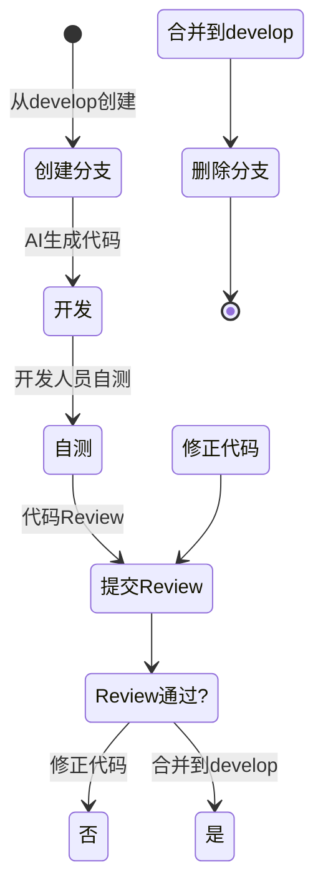

**合并到develop后**：第二位版本号+1，第三位归零
```
合并前：v1.1.5
合并后：v1.2.0
```

### 2.3.3 预发布分支 (release/**)

**用途**：预发布环境测试，验证功能完整性

**命名规范**：
```
release/v{版本}
示例：
- release/v1.2.0    （准备发布v1.2.0版本）
- release/v1.3.0    （准备发布v1.3.0版本）
```

**创建时机**：develop分支功能开发完成，通过自测后

**生命周期**：
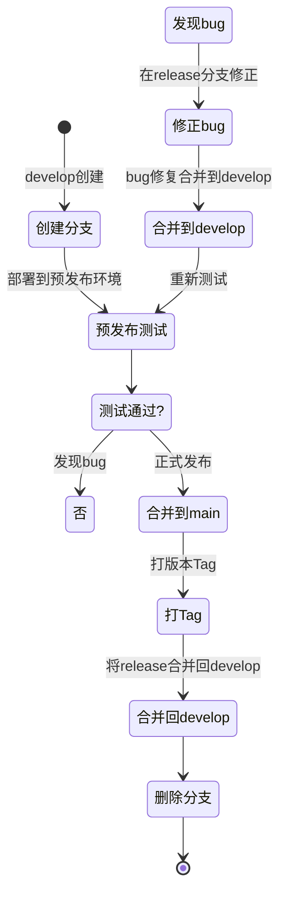

**测试流程详解**：

| 测试状态 | 操作 | 分支操作 | 版本变化 |
|---------|------|---------|---------|
| 第1轮测试失败 | 在release分支修正bug | 修正后合并到develop | v1.2.0 → v1.2.1 |
| 第2轮测试失败 | 在release分支修正bug | 修正后合并到develop | v1.2.1 → v1.2.2 |
| 第N轮测试通过 | 合并到main | 打Tag，合并回develop | v1.2.N（最终版本） |

**版本号递增逻辑**：
- 创建release分支时：继承develop版本，如 v1.2.0
- 每轮测试失败修正后：第三位+1，如 v1.2.0 → v1.2.1
- 测试通过后：使用最终版本号打tag，如 v1.2.3

**生命周期时长**：通常 2-5 天（取决于测试轮次）

### 2.3.4 修复分支 (hotfix/**)

**用途**：生产环境紧急bug修复

**命名规范**：
```
hotfix/{问题描述}
示例：
- hotfix/fix-login-timeout    （修复登录超时）
- hotfix/fix-order-calculate  （修复订单计算错误）
```

**创建时机**：生产环境发现紧急bug，需要立即修复

**生命周期**：
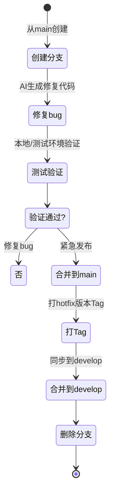

**版本号变化**：第三位+1
```
修复前：v1.2.3
修复后：v1.2.4
```

### 2.3.5 主分支 (main)

**用途**：生产环境代码，始终保持可发布状态

**特点**：
- 永久分支，不可删除
- 只接受来自 release/** 和 hotfix/** 的合并
- 每次合并后必须打Tag
- 受分支保护，禁止直接推送

**Tag规范**：
```
格式：v{大版本}.{小版本}.{测试轮次}
示例：v1.2.3
```

### 2.3.6 开发分支 (develop)

**用途**：开发环境主分支，日常开发集成

**特点**：
- 永久分支，不可删除
- 接受来自 feature/** 的合并
- 接受来自 release/** 的回并（测试期间的bug修正）
- 接受来自 hotfix/** 的同步
- 包含最新的开发文档

## 2.4 文档分支与代码分支的对应关系

### 2.4.1 对应关系总表

| 代码分支类型 | 对应文档分支 | 创建顺序 | 说明 |
|-------------|-------------|---------|------|
| feature/{模块} | feature/doc-{模块} | 文档分支先创建 | 功能开发 |
| hotfix/{问题} | hotfix/doc-{问题} | 文档分支先创建 | 紧急修复 |
| release/v{版本} | 无（不创建新文档分支） | - | 使用现有文档 |

### 2.4.2 功能开发分支对应示例

```
功能：开发订单模块

文档分支：feature/doc-order-module
  ├── 创建时间：Day 1
  ├── 基于：develop
  ├── 产出：订单模块概要设计.md、详细设计.md
  ├── 里程碑：评审通过后合并到develop
  └── 合并后版本：v1.2.0

代码分支：feature/order-module
  ├── 创建时间：Day 5（文档合并后）
  ├── 基于：develop（含v1.2.0文档）
  ├── 产出：订单模块代码
  ├── 里程碑：Review通过后合并到develop
  └── 合并后版本：v1.2.0
```

### 2.4.3 紧急修复分支对应示例

```
紧急修复：生产环境订单计算错误

文档分支：hotfix/doc-fix-order-calculate
  ├── 创建时间：发现问题时立即创建
  ├── 基于：main
  ├── 产出：订单计算修复设计.md
  └── 里程碑：快速评审后合并到main

代码分支：hotfix/fix-order-calculate
  ├── 创建时间：文档合并后
  ├── 基于：main（含修复文档）
  ├── 产出：订单计算修复代码
  └── 里程碑：验证通过后合并到main，版本v1.2.4
```

## 2.5 分支管理完整流程

### 2.5.1 功能开发完整流程

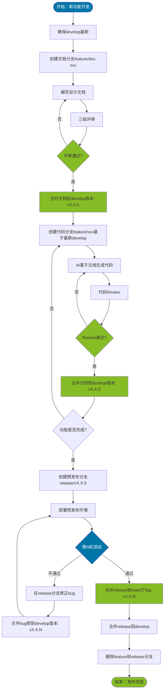

### 2.5.2 禁止与推荐操作

### 2.5.2.1 禁止的操作

❌ **禁止直接推送到main分支**
- 原因：main是生产环境，必须通过release/hotfix流程

❌ **禁止代码分支先于文档分支创建**
- 原因：设计不明确时不应开始编码

❌ **禁止在文档评审通过前创建代码分支**
- 原因：可能基于错误设计进行开发

❌ **禁止feature分支直接合并到main**
- 原因：必须经过release分支测试验证

❌ **禁止release分支测试失败后直接合并到main**
- 原因：必须测试通过才能发布

❌ **禁止代码Tag版本与文档Tag版本不一致**
- 原因：失去版本追溯能力

❌ **禁止删除main和develop分支**
- 原因：永久分支，不可删除

### 2.5.2.2 推荐的操作

✅ **文档分支先创建，代码分支后创建**
- 确保设计先行

✅ **文档评审通过后立即创建代码分支**
- 减少等待时间，避免文档过时

✅ **代码分支基于最新develop创建**
- 确保能读取到最新的设计文档

✅ **功能开发完成后立即创建release分支**
- 尽早进入预发布测试

✅ **release分支测试失败时，在release分支修正并合并到develop**
- 确保develop同步测试期间的bug修正

✅ **release分支测试通过后，先合并到main打Tag，再合并回develop**
- 确保main版本正确，同步回develop

✅ **hotfix修复后同步到develop**
- 确保develop包含生产环境的修复

## 2.6 设计变更流程

当设计需要变更时，必须遵循以下流程：

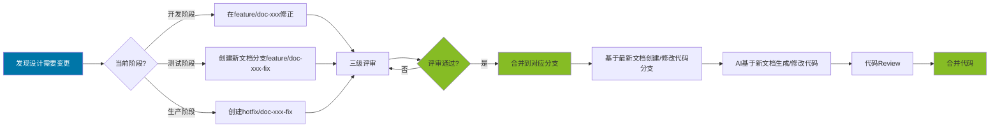

**变更记录格式**（在文档末尾维护）：

```markdown
## 变更记录

| 版本 | 变更日期 | 变更人 | 变更内容 | 变更原因 | 评审人 |
|------|---------|--------|---------|---------|--------|
| v1.2.0 | 2026-03-15 | 张三 | 初始化订单模块文档 | 新功能 | 李四 |
| v1.2.1 | 2026-03-18 | 张三 | 新增退款状态字段 | 业务变更 | 李四 |
| v1.2.2 | 2026-03-20 | 张三 | 修改订单状态流转逻辑 | 测试发现 | 李四 |
```

---

<div style="page-break-after: always;"></div>

# 第三章：文档空间

## 3.1 文档空间概述

文档空间是AI Coding的核心基础设施。所有设计文档、需求文档、测试文档都通过Git进行版本管理，确保文档与代码同步演进。

**核心原则：**
- 文档即代码，纳入Git版本控制
- 单仓库多目录，文档与代码同仓库
- 层级清晰，匹配开发流程阶段

## 3.2 仓库目录结构

```
project-repo/
├── doc/                                # 文档空间
│   ├── requirements/                   # 需求文档
│   │   └── PRD-{功能名}.md
│   ├── design/                         # 设计文档
│   │   ├── architecture/               # 架构设计（项目级）
│   │   │   └── {项目名}-架构设计.md
│   │   └── services/                   # 微服务设计
│   │       └── {微服务名}/              # 每个微服务一个目录
│   │           ├── 概要设计.md          # 微服务汇总概要设计
│   │           └── modules/            # 模块设计
│   │               └── {模块名}/
│   │                   ├── 概要设计.md      # 模块概要设计
│   │                   ├── 后端详细设计.md  # 后端详细设计
│   │                   └── 前端详细设计.md  # 前端详细设计
│   └── test/                           # 测试文档
│       └── {功能名}-测试用例.md
├── backend/                            # 后端代码
│   └── {微服务名}/
│       ├── src/
│       ├── CLAUDE.md                   # 微服务AI上下文（必选）
│       └── pom.xml
├── frontend/                           # 前端代码
│   ├── src/
│   └── package.json
├── CLAUDE.md                           # 项目级AI上下文（必选）
└── README.md
```

## 3.3 文档层级与职责

| 层级 | 文档类型 | 负责角色 | 存放路径 |
|------|---------|---------|---------|
| 项目级 | 架构设计 | 架构师 | doc/design/architecture/ |
| 微服务级 | 概要设计 | 技术经理 | doc/design/services/{微服务名}/ |
| 模块级 | 概要设计 | 后端/前端开发 | doc/design/services/{微服务名}/modules/{模块名}/ |
| 模块级 | 后端详细设计 | 后端开发 | doc/design/services/{微服务名}/modules/{模块名}/ |
| 模块级 | 前端详细设计 | 前端开发 | doc/design/services/{微服务名}/modules/{模块名}/ |

## 3.4 文档命名规范

| 文档类型 | 命名格式 | 示例 |
|---------|---------|------|
| 产品需求 | PRD-{功能名}.md | PRD-用户管理.md |
| 架构设计 | {项目名}-架构设计.md | CCF平台-架构设计.md |
| 微服务概要设计 | 概要设计.md | 概要设计.md（在微服务目录下） |
| 模块概要设计 | 概要设计.md | 概要设计.md（在模块目录下） |
| 后端详细设计 | 后端详细设计.md | 后端详细设计.md |
| 前端详细设计 | 前端详细设计.md | 前端详细设计.md |
| 测试用例 | {功能名}-测试用例.md | 用户管理-测试用例.md |

## 3.5 文档版本管理

**通过Git管理文档版本，遵循以下规范：**

1. **文档分支与代码分支对应**：设计文档在feature分支创建，随代码一起合并
2. **变更记录**：每个设计文档末尾维护变更记录表格
3. **评审后提交**：文档评审通过后才能提交到对应分支

## 3.6 文档与开发流程对应

| 开发阶段 | 产出文档 | 存放位置 |
|---------|---------|---------|
| 阶段一：需求与原型 | PRD文档 | doc/requirements/ |
| 阶段二：架构设计 | 架构设计文档 | doc/design/architecture/ |
| 阶段三：概要设计 | 微服务概要设计、模块概要设计 | doc/design/services/{微服务名}/ |
| 阶段四：详细设计 | 后端详细设计、前端详细设计 | doc/design/services/{微服务名}/modules/{模块名}/ |
| 阶段七：测试与交付 | 测试用例、测试报告 | doc/test/ |

## 3.7 CLAUDE.md — AI上下文文件规范

### 3.7.1 什么是 CLAUDE.md

`CLAUDE.md` 是 Claude Code（AI 编码助手）在打开项目时**自动加载**的上下文文件。它告诉 AI："这是什么项目、怎么构建、有什么规范、已有哪些能力"，让 AI 在不了解项目的情况下也能产出符合项目标准的代码。

备注：因为Claude Code目前是业界标杆，因此采用它的概念，其他编程工具利用CLAUDE.md同样有自己的方式加载，因此本章节不限定任何编程工具，只是用CLAUDE.md做个标准的演示和阐述。

**核心定位：AI 的"入职手册"，而不是人的阅读文档。**

| 属性 | 说明 |
|------|------|
| 文件名 | 固定为 `CLAUDE.md`（大写） |
| 格式 | Markdown |
| 加载时机 | AI 打开项目/目录时自动读取 |
| 读者 | AI |
| 维护者 | 技术经理 + 后端开发 |
| 更新频率 | 接口变更时同步更新 |

### 3.7.2 CLAUDE.md 放在哪里

```
project-repo/
├── CLAUDE.md                           # 项目级（必选）
├── backend/
│   └── {微服务名}/
│       └── CLAUDE.md                   # 微服务级（必选）
└── frontend/
    └── CLAUDE.md                       # 前端级（可选）
```

| 层级 | 文件 | 职责 |
|------|------|------|
| 项目级 | 根目录 `CLAUDE.md` | 技术栈、构建命令、编码规范、**能力速查表**、服务职责边界 |
| 微服务级 | `{微服务名}/CLAUDE.md` | 本服务职责、关键模块、**已提供能力**（自研/框架/Feign三层）、数据库表、开发注意事项 |
| 前端级 | `frontend/CLAUDE.md` | 前端技术栈、组件规范、状态管理（如有独立前端团队） |

### 3.7.3 微服务级 CLAUDE.md 必选章节

每个微服务的 `CLAUDE.md` 必须包含以下章节，顺序固定：

```markdown
# {服务名} {服务中文名}

## 职责
一句话说明本服务做什么。

## 关键模块
| 模块 | Controller | Service | 说明 |

## 已提供能力                          ← 核心：防止重复开发

### 自研接口
本服务自行开发的接口，按模块分组。

| 能力 | 方法 | 路径 | 说明 |

### 框架提供（{starter名}）
框架自动注入的能力，本服务直接调用即可，禁止重新实现。
> 详细规范：`doc/base/framework/{starter名}.md`

| 能力域 | 关键类/路径 | 说明 |

### Feign 开放接口（供其他服务调用）
本服务通过 OpenAPI 对外暴露的接口，其他微服务通过 Feign 调用。

| 能力 | OpenAPI 路径 | 说明 |

## 数据库表
| 表名 | 说明 |

## 开发注意事项
本服务特有的踩坑点、红线约束。

## 设计文档
| 文档 | 路径 |
```

### 3.7.4 项目级 CLAUDE.md 能力速查表

项目根 `CLAUDE.md` 必须包含**能力速查**章节，按"我需要...→ 去哪找"组织，帮助 AI 在开发任何服务的新功能时快速定位已有能力：

```markdown
## 能力速查（开发新接口前必查）

> 开发任何新接口前，先查下表确认已有能力。已有能力直接复用，禁止重新实现。

### 认证与用户（upms-service + 框架）
| 我需要... | 去哪里找 | 关键接口/类 |

### 基础数据（base-service）
| 我需要... | 去哪里找 | 关键接口/类 |

### 尚未提供（规划中）
| 我需要... | 状态 | 说明 |
```

### 3.7.5 CLAUDE.md 维护规则

| 规则 | 说明 |
|------|------|
| **接口变更必同步** | 新增、修改、删除接口时，必须同步更新 CLAUDE.md 的"已提供能力"表 |
| **新建服务必创建** | 新建微服务时，第一步创建 CLAUDE.md，从 demo-service 复制模板 |
| **框架升级必刷新** | 框架 starter 版本升级后，检查并更新"框架提供"章节 |
| **禁止堆砌代码** | CLAUDE.md 只放结构化表格和简短说明，不放完整代码（代码放详细设计文档） |
| **保持精简** | 微服务级 CLAUDE.md 控制在 200 行以内，项目级控制在 300 行以内 |

### 3.7.6 CLAUDE.md 与设计文档的关系

```
AI 开发工作流：

1. 读项目根 CLAUDE.md
   → 能力速查表：这个需求是否已有现成能力？
     ├─ 有 → 直接复用（查微服务级 CLAUDE.md 的接口详情）
     └─ 没有 → 继续往下

2. 读目标服务的 CLAUDE.md
   → 已提供能力三层表：本服务框架是否已提供？
     ├─ 框架提供 → 读 doc/base/framework/xxx.md 查详细规范
     └─ 没有 → 需要自研，进入详细设计

3. 读详细设计文档
   → doc/design/services/{服务名}/modules/{模块名}/后端详细设计.md
   → 按设计文档编码
```

| 文档 | 定位 | 更新时机 |
|------|------|---------|
| CLAUDE.md | AI 速查手册 | 接口变更时 |
| 概要设计.md | 服务级设计蓝图 | 架构评审通过后 |
| 后端详细设计.md | 接口级实现规范 | 概要设计评审后 |
| 前端详细设计.md | 前后端联调实现 | 后端详细设计评审后 |
| doc/base/framework/*.md | 框架 API 规范 | 框架版本升级时 |

---

<div style="page-break-after: always;"></div>

# 第四章：开发全流程

## 4.1 流程总览

### 4.1.1 七阶段流程图

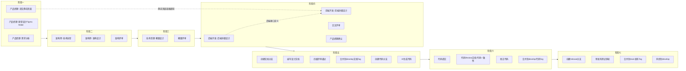

#### 前后端详细设计依赖关系

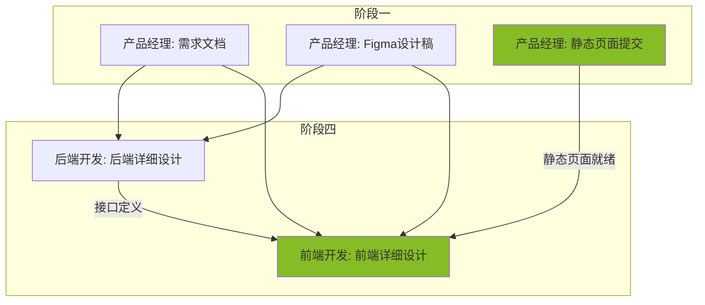

### 3.1.2 各阶段概览

| 阶段 | 名称 | 负责角色 | 产出物 | 入口条件 | 出口条件 |
|------|------|---------|--------|---------|---------|
| **阶段一** | 需求与原型 | 产品经理 | 需求文档、Figma设计稿、静态页面 | 项目启动 | 需求确认通过，静态页面已提交 |
| **阶段二** | 架构设计 | 架构师 | 架构设计文档、技术选型文档 | 需求文档完成 | 架构评审通过 |
| **阶段三** | 概要设计 | 技术经理 | 概要设计文档 | 架构设计完成 | 概要评审通过 |
| **阶段四** | 详细设计 | 后端开发+前端开发 | 后端详细设计、前端详细设计 | 概要设计完成 | 四级评审通过 |
| **阶段五** | AI开发 | 后端开发+前端开发+AI | 代码 | 设计文档完成 | 代码自测通过 |
| **阶段六** | 代码Review | 技术经理 | Review报告 | 代码完成 | Review通过 |
| **阶段七** | 测试与交付 | 测试人员+技术经理 | 测试报告 | 代码Review通过 | 测试通过并发布 |

## 4.2 阶段一：需求与原型（产品经理）

### 3.2.1 阶段目标

产出清晰的需求文档、可交互的原型UI和静态页面代码，为后续设计提供准确的业务输入。

### 3.2.2 输入产出物

| 类型 | 名称 | 说明 |
|------|------|------|
| **输入** | 业务需求 | 来自业务方的原始需求（基于旧框架梳理） |
| **产出** | 产品需求说明书 | 结构化的需求文档 |
| **产出** | Figma设计稿 | 使用Figma Make生成的设计稿 |
| **产出** | 静态页面代码 | 提交到frontend-static仓库 |
| **产出** | 交互说明 | 筛选、分页、弹窗等交互说明 |

### 3.2.3 核心活动

**活动1：需求分析**

- 梳理业务流程
- 识别功能模块
- 明确数据字段
- 确认边界条件

**活动2：原型设计（参考《FigmaMake规范》）**

- 使用Figma Make生成页面原型
- 确保页面覆盖所有需求
- 编写交互说明
- 产品经理自验原型完整性

**活动3：生成并提交静态页面**
- 从Figma Make导出静态页面代码（React）
- 提交静态页面到frontend-static仓库
- 通知技术经理静态页面已就绪

### 3.2.4 仓库结构说明

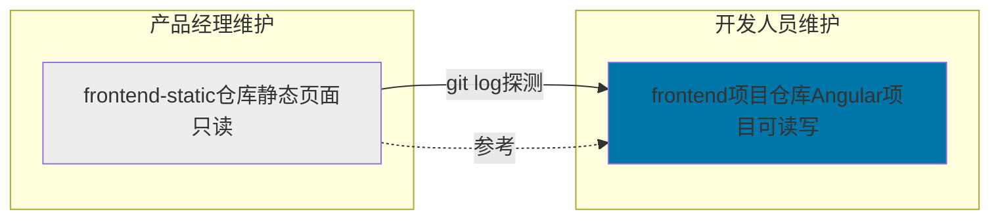

### 3.2.5 静态页面更新流程

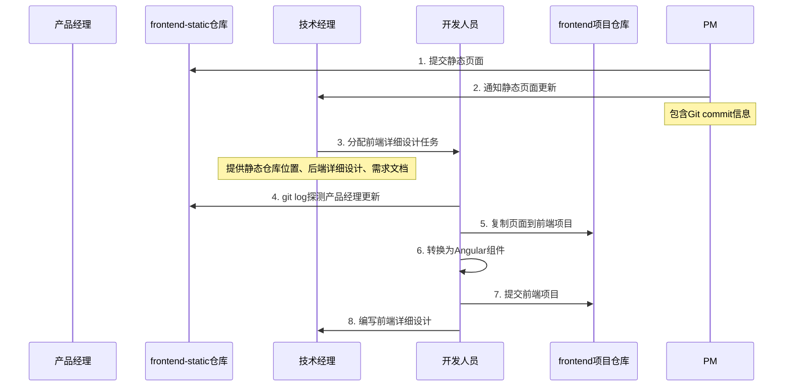

### 3.2.6 入口出口条件

**入口条件**：

​	项目启动，业务需求明确

**出口条件**：

​	需求文档编写完成

​	Figma设计稿覆盖所有需求页面

​	静态页面已提交到frontend-static仓库

​	交互说明清晰完整

​	需求评审通过（业务确认）

### 3.2.7 关键检查点

| 检查项 | 说明 | 负责人 |
|--------|------|--------|
| 需求完整性 | 所有功能点都有描述 | 产品经理 |
| 设计稿覆盖度 | 设计稿覆盖所有需求页面 | 产品经理 |
| 静态页面提交 | 已提交到frontend-static仓库 | 产品经理 |
| 交互清晰性 | 交互说明无歧义 | 产品经理 |
| 业务确认 | 业务方确认需求 | 业务方 |

## 4.3 阶段二：架构设计（架构师）

> **📌 模板位置**：架构设计模板请参考[附录B.1 架构设计模板](#b1-架构设计模板)

### 3.3.1 阶段目标

完成技术选型和架构设计，明确整体架构和技术方案。

### 3.3.2 输入产出物

| 类型 | 名称 | 说明 |
|------|------|------|
| **输入** | 需求文档 | 来自阶段一 |
| **输入** | 原型UI | 来自阶段一 |
| **产出** | 技术选型文档 | 技术栈、中间件、数据库等 |
| **产出** | 架构设计文档 | 整体架构、模块划分、接口设计 |

### 3.3.3 核心活动

**活动1：技术选型**
- 确定后端技术栈
- 确定数据库选型
- 确定中间件（消息队列、缓存等）
- 确定第三方集成方案

**活动2：架构设计**
- 整体架构设计
- 微服务划分
- 接口定义
- 数据模型设计
- 时序图/流程图

**活动3：架构评审**
- 架构师评审技术方案
- 确认架构合理性
- 确认技术可行性

### 3.3.4 入口出口条件

**入口条件**：

​	需求文档完成

​	原型UI完成

​	需求评审通过

**出口条件**：

​	技术选型文档完成

​	架构设计文档完成

​	架构评审通过

### 3.3.5 关键检查点

| 检查项 | 说明 | 负责人 |
|--------|------|--------|
| 技术合理性 | 技术选型符合业务需求 | 架构师 |
| 架构清晰性 | 架构设计清晰易懂 | 架构师 |
| 接口完整性 | 接口定义完整 | 架构师 |
| 可扩展性 | 架构支持未来扩展 | 架构师 |

## 4.4 阶段三：概要设计（技术经理）

> **📌 模板位置**：概要设计模板请参考[附录B.1 概要设计模板](#b1-概要设计模板)

### 3.4.1 阶段目标

在架构设计基础上，完成模块级概要设计，明确接口定义和数据模型。

### 3.4.2 输入产出物

| 类型 | 名称 | 说明 |
|------|------|------|
| **输入** | 架构设计文档 | 来自阶段二 |
| **输入** | 需求文档 | 来自阶段一 |
| **产出** | 概要设计文档 | 模块划分、接口设计、数据模型 |

### 3.4.3 核心活动

**活动1：模块划分**
- 根据架构设计划分功能模块
- 明确模块职责和边界
- 定义模块间依赖关系

**活动2：接口定义**
- 定义模块对外接口
- 设计接口参数和返回值
- 编写接口文档

**活动3：数据模型设计**
- 设计数据库表结构
- 定义实体关系
- 编写ER图

**活动4：概要评审**
- 技术经理评审概要设计
- 确认与架构设计一致性
- 确认接口完整性

### 3.4.4 入口出口条件

**入口条件**：

​	架构设计完成

​	架构评审通过

**出口条件**：

​	概要设计文档完成

​	概要评审通过

### 3.4.5 关键检查点

| 检查项 | 说明 | 负责人 |
|--------|------|--------|
| 架构一致性 | 与架构设计保持一致 | 技术经理 |
| 接口完整性 | 接口定义完整 | 技术经理 |
| 数据模型合理 | 表设计符合规范 | 技术经理 |
| 模块划分清晰 | 模块职责单一 | 技术经理 |

## 4.5 阶段四：详细设计（后端开发+前端开发）

> **📌 模板位置**：
> - 后端详细设计模板请参考[附录B.2 后端详细设计模板](#b2-后端详细设计模板)
> - 前端详细设计模板请参考[附录B.3 前端详细设计模板](#b3-前端详细设计模板)

### 3.5.1 阶段目标

使用mermaid编写面向对象的程序设计，产出详细设计文档。

### 3.5.2 输入产出物

| 类型 | 名称 | 说明 |
|------|------|------|
| **输入** | 需求文档 | 来自阶段一 |
| **输入** | 概要设计文档 | 来自阶段三 |
| **输入** | 原型UI | 来自阶段一 |
| **产出** | 详细设计文档 | 包含mermaid程序设计 |

### 3.5.3 核心活动

**活动1：详细设计编写**
- 使用mermaid class diagram设计类结构
- 使用mermaid sequence diagram设计交互流程
- 使用mermaid flowchart设计业务流程
- 编写方法签名和逻辑说明

**活动2：交叉评审**
- 后端开发/前端开发之间互评
- 检查mermaid语法正确性
- 检查设计合理性

**活动3：产品经理确认**
- 产品经理确认业务逻辑
- 产品经理确认数据字段
- 产品经理确认交互流程

### 3.5.4 入口出口条件

**入口条件**：

​	概要设计文档完成

​	概要评审通过

**出口条件**：

​	详细设计文档完成

​	mermaid设计符合规范

​	交叉评审通过

​	产品经理确认通过

### 3.5.5 关键检查点

| 检查项 | 说明 | 负责人 |
|--------|------|--------|
| mermaid语法 | 符合面向对象规范 | 评审人 |
| 设计完整性 | 覆盖所有需求功能 | 后端开发/前端开发 |
| 逻辑正确性 | 业务逻辑设计正确 | 评审人 |
| 产品经理确认 | 业务逻辑符合需求 | 产品经理 |

### 3.5.6 前端详细设计

#### 设计定位

前端详细设计是后端详细设计的补充，重点描述**前端如何调用后端接口**。

- **编写者**：开发人员
- **编写时机**：后端详细设计完成后，且产品经理已提交静态页面

#### 编写时机流程

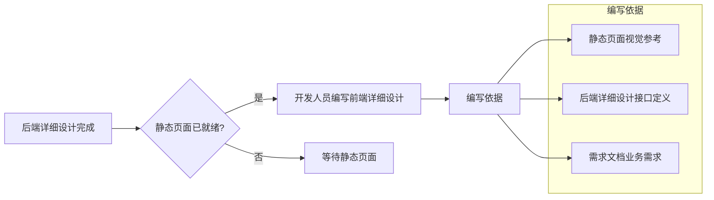

#### 核心章节

| 章节 | 内容 | 精度要求 |
|------|------|---------|
| **模块概述** | 功能描述、边界、角色权限 | 概述级 |
| **接口调用总览** | 接口清单、依赖关系 | 清单级 |
| **页面详细设计** | 页面清单、跳转关系 | 页面级 |
| **页面初始化流程** | 接口调用序列、时序图 | 调用级 |
| **用户操作流程** | 操作-接口映射表 | 操作级 |
| **组件设计** | 组件结构、组件清单 | 组件级 |
| **数据转换设计** | 请求数据构造、响应数据处理 | 转换级 |
| **状态管理设计** | 全局状态、页面状态 | 状态级 |
| **错误处理设计** | 接口错误处理、用户操作错误 | 处理级 |
| **测试设计** | 接口调用测试 | 测试级 |

#### 静态页面同步流程

开发人员通过Git Log探测产品经理更新的静态页面，并同步到前端项目。

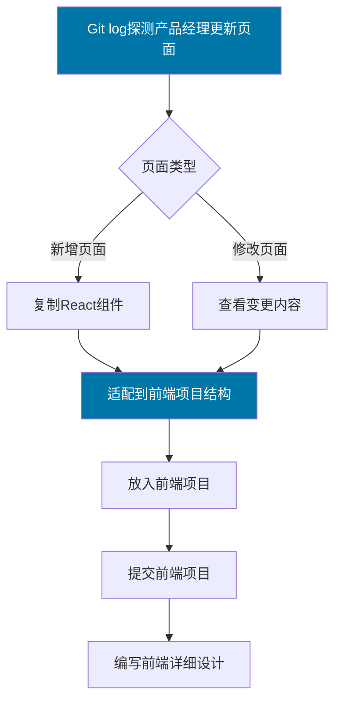

**探测流程说明**：

1. **Git Log探测**：开发人员定期检查产品经理的静态页面仓库（frontend-static）的Git提交记录
2. **页面类型判断**：识别是新增页面还是修改现有页面
3. **复制组件**：将产品经理提交的HTML/CSS/JS复制到前端项目
4. **适配项目结构**：调整文件路径、组件命名，符合前端项目规范
5. **提交前端项目**：将适配后的组件提交到前端代码仓库
6. **编写详细设计**：基于静态页面编写前端详细设计文档

**自动化工具支持**：

可使用Claude Code的Skills实现自动探测和同步：
- `html-to-react` Skill：将HTML转换为React组件
- `html-to-vue` Skill：将HTML转换为Vue组件
- `frontend-design` Skill：辅助生成前端详细设计

#### 仓库结构说明

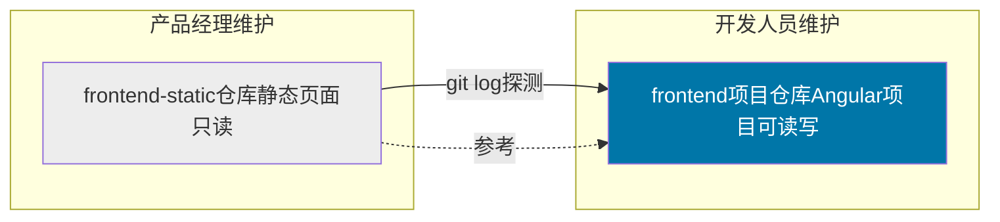

#### 输入产出物

| 类型 | 名称 | 说明 |
|------|------|------|
| **输入** | 静态页面 | 来自产品经理，frontend-static仓库 |
| **输入** | 后端详细设计 | 来自阶段三 |
| **输入** | 需求文档 | 来自阶段一 |
| **产出** | 前端详细设计文档 | 包含接口调用设计 |
| **产出** | Angular组件 | 转换后的前端组件 |

#### 入口出口条件

**入口条件**：

​	后端详细设计完成

​	静态页面已提交到frontend-static仓库

**出口条件**：

​	前端详细设计文档完成

​	静态页面已转换为React/Vue组件

​	接口调用设计与后端接口一致

## 4.6 阶段五：AI开发（后端开发+前端开发+AI）

### 3.6.1 阶段目标

基于评审通过的设计文档，使用AI生成代码。

### 3.6.2 输入产出物

| 类型 | 名称 | 说明 |
|------|------|------|
| **输入** | 详细设计文档 | 评审通过的版本 |
| **输入** | 概要设计文档 | 评审通过的版本 |
| **产出** | 代码 | AI生成的代码 |

### 3.6.3 核心活动

**活动1：创建文档分支**

```
git checkout develop
git pull origin develop
git checkout -b feature/doc-{模块名}
```

**活动2：编写设计文档**

- 将概要设计、详细设计整理到文档分支
- 确保文档格式符合规范
- 提交文档

**活动3：四级评审**

- 架构师评审架构设计
- 技术经理评审概要设计
- 后端开发/前端开发交叉评审详细设计
- 产品经理确认业务逻辑

**活动4：合并文档到develop**

```
git checkout develop
git merge feature/doc-{模块名}
git tag v{版本}-doc
git push origin develop --tags
```

**活动5：创建代码分支**

```
git checkout develop
git pull origin develop
git checkout -b feature/{模块名}
```

**活动6：AI生成代码**
- 让AI读取develop中的设计文档
- 基于设计文档生成代码
- 确保代码符合规范

### 3.6.4 入口出口条件

**入口条件**：

​	详细设计评审通过

​	文档已合并到develop

​	文档Tag已创建

**出口条件**：

​	代码生成完成

​	代码自测通过

​	代码已提交到代码分支

### 3.6.5 关键检查点

| 检查项 | 说明 | 负责人 |
|--------|------|--------|
| 文档版本 | AI读取的是最新文档 | 后端开发/前端开发 |
| 代码规范 | 代码符合编码规范 | 后端开发/前端开发 |
| 自测通过 | 基本功能可运行 | 后端开发/前端开发 |

## 4.7 阶段六：代码Review（技术经理）

### 3.7.1 阶段目标

Review代码，重点检查代码与设计文档的一致性。

### 3.7.2 输入产出物

| 类型 | 名称 | 说明 |
|------|------|------|
| **输入** | 代码 | 来自阶段五 |
| **输入** | 设计文档 | develop中的文档 |
| **产出** | Review报告 | Review意见和结果 |

### 3.7.3 核心活动

**活动1：代码Review**
- 检查代码与设计文档一致性
- 检查mermaid设计与代码实现的对应关系
- 检查方法签名是否与设计一致
- 检查业务逻辑是否与设计一致

**活动2：问题修正**
- 如有不一致，要求后端开发/前端开发修正
- 修正后重新Review

**活动3：合并代码**
```
git checkout develop
git merge feature/{模块名}
git tag v{版本}-code
git push origin develop --tags
```

### 3.7.4 入口出口条件

**入口条件**：

​	代码自测通过

​	代码已提交到代码分支

**出口条件**：

​	代码Review通过

​	代码与文档一致

​	代码已合并到develop

​	代码Tag已创建

### 3.7.5 关键检查点

| 检查项 | 说明 | 负责人 |
|--------|------|--------|
| 文档一致性 | 代码与设计文档一致 | 技术经理 |
| 类结构一致 | 类与mermaid class diagram一致 | 技术经理 |
| 方法签名一致 | 方法与设计一致 | 技术经理 |
| 业务逻辑一致 | 业务逻辑与设计一致 | 技术经理 |
| 代码规范 | 代码符合编码规范 | 技术经理 |

## 4.8 阶段七：测试与交付（测试人员+技术经理）

### 3.8.1 阶段目标

预发布测试，验证功能完整性，发布到生产环境。

### 3.8.2 输入产出物

| 类型 | 名称 | 说明 |
|------|------|------|
| **输入** | 代码 | develop中的代码 |
| **输入** | 需求文档 | 来自阶段一 |
| **产出** | 测试报告 | 测试人员测试报告 |
| **产出** | 发布版本 | main中的发布版本 |

### 3.8.3 核心活动

**活动1：创建release分支**
```
git checkout develop
git pull origin develop
git checkout -b release/v{版本}
```

**活动2：预发布测试**
- 部署到预发布环境
- 测试人员执行测试用例
- 记录测试问题

**活动3：bug修正**
- 在release分支修正bug
- 合并bug修到develop
- 重新测试
- 版本号递增（第三位+1）

**活动4：发布**
```
# 测试通过后
git checkout main
git merge release/v{最终版本}
git tag v{最终版本}
git push origin main --tags

# 同步回develop
git checkout develop
git merge release/v{最终版本}
git push origin develop
```

### 3.8.4 入口出口条件

**入口条件**：

​	代码Review通过

​	代码已合并到develop

**出口条件**：

​	预发布测试通过

​	代码合并到main

​	发布Tag已创建

​	代码同步到develop

### 3.8.5 关键检查点

| 检查项 | 说明 | 负责人 |
|--------|------|--------|
| 功能完整 | 所有功能已实现 | 测试人员 |
| 需求符合 | 功能符合需求文档 | 测试人员 |
| 无严重bug | 无阻塞性bug | 测试人员 |
| 文档一致 | 功能与设计文档一致 | 技术经理 |

### 3.8.6 测试轮次管理

| 轮次 | 状态 | 操作 | 版本变化 |
|------|------|------|---------|
| 第1轮 | 测试失败 | 在release修正bug，合并到develop | v1.2.0 → v1.2.1 |
| 第2轮 | 测试失败 | 在release修正bug，合并到develop | v1.2.1 → v1.2.2 |
| 第N轮 | 测试通过 | 合并到main，打Tag | v1.2.N |

## 4.9 流程异常处理

### 3.9.1 需求变更

| 变更时机 | 处理方式 |
|---------|---------|
| 阶段一 | 直接修改需求和原型 |
| 阶段二 | 修改概要设计，重新评审 |
| 阶段三 | 修改详细设计，重新评审 |
| 阶段四 | 修改设计文档，重新评审，AI重新生成代码 |
| 阶段五 | 修改设计文档和代码，重新Review |
| 阶段六 | 创建hotfix分支，走紧急修复流程 |

### 3.9.2 设计评审不通过

| 评审类型 | 不通过处理 |
|---------|-----------|
| 架构评审 | 修改架构设计，架构师重新评审 |
| 概要评审 | 修改概要设计，技术经理重新评审 |
| 详细评审-交叉评审 | 修改详细设计，重新提交交叉评审 |
| 详细评审-产品经理确认 | 修改详细设计，重新提交产品经理确认 |

### 3.9.3 代码Review不通过

| 问题类型 | 处理方式 |
|---------|---------|
| 文档不一致 | 修正代码，使与文档一致 |
| 代码规范问题 | 修正代码，符合规范 |
| 逻辑错误 | 修正代码逻辑 |
| 设计问题 | 修改设计文档，重新评审，重新生成代码 |

---

<div style="page-break-after: always;"></div>

# 第五章：评审机制

## 5.1 评审体系总览

### 5.1.1 四级评审体系

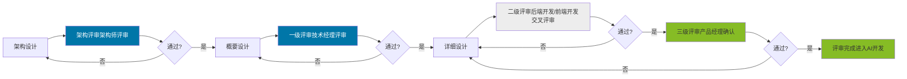

### 5.1.2 评审类型对照表

| 评审级别 | 评审对象 | 评审者 | 评审重点 |
|---------|---------|--------|---------|
| **架构评审** | 架构设计 | 架构师 | 技术选型合理性、架构可扩展性 |
| **一级评审** | 概要设计 | 技术经理 | 架构一致性、接口完整性 |
| **二级评审** | 详细设计 | 后端开发/前端开发交叉评审 | mermaid规范、设计完整性 |
| **三级评审** | 详细设计 | 产品经理 | 业务逻辑正确性 |

### 5.1.3 评审流程

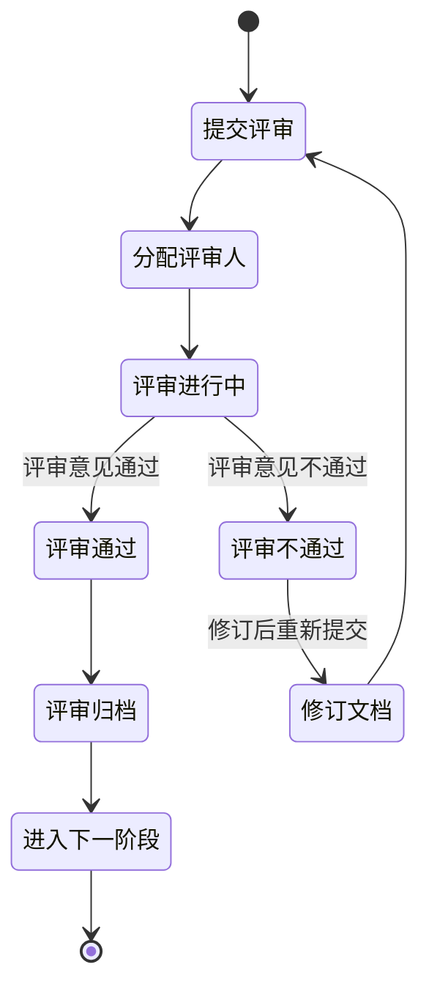

## 5.2 一级评审：概要设计评审

### 5.2.1 评审目标

确保概要设计的架构合理性、技术可行性和接口完整性。

### 5.2.2 评审者

| 角色 | 职责 |
|------|------|
| **评审人** | 技术经理 |
| **被评审人** | 概要设计编写者（技术经理本人或架构师） |

### 5.2.3 评审时机

- 概要设计文档编写完成后
- 详细设计开始之前

### 5.2.4 评审标准

#### 5.2.4.1 架构设计评审

| 评审项 | 评审内容 | 通过标准 |
|-------|---------|---------|
| **架构合理性** | 分层是否清晰、模块划分是否合理 | 模块职责单一、边界清晰 |
| **技术选型** | 技术栈是否合适、版本是否稳定 | 技术成熟、符合团队技术栈 |
| **可扩展性** | 是否支持未来扩展 | 预留扩展点、避免过度设计 |
| **性能考虑** | 是否考虑性能瓶颈 | 有缓存、异步等性能方案 |

#### 5.2.4.2 接口设计评审

| 评审项 | 评审内容 | 通过标准 |
|-------|---------|---------|
| **接口完整性** | 接口是否覆盖所有功能 | 所有功能都有对应接口 |
| **接口规范** | 接口命名、参数、返回值是否规范 | 符合RESTful规范 |
| **接口文档** | 接口文档是否完整清晰 | 有请求/响应示例 |

#### 5.2.4.3 数据模型评审

| 评审项 | 评审内容 | 通过标准 |
|-------|---------|---------|
| **表结构** | 表设计是否规范 | 符合数据库设计范式 |
| **字段定义** | 字段类型、长度是否合理 | 满足业务需求、预留扩展 |
| **索引设计** | 索引是否合理 | 有必要的索引、避免过度索引 |
| **ER图** | 实体关系是否清晰 | 关系正确、无冗余 |

### 5.2.5 评审检查清单

```markdown
## 概要设计评审清单

### 架构设计
- 整体架构清晰合理
- 模块划分职责单一
- 技术选型合理且稳定
- 考虑了可扩展性
- 有性能优化方案

### 接口设计
- 接口覆盖所有功能
- 接口命名符合规范
- 请求参数定义完整
- 响应结构统一规范
- 有完整的接口文档

### 数据模型
- 表设计符合规范
- 字段类型长度合理
- 有必要的索引
- ER图清晰准确

### 非功能需求
- 有安全设计方案
- 有异常处理机制
- 有日志记录方案
- 有监控告警方案

### 风险评估
- 识别了关键技术风险
- 有风险应对方案
```

### 5.2.6 评审流程

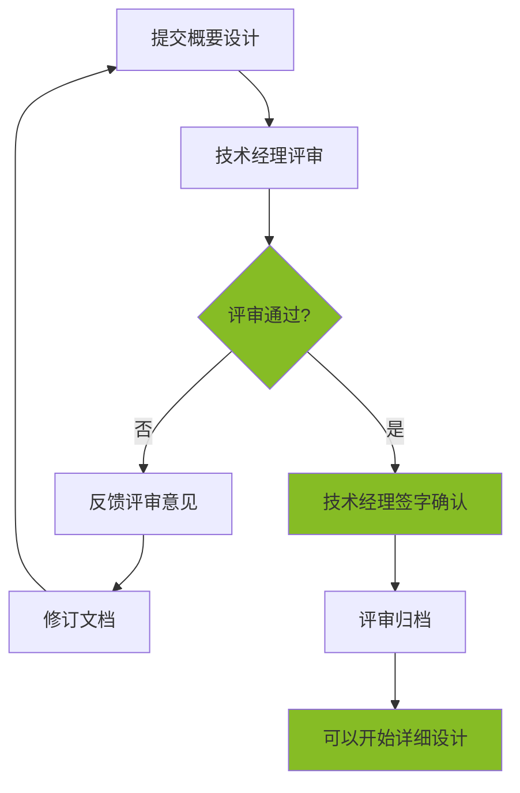

### 5.2.7 评审结果

| 结果 | 说明 | 后续操作 |
|------|------|---------|
| **通过** | 评审意见全部通过 | 开始详细设计 |
| **有条件通过** | 有小问题，但不影响后续 | 修订问题后开始详细设计 |
| **不通过** | 有重大问题，需要修订 | 修订后重新评审 |

## 5.3 二级评审：详细设计交叉评审

### 5.3.1 评审目标

确保详细设计的mermaid程序设计符合规范、设计完整正确。

### 5.3.2 评审者

| 角色 | 职责 |
|------|------|
| **评审人** | 其他开发人员（至少2名） |
| **被评审人** | 详细设计编写者（开发人员） |
| **协调人** | 技术经理（分配评审人） |

### 5.3.3 评审时机

- 详细设计文档编写完成后
- AI开发开始之前

### 5.3.4 评审分配原则

| 原则 | 说明 |
|------|------|
| **交叉评审** | 不评审自己编写的文档 |
| **专业匹配** | 优先分配同技术栈的评审人 |
| **至少2人** | 每份文档至少2名评审人 |
| **时间充足** | 给予评审人充足的评审时间（至少1天） |

### 5.3.5 评审标准

#### 5.3.5.1 mermaid规范评审

| 评审项 | 评审内容 | 通过标准 |
|-------|---------|---------|
| **类图规范** | 类名、方法名、字段名符合命名规范 | 符合大驼峰、小驼峰规范 |
| **类关系** | 类之间的关系使用正确的mermaid语法 | 关联、依赖、继承等使用正确 |
| **可见性** | public/private/protected使用正确 | 符合设计原则 |
| **时序图** | 时序图清晰展示调用关系 | 时序正确、参与者清晰 |

#### 5.3.5.2 设计完整性评审

| 评审项 | 评审内容 | 通过标准 |
|-------|---------|---------|
| **类设计完整** | 每个类都有完整的属性和方法 | 无遗漏 |
| **方法签名** | 方法签名清晰（参数、返回值） | 类型明确 |
| **业务流程** | 关键业务有流程图或时序图 | 流程清晰 |
| **异常处理** | 考虑了异常场景 | 有异常处理设计 |

#### 5.3.5.3 设计正确性评审

| 评审项 | 评审内容 | 通过标准 |
|-------|---------|---------|
| **业务逻辑** | 业务逻辑设计正确 | 符合需求 |
| **数据流转** | 数据流转清晰正确 | 无遗漏、无冗余 |
| **边界条件** | 考虑了边界条件 | 有边界处理 |

### 5.3.6 评审检查清单

```markdown
## 详细设计评审清单

### mermaid规范
- 类名使用大驼峰
- 方法名使用小驼峰
- 字段名使用小驼峰
- 可见性标识正确（+/-/#）
- 类关系语法正确（--> / ..> / --|>）
- 时序图参与者清晰
- 流程图判断逻辑清晰

### 设计完整性
- 所有类都有类图
- 核心类有详细说明
- 所有方法都有签名定义
- 关键业务有流程图
- 复杂逻辑有时序图

### 设计正确性
- 业务逻辑符合需求
- 数据流转正确
- 考虑了边界条件
- 有异常处理设计
- 与概要设计一致

### 可实现性
- 设计可以实现
- 复杂度合理
- 无技术死锁
```

### 5.3.7 评审流程

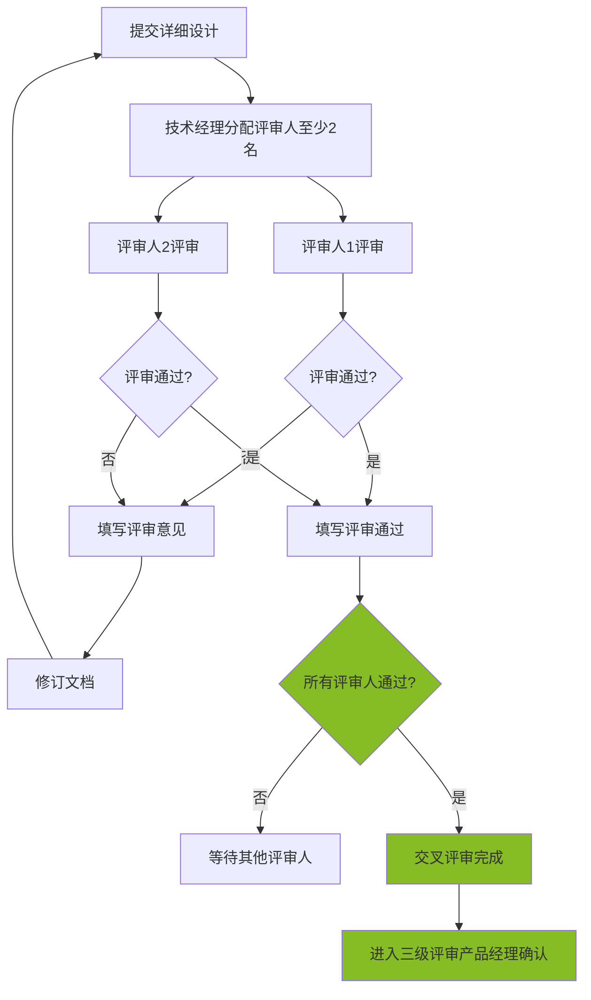

## 5.4 三级评审：产品经理业务确认

### 5.4.1 评审目标

确保详细设计的业务逻辑与需求一致，数据字段符合业务要求。

### 5.4.2 评审者

| 角色 | 职责 |
|------|------|
| **评审人** | 产品经理 |
| **被评审人** | 详细设计编写者（开发人员） |
| **配合人** | 技术经理（协助理解技术设计） |

### 5.4.3 评审时机

- 二级评审（交叉评审）通过后
- AI开发开始之前

### 5.4.4 评审标准

#### 5.4.4.1 业务一致性评审

| 评审项 | 评审内容 | 通过标准 |
|-------|---------|---------|
| **功能覆盖** | 设计覆盖所有需求功能 | 无遗漏 |
| **业务逻辑** | 业务逻辑符合需求文档 | 与需求一致 |
| **数据字段** | 数据字段与需求一致 | 类型、长度符合业务 |
| **交互流程** | 交互流程与原型一致 | 筛选、分页、弹窗等 |

#### 5.4.4.2 数据字段评审

| 评审项 | 评审内容 | 通过标准 |
|-------|---------|---------|
| **字段完整性** | 需求中的字段都在设计中 | 无遗漏 |
| **字段类型** | 字段类型符合业务需求 | 类型正确 |
| **字段长度** | 字段长度满足业务需求 | 长度合理 |
| **枚举值** | 枚举值与需求一致 | 值域正确 |

#### 5.4.4.3 业务规则评审

| 评审项 | 评审内容 | 通过标准 |
|-------|---------|---------|
| **校验规则** | 校验规则与需求一致 | 必填、格式等 |
| **业务约束** | 业务约束正确 | 唯一性、外键等 |
| **状态流转** | 状态流转与需求一致 | 状态机正确 |

### 5.4.5 评审检查清单

```markdown
## 产品经理业务确认清单

### 功能一致性
- 所有需求功能都有设计
- 功能行为与需求一致
- 功能边界与需求一致

### 数据一致性
- 所有数据字段都在设计中
- 字段类型与需求一致
- 字段长度与需求一致
- 枚举值与需求一致

### 交互一致性
- 筛选条件与原型一致
- 分页规则与需求一致
- 弹窗交互与原型一致
- 操作按钮与原型一致

### 业务规则
- 校验规则与需求一致
- 业务约束正确
- 状态流转正确
- 异常场景有处理

### 文档可读性
- 流程图清晰易懂
- 业务描述准确
- 术语使用一致
```

### 5.4.6 评审流程

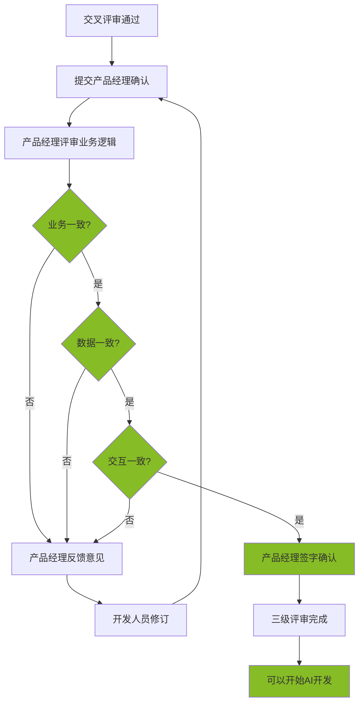

## 5.5 评审通过标准

### 5.5.1 三级评审全部通过

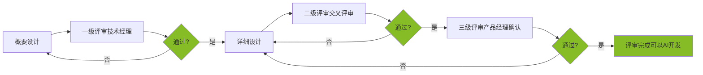

### 5.5.2 通过条件

| 评审级别 | 通过条件 | 后续 |
|---------|---------|------|
| **一级评审** | 技术经理评审通过 | 开始详细设计 |
| **二级评审** | 至少2名评审人通过 | 进入产品经理确认 |
| **三级评审** | 产品经理评审通过 | 开始AI开发 |

### 5.5.3 不通过处理

| 情况 | 处理方式 |
|------|---------|
| 一级评审不通过 | 修订概要设计，重新评审 |
| 二级评审不通过 | 修订详细设计，重新交叉评审 |
| 三级评审不通过 | 修订详细设计，重新产品经理确认 |

## 5.6 评审归档

### 5.6.1 评审记录归档

每次评审完成后，需要归档：

| 归档内容 | 存放位置 | 格式 |
|---------|---------|------|
| 评审通过 | 文档空间对应位置 | Markdown |

# 第六章：质量检查清单

## 6.1 检查清单总览

### 6.1.1 六阶段检查点

```mermaid
flowchart LR
    A[阶段一需求与原型] --> B[阶段二概要设计]
    B --> C[阶段三详细设计]
    C --> D[阶段四AI开发]
    D --> E[阶段五代码Review]
    E --> F[阶段六测试与交付]

    A -.-> A1[需求检查清单]
    B -.-> B1[概要设计检查清单]
    C -.-> C1[详细设计检查清单]
    D -.-> D1[代码检查清单]
    E -.-> E1[Review检查清单]
    F -.-> F1[发布检查清单]

    style A1 fill:#0076A8,color:#fff
    style B1 fill:#EDEDED
    style C1 fill:#EDEDED
    style D1 fill:#86BC25
    style E1 fill:#0076A8,color:#fff
    style F1 fill:#86BC25
```

### 6.1.2 检查清单分类

| 阶段 | 检查清单 | 负责人 | 检查时机 |
|------|---------|--------|---------|
| **阶段一** | 需求检查清单 | 产品经理 | 需求文档完成后 |
| **阶段二** | 概要设计检查清单 | 技术经理 | 概要设计完成后 |
| **阶段三** | 详细设计检查清单 | 后端开发/前端开发+评审人 | 详细设计完成后 |
| **阶段四** | 代码检查清单 | 后端开发/前端开发 | AI生成代码后 |
| **阶段五** | Review检查清单 | 技术经理 | 代码Review时 |
| **阶段六** | 发布检查清单 | 技术经理+测试人员 | 发布前 |

## 6.2 阶段一：需求检查清单

### 6.2.1 需求文档检查

```markdown
## 需求检查清单

**检查人**：产品经理
**检查时机**：需求文档编写完成后

### 需求完整性

- 需求文档结构完整
- 所有功能模块都有描述
- 业务流程图清晰
- 功能清单完整

### 功能描述

- 每个功能有明确的功能编号
- 功能描述清晰无歧义
- 功能优先级明确
- 功能边界清晰

### 数据字段

- 所有数据字段都有定义
- 字段类型明确
- 字段长度合理
- 枚举值完整

### 业务规则

- 校验规则明确
- 业务约束明确
- 状态流转清晰
- 异常场景有说明

### 非功能需求

- 性能要求明确
- 安全要求明确
- 可用性要求明确
- 扩展性要求明确
```

### 6.2.2 原型检查清单

```markdown
## 原型检查清单

**检查人**：产品经理
**检查时机**：原型设计完成后

### 原型完整性

- 所有需求页面都有原型
- 页面名称与需求一致
- 页面流程清晰

### 页面元素

- 所有字段都在原型中
- 按钮操作完整
- 列表字段完整
- 表单字段完整

### 交互说明

- 筛选条件有说明
- 分页规则有说明
- 弹窗交互有说明
- 操作反馈有说明

### 样式规范

- 符合UI设计规范
- 状态颜色正确
- 字体大小正确
- 间距符合规范
```

## 6.3 阶段二：概要设计检查清单

```markdown
## 概要设计检查清单

**检查人**：技术经理
**检查时机**：概要设计文档完成后，评审前

### 文档结构

- 文档头部信息完整
- 目录结构正确
- 变更记录有维护

### 背景与目标

- 背景描述清晰
- 目标明确具体
- 范围边界清晰

### 技术选型

- 技术栈明确
- 版本号明确
- 选型理由充分
- 符合团队技术栈

### 架构设计

- 架构图清晰
- 分层清晰合理
- 模块划分合理
- 模块职责单一

### 接口设计

- 接口清单完整
- 接口命名规范
- 请求参数完整
- 响应结构统一
- 有接口示例

### 数据模型

- 表结构完整
- 字段类型合理
- 字段长度合理
- 有必要索引
- ER图清晰

### 关键流程

- 核心流程有图示
- 流程逻辑清晰
- 异常场景有考虑
- 边界条件有考虑

### 非功能需求

- 有性能方案
- 有安全方案
- 有异常处理方案
- 有日志方案
- 有监控方案

### 风险评估

- 识别了关键风险
- 有风险应对方案
- 风险可控
```

## 6.4 阶段三：详细设计检查清单

### 6.4.1 开发人员自查清单

```markdown
## 详细设计自查清单

**检查人**：后端开发/前端开发
**检查时机**：详细设计文档完成后，提交评审前

### 文档结构

- 文档头部信息完整
- 对应概要设计正确
- 变更记录有维护

### 类设计

- 类图使用mermaid语法
- 类名使用大驼峰
- 方法名使用小驼峰
- 字段名使用小驼峰
- 可见性标识正确（+/-/#）
- 类关系语法正确（--> / ..> / --|>）

### 类完整性

- 所有类都有类图
- 核心类有详细说明
- 属性定义完整
- 方法定义完整
- 方法签名清晰（参数、返回值）

### 方法设计

- 核心方法有流程图
- 复杂逻辑有时序图
- 业务逻辑正确
- 异常场景有考虑
- 边界条件有考虑

### 数据一致性

- 与概要设计一致
- 与需求文档一致
- 数据字段完整
- 数据类型正确

### 文档质量

- 描述清晰无歧义
- 术语使用一致
- 格式规范统一
- 无错别字
```

### 6.4.2 交叉评审检查清单

```markdown
## 详细设计交叉评审清单

**检查人**：评审人（其他后端开发/前端开发）
**检查时机**：收到评审文档后

### mermaid规范

- 类图语法正确
- 时序图语法正确
- 流程图语法正确
- 命名符合规范
- 可见性正确

### 设计完整性

- 类设计完整
- 方法签名完整
- 核心流程有图示
- 异常场景有考虑

### 设计正确性

- 业务逻辑正确
- 数据流转正确
- 边界条件有考虑
- 与概要设计一致

### 可实现性

- 设计可以实现
- 复杂度合理
- 无技术死锁
- 无循环依赖
```

### 6.4.3 产品经理确认检查清单

```markdown
## 详细设计产品经理确认清单

**检查人**：产品经理
**检查时机**：交叉评审通过后

### 功能一致性

- 所有需求功能都有设计
- 功能行为与需求一致
- 功能边界与需求一致
- 功能优先级正确

### 数据一致性

- 所有需求字段都在设计中
- 字段类型与需求一致
- 字段长度与需求一致
- 枚举值与需求一致
- 必填项与需求一致

### 交互一致性

- 筛选条件与原型一致
- 分页规则与需求一致
- 弹窗交互与原型一致
- 操作按钮与原型一致
- 状态反馈与需求一致

### 业务规则

- 校验规则与需求一致
- 业务约束正确
- 状态流转正确
- 异常场景有处理
```

## 6.5 阶段四：代码检查清单

```markdown
## 代码检查清单

**检查人**：后端开发/前端开发
**检查时机**：AI生成代码后，提交Review前

### 代码结构

- 包结构符合规范
- 类名与设计一致
- 方法名与设计一致
- 文件命名规范

### 代码完整性

- 所有类都已实现
- 所有方法都已实现
- 无TODO未完成
- 无FIXME未处理

### 代码规范

- 符合编码规范
- 有必要的注释
- 无魔法值
- 异常处理完善

### 文档一致性

- 类与类图一致
- 方法签名与设计一致
- 业务逻辑与设计一致
- 数据字段与设计一致

### 自测通过

- 代码可编译
- 单元测试通过
- 核心功能可运行
- 无明显bug
```

## 6.6 阶段五：Review检查清单

```markdown
## 代码Review检查清单

**检查人**：技术经理
**检查时机**：代码Review时

### 文档一致性（核心）

- 类结构与mermaid类图一致
- 类名与设计一致
- 属性与设计一致
- 方法签名与设计一致
- 方法数量与设计一致
- 业务逻辑与设计一致
- 数据字段与设计一致

### 代码质量

- 代码结构清晰
- 命名规范统一
- 注释恰当充分
- 无重复代码
- 无过长方法

### 异常处理

- 异常处理完善
- 错误信息清晰
- 无吞掉异常
- 资源正确释放

### 安全性

- 无SQL注入风险
- 无XSS风险
- 敏感数据加密
- 权限校验完善

### 性能考虑

- 无N+1查询
- 有必要缓存
- 大数据量分页
- 无内存泄漏

### 测试覆盖

- 有单元测试
- 核心逻辑有覆盖
- 边界条件有测试
```

## 6.7 阶段六：发布检查清单

### 6.7.1 发布前检查

```markdown
## 发布前检查清单

**检查人**：技术经理 + 测试人员
**检查时机**：合并到main前

### 功能完整性

- 所有需求功能已实现
- 所有页面可访问
- 所有接口可调用
- 无明显功能缺陷

### 测试通过

- 单元测试通过
- 集成测试通过
- 功能测试通过
- 无阻塞性bug
- 无严重bug

### 文档完整性

- 需求文档已归档
- 设计文档已归档
- 接口文档已更新
- 变更记录已维护

### 版本管理

- 版本号正确
- Tag已创建
- 分支已合并
- 临时分支已删除

### 配置检查

- 配置文件正确
- 环境变量正确
- 数据库连接正确
- 第三方配置正确

### 部署准备

- 部署脚本准备
- 回滚方案准备
- 监控告警配置
- 日志级别正确
```

### 6.7.2 发布后验证

```markdown
## 发布后验证清单

**检查人**：技术经理 + 测试人员
**检查时机**：发布后立即验证

### 功能验证

- 核心功能可正常使用
- 页面加载正常
- 接口响应正常
- 数据保存正常

### 性能验证

- 响应时间正常
- 无明显慢查询
- 无内存异常
- 无CPU异常

### 日志验证

- 日志正常输出
- 无大量错误日志
- 关键操作有日志
- 日志格式正确

### 监控验证

- 服务状态正常
- 告警规则生效
- 监控数据正常
- 无异常告警
```

## 6.8 检查清单使用指南

### 6.8.1 使用原则

| 原则 | 说明 |
|------|------|
| **逐项检查** | 按清单逐项检查，不遗漏 |
| **谁负责谁检查** | 负责人使用对应清单自检 |
| **评审人复检** | 评审人使用清单复检 |
| **不通过不进入下一阶段** | 检查不通过不能进入下一阶段 |

### 6.8.2 检查清单存放

```
项目文档结构：
doc/
├── checklist/
│   ├── 需求检查清单.md
│   ├── 概要设计检查清单.md
│   ├── 详细设计自查清单.md
│   ├── 详细设计交叉评审清单.md
│   ├── 详细设计产品经理确认清单.md
│   ├── 代码检查清单.md
│   ├── Review检查清单.md
│   └── 发布检查清单.md
```

### 6.8.3 检查结果记录

```markdown
## 检查记录模板

**检查清单**：详细设计自查清单
**文档名称**：用户模块详细设计.md
**文档版本**：v1.0.0
**检查人**：张三
**检查日期**：2026-03-15

### 检查结果

- [x] 文档结构完整
- [x] 类图使用mermaid语法
- [x] 类名使用大驼峰
- 方法签名完整 → 缺少logout方法签名
- [x] 核心方法有流程图

### 检查结论

有条件通过，补充logout方法签名后可提交评审。
```

# 附录

## 附录0：AI编码通用提示词

### 0.1 后端开发提示词

在使用AI进行后端代码开发时，请使用以下通用提示词模板：

```
请参考旧框架代码路径 `src/main/java/com/xxx/` 下的现有代码结构和编码规范，基于以下设计文档生成代码：

【设计文档】
- 概要设计：[概要设计文档路径或内容]
- 详细设计：[详细设计文档路径或内容]

【参考代码路径】
- 参考模块：src/main/java/com/xxx/module/[类似模块名]/

【生成要求】
1. 严格遵循设计文档中的类结构和方法签名
2. 保持与现有代码风格一致
3. 遵循项目的编码规范
4. 生成完整的代码，包括Controller、Service、Mapper、Entity、DTO、VO等
```

### 0.2 前端开发提示词

在使用AI进行前端代码开发时，请使用以下通用提示词模板：

```
请参考旧框架代码路径 `src/components/` 下的现有组件结构和编码规范，基于以下设计文档和静态页面生成代码：

【设计文档】
- 前端详细设计：[前端详细设计文档路径或内容]
- 后端接口定义：[后端详细设计文档路径或内容]

【静态页面】
- 静态页面路径：frontend-static/[页面路径]/

【参考代码路径】
- 参考组件：src/components/[类似组件名]/
- 参考页面：src/pages/[类似页面名]/

【生成要求】
1. 严格遵循前端详细设计中的组件结构和接口调用设计
2. 保持与现有代码风格一致
3. 遵循项目的编码规范
4. 正确调用后端接口，处理响应数据和错误
```

### 0.3 提示词使用说明

1. **参考旧框架代码**：AI生成代码前，务必指定参考的旧代码路径，确保生成的代码风格与项目一致
2. **代码路径**：明确指定生成代码的目标路径，避免AI生成到错误位置
3. **设计文档**：提供完整的设计文档路径或内容，确保AI理解需求
4. **增量生成**：对于复杂模块，建议分步骤生成（先生成Entity，再生成Mapper，然后Service，最后Controller）

---

## 附录A：AI工具清单

### A.1 AI编程平台

| 工具　　　　　　| 类型　　| 可用模型　　　　| 适用场景　　　　　　　　　　　　　 | 使用角色　　　　　　　　　| 使用章节 |
| -----------------| ---------| -----------------| ------------------------------------| ---------------------------| ----------|
| **Claude Code** | CLI工具 | GLM5/GLM4.7　 | 文档编写、代码生成　| 技术经理、后端开发、前端开发、测试人员 | 全流程　 |

### A.2 设计与原型工具

| 工具　　　　　 | 类型　　　 | 用途　　　　　　　　　　 | 使用角色 | 使用章节 |
| ----------------| ------------| --------------------------| ----------| ----------|
| **Figma Make** | AI设计工具 | UI原型设计、静态页面生成 | 产品经理　　　 | 第三章(3.2)　 |

### A.3 测试工具

| 工具　　　　 | 类型　 | 用途　　　　　　　　　 | 使用角色 | 使用章节 |
| --------------| --------| ------------------------| ----------| ----------|
| **QA Agent** | 测试AI | 测试用例生成、缺陷分析 | 测试人员　　　 | 第三章(3.7) |

### A.4 Skills/Powers清单

#### A.4.1 代码审查类

| Skill名称　　　　　　　| 用途　　 | 使用场景　　　　　　　　　　　　　| 使用章节 |
| ------------------------| ----------| -----------------------------------| ----------|
| **code-review-expert** | 代码审查 | 检测SOLID违规、安全风险、代码异味 | 第三章(3.6) |

#### A.4.2 文档转换类

| Skill名称　　　　| 用途　　 | 使用场景　　　　　　　　　　　　　| 使用章节 |
| ------------------| ----------| -----------------------------------| ----------|
| **doc-export**　 | 文档导出 | 将Markdown需求文档转为Word格式　　| 第三章(3.2)　 |
| **excel-export** | 表格导出 | 生成交付清单、功能清单等Excel文档 | 第三章(3.2)　 |

#### A.4.3 前端开发类

| Skill名称　　　　　 | 用途　　 | 使用场景　　　　　　　　　　　| 使用章节　　　　 |
| ---------------------| ----------| -------------------------------| ------------------|
| **frontend-design** | 前端开发 | 将静态页面转换为React/Vue组件 | 第三章(3.4) |
| **html-to-react**　 | 页面转换 | 将HTML静态页面转换为React组件 | 第三章(3.4)　　　　　 |
| **html-to-vue**　　 | 页面转换 | 将HTML静态页面转换为Vue组件　 | 第三章(3.4)　　　　　 |

#### A.4.4 部署运维类

| Skill名称　　　　 | 用途　　　 | 使用场景　　　　　　　　　　　　　 | 使用章节 |
| -------------------| ------------| ------------------------------------| ----------|
| **docker-expert** | Docker配置 | 生成Dockerfile、docker-compose配置 | 第三章(3.7) |

### A.5 辅助工具

| 工具　　　　　　　 | 类型　　　 | 用途　　　　　　　　　　　　　　　　| 使用章节 |
| --------------------| ------------| -------------------------------------| ----------|
| **Markdown Lint**　| 检查工具　 | Markdown格式检查　　　　　　　　　　| 第三章　 |
| **Link Checker**　 | 检查工具　 | 文档链接有效性检查　　　　　　　　　| 第三章　 |

### A.6 工具-角色对应关系

| 角色 | 主要工具 | 辅助工具 |
|------|---------|---------|
| **产品经理** | Figma Make | doc-export、excel-export |
| **架构师** | Claude Code + GLM5 | architecture-patterns |
| **技术经理** | Claude Code + GLM5 | code-review-expert |
| **后端开发** | Claude Code + GLM5 | mermaid-expert、java-expert |
| **前端开发** | Claude Code + GLM5 | frontend-design、html-to-react/vue |
| **测试人员** | QA Agent、Claude Code + GLM5 | - |

---

## 附录B：模板清单

本附录提供核心模板，用于指导实际项目开发。

---

### B.0 需求模板

本模板用于产品经理编写需求文档，包含功能清单和User Story两种形式。

#### B.0.1 功能清单示例

功能清单用于快速梳理系统功能点，适合项目初期需求整理。

```markdown
# XXX项目功能清单

## 文档信息

| 项目 | 内容 |
|------|------|
| 文档名称 | XXX项目功能清单 |
| 版本 | v1.0.0 |
| 创建日期 | YYYY-MM-DD |
| 产品经理 | [产品经理姓名] |
| 评审人 | [技术经理姓名] |

---

## 一、功能模块清单

### 1.1 用户管理模块

| 功能编号 | 功能名称 | 功能描述 | 优先级 | 状态 |
|---------|---------|---------|--------|------|
| F-USER-001 | 用户注册 | 支持邮箱/手机号注册，发送验证码 | P0 | 待开发 |
| F-USER-002 | 用户登录 | 支持账号密码登录、第三方登录 | P0 | 待开发 |
| F-USER-003 | 密码找回 | 通过邮箱/手机号找回密码 | P1 | 待开发 |
| F-USER-004 | 个人信息管理 | 查看和编辑个人信息 | P1 | 待开发 |
| F-USER-005 | 头像上传 | 支持上传和裁剪头像 | P2 | 待开发 |

### 1.2 角色权限模块

| 功能编号 | 功能名称 | 功能描述 | 优先级 | 状态 |
|---------|---------|---------|--------|------|
| F-ROLE-001 | 角色管理 | 创建、编辑、删除角色 | P0 | 待开发 |
| F-ROLE-002 | 权限分配 | 为角色分配菜单和操作权限 | P0 | 待开发 |
| F-ROLE-003 | 用户角色绑定 | 为用户分配一个或多个角色 | P0 | 待开发 |
| F-ROLE-004 | 权限继承 | 支持角色权限继承机制 | P2 | 待规划 |

### 1.3 系统管理模块

| 功能编号 | 功能名称 | 功能描述 | 优先级 | 状态 |
|---------|---------|---------|--------|------|
| F-SYS-001 | 菜单管理 | 配置系统菜单结构 | P0 | 待开发 |
| F-SYS-002 | 字典管理 | 管理系统数据字典 | P1 | 待开发 |
| F-SYS-003 | 参数配置 | 系统参数配置管理 | P1 | 待开发 |
| F-SYS-004 | 操作日志 | 记录用户关键操作 | P1 | 待开发 |
| F-SYS-005 | 登录日志 | 记录用户登录历史 | P2 | 待开发 |

---

## 二、优先级说明

| 优先级 | 说明 | 开发时间 |
|--------|------|----------|
| P0 | 核心功能，必须实现 | 第一期 |
| P1 | 重要功能，应该实现 | 第一期或第二期 |
| P2 | 次要功能，可以延后 | 第二期或第三期 |
| P3 | 可选功能，视情况而定 | 待规划 |

---

## 三、功能状态说明

| 状态 | 说明 |
|------|------|
| 待规划 | 功能已识别，待详细规划 |
| 待开发 | 需求已明确，待开发实现 |
| 开发中 | 正在开发实现 |
| 待测试 | 开发完成，待测试验证 |
| 已完成 | 测试通过，已上线 |

---

## 四、功能依赖关系

```mermaid
graph LR
    A[用户注册] --> B[用户登录]
    B --> C[个人信息管理]
    D[角色管理] --> E[权限分配]
    E --> F[用户角色绑定]
    B --> F
    
    style A fill:#86BC25
    style B fill:#86BC25
    style D fill:#0076A8
    style E fill:#0076A8


## 五、变更记录

| 版本 | 日期 | 变更内容 | 变更人 |
|------|------|----------|--------|
| v1.0.0 | YYYY-MM-DD | 初始版本 | [姓名] |
```


#### B.0.2 User Story示例

User Story用于详细描述用户需求，适合敏捷开发和AI开发。

```markdown
# XXX项目User Story

## 文档信息

| 项目 | 内容 |
|------|------|
| 文档名称 | XXX项目User Story |
| 版本 | v1.0.0 |
| 创建日期 | YYYY-MM-DD |
| 产品经理 | [产品经理姓名] |
| 评审人 | [技术经理姓名] |

---

## 一、用户管理模块

### US-001：用户注册

**作为** 新用户  
**我想要** 通过邮箱注册账号  
**以便于** 使用系统的各项功能

**验收标准**：
- [ ] 支持邮箱注册，邮箱格式校验正确
- [ ] 密码强度要求：至少8位，包含大小写字母和数字
- [ ] 发送验证码到邮箱，验证码6位数字
- [ ] 验证码5分钟内有效
- [ ] 重复邮箱提示"该邮箱已被注册"
- [ ] 注册成功后自动登录

**业务规则**：
- 邮箱作为唯一标识，不可重复
- 验证码6位数字，5分钟内有效，每个邮箱每天最多发送10次
- 密码需使用BCrypt加密存储
- 新注册用户默认角色为"普通用户"

**前置条件**：
- 用户未注册过账号
- 邮件服务正常运行

**后置条件**：
- 用户账号创建成功
- 用户自动登录系统
- 发送欢迎邮件

**UI原型**：
[链接到Figma原型]

**优先级**：P0

**估算工作量**：3人天

---

### US-002：用户登录

**作为** 已注册用户  
**我想要** 使用邮箱和密码登录系统  
**以便于** 访问我的个人信息和使用系统功能

**验收标准**：
- [ ] 支持邮箱 + 密码登录
- [ ] 登录失败提示"邮箱或密码错误"
- [ ] 连续5次登录失败，账号锁定30分钟
- [ ] 登录成功返回JWT Token
- [ ] Token有效期24小时
- [ ] 支持"记住我"功能，Token有效期延长至7天

**业务规则**：
- Token存储在localStorage
- 登录失败次数记录在Redis，30分钟过期
- 账号锁定期间显示剩余锁定时间
- 登录成功记录登录日志（IP、时间、设备）

**前置条件**：
- 用户已注册账号
- 账号未被锁定或禁用

**后置条件**：
- 用户登录成功，获得访问权限
- 记录登录日志

**UI原型**：
[链接到Figma原型]

**优先级**：P0

**估算工作量**：2人天

---

### US-003：密码找回

**作为** 忘记密码的用户  
**我想要** 通过邮箱找回密码  
**以便于** 重新登录系统

**验收标准**：
- [ ] 输入注册邮箱，发送重置密码链接
- [ ] 重置链接有效期30分钟
- [ ] 点击链接跳转到重置密码页面
- [ ] 输入新密码，确认密码
- [ ] 密码重置成功后，旧Token失效
- [ ] 提示用户使用新密码登录

**业务规则**：
- 重置链接包含随机Token，30分钟内有效
- 每个邮箱每天最多发送5次重置邮件
- 密码重置后，所有已登录设备强制退出
- 重置成功发送通知邮件

**前置条件**：
- 用户已注册账号
- 邮箱有效

**后置条件**：
- 密码重置成功
- 旧Token全部失效
- 发送密码重置成功通知

**UI原型**：
[链接到Figma原型]

**优先级**：P1

**估算工作量**：2人天

---

## 二、角色权限模块

### US-004：角色管理

**作为** 系统管理员  
**我想要** 创建和管理角色  
**以便于** 为不同用户分配不同的权限

**验收标准**：
- [ ] 支持创建角色，输入角色名称和描述
- [ ] 支持编辑角色信息
- [ ] 支持删除角色（需确认，且不能删除有用户的角色）
- [ ] 支持启用/禁用角色
- [ ] 角色列表支持分页、搜索、排序

**业务规则**：
- 角色名称唯一，不可重复
- 系统预置角色（超级管理员、管理员、普通用户）不可删除
- 删除角色前需检查是否有用户绑定
- 禁用角色后，该角色用户权限立即失效

**前置条件**：
- 当前用户有角色管理权限

**后置条件**：
- 角色创建/更新成功
- 记录操作日志

**UI原型**：
[链接到Figma原型]

**优先级**：P0

**估算工作量**：3人天

---

### US-005：权限分配

**作为** 系统管理员  
**我想要** 为角色分配菜单和操作权限  
**以便于** 控制不同角色的访问范围

**验收标准**：
- [ ] 以树形结构展示所有菜单和权限
- [ ] 支持勾选/取消勾选权限
- [ ] 支持全选/全不选
- [ ] 支持父子级联选择
- [ ] 保存后立即生效

**业务规则**：
- 菜单权限控制页面访问
- 操作权限控制按钮显示和接口调用
- 权限变更后，已登录用户需重新获取权限
- 超级管理员拥有所有权限，不可修改

**前置条件**：
- 角色已创建
- 当前用户有权限分配权限

**后置条件**：
- 权限分配成功
- 该角色用户权限立即更新
- 记录操作日志

**UI原型**：
[链接到Figma原型]

**优先级**：P0

**估算工作量**：4人天

---

## 三、User Story编写规范

### 3.1 标准格式


作为 [角色]
我想要 [功能]
以便于 [价值/目的]


### 3.2 验收标准要求

- 使用可验证的检查清单
- 每项标准清晰明确
- 包含正常场景和异常场景
- 包含边界条件

### 3.3 业务规则要求

- 明确业务约束
- 说明数据校验规则
- 说明异常处理逻辑
- 说明与其他功能的关联

### 3.4 优先级定义

| 优先级 | 说明 |
|--------|------|
| P0 | 核心功能，必须实现 |
| P1 | 重要功能，应该实现 |
| P2 | 次要功能，可以延后 |
| P3 | 可选功能，视情况而定 |

---

## 四、变更记录

| 版本 | 日期 | 变更内容 | 变更人 |
|------|------|----------|--------|
| v1.0.0 | YYYY-MM-DD | 初始版本 | [姓名] |
```

---

### B.1 概要设计模板

```markdown
# XXX项目概要设计

## 文档信息

| 项目 | 内容 |
|------|------|
| 文档名称 | XXX项目概要设计 |
| 版本 | v1.0.0 |
| 创建日期 | YYYY-MM-DD |
| 最后更新 | YYYY-MM-DD |
| 负责人 | [负责人姓名] |

---

# 一、项目概述

## 1.1 项目背景
[简述项目发起的业务背景、市场机会或技术演进需求，说明必要性。]

## 1.2 项目目标
[列出项目希望达成的核心目标，最好能量化。]
- 目标1：[具体可衡量的目标]
- 目标2：[具体可衡量的目标]

## 1.3 项目范围
### 1.3.1 功能范围（In Scope）
- [明确包含的核心功能点1]
- [明确包含的核心功能点2]

### 1.3.2 不在范围内（Out of Scope）
- [明确排除的功能或非功能性要求，并简述原因]

## 1.4 术语表
| 术语 | 英文 | 定义 |
|------|------|------|
| [项目内关键术语] | [英文全称] | [简要定义说明] |

## 1.5 参考文档
| 文档名称 | 路径/链接 | 说明 |
|----------|----------|------|
| [需求文档、立项报告等] | [路径] | [关联性说明] |

---

# 二、技术选型

## 2.1 后端技术栈
| 技术 | 版本 | 用途 | 选型理由 |
|------|------|------|---------|
| [如：Java] | [版本号] | [主要用途] | [核心选型依据] |

## 2.2 前端技术栈
| 技术 | 版本 | 用途 | 选型理由 |
|------|------|------|---------|
| [如：React] | [版本号] | [主要用途] | [核心选型依据] |

## 2.3 中间件/基础设施
| 组件 | 版本 | 用途 |
|------|------|------|
| [如：Nginx] | [版本号] | [如：反向代理/负载均衡] |

---

# 三、模块概要设计

## 3.1 整体模块架构
[使用流程图或文字描述项目各模块间的层次与依赖关系。]

## 3.2 模块设计规范
### 3.2.1 模块划分原则
[简述划分模块的核心原则，如：单一职责、高内聚低耦合等。]

### 3.2.2 模块包结构规范
[提供标准的、项目统一的模块内部代码包结构模板。]

## 3.3 核心模块概要（按5W1H方法论描述）

### 3.3.X [模块名称] 模块
#### 设计目标 (What & Why)
- **是什么(What)**：[本模块的核心职责与边界。]
- **为什么(Why)**：[本模块存在的价值，解决了什么问题或满足了什么需求。]

#### 定位与上下文 (Where & When)
- **在哪里(Where)**：[本模块在整体架构中的位置，与上下游模块的协作关系。]
- **在何时(When)**：[本模块功能被触发或使用的主要场景和时机。]

#### 主要用户与交互方 (Who)
- **面向谁(Who)**：[本模块服务的主要用户角色（外部用户或内部系统）。]

#### 实现思路与核心流程(How)
- **怎么做(How)**：[简述实现本模块功能的主要技术思路、关键流程或算法。]

#### 预期效果与验收标准
- **达到什么效果(How Much)**：[模块完成后的预期效果，可量化的性能、可用性等非功能性指标。]

---

# 四、部署架构

## 4.1 部署架构图
[使用图或文字描述生产环境的物理/逻辑部署结构。]

## 4.2 环境规划
| 环境 | 用途 | 域名/地址 | 配置说明 |
|------|------|----------|----------|
| [如：dev] | [开发联调] | [地址] | [资源配置、数据源等说明] |

## 4.3 服务器规划
| 服务器角色 | 配置 | 数量 | 部署服务 |
|-----------|------|------|---------|
| [如：应用服务器] | [CPU/内存/磁盘] | [数量] | [部署的应用] |

## 4.4 端口规划
| 服务 | 端口 | 协议 | 说明 |
|------|------|------|------|
| [服务名] | [端口号] | [协议] | [简要说明] |

---

# 五、数据库设计

## 5.1 数据库规划
| 数据库 | 用途 | 字符集 | 备注 |
|--------|------|--------|------|
| [数据库名] | [业务用途] | [字符集] | [如：主库、日志库] |

## 5.2 设计规范
### 5.2.1 命名规范
[规定表、字段、索引等的命名规则。]

### 5.2.2 必备字段
[规定所有表必须包含的公共字段，如审计字段。]

### 5.2.3 类型映射
[规定Java类型与数据库类型的映射标准。]

## 5.3 表清单总览
| 序号 | 表名 | 中文名 | 所属模块 | 核心字段简述 |
|------|------|--------|---------|--------------|
| 1 | [表名] | [中文说明] | [模块名] | [id, name, ...] |

## 5.4 ER关系图
[使用ER图描述核心表间关系。]

---

# 六、接口规范

## 6.1 统一响应格式
### 6.1.1 响应码定义
[定义全局统一的业务响应码分类及范围。]

### 6.1.2 成功响应格式
[定义成功时的JSON响应体结构。]

### 6.1.3 失败响应格式
[定义失败时的JSON响应体结构，包括错误信息承载方式。]

## 6.2 统一错误码
[列举或定义项目级、模块级的通用错误码表。]

## 6.3 API设计规范
### 6.3.1 命名规范
[规定RESTful API的URL、方法命名规范。]

### 6.3.2 版本管理
[规定API版本策略和管理方式。]

### 6.3.3 请求/响应规范
[规定分页、排序、时间格式等通用请求/响应数据结构。]

## 6.4 接口安全规范
[规定认证、鉴权、参数校验、防重放、数据脱敏等方面的通用要求。]

## 6.5 接口性能规范
[规定关键接口的响应时间、缓存策略、限流策略等非功能性要求。]

---

# 七、项目整体安全规范

## 7.1 安全设计原则
[规定项目整体的安全设计原则，如：最小权限原则、纵深防御、安全默认等。]

## 7.2 认证与授权
### 7.2.1 认证机制
[规定用户身份认证的方式，如：Token认证、Session认证、OAuth2等。]

### 7.2.2 授权机制
[规定权限控制的方式，如：RBAC、ABAC等。]

### 7.2.3 会话管理
[规定会话超时、并发登录控制、会话固定攻击防护等策略。]

## 7.3 数据安全
### 7.3.1 敏感数据分类
| 数据类型 | 安全等级 | 存储要求 | 传输要求 | 展示要求 |
|----------|----------|----------|----------|----------|
| 用户密码 | 高 | 加密存储 | HTTPS传输 | 禁止展示 |
| 手机号 | 中 | 明文存储 | HTTPS传输 | 脱敏展示 |

### 7.3.2 数据加密规范
[规定数据加密的算法、密钥管理方式等。]

### 7.3.3 数据脱敏规范
[规定敏感数据在日志、接口响应中的脱敏规则。]

## 7.4 通信安全
### 7.4.1 传输加密
[规定HTTPS配置、证书管理等要求。]

### 7.4.2 接口签名
[规定接口签名算法、防篡改机制。]

## 7.5 输入安全
### 7.5.1 参数校验规范
[规定所有输入参数的校验要求。]

### 7.5.2 SQL注入防护
[规定SQL注入防护措施。]

### 7.5.3 XSS防护
[规定XSS攻击防护措施。]

### 7.5.4 CSRF防护
[规定CSRF攻击防护措施。]

## 7.6 日志与审计
### 7.6.1 安全日志规范
[规定安全相关日志的记录内容、格式、存储要求。]

### 7.6.2 操作审计规范
[规定关键操作的审计记录要求。]

## 7.7 安全检查清单
- [ ] 所有接口是否启用认证？
- [ ] 敏感操作是否有权限控制？
- [ ] 密码是否加密存储？
- [ ] 敏感数据是否脱敏展示？
- [ ] 是否启用HTTPS？
- [ ] 是否有SQL注入防护？
- [ ] 是否有XSS防护？
- [ ] 是否有CSRF防护？
- [ ] 安全日志是否完整？

---

# 八、附录

## 8.1 代码审查清单
[提供概要设计阶段后，代码开发需要关注的通用审查要点。]

## 8.2 部署检查清单
[提供服务部署前后的通用检查项。]
```

---

### B.2 后端详细设计模板

```markdown
# 程序详细设计文档

> **定位**
> - 数据库驱动设计
> - 分层思想
> - 前后端无代码协同
> - AI 分阶段稳定交付

------

## 文档信息

模块名称：
模块标识：
所属系统：
文档版本：
设计负责人：
最后更新时间：

适用对象：
- 后端开发
- 前端开发
- 测试人员
- AI 编程

------

# 一、数据库设计

> ⚠️ 数据库是系统"真实状态"的最终承载
> 所有代码都必须服务于本章设计

------

## 1.1 表清单与业务职责

| 表名  | 业务含义 | 主键  | 是否核心表 | 说明  |
| --- | ---- | --- | ----- | --- |
|     |      |     |       |     |

------

## 1.2 表关系设计（ER 图）

[使用ER图描述核心表间关系]

**流程说明**：

1. [表关系说明]

**关键点**：

- [关系约束说明]

------

## 1.3 表结构设计（字段级，逐字段）

### 公共字段说明

> **所有用户可操作表必须包含以下5个公共字段**

| 字段          | 类型         | 必填   | 描述                   | 业务含义 | 设计说明                                                   |
| ----------- | ---------- | ---- | -------------------- | ---- | ------------------------------------------------------ |
| create_by   | BIGINT     | 否   | 创建人ID                | 审计字段 | 记录创建该记录的用户ID，系统操作可为空                                   |
| create_time | DATETIME   | 是   | 创建时间                 | 审计字段 | 自动填充，默认值：CURRENT_TIMESTAMP                             |
| update_by   | BIGINT     | 否   | 更新人ID                | 审计字段 | 记录最后修改该记录的用户ID，系统操作可为空                                 |
| update_time | DATETIME   | 是   | 更新时间                 | 审计字段 | 自动更新，默认值：CURRENT_TIMESTAMP ON UPDATE CURRENT_TIMESTAMP |
| del_flag    | TINYINT(1) | 删除标识 | 逻辑删除：0=未删除，1=已删除，默认0 |      |                                                        |

### 表：xxx

| 字段  | 类型  | 必填  | 描述  | 业务含义 | 设计说明 |
| --- | --- | --- | --- | ---- | ---- |
|     |     |     |     |      |      |

> ⚠️ 要求
> 
> - 每个字段必须能回答「为什么存在」
> - 禁止"以后可能用到"
> - 所有用户可操作表必须包含公共字段

------

## 1.4 反范式设计

> **反范式不是优化，是设计决策**

### 反范式字段清单

| 表  | 字段  | 冗余来源 | 冗余原因 | 一致性策略 | 风险  |
| --- | --- | ---- | ---- | ----- | --- |
|     |     |      |      |       |     |

------

## 1.5 索引与约束设计

唯一索引：
普通索引：
业务唯一约束：

------

# 二、模块目标与边界

模块解决的业务问题：
模块不解决的问题：
是否核心链路：


------

## 2.1 模块边界图

[使用流程图展示模块边界]

**关键点**：

- 模块边界图用于明确模块的依赖关系和边界约束
- 实线箭头表示允许的依赖关系，虚线箭头表示禁止的依赖关系

------

# 三、整体架构设计

> ⚠️ 明确声明：**本项目不采用 DDD**

------

## 3.1 分层结构定义

controller        接口层（REST）
service           业务接口定义
service.impl      业务实现
mapper            数据访问
entity            表映射实体
dto               请求对象（Data Transfer Object）
vo                响应对象（View Object）
common / util     公共与横切能力


### 包结构与命名规范

com.xxx.module.{模块名}
├── controller          # 控制器层
├── service             # 服务接口层
│   └── impl           # 服务实现层
├── mapper              # 数据访问层
├── entity              # 实体类（对应数据库表）
├── dto                 # 请求对象层
│   ├── XxxCreateDTO   # 创建请求
│   ├── XxxUpdateDTO   # 更新请求
│   ├── XxxQueryDTO    # 查询请求
│   └── XxxPageDTO     # 分页查询请求
├── vo                  # 响应对象层
│   ├── XxxVO          # 基础响应
│   ├── XxxDetailVO    # 详情响应
│   └── XxxListVO      # 列表响应
└── enums               # 枚举层


### 命名规范

**重要原则：去掉表前缀，使用业务名称**

| 数据库表名    | Entity类名 | Service接口名  | Controller类名   |
| -------- | -------- | ----------- | -------------- |
| sys_user | User     | UserService | UserController |
| sys_role | Role     | RoleService | RoleController |

**禁止事项**：

- ❌ 禁止在类名中保留表前缀
- ❌ 禁止使用缩写
- ❌ 禁止使用下划线

------

## 3.2 枚举设计规范（强制）

**核心原则**：

1. ✅ **枚举值必须使用英文大写字母，见名知意**
2. ❌ **禁止使用数字作为枚举值**
3. ✅ **每个枚举必须包含 code 和 description**

### 数据库字段类型要求

- **字段类型：** `VARCHAR` 或 `CHAR`
- **存储内容：** 枚举的 `code` 值（英文字符串）

------

## 3.3 层级职责与禁止事项

| 层         | 允许做        | 禁止做              |
| ---------- | ----------- | ---------------- |
| Controller | 参数校验、请求响应处理 | 写业务逻辑、直接操作数据库    |
| Service    | 业务编排、流程控制   | 直接写 SQL、处理HTTP请求 |
| Mapper     | 数据访问、SQL执行  | 业务判断、参数校验        |
| Entity     | 数据映射、属性定义   | 行为逻辑、业务校验        |
| DTO        | 请求参数定义、校验注解 | 业务逻辑、数据库操作       |
| VO         | 响应数据定义、文档注解 | 业务逻辑、敏感信息        |

------

# 四、业务模型与数据映射

> 本章是 **"业务对象 → 表结构" 的映射说明**

------

# 五、行为流程与用例设计

## 5.1 主流程（时序图）

[使用时序图展示主流程]

## 5.2 关键业务规则说明

- 前置条件
- 核心校验
- 失败路径


------

# 六、状态机设计（如有）

[使用状态机图展示状态转换]

------

# 七、接口设计（前后端核心契约）

> **目标：无代码即可协同开发**

------

## 7.1 接口基本信息

接口名称：
接口编码：
URL：
Method：
是否认证：
是否授权：


------

## 7.2 入参设计

### 请求对象定义

**类名：** `XxxDTO`
**包路径：** `com.xxx.module.{模块名}.dto`

| 参数  | 类型  | 必填  | 描述  | 校验规则 |
| --- | --- | --- | --- | ---- |
|     |     |     |     |      |

**请求示例：**

json
{}


------

## 7.3 出参设计

### 响应对象定义

**类名：** `XxxVO`
**包路径：** `com.xxx.module.{模块名}.vo`

| 字段  | 类型  | 描述  |
| --- | --- | --- |
|     |     |     |

**响应示例：**

json
{
  "code": "200",
  "message": "操作成功",
  "data": {}
}


------

## 7.4 接口治理要求（强制）

是否启用全局防抖：是（必须检查）
是否需要接口级防抖：
是否幂等：
幂等依据：
日志级别：


------

# 八、模块安全规范

> **本章定义模块级别的安全要求**

------

## 8.1 认证与授权要求

本模块是否需要认证：是 / 否
认证方式：Token / Session / 其他
本模块是否需要授权：是 / 否
授权粒度：接口级 / 数据级


### 接口权限配置

| 接口  | 权限标识 | 权限说明 | 是否公开 |
| --- | ---- | ---- | ---- |
|     |      |      |      |

------

## 8.2 敏感数据处理

### 敏感字段清单

| 字段名 | 所属表/对象 | 敏感等级 | 存储处理 | 传输处理 | 展示处理 |
| --- | ------ | ---- | ---- | ---- | ---- |
|     |        |      |      |      |      |

### 数据脱敏规则

手机号脱敏规则：138****1234
身份证脱敏规则：110***********1234
邮箱脱敏规则：a***@example.com


------

## 8.3 安全检查清单

- [ ] 所有接口是否配置了正确的权限？
- [ ] 敏感数据是否按规范处理？
- [ ] 输入参数是否有完整的校验？
- [ ] 是否有SQL注入风险？
- [ ] 是否有XSS风险？
- [ ] 操作日志是否完整？

------

# 九、算法设计（可选但必须声明）

### 9.1 是否涉及算法

是否涉及算法：是 / 否


> 若"否"，此章不得省略，必须写"无算法设计"

------

### 9.2 算法流程（如有）

[使用流程图展示算法流程]

### 算法约束

- 必须确定性
- 不得依赖随机行为
- 必须可单元测试


------

# 十、前后端交互模型

[使用时序图展示前后端交互]

------

# 十一、测试用例设计

# 模块测试

## 正常流程
## 异常流程
## 边界条件
## 并发 / 幂等
## 数据一致性

```

---

### B.3 前端详细设计模板

```markdown
# 前端详细设计文档模板

## 文档信息

| 项目 | 内容 |
|------|------|
| 文档名称 | [模块名]前端详细设计文档 |
| 对应后端模块 | [后端模块名] |
| 参考文档 | [后端详细设计文档链接] |
| 版本 | v1.0.0 |
| 创建日期 | YYYY-MM-DD |
| 最后更新 | YYYY-MM-DD |
| 负责人 | [前端开发负责人] |

---

# 一、模块概述

## 1.1 模块功能描述
[简要描述本模块在前端实现的核心功能，以及该模块在整体业务中的定位]

## 1.2 模块边界与职责
[明确本模块的职责边界，说明哪些功能由本模块负责，哪些功能由其他模块负责]

## 1.3 用户角色与权限
[说明本模块面向的用户角色，各角色可执行的操作权限，需与后端权限体系对齐]

---

# 二、接口调用总览

## 2.1 接口引用说明

| 接口标识 | 接口名称 | HTTP方法 | 路径 | 主要用途 | 对应后端接口文档章节 |
|----------|----------|----------|------|----------|---------------------|
| [如：API-001] | [接口功能名] | [GET/POST等] | [完整路径] | [页面加载/数据提交等] | [后端文档章节编号] |

## 2.2 接口依赖关系
[使用流程图描述接口间的调用顺序和依赖关系]

---

# 三、页面详细设计

## 3.1 页面清单

| 页面名称 | 路由路径 | 页面功能描述 | 关联接口列表 |
|----------|----------|--------------|--------------|
| [页面1名称] | [路由路径] | [功能说明] | [API-001, API-002] |

## 3.2 页面跳转关系
[描述页面间的跳转关系，包括触发条件和传递参数]

---

# 四、页面初始化流程设计

## 4.1 [页面名称]初始化流程

### 4.1.1 接口调用序列
[按顺序列出页面初始化时需要调用的接口]

### 4.1.2 初始化时序图
[使用时序图绘制页面初始化的完整时序]

### 4.1.3 初始化数据流
[描述从接口获取数据到页面渲染的完整数据流转过程]

---

# 五、用户操作流程设计

## 5.1 操作-接口映射表

| 用户操作描述 | 触发组件 | 调用接口 | 请求参数构造 | 响应数据处理 | 异常处理 |
|--------------|----------|----------|--------------|--------------|----------|
| [如：点击查询按钮] | [组件名称] | [API-005] | [参数来源说明] | [数据处理逻辑] | [错误处理方案] |

## 5.2 复杂操作流程

### 5.2.1 流程步骤分解
[将复杂操作分解为多个步骤]

### 5.2.2 操作流程图
[使用流程图描述复杂操作的完整流程]

---

# 六、组件设计

## 6.1 组件结构图
[使用图展示页面内组件的层次结构]

## 6.2 组件清单

| 组件名称 | 组件类型 | 主要职责 | 直接调用接口 | 父组件 | 子组件 |
|----------|----------|----------|--------------|--------|--------|
| [组件1] | [业务/UI] | [职责描述] | [API列表] | [父组件] | [子组件列表] |

## 6.3 关键组件详细设计

### 6.3.1 [组件名称]组件
- **接口调用设计**：[描述组件直接调用的接口及调用逻辑]
- **Props设计**：[定义组件的输入属性]
- **Events设计**：[定义组件触发的事件]
- **状态管理**：[描述组件的内部状态和状态流转]

---

# 七、数据转换设计

## 7.1 请求数据构造

### 7.1.1 数据转换规则
[针对每个接口，说明请求参数的构造规则]

### 7.1.2 转换函数设计
[定义数据转换的函数或方法]

## 7.2 响应数据处理

### 7.2.1 数据解析规则
[针对每个接口的响应，说明如何解析数据]

### 7.2.2 数据格式化
[描述将接口数据转换为前端组件可用的格式]

---

# 八、状态管理设计

## 8.1 全局状态设计

### 8.1.1 状态定义
[明确每个全局状态的数据结构和用途]

### 8.1.2 状态更新规则
[描述状态如何响应接口返回而更新]

## 8.2 页面状态设计
[定义页面级别的状态]

## 8.3 组件状态设计
[定义组件内部的状态]

---

# 九、模块安全规范

## 9.1 认证与授权

### 9.1.1 Token管理
Token存储位置：localStorage / sessionStorage / Cookie
Token刷新策略：
Token过期处理：


### 9.1.2 权限控制

| 页面/组件 | 权限标识 | 无权限处理 |
| ----- | ---- | ----- |
|       |      |       |

## 9.2 敏感数据处理

### 9.2.1 敏感数据展示

| 数据类型 | 脱敏规则               | 完整展示条件 |
| ---- | ------------------ | ------ |
| 手机号  | 138****1234        | 点击查看   |
| 身份证  | 110***********1234 | 权限验证   |

## 9.3 安全检查清单

- [ ] Token是否安全存储？
- [ ] 敏感数据是否脱敏展示？
- [ ] 密码是否加密传输？
- [ ] 是否有XSS防护？
- [ ] 权限控制是否完整？

---

# 十、错误处理设计

## 10.1 接口调用错误处理

### 10.1.1 错误分类与处理

[将接口错误分类，并为每类错误定义处理策略]

### 10.1.2 重试机制

[描述接口调用失败时的重试策略]

## 10.2 用户操作错误处理

[描述用户输入错误、操作错误等的处理方案]

---

# 十一、性能优化设计

## 11.1 接口调用优化

### 11.1.1 接口合并

[描述是否有可以合并的接口调用]

### 11.1.2 接口缓存

[设计接口数据的缓存策略]

## 11.2 组件渲染优化

[描述组件的渲染优化策略]

---

# 十二、测试设计

## 12.1 接口调用测试

### 12.1.1 正常流程测试

[测试接口调用的正常流程]

### 12.1.2 异常流程测试

[测试接口调用的异常情况]

## 12.2 用户操作测试

[设计用户操作的测试场景]

---

# 附录

## A. 接口详细说明

### A.1 [接口标识] [接口名称]

- **调用时机**：[何时调用此接口]
- **请求参数**：[参数详细说明]
- **响应处理**：[如何处理响应数据]
- **错误处理**：[此接口特有的错误处理]

## B. 变更记录

| 版本 | 日期 | 修改人 | 变更描述 |
|------|------|--------|---------|
| v1.0 | 2026年03月16日 | 陈立 | 初始版本 |
| v2.0 | 2026年03月18日 | 陈立 | 角色体系重构：1.新增架构师角色；2.BA改为产品经理；3.DEV Leader改为技术经理；4.DEV拆分为后端开发/前端开发；5.QA改为测试人员；6.开发流程从6阶段升级为7阶段；7.评审机制从3级升级为4级 |

```

---